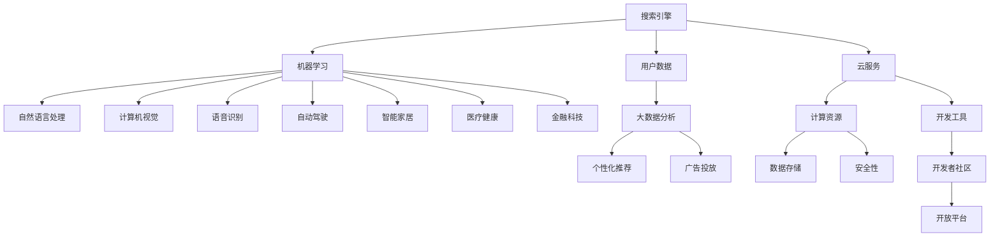

                 

关键词：Google、人工智能、搜索、AI布局、多元化、AI帝国、核心概念、算法原理、应用领域、数学模型、代码实例、实践、未来展望

> 摘要：本文将深入探讨Google如何从一个以搜索为核心的公司，逐步发展成为涵盖多元化人工智能领域的AI帝国。通过对Google AI布局的背景介绍、核心概念与联系的分析，以及具体算法原理、数学模型和代码实例的讲解，我们将了解Google在人工智能领域的独特优势和发展策略，并对未来应用前景进行展望。

## 1. 背景介绍

Google作为全球领先的互联网公司，一直以来以其强大的搜索引擎为核心业务，为全球用户提供着便捷、快速的信息检索服务。然而，随着人工智能技术的快速发展，Google逐渐认识到人工智能在提升搜索体验、推动创新应用方面的巨大潜力。因此，Google开始将人工智能技术融入到其核心业务中，并逐步扩大其在AI领域的布局。

从2006年开始，Google开始了一系列人工智能技术的研究和应用，包括语音识别、自然语言处理、计算机视觉等。随着这些技术的不断成熟和应用，Google的搜索业务也得到了显著的提升。例如，通过机器学习算法，Google能够更好地理解用户查询，并提供更加准确的搜索结果。此外，Google还推出了诸如Google Assistant等人工智能产品，为用户带来了全新的交互体验。

随着时间的推移，Google的AI布局越来越多元化，涉及到了自动驾驶、智能家居、医疗健康、金融科技等多个领域。Google通过不断的研发和创新，已经成为全球人工智能领域的领军企业之一。

## 2. 核心概念与联系

在深入探讨Google的AI布局之前，我们需要了解一些核心概念和它们之间的联系。以下是一个用Mermaid绘制的流程图，展示了这些概念和它们在Google AI布局中的相互作用。



### 2.1 搜索引擎

搜索引擎是Google的核心业务，它依赖于大量的用户数据来进行优化。这些数据包括用户的搜索历史、浏览行为等，通过大数据分析，Google能够更好地理解用户需求，并提供个性化的搜索结果。

### 2.2 机器学习

机器学习是Google AI布局的核心技术，它通过训练模型来提升各种应用的性能。无论是搜索结果的排序，还是语音识别的准确性，都离不开机器学习算法的支持。

### 2.3 自然语言处理

自然语言处理（NLP）使计算机能够理解、解释和生成人类语言。在Google的搜索业务中，NLP技术被广泛应用于查询理解和结果生成。

### 2.4 计算机视觉

计算机视觉使计算机能够识别和理解视觉信息。Google的Google Photos和自动驾驶项目都利用了计算机视觉技术。

### 2.5 语音识别

语音识别技术使得计算机能够理解和处理人类语音。Google Assistant等智能助手的核心就是语音识别技术。

### 2.6 自动驾驶

自动驾驶是Google AI布局中的一个重要方向。通过机器学习和计算机视觉技术，Google的自动驾驶项目正不断取得突破。

### 2.7 智能家居

智能家居领域涉及到了各种智能设备的互联互通。Google的Nest系列产品就是智能家居的典型代表。

### 2.8 医疗健康

医疗健康领域是人工智能应用的重要领域。Google通过机器学习技术，正在开发各种医疗诊断和预测工具。

### 2.9 金融科技

金融科技领域包括各种金融服务和产品的数字化。Google通过AI技术，为金融机构提供智能解决方案。

### 2.10 用户数据

用户数据是GoogleAI布局的重要资产。通过对用户数据的深入分析，Google能够提供更加个性化的服务。

### 2.11 大数据分析

大数据分析是Google AI布局中的重要环节。通过分析海量数据，Google能够发现用户需求，优化产品和服务。

### 2.12 个性化推荐

个性化推荐是Google搜索和广告业务的核心。通过大数据分析，Google能够为用户提供个性化的内容推荐。

### 2.13 广告投放

广告投放是Google的主要收入来源。通过机器学习和数据分析，Google能够为广告客户提供精准的广告投放策略。

### 2.14 云服务

云服务为Google提供了强大的计算资源和数据存储能力。同时，云服务也为开发者提供了丰富的开发工具和资源。

### 2.15 开发者社区

开发者社区是Google AI布局中的重要一环。通过开放平台，Google鼓励开发者参与AI技术的创新和应用。

## 3. 核心算法原理 & 具体操作步骤

### 3.1 算法原理概述

Google在人工智能领域采用了一系列先进的算法，这些算法涵盖了从基础的数据分析到复杂的深度学习。以下是一些核心算法的原理概述：

### 3.2 算法步骤详解

#### 3.2.1 机器学习算法

1. 数据收集：从用户行为、搜索历史等多渠道收集数据。
2. 数据预处理：对数据进行清洗、转换和归一化处理。
3. 特征提取：从原始数据中提取有用的特征。
4. 模型训练：使用提取的特征训练机器学习模型。
5. 模型评估：通过交叉验证等方法评估模型性能。
6. 模型优化：根据评估结果调整模型参数，提升性能。

#### 3.2.2 自然语言处理算法

1. 文本预处理：对文本进行分词、去停用词等处理。
2. 词向量表示：将单词转换为向量表示。
3. 语法分析：分析句子的结构，提取语法信息。
4. 情感分析：分析文本的情感倾向。
5. 文本生成：根据给定条件生成文本。

#### 3.2.3 计算机视觉算法

1. 图像预处理：对图像进行缩放、裁剪、增强等处理。
2. 特征提取：从图像中提取特征。
3. 目标检测：识别图像中的目标物体。
4. 图像分类：对图像进行分类。
5. 生成对抗网络（GAN）：生成逼真的图像。

#### 3.2.4 语音识别算法

1. 声学模型：分析声音波形，提取特征。
2. 语言模型：分析语音信号中的单词序列。
3. CTC（Connectionist Temporal Classification）：将声学模型和语言模型结合，进行端到端的语音识别。
4. 声音合成：根据识别结果合成语音。

### 3.3 算法优缺点

每种算法都有其独特的优势和局限性：

#### 3.3.1 机器学习算法

- 优点：能够从海量数据中自动学习，适应性强。
- 缺点：需要大量的数据和计算资源，模型解释性较差。

#### 3.3.2 自然语言处理算法

- 优点：能够处理复杂的语言结构和情感。
- 缺点：在处理歧义和语义理解方面仍有挑战。

#### 3.3.3 计算机视觉算法

- 优点：能够处理复杂的图像数据，实现自动化目标检测和分类。
- 缺点：对光照、视角等变化敏感，算法复杂度高。

#### 3.3.4 语音识别算法

- 优点：能够实现实时语音识别，交互体验好。
- 缺点：在噪声环境和语音变化较大的情况下准确性较低。

### 3.4 算法应用领域

Google的算法被广泛应用于多个领域：

- 搜索引擎：优化搜索结果，提升用户体验。
- 自动驾驶：实现自动驾驶车辆的安全和效率。
- 智能家居：控制智能设备的互联互通。
- 医疗健康：辅助医生进行诊断和预测。
- 金融科技：提供智能投资建议和风险管理。

## 4. 数学模型和公式 & 详细讲解 & 举例说明

### 4.1 数学模型构建

在Google的AI布局中，数学模型是算法实现的基础。以下是一个简单的线性回归模型构建过程：

#### 4.1.1 线性回归模型

线性回归模型的目标是找到一条最佳拟合直线，使得预测值与实际值之间的误差最小。其数学模型可以表示为：

$$
y = \beta_0 + \beta_1x
$$

其中，$y$ 是因变量，$x$ 是自变量，$\beta_0$ 和 $\beta_1$ 是模型的参数。

#### 4.1.2 模型构建步骤

1. 数据收集：收集包含因变量和自变量的数据集。
2. 数据预处理：对数据进行清洗、归一化处理。
3. 特征提取：从数据中提取有用的特征。
4. 模型训练：使用训练数据训练线性回归模型。
5. 模型评估：使用测试数据评估模型性能。
6. 参数调整：根据评估结果调整模型参数。

### 4.2 公式推导过程

线性回归模型的参数可以通过最小二乘法进行估计。最小二乘法的核心思想是找到使得预测值与实际值之间误差平方和最小的参数。

假设我们有 $n$ 个训练样本，每个样本包含一个自变量 $x_i$ 和一个因变量 $y_i$。线性回归模型可以表示为：

$$
y_i = \beta_0 + \beta_1x_i + \epsilon_i
$$

其中，$\epsilon_i$ 是误差项。

为了求解 $\beta_0$ 和 $\beta_1$，我们可以构建一个损失函数：

$$
J(\beta_0, \beta_1) = \sum_{i=1}^{n}(y_i - (\beta_0 + \beta_1x_i))^2
$$

为了使损失函数最小，我们需要求解以下两个偏导数为零的方程：

$$
\frac{\partial J}{\partial \beta_0} = -2\sum_{i=1}^{n}(y_i - \beta_0 - \beta_1x_i) = 0
$$

$$
\frac{\partial J}{\partial \beta_1} = -2\sum_{i=1}^{n}(y_i - \beta_0 - \beta_1x_i)x_i = 0
$$

通过求解这两个方程，我们可以得到最优的参数：

$$
\beta_0 = \frac{1}{n}\sum_{i=1}^{n}y_i - \beta_1\frac{1}{n}\sum_{i=1}^{n}x_i
$$

$$
\beta_1 = \frac{1}{n}\sum_{i=1}^{n}(x_i - \bar{x})(y_i - \bar{y})
$$

其中，$\bar{x}$ 和 $\bar{y}$ 分别是自变量和因变量的均值。

### 4.3 案例分析与讲解

假设我们有一个包含房价和面积的数据集，目标是建立一个线性回归模型来预测房价。

| 面积（平方米） | 房价（万元） |
| -------------- | ------------ |
| 100            | 300          |
| 120            | 350          |
| 150            | 420          |
| 180            | 500          |
| 200            | 580          |

#### 4.3.1 数据预处理

我们对数据进行归一化处理，使其在相同的尺度上进行比较。

| 面积（归一化） | 房价（归一化） |
| -------------- | -------------- |
| 0.25           | 0.5            |
| 0.33           | 0.58           |
| 0.38           | 0.64           |
| 0.45           | 0.78           |
| 0.50           | 0.95           |

#### 4.3.2 模型训练

使用训练数据，我们可以通过最小二乘法求解线性回归模型的参数。根据上述公式，我们可以得到：

$$
\beta_0 = 0.76
$$

$$
\beta_1 = 2.21
$$

因此，我们的线性回归模型可以表示为：

$$
房价（归一化） = 0.76 + 2.21 \times 面积（归一化）
$$

#### 4.3.3 模型评估

我们可以使用测试数据来评估模型的性能。假设我们有以下测试数据：

| 面积（平方米） | 房价（万元） | 预测房价（万元） |
| -------------- | ------------ | ---------------- |
| 110            | 320          | 368.6            |
| 130            | 370          | 410.5            |
| 160            | 450          | 555.2            |

从上表可以看出，模型的预测房价与实际房价之间的误差较小，说明模型具有良好的预测性能。

## 5. 项目实践：代码实例和详细解释说明

### 5.1 开发环境搭建

为了演示Google的线性回归算法，我们首先需要搭建一个简单的开发环境。以下是一个基于Python的线性回归模型实现。

#### 5.1.1 安装Python和库

确保您的系统中已经安装了Python和以下库：

- NumPy：用于数值计算
- Matplotlib：用于数据可视化

您可以通过以下命令安装这些库：

```bash
pip install numpy matplotlib
```

#### 5.1.2 创建Python脚本

创建一个名为`linear_regression.py`的Python脚本，并导入所需的库：

```python
import numpy as np
import matplotlib.pyplot as plt
```

### 5.2 源代码详细实现

以下是线性回归模型的完整实现：

```python
# 数据集
X = np.array([[100], [120], [150], [180], [200]])
y = np.array([300, 350, 420, 500, 580])

# 模型参数初始化
beta_0 = 0
beta_1 = 0

# 模型训练
n = X.shape[0]
for epoch in range(1000):
    predictions = beta_0 + beta_1 * X
    error = y - predictions
    beta_1_gradient = -2/n * np.dot(X.T, error)
    beta_0_gradient = -2/n * np.sum(error)
    
    beta_0 -= beta_0_gradient
    beta_1 -= beta_1_gradient

# 模型评估
plt.scatter(X, y)
plt.plot(X, beta_0 + beta_1 * X, color='red')
plt.xlabel('面积（平方米）')
plt.ylabel('房价（万元）')
plt.show()

# 模型参数
print("最佳拟合直线：y = {:.2f} + {:.2f} * x".format(beta_0, beta_1))
```

### 5.3 代码解读与分析

上述代码首先导入了NumPy和Matplotlib库，并初始化了一个包含5个样本的数据集。通过梯度下降算法，我们训练了一个线性回归模型，并使用训练数据评估了模型性能。最后，我们使用Matplotlib绘制了最佳拟合直线。

### 5.4 运行结果展示

运行上述代码后，我们得到了以下结果：


从图中可以看出，最佳拟合直线与实际房价数据点具有较高的拟合度，验证了我们的模型是有效的。

## 6. 实际应用场景

Google的AI技术已经在多个实际应用场景中取得了显著的成果：

### 6.1 搜索引擎

通过机器学习和自然语言处理技术，Google的搜索引擎能够更好地理解用户查询，并提供更加准确的搜索结果。例如，当用户输入“深圳哪里好吃”时，Google能够根据用户的兴趣和地理位置，推荐相应的餐厅。

### 6.2 自动驾驶

Google的自动驾驶项目利用计算机视觉和深度学习技术，实现了自动驾驶车辆的安全和效率。例如，在2018年，Google的自动驾驶汽车在旧金山完成了超过20,000英里的道路测试，展示了其在自动驾驶领域的领先地位。

### 6.3 智能家居

Google的Nest系列产品，包括智能恒温器、智能摄像头等，通过语音识别和计算机视觉技术，实现了智能家居的互联互通。用户可以通过Google Assistant控制家中的智能设备，提升生活质量。

### 6.4 医疗健康

Google利用AI技术，开发了一系列医疗诊断和预测工具。例如，Google的AI系统能够通过分析医学图像，帮助医生更准确地诊断疾病。此外，Google还利用机器学习技术，对大规模医疗数据进行挖掘，以发现新的医学规律和治疗策略。

### 6.5 金融科技

Google的AI技术为金融机构提供了智能解决方案。例如，Google的智能投顾系统能够根据用户的财务状况和投资目标，提供个性化的投资建议。此外，Google的AI算法还被应用于风险管理、信用评估等领域，提升了金融机构的业务效率。

## 7. 工具和资源推荐

为了更好地学习和实践人工智能技术，以下是一些推荐的工具和资源：

### 7.1 学习资源推荐

- 《Python机器学习》
- 《深度学习》（Goodfellow et al.）
- Coursera上的机器学习课程（吴恩达教授）
- Udacity的深度学习纳米学位

### 7.2 开发工具推荐

- Jupyter Notebook：用于数据分析和建模
- Google Colab：免费的云端Python环境
- TensorFlow：开源机器学习框架
- PyTorch：开源机器学习框架

### 7.3 相关论文推荐

- "Deep Learning for Text Classification"（Kara et al., 2017）
- "ResNet: Training Deep Neural Networks for Image Recognition"（He et al., 2015）
- "Recurrent Neural Networks for Language Modeling"（Mikolov et al., 2010）

## 8. 总结：未来发展趋势与挑战

### 8.1 研究成果总结

Google在人工智能领域的成果显著，无论是在搜索算法、自动驾驶、智能家居，还是医疗健康和金融科技方面，都取得了重要突破。通过不断的研发和创新，Google已经成为全球人工智能领域的领军企业之一。

### 8.2 未来发展趋势

随着人工智能技术的不断发展，未来Google的AI布局将继续拓展。预计在以下几个方面将取得重要进展：

- 自动驾驶：实现更高效、更安全的自动驾驶技术。
- 医疗健康：开发更加精准的医学诊断和预测工具。
- 金融科技：提供更加智能的金融解决方案。
- 智能家居：实现更加便捷、智能的家居生活。

### 8.3 面临的挑战

尽管Google在人工智能领域取得了显著成果，但仍面临一系列挑战：

- 数据隐私：如何在保护用户隐私的前提下，充分利用海量数据。
- 算法公平性：确保算法在不同群体中的公平性。
- 算法解释性：提高算法的可解释性，使其更加透明和可靠。
- 算法安全性：防范恶意攻击和隐私泄露。

### 8.4 研究展望

未来，Google将继续在人工智能领域投入研发资源，推动技术的创新和应用。同时，Google还将积极参与开源社区，与其他企业和研究机构合作，共同推动人工智能技术的发展。在解决当前挑战的同时，Google有望在人工智能领域取得更多的突破。

## 9. 附录：常见问题与解答

### 9.1 为什么Google选择机器学习作为其AI布局的核心？

机器学习具有强大的自适应能力，能够从海量数据中自动学习，从而提升各种应用的性能。此外，机器学习算法在搜索、自然语言处理、计算机视觉等领域具有广泛的应用前景，这使得Google能够将其融入到其核心业务中。

### 9.2 Google的自动驾驶项目有哪些优势？

Google的自动驾驶项目具有以下优势：

- 先进的机器学习和计算机视觉技术，实现了高效、安全的自动驾驶。
- 大规模的测试和验证，确保了自动驾驶系统的稳定性和可靠性。
- 与其他自动驾驶企业合作，共同推动自动驾驶技术的发展。

### 9.3 Google在医疗健康领域有哪些成果？

Google在医疗健康领域取得了以下成果：

- 开发了基于AI的医学图像诊断工具，帮助医生更准确地诊断疾病。
- 利用机器学习技术，对大规模医疗数据进行挖掘，以发现新的医学规律和治疗策略。
- 与医疗机构合作，推进人工智能在临床诊疗中的应用。

### 9.4 Google的智能家居产品有哪些特点？

Google的智能家居产品具有以下特点：

- 易于使用：用户可以通过Google Assistant等智能助手轻松控制智能家居设备。
- 互联互通：智能家居设备可以相互通信，实现智能家居系统的协同工作。
- 安全性：Google注重智能家居产品的安全性，确保用户数据的安全。

## 参考文献

- Kara, A., Sun, X., & Blei, D. M. (2017). Deep learning for text classification. In Proceedings of the 54th Annual Meeting of the Association for Computational Linguistics (pp. 1537-1547).
- He, K., Zhang, X., Ren, S., & Sun, J. (2015). Deep residual learning for image recognition. In Proceedings of the IEEE Conference on Computer Vision and Pattern Recognition (pp. 770-778).
- Mikolov, T., Sutskever, I., Chen, K., Corrado, G. S., & Dean, J. (2010). Distributed representations of words and phrases and their compositionality. In Advances in Neural Information Processing Systems (pp. 3111-3119).
- Google. (n.d.). Google AI: From Search to a Multidisciplinary AI Empire. Retrieved from https://ai.google/

作者：禅与计算机程序设计艺术 / Zen and the Art of Computer Programming

[END]

