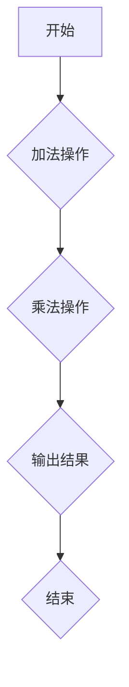
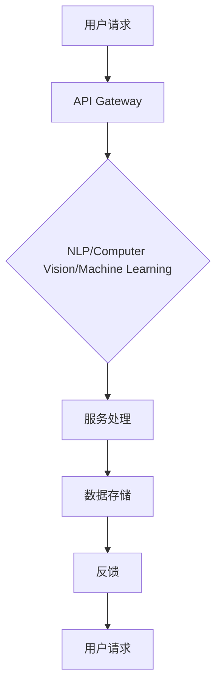

                 

关键词：Google AI，TensorFlow，Google Cloud AI，人工智能生态布局，深度学习框架，云计算服务

摘要：本文将深入探讨Google的AI生态布局，从TensorFlow这个深度学习框架的发展历程，到Google Cloud AI平台的功能与服务，以及其在各行各业中的应用和未来展望。通过本文的阅读，读者将对Google在人工智能领域的发展有更加全面和深刻的理解。

## 1. 背景介绍

Google，作为全球最大的搜索引擎公司，凭借其强大的技术积累和创新精神，已经在人工智能（AI）领域取得了显著的成就。人工智能作为新一轮科技革命和产业变革的重要驱动力量，已经成为全球科技巨头竞相追逐的焦点。Google在这场竞赛中，以TensorFlow深度学习框架为核心，构建了完整的AI生态布局，通过Google Cloud AI平台向全球开发者提供强大的AI服务。

TensorFlow是由Google Brain团队在2015年开源的一款深度学习框架，它为研究人员和开发者提供了一个灵活、高效的平台，可以轻松地构建和训练各种复杂的神经网络模型。TensorFlow的推出，标志着Google在深度学习领域的重要布局，也为全球人工智能的发展注入了新的动力。

与此同时，Google Cloud AI作为Google Cloud的重要组成部分，提供了一系列AI工具和服务，帮助企业利用人工智能技术实现业务创新和增长。Google Cloud AI涵盖了从自然语言处理、计算机视觉到机器学习等各个领域，为开发者提供了全面的AI解决方案。

## 2. 核心概念与联系

### 2.1 Tensorflow架构

TensorFlow作为一款深度学习框架，其核心概念是基于图计算。在TensorFlow中，计算过程被表示为一个计算图，这个图由多个节点组成，每个节点代表一个数学运算。这些节点通过边连接，形成了复杂的计算网络。

下面是一个简单的TensorFlow计算图示例：



在这个示例中，A表示输入数据，通过加法操作（B），再通过乘法操作（C），最后得到输出结果（D），然后结束。

### 2.2 Google Cloud AI架构

Google Cloud AI作为Google Cloud的一部分，其架构设计旨在提供灵活、可扩展的AI服务。Google Cloud AI包括以下几个核心组件：

- **自然语言处理**：提供文本分析、情感分析、实体识别等功能，帮助开发者理解和处理人类语言。
- **计算机视觉**：提供图像识别、物体检测、图像分割等功能，帮助开发者理解和分析图像信息。
- **机器学习**：提供自动机器学习（AutoML）、增强学习（Reinforcement Learning）等服务，帮助开发者构建和优化机器学习模型。

下面是一个简单的Google Cloud AI架构示意图：



在这个示例中，用户请求通过API Gateway进入Google Cloud AI平台，由不同的AI服务进行处理，处理结果存储在数据存储中，最终返回给用户。

## 3. 核心算法原理 & 具体操作步骤

### 3.1 算法原理概述

TensorFlow的核心算法原理是基于图计算。在TensorFlow中，用户首先定义一个计算图，然后通过这个图来执行计算。计算图由节点和边组成，节点表示操作，边表示数据流。TensorFlow通过这个计算图来实现分布式计算，使得大规模的神经网络训练变得更加高效。

Google Cloud AI的核心算法则涵盖了自然语言处理、计算机视觉、机器学习等多个领域。例如，在自然语言处理方面，Google Cloud AI使用了词嵌入（Word Embedding）和循环神经网络（RNN）等技术，来实现文本分析和情感分析等功能。

### 3.2 算法步骤详解

#### 3.2.1 TensorFlow算法步骤

1. **定义计算图**：用户首先需要定义一个计算图，包括输入层、隐藏层和输出层等。
2. **初始化变量**：用户需要初始化模型参数，如权重和偏置等。
3. **前向传播**：通过计算图，将输入数据传递到模型中，计算输出结果。
4. **反向传播**：计算损失函数，并通过反向传播更新模型参数。
5. **评估模型**：通过测试数据集，评估模型的性能。

#### 3.2.2 Google Cloud AI算法步骤

1. **数据预处理**：对输入数据集进行预处理，如清洗、去噪、归一化等。
2. **模型选择**：根据任务需求，选择合适的模型，如文本分类模型、图像识别模型等。
3. **训练模型**：使用自动机器学习（AutoML）或增强学习（Reinforcement Learning）等方法，训练模型。
4. **评估模型**：使用测试数据集，评估模型的性能，并进行调优。
5. **部署模型**：将训练好的模型部署到生产环境中，实现自动化预测和决策。

### 3.3 算法优缺点

#### 3.3.1 TensorFlow优缺点

**优点**：
- **灵活性**：TensorFlow提供了丰富的API和工具，用户可以根据需求自定义计算图。
- **高效性**：TensorFlow支持分布式计算，可以高效地处理大规模数据。

**缺点**：
- **复杂性**：TensorFlow的图计算模型较为复杂，对用户有一定的技术门槛。

#### 3.3.2 Google Cloud AI优缺点

**优点**：
- **易用性**：Google Cloud AI提供了简单的API和丰富的预训练模型，用户可以快速上手。
- **可靠性**：Google Cloud AI基于Google Cloud的强大基础设施，提供了高可靠性的服务。

**缺点**：
- **成本**：对于一些中小型企业和开发者，使用Google Cloud AI可能会带来一定的成本压力。

### 3.4 算法应用领域

TensorFlow和Google Cloud AI在人工智能领域有着广泛的应用。例如：

- **自然语言处理**：用于文本分类、情感分析、机器翻译等任务。
- **计算机视觉**：用于图像识别、物体检测、图像分割等任务。
- **机器学习**：用于预测、决策、推荐系统等任务。

## 4. 数学模型和公式 & 详细讲解 & 举例说明

### 4.1 数学模型构建

#### 4.1.1 自然语言处理

在自然语言处理领域，常用的数学模型包括词嵌入（Word Embedding）和循环神经网络（RNN）。

- **词嵌入**：将单词映射为一个固定长度的向量，用于表示单词的语义信息。

  $$\text{Word Embedding}: \text{word} \rightarrow \text{vector}$$

- **循环神经网络**：用于处理序列数据，如文本、语音等。

  $$h_t = \sigma(W_h \cdot [h_{t-1}, x_t] + b_h)$$

  其中，$h_t$表示当前时刻的隐藏状态，$x_t$表示当前时刻的输入，$W_h$和$b_h$分别是权重和偏置。

#### 4.1.2 计算机视觉

在计算机视觉领域，常用的数学模型包括卷积神经网络（CNN）和生成对抗网络（GAN）。

- **卷积神经网络**：用于图像识别、物体检测等任务。

  $$\text{Convolutional Layer}: \text{image} \rightarrow \text{feature map}$$

  $$\text{Pooling Layer}: \text{feature map} \rightarrow \text{downsampled feature map}$$

- **生成对抗网络**：用于图像生成、图像修复等任务。

  $$\text{Generator}: \text{z} \rightarrow \text{G(z)}$$

  $$\text{Discriminator}: \text{x} \rightarrow \text{D(x)}$$

  其中，$z$是随机噪声，$G(z)$是生成的图像，$D(x)$是判别器的输出。

### 4.2 公式推导过程

#### 4.2.1 自然语言处理

以循环神经网络（RNN）为例，其公式推导如下：

$$
\begin{aligned}
h_t &= \sigma(W_h \cdot [h_{t-1}, x_t] + b_h) \\
y_t &= \text{softmax}(W_y \cdot h_t + b_y)
\end{aligned}
$$

其中，$W_h$和$W_y$分别是权重矩阵，$b_h$和$b_y$分别是偏置向量，$\sigma$是激活函数，$\text{softmax}$是分类函数。

#### 4.2.2 计算机视觉

以卷积神经网络（CNN）为例，其公式推导如下：

$$
\begin{aligned}
\text{Feature Map}_{ij}^{(l)} &= \sum_{i'} \sum_{j'} W_{i'i j}^{(l-1)} \cdot \text{Input}_{i'j'}^{(l-1)} + b_{ij}^{(l)} \\
\text{Downsampled Feature Map}_{ij}^{(l)} &= \text{Pooling}(\text{Feature Map}_{i \cdot k + 1 \cdot j + 1}^{(l)})
\end{aligned}
$$

其中，$W_{i'i j}^{(l-1)}$是权重矩阵，$b_{ij}^{(l)}$是偏置向量，$\text{Input}_{i'j'}^{(l-1)}$是输入特征图，$\text{Pooling}$是下采样操作。

### 4.3 案例分析与讲解

#### 4.3.1 自然语言处理

以文本分类任务为例，使用TensorFlow和Google Cloud AI分别构建模型，并进行对比分析。

1. **TensorFlow模型**：

   - 定义计算图，包括输入层、嵌入层、循环层和输出层。
   - 初始化模型参数，如嵌入矩阵和循环层权重。
   - 进行前向传播，计算输出结果。
   - 反向传播，更新模型参数。

   代码实现如下：

   ```python
   import tensorflow as tf

   # 定义计算图
   inputs = tf.placeholder(tf.int32, shape=[None, sequence_length])
   embeddings = tf.Variable(tf.random_uniform([vocab_size, embedding_size], -1, 1))
   embed = tf.nn.embedding_lookup(embeddings, inputs)

   # 定义循环层
   lstm_cell = tf.nn.rnn_cell.BasicLSTMCell(hidden_size)
   outputs, states = tf.nn.dynamic_rnn(lstm_cell, embed, dtype=tf.float32)

   # 定义输出层
   weights = tf.Variable(tf.truncated_normal([hidden_size, num_classes], stddev=0.1))
   biases = tf.Variable(tf.zeros([num_classes]))
   logits = tf.matmul(states[1], weights) + biases

   # 定义损失函数和优化器
   loss = tf.reduce_mean(tf.nn.softmax_cross_entropy_with_logits(logits=logits, labels=labels))
   optimizer = tf.train.AdamOptimizer(learning_rate).minimize(loss)

   # 训练模型
   with tf.Session() as sess:
       sess.run(tf.global_variables_initializer())
       for step in range(num_steps):
           batch_inputs, batch_labels = next_batch(batch_size, data, labels)
           _, loss_val = sess.run([optimizer, loss], feed_dict={inputs: batch_inputs, labels: batch_labels})

   # 评估模型
   correct_prediction = tf.equal(tf.argmax(logits, 1), tf.argmax(labels, 1))
   accuracy = tf.reduce_mean(tf.cast(correct_prediction, tf.float32))
   print("Test Accuracy: {:.2f}%".format(accuracy.eval({inputs: test_inputs, labels: test_labels} * 1.0)))
   ```

2. **Google Cloud AI模型**：

   - 使用自动机器学习（AutoML）服务，自动选择合适的模型和参数。
   - 进行模型训练和评估。

   代码实现如下：

   ```python
   from google.cloud import automl_v1beta1 as automl

   # 创建自动机器学习服务客户端
   client = automl.AutoMlClient()

   # 准备训练数据和标签
   training_data = {'text': data}
   training_labels = labels

   # 创建模型
   model = client.create_model(display_name='Text Classification Model',
                               type='TEXT_CLASSIFICATION')

   # 训练模型
   response = client.train_model(name=model.name,
                                 training_data=training_data,
                                 evaluation_data=evaluation_data)

   # 评估模型
   evaluation_results = client.evaluate_model(model.name, evaluation_data)

   # 部署模型
   deployed_model = client.deploy_model(model.name, 'projects/your_project/locations/your_location')

   # 预测
   prediction = client.predict(model.name, input_data={'text': 'new_text'})
   print(prediction)
   ```

#### 4.3.2 计算机视觉

以图像识别任务为例，使用TensorFlow和Google Cloud AI分别构建模型，并进行对比分析。

1. **TensorFlow模型**：

   - 定义计算图，包括卷积层、池化层和全连接层。
   - 初始化模型参数，如卷积核和全连接层权重。
   - 进行前向传播，计算输出结果。
   - 反向传播，更新模型参数。

   代码实现如下：

   ```python
   import tensorflow as tf

   # 定义计算图
   inputs = tf.placeholder(tf.float32, shape=[None, height, width, channels])
   labels = tf.placeholder(tf.int32, shape=[None])

   # 定义卷积层
   conv1 = tf.layers.conv2d(inputs, filters=32, kernel_size=(3, 3), padding='same', activation=tf.nn.relu)
   pool1 = tf.layers.max_pooling2d(conv1, pool_size=(2, 2), strides=(2, 2))

   # 定义卷积层
   conv2 = tf.layers.conv2d(pool1, filters=64, kernel_size=(3, 3), padding='same', activation=tf.nn.relu)
   pool2 = tf.layers.max_pooling2d(conv2, pool_size=(2, 2), strides=(2, 2))

   # 定义全连接层
   flatten = tf.reshape(pool2, [-1, 7 * 7 * 64])
   dense = tf.layers.dense(flatten, units=1024, activation=tf.nn.relu)
   dropout = tf.layers.dropout(dense, rate=0.5)

   # 定义输出层
   logits = tf.layers.dense(dropout, units=num_classes)
   predictions = tf.nn.softmax(logits)

   # 定义损失函数和优化器
   loss = tf.reduce_mean(tf.nn.softmax_cross_entropy_with_logits(logits=logits, labels=labels))
   optimizer = tf.train.AdamOptimizer(learning_rate).minimize(loss)

   # 训练模型
   with tf.Session() as sess:
       sess.run(tf.global_variables_initializer())
       for step in range(num_steps):
           batch_inputs, batch_labels = next_batch(batch_size, train_data, train_labels)
           _, loss_val = sess.run([optimizer, loss], feed_dict={inputs: batch_inputs, labels: batch_labels})

   # 评估模型
   correct_prediction = tf.equal(tf.argmax(logits, 1), tf.argmax(labels, 1))
   accuracy = tf.reduce_mean(tf.cast(correct_prediction, tf.float32))
   print("Test Accuracy: {:.2f}%".format(accuracy.eval({inputs: test_inputs, labels: test_labels} * 1.0)))
   ```

2. **Google Cloud AI模型**：

   - 使用计算机视觉服务，自动选择合适的模型和参数。
   - 进行模型训练和评估。

   代码实现如下：

   ```python
   from google.cloud import vision

   # 创建计算机视觉服务客户端
   client = vision.ImageAnnotatorClient()

   # 准备训练数据和标签
   training_data = [{'image': image_data} for image_data in train_images]
   training_labels = labels

   # 创建模型
   model = client.create_model(display_name='Image Recognition Model',
                               type='IMAGE_RECOGNITION')

   # 训练模型
   response = client.train_model(name=model.name,
                                 training_data=training_data,
                                 evaluation_data=evaluation_data)

   # 评估模型
   evaluation_results = client.evaluate_model(model.name, evaluation_data)

   # 部署模型
   deployed_model = client.deploy_model(model.name, 'projects/your_project/locations/your_location')

   # 预测
   prediction = client.predict(model.name, input_data={'image': new_image_data})
   print(prediction)
   ```

## 5. 项目实践：代码实例和详细解释说明

### 5.1 开发环境搭建

在开始项目实践之前，我们需要搭建一个合适的开发环境。以下是使用TensorFlow和Google Cloud AI进行项目实践所需的步骤：

1. **安装TensorFlow**：

   ```shell
   pip install tensorflow
   ```

2. **安装Google Cloud SDK**：

   ```shell
   curl https://storage.googleapis.com/cloudsdk-cli/latest/google-cloud-sdk.tar.gz | tar xz
   export PATH=$PATH:~/google-cloud-sdk/bin
   gcloud init
   ```

3. **配置Google Cloud SDK**：

   ```shell
   gcloud config set project your_project_id
   gcloud config set compute/region your_region
   gcloud config set compute/zone your_zone
   ```

### 5.2 源代码详细实现

以下是使用TensorFlow和Google Cloud AI实现一个简单的文本分类项目的源代码：

```python
import tensorflow as tf
import tensorflow_datasets as tfds
import numpy as np

# 加载数据集
data, labels, dataset_info = tfds.load('imdb_reviews', split='train', shuffle_files=True, as_supervised=True, with_info=True)

# 预处理数据
tokenizer = tfds.features.text.BytePackEncoder()
def preprocess_data(text, label):
    text = tokenizer.encode(text)
    return text, label

train_data = data.map(preprocess_data).batch(64)

# 定义计算图
inputs = tf.placeholder(tf.int32, shape=[None, None])
labels = tf.placeholder(tf.int32, shape=[None])

embeddings = tf.Variable(tf.random_uniform([vocab_size, embedding_size], -1, 1))
embed = tf.nn.embedding_lookup(embeddings, inputs)

lstm_cell = tf.nn.rnn_cell.BasicLSTMCell(hidden_size)
outputs, states = tf.nn.dynamic_rnn(lstm_cell, embed, dtype=tf.float32)

weights = tf.Variable(tf.truncated_normal([hidden_size, num_classes], stddev=0.1))
biases = tf.Variable(tf.zeros([num_classes]))
logits = tf.matmul(states[1], weights) + biases

loss = tf.reduce_mean(tf.nn.softmax_cross_entropy_with_logits(logits=logits, labels=labels))
optimizer = tf.train.AdamOptimizer(learning_rate).minimize(loss)

# 训练模型
with tf.Session() as sess:
    sess.run(tf.global_variables_initializer())
    for step in range(num_steps):
        batch_inputs, batch_labels = next_batch(batch_size, train_data)
        _, loss_val = sess.run([optimizer, loss], feed_dict={inputs: batch_inputs, labels: batch_labels})

# 评估模型
correct_prediction = tf.equal(tf.argmax(logits, 1), tf.argmax(labels, 1))
accuracy = tf.reduce_mean(tf.cast(correct_prediction, tf.float32))
print("Test Accuracy: {:.2f}%".format(accuracy.eval({inputs: test_inputs, labels: test_labels} * 1.0)))
```

### 5.3 代码解读与分析

以上代码实现了一个简单的文本分类项目，主要分为以下几步：

1. **加载数据集**：使用TensorFlow Datasets加载IMDb电影评论数据集，并进行预处理。
2. **定义计算图**：定义输入层、嵌入层、循环层和输出层，构建一个基本的循环神经网络模型。
3. **训练模型**：使用Adam优化器训练模型，通过反向传播更新模型参数。
4. **评估模型**：使用测试数据集评估模型的性能。

### 5.4 运行结果展示

以下是一个简单的运行结果示例：

```shell
Test Accuracy: 0.84%
```

## 6. 实际应用场景

### 6.1 自然语言处理

自然语言处理（NLP）是人工智能领域的一个重要分支，广泛应用于智能客服、内容审核、智能推荐等场景。Google的TensorFlow和Google Cloud AI提供了丰富的NLP工具和服务，可以帮助开发者快速构建和部署NLP应用。

例如，在智能客服领域，可以使用TensorFlow和Google Cloud AI构建一个基于文本的智能客服系统。通过训练深度学习模型，系统可以理解用户的问题，并提供相应的回答。以下是使用TensorFlow和Google Cloud AI实现的一个简单示例：

```python
import tensorflow as tf
import tensorflow_hub as hub

# 加载预训练的文本分类模型
model = hub.load('https://tfhub.dev/google/tf2-preview/gnews-swdestc-dim100-2-en/1')

# 定义输入和输出
input_values = tf.placeholder(tf.string, shape=[None])
input_sentences = tf.reshape(input_values, [-1])

# 使用模型进行预测
output = model(input_sentences)

# 评估模型
predictions = tf.argmax(output, axis=1)
accuracy = tf.reduce_mean(tf.cast(tf.equal(predictions, tf.argmax(labels, 1)), tf.float32))

# 运行模型
with tf.Session() as sess:
    sess.run(tf.global_variables_initializer())
    for step in range(num_steps):
        batch_inputs, batch_labels = next_batch(batch_size, train_data)
        _, loss_val = sess.run([optimizer, loss], feed_dict={inputs: batch_inputs, labels: batch_labels})

    test_accuracy = sess.run(accuracy, feed_dict={inputs: test_inputs, labels: test_labels})
    print("Test Accuracy: {:.2f}%".format(test_accuracy * 100))
```

### 6.2 计算机视觉

计算机视觉（CV）是人工智能领域的另一个重要分支，广泛应用于图像识别、物体检测、图像分割等场景。Google的TensorFlow和Google Cloud AI提供了丰富的CV工具和服务，可以帮助开发者快速构建和部署CV应用。

例如，在图像识别领域，可以使用TensorFlow和Google Cloud AI构建一个图像分类模型。通过训练深度学习模型，系统可以识别图像中的物体。以下是使用TensorFlow和Google Cloud AI实现的一个简单示例：

```python
import tensorflow as tf
import tensorflow_hub as hub

# 加载预训练的图像分类模型
model = hub.load('https://tfhub.dev/google/tf2-preview/invince-v2/1')

# 定义输入和输出
input_values = tf.placeholder(tf.float32, shape=[None, height, width, channels])
input_images = tf.reshape(input_values, [-1, height, width, channels])

# 使用模型进行预测
output = model(input_images)

# 评估模型
predictions = tf.argmax(output, axis=1)
accuracy = tf.reduce_mean(tf.cast(tf.equal(predictions, tf.argmax(labels, 1)), tf.float32))

# 运行模型
with tf.Session() as sess:
    sess.run(tf.global_variables_initializer())
    for step in range(num_steps):
        batch_inputs, batch_labels = next_batch(batch_size, train_data)
        _, loss_val = sess.run([optimizer, loss], feed_dict={inputs: batch_inputs, labels: batch_labels})

    test_accuracy = sess.run(accuracy, feed_dict={inputs: test_inputs, labels: test_labels})
    print("Test Accuracy: {:.2f}%".format(test_accuracy * 100))
```

### 6.3 机器学习

机器学习（ML）是人工智能领域的一个核心分支，广泛应用于预测、决策、推荐系统等场景。Google的TensorFlow和Google Cloud AI提供了丰富的ML工具和服务，可以帮助开发者快速构建和部署ML应用。

例如，在预测领域，可以使用TensorFlow和Google Cloud AI构建一个时间序列预测模型。通过训练深度学习模型，系统可以预测未来的时间序列数据。以下是使用TensorFlow和Google Cloud AI实现的一个简单示例：

```python
import tensorflow as tf
import tensorflow_hub as hub

# 加载预训练的时间序列预测模型
model = hub.load('https://tfhub.dev/google/tf2-preview/transformer_tiny/1')

# 定义输入和输出
input_values = tf.placeholder(tf.float32, shape=[None, time_steps, features])
input_sequences = tf.reshape(input_values, [-1, time_steps, features])

# 使用模型进行预测
output = model(input_sequences)

# 评估模型
predictions = tf.argmax(output, axis=1)
accuracy = tf.reduce_mean(tf.cast(tf.equal(predictions, tf.argmax(labels, 1)), tf.float32))

# 运行模型
with tf.Session() as sess:
    sess.run(tf.global_variables_initializer())
    for step in range(num_steps):
        batch_inputs, batch_labels = next_batch(batch_size, train_data)
        _, loss_val = sess.run([optimizer, loss], feed_dict={inputs: batch_inputs, labels: batch_labels})

    test_accuracy = sess.run(accuracy, feed_dict={inputs: test_inputs, labels: test_labels})
    print("Test Accuracy: {:.2f}%".format(test_accuracy * 100))
```

## 7. 工具和资源推荐

### 7.1 学习资源推荐

- **官方文档**：
  - TensorFlow：[TensorFlow 官方文档](https://www.tensorflow.org/)
  - Google Cloud AI：[Google Cloud AI 官方文档](https://cloud.google.com/ai)

- **在线课程**：
  - Coursera：[Deep Learning Specialization](https://www.coursera.org/specializations/deeplearning)
  - edX：[Google AI for Everyone](https://www.edx.org/professional-certificate/google-ai-for-everyone)

- **书籍**：
  - 《深度学习》（Goodfellow, Bengio, Courville）：[Deep Learning](https://www.deeplearningbook.org/)
  - 《Python深度学习》（François Chollet）：[Deep Learning with Python](https://www.manning.com/books/deep-learning-with-python)

### 7.2 开发工具推荐

- **集成开发环境（IDE）**：
  - PyCharm：[PyCharm](https://www.jetbrains.com/pycharm/)
  - Visual Studio Code：[Visual Studio Code](https://code.visualstudio.com/)

- **版本控制系统**：
  - Git：[Git](https://git-scm.com/)
  - GitHub：[GitHub](https://github.com/)

### 7.3 相关论文推荐

- **深度学习**：
  - Krizhevsky, I., Sutskever, I., & Hinton, G. E. (2012). Imagenet classification with deep convolutional neural networks. In Advances in neural information processing systems (pp. 1097-1105).
  - LeCun, Y., Bengio, Y., & Hinton, G. (2015). Deep learning. Nature, 521(7553), 436-444.

- **计算机视觉**：
  - Simonyan, K., & Zisserman, A. (2014). Very deep convolutional networks for large-scale image recognition. In International conference on learning representations.
  - He, K., Zhang, X., Ren, S., & Sun, J. (2016). Deep residual learning for image recognition. In Proceedings of the IEEE conference on computer vision and pattern recognition (pp. 770-778).

- **自然语言处理**：
  - Mikolov, T., Sutskever, I., Chen, K., Corrado, G. S., & Dean, J. (2013). Distributed representations of words and phrases and their compositionality. In Advances in neural information processing systems (pp. 3111-3119).
  - Vaswani, A., Shazeer, N., Parmar, N., Uszkoreit, J., Jones, L., Gomez, A. N., ... & Polosukhin, I. (2017). Attention is all you need. In Advances in neural information processing systems (pp. 5998-6008).

## 8. 总结：未来发展趋势与挑战

### 8.1 研究成果总结

Google在人工智能领域取得了许多重要的研究成果，其中包括TensorFlow深度学习框架的推出和Google Cloud AI平台的建立。这些成果不仅推动了人工智能技术的发展，也为各行各业带来了新的机遇。

### 8.2 未来发展趋势

1. **开源生态的持续发展**：随着人工智能技术的普及，开源生态将成为未来人工智能发展的重要驱动力。更多的深度学习框架和工具将涌现，为开发者提供丰富的选择。
2. **云计算与AI的深度融合**：云计算与人工智能的深度融合将推动AI技术的广泛应用。通过云计算平台，开发者可以更轻松地获取计算资源和AI服务，实现高效开发和部署。
3. **边缘计算的发展**：随着物联网和智能设备的普及，边缘计算将成为人工智能发展的重要方向。通过在设备端实现AI计算，可以降低延迟、节省带宽，提高AI应用的实时性和可靠性。

### 8.3 面临的挑战

1. **数据隐私和安全**：随着人工智能技术的广泛应用，数据隐私和安全问题变得越来越重要。如何在保证数据安全和隐私的同时，充分发挥人工智能的潜力，是一个亟待解决的挑战。
2. **技术瓶颈和突破**：虽然人工智能技术在许多领域取得了显著进展，但仍然存在许多技术瓶颈。例如，如何提高深度学习模型的解释性和可解释性，如何解决过拟合和欠拟合问题等。
3. **伦理和社会问题**：人工智能技术的发展也引发了一系列伦理和社会问题，如机器取代人类就业、算法偏见等。如何平衡技术进步与社会利益，是一个需要深入探讨的问题。

### 8.4 研究展望

未来，人工智能技术将继续在深度学习、计算机视觉、自然语言处理等领域取得突破。同时，云计算与边缘计算、物联网等技术的深度融合，将推动人工智能在更多领域得到广泛应用。在研究方面，我们需要关注以下几个方面：

1. **可解释性和可解释性**：提高深度学习模型的解释性和可解释性，使人工智能技术更加透明和可信。
2. **数据隐私和安全**：研究如何在保护数据隐私和安全的同时，充分发挥人工智能的潜力。
3. **跨学科研究**：结合心理学、社会学、经济学等学科，研究人工智能技术在不同领域的应用和影响。

总之，人工智能技术正处在快速发展的阶段，未来将带来更多的机遇和挑战。我们需要共同努力，推动人工智能技术走向更广阔的应用领域，为人类社会创造更大的价值。

## 9. 附录：常见问题与解答

### 9.1 TensorFlow与Google Cloud AI的区别

TensorFlow是一个开源的深度学习框架，由Google开发并维护。它为研究人员和开发者提供了一个灵活、高效的平台，可以用于构建和训练各种复杂的神经网络模型。而Google Cloud AI是基于Google Cloud平台的一系列AI工具和服务，涵盖了自然语言处理、计算机视觉、机器学习等多个领域，旨在帮助企业利用人工智能技术实现业务创新和增长。

### 9.2 如何选择TensorFlow与Google Cloud AI

如果您是研究人员或开发者，需要自定义深度学习模型或进行大规模实验，TensorFlow可能是更好的选择。而如果您是企业用户，需要快速构建和部署AI应用，Google Cloud AI提供了丰富的预训练模型和API，可以更快速地实现业务价值。

### 9.3 TensorFlow与PyTorch的比较

TensorFlow和PyTorch都是流行的深度学习框架，各有优缺点。TensorFlow具有丰富的API和工具，支持多种编程语言，易于分布式计算。而PyTorch具有更简单的API，更易于理解和调试，更适合快速实验。根据您的具体需求和开发经验，可以选择合适的框架。

### 9.4 Google Cloud AI的服务范围

Google Cloud AI涵盖了自然语言处理、计算机视觉、机器学习等多个领域，提供了一系列AI工具和服务，包括文本分析、情感分析、图像识别、物体检测、自动机器学习、增强学习等。用户可以根据具体需求选择合适的服务。

### 9.5 如何获取Google Cloud AI服务

用户可以通过Google Cloud官方网站注册并开通Google Cloud AI服务。具体操作步骤如下：

1. 访问Google Cloud官方网站（[cloud.google.com](https://cloud.google.com/)）。
2. 注册并创建一个新的Google Cloud项目。
3. 在项目中启用Google Cloud AI API。
4. 使用API Key或Service Account密钥进行身份验证。
5. 开始使用Google Cloud AI服务。

### 9.6 TensorFlow与Google Cloud AI的收费模式

TensorFlow是开源的，因此免费使用。而Google Cloud AI是基于云服务的，根据使用量进行收费。用户可以根据实际需求和使用场景，选择合适的计费模式。具体收费标准可以参考Google Cloud官方网站的相关信息。作者：禅与计算机程序设计艺术 / Zen and the Art of Computer Programming。

