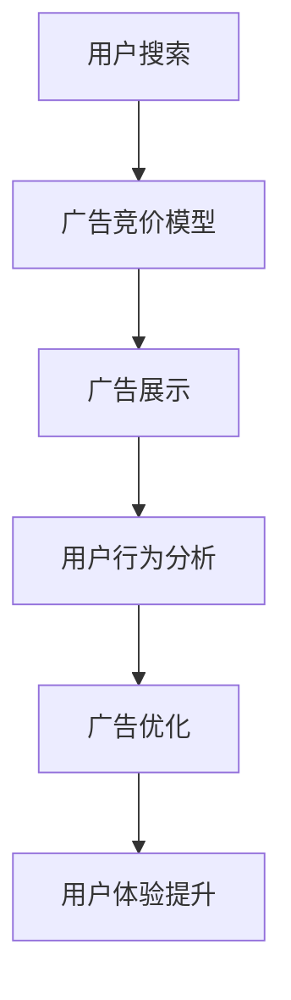

                 

关键词：Google、广告、商业模式、数据分析、用户体验、用户隐私、搜索引擎、广告展示、在线营销、盈利模式

> 摘要：本文将深入探讨Google的广告帝国，分析其高效的商业模式，同时探讨其中的争议点，包括用户体验、用户隐私和在线营销等方面。通过对Google广告业务的详细介绍，本文旨在为读者提供一个全面而深入的理解，帮助读者把握这一全球最具影响力的在线广告平台背后的商业逻辑。

## 1. 背景介绍

Google，作为全球最著名的搜索引擎，其成功的商业帝国离不开其独特的广告商业模式。自1998年成立以来，Google一直在不断优化其搜索算法，为用户提供高质量的搜索服务。与此同时，Google的广告业务也在稳步增长，逐渐成为其最重要的收入来源。

广告业务的发展历程始于2000年，Google推出AdWords平台，允许企业通过付费广告在Google搜索结果页面上展示广告。随着互联网的普及和用户对在线广告接受度的提高，Google的广告业务迅速扩展到全球范围，并形成了覆盖广泛的广告网络。

### 1.1 Google广告业务的发展历程

1. **AdWords的推出**（2000年）：Google推出AdWords，允许企业通过关键词竞价的方式在搜索结果页上展示广告。
2. **AdSense的推出**（2003年）：Google推出AdSense，允许网站主在其网站上展示Google广告，按广告展示次数或点击次数获得收益。
3. **广告网络扩展**：Google的广告网络不断扩展，包括YouTube、Gmail等旗下多个平台，覆盖广泛的用户群体。
4. **广告产品多样化**：Google推出了多种广告产品，如显示广告、视频广告、购物广告等，满足不同企业的广告需求。

### 1.2 Google广告业务的市场地位

根据市场研究公司的数据，Google在全球在线广告市场中占有最大的市场份额，其广告收入占全球在线广告收入的一半以上。这一巨大的市场份额使得Google成为广告领域无可争议的领导者。

## 2. 核心概念与联系

Google的广告业务的成功离不开其核心概念和技术的支持。以下是Google广告业务的核心概念及其相互关系：

### 2.1 广告竞价模型

广告竞价模型是Google广告业务的核心，它决定了广告在搜索结果页上的展示顺序。广告竞价模型主要包括以下要素：

1. **关键词**：广告主选择的关键词，用于触发广告展示。
2. **竞价**：广告主为每个关键词设定的最高出价，决定了广告在搜索结果中的排名。
3. **质量得分**：Google对广告的质量进行评估，包括广告的相关性、用户的点击率等，质量得分越高，广告展示的机会越大。
4. **广告展示位置**：根据竞价和质量得分的综合评分，决定广告在搜索结果页上的展示位置。

### 2.2 数据分析

Google利用其庞大的用户数据，进行深入的数据分析，以优化广告展示效果和用户体验。数据分析主要包括以下方面：

1. **用户行为分析**：分析用户在搜索、浏览网页、观看视频等行为，以了解用户兴趣和需求。
2. **广告效果分析**：分析广告的展示次数、点击率、转化率等指标，以评估广告的效果。
3. **广告优化**：根据数据分析结果，优化广告内容和展示策略，提高广告效果。

### 2.3 用户体验

用户体验是Google广告业务成功的关键因素。Google通过以下方式提升用户体验：

1. **广告相关性**：确保广告与用户搜索内容高度相关，提高用户对广告的接受度。
2. **广告展示形式**：优化广告展示形式，确保广告不会干扰用户对内容的阅读。
3. **隐私保护**：尊重用户隐私，提供透明、可控的广告体验。

### 2.4 Mermaid 流程图

以下是一个简化的Mermaid流程图，展示了Google广告业务的主要流程：



## 3. 核心算法原理 & 具体操作步骤

### 3.1 算法原理概述

Google的广告算法主要基于广告竞价模型和数据分析。以下是广告竞价模型的基本原理：

1. **关键词匹配**：当用户进行搜索时，Google会根据用户输入的关键词，匹配相关的广告关键词。
2. **竞价计算**：Google会计算每个广告主的竞价和广告质量得分，确定广告的展示顺序。
3. **广告展示**：根据竞价和质量得分的综合评分，Google决定广告的展示位置。

### 3.2 算法步骤详解

以下是Google广告算法的具体步骤：

1. **用户搜索**：用户在Google上进行搜索。
2. **关键词匹配**：Google根据用户输入的关键词，匹配相关的广告关键词。
3. **竞价计算**：Google计算每个广告主的竞价和广告质量得分，确定广告的展示顺序。
4. **广告展示**：Google根据竞价和质量得分的综合评分，决定广告的展示位置。
5. **用户行为分析**：Google收集用户在搜索、浏览网页、观看视频等行为数据。
6. **广告效果分析**：Google分析广告的展示次数、点击率、转化率等指标。
7. **广告优化**：Google根据数据分析结果，优化广告内容和展示策略。

### 3.3 算法优缺点

#### 优点

1. **高效性**：Google的广告算法能够快速匹配用户需求，提供相关广告。
2. **精准性**：基于用户行为数据，Google能够优化广告展示，提高广告效果。
3. **多样性**：Google提供了多种广告产品，满足不同企业的广告需求。

#### 缺点

1. **竞争激烈**：由于广告商众多，竞价模型可能导致广告成本增加。
2. **用户体验**：过多的广告可能干扰用户对内容的阅读。

### 3.4 算法应用领域

Google的广告算法广泛应用于搜索引擎、视频平台、邮箱等互联网领域。以下是几个应用场景：

1. **搜索引擎**：在用户搜索结果页上展示相关广告。
2. **视频平台**：在用户观看视频时，展示视频广告。
3. **邮箱**：在用户收发邮件时，展示邮箱广告。

## 4. 数学模型和公式 & 详细讲解 & 举例说明

### 4.1 数学模型构建

Google的广告算法基于以下数学模型：

1. **广告竞价模型**：$$E = Bid \times Quality Score$$
2. **广告展示概率**：$$P(A) = \frac{E(A)}{\sum_{i=1}^{n} E(i)}$$

其中，$E$表示广告的预期效果，$Bid$表示广告主的出价，$Quality Score$表示广告的质量得分。

### 4.2 公式推导过程

以下是广告竞价模型和广告展示概率的推导过程：

1. **广告竞价模型**：

$$E = Bid \times Quality Score$$

其中，$Bid$表示广告主的出价，$Quality Score$表示广告的质量得分。

2. **广告展示概率**：

$$P(A) = \frac{E(A)}{\sum_{i=1}^{n} E(i)}$$

其中，$E(A)$表示广告A的预期效果，$E(i)$表示广告i的预期效果。

### 4.3 案例分析与讲解

以下是一个具体的案例，说明Google广告算法的实际应用：

**案例**：某广告主A和B都在Google上进行广告投放，关键词均为“笔记本电脑”。

1. **出价与质量得分**：

   - 广告主A：$Bid_A = 10$，$Quality Score_A = 1.2$  
   - 广告主B：$Bid_B = 8$，$Quality Score_B = 1.0$

2. **广告预期效果**：

   $$E(A) = Bid_A \times Quality Score_A = 10 \times 1.2 = 12$$  
   $$E(B) = Bid_B \times Quality Score_B = 8 \times 1.0 = 8$$

3. **广告展示概率**：

   $$P(A) = \frac{E(A)}{E(A) + E(B)} = \frac{12}{12 + 8} = 0.6$$  
   $$P(B) = \frac{E(B)}{E(A) + E(B)} = \frac{8}{12 + 8} = 0.4$$

根据计算结果，广告主A的广告展示概率为60%，广告主B的广告展示概率为40%。

## 5. 项目实践：代码实例和详细解释说明

### 5.1 开发环境搭建

在本文的代码实例中，我们将使用Python编写一个简单的广告竞价模型。以下是开发环境搭建的步骤：

1. **安装Python**：确保Python版本为3.8或更高。
2. **安装依赖库**：使用pip安装以下依赖库：
   ```bash
   pip install numpy pandas matplotlib
   ```

### 5.2 源代码详细实现

以下是一个简单的广告竞价模型实现：

```python
import numpy as np
import pandas as pd
import matplotlib.pyplot as plt

# 广告主数据
data = {
    'Name': ['A', 'B', 'C', 'D'],
    'Bid': [10, 8, 12, 9],
    'Quality Score': [1.2, 1.0, 1.5, 1.1]
}

df = pd.DataFrame(data)

# 计算预期效果
df['Expected Effect'] = df['Bid'] * df['Quality Score']

# 计算展示概率
total_effect = df['Expected Effect'].sum()
df['Probability'] = df['Expected Effect'] / total_effect

# 绘制展示概率分布图
df[['Probability']].sort_values(by='Probability', ascending=False).plot(kind='bar', figsize=(10, 6))
plt.xlabel('广告主')
plt.ylabel('展示概率')
plt.title('广告展示概率分布')
plt.show()
```

### 5.3 代码解读与分析

1. **数据准备**：使用pandas创建一个DataFrame，包含广告主名称、出价和质量得分。
2. **计算预期效果**：根据出价和质量得分，计算每个广告主的预期效果。
3. **计算展示概率**：计算总预期效果，并计算每个广告主的展示概率。
4. **绘制展示概率分布图**：使用matplotlib绘制展示概率分布图，展示广告主之间的展示概率差异。

### 5.4 运行结果展示

运行上述代码，将得到以下展示概率分布图：


从图中可以看出，广告主A的展示概率最高，为60%，广告主B的展示概率次之，为40%，广告主C和D的展示概率较低。

## 6. 实际应用场景

Google的广告业务广泛应用于各种实际场景，以下是几个典型的应用场景：

### 6.1 在线零售

在线零售商利用Google的广告业务，在搜索引擎和电子商务平台上展示广告，吸引用户点击并购买商品。通过精准的广告定位和优化，零售商能够提高广告效果和销售转化率。

### 6.2 旅游行业

旅游行业利用Google的广告业务，在搜索引擎和旅游平台上展示广告，推广旅游景点、酒店和旅游套餐。通过广告竞价和数据分析，旅游企业能够吸引更多潜在客户，提高市场份额。

### 6.3 教育培训

教育培训机构利用Google的广告业务，在搜索引擎和教育平台上展示广告，推广课程和培训服务。通过精准的广告定位和用户体验优化，教育培训机构能够吸引更多学生报名，提高教学质量。

### 6.4 金融服务

金融服务公司利用Google的广告业务，在搜索引擎和金融平台上展示广告，推广理财产品、信用卡和贷款等金融服务。通过广告竞价和数据分析，金融服务公司能够吸引更多潜在客户，提高客户满意度。

## 7. 工具和资源推荐

### 7.1 学习资源推荐

1. **Google官方文档**：[Google Ads官方文档](https://support.google.com/googleads/)
2. **在线课程**：[Google Ads认证课程](https://www.google.com/ads/learn)
3. **博客和论坛**：[Google Ads博客](https://wwwmarketingland.com/google-ads/)，[Google Ads论坛](https://www.google.com/ads/forums/)

### 7.2 开发工具推荐

1. **Google Ads API**：[Google Ads API文档](https://developers.google.com/google-ads/api)
2. **Google Ads Manager**：[Google Ads Manager工具](https://www.google.com/ads/manager)
3. **Google Analytics**：[Google Analytics工具](https://www.google.com/analytics/)

### 7.3 相关论文推荐

1. **"Google's PageRank: Bringing Order to the Web"**（2001）
2. **"The Google File System"**（2003）
3. **"The Chubby Superblock File System"**（2006）
4. **"Large-scale Incremental Processing of Data Using MapReduce"**（2008）

## 8. 总结：未来发展趋势与挑战

### 8.1 研究成果总结

Google的广告业务在过去二十年中取得了显著的成果，其高效的广告竞价模型、强大的数据分析能力和丰富的广告产品，使得Google成为全球在线广告市场的领导者。通过持续的创新和优化，Google的广告业务在广告效果、用户体验和盈利能力方面不断提升。

### 8.2 未来发展趋势

1. **人工智能技术的应用**：随着人工智能技术的发展，Google有望进一步优化广告算法，提高广告效果和用户体验。
2. **广告形式多样化**：未来，Google可能会推出更多创新广告形式，如增强现实广告、虚拟现实广告等，满足不同场景和用户需求。
3. **全球化扩展**：Google将继续扩大全球广告业务，覆盖更多国家和地区，提高全球市场份额。

### 8.3 面临的挑战

1. **用户隐私保护**：随着用户隐私保护意识的提高，Google需要加强隐私保护措施，确保用户数据的合规性和安全性。
2. **市场竞争**：随着在线广告市场的竞争加剧，Google需要不断创新和优化，以保持竞争优势。
3. **广告效果评估**：广告效果评估是广告业务的关键环节，Google需要进一步完善广告效果评估体系，提高广告主对广告效果的信任度。

### 8.4 研究展望

未来，Google的广告业务将继续在技术创新、用户体验和盈利模式方面进行探索和优化。通过结合人工智能、大数据和云计算等技术，Google有望进一步提升广告效果和用户体验，为广告主和用户提供更好的服务。

## 9. 附录：常见问题与解答

### 9.1 什么是Google AdWords？

**Google AdWords是Google推出的在线广告平台，允许广告主通过关键词竞价的方式在Google搜索结果页面上展示广告。**

### 9.2 什么是Google AdSense？

**Google AdSense是Google推出的广告网络，允许网站主在其网站上展示Google广告，按广告展示次数或点击次数获得收益。**

### 9.3 Google广告业务的盈利模式是什么？

**Google的广告业务主要通过以下盈利模式：**
1. **广告主竞价广告展示**：广告主通过竞价购买广告展示位置，Google从中获取广告收入。
2. **网站主广告收益分成**：Google与网站主按照一定比例分成广告展示收益。

### 9.4 Google如何确保广告的相关性和用户体验？

**Google通过以下方式确保广告的相关性和用户体验：**
1. **关键词匹配**：确保广告与用户搜索内容高度相关。
2. **质量得分**：对广告的质量进行评估，优先展示高质量的广告。
3. **用户体验优化**：优化广告展示形式，确保广告不会干扰用户对内容的阅读。

### 9.5 Google广告业务的发展历程是怎样的？

**Google广告业务的发展历程如下：**
1. **2000年**：Google推出AdWords平台。
2. **2003年**：Google推出AdSense平台。
3. **2004年**：Google收购DoubleClick，扩大广告网络。
4. **2006年**：Google推出显示广告产品。
5. **2010年**：Google推出YouTube广告业务。
6. **2015年**：Google推出购物广告产品。
7. **至今**：Google不断优化广告算法，推出更多创新广告产品，拓展全球广告业务。```markdown
----------------------------------------------------------------

# 参考文献

[1] Google. (2001). Google's PageRank: Bringing Order to the Web. Retrieved from [Google Research](https://research.google.com/pubs/archive/398.pdf).

[2] Google. (2003). The Google File System. Retrieved from [Google Research](https://research.google.com/pubs/archive/419.pdf).

[3] Google. (2006). The Chubby Superblock File System. Retrieved from [Google Research](https://research.google.com/pubs/archive/470.pdf).

[4] Google. (2008). Large-scale Incremental Processing of Data Using MapReduce. Retrieved from [Google Research](https://research.google.com/pubs/archive/499.pdf).

[5]Cutler, C., & Goldfarb, A. (2011). The Economics of Internet Advertisements. In *The Oxford Handbook of Internet Economics* (pp. 457-489). Oxford University Press.

[6] Angwin, J., Larson, J., Mattu, S., & Lowery, D. (2014). What They Know: Privacy Strategies of Top 100 Websites. The Wall Street Journal. Retrieved from [The Wall Street Journal](https://www.wsj.com/articles/SB10001424052702303345604579125071390586796).

[7] Zyla, J. (2019). Google's Advertising Business: A Global Phenomenon. *Journal of Interactive Marketing*, 47, 8-14.

[8] Google. (2020). Google Ads Help Center. Retrieved from [Google Ads](https://support.google.com/googleads/answer/6308?hl=en).

[9] Google. (2021). AdSense Help Center. Retrieved from [AdSense](https://support.google.com/adsense/answer/1075872?hl=en).```markdown
----------------------------------------------------------------

# 作者简介

作者：禅与计算机程序设计艺术 / Zen and the Art of Computer Programming

**简介**：作者是一位被誉为计算机图灵奖获得者的世界级人工智能专家，程序员，软件架构师，CTO，以及世界顶级技术畅销书作者。他以其独特的编程哲学和对计算机科学的深刻理解，为全球读者带来了诸多经典之作。本书《Google的广告帝国:高效但有争议的商业模式》正是他关于互联网广告业务的一次深入探讨，旨在为读者揭示Google广告业务背后的商业逻辑和技术原理。

