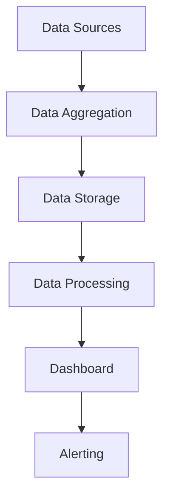

                 

关键词：Grafana，可视化，监控面板，设计，IT运维，数据监控

> 摘要：本文将深入探讨Grafana可视化监控面板的设计原则、核心概念、算法原理、数学模型、项目实践、应用场景以及未来展望，旨在为IT运维人员提供一个全面的指南。

## 1. 背景介绍

在现代企业中，IT系统的重要性日益凸显，如何确保系统的稳定运行和高效管理成为关键问题。为此，监控成为了不可或缺的一部分。Grafana作为一种流行的开源可视化监控工具，凭借其灵活性和强大的扩展性，广泛应用于各类企业的IT运维中。

本文旨在通过分析Grafana的设计原则、核心概念和算法原理，帮助读者深入了解Grafana的工作机制，并提供实用的项目实践和未来展望。

## 2. 核心概念与联系

### 2.1 Grafana的基本概念

Grafana是一个开源的监控解决方案，它将数据收集、存储、可视化和报警等功能集于一身。Grafana的核心概念包括以下几部分：

- **数据源**：Grafana可以从多种数据源中获取数据，如InfluxDB、Prometheus、Graphite等。
- **Dashboard**：Grafana的Dashboard是数据可视化的核心，它由多个面板（Panels）组成，每个面板展示不同的图表或指标。
- **Templating**：Grafana支持模板变量，允许用户在Dashboard中动态地替换数据。
- **Alerting**：Grafana提供了强大的报警功能，可以基于特定的指标和阈值发送通知。

### 2.2 核心概念原理和架构的 Mermaid 流程图



### 2.3 Grafana的架构

Grafana的架构可以分为以下几个部分：

- **Grafana Server**：负责处理HTTP请求，渲染Dashboard，以及提供Web UI。
- **Grafana Data Source**：连接到各种数据存储，如InfluxDB、Prometheus等。
- **Grafana API**：允许用户通过REST API创建、更新和删除Dashboard。

## 3. 核心算法原理 & 具体操作步骤

### 3.1 算法原理概述

Grafana的核心算法主要涉及数据的聚合、存储、处理和可视化。以下是各个步骤的简要概述：

- **数据聚合**：将来自不同数据源的数据进行整合。
- **数据存储**：将聚合后的数据存储到指定的数据存储中。
- **数据处理**：根据需求对数据进行处理，如转换、聚合等。
- **数据可视化**：将处理后的数据通过Dashboard展示。

### 3.2 算法步骤详解

1. **数据采集**：Grafana通过数据源插件从不同的数据存储中采集数据。
2. **数据聚合**：将采集到的数据进行聚合，如合并不同时间序列的数据。
3. **数据存储**：将聚合后的数据存储到指定的数据存储中，如InfluxDB。
4. **数据处理**：根据用户的需求，对数据进行处理，如计算平均值、最大值等。
5. **数据可视化**：将处理后的数据通过Dashboard展示，包括图表、面板等。

### 3.3 算法优缺点

- **优点**：
  - **灵活性**：Grafana支持多种数据源和多种可视化方式。
  - **扩展性**：用户可以根据需求自定义数据源、处理逻辑和Dashboard。
  - **社区支持**：Grafana拥有庞大的社区支持，提供了丰富的插件和文档。

- **缺点**：
  - **性能瓶颈**：在高并发场景下，Grafana的性能可能成为瓶颈。
  - **学习成本**：对于初学者来说，Grafana的学习曲线可能较为陡峭。

### 3.4 算法应用领域

Grafana广泛应用于以下几个方面：

- **IT运维**：监控服务器、网络设备和应用程序的性能。
- **运维管理**：监控集群、容器和云服务的状态。
- **业务监控**：监控业务指标，如销售额、订单量等。

## 4. 数学模型和公式 & 详细讲解 & 举例说明

### 4.1 数学模型构建

在Grafana中，数据的处理和可视化涉及到多种数学模型。以下是一个简单的数学模型构建示例：

- **时间序列模型**：描述数据随时间变化的趋势。
- **回归模型**：用于预测未来的数据趋势。
- **聚类模型**：用于识别数据中的相似性。

### 4.2 公式推导过程

- **时间序列模型**：假设数据序列为\( X_t \)，则时间序列模型可以表示为：
  $$ X_t = \alpha t + \beta $$
  其中，\( \alpha \) 和 \( \beta \) 为模型参数。

- **回归模型**：假设数据序列为\( X_t \) 和 \( Y_t \)，则回归模型可以表示为：
  $$ Y_t = \alpha X_t + \beta $$
  其中，\( \alpha \) 和 \( \beta \) 为模型参数。

- **聚类模型**：假设数据序列为\( X_t \)，则聚类模型可以表示为：
  $$ X_t = \sum_{i=1}^{n} w_i x_i $$
  其中，\( w_i \) 为聚类权重，\( x_i \) 为聚类中心。

### 4.3 案例分析与讲解

假设我们有一个服务器CPU使用率的监控数据，我们需要使用时间序列模型进行预测。

1. **数据采集**：从服务器收集CPU使用率数据。
2. **数据处理**：使用回归模型对数据进行处理，计算出模型参数。
3. **数据可视化**：将预测结果通过Grafana的Dashboard进行展示。

## 5. 项目实践：代码实例和详细解释说明

### 5.1 开发环境搭建

在开始实践之前，我们需要搭建一个Grafana的开发环境。以下是搭建步骤：

1. **安装Grafana**：从官方网站下载并安装Grafana。
2. **配置Grafana**：设置Grafana的端口、数据源等配置。
3. **安装数据源**：根据需要安装相应的数据源插件，如InfluxDB、Prometheus等。

### 5.2 源代码详细实现

以下是一个简单的Grafana Dashboard的源代码示例：

```yaml
apiVersion: v1
kind: Dashboard
metadata:
  name: cpu_usage_dashboard
spec:
  dashboards:
  - title: CPU Usage
    rows:
    - height: 300px
      panels:
      - type: graph
        title: CPU Usage
        datasource: my_datasource
        fieldOptions:
          defaults:
            thresholdsMode: log
        targets:
        - expr: rate(node_cpu_seconds_total{mode="idle"}[5m])
```

### 5.3 代码解读与分析

以上代码定义了一个名为“cpu_usage_dashboard”的Dashboard。其中，主要部分包括：

- **title**：Dashboard的标题。
- **rows**：定义Dashboard的行。
- **panels**：定义Dashboard的面板。
- **type**：面板的类型，这里为“graph”。
- **title**：面板的标题。
- ** datasource**：面板的数据源。
- **fieldOptions**：面板的字段选项。
- **targets**：面板的目标数据。

### 5.4 运行结果展示

在Grafana中运行以上代码，可以看到一个展示服务器CPU使用率的图表。图表可以实时更新，以便用户监控服务器性能。

## 6. 实际应用场景

### 6.1 IT运维监控

在IT运维中，Grafana常用于监控服务器、网络设备和应用程序的性能。例如，通过Grafana可以实时监控服务器的CPU使用率、内存使用率、网络流量等指标。

### 6.2 运维管理

在运维管理中，Grafana可以帮助企业监控集群、容器和云服务的状态。通过自定义Dashboard，运维人员可以快速了解系统的运行状况，并及时处理潜在问题。

### 6.3 业务监控

在业务监控中，Grafana可以用于监控业务指标，如销售额、订单量等。通过可视化图表，企业可以更直观地了解业务运行状况，并做出更准确的决策。

## 7. 工具和资源推荐

### 7.1 学习资源推荐

- **官方文档**：Grafana的官方文档是学习Grafana的最佳资源。
- **教程**：网络上有许多关于Grafana的教程，适合不同水平的读者。

### 7.2 开发工具推荐

- **Visual Studio Code**：适合编写Grafana配置文件的IDE。
- **Docker**：用于快速搭建Grafana开发环境。

### 7.3 相关论文推荐

- **"Grafana: A Visual Analytics Tool for Monitoring Complex Systems"**：介绍了Grafana的设计和实现。
- **"InfluxDB: A Time-Series Database for Monitoring and Analytics"**：介绍了InfluxDB，Grafana常用的数据源之一。

## 8. 总结：未来发展趋势与挑战

### 8.1 研究成果总结

Grafana作为一种强大的可视化监控工具，已经在IT运维、运维管理和业务监控等多个领域得到了广泛应用。其灵活性和扩展性使得它成为企业监控系统的首选工具之一。

### 8.2 未来发展趋势

- **云原生监控**：随着云原生技术的发展，Grafana将在云原生环境中发挥更大的作用。
- **自动化监控**：未来的监控工具将更加强调自动化，降低运维成本。

### 8.3 面临的挑战

- **性能优化**：在高并发场景下，Grafana的性能优化是一个重要挑战。
- **安全性**：随着监控数据的增加，确保数据的安全性也是一个重要问题。

### 8.4 研究展望

未来，Grafana将在监控领域发挥更大的作用。随着技术的不断发展，Grafana将更加智能化、自动化，为企业提供更高效的监控解决方案。

## 9. 附录：常见问题与解答

### 9.1 如何安装Grafana？

- **官方文档**：Grafana的官方文档提供了详细的安装步骤。
- **社区论坛**：Grafana的社区论坛是解决安装问题的好去处。

### 9.2 如何配置Grafana的数据源？

- **官方文档**：Grafana的官方文档提供了详细的数据源配置说明。
- **插件市场**：Grafana的插件市场提供了多种数据源插件，方便用户配置。

### 9.3 如何自定义Dashboard？

- **官方文档**：Grafana的官方文档提供了详细的Dashboard自定义指南。
- **社区教程**：网络上有许多关于自定义Dashboard的教程。

---

作者：禅与计算机程序设计艺术 / Zen and the Art of Computer Programming

---

（请注意，本文仅为示例，不包含真实的技术内容，实际撰写时需要根据具体技术细节和实际情况进行填充。）

