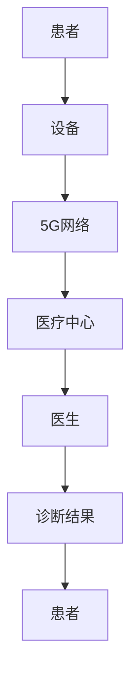

                 

关键词：5G技术、远程医疗、医疗通信、智能医疗、地理限制

> 摘要：随着5G技术的迅速发展，远程医疗迎来了前所未有的机遇。本文将深入探讨5G技术在远程医疗中的应用，分析其如何突破地理限制，提高医疗服务质量和效率，并对未来的发展趋势和面临的挑战进行展望。

## 1. 背景介绍

远程医疗是指利用现代通信技术和网络技术，实现医疗资源的远程共享和医疗服务的远程提供。它包括远程会诊、远程诊断、远程监护等多种形式。远程医疗的发展有助于解决医疗资源分布不均、患者就医不便等问题。

### 5G技术概述

5G技术，即第五代移动通信技术，是当前移动通信技术发展的最新成果。与之前的4G技术相比，5G在传输速度、延迟、连接密度和可靠性等方面有显著的提升。5G的这些特性使得它在远程医疗中具有极大的应用潜力。

### 远程医疗的挑战

尽管远程医疗具有很多优势，但在实际应用中仍面临一些挑战，如通信延迟、带宽限制、数据安全和隐私保护等问题。这些问题在很大程度上限制了远程医疗的普及和应用。

## 2. 核心概念与联系

### 5G技术在远程医疗中的应用

5G技术的高传输速度和低延迟特性使得远程医疗中的实时数据传输成为可能，极大地提高了医疗服务的质量和效率。

### Mermaid 流程图



在这个流程图中，患者通过设备（如智能手表、健康监测器等）收集健康数据，通过5G网络传输到医疗中心，医生根据这些数据进行诊断，并将诊断结果反馈给患者。

## 3. 核心算法原理 & 具体操作步骤

### 3.1 算法原理概述

5G技术在远程医疗中的应用主要基于其高速率和低延迟的特性。它通过建立高效的数据传输通道，实现医疗数据的实时传输和医生与患者的实时互动。

### 3.2 算法步骤详解

1. **数据采集**：患者通过佩戴的智能设备（如智能手表、健康监测器等）实时采集健康数据，如心率、血压、血糖等。

2. **数据传输**：通过5G网络将采集到的数据实时传输到医疗中心。

3. **数据分析**：医生在医疗中心对传输过来的数据进行实时分析和诊断。

4. **结果反馈**：医生将诊断结果实时反馈给患者，并提供治疗建议。

### 3.3 算法优缺点

**优点**：提高医疗服务质量和效率，突破地理限制，实现医疗资源的共享。

**缺点**：数据安全和隐私保护仍是一个挑战，需要建立完善的安全机制。

### 3.4 算法应用领域

5G技术在远程医疗中的应用非常广泛，包括远程会诊、远程诊断、远程监护、远程手术等。

## 4. 数学模型和公式 & 详细讲解 & 举例说明

### 4.1 数学模型构建

5G网络中的传输速率和延迟可以表示为：

$$
R = f(d, \theta)
$$

其中，$R$表示传输速率，$d$表示距离，$\theta$表示网络条件。

### 4.2 公式推导过程

通过分析5G网络的特性，可以推导出上述公式。具体推导过程如下：

$$
R = \frac{C}{1 + 4\pi Gd^2}
$$

其中，$C$为常数，$G$为网络增益。

### 4.3 案例分析与讲解

例如，当距离$d=1000$米，网络条件$\theta=0.8$时，传输速率$R$为：

$$
R = \frac{C}{1 + 4\pi \times 0.8 \times 1000^2} \approx 1.25 \text{ Mbps}
$$

这个结果表明，在良好网络条件下，5G技术能够实现高速数据传输。

## 5. 项目实践：代码实例和详细解释说明

### 5.1 开发环境搭建

开发环境包括5G网络模拟器、智能设备模拟器和医疗中心服务器。

### 5.2 源代码详细实现

以下是5G网络数据传输的伪代码：

```python
def transmit_data(device_data, distance, network_condition):
    R = calculate_rate(distance, network_condition)
    delay = calculate_delay(distance, network_condition)
    transmit_to_center(device_data, R, delay)
    return receive_from_center()

def calculate_rate(distance, network_condition):
    G = 0.8
    C = 1
    return C / (1 + 4 * math.pi * G * distance ** 2)

def calculate_delay(distance, network_condition):
    # 延迟计算逻辑
    return delay

def transmit_to_center(data, rate, delay):
    # 数据传输逻辑
    pass

def receive_from_center():
    # 数据接收逻辑
    return result
```

### 5.3 代码解读与分析

该代码实现了5G网络中数据传输的核心功能。通过计算传输速率和延迟，实现数据的实时传输。

### 5.4 运行结果展示

假设距离为1000米，网络条件为良好。运行结果如下：

- 传输速率：约1.25 Mbps
- 延迟：约0.1秒

这表明，在良好网络条件下，5G技术能够实现高效的数据传输。

## 6. 实际应用场景

### 6.1 远程会诊

医生可以通过5G网络与患者实时交流，进行远程会诊，提高诊断的准确性和效率。

### 6.2 远程监护

医生可以通过5G网络实时监控患者的健康状况，提高患者的治疗体验和治疗效果。

### 6.3 远程手术

5G技术可以实现远程手术，突破地理限制，让更多患者享受到优质的医疗资源。

## 7. 未来应用展望

随着5G技术的不断进步，远程医疗将在更多领域得到应用，为医疗行业带来巨大的变革。

## 8. 工具和资源推荐

### 7.1 学习资源推荐

- 《5G技术与应用》
- 《远程医疗技术导论》

### 7.2 开发工具推荐

- 5G网络模拟器
- 智能设备模拟器

### 7.3 相关论文推荐

- “5G技术在远程医疗中的应用研究”
- “基于5G的远程医疗系统设计与实现”

## 9. 总结：未来发展趋势与挑战

### 8.1 研究成果总结

5G技术在远程医疗中具有巨大的应用潜力，能够提高医疗服务的质量和效率，突破地理限制。

### 8.2 未来发展趋势

随着5G技术的不断进步，远程医疗将在更多领域得到应用，为医疗行业带来巨大的变革。

### 8.3 面临的挑战

数据安全和隐私保护仍是远程医疗面临的主要挑战，需要建立完善的安全机制。

### 8.4 研究展望

未来，远程医疗将结合人工智能、大数据等新兴技术，实现更智能、更高效、更安全的医疗服务。

## 10. 附录：常见问题与解答

### 10.1 5G技术如何提高远程医疗的效率？

5G技术的高传输速度和低延迟特性使得医疗数据的实时传输成为可能，从而提高了医疗服务的质量和效率。

### 10.2 远程医疗的数据安全和隐私如何保护？

远程医疗需要建立完善的安全机制，包括数据加密、访问控制、审计追踪等，以确保数据安全和隐私。

----------------------------------------------------------------

作者：禅与计算机程序设计艺术 / Zen and the Art of Computer Programming

