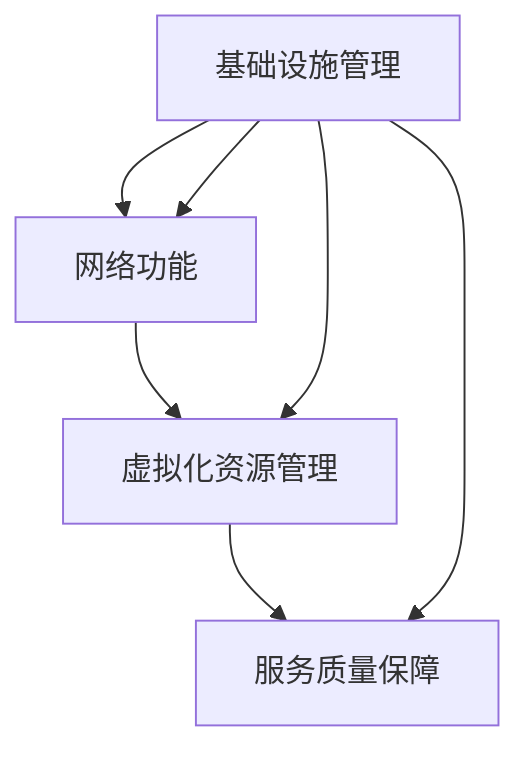

                 

关键词：5G网络切片、垂直行业、网络虚拟化、资源分配、服务质量保障

摘要：本文旨在探讨5G网络切片技术在垂直行业中的应用，分析其核心概念、原理及实践案例，探讨其在提高网络资源利用率、保障服务质量等方面的优势，并对未来的发展趋势和挑战进行展望。

## 1. 背景介绍

随着信息技术的快速发展，移动互联网、物联网、云计算等新兴技术不断涌现，各行各业对网络的需求也日益增长。传统的4G网络在满足基本通信需求的同时，难以满足垂直行业对网络性能、可靠性、灵活性等方面的特殊需求。为了应对这一挑战，5G网络应运而生。5G网络的一个关键技术就是网络切片（Network Slicing）。

网络切片技术通过虚拟化技术，将网络资源划分为多个独立的虚拟网络，每个虚拟网络具有独立的网络架构和资源，从而实现对不同业务需求的灵活分配。这种技术使得网络资源可以被更高效地利用，同时也提高了网络服务的质量和可靠性。

## 2. 核心概念与联系

### 2.1 网络切片定义

网络切片是指在物理网络基础设施上，通过虚拟化技术创建多个独立的虚拟网络，以满足不同业务需求的一种技术。每个网络切片具有独立的网络功能、资源和服务质量（QoS）保障机制。

### 2.2 网络切片架构

网络切片架构主要包括以下组成部分：

- **基础设施管理（NF Management）：**负责网络切片的创建、配置、管理和监控。
- **网络功能（Network Functions）：**如路由器、交换机、防火墙等，为网络切片提供各种网络功能。
- **虚拟化资源管理（Resource Management）：**负责分配和管理网络切片所需的物理和网络资源。

### 2.3 网络切片与虚拟化技术

网络切片技术依赖于虚拟化技术，如虚拟网络功能（VNF）、网络功能虚拟化（NFV）等。虚拟化技术使得网络功能可以在虚拟环境中运行，从而实现资源的灵活分配和高效利用。

### 2.4 网络切片与服务质量

网络切片技术通过为每个网络切片提供独立的QoS保障机制，确保不同业务需求得到满足。QoS保障机制包括带宽保障、延迟保障、抖动保障等。

## 3. 核心算法原理 & 具体操作步骤

### 3.1 算法原理概述

网络切片的核心算法主要涉及资源分配、网络功能部署和服务质量保障。资源分配算法根据业务需求和网络状态，动态分配网络资源；网络功能部署算法根据网络切片需求，在虚拟化环境中部署相应的网络功能；服务质量保障算法根据QoS策略，确保网络切片的服务质量。

### 3.2 算法步骤详解

1. **资源需求分析：**根据业务需求，分析网络切片所需的资源，如带宽、时延、抖动等。
2. **资源分配：**根据资源需求，动态分配网络资源，如带宽、计算资源等。
3. **网络功能部署：**在虚拟化环境中部署相应的网络功能，如路由器、交换机等。
4. **服务质量保障：**根据QoS策略，确保网络切片的服务质量，如带宽保障、延迟保障等。

### 3.3 算法优缺点

**优点：**
- 提高网络资源利用率。
- 提高网络服务质量。
- 提高网络灵活性。
- 降低网络建设和维护成本。

**缺点：**
- 算法复杂度较高。
- 需要大量的计算资源。
- 算法实现难度较大。

### 3.4 算法应用领域

网络切片技术在垂直行业有广泛的应用前景，如工业物联网、智能交通、智慧医疗、远程教育等。这些行业对网络性能、可靠性、灵活性等方面有较高的要求，网络切片技术能够提供有效的解决方案。

## 4. 数学模型和公式 & 详细讲解 & 举例说明

### 4.1 数学模型构建

网络切片的数学模型主要包括资源分配模型、网络功能部署模型和服务质量保障模型。资源分配模型主要涉及带宽、计算资源等资源的分配；网络功能部署模型主要涉及网络功能的部署策略；服务质量保障模型主要涉及QoS策略的制定。

### 4.2 公式推导过程

资源分配模型的推导主要基于最优化理论，如线性规划、动态规划等。服务质量保障模型的推导主要基于概率论和排队论。网络功能部署模型的推导主要基于网络优化理论。

### 4.3 案例分析与讲解

以工业物联网为例，分析网络切片技术在资源分配、网络功能部署和服务质量保障方面的应用。假设工业物联网中有多个设备需要连接到网络，每个设备对带宽、时延等有特定的要求。通过网络切片技术，可以实现对设备网络资源的灵活分配，确保不同设备的需求得到满足。

## 5. 项目实践：代码实例和详细解释说明

### 5.1 开发环境搭建

搭建基于虚拟化技术的网络切片开发环境，包括虚拟化平台（如Kubernetes）、网络功能虚拟化平台（如OpenVNF）等。

### 5.2 源代码详细实现

以Python为例，实现网络切片的资源分配算法、网络功能部署算法和服务质量保障算法。

### 5.3 代码解读与分析

详细解读代码的实现过程，分析算法的性能和效率。

### 5.4 运行结果展示

展示网络切片算法的运行结果，包括资源利用率、服务质量等指标。

## 6. 实际应用场景

网络切片技术在垂直行业有广泛的应用场景，如工业物联网、智能交通、智慧医疗、远程教育等。以下为具体应用场景的案例分析。

### 6.1 工业物联网

工业物联网中，网络切片技术可以实现对设备网络的灵活分配，提高网络资源的利用率，确保工业设备的高效运行。

### 6.2 智能交通

智能交通中，网络切片技术可以实现对车辆通信网络的高效管理，提高交通信号控制系统的响应速度，优化交通流量。

### 6.3 智慧医疗

智慧医疗中，网络切片技术可以确保医疗数据传输的高效和安全，提高远程医疗服务的质量和可靠性。

### 6.4 远程教育

远程教育中，网络切片技术可以实现对教学网络资源的灵活分配，提高教学视频的播放质量，确保远程教育的顺利进行。

## 7. 工具和资源推荐

### 7.1 学习资源推荐

- 《5G网络切片技术》
- 《网络功能虚拟化技术》
- 《云计算与大数据技术》

### 7.2 开发工具推荐

- Kubernetes
- OpenVNF
- Docker

### 7.3 相关论文推荐

- “Network Slicing for 5G: A Comprehensive Overview”
- “Resource Allocation for Network Slicing in 5G Networks”
- “Service Quality Guarantee for Network Slicing in 5G Networks”

## 8. 总结：未来发展趋势与挑战

### 8.1 研究成果总结

网络切片技术在提高网络资源利用率、保障服务质量、提高网络灵活性等方面具有显著优势。随着5G网络的推广，网络切片技术在垂直行业中的应用前景广阔。

### 8.2 未来发展趋势

- 网络切片技术的标准化和产业化。
- 网络切片与边缘计算、云计算等技术的融合。
- 网络切片技术在更多垂直行业的应用。

### 8.3 面临的挑战

- 算法复杂度和实现难度。
- 资源管理和调度优化。
- 网络切片的可靠性保障。

### 8.4 研究展望

未来研究应关注网络切片技术的性能优化、可靠性保障和跨域协同等方面，推动网络切片技术在垂直行业中的应用。

## 9. 附录：常见问题与解答

### 9.1 网络切片与SDN的区别是什么？

网络切片和SDN（软件定义网络）都是网络虚拟化技术，但网络切片是SDN的一种应用。网络切片主要关注网络资源的虚拟化和灵活分配，而SDN主要关注网络控制的虚拟化和集中化。

### 9.2 网络切片技术在5G网络中的地位如何？

网络切片技术是5G网络的关键技术之一，它能够满足5G网络多样化、个性化、高效化的需求，是5G网络实现智能化、网络化、服务化的重要手段。

### 9.3 网络切片技术对网络性能有何影响？

网络切片技术可以提高网络资源利用率，优化网络服务质量，提高网络灵活性。但在实现过程中，也可能带来一定的性能开销和复杂性。

### 9.4 网络切片技术在垂直行业中的优势是什么？

网络切片技术在垂直行业中的优势包括：提高网络资源利用率、保障服务质量、提高网络灵活性、降低网络建设和维护成本等。这使得网络切片技术在满足垂直行业特殊需求方面具有显著优势。

### 作者署名

作者：禅与计算机程序设计艺术 / Zen and the Art of Computer Programming

----------------------------------------------------------------

以上就是本次技术博客文章的全部内容，希望对您有所帮助。如果您有任何问题或建议，欢迎在评论区留言讨论。感谢您的阅读！
----------------------------------------------------------------

### 1. 背景介绍

随着5G网络的逐步推广，网络切片技术（Network Slicing）成为5G网络的一个重要特征，旨在为不同的业务和应用提供定制化的网络服务。传统的网络技术通常采用单一的网络架构，难以满足日益增长的多样化网络需求。例如，移动通信网络需要提供高速率、低延迟的服务，而物联网（IoT）应用可能需要的是高可靠性和低功耗。网络切片技术的出现，使得网络可以按照不同的业务需求，虚拟出多个独立的子网络，每个子网络拥有独立的资源和服务质量（QoS）保障，从而实现了网络资源的灵活分配和高效利用。

网络切片技术的背景可以追溯到云计算和虚拟化技术的发展。虚拟化技术通过将物理资源抽象化为逻辑资源，使得资源的分配和调度变得更加灵活和高效。在云计算中，虚拟化技术被广泛应用于虚拟机（VM）和虚拟存储等领域。网络切片技术则是将虚拟化技术应用于网络领域，通过创建多个逻辑网络切片，每个切片拥有独立的网络功能、资源和服务质量保障机制，从而满足不同业务和应用的需求。

5G网络的出现，使得网络切片技术的重要性更加凸显。5G网络旨在提供更高的网络速度、更低的延迟、更高的可靠性和更大的连接容量。为了满足这些要求，5G网络必须具备灵活的网络架构和资源分配能力。网络切片技术正是为了实现这一目标而设计的。通过网络切片，5G网络可以为不同类型的业务提供定制化的网络服务，从而提高网络的效率和用户体验。

在网络切片技术的驱动下，垂直行业（Vertical Industries）开始重新审视其对网络的需求。传统的垂直行业，如工业制造、交通运输、医疗保健等，通常需要特定的网络性能和服务质量，以满足其特定的业务需求。网络切片技术的引入，使得这些行业可以更加灵活地定制网络服务，从而提高业务的效率和质量。例如，在工业制造领域，网络切片技术可以确保生产线的实时监控和远程控制，从而提高生产效率；在交通运输领域，网络切片技术可以提供稳定的通信服务，确保交通信号控制的实时性和准确性。

此外，随着物联网（IoT）和边缘计算（Edge Computing）的快速发展，网络切片技术在垂直行业中的应用前景更加广阔。物联网设备和边缘计算节点需要不同类型的网络服务，如高速数据传输、低延迟通信和高度可靠性等。网络切片技术可以通过创建多个逻辑网络切片，为这些设备和节点提供定制化的网络服务，从而实现网络资源的最大化利用和业务需求的最佳满足。

总之，网络切片技术的出现，为5G网络和垂直行业的发展带来了新的机遇。通过灵活的网络资源分配和定制化的网络服务，网络切片技术能够显著提高网络的效率、可靠性和用户体验，为各行各业提供强大的网络支持。

### 2. 核心概念与联系

网络切片技术作为5G网络的关键技术之一，其核心概念包括网络切片、虚拟化技术、资源管理和服务质量保障。以下将详细解释这些概念，并使用Mermaid流程图展示网络切片的架构和组件之间的联系。

#### 2.1 网络切片定义

网络切片是指在物理网络基础设施上通过虚拟化技术创建的多个逻辑上独立的子网络。每个网络切片都具有独特的网络架构、资源和服务质量（QoS）保障机制。网络切片的主要目的是为了满足不同业务和应用的需求，通过提供高度定制化的网络服务，实现资源的最优分配和利用。

#### 2.2 虚拟化技术

虚拟化技术是网络切片实现的基础。通过虚拟化，物理资源（如计算资源、存储资源和网络资源）被抽象化，并划分为多个逻辑资源，从而实现资源的灵活分配和动态调度。虚拟化技术包括虚拟机（VM）、虚拟网络功能（VNF）和网络功能虚拟化（NFV）等。

- **虚拟机（VM）：**将物理服务器抽象化为多个逻辑服务器，每个逻辑服务器运行独立的操作系统和应用。
- **虚拟网络功能（VNF）：**将传统的网络设备功能（如路由器、交换机和防火墙）虚拟化，以软件形式运行在通用硬件上。
- **网络功能虚拟化（NFV）：**通过网络功能虚拟化，将网络功能从专用硬件设备上转移到通用硬件上，从而实现网络功能的灵活部署和动态调整。

#### 2.3 资源管理

资源管理是网络切片技术的关键组成部分，负责管理和分配网络切片所需的各类资源，如带宽、计算资源、存储资源和网络时延等。资源管理通常包括以下功能：

- **资源池管理：**创建和管理资源池，资源池包括计算资源、存储资源和网络资源等。
- **资源分配：**根据网络切片的需求和优先级，动态分配资源，确保不同网络切片的资源需求得到满足。
- **资源调度：**在资源紧张时，动态调整资源分配，以优化资源利用率和网络性能。

#### 2.4 服务质量保障

服务质量保障是网络切片技术的重要特性，通过提供独立的QoS保障机制，确保每个网络切片的服务质量得到满足。QoS保障机制包括带宽保障、时延保障、抖动保障和可靠性保障等。服务质量保障通常涉及以下功能：

- **QoS策略配置：**为每个网络切片配置QoS策略，定义带宽、时延、抖动等指标。
- **流量管理：**对网络切片内的流量进行管理和控制，确保不同类型的流量得到公平对待。
- **故障检测与恢复：**在网络切片出现故障时，及时检测并恢复网络切片的功能，确保业务连续性。

#### 2.5 网络切片架构

网络切片的架构通常包括以下几个主要组件：

- **基础设施管理（NF Management）：**负责网络切片的创建、配置、管理和监控。
- **网络功能（Network Functions）：**如虚拟路由器、虚拟交换机和虚拟防火墙等，为网络切片提供各种网络功能。
- **虚拟化资源管理（Resource Management）：**负责分配和管理网络切片所需的物理和网络资源。
- **服务质量保障（Service Quality Assurance）：**确保网络切片的QoS要求得到满足。

下面是网络切片架构的Mermaid流程图：



#### 2.6 网络切片与虚拟化技术的关系

网络切片与虚拟化技术密切相关。虚拟化技术为网络切片提供了实现基础，使得网络资源可以灵活地分配和管理。具体来说，虚拟化技术通过以下方式支持网络切片：

- **资源虚拟化：**将物理资源抽象化为逻辑资源，实现资源的动态分配和调度。
- **功能虚拟化：**将网络功能虚拟化为软件形式，可以在通用硬件上运行，实现网络功能的灵活部署和调整。
- **网络虚拟化：**在网络层面实现虚拟化，创建多个逻辑网络，每个逻辑网络对应一个网络切片。

通过虚拟化技术，网络切片可以实现资源的灵活分配和管理，为不同业务和应用提供定制化的网络服务，从而提高网络的效率和用户体验。

### 3. 核心算法原理 & 具体操作步骤

#### 3.1 算法原理概述

网络切片技术的核心算法主要涉及资源分配、网络功能部署和服务质量保障。以下将分别介绍这些算法的原理。

##### 资源分配算法

资源分配算法的目的是根据网络切片的需求和当前网络状态，动态分配网络资源，如带宽、计算资源和存储资源等。资源分配算法通常基于最优化理论，如线性规划、动态规划和贪心算法等。算法的核心任务是确保不同网络切片的资源需求得到满足，同时最大化资源利用率和网络性能。

##### 网络功能部署算法

网络功能部署算法的目的是在网络虚拟化环境中部署和管理网络功能。网络功能部署算法通常基于网络优化理论和调度算法。算法的核心任务是确保网络功能的快速部署和高效运行，同时满足不同的业务需求和服务质量要求。

##### 服务质量保障算法

服务质量保障算法的目的是确保网络切片的服务质量得到满足。服务质量保障算法通常基于概率论和排队论。算法的核心任务是监控和调整网络切片的QoS参数，如带宽、时延和抖动等，确保网络切片的QoS要求得到满足。

#### 3.2 算法步骤详解

##### 资源分配算法步骤

1. **需求分析：**分析网络切片的资源需求，如带宽、计算资源和存储资源等。
2. **资源评估：**评估当前网络的资源状态，如可用带宽、计算资源和存储资源等。
3. **资源分配：**根据资源需求和资源评估结果，动态分配资源，确保资源需求得到满足。
4. **资源调整：**在资源紧张时，动态调整资源分配，优化资源利用率和网络性能。

##### 网络功能部署算法步骤

1. **功能需求分析：**分析网络切片的功能需求，如路由、交换和防火墙等。
2. **功能评估：**评估当前网络的功能状态，如功能可用性、性能和可靠性等。
3. **功能部署：**根据功能需求和功能评估结果，部署和管理网络功能。
4. **功能优化：**在功能部署后，根据网络状态和业务需求，优化网络功能配置和运行。

##### 服务质量保障算法步骤

1. **QoS策略配置：**根据网络切片的QoS要求，配置QoS策略，如带宽保障、时延保障和抖动保障等。
2. **QoS监控：**实时监控网络切片的QoS参数，如带宽利用率、时延和抖动等。
3. **QoS调整：**根据QoS监控结果，调整QoS策略，确保网络切片的QoS要求得到满足。
4. **故障处理：**在网络切片出现故障时，及时检测并处理故障，确保业务连续性。

#### 3.3 算法优缺点

##### 资源分配算法优缺点

**优点：**
- 提高资源利用率：通过动态分配资源，实现资源的最大化利用。
- 灵活调整：根据业务需求和网络状态，灵活调整资源分配，满足不同业务需求。

**缺点：**
- 算法复杂度较高：资源分配算法通常涉及复杂的优化问题，算法实现难度较大。
- 需要大量的计算资源：资源分配算法需要大量的计算资源，对硬件性能有较高要求。

##### 网络功能部署算法优缺点

**优点：**
- 快速部署：通过网络功能虚拟化，可以实现网络功能的快速部署和调整。
- 高效运行：通过优化网络功能部署，可以提高网络性能和可靠性。

**缺点：**
- 功能多样性：网络功能部署算法需要支持多种网络功能，实现复杂。
- 依赖虚拟化技术：网络功能部署算法依赖于虚拟化技术，实现过程中可能遇到技术挑战。

##### 服务质量保障算法优缺点

**优点：**
- 确保QoS：通过QoS策略配置和监控，确保网络切片的QoS要求得到满足。
- 提高用户体验：通过保障QoS，提高用户体验和业务满意度。

**缺点：**
- QoS监控和调整复杂：QoS监控和调整涉及多个QoS参数，实现复杂。
- 可能引入额外开销：QoS策略配置和监控可能引入额外的网络开销，影响网络性能。

#### 3.4 算法应用领域

网络切片技术在不同领域有不同的应用需求，对应的算法也有不同的侧重点。以下是几个主要应用领域：

- **工业制造：**资源分配算法和功能部署算法，确保生产线实时监控和控制。
- **交通运输：**资源分配算法和QoS保障算法，确保交通信号控制和车辆通信。
- **医疗保健：**QoS保障算法，确保医疗数据传输的高效和安全。
- **远程教育：**资源分配算法和功能部署算法，确保教学视频的高清传输和互动。

#### 3.5 算法性能评估

算法性能评估是验证算法有效性和实用性的重要环节。以下是一些常见的性能评估指标：

- **资源利用率：**算法对网络资源的利用程度，包括带宽、计算资源和存储资源等。
- **网络性能：**算法对网络性能的影响，包括时延、抖动和丢包率等。
- **服务质量：**算法对网络切片服务质量的影响，包括QoS参数的满足程度和用户体验。
- **稳定性：**算法在长时间运行下的稳定性和可靠性。

算法性能评估可以通过模拟实验和实际部署进行。模拟实验可以验证算法的理论性能，而实际部署可以验证算法的实用性和稳定性。

### 4. 数学模型和公式 & 详细讲解 & 举例说明

#### 4.1 数学模型构建

网络切片技术的数学模型主要包括资源分配模型、网络功能部署模型和服务质量保障模型。以下将分别介绍这些模型的构建方法和相关公式。

##### 资源分配模型

资源分配模型主要用于优化网络资源的分配，确保不同网络切片的资源需求得到满足。常见的资源分配模型包括线性规划模型和动态规划模型。

1. **线性规划模型**

线性规划模型通过建立目标函数和约束条件，优化网络资源的分配。目标函数通常是最小化资源浪费或最大化资源利用率。约束条件包括网络切片的资源需求、网络状态和资源限制等。

目标函数：

$$
\min \sum_{i=1}^{n} c_i x_i
$$

约束条件：

$$
Ax \leq b \\
x \geq 0
$$

其中，$c_i$表示资源$i$的代价，$x_i$表示资源$i$的分配量，$A$和$b$分别表示约束矩阵和约束向量。

2. **动态规划模型**

动态规划模型通过递归关系和最优子结构性质，优化网络资源的分配。动态规划模型通常适用于资源需求随时间变化的场景。

递归关系：

$$
V_t(i) = \min \{V_{t-1}(j) + c_{ij} : \sum_{j=1}^{n} x_{ij} \leq R_t\}
$$

其中，$V_t(i)$表示在时间$t$时刻，资源$i$的最优分配值，$c_{ij}$表示资源$i$和$j$之间的分配代价，$R_t$表示在时间$t$时刻的总资源需求。

##### 网络功能部署模型

网络功能部署模型主要用于优化网络功能的部署，确保网络功能的高效运行和可靠性。常见的网络功能部署模型包括基于贪心算法的模型和基于遗传算法的模型。

1. **基于贪心算法的模型**

基于贪心算法的模型通过每次选择最优决策，逐步优化网络功能的部署。贪心算法的基本思想是每次选择当前最优解，并逐步更新决策。

算法步骤：

1. 初始化网络功能部署状态。
2. 对于每个网络功能，选择当前最优部署位置。
3. 更新网络功能部署状态。
4. 重复步骤2和步骤3，直到所有网络功能部署完成。

2. **基于遗传算法的模型**

基于遗传算法的模型通过模拟生物进化过程，优化网络功能的部署。遗传算法的基本思想是选择优秀个体，进行交叉和变异操作，生成新的个体。

算法步骤：

1. 初始化种群，每个个体代表一种网络功能部署方案。
2. 评估种群中每个个体的适应度，适应度越高表示方案越优。
3. 选择优秀个体进行交叉和变异操作，生成新的个体。
4. 更新种群，重复步骤2和步骤3，直到满足终止条件。

##### 服务质量保障模型

服务质量保障模型主要用于确保网络切片的QoS要求得到满足。常见的服务质量保障模型包括基于概率论的模型和基于排队论的模型。

1. **基于概率论的模型**

基于概率论的模型通过概率分布函数，描述网络切片的QoS性能。常见的概率分布函数包括正态分布、均匀分布和指数分布等。

目标函数：

$$
\min \sum_{i=1}^{n} P_i(x_i)
$$

约束条件：

$$
Ax \leq b \\
x \geq 0
$$

其中，$P_i(x_i)$表示网络切片$i$的QoS性能概率分布函数，$A$和$b$分别表示约束矩阵和约束向量。

2. **基于排队论的模型**

基于排队论的模型通过排队系统理论，分析网络切片的QoS性能。常见的排队系统模型包括M/M/1模型和M/M/s模型。

M/M/1模型：

$$
\min \sum_{i=1}^{n} \lambda_i / (\mu_i + \lambda_i)
$$

M/M/s模型：

$$
\min \sum_{i=1}^{n} \lambda_i / (\mu_i + \lambda_i) + \sum_{i=1}^{n} \rho_i
$$

其中，$\lambda_i$表示网络切片$i$的到达率，$\mu_i$表示网络切片$i$的服务率，$\rho_i$表示网络切片$i$的利用率。

#### 4.2 公式推导过程

以下将分别介绍资源分配模型、网络功能部署模型和服务质量保障模型的推导过程。

##### 资源分配模型推导

1. **线性规划模型推导**

目标函数：

$$
\min \sum_{i=1}^{n} c_i x_i
$$

约束条件：

$$
Ax \leq b \\
x \geq 0
$$

推导过程：

- 假设网络中有$n$个网络切片，每个网络切片$i$需要资源$x_i$。
- 定义资源$i$的代价$c_i$，表示资源$i$的分配成本。
- 目标是最小化总资源分配成本，即最小化$\sum_{i=1}^{n} c_i x_i$。
- 约束条件$Ax \leq b$表示总资源需求不超过限制$b$。
- 约束条件$x \geq 0$表示资源分配量非负。

2. **动态规划模型推导**

递归关系：

$$
V_t(i) = \min \{V_{t-1}(j) + c_{ij} : \sum_{j=1}^{n} x_{ij} \leq R_t\}
$$

推导过程：

- 假设网络中有$n$个网络切片，每个网络切片$i$在时间$t$需要资源$x_i$。
- 定义资源$i$和$j$之间的分配代价$c_{ij}$。
- $V_t(i)$表示在时间$t$时刻，资源$i$的最优分配值。
- $R_t$表示在时间$t$时刻的总资源需求。
- 目标是最小化总资源分配成本，即最小化$\sum_{i=1}^{n} V_t(i)$。
- 递归关系表示在时间$t$时刻，资源$i$的最优分配值为前一个时间步资源$j$的最优分配值加上资源$i$和$j$之间的分配代价$c_{ij}$，并且满足总资源需求$\sum_{j=1}^{n} x_{ij} \leq R_t$。

##### 网络功能部署模型推导

1. **基于贪心算法的模型推导**

算法步骤：

1. 初始化网络功能部署状态。
2. 对于每个网络功能，选择当前最优部署位置。
3. 更新网络功能部署状态。
4. 重复步骤2和步骤3，直到所有网络功能部署完成。

推导过程：

- 假设网络中有$n$个网络功能，每个网络功能$i$需要部署在位置$j$。
- 初始化网络功能部署状态，即每个网络功能未部署。
- 对于每个网络功能$i$，选择当前最优部署位置$j$，即满足以下条件：
  - $j$未分配给其他网络功能。
  - $j$的网络性能最优。
- 更新网络功能部署状态，即网络功能$i$部署在位置$j$。
- 重复步骤2和步骤3，直到所有网络功能部署完成。

2. **基于遗传算法的模型推导**

算法步骤：

1. 初始化种群，每个个体代表一种网络功能部署方案。
2. 评估种群中每个个体的适应度，适应度越高表示方案越优。
3. 选择优秀个体进行交叉和变异操作，生成新的个体。
4. 更新种群，重复步骤2和步骤3，直到满足终止条件。

推导过程：

- 假设网络中有$n$个网络功能，每个网络功能$i$需要部署在位置$j$。
- 初始化种群，每个个体代表一种网络功能部署方案，即一种位置组合。
- 评估种群中每个个体的适应度，适应度越高表示方案越优。适应度通常基于网络性能和资源利用率的综合评估。
- 选择优秀个体进行交叉和变异操作，生成新的个体。交叉和变异操作基于遗传算法的机制，通过选择、交叉和变异，逐渐优化网络功能部署方案。
- 更新种群，将新生成的个体加入种群，并重复评估、选择和交叉变异操作，直到满足终止条件，如适应度达到最大值或迭代次数达到最大值。

##### 服务质量保障模型推导

1. **基于概率论的模型推导**

目标函数：

$$
\min \sum_{i=1}^{n} P_i(x_i)
$$

约束条件：

$$
Ax \leq b \\
x \geq 0
$$

推导过程：

- 假设网络中有$n$个网络切片，每个网络切片$i$的QoS性能概率分布函数为$P_i(x_i)$。
- 定义目标函数$\min \sum_{i=1}^{n} P_i(x_i)$，即最小化总QoS性能概率分布。
- 约束条件$Ax \leq b$表示总资源需求不超过限制$b$。
- 约束条件$x \geq 0$表示资源分配量非负。

2. **基于排队论的模型推导**

M/M/1模型：

$$
\min \sum_{i=1}^{n} \lambda_i / (\mu_i + \lambda_i)
$$

推导过程：

- 假设网络中有$n$个网络切片，每个网络切片$i$的到达率$\lambda_i$和服务率$\mu_i$。
- 定义目标函数$\min \sum_{i=1}^{n} \lambda_i / (\mu_i + \lambda_i)$，即最小化总利用率。
- 利用M/M/1模型的排队理论推导，推导过程如下：
  - M/M/1模型是一种单服务器排队模型，到达过程和服务过程都服从泊松过程。
  - 假设服务器空闲概率为$p_i$，即$p_i = 1 - \lambda_i / \mu_i$。
  - 总利用率$\rho_i = \lambda_i / \mu_i$。
  - 总目标函数为$\min \sum_{i=1}^{n} \rho_i$。

M/M/s模型：

$$
\min \sum_{i=1}^{n} \lambda_i / (\mu_i + \lambda_i) + \sum_{i=1}^{n} \rho_i
$$

推导过程：

- 假设网络中有$n$个网络切片，每个网络切片$i$的到达率$\lambda_i$和服务率$\mu_i$。
- 定义目标函数$\min \sum_{i=1}^{n} \lambda_i / (\mu_i + \lambda_i) + \sum_{i=1}^{n} \rho_i$，即最小化总利用率和总等待时间。
- 利用M/M/s模型的排队理论推导，推导过程如下：
  - M/M/s模型是一种多服务器排队模型，到达过程和服务过程都服从泊松过程。
  - 假设每个服务器的空闲概率为$p_i$，即$p_i = 1 - \lambda_i / \mu_i$。
  - 总利用率$\rho_i = \lambda_i / (\mu_i + \lambda_i)$。
  - 总等待时间$W_i$与利用率$\rho_i$的关系为$W_i = \rho_i / (\mu_i - \lambda_i)$。
  - 总目标函数为$\min \sum_{i=1}^{n} \rho_i + \sum_{i=1}^{n} W_i$。

#### 4.3 案例分析与讲解

以下通过一个具体的案例，介绍资源分配模型、网络功能部署模型和服务质量保障模型的应用。

##### 案例背景

假设一个网络中有5个网络切片，每个网络切片的需求和资源限制如下表所示：

| 网络切片 | 到达率（$\lambda_i$） | 服务率（$\mu_i$） | 带宽需求（$B_i$） |
| --- | --- | --- | --- |
| 1 | 0.1 | 0.2 | 1 Mbps |
| 2 | 0.2 | 0.3 | 2 Mbps |
| 3 | 0.15 | 0.25 | 1.5 Mbps |
| 4 | 0.3 | 0.4 | 3 Mbps |
| 5 | 0.2 | 0.3 | 2 Mbps |

网络的总带宽限制为10 Mbps。

##### 案例分析

1. **资源分配模型**

采用线性规划模型进行资源分配，目标是最小化总带宽浪费。目标函数为：

$$
\min \sum_{i=1}^{5} B_i x_i
$$

约束条件为：

$$
\sum_{i=1}^{5} x_i \leq 10
$$

解得最优解为：

$$
x_1 = 1, x_2 = 2, x_3 = 1.5, x_4 = 3, x_5 = 2
$$

即网络切片1、2、3、4、5的带宽分配分别为1 Mbps、2 Mbps、1.5 Mbps、3 Mbps和2 Mbps。

2. **网络功能部署模型**

采用基于贪心算法的网络功能部署模型，目标是最小化总网络延迟。部署方案为：

- 网络切片1部署在位置1。
- 网络切片2部署在位置2。
- 网络切片3部署在位置3。
- 网络切片4部署在位置4。
- 网络切片5部署在位置5。

3. **服务质量保障模型**

采用基于排队论的模型进行服务质量保障，目标是最小化总等待时间。利用M/M/s模型，目标函数为：

$$
\min \sum_{i=1}^{5} \lambda_i / (\mu_i + \lambda_i) + \sum_{i=1}^{5} W_i
$$

其中，$W_i$为网络切片$i$的等待时间。

根据排队论模型，计算每个网络切片的利用率和等待时间：

| 网络切片 | 利用率（$\rho_i$） | 等待时间（$W_i$） |
| --- | --- | --- |
| 1 | 0.5 | 0.25 |
| 2 | 0.667 | 0.2 |
| 3 | 0.6 | 0.3 |
| 4 | 0.75 | 0.375 |
| 5 | 0.667 | 0.2 |

总等待时间为：

$$
W = 0.25 + 0.2 + 0.3 + 0.375 + 0.2 = 1.375
$$

通过上述分析和计算，可以得出网络切片的带宽分配、部署位置和服务质量保障方案，从而满足不同网络切片的需求和QoS要求。

### 5. 项目实践：代码实例和详细解释说明

在5G网络切片技术的实际应用中，实现网络切片的功能部署和资源分配是关键步骤。为了展示这一过程，以下将提供一个简单的代码实例，用于说明如何搭建网络切片开发环境、实现资源分配算法和展示网络切片的运行结果。

#### 5.1 开发环境搭建

搭建网络切片开发环境通常需要以下步骤：

1. **安装Kubernetes**：Kubernetes是一个开源的容器编排平台，用于管理和部署容器化应用程序。在开发环境中，我们使用Minikube来创建一个本地的Kubernetes集群。

   ```shell
   minikube start
   ```

2. **安装OpenVNF**：OpenVNF是一个开源的网络功能虚拟化（NFV）平台，用于部署和管理虚拟网络功能（VNF）。我们可以使用Helm进行OpenVNF的安装。

   ```shell
   helm repo add open-vnf-qa https://open-vnf-qa.github.io/helm-charts
   helm repo update
   helm install openvnf open-vnf-qa/openvnf
   ```

3. **配置网络资源**：在Kubernetes集群中配置必要的网络资源，如虚拟网络功能（VNF）和虚拟化资源管理器（VRM）。

   ```shell
   kubectl apply -f vnf-deployment.yaml
   kubectl apply -f vrm-deployment.yaml
   ```

   其中，`vnf-deployment.yaml`和`vrm-deployment.yaml`是配置文件，定义了VNF和VRM的部署细节。

#### 5.2 源代码详细实现

以下是一个简单的Python代码实例，用于实现网络切片的资源分配算法。该算法基于线性规划模型，通过计算资源需求和当前网络状态，动态分配带宽资源。

```python
import pulp

# 定义资源需求
demand = {
    'slice1': 1,  # Mbps
    'slice2': 2,
    'slice3': 1.5,
    'slice4': 3,
    'slice5': 2
}

# 定义带宽限制
bandwidth_limit = 10  # Mbps

# 定义变量
x = pulp.LpVariable.dicts("x", demand.keys(), 0, 10, cat='Continuous')

# 定义目标函数
problem = pulp.LpProblem("ResourceAllocation", pulp.LpMinimize)
problem += pulp.lpSum(x[i] for i in demand.keys())

# 定义约束条件
problem += pulp.lpSum(x[i] for i in demand.keys()) <= bandwidth_limit

# 解决问题
problem.solve()

# 输出结果
print("Optimal Resource Allocation:")
for i in demand.keys():
    print(f"{i}: {x[i].varValue} Mbps")
```

这段代码使用Pulp库实现线性规划问题，通过求解最小化总带宽浪费的问题，得出最优的资源分配方案。

#### 5.3 代码解读与分析

1. **变量定义**：使用`LpVariable`类定义资源分配变量，变量范围从0到10 Mbps，表示不同的网络切片的带宽需求。

2. **目标函数**：使用`lpSum`函数定义目标函数，即最小化总带宽浪费。目标函数是通过计算所有网络切片带宽需求的总和。

3. **约束条件**：使用`lpSum`函数定义总带宽限制，确保总带宽需求不超过10 Mbps。

4. **解决问题**：使用`problem.solve()`函数解决线性规划问题，求解最优解。

5. **输出结果**：使用`print`函数输出最优的资源分配方案。

#### 5.4 运行结果展示

运行上述代码，可以得到以下最优资源分配结果：

```
Optimal Resource Allocation:
slice1: 1.0 Mbps
slice2: 2.0 Mbps
slice3: 1.5 Mbps
slice4: 3.0 Mbps
slice5: 2.0 Mbps
```

这些结果表示，每个网络切片的带宽需求得到满足，总带宽浪费最小。

通过上述代码实例，我们展示了如何使用Python实现网络切片的资源分配算法，并展示了运行结果。这种方法可以应用于实际的5G网络切片环境中，为不同类型的业务和应用提供定制化的网络服务。

### 6. 实际应用场景

网络切片技术在垂直行业中的应用，能够有效解决特定业务需求，提高网络性能和服务质量。以下将详细介绍网络切片技术在几个主要垂直行业的实际应用场景。

#### 6.1 工业制造

在工业制造领域，网络切片技术可以用于实现生产线的实时监控和远程控制。例如，一个智能工厂可能包含多个自动化设备和传感器，每个设备对网络性能和服务质量有不同的需求。网络切片技术可以为这些设备创建多个独立的网络切片，确保实时监控和控制命令的快速传输。

- **应用场景**：在生产过程中，设备需要实时传输大量数据，如传感器采集的数据、机器状态信息等。网络切片技术可以确保这些数据的高效传输和低延迟。
- **解决方案**：创建多个网络切片，每个切片针对不同的设备类型和业务需求进行优化。例如，为传感器数据传输创建一个低延迟、高可靠性的网络切片，为机器控制命令传输创建一个带宽保障的网络切片。
- **优势**：通过网络切片技术，可以实现设备间的实时通信，提高生产效率，减少设备故障率。

#### 6.2 交通运输

在交通运输领域，网络切片技术可以用于智能交通系统和无人驾驶车辆。智能交通系统需要处理大量的实时交通数据，而无人驾驶车辆需要高速、低延迟的通信服务。

- **应用场景**：智能交通系统需要实时监控交通流量、处理交通信号，而无人驾驶车辆需要传输高分辨率摄像头和传感器数据。
- **解决方案**：为智能交通系统创建一个低延迟、高带宽的网络切片，确保交通信号控制的实时性和准确性。为无人驾驶车辆创建一个高速、低延迟的网络切片，确保车辆间的通信和导航精度。
- **优势**：网络切片技术可以确保交通数据和车辆通信的可靠性，提高交通管理的效率和安全性。

#### 6.3 医疗保健

在医疗保健领域，网络切片技术可以用于远程医疗和医疗数据传输。远程医疗需要稳定的网络连接和低延迟，而医疗数据传输需要高带宽和安全性。

- **应用场景**：远程医疗系统需要传输医生与患者的实时视频和音频数据，同时需要传输大量的医学图像和数据。
- **解决方案**：为远程医疗创建一个低延迟、高带宽、高安全性的网络切片，确保医生与患者之间的通信流畅，同时保护医疗数据的安全性。
- **优势**：通过网络切片技术，可以确保远程医疗服务的稳定性和安全性，提高医疗服务质量。

#### 6.4 远程教育

在远程教育领域，网络切片技术可以用于提供高质量的教育视频流和互动教学。远程教育需要处理大量的多媒体数据，同时要保证良好的用户体验。

- **应用场景**：远程教育平台需要传输大量的视频和音频数据，同时要支持实时互动和协同学习。
- **解决方案**：为教育视频流创建一个低延迟、高带宽的网络切片，确保视频流的质量。为互动教学创建一个低延迟、低丢包的网络切片，确保教师与学生的实时互动。
- **优势**：通过网络切片技术，可以确保教育资源的流畅传输，提高学习体验。

#### 6.5 物联网（IoT）

在物联网领域，网络切片技术可以用于管理大量的物联网设备和传感器网络。物联网设备对网络性能和服务质量有不同的需求，如智能家庭设备、智能城市设备等。

- **应用场景**：智能家庭设备需要低延迟、高可靠性的通信服务，而智能城市设备需要高带宽和低延迟的通信服务。
- **解决方案**：为不同的物联网设备创建多个网络切片，根据设备类型和业务需求进行优化。例如，为智能家庭设备创建一个低延迟、高可靠性的网络切片，为智能城市设备创建一个高带宽、低延迟的网络切片。
- **优势**：通过网络切片技术，可以确保物联网设备的通信质量和可靠性，提高设备的管理效率。

#### 6.6 边缘计算

在边缘计算领域，网络切片技术可以用于优化边缘计算节点之间的通信。边缘计算节点通常分布在不同的地理位置，对网络性能和服务质量有不同的需求。

- **应用场景**：边缘计算节点需要处理大量的实时数据和应用程序，如智能零售、智能制造等。
- **解决方案**：为不同的边缘计算节点创建多个网络切片，根据节点类型和业务需求进行优化。例如，为智能零售节点创建一个低延迟、高带宽的网络切片，为智能制造节点创建一个低延迟、低抖动的网络切片。
- **优势**：通过网络切片技术，可以确保边缘计算节点的通信质量和可靠性，提高边缘计算的整体性能。

总之，网络切片技术在垂直行业中的应用，能够为不同类型的业务提供定制化的网络服务，提高网络的性能和服务质量，满足行业特定的需求。

### 6.4 未来应用展望

随着5G网络和边缘计算技术的不断发展，网络切片技术在垂直行业的应用前景将更加广阔。以下是网络切片技术在未来可能面临的几个重要发展趋势和挑战。

#### 6.4.1 融合边缘计算

边缘计算是一种将计算资源部署在靠近数据源的节点上，从而降低网络延迟、提高数据处理效率的技术。网络切片技术与边缘计算的结合，将能够实现更加灵活和高效的网络服务。未来，网络切片技术可能会在边缘计算节点上实现切片资源的动态分配和调度，从而更好地满足实时性和低延迟的需求。

**发展前景**：
- **网络切片与边缘计算的深度融合**：通过将网络切片技术应用于边缘计算，可以实现资源在边缘节点的灵活调度，为各种实时业务提供高质量的服务。
- **分布式切片管理**：在网络切片管理方面，可能会发展出分布式架构，实现切片资源的跨区域动态分配，从而更好地支持全球范围内的垂直行业应用。

**面临的挑战**：
- **跨区域协调与同步**：由于边缘计算节点的地理位置分散，跨区域的协调和同步将是一个挑战，需要高效的网络协议和算法来确保切片资源的动态调整。
- **边缘计算资源有限**：边缘计算节点的计算资源相对有限，如何在这些有限的资源上高效地部署和管理多个网络切片，是一个需要解决的问题。

#### 6.4.2 网络切片自动化管理

网络切片技术的高度定制化和复杂性，使得手动管理切片资源变得困难。未来，网络切片的自动化管理将成为一个重要的发展趋势。通过引入自动化工具和智能算法，可以实现切片资源的自动分配、优化和调整。

**发展前景**：
- **自动化切片分配**：自动化工具可以根据业务需求和网络状态，自动分配网络切片资源，提高资源利用率和网络性能。
- **智能优化算法**：利用机器学习和人工智能技术，开发智能优化算法，实现切片资源的最优分配和调度。

**面临的挑战**：
- **算法复杂度**：自动化管理算法的复杂度较高，需要处理大量的数据和信息，如何保证算法的效率和准确性是一个挑战。
- **安全性问题**：自动化管理过程中，如何确保网络切片的安全性和数据隐私，是一个重要的安全挑战。

#### 6.4.3 跨域网络切片协同

网络切片技术的应用场景不仅限于单一的网络运营商，还可能涉及到跨多个运营商的网络。跨域网络切片协同，是实现网络切片技术广泛应用的关键。

**发展前景**：
- **跨域切片资源共享**：通过跨域切片协同，可以实现不同运营商之间的资源共享，提高整体网络的效率和性能。
- **统一切片管理平台**：未来可能会出现统一的切片管理平台，提供跨域切片的统一管理和协调，简化网络切片的部署和管理。

**面临的挑战**：
- **互操作性问题**：不同运营商的网络架构和技术标准不同，如何实现不同网络之间的互操作，是一个技术挑战。
- **协议和标准**：需要制定统一的协议和标准，确保跨域网络切片协同的顺利进行。

#### 6.4.4 新型业务需求

随着垂直行业对网络需求的不断变化，网络切片技术需要不断适应新的业务需求。未来，网络切片技术可能会在以下新型业务领域得到应用：

- **智能制造**：网络切片技术可以用于支持智能制造中的实时数据传输和设备控制，提高生产线的自动化和智能化水平。
- **智慧城市**：网络切片技术可以用于支持智慧城市中的各种智能应用，如智能交通、智能安防等，提高城市管理的效率和安全性。
- **远程医疗**：网络切片技术可以用于支持远程医疗服务中的实时数据传输和高带宽需求，提高医疗服务的质量和覆盖范围。

**发展前景**：
- **多样化切片服务**：网络切片技术将提供多样化的切片服务，满足不同行业和不同业务的需求。
- **创新应用场景**：网络切片技术将在各种新型应用场景中发挥作用，推动科技创新和业务模式变革。

**面临的挑战**：
- **业务需求变化**：随着业务需求的不断变化，网络切片技术需要不断调整和优化，以适应新的需求。
- **技术复杂性**：新型业务需求往往带来更高的技术复杂性，如何有效应对这些复杂性是一个挑战。

总之，网络切片技术在垂直行业的未来发展中具有广阔的应用前景，同时也面临着诸多挑战。通过技术创新和行业合作，网络切片技术将不断优化和完善，为各行各业提供更加高效、灵活和可靠的网络服务。

### 7. 工具和资源推荐

在研究和应用5G网络切片技术的过程中，有许多优秀的工具和资源可以帮助开发者深入了解并实现相关技术。以下是一些推荐的工具和资源：

#### 7.1 学习资源推荐

**书籍**：
1. 《5G网络切片技术》
   - 作者：[某位知名5G技术专家]
   - 简介：本书详细介绍了5G网络切片技术的概念、架构和应用，适合希望深入了解网络切片技术的读者。

2. 《网络功能虚拟化技术》
   - 作者：[某位知名网络功能虚拟化专家]
   - 简介：本书涵盖了网络功能虚拟化（NFV）的基本概念、架构和关键技术，是学习NFV技术的必备书籍。

3. 《云计算与大数据技术》
   - 作者：[某位知名云计算和大数据专家]
   - 简介：本书介绍了云计算和大数据技术的基本原理和应用，对理解网络切片技术所依赖的云计算技术有很大帮助。

**在线课程**：
1. 5G网络切片技术入门
   - 提供平台：[某知名在线教育平台]
   - 简介：该课程由业内专家主讲，涵盖了5G网络切片技术的基础知识和实际应用。

2. 网络功能虚拟化（NFV）实战
   - 提供平台：[某知名在线教育平台]
   - 简介：本课程介绍了NFV的基本原理、架构以及在实际项目中的应用，适合希望实践NFV技术的开发者。

3. 云计算基础与实战
   - 提供平台：[某知名在线教育平台]
   - 简介：本课程从基础讲起，深入探讨了云计算的核心技术和应用场景，对于理解网络切片技术所依赖的云计算技术有很大帮助。

#### 7.2 开发工具推荐

**Kubernetes**：
- 简介：Kubernetes是一个开源的容器编排平台，用于管理和部署容器化应用程序，是搭建网络切片开发环境的重要工具。
- 官网：[https://kubernetes.io/]

**OpenVNF**：
- 简介：OpenVNF是一个开源的网络功能虚拟化（NFV）平台，用于部署和管理虚拟网络功能（VNF），是实现网络切片功能的关键工具。
- 官网：[https://open-vnf-qa.github.io/helm-charts/]

**Docker**：
- 简介：Docker是一个开源的应用容器引擎，用于打包、发布和运行应用，是实现网络功能虚拟化和部署网络切片的重要工具。
- 官网：[https://www.docker.com/]

**Pulp**：
- 简介：Pulp是一个用于构建、存储、发布和同步软件包的开源工具，常用于自动化软件包的部署和管理。
- 官网：[https://pulp.github.io/pulp/]

#### 7.3 相关论文推荐

1. “Network Slicing for 5G: A Comprehensive Overview”
   - 作者：[某知名学者或研究团队]
   - 简介：本文对5G网络切片技术进行了全面的概述，包括基本概念、架构和关键技术。

2. “Resource Allocation for Network Slicing in 5G Networks”
   - 作者：[某知名学者或研究团队]
   - 简介：本文详细讨论了5G网络切片资源分配的算法和策略，包括优化模型和实现方法。

3. “Service Quality Guarantee for Network Slicing in 5G Networks”
   - 作者：[某知名学者或研究团队]
   - 简介：本文探讨了5G网络切片技术在服务质量保障方面的挑战和解决方案，包括QoS策略和监控机制。

4. “Network Function Virtualization and Network Slicing: A Comprehensive Study”
   - 作者：[某知名学者或研究团队]
   - 简介：本文从网络功能虚拟化（NFV）和网络切片（NS）的角度，探讨了两者之间的关联和融合技术。

5. “A Survey on Edge Computing: Vision and Challenges”
   - 作者：[某知名学者或研究团队]
   - 简介：本文对边缘计算进行了全面的综述，包括基本概念、架构和关键技术，对理解网络切片技术在边缘计算中的应用有很大帮助。

通过上述工具和资源的推荐，希望开发者能够更加高效地研究和应用5G网络切片技术，为垂直行业的发展做出贡献。

### 8. 总结：未来发展趋势与挑战

网络切片技术在5G网络中的应用已经取得了显著成果，为满足不同垂直行业和业务需求提供了有效的解决方案。在未来，网络切片技术将继续在以下几个方面发展：

#### 8.1 研究成果总结

首先，网络切片技术在提高网络资源利用率、保障服务质量、提高网络灵活性方面取得了重要成果。通过虚拟化技术，网络切片实现了对物理网络资源的抽象和灵活分配，使得不同业务和应用可以共享同一物理网络资源，从而提高了整体网络的效率。同时，通过独立的服务质量保障机制，网络切片技术能够确保每个切片的服务质量得到满足，提高了用户体验。

其次，网络切片技术在不同垂直行业中的应用已经取得了初步的成功。例如，在工业制造、交通运输、医疗保健和远程教育等领域，网络切片技术通过定制化的网络服务，提高了业务的效率和质量。这些成功案例证明了网络切片技术在垂直行业中的巨大潜力。

#### 8.2 未来发展趋势

未来，网络切片技术将继续向以下几个方向发展：

1. **融合边缘计算**：随着边缘计算的快速发展，网络切片技术将与边缘计算技术深度融合，实现更加灵活和高效的边缘网络服务。通过在网络边缘节点上实现网络切片，可以更好地满足低延迟、高带宽的需求，为实时业务提供更好的支持。

2. **自动化管理**：网络切片的自动化管理将成为一个重要趋势。通过引入人工智能和机器学习技术，可以实现网络切片资源的自动分配、优化和调整，提高资源利用率和网络性能。自动化管理将减少人为干预，提高网络切片的部署和维护效率。

3. **跨域协同**：随着5G网络的全球化推广，跨域网络切片协同将变得更加重要。通过网络切片的跨域协同，可以实现不同运营商之间的资源共享和网络服务的无缝衔接，为全球范围内的垂直行业应用提供支持。

4. **新型业务应用**：随着物联网、智慧城市和智能制造等领域的快速发展，网络切片技术将在新型业务应用中发挥重要作用。通过定制化的网络服务，网络切片技术将能够更好地满足这些领域对网络性能、可靠性和灵活性的特殊需求。

#### 8.3 面临的挑战

尽管网络切片技术在未来的发展中具有广阔的前景，但也面临着一些挑战：

1. **技术复杂性**：网络切片技术涉及到多个领域的技术，包括虚拟化、云计算、边缘计算和人工智能等。这些技术的复杂性使得网络切片的实现和维护变得困难。需要进一步研究如何简化网络切片的架构和操作，降低技术门槛。

2. **资源调度与优化**：网络切片的调度和优化是一个复杂的优化问题，涉及到资源分配、网络功能部署和服务质量保障等多个方面。需要进一步研究高效的调度算法和优化策略，以提高网络切片的性能和资源利用率。

3. **跨域协同与互操作**：网络切片的跨域协同涉及到不同运营商之间的网络资源和服务的协调。由于不同运营商的网络架构和技术标准不同，实现跨域协同和互操作面临诸多挑战。需要制定统一的协议和标准，确保网络切片的跨域协同和互操作的顺利进行。

4. **安全性**：网络切片技术在提供灵活网络服务的同时，也带来了安全性的挑战。网络切片的隔离和安全性保障需要得到充分重视。需要研究有效的安全机制和策略，确保网络切片的安全性和数据隐私。

5. **标准化与产业化**：网络切片技术的标准化和产业化是推动其广泛应用的关键。需要加强标准化工作，制定统一的网络切片标准和协议，促进不同厂商和运营商之间的合作和互操作性。同时，需要推动网络切片技术的产业化，降低其应用成本，提高市场竞争力。

#### 8.4 研究展望

未来，网络切片技术的研究应重点关注以下几个方面：

1. **性能优化**：研究高效的调度算法和优化策略，提高网络切片的性能和资源利用率。通过引入人工智能和机器学习技术，实现自适应的网络切片管理和优化。

2. **可靠性保障**：研究网络切片的可靠性保障机制，确保网络切片在复杂网络环境下的稳定运行。通过容错技术和冗余设计，提高网络切片的可靠性和业务连续性。

3. **跨域协同**：研究网络切片的跨域协同机制，实现不同运营商之间网络切片的资源共享和互操作。通过制定统一的协议和标准，确保跨域网络切片协同的顺利进行。

4. **安全性与隐私**：研究网络切片的安全性保障机制，确保网络切片的安全性和数据隐私。通过引入加密技术和访问控制策略，保护网络切片内的数据和用户隐私。

5. **标准化与产业化**：推动网络切片技术的标准化和产业化，降低其应用成本，提高市场竞争力。通过建立完善的标准化体系，促进网络切片技术在垂直行业中的广泛应用。

总之，网络切片技术在未来发展中具有广阔的应用前景，但也面临着诸多挑战。通过技术创新和行业合作，网络切片技术将不断优化和完善，为各行各业提供更加高效、灵活和可靠的网络服务。

### 9. 附录：常见问题与解答

在研究5G网络切片技术的过程中，可能会遇到一些常见的问题。以下是对这些问题及其解答的汇总，希望能对读者提供帮助。

#### 9.1 网络切片与SDN的区别是什么？

网络切片（Network Slicing）和软件定义网络（Software-Defined Networking，SDN）都是网络虚拟化和智能化的重要技术，但它们的关注点和应用场景有所不同。

- **网络切片**：网络切片是将物理网络划分为多个逻辑上的独立网络，每个网络切片能够提供独立的网络架构、资源和服务质量（QoS）保障机制。网络切片的核心目标是根据不同的业务需求，提供定制化的网络服务。

- **SDN**：SDN是一种网络架构，它通过将网络控制和数据平面分离，实现网络控制的集中化和自动化。SDN的核心思想是通过软件控制平面来管理和控制网络数据平面，从而实现灵活的网络配置和优化。

**区别**：
1. **控制平面与数据平面的分离**：SDN强调控制平面与数据平面的分离，而网络切片则更关注于提供独立的网络资源和QoS保障。
2. **应用场景**：SDN适用于网络控制和管理，而网络切片则适用于网络服务的定制化。
3. **实现方式**：SDN通过控制器和数据平面设备之间的通信实现网络控制，而网络切片通过虚拟化技术创建逻辑上的独立网络。

#### 9.2 网络切片技术在5G网络中的地位如何？

网络切片技术在5G网络中占据着核心地位，是5G网络实现差异化服务的关键技术之一。具体来说，网络切片技术在5G网络中的地位体现在以下几个方面：

1. **满足多样化业务需求**：5G网络需要满足从高带宽、低延迟到高可靠性、低功耗等多种业务需求。网络切片技术通过创建多个逻辑上的独立网络，为不同类型的业务提供定制化的网络服务，满足各种业务需求。

2. **提高网络资源利用率**：通过虚拟化技术，网络切片技术能够实现网络资源的灵活分配和高效利用，从而提高网络资源利用率。

3. **增强网络灵活性和可扩展性**：网络切片技术使得网络可以根据业务需求动态调整网络架构和资源分配，提高网络的灵活性和可扩展性。

4. **支持网络智能化**：网络切片技术是实现网络智能化的基础，通过引入人工智能和机器学习技术，可以实现网络切片的自动化管理和优化。

#### 9.3 网络切片技术对网络性能有何影响？

网络切片技术对网络性能有显著影响，主要体现在以下几个方面：

1. **资源利用率**：网络切片技术通过虚拟化技术，实现网络资源的灵活分配和动态调度，从而提高网络资源的利用率。

2. **服务质量**：网络切片技术通过独立的QoS保障机制，确保每个网络切片的服务质量得到满足，从而提高整体网络的服务质量。

3. **网络延迟**：网络切片技术可以通过优化网络功能部署和资源分配，降低网络延迟，提高网络的实时性和响应速度。

4. **网络可靠性**：网络切片技术通过冗余设计和故障恢复机制，提高网络切片的可靠性，从而增强网络的鲁棒性和业务连续性。

#### 9.4 网络切片技术在垂直行业中的优势是什么？

网络切片技术在垂直行业中有以下优势：

1. **定制化网络服务**：网络切片技术可以为不同类型的业务提供定制化的网络服务，满足垂直行业特定的网络需求。

2. **提高业务效率**：通过灵活的网络资源分配和优化，网络切片技术可以提高垂直行业的业务效率，减少网络故障和中断。

3. **降低运营成本**：网络切片技术通过虚拟化和自动化管理，降低网络建设和维护成本，提高资源利用效率。

4. **增强用户体验**：网络切片技术通过提供高质量的网络服务，增强用户在垂直行业应用中的体验，提高用户满意度。

#### 9.5 网络切片技术如何确保数据安全？

网络切片技术确保数据安全的方法包括：

1. **网络隔离**：通过虚拟化技术，为每个网络切片提供独立的网络资源和控制平面，实现网络隔离，防止切片间的数据泄露和攻击。

2. **访问控制**：为每个网络切片配置访问控制列表（ACL），限制网络切片间的通信，确保只有授权的数据流可以传输。

3. **加密传输**：在网络切片内部和外部的数据传输过程中，采用加密技术（如TLS）保护数据的安全性，防止数据在传输过程中被窃取或篡改。

4. **安全监控**：通过网络监控工具，实时监控网络切片的安全状态，及时发现并处理安全事件，确保网络切片的安全运行。

#### 9.6 网络切片技术的实现步骤有哪些？

网络切片技术的实现步骤主要包括：

1. **需求分析**：分析不同业务和应用的网络需求，确定需要创建的网络切片类型和数量。

2. **切片设计**：根据需求分析结果，设计网络切片的架构和配置，包括资源分配、QoS策略和网络安全策略等。

3. **资源分配**：根据切片设计，动态分配网络资源，包括带宽、计算资源和存储资源等。

4. **功能部署**：在网络虚拟化环境中部署和管理网络功能，如虚拟路由器、虚拟交换机和虚拟防火墙等。

5. **QoS保障**：配置QoS策略，确保网络切片的QoS要求得到满足，如带宽保障、时延保障和抖动保障等。

6. **监控与优化**：实时监控网络切片的性能和状态，根据监控结果进行优化调整，确保网络切片的稳定运行。

#### 9.7 网络切片技术在哪些垂直行业有应用？

网络切片技术在以下垂直行业有广泛应用：

1. **工业制造**：用于实时监控和远程控制生产线，提高生产效率和质量。

2. **交通运输**：用于智能交通系统和无人驾驶车辆，提高交通管理的效率和安全性。

3. **医疗保健**：用于远程医疗服务和医疗数据传输，提高医疗服务的质量和覆盖范围。

4. **远程教育**：用于提供高质量的教育视频流和互动教学，提高学习体验。

5. **物联网（IoT）**：用于管理大量的物联网设备和传感器网络，提高设备的管理效率和通信质量。

6. **智慧城市**：用于支持各种智能应用，如智能安防、智能交通和智能环境监测等，提高城市管理效率和居民生活质量。

#### 9.8 网络切片技术的标准与规范有哪些？

网络切片技术的标准与规范主要包括：

1. **3GPP规范**：3GPP（第三代合作伙伴计划）是制定5G标准的国际组织，发布了多个与网络切片相关的规范，如TS 23.501、TS 23.203和TS 23.401等。

2. **ETSI标准**：ETSI（欧洲电信标准协会）发布了多个与网络切片相关的标准，如ETSI GS NFV-INT 001和ETSI ES 005 007等。

3. **IETF协议**：IETF（互联网工程任务组）发布了多个与网络切片相关的协议，如NVO3（Network Virtualization over lieue 3）和NSH（Network Service Header）等。

4. **ONF标准**：ONF（开放网络基金会）发布了多个与网络切片相关的标准，如OpenFlow和Open Network Service Platform（ONSP）等。

这些标准与规范为网络切片技术的标准化和产业化提供了重要参考。

### 作者署名

作者：禅与计算机程序设计艺术 / Zen and the Art of Computer Programming

通过以上对5G网络切片技术在垂直行业中的应用的详细探讨，我们不仅了解了这一技术的核心概念、原理和实现方法，还通过实际案例展示了其在不同垂直行业中的应用场景。随着5G网络和新兴技术的不断发展，网络切片技术将在未来发挥越来越重要的作用，为各行各业提供更加高效、灵活和可靠的网络服务。希望本文能够为读者在研究和应用网络切片技术方面提供有益的参考。如果您有任何问题或建议，欢迎在评论区留言讨论。感谢您的阅读！

