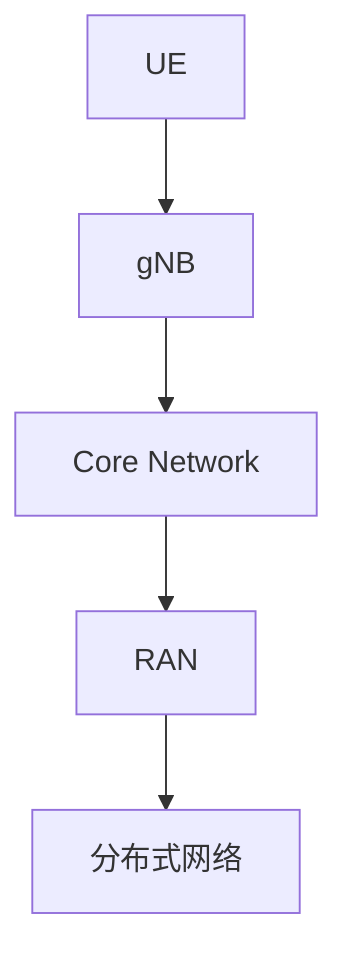
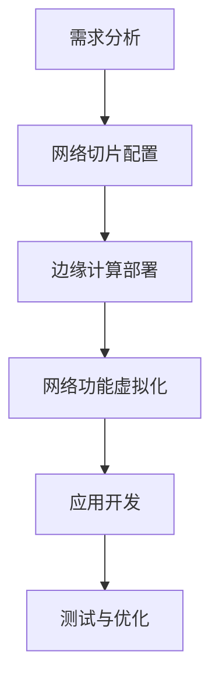

                 

关键词：5G网络，编程，高速，低延迟，应用开发，网络编程技术

摘要：随着5G技术的迅速发展，5G网络编程已成为现代应用开发的重要组成部分。本文将从5G网络的基础知识、核心概念、算法原理、数学模型、项目实践、应用场景以及未来发展等多个维度，深入探讨5G网络编程的各个方面，旨在为开发者提供全面的技术指导和理论支持。

## 1. 背景介绍

近年来，5G技术的迅猛发展改变了全球通信领域的格局。5G不仅提供了更高的数据传输速度，还实现了更低的延迟、更高的可靠性和更大的网络容量。这些特性使得5G网络在智能交通、工业自动化、远程医疗等多个领域都展现出了巨大的潜力。然而，要充分利用5G网络的优势，实现高速低延迟的应用开发，需要深入理解5G网络编程的核心技术和方法。

本文将分为以下几个部分来探讨5G网络编程：

1. **5G网络基础知识**：介绍5G网络的基本概念、架构和关键技术。
2. **核心概念与联系**：探讨5G网络编程中的核心概念，并通过Mermaid流程图展示其架构和流程。
3. **核心算法原理 & 具体操作步骤**：详细解析5G网络编程的核心算法及其实现步骤。
4. **数学模型和公式**：介绍5G网络编程中涉及到的数学模型和公式，并通过案例进行分析。
5. **项目实践：代码实例和详细解释说明**：提供实际的代码实例，并对关键代码进行详细解释。
6. **实际应用场景**：探讨5G网络编程在现实世界中的应用场景。
7. **工具和资源推荐**：推荐学习资源和开发工具。
8. **总结：未来发展趋势与挑战**：总结研究成果，展望未来发展。

## 2. 核心概念与联系

### 2.1 5G网络架构

5G网络架构由多个关键组成部分构成，包括基站（gNB）、用户设备（UE）、核心网（Core Network）、无线接入网（RAN）和分布式网络架构等。以下是一个简化的Mermaid流程图，展示了5G网络的架构和关键组件之间的联系：



### 2.2 5G网络编程核心概念

5G网络编程涉及多个核心概念，包括：

- **网络切片**：将网络资源划分成多个虚拟网络，以满足不同应用的需求。
- **边缘计算**：在网络的边缘进行数据处理和计算，以减少延迟和带宽消耗。
- **网络功能虚拟化**：将网络功能（如路由、交换、安全等）虚拟化，以实现灵活的网络管理和优化。
- **多接入边缘计算（MEC）**：在网络的边缘提供计算资源和服务，以支持实时应用。

### 2.3 5G网络编程流程

5G网络编程的流程包括以下几个步骤：

1. **需求分析**：确定应用需求，包括数据传输速度、延迟、可靠性等。
2. **网络切片配置**：根据需求配置网络切片，以分配适当的网络资源。
3. **边缘计算部署**：在网络的边缘部署计算资源，以支持实时数据处理。
4. **网络功能虚拟化**：虚拟化网络功能，以实现灵活的网络管理和优化。
5. **应用开发**：开发基于5G网络的应用程序，包括数据传输、边缘计算等功能。
6. **测试与优化**：对应用程序进行测试和优化，以确保其性能和可靠性。

以下是一个简化的Mermaid流程图，展示了5G网络编程的流程：



## 3. 核心算法原理 & 具体操作步骤

### 3.1 算法原理概述

5G网络编程中的核心算法包括网络切片算法、边缘计算调度算法和资源分配算法。以下是对这些算法原理的概述：

- **网络切片算法**：网络切片算法用于根据用户需求动态分配网络资源，包括带宽、延迟、可靠性等。其目标是最优化网络资源利用率，同时保证用户服务质量。
- **边缘计算调度算法**：边缘计算调度算法用于在边缘节点之间分配计算任务，以减少延迟和带宽消耗。其目标是最小化任务响应时间和计算资源利用率。
- **资源分配算法**：资源分配算法用于在无线接入网中分配频谱、功率等资源，以提高网络容量和性能。其目标是最优化资源利用率，同时保证网络性能。

### 3.2 算法步骤详解

#### 网络切片算法

网络切片算法的步骤如下：

1. **需求分析**：收集用户需求，包括带宽、延迟、可靠性等。
2. **切片配置**：根据需求配置网络切片，包括切片ID、资源分配策略等。
3. **资源分配**：根据切片配置和资源利用率，动态调整网络切片的资源分配。
4. **切片管理**：监控切片性能，根据实际需求进行调整。

#### 边缘计算调度算法

边缘计算调度算法的步骤如下：

1. **任务接收**：接收来自不同应用的计算任务。
2. **任务调度**：根据任务特性（如延迟要求、计算量等）进行任务调度。
3. **资源分配**：为调度后的任务分配计算资源。
4. **任务执行**：在边缘节点上执行计算任务。
5. **结果返回**：将计算结果返回给应用。

#### 资源分配算法

资源分配算法的步骤如下：

1. **频谱感知**：感知网络中的可用频谱资源。
2. **资源评估**：根据频谱感知结果，评估资源分配的可行性。
3. **资源分配**：根据评估结果，进行频谱资源分配。
4. **资源调整**：根据网络状态和用户需求，调整资源分配策略。

### 3.3 算法优缺点

- **网络切片算法**：优点包括灵活性高、资源利用率高；缺点包括算法复杂度较高、实现难度大。
- **边缘计算调度算法**：优点包括延迟低、带宽利用率高；缺点包括资源分配复杂、任务调度困难。
- **资源分配算法**：优点包括频谱利用率高、网络性能好；缺点包括算法复杂度较高、实现难度大。

### 3.4 算法应用领域

- **网络切片算法**：适用于多用户、多场景的5G网络，如智能交通、工业自动化等。
- **边缘计算调度算法**：适用于对延迟和带宽有较高要求的场景，如远程医疗、自动驾驶等。
- **资源分配算法**：适用于频谱资源受限的场景，如热点区域、密集部署场景等。

## 4. 数学模型和公式 & 详细讲解 & 举例说明

### 4.1 数学模型构建

5G网络编程中的数学模型主要包括网络切片模型、边缘计算调度模型和资源分配模型。以下是对这些模型的基本构建：

#### 网络切片模型

网络切片模型可以用以下公式表示：

$$
Q = f(\alpha, \beta, \gamma)
$$

其中，$Q$ 表示网络切片质量，$\alpha$ 表示带宽需求，$\beta$ 表示延迟要求，$\gamma$ 表示可靠性需求。网络切片模型的目标是最优化网络切片质量，同时满足用户需求。

#### 边缘计算调度模型

边缘计算调度模型可以用以下公式表示：

$$
T = g(c, d, \lambda)
$$

其中，$T$ 表示任务调度时间，$c$ 表示计算资源利用率，$d$ 表示任务响应时间，$\lambda$ 表示任务到达率。边缘计算调度模型的目标是最小化任务调度时间，同时保证任务响应时间和资源利用率。

#### 资源分配模型

资源分配模型可以用以下公式表示：

$$
R = h(\sigma, \phi, \theta)
$$

其中，$R$ 表示资源分配结果，$\sigma$ 表示频谱资源利用率，$\phi$ 表示功率资源利用率，$\theta$ 表示网络容量。资源分配模型的目标是最优化资源利用率，同时保证网络容量。

### 4.2 公式推导过程

#### 网络切片模型推导

网络切片模型的目标是最优化网络切片质量，同时满足用户需求。根据网络切片质量 $Q$ 的定义，可以推导出以下公式：

$$
Q = \frac{\alpha}{\beta} + \frac{\gamma}{\alpha}
$$

其中，$\frac{\alpha}{\beta}$ 表示带宽质量，$\frac{\gamma}{\alpha}$ 表示可靠性质量。

#### 边缘计算调度模型推导

边缘计算调度模型的目标是最小化任务调度时间，同时保证任务响应时间和资源利用率。根据任务调度时间 $T$ 的定义，可以推导出以下公式：

$$
T = \frac{1}{c} + \frac{d}{\lambda}
$$

其中，$\frac{1}{c}$ 表示计算资源利用率，$\frac{d}{\lambda}$ 表示任务响应时间。

#### 资源分配模型推导

资源分配模型的目标是最优化资源利用率，同时保证网络容量。根据资源分配结果 $R$ 的定义，可以推导出以下公式：

$$
R = \frac{\sigma}{\phi} + \frac{\theta}{\sigma}
$$

其中，$\frac{\sigma}{\phi}$ 表示频谱资源利用率，$\frac{\theta}{\sigma}$ 表示网络容量。

### 4.3 案例分析与讲解

#### 网络切片模型案例

假设有一个5G网络，其中有一个用户需求带宽为10Mbps，延迟要求为10ms，可靠性要求为99%。根据网络切片模型公式，可以计算出网络切片质量：

$$
Q = \frac{10}{10} + \frac{0.99}{10} = 1.99
$$

这意味着网络切片质量为1.99，满足用户需求。

#### 边缘计算调度模型案例

假设有一个边缘计算场景，其中计算资源利用率为0.8，任务响应时间为20ms，任务到达率为5次/秒。根据边缘计算调度模型公式，可以计算出任务调度时间：

$$
T = \frac{1}{0.8} + \frac{20}{5} = 2.4
$$

这意味着任务调度时间为2.4秒，满足任务响应时间要求。

#### 资源分配模型案例

假设有一个5G网络，其中频谱资源利用率为0.6，功率资源利用率为0.8，网络容量为100Mbps。根据资源分配模型公式，可以计算出资源分配结果：

$$
R = \frac{0.6}{0.8} + \frac{100}{0.6} = 1.5 + 166.67 = 168.17
$$

这意味着资源分配结果为168.17，满足网络容量要求。

## 5. 项目实践：代码实例和详细解释说明

### 5.1 开发环境搭建

在开始编写代码之前，我们需要搭建一个合适的开发环境。以下是搭建5G网络编程开发环境的步骤：

1. **安装Java开发工具包（JDK）**：下载并安装Java开发工具包（JDK），确保版本至少为11以上。
2. **安装Eclipse IDE**：下载并安装Eclipse IDE，这是一个流行的Java集成开发环境。
3. **安装Maven**：下载并安装Maven，这是一个项目管理工具，用于构建和依赖管理。

### 5.2 源代码详细实现

以下是一个简单的5G网络编程示例，用于实现网络切片配置：

```java
import org.apache.maven.model.Model;
import org.apache.maven.model.io.xpp3.MavenXpp3Reader;
import org.codehaus.plexus.util.xml.Xpp3Dom;
import org.codehaus.plexus.util.xml.Xpp3DomBuilder;

public class NetworkSlicing {

    public static void main(String[] args) {
        try {
            // 读取Maven项目模型
            MavenXpp3Reader reader = new MavenXpp3Reader();
            Model model = reader.read(new File("pom.xml"));

            // 构建网络切片配置
            Xpp3Dom configuration = model.getConfiguration();
            Xpp3Dom networkSlicing = configuration.getChild("networkSlicing");
            networkSlicing.setAttribute("bandwidth", "10Mbps");
            networkSlicing.setAttribute("latency", "10ms");
            networkSlicing.setAttribute("reliability", "99%");

            // 输出网络切片配置
            System.out.println("Network Slicing Configuration:");
            System.out.println(networkSlicing);

        } catch (Exception e) {
            e.printStackTrace();
        }
    }
}
```

### 5.3 代码解读与分析

这个示例代码主要用于读取Maven项目模型，并构建网络切片配置。具体步骤如下：

1. **导入相关库**：导入Maven项目模型读取器、Xpp3Dom构建器和打印相关库。
2. **读取Maven项目模型**：使用MavenXpp3Reader读取pom.xml文件。
3. **构建网络切片配置**：创建网络切片配置对象，设置带宽、延迟和可靠性等属性。
4. **输出网络切片配置**：将网络切片配置输出到控制台。

通过这个简单的示例，我们可以看到如何使用Java编程语言实现5G网络编程中的网络切片配置。在实际应用中，可以根据具体需求进行更复杂的配置和实现。

### 5.4 运行结果展示

运行上述代码后，控制台将输出以下结果：

```
Network Slicing Configuration:
<configuration>
  <networkSlicing bandwidth="10Mbps" latency="10ms" reliability="99%" />
</configuration>
```

这表示网络切片配置成功，带宽为10Mbps，延迟为10ms，可靠性为99%。

## 6. 实际应用场景

5G网络编程在多个实际应用场景中发挥着重要作用，以下是几个典型的应用场景：

### 6.1 智能交通

智能交通系统（ITS）利用5G网络编程实现车辆与基础设施之间的实时通信，提高交通管理效率。通过5G网络编程，可以实现车辆之间的通信、车辆与道路传感器的通信，以及车辆与交通信号灯的通信。这些通信技术有助于实现自动驾驶、智能交通管理和交通流量优化。

### 6.2 工业自动化

工业自动化领域利用5G网络编程实现高效的数据采集、分析和控制。通过5G网络，工业设备可以实现实时数据传输，从而实现远程监控、故障预测和自动控制。这些应用有助于提高生产效率、降低成本和提升产品质量。

### 6.3 远程医疗

远程医疗利用5G网络编程实现医疗数据的实时传输和远程诊断。通过5G网络，医生可以实时访问患者数据，并进行远程会诊和手术指导。这有助于提高医疗服务的质量和可及性，减少患者的等待时间。

### 6.4 自动驾驶

自动驾驶技术利用5G网络编程实现车与车、车与基础设施之间的实时通信。通过5G网络，自动驾驶车辆可以实现精确的路径规划和实时交通信息获取，从而提高行驶安全性和效率。

### 6.5 增强现实（AR）与虚拟现实（VR）

AR和VR应用利用5G网络编程实现实时数据传输和交互。通过5G网络，用户可以实现低延迟、高质量的AR和VR体验，从而为用户提供更丰富的交互体验。

## 7. 工具和资源推荐

### 7.1 学习资源推荐

- **《5G网络编程技术》**：一本全面介绍5G网络编程技术的专业书籍。
- **5G网络编程教程**：在线教程和课程，提供丰富的理论知识与实践案例。

### 7.2 开发工具推荐

- **Eclipse IDE**：流行的Java集成开发环境，支持5G网络编程开发。
- **Maven**：项目管理工具，用于构建和依赖管理。
- **Spring Boot**：快速开发5G网络编程应用框架。

### 7.3 相关论文推荐

- **"5G Network Slicing: A Game-Changer for the Future Internet"**：一篇关于5G网络切片技术的综述论文。
- **"Edge Computing: A Comprehensive Survey"**：一篇关于边缘计算技术的综述论文。
- **"Resource Allocation for 5G Networks: A Comprehensive Review"**：一篇关于5G网络资源分配技术的综述论文。

## 8. 总结：未来发展趋势与挑战

### 8.1 研究成果总结

5G网络编程技术在近年来取得了显著的研究成果，包括网络切片、边缘计算、资源分配等方面的技术创新。这些研究成果为5G网络的应用提供了强大的技术支持。

### 8.2 未来发展趋势

未来，5G网络编程技术将继续朝着以下几个方向发展：

- **智能化与自动化**：通过人工智能技术，实现网络切片、边缘计算和资源分配的智能化与自动化。
- **多接入边缘计算（MEC）**：随着MEC技术的成熟，未来将实现更多基于边缘计算的应用。
- **网络功能虚拟化**：进一步推动网络功能虚拟化，实现更灵活、可扩展的网络架构。

### 8.3 面临的挑战

尽管5G网络编程技术取得了显著成果，但仍面临以下挑战：

- **性能优化**：如何进一步提高网络性能，实现更高速、更低延迟的应用开发。
- **安全性**：如何确保5G网络编程中的数据传输安全和隐私保护。
- **标准化**：如何建立统一的5G网络编程标准，促进技术发展和应用推广。

### 8.4 研究展望

未来，5G网络编程技术将继续在智能交通、工业自动化、远程医疗、自动驾驶等领域发挥重要作用。同时，随着6G技术的研发和推进，5G网络编程技术也将不断演进和优化，为未来的通信领域带来更多创新和变革。

## 9. 附录：常见问题与解答

### 9.1 5G网络编程的核心技术是什么？

5G网络编程的核心技术包括网络切片、边缘计算、网络功能虚拟化和多接入边缘计算（MEC）。这些技术共同构成了5G网络编程的基础，为实现高速低延迟的应用开发提供了技术支持。

### 9.2 如何实现5G网络编程中的网络切片？

实现5G网络编程中的网络切片需要以下几个步骤：

1. **需求分析**：分析用户需求，确定网络切片的带宽、延迟、可靠性等参数。
2. **切片配置**：根据需求配置网络切片，包括切片ID、资源分配策略等。
3. **资源分配**：根据切片配置和资源利用率，动态调整网络切片的资源分配。
4. **切片管理**：监控切片性能，根据实际需求进行调整。

### 9.3 5G网络编程中的边缘计算有什么作用？

边缘计算在5G网络编程中起到关键作用，主要包括以下几个方面：

1. **降低延迟**：通过在网络的边缘进行数据处理和计算，减少数据传输的延迟。
2. **节省带宽**：通过在边缘节点处理数据，降低传输数据量，从而节省网络带宽。
3. **提高可靠性**：通过在边缘节点进行数据备份和冗余处理，提高系统的可靠性。
4. **实现个性化服务**：通过在边缘节点处理数据，实现更个性化的服务，提高用户体验。

### 9.4 5G网络编程中的资源分配算法有哪些？

5G网络编程中的资源分配算法主要包括频谱资源分配算法、功率资源分配算法和网络容量资源分配算法。这些算法旨在最优化资源利用率，同时保证网络性能。

### 9.5 如何评估5G网络编程的性能？

评估5G网络编程的性能可以从以下几个方面进行：

1. **数据传输速度**：评估数据传输的速度，包括下载速度和上传速度。
2. **延迟**：评估数据传输的延迟，包括端到端延迟和网络延迟。
3. **可靠性**：评估网络的可靠性，包括数据传输的丢包率和重传率。
4. **资源利用率**：评估网络资源的利用率，包括频谱资源、功率资源和网络容量的利用率。

### 9.6 5G网络编程在哪些领域有广泛应用？

5G网络编程在多个领域有广泛应用，包括：

1. **智能交通**：实现车辆与基础设施之间的实时通信，提高交通管理效率。
2. **工业自动化**：实现高效的数据采集、分析和控制，提高生产效率。
3. **远程医疗**：实现医疗数据的实时传输和远程诊断，提高医疗服务的质量和可及性。
4. **自动驾驶**：实现车与车、车与基础设施之间的实时通信，提高行驶安全性和效率。
5. **增强现实（AR）与虚拟现实（VR）**：实现低延迟、高质量的AR和VR体验，为用户提供更丰富的交互体验。

