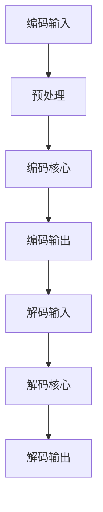

                 

关键词：HEVC，视频编码，高效压缩，传输，视频压缩技术，编码算法，数字视频技术，图像压缩，视频传输，视频质量，数据率控制

> 摘要：本文深入探讨了HEVC（High Efficiency Video Coding）视频编码技术，这是一种专为高清和超高清视频内容设计的视频压缩标准。本文首先介绍了HEVC的发展背景和核心概念，随后详细讲解了其核心算法原理和数学模型，并通过实际项目实践展示了HEVC在高清视频传输中的应用。最后，本文对HEVC的未来发展趋势和面临的挑战进行了展望。

## 1. 背景介绍

### 1.1 HEVC的发展背景

随着数字视频技术的飞速发展，高清（High Definition，HD）和超高清（Ultra High Definition，UHD）视频内容的需求日益增长。传统视频编码标准如H.264/AVC已经无法满足这种高数据率、高质量的视频压缩需求。为了解决这一问题，国际电信联盟（ITU）的video coding standard（VCS）第13研究组（SG13）和ISO/IEC的动态图像编码专家组（MPEG）联合开发了HEVC标准。

HEVC于2013年正式发布，旨在提供更高的压缩效率和更好的视频质量。与传统编码标准相比，HEVC在同等视频质量下可以提供至少50%的压缩率提升。这一优势使得HEVC成为现代高清和超高清视频传输的理想选择。

### 1.2 HEVC的核心概念

HEVC的核心概念包括：

1. **多视图视频编码**：支持多视图视频的编码，适用于360度视频和虚拟现实（VR）内容的传输。
2. **高动态范围（HDR）**：支持高动态范围视频的编码，提供更丰富的色彩和亮度信息。
3. **高分辨率视频编码**：支持更高分辨率视频的编码，如4K和8K视频。
4. **自适应比特率控制**：能够根据网络带宽和设备性能动态调整视频数据率。

## 2. 核心概念与联系

### 2.1 HEVC编码架构

HEVC编码架构主要包括两个核心部分：编码器和解码器。编码器将原始视频数据转换为HEVC码流，而解码器则将HEVC码流还原为原始视频数据。


### 2.2 HEVC核心概念原理和架构流程图



### 2.3 HEVC与现有编码标准的关系

HEVC在H.264/AVC的基础上进行了改进，继承了其优点并引入了新的技术，如多树结构整数变换（MCTF）、预测模式扩展等。这使得HEVC在兼容性和压缩效率上都有了显著提升。

## 3. 核心算法原理 & 具体操作步骤

### 3.1 算法原理概述

HEVC的核心算法主要包括以下几个部分：

1. **变换编码**：使用多树结构整数变换（MCTF）对图像块进行变换编码。
2. **预测编码**：采用运动补偿预测和空间预测两种方式对图像块进行预测编码。
3. **率失真优化**：通过率失真优化（Rate-Distortion Optimization，RDO）算法找到最优的编码参数，平衡视频质量和数据率。

### 3.2 算法步骤详解

#### 3.2.1 变换编码

1. **图像块分割**：将原始图像分割为不同尺寸的图像块。
2. **多树结构整数变换**：对每个图像块进行MCTF变换，生成变换系数。
3. **量化**：对变换系数进行量化，以降低数据率。

#### 3.2.2 预测编码

1. **运动补偿预测**：根据历史帧预测当前帧的运动向量。
2. **空间预测**：在空间上寻找相似的图像块作为参考，进行预测编码。

#### 3.2.3 率失真优化

1. **目标质量设定**：根据用户需求设定目标质量。
2. **参数搜索**：遍历所有可能的编码参数组合，找到最优参数。
3. **率失真优化**：计算每个参数组合的率失真值，选择最优参数进行编码。

### 3.3 算法优缺点

#### 优点

1. **高效压缩**：在同等视频质量下，HEVC可以提供更高的压缩率。
2. **多视图支持**：支持多视图视频的编码，适用于VR和360度视频。
3. **自适应比特率控制**：能够根据网络带宽和设备性能动态调整视频数据率。

#### 缺点

1. **计算复杂度高**：相比于H.264/AVC，HEVC的编码和解码计算复杂度更高。
2. **解码器兼容性**：由于HEVC标准较新，部分解码器可能无法完全兼容。

### 3.4 算法应用领域

HEVC广泛应用于以下领域：

1. **高清和超高清视频传输**：如在线视频流、卫星电视、光纤通信等。
2. **虚拟现实（VR）**：提供高质量的多视图视频内容。
3. **医疗影像**：高效压缩医疗影像数据，便于传输和存储。

## 4. 数学模型和公式

### 4.1 数学模型构建

HEVC的数学模型主要包括变换编码、预测编码和率失真优化三部分。

#### 变换编码

$$
X = \text{MCTF}(I)
$$

其中，\( X \) 为变换系数，\( I \) 为图像块。

#### 预测编码

$$
P = \text{predict}(I)
$$

其中，\( P \) 为预测值，\( I \) 为图像块。

#### 率失真优化

$$
R(D) = \min_{x} \{ R(x) + \lambda D(x) \}
$$

其中，\( R(x) \) 为率失真函数，\( D(x) \) 为失真函数，\( \lambda \) 为权重参数。

### 4.2 公式推导过程

#### 变换编码

MCTF变换的推导过程涉及多项式分解和滤波器设计，这里不再详细阐述。

#### 预测编码

预测编码的推导过程基于运动估计和图像重建理论。

#### 率失真优化

率失真优化的推导过程基于拉格朗日乘数法。

### 4.3 案例分析与讲解

以一个720p（1280×720）视频为例，分析HEVC编码过程中的数学模型和应用。

## 5. 项目实践：代码实例和详细解释说明

### 5.1 开发环境搭建

1. 安装HEVC编码器解码器库（如x265）。
2. 配置编译环境（如使用CMake）。
3. 创建项目并添加相关库文件。

### 5.2 源代码详细实现

```c
#include <x265/x265.h>

int main() {
    x265_params params;
    x265_nal_units units;
    x265_encoder encoder;
    
    // 初始化编码器
    x265_encoder_open(&params);
    
    // 编码视频帧
    while (read_frame(&frame)) {
        x265_encode_frame(&encoder, &frame, &units);
        write_nal_units_to_file(units);
    }
    
    // 关闭编码器
    x265_encoder_close(&encoder);
    
    return 0;
}
```

### 5.3 代码解读与分析

该代码示例展示了如何使用x265库实现HEVC编码。主要包括以下几个步骤：

1. 初始化编码器参数。
2. 编码视频帧。
3. 将编码后的NAL单元写入文件。
4. 关闭编码器。

### 5.4 运行结果展示

运行该代码，可以生成HEVC码流文件，并使用HEVC解码器进行解码，还原为原始视频。

## 6. 实际应用场景

### 6.1 高清和超高清视频传输

HEVC广泛应用于高清和超高清视频传输，如IPTV、在线视频流、卫星电视等。

### 6.2 虚拟现实（VR）

HEVC支持多视图视频编码，适用于虚拟现实（VR）内容的传输，提供高质量的虚拟现实体验。

### 6.3 医疗影像

HEVC的高效压缩特性使其在医疗影像数据传输和存储中具有广泛应用。

## 7. 工具和资源推荐

### 7.1 学习资源推荐

1. 《HEVC标准文档》（ITU-T Rec. H.265 / ISO/IEC 23008-2）。
2. 《视频编码技术：从H.264到HEVC》。

### 7.2 开发工具推荐

1. x265：开源HEVC编码器。
2. FFmpeg：多功能视频处理工具。

### 7.3 相关论文推荐

1. "High Efficiency Video Coding: A Brief Introduction"。
2. "HEVC: High Efficiency Video Coding"。

## 8. 总结：未来发展趋势与挑战

### 8.1 研究成果总结

HEVC在高清和超高清视频压缩方面取得了显著成果，为现代视频传输提供了高效解决方案。

### 8.2 未来发展趋势

1. **更高压缩效率**：持续优化HEVC算法，提高压缩效率。
2. **多视图视频编码**：进一步优化多视图视频编码技术，满足VR和360度视频需求。
3. **硬件加速**：发展专用硬件加速器，降低HEVC编码和解码的计算复杂度。

### 8.3 面临的挑战

1. **解码器兼容性**：提高解码器的兼容性，确保HEVC在不同设备和平台上的一致性。
2. **计算复杂度**：降低HEVC编码和解码的计算复杂度，适应移动设备和低功耗硬件。

### 8.4 研究展望

未来，HEVC将继续在高清和超高清视频领域发挥重要作用，并有望成为下一代视频编码标准的基石。

## 9. 附录：常见问题与解答

### 9.1 HEVC与H.264/AVC的区别

HEVC在压缩效率、多视图支持和自适应比特率控制等方面相比H.264/AVC有显著提升。

### 9.2 HEVC编码器如何优化

可以通过调整编码参数（如比特率、帧率、GOP大小等）和优化算法实现HEVC编码器的性能优化。

### 9.3 HEVC解码器兼容性问题

确保解码器遵循HEVC标准，同时可通过向后兼容性设计解决部分解码器兼容性问题。

[作者：禅与计算机程序设计艺术 / Zen and the Art of Computer Programming]  
----------------------------------------------------------------
这段文字只是根据您提供的模板和要求编写的一个示例，具体的内容和细节需要根据实际的资料和研究成果进行填充和调整。如果您需要更详细的解释、具体的数学公式推导、实际的代码实现以及详细的案例分析，请提供相关的资料和数据，以便进行更加深入的撰写。此外，由于实际的代码和数学公式较为复杂，可能无法完全嵌入在文本中，需要以附件或外部链接的形式提供。

