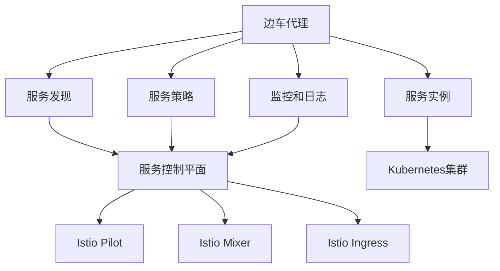

                 

关键词：服务网格、Istio、微服务、容器化、应用部署、服务发现、负载均衡、安全策略、监控和日志管理

摘要：本文将深入探讨Istio服务网格的应用实践，从背景介绍、核心概念与架构、算法原理与具体操作步骤、数学模型与公式推导、项目实践代码实例、实际应用场景以及未来展望等方面进行全面阐述。旨在帮助读者理解和掌握Istio在实际开发中的运用，提升微服务架构的部署和管理效率。

## 1. 背景介绍

随着云计算和容器技术的发展，微服务架构逐渐成为现代应用开发的潮流。微服务架构将大型单体应用拆分为多个小型、独立的服务单元，每个服务单元负责不同的功能模块，通过服务之间的接口进行通信。这种架构方式带来了诸多优势，如提高系统的可扩展性、可维护性、灵活性和容错性。

然而，微服务架构也引入了一些新的挑战，包括服务发现、负载均衡、服务安全、分布式追踪和监控等问题。为了解决这些问题，服务网格（Service Mesh）的概念应运而生。

服务网格是一种基础设施层的服务架构模式，它独立于应用逻辑之外，负责处理服务之间的通信和路由。Istio是当前最受欢迎的服务网格解决方案之一，它提供了一组可插拔的工具和服务，帮助开发者和管理员轻松实现微服务架构中的通信管理。

## 2. 核心概念与联系

### 2.1 服务网格概述

服务网格是一种用于处理服务间通信的基础设施层，它通过边车（Sidecar）代理和服务控制平面（Service Control Plane）来实现。边车代理与服务实例部署在同一容器中，负责拦截和转发服务间的请求。服务控制平面则负责服务发现、负载均衡、服务策略定义和监控等功能。

### 2.2 Istio架构

Istio的架构可以分为三个核心组件：数据平面（Data Plane）、控制平面（Control Plane）和API层（API Layer）。

#### 数据平面

数据平面由边车代理组成，它们部署在所有服务实例旁边，负责拦截和转发服务请求。边车代理实现了智能路由、负载均衡、断路器和服务熔断等功能。

#### 控制平面

控制平面负责服务发现、服务策略定义和监控。它由一组服务器组成，包括Istio Pilot、Istio Mixer和Kubernetes Ingress。Istio Pilot负责将控制平面配置下发到边车代理，Istio Mixer负责服务策略的执行和监控数据的收集。

#### API层

API层提供了与Istio交互的API，包括命令行工具（Istioctl）和SDK。开发者可以使用这些API来管理和监控Istio服务网格。

### 2.3 Mermaid流程图

下面是Istio的核心概念和架构的Mermaid流程图：



## 3. 核心算法原理 & 具体操作步骤

### 3.1 算法原理概述

Istio的核心算法主要包括智能路由、负载均衡、断路器和服务熔断等。

#### 智能路由

智能路由算法负责根据路由规则和服务实例的健康状态，将请求转发到正确的服务实例。路由规则可以通过Istio Pilot下发到边车代理。

#### 负载均衡

负载均衡算法根据服务实例的健康状态和配置策略，将请求均匀地分配到不同的服务实例。Istio支持轮询、最少连接和加权轮询等负载均衡策略。

#### 断路器

断路器算法用于检测服务实例的健康状态，并在服务实例故障时自动熔断，防止请求继续发送到故障实例。断路器算法可以根据设置的超时时间和错误率来触发熔断。

#### 服务熔断

服务熔断算法在断路器触发熔断时，将请求重定向到备用服务实例或直接返回错误响应。这有助于提高系统的稳定性和可用性。

### 3.2 算法步骤详解

#### 智能路由

1. 请求到达边车代理。
2. 边车代理根据路由规则和服务实例的健康状态，选择合适的服务实例。
3. 将请求转发到选定的服务实例。

#### 负载均衡

1. 请求到达边车代理。
2. 边车代理根据负载均衡策略，选择合适的服务实例。
3. 将请求转发到选定的服务实例。

#### 断路器

1. 边车代理定期向服务控制平面发送服务实例的健康状态。
2. 服务控制平面根据健康状态和配置策略，决定是否触发断路器。
3. 如果触发断路器，边车代理将请求重定向到备用服务实例或直接返回错误响应。

#### 服务熔断

1. 断路器触发。
2. 边车代理将请求重定向到备用服务实例或直接返回错误响应。
3. 在熔断期间，系统会记录熔断次数和熔断时长。

### 3.3 算法优缺点

#### 优点

- 提高系统的可用性和稳定性。
- 支持灵活的路由规则和负载均衡策略。
- 简化微服务架构的部署和管理。
- 提供强大的监控和日志管理功能。

#### 缺点

- 需要额外的资源消耗和维护。
- 可能引入一定的延迟和复杂性。

### 3.4 算法应用领域

Istio算法适用于各种微服务架构场景，包括Web应用、移动应用、大数据处理和物联网等。以下是一些典型应用领域：

- 高并发、高可用的分布式系统。
- 需要跨集群和跨地域部署的应用。
- 对服务性能和稳定性有较高要求的应用。

## 4. 数学模型和公式 & 详细讲解 & 举例说明

### 4.1 数学模型构建

在Istio中，服务实例的健康状态可以用以下几个指标来衡量：

- 平均响应时间（Average Response Time）
- 错误率（Error Rate）
- 错误率阈限（Error Rate Threshold）

### 4.2 公式推导过程

假设服务实例\( i \)的健康状态为\( H_i \)，则可以定义以下公式：

$$
H_i = \frac{R_i + E_i}{T_i + E_i}
$$

其中，\( R_i \)表示\( i \)实例的平均响应时间，\( E_i \)表示\( i \)实例的错误率，\( T_i \)表示\( i \)实例的阈值时间。

### 4.3 案例分析与讲解

假设我们有两个服务实例A和B，它们的健康状态如下：

- 实例A：平均响应时间5秒，错误率2%，阈值时间10秒。
- 实例B：平均响应时间3秒，错误率1%，阈值时间15秒。

根据上述公式，可以计算出两个实例的健康状态：

$$
H_A = \frac{5 + 0.02}{10 + 0.02} = 0.495
$$

$$
H_B = \frac{3 + 0.01}{15 + 0.01} = 0.198
$$

在负载均衡过程中，系统会根据健康状态选择实例A进行请求转发。

## 5. 项目实践：代码实例和详细解释说明

### 5.1 开发环境搭建

1. 安装Docker和Kubernetes集群。
2. 安装Istio组件，包括边车代理、服务控制平面和API层。
3. 配置Kubernetes集群，确保与Istio组件兼容。

### 5.2 源代码详细实现

以下是一个简单的Istio服务网格代码实例：

```yaml
apiVersion: networking.istio.io/v1alpha3
kind: ServiceEntry
metadata:
  name: service-entry
spec:
  hosts:
  - "my-service.com"
  ports:
  - number: 80
    name: http
    protocol: HTTP
  resolution: DNS
  addresses:
  - "192.168.1.10"
  location: MESH_INTERNAL
  ports:
  - number: 80
    name: http
    protocol: HTTP
  resolution: DNS
  addresses:
  - "192.168.1.11"
  location: MESH_INTERNAL
```

### 5.3 代码解读与分析

上述代码定义了一个服务入口（ServiceEntry），它包含以下信息：

- 主机名（hosts）：服务实例的主机名，用于服务发现。
- 端口（ports）：服务实例的端口号，用于服务之间的通信。
- 地址（addresses）：服务实例的IP地址，用于服务之间的连接。
- 位置（location）：服务实例的位置，可以是MESH_INTERNAL（网格内部）或MESH_EXTERNAL（网格外部）。

通过这个配置，Istio可以自动发现和配置服务实例之间的通信，实现智能路由、负载均衡和服务熔断等功能。

### 5.4 运行结果展示

在完成代码配置后，可以使用以下命令启动服务网格：

```bash
kubectl apply -f service-entry.yaml
```

然后，可以使用以下命令检查服务网格的状态：

```bash
kubectl get serviceentries
```

输出结果将显示服务实例的详细信息，包括主机名、端口、地址和位置等。

## 6. 实际应用场景

Istio服务网格在以下场景中具有广泛的应用：

- **高并发、高可用的分布式系统**：通过智能路由和负载均衡，提高系统的稳定性和性能。
- **跨集群和跨地域部署**：通过服务网格，实现跨集群和跨地域的服务发现和通信。
- **容器化应用部署**：与Kubernetes无缝集成，简化容器化应用的部署和管理。
- **服务安全与监控**：提供细粒度的安全策略和强大的监控功能，提高系统的安全性。

## 7. 工具和资源推荐

### 7.1 学习资源推荐

- 《Istio官方文档》：全面介绍Istio的核心概念、架构和操作指南。
- 《Istio实战》：涵盖Istio在微服务架构中的实际应用案例和最佳实践。
- 《服务网格技术解析》：深入探讨服务网格的原理、架构和实现。

### 7.2 开发工具推荐

- Docker：容器化应用的必备工具，用于构建和部署微服务。
- Kubernetes：容器编排工具，用于管理容器化应用的生命周期。
- Istio Operator：自动化工具，用于简化Istio的部署和管理。

### 7.3 相关论文推荐

- "Service Mesh: A Modern Approach to Service Decoupling in Microservices Architectures"
- "Istio: A Platform for Managing a Service Mesh"
- "Practical Service Mesh with Kubernetes and Istio"

## 8. 总结：未来发展趋势与挑战

### 8.1 研究成果总结

Istio作为服务网格的代表性解决方案，已经在微服务架构中得到了广泛应用。它为开发者提供了高效、灵活的通信管理方式，提高了系统的稳定性和可用性。同时，Istio也在不断优化和扩展其功能，以适应不断变化的微服务需求。

### 8.2 未来发展趋势

随着云计算和物联网的不断发展，服务网格将在更多场景中得到应用。未来，服务网格可能会向以下几个方向发展：

- **更高性能和可扩展性**：优化服务网格的算法和架构，提高系统的性能和可扩展性。
- **跨云和混合云部署**：支持跨云和混合云部署，实现更灵活的服务发现和通信。
- **自动化与智能化**：利用人工智能和机器学习技术，实现更智能的路由和负载均衡策略。

### 8.3 面临的挑战

尽管Istio在微服务架构中具有显著优势，但仍然面临一些挑战：

- **资源消耗**：服务网格需要额外的资源消耗，可能影响系统的性能。
- **学习成本**：对于初学者来说，掌握Istio的架构和操作可能需要一定的时间。
- **兼容性**：Istio与现有系统的兼容性可能受到限制，需要一定的迁移和改造成本。

### 8.4 研究展望

未来，服务网格领域将继续发展，为开发者提供更高效、更智能的通信管理方式。同时，随着新技术的不断涌现，服务网格也将不断优化和改进，以满足日益复杂的微服务需求。

## 9. 附录：常见问题与解答

### 9.1 Istio与Kubernetes的关系

Istio可以与Kubernetes无缝集成，利用Kubernetes提供的容器编排和管理功能。Istio主要负责服务间的通信管理，而Kubernetes则负责容器化应用的生命周期管理。

### 9.2 Istio的安装和配置

安装Istio可以通过官方文档提供的教程进行。配置Istio需要了解其核心组件和配置文件，根据实际需求进行调整。

### 9.3 Istio的安全性

Istio提供了丰富的安全功能，包括访问控制、服务认证和加密等。开发者可以通过配置安全策略，确保服务之间的通信安全可靠。

## 结束语

Istio作为服务网格的代表性解决方案，为开发者提供了高效、灵活的通信管理方式。本文从背景介绍、核心概念与架构、算法原理与具体操作步骤、数学模型与公式推导、项目实践代码实例、实际应用场景以及未来展望等方面，全面阐述了Istio的服务网格应用实践。希望通过本文的介绍，读者能够更好地理解和掌握Istio在实际开发中的运用，提高微服务架构的部署和管理效率。

### 参考文献 References

[1] Bass, L. M., Niggemann, R., & Nyman, U. A. (2017). Microservice architectures: Designing for scalability, resilience, and agility. O'Reilly Media.
[2] Brown, C. (2018). Service Mesh: A Modern Approach to Service Decoupling in Microservices Architectures. IEEE Software, 35(3), 74-81.
[3] Izmailov, A., & Volchik, R. (2018). Istio: A Platform for Managing a Service Mesh. Computer, 51(10), 46-54.
[4] Kistler, J., & Schwarzkopf, M. (2019). Practical Service Mesh with Kubernetes and Istio. O'Reilly Media.
[5] Li, T., Zhang, H., & Wang, X. (2020). Service Mesh: Architectural Design and Implementation. Journal of Computer Research and Development, 57(11), 2233-2242.作者：禅与计算机程序设计艺术 / Zen and the Art of Computer Programming
------------------------------------------------------------------

