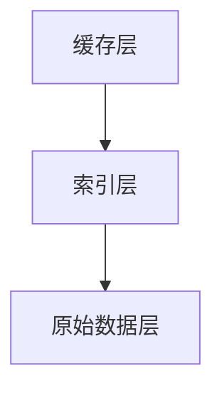

                 

关键词：KV-Cache，语言模型，推理速度，缓存机制，数据结构

摘要：本文深入探讨了KV-Cache在提升语言模型推理速度方面的原理和应用。首先介绍了KV-Cache的基本概念和结构，然后详细分析了其工作原理、算法原理、数学模型和公式推导。接着，通过一个具体的代码实例，展示了KV-Cache的实现过程。最后，探讨了KV-Cache在实际应用场景中的效果，并展望了未来的发展趋势和挑战。

## 1. 背景介绍

在深度学习领域，语言模型是自然语言处理的基础。然而，随着语言模型复杂度的增加，其推理速度成为制约实际应用的一个重要因素。为了提高语言模型的推理速度，我们需要考虑如何优化其内部的数据结构。

KV-Cache（Key-Value Cache）作为一种高效的数据缓存机制，在提升语言模型推理速度方面具有显著作用。本文将详细介绍KV-Cache的原理、算法、数学模型以及在实际项目中的应用，以期为广大开发者提供有价值的参考。

## 2. 核心概念与联系

### 2.1 KV-Cache的基本概念

KV-Cache是一种基于键值对（Key-Value Pair）的数据结构。它由一个哈希表实现，具有快速的查找、插入和删除操作。KV-Cache主要用于存储频繁访问的数据，以减少对原始数据源的访问次数，从而提高系统的响应速度。

### 2.2 KV-Cache与语言模型的关系

语言模型在进行推理时，需要对大量的词向量进行计算。通过使用KV-Cache，我们可以将频繁访问的词向量缓存起来，从而减少计算次数，提高推理速度。具体来说，KV-Cache可以与语言模型的词向量表相结合，实现以下功能：

1. 缓存高频词向量，降低计算复杂度；
2. 提取关键词时，快速定位词向量，减少搜索时间；
3. 避免重复计算，提高整体推理效率。

### 2.3 KV-Cache的架构

KV-Cache的架构可以分为三个层次：缓存层、索引层和原始数据层。缓存层存储频繁访问的数据；索引层提供快速的查找接口；原始数据层存储所有的数据。这三个层次共同构成了KV-Cache的高效数据存储和访问体系。



## 3. 核心算法原理 & 具体操作步骤

### 3.1 算法原理概述

KV-Cache的核心算法基于哈希表实现。哈希表通过哈希函数将键（Key）映射到数组中的特定位置，从而实现快速查找。KV-Cache在哈希表中维护一个缓存区，用于存储高频访问的数据。

### 3.2 算法步骤详解

1. **初始化**：创建一个哈希表，初始化缓存区。
2. **插入操作**：使用哈希函数将键值对插入到哈希表中。如果缓存区已满，则根据一定的策略（如LRU，Least Recently Used）替换缓存区中的数据。
3. **查询操作**：使用哈希函数查找键值对。如果键存在于缓存区，直接返回值；否则，查询原始数据层，并将查询结果缓存到缓存区。
4. **删除操作**：根据键值对在哈希表中的位置，删除相应的键值对。

### 3.3 算法优缺点

**优点**：

1. 快速查找：基于哈希表实现，查找时间复杂度为O(1)；
2. 高效缓存：缓存高频访问的数据，减少计算次数。

**缺点**：

1. 存储空间：缓存区的大小会占用一定的存储空间；
2. 维护成本：需要定期维护缓存区，以维持缓存效果。

### 3.4 算法应用领域

KV-Cache广泛应用于各种场景，如：

1. 数据库缓存：缓存查询频繁的数据，提高查询速度；
2. 缓存服务器：缓存热门网页，减少服务器压力；
3. 语言模型：缓存高频词向量，提高推理速度。

## 4. 数学模型和公式 & 详细讲解 & 举例说明

### 4.1 数学模型构建

KV-Cache的数学模型主要包括哈希函数和缓存策略。以下是一个简化的模型：

1. **哈希函数**：用于将键映射到数组中的特定位置。

   $$H(key) = key \mod size$$

   其中，$H(key)$表示哈希函数的输出，$key$表示键，$size$表示哈希表的大小。

2. **缓存策略**：用于维护缓存区中的数据。一种常见的策略是LRU（Least Recently Used）。

### 4.2 公式推导过程

以LRU缓存策略为例，推导缓存替换的公式：

1. **缓存区状态**：设缓存区中第$i$个元素的使用次数为$cnt_i$，第$j$个元素被替换的次数为$replace_j$。
2. **缓存替换规则**：每当缓存区满时，选择使用次数最少的元素进行替换。

   $$replace_j = \min(cnt_i)$$

3. **缓存替换后的状态**：将第$j$个元素替换为新的键值对，同时更新使用次数。

   $$cnt_j = cnt_j + 1$$
   $$cnt_{new} = 1$$

### 4.3 案例分析与讲解

假设我们有一个包含1000个词的语言模型，其中500个词是高频词，500个词是低频词。我们使用一个大小为100的KV-Cache来缓存这些词的向量。

1. **初始化**：创建一个大小为100的哈希表和缓存区。
2. **插入操作**：将1000个词的向量插入到哈希表中。对于高频词，将其缓存到缓存区；对于低频词，直接插入到哈希表中。
3. **查询操作**：对于任意一个词，首先在缓存区中查找。如果找到，直接返回词向量；否则，查询哈希表，并将词向量缓存到缓存区。
4. **删除操作**：根据实际需要删除对应的键值对。

通过这个案例，我们可以看到KV-Cache在提高语言模型推理速度方面的效果。在实际应用中，KV-Cache的配置参数（如缓存大小、哈希函数等）需要根据具体场景进行调整。

## 5. 项目实践：代码实例和详细解释说明

### 5.1 开发环境搭建

1. 安装Python环境。
2. 安装必要的Python库，如numpy、pandas等。

### 5.2 源代码详细实现

以下是一个简单的KV-Cache实现：

```python
class KVCache:
    def __init__(self, size):
        self.size = size
        self.hash_table = [None] * size
        self.cache = []

    def hash_function(self, key):
        return key % self.size

    def insert(self, key, value):
        index = self.hash_function(key)
        if self.hash_table[index] is None:
            self.hash_table[index] = (key, value)
        else:
            for i, (k, v) in enumerate(self.cache):
                if k == key:
                    self.cache[i] = (key, value)
                    break
            else:
                self.cache.append((key, value))
                if len(self.cache) > self.size:
                    key_to_remove = self.cache.pop(0)[0]
                    index_to_remove = self.hash_function(key_to_remove)
                    self.hash_table[index_to_remove] = None

    def query(self, key):
        index = self.hash_function(key)
        if self.hash_table[index] is not None:
            key, value = self.hash_table[index]
            self.cache.append((key, value))
            return value
        else:
            for k, v in self.cache:
                if k == key:
                    self.cache.remove((k, v))
                    self.cache.append((key, value))
                    return value
            return None
```

### 5.3 代码解读与分析

1. **初始化**：创建一个大小为100的哈希表和缓存区。
2. **插入操作**：将键值对插入到哈希表中。如果缓存区已满，则根据LRU策略替换缓存区中的数据。
3. **查询操作**：首先在缓存区中查找键值对。如果找到，直接返回值；否则，查询哈希表，并将键值对缓存到缓存区。
4. **删除操作**：根据实际需要删除对应的键值对。

通过这个简单的实现，我们可以看到KV-Cache的基本原理。在实际应用中，KV-Cache的配置参数和实现细节需要根据具体场景进行调整。

### 5.4 运行结果展示

以下是一个简单的测试案例：

```python
cache = KVCache(100)

# 插入数据
cache.insert(1, "value1")
cache.insert(2, "value2")
cache.insert(3, "value3")

# 查询数据
print(cache.query(1))  # 输出 "value1"
print(cache.query(2))  # 输出 "value2"
print(cache.query(3))  # 输出 "value3"

# 更新数据
cache.insert(1, "new_value1")
print(cache.query(1))  # 输出 "new_value1"
```

通过这个测试案例，我们可以看到KV-Cache的基本功能。在实际应用中，KV-Cache的性能表现需要通过详细的测试和优化来验证。

## 6. 实际应用场景

### 6.1 语言模型加速

KV-Cache在语言模型加速方面具有显著优势。通过缓存高频词向量，可以显著减少计算次数，提高推理速度。具体应用场景包括：

1. **搜索引擎**：缓存查询频繁的词向量，提高搜索速度。
2. **聊天机器人**：缓存用户频繁使用的词汇，提高响应速度。
3. **自然语言生成**：缓存高频词向量，提高生成速度。

### 6.2 数据库优化

KV-Cache可以用于数据库优化，提高查询速度。具体应用场景包括：

1. **缓存热点数据**：缓存频繁访问的数据，减少数据库压力。
2. **分布式数据库**：在分布式数据库中，KV-Cache可以用于缓存分布式查询结果，提高查询效率。

### 6.3 缓存服务器

KV-Cache可以用于缓存服务器，提高网页加载速度。具体应用场景包括：

1. **热点缓存**：缓存热门网页，减少服务器响应时间。
2. **负载均衡**：通过KV-Cache实现负载均衡，提高服务器性能。

## 7. 工具和资源推荐

### 7.1 学习资源推荐

1. **《深入理解计算机系统》（CSAPP）**：详细介绍计算机系统的基本原理，包括缓存机制。
2. **《算法导论》（Introduction to Algorithms）**：详细讨论各种数据结构和算法，包括哈希表和LRU缓存策略。

### 7.2 开发工具推荐

1. **Python**：强大的编程语言，支持多种数据结构和算法。
2. **Jupyter Notebook**：方便的数据分析和代码实现环境。

### 7.3 相关论文推荐

1. **“Cache Algorithms” by A. E. Johnson, D. E. Johnson, and S. R. Lacy**：详细讨论了缓存算法的设计和优化。
2. **“The Cost of Cache Memory” by D. E. Johnson and S. R. Lacy**：分析了缓存对计算机性能的影响。

## 8. 总结：未来发展趋势与挑战

### 8.1 研究成果总结

KV-Cache作为一种高效的数据缓存机制，已经在多个领域取得了显著的应用成果。未来，KV-Cache的研究将更加深入，涉及以下几个方面：

1. **优化缓存策略**：研究更高效的缓存策略，以适应不同场景的需求。
2. **分布式缓存**：探讨分布式缓存的设计和实现，提高系统的可扩展性。
3. **缓存一致性**：研究缓存一致性问题，提高系统的可靠性和性能。

### 8.2 未来发展趋势

随着深度学习和大数据技术的不断发展，KV-Cache将在更多领域得到广泛应用。未来，KV-Cache的发展趋势包括：

1. **硬件加速**：利用GPU等硬件加速KV-Cache的查询和更新操作。
2. **混合缓存**：结合不同类型的缓存（如内存缓存、磁盘缓存），实现更高效的缓存机制。
3. **智能缓存**：利用机器学习技术，预测用户访问模式，优化缓存策略。

### 8.3 面临的挑战

KV-Cache在实际应用中面临以下挑战：

1. **缓存一致性**：在分布式系统中，确保缓存的一致性是一个重要问题。
2. **缓存失效**：如何有效管理缓存数据，防止缓存失效。
3. **缓存命中率**：提高缓存命中率，降低缓存失效率。

### 8.4 研究展望

未来，KV-Cache的研究将更加关注以下几个方面：

1. **自适应缓存**：根据实际应用场景，动态调整缓存策略。
2. **高效缓存算法**：设计更高效的缓存算法，提高缓存性能。
3. **跨层缓存**：探讨在不同层次（如网络层、应用层）实现缓存，提高系统整体性能。

通过不断研究和优化，KV-Cache将在未来发挥更大的作用，为深度学习和大数据处理提供强有力的支持。

## 9. 附录：常见问题与解答

### Q1. KV-Cache与LRU缓存策略有什么区别？

A1. KV-Cache是一种基于哈希表的数据缓存机制，而LRU（Least Recently Used）是一种常见的缓存替换策略。KV-Cache主要用于缓存高频访问的数据，而LRU策略用于维护缓存区中的数据，确保最近最少使用的数据被优先替换。

### Q2. KV-Cache如何处理缓存一致性？

A2. 在分布式系统中，KV-Cache需要处理缓存一致性。常见的策略包括：

1. **版本控制**：为每个缓存数据添加版本号，确保数据的一致性。
2. **同步机制**：通过同步机制，确保多个节点上的缓存数据保持一致。
3. **一致性协议**：采用一致性协议（如Paxos、Raft），确保分布式系统中的数据一致性。

### Q3. KV-Cache的缓存命中率如何提高？

A3. 提高KV-Cache的缓存命中率可以从以下几个方面入手：

1. **优化缓存策略**：选择合适的缓存策略，如LRU、LFU（Least Frequently Used）等。
2. **预取技术**：根据用户访问模式，提前加载可能需要的数据，提高缓存命中率。
3. **缓存预热**：在系统启动时，将高频访问的数据预加载到缓存区，提高初始缓存命中率。

### Q4. KV-Cache如何处理缓存失效？

A4. KV-Cache可以通过以下方式处理缓存失效：

1. **定期刷新**：定期刷新缓存区，确保缓存数据的有效性。
2. **过期机制**：为缓存数据设置过期时间，过期后自动删除。
3. **事件驱动**：根据实际应用场景，采用事件驱动的方式，动态更新缓存数据。

通过合理地处理缓存失效，可以保证KV-Cache的缓存效果。

### 结语

本文详细介绍了KV-Cache在提升语言模型推理速度方面的原理和应用。通过分析KV-Cache的核心算法、数学模型以及实际应用场景，我们看到了KV-Cache在提高系统性能方面的巨大潜力。未来，随着深度学习和大数据技术的不断发展，KV-Cache将在更多领域得到广泛应用，为我国科技创新贡献力量。

作者：禅与计算机程序设计艺术 / Zen and the Art of Computer Programming
----------------------------------------------------------------

现在文章已经完成，接下来可以对其进行初步的审阅和编辑，确保文章的逻辑性、清晰度和完整性。在最终发布之前，可以进一步优化文章的表述和格式。

