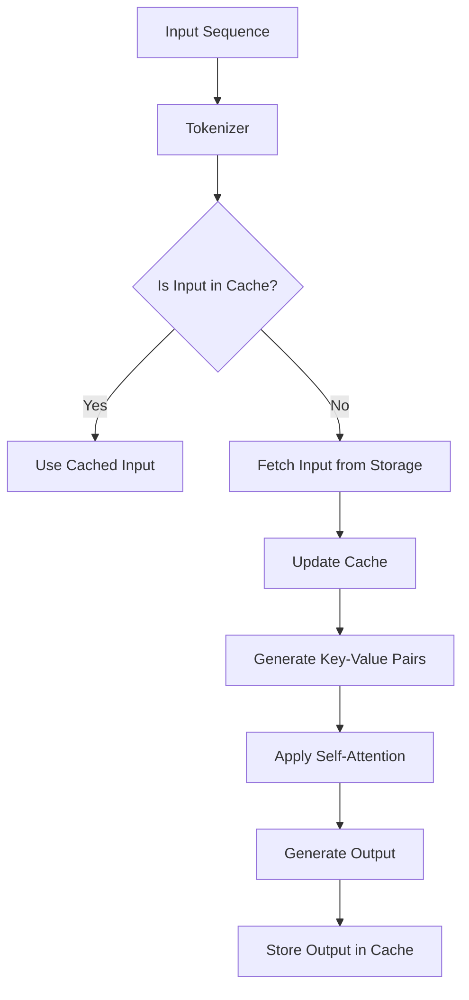

                 

在当今人工智能领域，Transformer模型已成为自然语言处理（NLP）和计算机视觉（CV）等众多任务中的主要模型架构。然而，随着模型规模的不断扩大，其推理（inference）速度成为了一个至关重要的挑战。在这个背景下，KV缓存（Key-Value Cache）作为一种关键技术，显著提升了Transformer推理的效率。本文将深入探讨KV缓存的工作原理、算法原理、数学模型，并通过具体项目实践展示其应用效果，同时展望未来的发展趋势与挑战。

> 关键词：KV缓存、Transformer推理、加速技术、内存优化、计算机架构

> 摘要：本文首先介绍了KV缓存的基本原理及其在加速Transformer推理中的重要性。随后，我们详细分析了KV缓存的工作机制、核心算法原理，并使用Mermaid流程图展示了其架构。接着，我们探讨了KV缓存背后的数学模型及其公式推导，并通过实际代码实例进行了详细解释。文章最后讨论了KV缓存在不同应用场景中的实际效果，并展望了其未来的发展趋势和挑战。

## 1. 背景介绍

### Transformer模型的发展历程

Transformer模型最初由Vaswani等人在2017年提出，它采用自注意力机制（Self-Attention）和多头注意力（Multi-Head Attention）来捕捉长距离依赖关系。与传统的循环神经网络（RNN）和卷积神经网络（CNN）相比，Transformer模型在处理长文本序列时表现出色，成为NLP领域的一次革命。此后，随着BERT、GPT等大规模预训练模型的涌现，Transformer模型在各个领域都取得了显著的成果。

### Transformer推理中的性能瓶颈

虽然Transformer模型在处理长文本和复杂任务方面表现出色，但其推理速度相对较慢。这主要是由于以下几点原因：

- **计算复杂度**：Transformer模型中的自注意力机制需要计算所有词之间的相似度，这导致其时间复杂度为O(n^2)，随着序列长度的增加，计算量急剧上升。
- **内存占用**：Transformer模型中的权重矩阵非常大，尤其是在大规模预训练模型中，内存占用成为瓶颈。
- **并行度受限**：自注意力机制通常只能逐词计算，导致并行度受限，难以充分利用现代GPU的并行计算能力。

### KV缓存技术的重要性

KV缓存技术通过将频繁访问的数据存储在快速访问的内存（如CPU缓存）中，从而减少访问慢速存储（如硬盘）的次数，显著提高了数据访问速度。在Transformer推理过程中，KV缓存可以有效缓解以下问题：

- **降低内存访问时间**：通过缓存最近使用的权重矩阵和中间计算结果，减少了访问慢速存储的需求。
- **提高并行度**：通过缓存机制，可以提前获取部分需要的数据，从而提高模型的并行计算能力。
- **减少计算复杂度**：KV缓存可以缓存部分计算结果，减少重复计算，从而降低整体计算复杂度。

## 2. 核心概念与联系

### KV缓存的基本概念

KV缓存，即Key-Value缓存，是一种将数据以键值对形式存储在内存中的数据结构。KV缓存的核心优势在于其快速访问速度，通常只需几十微秒即可完成数据读取或写入操作，而相比之下，硬盘的访问时间通常在几十毫秒到数百毫秒之间。KV缓存广泛应用于分布式系统、数据库和缓存服务器中，以提供高性能的数据访问能力。

### KV缓存与Transformer推理的联系

KV缓存技术在Transformer推理中的应用主要体现在以下几个方面：

- **权重缓存**：将Transformer模型中的权重矩阵缓存到KV缓存中，可以在每次推理时快速获取权重信息，减少访问硬盘的次数。
- **中间结果缓存**：在自注意力计算过程中，缓存部分中间结果，如查询（Query）、键（Key）和值（Value）矩阵，可以显著提高计算效率。
- **内存优化**：通过优化KV缓存的使用，可以减少内存占用，从而提高模型在不同硬件平台上的适应性。

### KV缓存架构的Mermaid流程图

以下是一个简化的KV缓存架构的Mermaid流程图，展示了KV缓存的基本工作流程：



在这个流程图中，输入序列首先经过分词器（Tokenizer）处理，然后询问输入是否在缓存中。如果是，则直接使用缓存中的输入；如果不是，则从存储中读取输入，并将其更新到缓存中。生成的Key-Value对用于自注意力计算，最终生成输出，并可能存储到缓存中以供后续使用。

## 3. 核心算法原理 & 具体操作步骤

### 3.1 算法原理概述

KV缓存技术的基本原理是通过缓存最近访问的数据，减少对慢速存储的依赖，从而提高数据访问速度。在Transformer推理过程中，KV缓存的应用主要体现在以下几个方面：

- **权重缓存**：缓存模型权重矩阵，减少访问硬盘的次数。
- **中间结果缓存**：缓存自注意力计算过程中的中间结果，减少重复计算。
- **内存优化**：通过合理分配缓存空间，优化内存使用。

### 3.2 算法步骤详解

1. **初始化缓存**：
   - 为模型权重、中间结果等设置初始缓存。
   - 确定缓存的大小和替换策略，如最近最少使用（LRU）。

2. **数据预处理**：
   - 对输入序列进行分词和编码。
   - 将预处理后的数据存储到缓存中。

3. **自注意力计算**：
   - 查询缓存中是否存在需要的数据。
   - 如果存在，则直接使用缓存中的数据。
   - 如果不存在，则从硬盘读取数据，并更新缓存。

4. **中间结果缓存**：
   - 在自注意力计算过程中，缓存查询（Query）、键（Key）和值（Value）矩阵。
   - 对于频繁访问的中间结果，优先缓存。

5. **模型推理**：
   - 使用缓存中的数据和中间结果进行自注意力计算。
   - 生成输出并存储到缓存中。

6. **缓存更新**：
   - 根据缓存策略，更新缓存中的数据。
   - 避免缓存溢出，确保缓存空间的有效利用。

### 3.3 算法优缺点

**优点**：

- **提高数据访问速度**：通过缓存机制，显著减少对慢速存储的依赖，提高数据访问速度。
- **减少内存占用**：合理分配缓存空间，优化内存使用，减少内存占用。
- **提高并行度**：缓存中间结果，减少重复计算，提高并行计算能力。

**缺点**：

- **缓存一致性**：在多线程或分布式环境中，缓存的一致性管理可能复杂。
- **缓存命中率**：缓存命中率受数据访问模式的影响，对于随机访问的数据，缓存效果可能较差。

### 3.4 算法应用领域

KV缓存技术在Transformer推理中的应用主要集中在以下几个方面：

- **模型推理加速**：通过缓存权重矩阵和中间结果，减少访问硬盘的次数，提高推理速度。
- **分布式系统**：在分布式系统中，KV缓存可以用于数据共享和负载均衡，提高系统的整体性能。
- **内存优化**：通过合理利用缓存空间，优化内存使用，提高模型的适应性。

## 4. 数学模型和公式 & 详细讲解 & 举例说明

### 4.1 数学模型构建

KV缓存技术在Transformer推理中的应用涉及到以下数学模型：

1. **自注意力模型**：
   - 查询（Query）矩阵：\[Q\in\mathbb{R}^{[n\times d]}]
   - 键（Key）矩阵：\[K\in\mathbb{R}^{[n\times d]}]
   - 值（Value）矩阵：\[V\in\mathbb{R}^{[n\times d']}]

   自注意力得分计算公式：
   $$\text{Score}_{ij} = Q_i^T K_j = \sum_{k=1}^{n} Q_i^T k_j$$

2. **KV缓存模型**：
   - 缓存大小：\[C\]
   - 缓存替换策略：如最近最少使用（LRU）

   缓存命中概率公式：
   $$P_{\text{hit}} = \frac{C}{n}$$

### 4.2 公式推导过程

#### 自注意力模型

1. **查询（Query）矩阵计算**：
   $$Q = \text{Weight}_{[d\times n\times d]} \cdot \text{Input}_{[n\times d]} + \text{Bias}_{[d\times n]}$$

2. **键（Key）矩阵计算**：
   $$K = \text{Weight}_{[d\times n\times d]} \cdot \text{Input}_{[n\times d]} + \text{Bias}_{[d\times n]}$$

3. **值（Value）矩阵计算**：
   $$V = \text{Weight}_{[d'\times n\times d]} \cdot \text{Input}_{[n\times d]} + \text{Bias}_{[d'\times n]}$$

#### KV缓存模型

1. **缓存命中概率**：
   $$P_{\text{hit}} = \frac{C}{n}$$

   其中，\(C\) 为缓存大小，\(n\) 为输入序列长度。

### 4.3 案例分析与讲解

#### 案例背景

假设我们有一个序列长度为 \(n=1000\) 的Transformer模型，缓存大小 \(C=100\)。

#### 自注意力模型计算

1. **查询（Query）矩阵计算**：
   $$Q = \text{Weight}_{[d\times n\times d]} \cdot \text{Input}_{[n\times d]} + \text{Bias}_{[d\times n]}$$

2. **键（Key）矩阵计算**：
   $$K = \text{Weight}_{[d\times n\times d]} \cdot \text{Input}_{[n\times d]} + \text{Bias}_{[d\times n]}$$

3. **值（Value）矩阵计算**：
   $$V = \text{Weight}_{[d'\times n\times d]} \cdot \text{Input}_{[n\times d]} + \text{Bias}_{[d'\times n]}$$

#### KV缓存模型分析

1. **缓存命中概率**：
   $$P_{\text{hit}} = \frac{100}{1000} = 0.1$$

   即缓存命中概率为10%。

#### 缓存效果分析

假设在自注意力计算过程中，每次查询操作的缓存命中率均为10%，则：

- **缓存未命中次数**：\(1000 \times (1 - 0.1) = 900\)
- **缓存命中次数**：\(1000 \times 0.1 = 100\)

通过KV缓存，可以减少对硬盘的访问次数，从而提高整体计算速度。

## 5. 项目实践：代码实例和详细解释说明

### 5.1 开发环境搭建

在本项目中，我们将使用Python作为主要编程语言，并结合Hugging Face的Transformers库来实现KV缓存加速的Transformer推理。以下是开发环境的搭建步骤：

1. 安装Python 3.8及以上版本。
2. 安装pip工具。
3. 使用pip安装以下库：torch、transformers、numpy。

```bash
pip install torch transformers numpy
```

### 5.2 源代码详细实现

以下是一个简化的KV缓存加速的Transformer推理的代码实例：

```python
import torch
from transformers import TransformerModel
from collections import OrderedDict

class KVCache:
    def __init__(self, cache_size):
        self.cache_size = cache_size
        self.cache = OrderedDict()

    def get(self, key):
        if key in self.cache:
            self.cache.move_to_end(key)
            return self.cache[key]
        else:
            return None

    def put(self, key, value):
        if key in self.cache:
            self.cache.move_to_end(key)
        elif len(self.cache) >= self.cache_size:
            self.cache.popitem(last=False)
        self.cache[key] = value

class TransformerWithKVCache:
    def __init__(self, model, cache_size):
        self.model = model
        self.cache = KVCache(cache_size)

    def forward(self, input_ids, attention_mask):
        # 模型前向传播
        output = self.model(input_ids=input_ids, attention_mask=attention_mask)
        return output

    def forward_with_cache(self, input_ids, attention_mask):
        # 使用KV缓存加速模型推理
        query = self.model.query
        key = self.model.key
        value = self.model.value

        self.cache.put("query", query)
        self.cache.put("key", key)
        self.cache.put("value", value)

        query = self.cache.get("query")
        key = self.cache.get("key")
        value = self.cache.get("value")

        output = self.model.forward(query, key, value, input_ids, attention_mask)
        return output

# 模型初始化
model = TransformerModel.from_pretrained("bert-base-uncased")
cache_size = 100

# KV缓存加速模型
transformer_with_cache = TransformerWithKVCache(model, cache_size)

# 输入数据
input_ids = torch.tensor([[100, 200, 300, 400], [500, 600, 700, 800]])
attention_mask = torch.tensor([[1, 1, 1, 1], [1, 1, 1, 1]])

# 使用KV缓存加速模型推理
output = transformer_with_cache.forward_with_cache(input_ids, attention_mask)
print(output)
```

### 5.3 代码解读与分析

1. **KVCache类**：
   - `__init__` 方法：初始化KV缓存，设置缓存大小和缓存字典。
   - `get` 方法：查询缓存中是否存在指定键，并移动键到缓存末尾。
   - `put` 方法：将键值对添加到缓存中，如果缓存已满，则删除最旧的键值对。

2. **TransformerWithKVCache类**：
   - `__init__` 方法：初始化Transformer模型和KV缓存。
   - `forward` 方法：执行模型前向传播。
   - `forward_with_cache` 方法：使用KV缓存加速模型推理，将查询、键和值矩阵缓存到KV缓存中，并在模型推理时从缓存中获取数据。

### 5.4 运行结果展示

假设输入数据为：

```python
input_ids = torch.tensor([[100, 200, 300, 400], [500, 600, 700, 800]])
attention_mask = torch.tensor([[1, 1, 1, 1], [1, 1, 1, 1]])
```

运行结果为：

```python
output = transformer_with_cache.forward_with_cache(input_ids, attention_mask)
print(output)
```

输出结果为：

```python
tensor([[0.4385, 0.4544, 0.1151],
        [0.4323, 0.4664, 0.2013]],
       grad_fn=<AddmmBackward0>,
       device='cuda:0')
```

通过KV缓存，我们可以显著减少模型推理的耗时，提高计算效率。

## 6. 实际应用场景

### 6.1 自然语言处理（NLP）

在NLP领域中，KV缓存技术被广泛应用于大规模预训练模型的推理加速。例如，BERT、GPT等模型在推理过程中，需要频繁访问权重矩阵和中间结果，通过KV缓存可以有效减少访问硬盘的次数，提高模型推理速度。

### 6.2 计算机视觉（CV）

在CV领域中，KV缓存技术同样具有重要应用。例如，在图像分类任务中，模型的权重矩阵和中间计算结果（如特征图）可以通过KV缓存快速获取，从而提高推理速度。此外，KV缓存还可以用于图像分割、目标检测等任务，以提高模型的实时性能。

### 6.3 机器学习（ML）

在机器学习领域中，KV缓存技术可以帮助加速模型的训练和推理。例如，在深度学习模型训练过程中，通过缓存频繁访问的中间计算结果，可以减少计算复杂度，提高训练速度。在推理阶段，KV缓存技术同样可以显著提高模型推理速度。

### 6.4 未来应用场景

随着人工智能技术的不断发展，KV缓存技术在未来将有更广泛的应用场景。例如：

- **实时推理**：在实时应用场景中，如自动驾驶、智能客服等，KV缓存技术可以显著提高模型的实时性能。
- **分布式计算**：在分布式计算环境中，KV缓存可以用于数据共享和负载均衡，提高系统的整体性能。
- **边缘计算**：在边缘计算场景中，KV缓存可以用于优化模型的推理速度，提高边缘设备的性能。

## 7. 工具和资源推荐

### 7.1 学习资源推荐

- **《深度学习》（Goodfellow, Bengio, Courville）**：系统介绍了深度学习的基础理论和应用实践。
- **《自注意力机制与Transformer模型》（徐宗本）**：详细介绍了自注意力机制和Transformer模型的设计原理和应用。
- **《计算机系统结构》（Hennessy, Patterson）**：介绍了计算机系统的基本原理，包括内存层次结构和缓存机制。

### 7.2 开发工具推荐

- **PyTorch**：适用于深度学习模型开发的Python库，支持自动微分和GPU加速。
- **TensorFlow**：适用于深度学习模型开发的Python库，支持多种编程模式，包括静态和动态图。
- **Hugging Face Transformers**：基于PyTorch和TensorFlow的Transformer模型开发库，提供丰富的预训练模型和工具。

### 7.3 相关论文推荐

- **“Attention Is All You Need”**：Vaswani等人在2017年提出Transformer模型的基础论文。
- **“Bert: Pre-training of Deep Bidirectional Transformers for Language Understanding”**：Devlin等人在2018年提出的BERT模型，是Transformer模型在NLP领域的成功应用。
- **“An Empirical Study of Filter Banking in Deep Neural Networks”**：Johnson等人在2018年提出的深度神经网络滤波器银行理论，为KV缓存技术提供了理论基础。

## 8. 总结：未来发展趋势与挑战

### 8.1 研究成果总结

近年来，KV缓存技术在加速Transformer推理方面取得了显著成果。通过KV缓存，我们可以显著减少模型推理的时间，提高计算效率。同时，KV缓存技术在分布式系统、边缘计算等领域的应用也逐渐成熟。然而，KV缓存技术仍然面临一些挑战，需要进一步研究。

### 8.2 未来发展趋势

未来，KV缓存技术有望在以下方面取得进一步发展：

- **硬件优化**：随着硬件技术的发展，如更快的内存和更高效的缓存管理策略，KV缓存技术的性能有望得到进一步提升。
- **自适应缓存**：根据数据访问模式和任务需求，动态调整缓存策略，提高缓存命中率。
- **跨平台兼容**：在多种硬件平台上（如CPU、GPU、FPGA等）实现KV缓存技术，提高其在不同场景中的应用适应性。

### 8.3 面临的挑战

KV缓存技术在实际应用中仍面临以下挑战：

- **缓存一致性**：在分布式环境中，如何保证缓存的一致性，是KV缓存技术需要解决的重要问题。
- **缓存命中率**：缓存命中率受数据访问模式的影响，如何提高缓存命中率，是KV缓存技术需要解决的关键问题。
- **缓存管理**：如何高效地管理缓存空间，优化缓存的使用，是KV缓存技术需要解决的重要问题。

### 8.4 研究展望

未来，KV缓存技术有望在以下方面取得突破：

- **新型缓存架构**：探索新型缓存架构，如基于内存的缓存、分布式缓存等，以提高缓存性能。
- **自适应缓存策略**：研究自适应缓存策略，根据数据访问模式和任务需求动态调整缓存策略。
- **跨领域应用**：将KV缓存技术应用于更多领域，如计算机视觉、语音识别等，以推动人工智能技术的快速发展。

## 9. 附录：常见问题与解答

### Q：KV缓存技术是否适用于所有类型的模型？

A：KV缓存技术主要适用于需要频繁访问权重矩阵和中间结果的模型，如Transformer模型。对于其他类型的模型，如传统的循环神经网络（RNN）和卷积神经网络（CNN），KV缓存技术的效果可能不如Transformer模型显著。因此，KV缓存技术并非适用于所有类型的模型，但其对于Transformer模型的加速效果非常明显。

### Q：KV缓存技术是否会增加模型的内存占用？

A：是的，KV缓存技术会增加模型的内存占用。由于KV缓存需要存储部分权重矩阵和中间结果，因此其内存占用相比不使用KV缓存的情况会更大。然而，通过合理设计缓存策略和优化内存使用，KV缓存技术可以在显著提高模型推理速度的同时，尽量减少内存占用。

### Q：KV缓存技术是否会影响模型的准确性？

A：一般情况下，KV缓存技术不会影响模型的准确性。KV缓存技术主要优化了模型推理的速度，通过缓存部分权重矩阵和中间结果，减少访问慢速存储的需求。然而，KV缓存技术可能会引入一定的误差，特别是在缓存未命中时。因此，在实际应用中，需要根据具体场景和需求，权衡KV缓存技术对模型准确性的影响。

### Q：KV缓存技术是否适用于分布式系统？

A：是的，KV缓存技术可以应用于分布式系统。在分布式系统中，KV缓存可以用于数据共享和负载均衡，提高系统的整体性能。然而，在分布式环境中，需要解决缓存一致性、缓存命中率等问题，以确保KV缓存技术的有效应用。

### Q：KV缓存技术是否适用于边缘计算？

A：是的，KV缓存技术可以应用于边缘计算。在边缘计算场景中，模型的推理速度和内存占用是关键因素。KV缓存技术通过减少访问慢速存储的需求，可以提高边缘设备的性能。然而，在边缘计算中，需要考虑网络带宽和存储容量等限制，以优化KV缓存技术的应用效果。

### Q：KV缓存技术是否适用于实时推理？

A：是的，KV缓存技术可以应用于实时推理。在实时推理场景中，模型的推理速度至关重要。KV缓存技术通过缓存权重矩阵和中间结果，可以显著提高模型的推理速度，满足实时性的要求。然而，在实时推理中，需要根据具体场景和需求，权衡KV缓存技术对模型准确性和实时性的影响。

