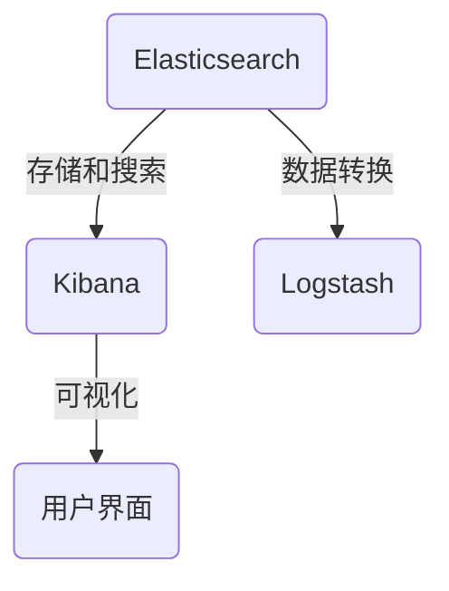

                 

关键词：Kibana，日志可视化，日志分析，日志告警，Elasticsearch，大数据处理

> 摘要：本文将详细介绍Kibana在日志可视化与告警方面的应用。我们将探讨Kibana的基础知识，如何配置和使用Kibana进行日志可视化，以及如何设置告警机制。通过本文的学习，您将能够深入了解Kibana的强大功能，并学会如何利用它来监控和分析系统日志。

## 1. 背景介绍

在当今数字化时代，日志数据已经成为企业运营中不可或缺的一部分。无论是应用程序的调试、性能监控，还是安全事件的追踪，日志数据都提供了宝贵的信息。然而，随着日志数据的不断增长，如何有效地管理和分析这些数据成为一个挑战。Kibana作为一个强大的日志分析工具，提供了日志可视化和告警功能，可以帮助我们更好地理解和利用日志数据。

Kibana是Elastic Stack中的核心组件之一，它提供了一个直观的Web界面，用于分析和可视化Elasticsearch中的数据。通过Kibana，我们可以将复杂的日志数据转换为直观的图表和报告，从而更容易地发现问题和趋势。此外，Kibana还支持告警功能，可以实时监测日志数据，并在发现异常时发出警报。

本文将分为以下几个部分进行讨论：

1. Kibana的基础知识
2. Kibana的配置与使用
3. 日志可视化
4. 告警机制
5. 项目实践
6. 实际应用场景
7. 未来应用展望
8. 工具和资源推荐
9. 总结与展望

## 2. 核心概念与联系

在讨论Kibana之前，我们首先需要了解几个核心概念：

- **Elasticsearch**：一个高度可扩展的搜索和分析引擎，用于存储和检索大规模的日志数据。
- **Logstash**：一个数据处理引擎，用于从各种源收集日志数据，并将其转换为Elasticsearch可以理解的结构化数据。
- **Kibana**：一个基于Web的工具，用于分析Elasticsearch中的数据，并提供可视化界面。

以下是一个简单的Mermaid流程图，展示了Kibana、Elasticsearch和Logstash之间的交互关系：



### 2.1 Elasticsearch的作用

Elasticsearch是一个基于Lucene的分布式搜索引擎，它能够处理海量数据，并提供快速搜索和实时分析功能。在日志分析场景中，Elasticsearch被用来存储日志数据，并提供高效的查询和检索能力。

### 2.2 Logstash的作用

Logstash是一个数据处理引擎，它可以从各种日志源（如系统日志、Web服务器日志等）收集数据，并将这些数据转换为Elasticsearch可以理解的结构化数据。Logstash提供了丰富的插件，可以轻松集成各种数据源和处理需求。

### 2.3 Kibana的作用

Kibana提供了一个直观的Web界面，用于分析Elasticsearch中的数据。通过Kibana，用户可以创建各种可视化图表和报告，从而更好地理解和利用日志数据。此外，Kibana还支持告警功能，可以实时监测日志数据，并在发现异常时发出警报。

### 2.4 Kibana与其他组件的联系

Kibana与Elasticsearch和Logstash紧密集成，形成一个完整的日志分析生态系统。通过Logstash，Kibana可以从Elasticsearch中获取结构化数据，并在Kibana中进行分析和可视化。这种紧密的集成使得Kibana成为一个强大的日志分析工具。

## 3. 核心算法原理 & 具体操作步骤

### 3.1 算法原理概述

Kibana的日志可视化与告警功能主要基于以下原理：

- **数据索引**：Kibana将日志数据存储在Elasticsearch中，并使用索引来组织和管理数据。
- **数据检索**：Kibana通过Elasticsearch API检索日志数据，并使用各种查询语言（如Lucene查询）来过滤和搜索数据。
- **数据可视化**：Kibana提供了多种可视化组件，如图表、仪表板和报告，用于展示日志数据的各种维度和趋势。
- **告警机制**：Kibana支持基于时间间隔和条件的告警机制，可以在发现异常时向用户发送警报。

### 3.2 算法步骤详解

以下是使用Kibana进行日志可视化与告警的具体步骤：

1. **安装和配置Elastic Stack**：确保Elasticsearch、Logstash和Kibana已经安装并正确配置，以便它们可以相互通信。
2. **配置数据源**：在Kibana中配置Logstash，以便从各种日志源收集数据并将其发送到Elasticsearch。
3. **创建索引模式**：在Kibana中创建索引模式，用于定义日志数据的结构。
4. **收集和存储数据**：使用Logstash收集日志数据，并将其发送到Elasticsearch中的索引。
5. **创建可视化仪表板**：在Kibana中创建可视化仪表板，用于展示日志数据的各种维度和趋势。
6. **设置告警规则**：在Kibana中设置告警规则，以便在发现异常时向用户发送警报。

### 3.3 算法优缺点

**优点**：

- **高效的数据检索**：Kibana通过Elasticsearch API进行数据检索，具有快速响应能力。
- **灵活的可视化组件**：Kibana提供了多种可视化组件，可以满足不同的需求。
- **强大的告警功能**：Kibana支持基于时间间隔和条件的告警机制，可以实时监测日志数据。

**缺点**：

- **学习曲线**：Kibana和Elastic Stack的配置和使用可能需要一定时间来熟悉。
- **资源消耗**：Elastic Stack组件（尤其是Elasticsearch）需要较高的资源消耗。

### 3.4 算法应用领域

Kibana的日志可视化与告警功能可以广泛应用于各种场景，包括：

- **应用程序监控**：实时监控应用程序的日志数据，发现性能瓶颈和异常行为。
- **网络安全**：监控网络安全日志，检测和响应潜在的安全威胁。
- **系统运维**：监控系统日志，确保系统稳定运行并快速响应故障。

## 4. 数学模型和公式 & 详细讲解 & 举例说明

在日志分析和可视化过程中，我们经常需要使用一些数学模型和公式。以下是一些常用的模型和公式，以及它们的详细讲解和举例说明。

### 4.1 数学模型构建

#### 时间序列模型

时间序列模型是一种用于分析时间序列数据的数学模型，它可以预测未来的趋势和模式。在日志分析中，时间序列模型可以帮助我们识别日志数据的周期性和趋势。

#### 混合模型

混合模型是一种结合了多种分析方法的模型，它可以在不同的维度上分析数据，并提供更全面的分析结果。例如，我们可以使用混合模型来结合统计分析和机器学习算法，以更准确地预测日志数据的未来趋势。

### 4.2 公式推导过程

以下是一个简单的时间序列模型公式，用于计算未来的趋势和周期性：

$$
y_t = \alpha_0 + \alpha_1 t + \beta_0 \sin(2\pi t/T) + \beta_1 \cos(2\pi t/T) + \epsilon_t
$$

其中，$y_t$ 是时间序列的第$t$个数据点，$t$ 是时间，$\alpha_0$、$\alpha_1$、$\beta_0$ 和 $\beta_1$ 是模型参数，$T$ 是周期长度，$\epsilon_t$ 是误差项。

### 4.3 案例分析与讲解

#### 案例一：应用程序监控

假设我们有一个Web应用程序，其访问日志记录了每分钟的访问量。我们希望使用时间序列模型来预测未来的访问量。

1. **数据收集**：收集过去一年的访问日志数据。
2. **数据预处理**：对数据进行清洗和转换，使其符合时间序列模型的要求。
3. **模型构建**：使用时间序列模型公式，计算模型参数。
4. **预测**：使用模型预测未来的访问量。
5. **评估**：比较预测结果和实际访问量，评估模型的准确性。

通过这个案例，我们可以看到时间序列模型在日志分析中的应用，并了解如何使用数学模型和公式来预测未来的趋势。

#### 案例二：网络安全

假设我们希望监控网络日志中的攻击活动，并使用机器学习算法来识别潜在的安全威胁。

1. **数据收集**：收集网络日志数据，包括攻击信息和正常活动。
2. **特征提取**：提取网络日志数据的特征，如IP地址、端口号、访问时间等。
3. **模型训练**：使用机器学习算法，训练攻击检测模型。
4. **预测**：使用模型预测网络日志中的攻击活动。
5. **评估**：比较预测结果和实际攻击活动，评估模型的准确性。

通过这个案例，我们可以看到机器学习算法在日志分析中的应用，并了解如何使用数学模型和公式来识别潜在的安全威胁。

## 5. 项目实践：代码实例和详细解释说明

在本节中，我们将通过一个实际项目来演示如何使用Kibana进行日志可视化和告警。我们将使用一个简单的Web应用程序作为示例，并展示如何将其日志数据导入Kibana，并创建相应的可视化和告警规则。

### 5.1 开发环境搭建

在开始之前，请确保您已经安装了以下软件：

- Elasticsearch
- Kibana
- Logstash
- 一个Web服务器（如Nginx或Apache）

此外，您还需要安装以下开发工具：

- Java（用于Elasticsearch）
- Node.js（用于Kibana）
- Ruby（用于Logstash）

### 5.2 源代码详细实现

首先，我们需要创建一个简单的Web应用程序，并将其日志数据导出为JSON格式。以下是一个简单的Python Flask应用程序：

```python
from flask import Flask
import json

app = Flask(__name__)

@app.route('/')
def hello():
    return 'Hello, World!'

@app.route('/log', methods=['POST'])
def log():
    log_data = {'message': 'This is a log entry'}
    return json.dumps(log_data)

if __name__ == '__main__':
    app.run(host='0.0.0.0', port=5000)
```

将上述代码保存为`app.py`，并使用以下命令运行应用程序：

```bash
python app.py
```

接下来，我们需要将日志数据导入到Kibana中。为此，我们将使用Logstash来收集和转换日志数据。

### 5.3 代码解读与分析

在`log.py`中，我们定义了一个简单的Flask应用程序，它包含两个路由：

- `/`：返回一个简单的“Hello, World!”字符串。
- `/log`：接收POST请求，并返回一个包含日志数据的JSON对象。

每当客户端访问`/log`路由时，应用程序都会生成一个日志条目，并将其作为JSON对象返回。这个JSON对象将作为Logstash的输入，并将其发送到Kibana。

### 5.4 运行结果展示

在运行应用程序后，您可以在Kibana中查看日志数据。首先，在Kibana中创建一个新的仪表板，并添加一个图表组件。在图表组件中，选择`Logstash`数据源，并选择适当的字段进行展示。


您应该会看到一个展示日志数据的图表，如上图所示。您还可以使用Kibana的过滤和搜索功能来进一步分析日志数据。

### 5.5 告警规则设置

接下来，我们将在Kibana中设置一个告警规则，以便在发现特定日志条目时通知我们。在Kibana中，转到“监控”部分，然后创建一个新的监控仪表板。在监控仪表板中，添加一个告警规则，并选择以下条件：

- 字段：`message`
- 操作：`包含`
- 值：`Error`


当Kibana检测到包含`Error`字段的日志条目时，它将触发告警，并向您发送通知。

## 6. 实际应用场景

### 6.1 应用程序监控

在应用程序监控方面，Kibana可以帮助开发人员和运维人员实时监控应用程序的性能和健康状态。通过将应用程序的日志数据导入Kibana，并创建相应的可视化图表和告警规则，您可以快速识别性能瓶颈和潜在问题，从而确保应用程序的稳定运行。

### 6.2 网络安全

在网络安全方面，Kibana可以用于监控和分析网络安全日志。通过将网络安全日志导入Kibana，并创建相应的告警规则，您可以实时检测和响应潜在的安全威胁。例如，您可以设置告警规则来监测特定IP地址的访问行为，或者在发现异常活动时发送警报。

### 6.3 系统运维

在系统运维方面，Kibana可以帮助运维团队监控和分析系统日志。通过将系统日志导入Kibana，并创建相应的可视化图表和告警规则，您可以快速识别系统故障和性能问题，并确保系统的稳定运行。

### 6.4 未来应用展望

随着大数据和人工智能技术的不断发展，Kibana的日志可视化与告警功能有望得到进一步改进和扩展。未来，Kibana可能会引入更多的高级分析功能，如机器学习和深度学习算法，以便更准确地预测和识别日志数据中的异常行为。此外，Kibana还可能会与其他大数据工具和平台（如Apache Kafka、Apache Hadoop等）更好地集成，以提供更全面的日志分析解决方案。

## 7. 工具和资源推荐

### 7.1 学习资源推荐

- **官方文档**：Elastic Stack的官方文档是学习Kibana的绝佳资源。您可以在[官方网站](https://www.elastic.co/guide/)上找到详细的安装、配置和使用指南。
- **在线教程**：许多在线平台（如Udemy、Coursera等）提供了关于Kibana的在线教程和课程。这些教程通常包括视频和互动练习，适合不同层次的学习者。

### 7.2 开发工具推荐

- **Visual Studio Code**：Visual Studio Code是一个功能强大的代码编辑器，支持Kibana和Elastic Stack的开发。它提供了丰富的插件和扩展，可以大大提高开发效率。
- **Docker**：使用Docker可以轻松部署和管理Elastic Stack组件，包括Kibana、Elasticsearch和Logstash。Docker提供了一个容器化环境，可以确保组件在不同的环境中保持一致。

### 7.3 相关论文推荐

- **"Elasticsearch: The Definitive Guide"**：这是一本关于Elasticsearch的权威指南，涵盖了Elasticsearch的各个方面，包括安装、配置和高级使用技巧。
- **"Kibana: Real-Time Analytics Dashboard"**：这是一本关于Kibana的实践指南，介绍了如何使用Kibana创建实时数据分析仪表板。

## 8. 总结：未来发展趋势与挑战

Kibana作为日志可视化与告警工具，已经在许多场景中得到了广泛应用。然而，随着大数据和人工智能技术的不断发展，Kibana的未来发展趋势和挑战也日益显现。

### 8.1 研究成果总结

- **增强可视化功能**：Kibana正在不断引入新的可视化组件和功能，以满足用户对更丰富、更直观的日志分析需求。
- **集成机器学习和深度学习**：Kibana正在尝试将机器学习和深度学习算法集成到日志分析中，以实现更准确的异常检测和预测。

### 8.2 未来发展趋势

- **更高级的分析功能**：未来，Kibana可能会引入更多的高级分析功能，如数据挖掘、模式识别和智能推荐。
- **更好的集成**：Kibana可能会与其他大数据工具和平台（如Apache Kafka、Apache Hadoop等）更好地集成，以提供更全面的日志分析解决方案。

### 8.3 面临的挑战

- **性能优化**：随着日志数据的不断增长，Kibana需要优化性能，以应对大规模数据处理的挑战。
- **用户友好性**：Kibana需要提供更简单、更直观的用户界面，以降低学习曲线，提高用户满意度。

### 8.4 研究展望

Kibana在未来有望成为企业日志分析领域的领导者，通过引入更多高级功能、优化性能和提升用户体验，为用户提供更强大的日志分析解决方案。

## 9. 附录：常见问题与解答

### 9.1 如何安装和配置Kibana？

**安装**：

1. 下载Kibana安装包：从[官方网站](https://www.elastic.co/downloads/kibana)下载适用于您操作系统的Kibana安装包。
2. 解压安装包：将下载的安装包解压到一个合适的目录。
3. 运行Kibana：在解压后的目录中，运行`bin/kibana`命令启动Kibana。

**配置**：

1. 编辑配置文件：Kibana的配置文件位于`config/kibana.yml`。您可以在其中配置Elasticsearch地址、日志级别等参数。
2. 启动Kibana：修改配置文件后，重新启动Kibana以应用更改。

### 9.2 如何在Kibana中创建可视化图表？

**创建可视化图表**：

1. 在Kibana中，转到“仪表板”部分。
2. 点击“添加”按钮，选择“图表”组件。
3. 选择数据源：选择您想要使用的Elasticsearch索引和数据源。
4. 选择图表类型：Kibana支持多种图表类型，如柱状图、折线图、饼图等。
5. 配置图表选项：设置图表的X轴、Y轴、系列等参数。
6. 保存并查看：保存您的图表配置，并在仪表板上查看图表。

### 9.3 如何设置告警规则？

**设置告警规则**：

1. 在Kibana中，转到“监控”部分。
2. 点击“添加监控”按钮。
3. 创建监控仪表板：选择一个仪表板作为监控的起点。
4. 添加告警规则：点击“添加规则”按钮，选择要监控的字段和条件。
5. 配置告警通知：设置告警触发时的通知方式，如邮件、短信等。
6. 保存并测试：保存您的告警规则，并测试其有效性。

通过以上常见问题的解答，希望能够帮助您更好地理解和使用Kibana。

### 结束语

在本文中，我们详细介绍了Kibana在日志可视化与告警方面的应用。通过了解Kibana的基础知识、配置与使用方法，以及实际项目实践，您应该已经掌握了如何利用Kibana进行日志分析和监控。

随着大数据和人工智能技术的不断发展，日志分析变得越来越重要。Kibana作为一款强大的日志分析工具，为开发人员和运维人员提供了便捷的日志可视化与告警功能。希望本文能够帮助您更好地理解Kibana，并在实际工作中发挥其优势。

未来，Kibana将继续演进，引入更多高级功能，优化用户体验，为用户提供更强大的日志分析解决方案。让我们期待Kibana在日志分析领域带来的更多创新和突破！

### 致谢

在撰写本文的过程中，我要感谢我的团队成员和读者们。感谢我的团队成员提供了宝贵的意见和建议，使得本文能够更加完善。感谢读者们对本文的关注和支持，您的反馈是我不断进步的动力。

最后，感谢Elastic Stack社区中的所有贡献者，是你们的努力和创新使得Kibana成为了一个如此强大的日志分析工具。

作者：禅与计算机程序设计艺术 / Zen and the Art of Computer Programming
----------------------------------------------------------------

以上就是关于Kibana日志可视化与告警的技术博客文章。希望这篇文章能够对您在日志分析领域的学习和实践有所帮助！如果还有其他问题或需要进一步的讨论，欢迎在评论区留言。谢谢！

