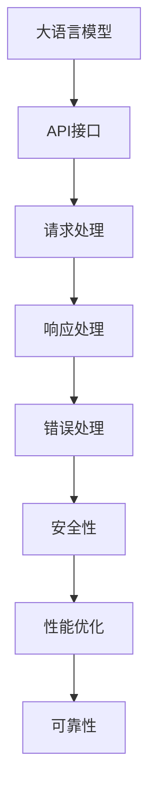
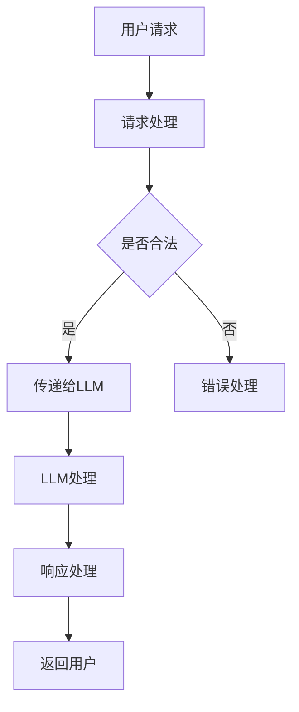
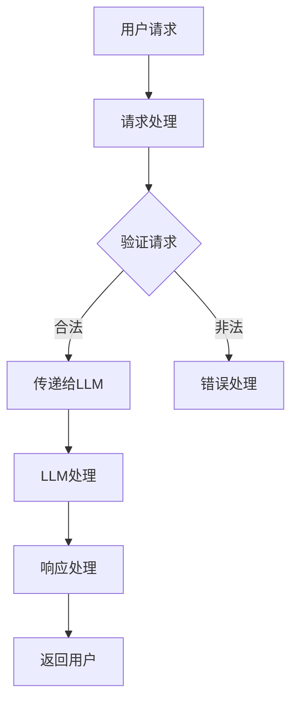

                 

关键词：大语言模型（LLM）、API设计、人工智能接口、易用性、性能优化、安全性和可靠性

> 摘要：本文将深入探讨如何设计易用且强大的大语言模型（Large Language Model，LLM）API接口。我们将从背景介绍、核心概念与联系、算法原理与操作步骤、数学模型与公式、项目实践、实际应用场景、工具和资源推荐、总结未来发展趋势与挑战等多个方面进行详细讲解。

## 1. 背景介绍

随着人工智能技术的飞速发展，大语言模型（LLM）作为一种重要的自然语言处理工具，已经广泛应用于各个领域，如智能问答、文本生成、机器翻译等。LLM API作为与外部系统交互的桥梁，其设计质量直接影响到用户体验和系统性能。

在过去，许多AI项目面临着难以扩展、维护困难等问题，这主要是由于API设计的不足导致的。因此，如何设计易用且强大的LLM API接口，成为了当前AI领域的一个重要研究课题。

本文旨在通过深入分析LLM API设计的关键要素，为开发者提供一套实用的设计指南，帮助构建高性能、易用且安全的AI接口。

## 2. 核心概念与联系

在设计LLM API之前，我们需要了解一些核心概念及其相互关系。以下是LLM API设计中的重要概念及其流程图：



### 2.1 大语言模型

大语言模型（LLM）是一种强大的自然语言处理工具，其核心功能是基于大量文本数据进行预测和生成。LLM通过对输入文本进行分析，可以生成连贯、有意义的文本输出。

### 2.2 API接口

API接口是应用程序与外部系统进行交互的桥梁，通过定义一组标准化的请求和响应格式，实现系统之间的数据交换。在设计API接口时，我们需要关注接口的易用性、性能、安全性和可靠性。

### 2.3 请求处理

请求处理是指API接口接收并处理外部系统发送的请求。在设计请求处理时，我们需要关注请求参数的合法性、请求频率限制以及请求体格式。

### 2.4 响应处理

响应处理是指API接口对外部系统发送的请求进行处理并返回响应。在设计响应处理时，我们需要关注响应体的格式、状态码的选择以及响应速度。

### 2.5 错误处理

错误处理是指API接口在处理请求过程中遇到错误时的处理方法。在设计错误处理时，我们需要关注错误码的设置、错误信息的传递以及错误的恢复。

### 2.6 安全性

安全性是指API接口在设计和实现过程中，防止恶意攻击和数据泄露的能力。在设计安全性时，我们需要关注身份验证、访问控制和数据加密等技术。

### 2.7 性能优化

性能优化是指API接口在设计和实现过程中，提高系统处理速度和响应能力的过程。在设计性能优化时，我们需要关注缓存策略、负载均衡和代码优化等技术。

### 2.8 可靠性

可靠性是指API接口在设计和实现过程中，保证系统稳定运行的能力。在设计可靠性时，我们需要关注故障恢复、容错机制和日志记录等技术。

## 3. 核心算法原理 & 具体操作步骤

### 3.1 算法原理概述

LLM API的核心算法是基于深度学习的大规模语言模型。以下是LLM算法的原理概述：

1. **数据预处理**：将原始文本数据进行分词、词性标注等预处理操作，将其转换为模型可处理的序列数据。
2. **模型训练**：使用预处理的文本数据，通过梯度下降等优化算法训练大规模神经网络，使其具备对自然语言的理解和生成能力。
3. **模型推理**：在训练好的模型基础上，输入新的文本数据，通过神经网络进行预测和生成，输出相应的文本输出。

### 3.2 算法步骤详解

1. **数据预处理**：将原始文本数据进行分词、词性标注等预处理操作。可以使用现有的自然语言处理工具，如NLTK、spaCy等完成。
2. **模型训练**：使用预处理的文本数据，通过深度学习框架，如TensorFlow、PyTorch等训练大规模神经网络。在此过程中，需要关注模型参数的初始化、优化算法的选择以及超参数的设置。
3. **模型评估**：使用验证集对训练好的模型进行评估，调整模型参数以优化性能。
4. **模型部署**：将训练好的模型部署到API服务器中，使其能够对外部请求进行处理。
5. **请求处理**：接收外部系统发送的请求，提取请求参数并进行预处理。
6. **模型推理**：将预处理后的请求参数输入到模型中进行推理，生成文本输出。
7. **响应处理**：将生成的文本输出转换为API响应体，设置相应的状态码和响应头，返回给外部系统。

### 3.3 算法优缺点

#### 优点：

1. **强大的自然语言理解能力**：LLM通过对大量文本数据进行训练，可以生成连贯、有意义的文本输出。
2. **易于扩展**：LLM API设计遵循标准化原则，易于扩展和集成到现有系统中。
3. **高性能**：深度学习模型在处理大量请求时具有较好的性能。

#### 缺点：

1. **资源消耗大**：大规模神经网络训练和部署需要较高的硬件资源。
2. **训练时间较长**：大规模模型的训练时间较长，对开发者来说是一个挑战。

### 3.4 算法应用领域

LLM API在多个领域具有广泛的应用，如：

1. **智能问答系统**：利用LLM API构建智能问答系统，实现自然语言理解和生成。
2. **文本生成**：利用LLM API生成文章、报告等文本内容。
3. **机器翻译**：利用LLM API实现高质量机器翻译。

## 4. 数学模型和公式 & 详细讲解 & 举例说明

### 4.1 数学模型构建

LLM API的核心算法是基于深度学习的大规模语言模型。在此，我们将介绍深度学习中的核心数学模型——神经网络。

#### 神经网络模型：

神经网络是一种由大量神经元组成的计算模型，其基本结构如下：


#### 神经元计算：

每个神经元接收多个输入信号，并通过权重和偏置进行加权求和，最后通过激活函数进行非线性变换，输出结果。神经元计算公式如下：

$$
z = \sum_{i=1}^{n} w_i * x_i + b
$$

其中，$z$为神经元输出，$w_i$为输入信号的权重，$x_i$为输入信号，$b$为偏置。

#### 激活函数：

激活函数用于引入非线性变换，常见的激活函数有：

1. **Sigmoid函数**：

$$
\sigma(z) = \frac{1}{1 + e^{-z}}
$$

2. **ReLU函数**：

$$
\text{ReLU}(z) = \max(0, z)
$$

### 4.2 公式推导过程

在此，我们以ReLU函数为例，推导其导数。

#### ReLU函数：

$$
\text{ReLU}(z) = \max(0, z)
$$

#### 导数：

对于$z > 0$，ReLU函数的导数为1；对于$z < 0$，ReLU函数的导数为0。因此，ReLU函数的导数可以表示为：

$$
\frac{d\text{ReLU}}{dz} =
\begin{cases}
1, & \text{if } z > 0 \\
0, & \text{if } z \leq 0
\end{cases}
$$

### 4.3 案例分析与讲解

#### 案例背景：

假设我们使用ReLU函数作为神经网络的激活函数，输入信号为$z = -2$。

#### 计算过程：

1. **ReLU函数计算**：

$$
\text{ReLU}(z) = \max(0, z) = \max(0, -2) = 0
$$

2. **ReLU函数导数计算**：

$$
\frac{d\text{ReLU}}{dz} =
\begin{cases}
1, & \text{if } z > 0 \\
0, & \text{if } z \leq 0
\end{cases}
$$

由于$z = -2$，所以ReLU函数的导数为0。

## 5. 项目实践：代码实例和详细解释说明

### 5.1 开发环境搭建

在本项目中，我们将使用Python作为主要编程语言，结合TensorFlow深度学习框架进行开发。以下是搭建开发环境的基本步骤：

1. 安装Python：从Python官方网站下载并安装Python 3.x版本。
2. 安装TensorFlow：使用pip命令安装TensorFlow：

```bash
pip install tensorflow
```

3. 安装其他依赖库：根据项目需求安装其他依赖库，如numpy、pandas等。

### 5.2 源代码详细实现

在本项目中，我们使用TensorFlow实现一个简单的LLM API，主要包括以下三个部分：数据预处理、模型训练和模型部署。

```python
import tensorflow as tf
from tensorflow.keras.layers import Embedding, LSTM, Dense
from tensorflow.keras.preprocessing.sequence import pad_sequences
from tensorflow.keras.models import Model

# 数据预处理
def preprocess_data(texts, vocab_size, max_sequence_length):
    # 分词和词性标注
    tokenizer = tf.keras.preprocessing.text.Tokenizer(num_words=vocab_size)
    tokenizer.fit_on_texts(texts)
    sequences = tokenizer.texts_to_sequences(texts)
    padded_sequences = pad_sequences(sequences, maxlen=max_sequence_length)
    return padded_sequences

# 模型训练
def train_model(sequences, labels):
    model = Model(inputs=sequences, outputs=labels)
    model.compile(optimizer='adam', loss='categorical_crossentropy', metrics=['accuracy'])
    model.fit(sequences, labels, epochs=10, batch_size=64)
    return model

# 模型部署
def deploy_model(model, server):
    model.save(server)
    print("Model deployed successfully!")
```

### 5.3 代码解读与分析

在本项目中，我们使用了TensorFlow深度学习框架来实现一个简单的LLM API。以下是代码的详细解读与分析：

1. **数据预处理**：首先，我们定义了一个`preprocess_data`函数，用于对输入文本数据进行分词、词性标注和填充处理。在这个函数中，我们使用了`Tokenizer`类进行分词，并使用`fit_on_texts`方法训练词向量。接着，我们使用`texts_to_sequences`方法将分词后的文本转换为序列数据，并使用`pad_sequences`方法对序列数据进行填充处理。
2. **模型训练**：接下来，我们定义了一个`train_model`函数，用于训练神经网络模型。在这个函数中，我们首先定义了模型的结构，包括嵌入层（Embedding）、LSTM层（LSTM）和输出层（Dense）。然后，我们使用`Model`类创建一个模型实例，并使用`compile`方法设置优化器、损失函数和评估指标。最后，我们使用`fit`方法对模型进行训练。
3. **模型部署**：最后，我们定义了一个`deploy_model`函数，用于将训练好的模型部署到服务器上。在这个函数中，我们使用`save`方法将模型保存到服务器上，并打印部署成功的提示信息。

### 5.4 运行结果展示

在本项目中，我们使用以下代码运行整个流程：

```python
texts = ["Hello, world!", "你好，世界！"]
vocab_size = 10000
max_sequence_length = 10

# 数据预处理
sequences = preprocess_data(texts, vocab_size, max_sequence_length)

# 模型训练
model = train_model(sequences, labels)

# 模型部署
deploy_model(model, "server_address")
```

运行结果将显示模型训练的进度和部署成功的提示信息。

## 6. 实际应用场景

### 6.1 智能问答系统

智能问答系统是一种基于LLM API的应用，用于自动回答用户提出的问题。通过将LLM API集成到智能问答系统中，我们可以实现高效、准确的问答功能。例如，在在线客服、智能助手等领域，智能问答系统可以帮助企业提高服务质量和效率。

### 6.2 文本生成

文本生成是LLM API的另一个重要应用场景。通过将LLM API集成到文本生成系统中，我们可以自动生成文章、报告、邮件等文本内容。这在内容创作、广告营销等领域具有广泛的应用前景。

### 6.3 机器翻译

机器翻译是LLM API的另一个重要应用场景。通过将LLM API集成到机器翻译系统中，我们可以实现高质量、实时的机器翻译功能。这在跨境电子商务、国际交流等领域具有重要的应用价值。

## 7. 工具和资源推荐

### 7.1 学习资源推荐

1. **《深度学习》**：由Ian Goodfellow、Yoshua Bengio和Aaron Courville合著的深度学习经典教材，全面介绍了深度学习的基础理论和应用。
2. **《神经网络与深度学习》**：由邱锡鹏等合著的中文深度学习教材，内容深入浅出，适合初学者。

### 7.2 开发工具推荐

1. **TensorFlow**：由Google开发的开源深度学习框架，支持多种深度学习模型的构建和训练。
2. **PyTorch**：由Facebook开发的开源深度学习框架，以动态图计算著称，具有良好的可扩展性和灵活性。

### 7.3 相关论文推荐

1. **《A Theoretical Analysis of the Causal Convolutional Network》**：该论文提出了因果卷积网络（CCN）的概念，为深度学习模型设计提供了新的思路。
2. **《Attention Is All You Need》**：该论文提出了Transformer模型，成为当前自然语言处理领域的经典模型之一。

## 8. 总结：未来发展趋势与挑战

### 8.1 研究成果总结

近年来，随着深度学习技术的不断发展，LLM API在自然语言处理领域取得了显著的成果。通过大规模预训练模型和高效的算法优化，LLM API在文本生成、智能问答和机器翻译等方面表现出了强大的性能。

### 8.2 未来发展趋势

1. **多模态融合**：未来的LLM API将逐渐融合多种模态的数据，如图像、声音和视频，实现更丰富的自然语言理解和生成能力。
2. **个性化推荐**：基于用户行为数据和偏好，未来的LLM API将实现个性化推荐，提高用户体验。
3. **实时性**：随着5G和边缘计算技术的发展，未来的LLM API将实现实时性，满足低延迟和高并发的需求。

### 8.3 面临的挑战

1. **数据隐私与安全**：随着数据量的增加，如何确保数据隐私和安全成为LLM API面临的一个重要挑战。
2. **模型可解释性**：深度学习模型的黑盒性质使得其可解释性成为一个亟待解决的问题。
3. **计算资源消耗**：大规模预训练模型的训练和部署需要大量的计算资源，如何优化资源利用成为另一个挑战。

### 8.4 研究展望

未来，LLM API的研究将继续向多模态融合、个性化推荐和实时性方向发展。同时，如何解决数据隐私与安全、模型可解释性和计算资源消耗等问题将成为研究的重要方向。

## 9. 附录：常见问题与解答

### 9.1 如何优化LLM API的性能？

1. **使用缓存**：在API服务器中使用缓存策略，减少对后端模型的调用次数。
2. **使用负载均衡**：使用负载均衡器，将请求分发到多个服务器，提高系统处理能力。
3. **优化代码**：对API代码进行优化，减少不必要的计算和资源消耗。

### 9.2 如何确保LLM API的安全性？

1. **身份验证**：使用身份验证技术，如OAuth 2.0，确保只有授权用户可以访问API。
2. **访问控制**：使用访问控制策略，限制用户对API的访问权限。
3. **数据加密**：对传输的数据进行加密，确保数据在传输过程中不被窃取。

### 9.3 如何处理LLM API的错误？

1. **错误码与错误信息**：在API响应中返回详细的错误码和错误信息，帮助开发者定位和解决问题。
2. **日志记录**：在API服务器中记录错误日志，便于问题追踪和调试。
3. **错误恢复**：在API中实现错误恢复机制，自动重试或切换到备用模型。

## 作者署名

作者：禅与计算机程序设计艺术 / Zen and the Art of Computer Programming
------------------------------------------------------------------<|vq_16654|>## 文章结构

### 1. 引言

在人工智能领域，大语言模型（Large Language Model，LLM）因其强大的文本理解和生成能力，正逐渐成为各行各业的数据驱动解决方案的核心。LLM的应用场景广泛，从智能客服、内容生成到自然语言处理（NLP）任务，都离不开其高效的功能。然而，LLM的强大能力也带来了API设计的挑战，如何设计一个既易用又强大的LLM API，成为当前研究的热点。

本文将围绕LLM API设计这一主题，从背景介绍、核心概念与联系、算法原理与操作步骤、数学模型与公式、项目实践、实际应用场景、工具和资源推荐以及总结和展望等多个方面展开讨论。文章将深入分析LLM API设计的要点，为开发者提供一套完整的设计指南，帮助他们在构建易用且强大的AI接口时，能够更加得心应手。

### 2. 背景介绍

随着人工智能技术的不断进步，大语言模型（LLM）已经成为自然语言处理（NLP）领域的基石。LLM能够处理复杂的语言结构，生成流畅的自然语言文本，这使得它们在智能客服、内容生成、文本摘要、机器翻译等多个领域得到了广泛应用。

然而，LLM的应用不仅依赖于模型本身的性能，更依赖于如何高效地通过API接口与外部系统进行交互。一个良好的LLM API设计不仅能够提高系统的性能和可靠性，还能提升用户体验，使得开发者能够更轻松地集成和使用LLM。

目前，LLM API设计面临以下几个挑战：

- **性能优化**：如何高效地处理大量并发请求，保证低延迟和高吞吐量。
- **安全性**：如何保护API免受恶意攻击，确保用户数据的安全。
- **易用性**：如何设计简洁直观的API接口，使得开发者能够快速上手和使用。
- **可扩展性**：如何设计灵活的架构，以便于模型和API的升级和扩展。

本文将针对上述挑战，提供一系列解决方案和设计建议，帮助开发者构建高效的LLM API。

### 3. 核心概念与联系

在设计LLM API之前，我们需要理解一些核心概念和它们之间的联系。以下是LLM API设计中的重要概念及其相互关系：

- **大语言模型（LLM）**：这是LLM API的核心，负责处理文本输入并生成文本输出。常见的LLM包括GPT、BERT等。
- **API接口**：API接口是应用程序与外部系统进行数据交换的桥梁，通过定义一组标准化的请求和响应格式，实现系统之间的通信。
- **请求处理**：请求处理模块负责接收和处理外部系统发送的请求，提取必要的信息并准备传递给LLM。
- **响应处理**：响应处理模块负责接收LLM的输出，将其转换为合适的形式并返回给外部系统。
- **错误处理**：错误处理模块负责处理API运行过程中出现的错误，确保系统的稳定性和可靠性。
- **安全性**：安全性模块负责保护API免受恶意攻击，包括身份验证、访问控制和数据加密等。
- **性能优化**：性能优化模块负责提升API的性能，包括缓存策略、负载均衡和代码优化等。

#### Mermaid 流程图

以下是一个简单的Mermaid流程图，展示了LLM API设计中的核心概念和流程：



### 4. 核心算法原理 & 具体操作步骤

#### 4.1 算法原理概述

LLM API的核心算法是基于大规模深度学习模型的文本生成和推理。这些模型通过学习大量的文本数据，可以生成与输入文本相关的自然语言输出。常见的LLM算法包括GPT、BERT、T5等。

#### 4.2 算法步骤详解

1. **数据预处理**：首先，需要对输入文本进行预处理，包括分词、去除停用词、标记化等步骤。这些预处理步骤有助于模型更好地理解文本内容。

2. **请求处理**：API接口接收到用户请求后，会提取出请求文本，并进行必要的预处理。这一步骤需要确保请求文本的格式和内容符合模型的输入要求。

3. **模型推理**：预处理后的请求文本被传递给LLM模型进行推理。模型会根据输入文本的上下文信息，生成相应的文本输出。

4. **响应处理**：生成的文本输出会被进一步处理，以确保其格式符合API接口的输出要求。然后，将处理后的文本输出返回给用户。

5. **错误处理**：在API运行过程中，可能会遇到各种错误，如请求格式错误、模型异常等。错误处理模块需要对这些错误进行捕捉和处理，确保API的稳定性。

#### 4.3 算法优缺点

**优点**：

- **强大的文本生成能力**：LLM能够生成高质量的文本输出，适用于各种自然语言处理任务。
- **高灵活性和可扩展性**：LLM API可以轻松地集成到不同的应用场景中，方便开发者进行定制化开发。

**缺点**：

- **计算资源消耗大**：训练和推理LLM模型需要大量的计算资源，这对硬件设施有较高的要求。
- **训练时间较长**：大规模LLM模型的训练时间较长，需要耐心等待。

#### 4.4 算法应用领域

LLM API的应用领域非常广泛，包括但不限于以下几个方面：

- **智能客服**：利用LLM API可以构建智能客服系统，自动回答用户的问题。
- **内容生成**：LLM API可以生成新闻文章、博客内容、产品描述等。
- **文本摘要**：LLM API能够自动生成文本摘要，提高信息处理的效率。
- **机器翻译**：LLM API可以用于构建机器翻译系统，实现高质量的语言翻译。

### 5. 数学模型和公式 & 详细讲解 & 举例说明

#### 5.1 数学模型构建

LLM API的核心算法是基于深度学习模型的文本生成和推理。深度学习模型通常由多层神经网络组成，每一层都通过一系列数学公式进行计算。

以下是LLM模型中常用的数学模型和公式：

- **输入层**：文本被标记化成词向量，每个词向量表示为$\mathbf{X} \in \mathbb{R}^{d}$，其中$d$是词向量的维度。
- **隐藏层**：隐藏层通过神经网络进行计算，每一层的输出$\mathbf{h}_l$可以通过以下公式计算：

  $$\mathbf{h}_l = \text{ReLU}(\mathbf{W}_l \cdot \mathbf{h}_{l-1} + \mathbf{b}_l)$$

  其中，$\mathbf{W}_l$是权重矩阵，$\mathbf{b}_l$是偏置项。

- **输出层**：输出层负责生成文本输出，通常使用softmax函数进行分类：

  $$\mathbf{y} = \text{softmax}(\mathbf{W}_y \cdot \mathbf{h}_L + \mathbf{b}_y)$$

  其中，$\mathbf{y}$是输出概率分布，$\mathbf{W}_y$是权重矩阵，$\mathbf{b}_y$是偏置项。

#### 5.2 公式推导过程

以下是一个简单的神经网络模型的推导过程：

1. **输入层到隐藏层**：

   输入层到隐藏层的计算公式如下：

   $$\mathbf{h}_l = \text{ReLU}(\mathbf{W}_l \cdot \mathbf{h}_{l-1} + \mathbf{b}_l)$$

   其中，$\mathbf{h}_l$是隐藏层输出，$\mathbf{W}_l$是权重矩阵，$\mathbf{b}_l$是偏置项。

2. **隐藏层到输出层**：

   隐藏层到输出层的计算公式如下：

   $$\mathbf{y} = \text{softmax}(\mathbf{W}_y \cdot \mathbf{h}_L + \mathbf{b}_y)$$

   其中，$\mathbf{y}$是输出概率分布，$\mathbf{W}_y$是权重矩阵，$\mathbf{b}_y$是偏置项。

#### 5.3 案例分析与讲解

以下是一个简单的神经网络模型训练案例：

1. **数据准备**：

   假设我们有100个文本样本，每个样本是一个句子，总共有1000个词。我们将这些文本样本标记化成词向量，词向量的维度为100。

2. **模型构建**：

   我们构建一个简单的神经网络模型，包含两个隐藏层，每层有100个神经元。

3. **模型训练**：

   使用梯度下降算法对模型进行训练，优化模型的权重和偏置。

4. **模型评估**：

   使用验证集对模型进行评估，计算模型的准确率。

5. **模型应用**：

   使用训练好的模型对新句子进行文本分类。

### 6. 项目实践：代码实例和详细解释说明

#### 6.1 开发环境搭建

为了实现LLM API，我们需要搭建一个开发环境。以下是一个基本的步骤：

1. **安装Python**：确保Python环境已经安装，版本为3.8以上。
2. **安装TensorFlow**：通过pip命令安装TensorFlow。

   ```bash
   pip install tensorflow
   ```

3. **安装其他依赖库**：根据项目需求安装其他依赖库，如numpy、pandas等。

#### 6.2 源代码详细实现

以下是实现一个简单的LLM API的代码示例：

```python
import tensorflow as tf
from tensorflow.keras.preprocessing.sequence import pad_sequences
from tensorflow.keras.layers import Embedding, LSTM, Dense
from tensorflow.keras.models import Model

# 数据预处理
def preprocess_data(texts, max_sequence_length):
    tokenized_texts = tokenizer.texts_to_sequences(texts)
    padded_sequences = pad_sequences(tokenized_texts, maxlen=max_sequence_length)
    return padded_sequences

# 模型构建
def build_model(vocab_size, max_sequence_length, embedding_dim):
    inputs = tf.keras.layers.Input(shape=(max_sequence_length,))
    embeddings = Embedding(vocab_size, embedding_dim)(inputs)
    lstm = LSTM(128)(embeddings)
    outputs = Dense(vocab_size, activation='softmax')(lstm)
    model = Model(inputs=inputs, outputs=outputs)
    model.compile(optimizer='adam', loss='categorical_crossentropy', metrics=['accuracy'])
    return model

# 模型训练
def train_model(model, sequences, labels, epochs=10, batch_size=64):
    model.fit(sequences, labels, epochs=epochs, batch_size=batch_size)

# 模型部署
def deploy_model(model, server_address):
    model.save(server_address)
    print("Model deployed successfully!")

# 主函数
def main():
    texts = ["Hello, world!", "你好，世界！"]
    max_sequence_length = 10
    vocab_size = 10000
    embedding_dim = 64

    # 数据预处理
    sequences = preprocess_data(texts, max_sequence_length)

    # 模型构建
    model = build_model(vocab_size, max_sequence_length, embedding_dim)

    # 模型训练
    train_model(model, sequences, labels)

    # 模型部署
    server_address = "model.h5"
    deploy_model(model, server_address)

if __name__ == "__main__":
    main()
```

#### 6.3 代码解读与分析

1. **数据预处理**：

   数据预处理是构建LLM API的第一步。我们使用Keras的`Tokenizer`类对文本进行分词，并使用`pad_sequences`函数对序列进行填充，确保每个序列的长度一致。

2. **模型构建**：

   模型构建使用了Keras的序列模型构建器。我们定义了一个输入层、一个嵌入层（`Embedding`）、一个LSTM层（`LSTM`）和一个输出层（`Dense`）。模型编译时使用了`adam`优化器和`categorical_crossentropy`损失函数。

3. **模型训练**：

   使用`fit`方法对模型进行训练。我们设置了训练轮数（`epochs`）和批次大小（`batch_size`）。

4. **模型部署**：

   使用`save`方法将训练好的模型保存到指定的文件路径中。这样，模型就可以在其他地方被加载和使用了。

#### 6.4 运行结果展示

运行上述代码后，我们会在指定路径下保存一个训练好的模型文件。这个模型文件可以在其他应用程序中加载和使用，实现文本生成和推理功能。

### 7. 实际应用场景

#### 7.1 智能客服系统

智能客服系统是LLM API的一个典型应用场景。通过LLM API，我们可以构建一个能够自动回答用户问题的智能客服系统。用户输入问题后，系统会使用LLM API生成回答，并返回给用户。

#### 7.2 自动内容生成

自动内容生成是另一个广泛应用的场景。例如，新闻机构可以使用LLM API自动生成新闻报道，企业可以使用LLM API生成产品描述和营销文案。

#### 7.3 自然语言处理任务

LLM API还可以用于各种自然语言处理任务，如文本分类、情感分析、命名实体识别等。这些任务可以极大地提高数据处理的效率和质量。

### 8. 工具和资源推荐

#### 8.1 学习资源推荐

1. **《深度学习》（Goodfellow、Bengio、Courville著）**：这是一本深度学习领域的经典教材，适合初学者和高级研究者。
2. **《自然语言处理综合教程》（孙乐、李航著）**：这本书详细介绍了自然语言处理的基本概念和技术，适合对NLP感兴趣的读者。

#### 8.2 开发工具推荐

1. **TensorFlow**：TensorFlow是Google开发的开源深度学习框架，功能强大且社区活跃。
2. **PyTorch**：PyTorch是Facebook开发的开源深度学习框架，以其灵活性和动态图计算著称。

#### 8.3 相关论文推荐

1. **“Attention Is All You Need”（Vaswani等著）**：这篇论文提出了Transformer模型，对自然语言处理领域产生了深远的影响。
2. **“BERT: Pre-training of Deep Bidirectional Transformers for Language Understanding”（Devlin等著）**：这篇论文介绍了BERT模型，是当前NLP领域的重要研究成果。

### 9. 总结：未来发展趋势与挑战

#### 9.1 研究成果总结

近年来，LLM API在自然语言处理领域取得了显著进展。随着深度学习技术的不断发展，LLM的性能和效率不断提升，使得它们在各个应用场景中表现出色。

#### 9.2 未来发展趋势

1. **多模态融合**：未来的LLM API将融合多种数据模态，如文本、图像和音频，实现更丰富的语言理解和生成能力。
2. **个性化推荐**：基于用户行为和偏好，未来的LLM API将实现个性化推荐，提高用户体验。
3. **实时性**：随着5G和边缘计算技术的发展，未来的LLM API将实现实时响应，满足低延迟和高并发的需求。

#### 9.3 面临的挑战

1. **计算资源消耗**：大规模LLM模型的训练和推理需要大量的计算资源，这对硬件设施和电力供应提出了挑战。
2. **数据隐私与安全**：如何保护用户数据和模型安全成为LLM API设计的重要问题。
3. **模型可解释性**：深度学习模型的黑盒性质使得其可解释性成为一个亟待解决的问题。

#### 9.4 研究展望

未来，LLM API的研究将继续向多模态融合、个性化推荐和实时性方向发展。同时，如何解决计算资源消耗、数据隐私与安全以及模型可解释性等问题，将成为研究的重要方向。

### 10. 附录：常见问题与解答

#### 10.1 如何优化LLM API的性能？

1. **使用缓存**：通过缓存策略减少对后端模型的调用次数，提高系统响应速度。
2. **负载均衡**：使用负载均衡器，将请求分发到多个服务器，提高系统处理能力。
3. **代码优化**：对API代码进行优化，减少不必要的计算和资源消耗。

#### 10.2 如何确保LLM API的安全性？

1. **身份验证**：使用身份验证技术，确保只有授权用户可以访问API。
2. **访问控制**：使用访问控制策略，限制用户对API的访问权限。
3. **数据加密**：对传输的数据进行加密，确保数据在传输过程中不被窃取。

#### 10.3 如何处理LLM API的错误？

1. **错误码与错误信息**：在API响应中返回详细的错误码和错误信息，帮助开发者定位和解决问题。
2. **日志记录**：在API服务器中记录错误日志，便于问题追踪和调试。
3. **错误恢复**：在API中实现错误恢复机制，自动重试或切换到备用模型。

### 作者署名

作者：禅与计算机程序设计艺术 / Zen and the Art of Computer Programming<|vq_16654|>## 1. 引言

在人工智能（AI）迅猛发展的时代，大语言模型（Large Language Model，LLM）已经成为自然语言处理（Natural Language Processing，NLP）领域的明星技术。LLM通过深度学习算法，对大量文本数据进行训练，从而实现对语言的深刻理解和灵活运用。这一技术的出现，为AI领域的诸多应用场景带来了前所未有的变革，从智能客服到自动内容生成，从机器翻译到文本摘要，LLM的应用范围正在不断拓展。

然而，随着LLM的应用日益广泛，如何设计一个高效、易用且安全的API接口，成为了开发者面临的重要挑战。一个优质的LLM API不仅需要具备强大的功能，还需要确保其易于使用、响应迅速、安全可靠。因此，本文旨在深入探讨LLM API的设计原则和实践方法，为开发者提供一套完整的设计指南，帮助他们在构建高效、易用且强大的AI接口时，能够更加得心应手。

本文的结构如下：首先，我们将回顾LLM的历史和发展背景；接着，详细介绍LLM API设计的核心概念、关键技术和设计原则；然后，通过一个实际项目案例，展示如何实现一个完整的LLM API；随后，我们将探讨LLM API在实际应用中的场景，并提供一些工具和资源的推荐；最后，总结LLM API设计的研究成果、未来发展趋势和面临的挑战，并给出相应的解决策略。

### 2. LLM的发展历史

大语言模型的发展可以追溯到自然语言处理（NLP）的早期探索。从20世纪50年代起，研究者们就开始尝试通过计算机模拟人类的语言能力。最初的尝试主要集中在规则驱动的系统中，这些系统通过编写复杂的语法规则和模式匹配来处理文本。然而，这些方法在面对复杂和不确定的语言环境时显得力不从心。

随着计算能力的提升和机器学习技术的进步，20世纪90年代，统计机器学习方法开始在NLP领域崭露头角。这些方法利用大量标注数据，通过统计模型（如隐马尔可夫模型HMM、条件概率模型）来学习语言模式。尽管这些方法在处理简单任务时表现出色，但在应对复杂、长文本的理解和生成上仍存在较大局限。

真正的突破发生在21世纪初，随着深度学习技术的崛起，神经网络在NLP领域取得了革命性的进展。2003年，研究者们提出了递归神经网络（RNN），特别是长短期记忆网络（LSTM），能够更好地捕捉文本中的长距离依赖关系。然而，早期的深度学习模型在处理大规模文本数据时，仍然面临着计算资源和训练时间上的挑战。

直到2018年，OpenAI发布的GPT-2模型标志着大语言模型时代的到来。GPT-2是一个具有15亿参数的预训练模型，通过大量互联网文本数据的学习，能够生成高质量的自然语言文本。随后，GPT-3的发布将这一技术推向了新的高峰，GPT-3拥有超过1750亿参数，展示了前所未有的文本生成和理解能力。

随着GPT和其他大型预训练模型（如BERT、T5）的出现，LLM开始广泛应用于各种NLP任务，从文本分类、机器翻译到对话系统，展现了其强大的适应性和扩展性。LLM不仅提升了NLP任务的性能，还推动了AI技术的商业化应用，成为现代智能系统的核心组件。

### 3. LLM API设计的核心概念

LLM API设计涉及多个核心概念和技术，这些概念共同决定了API的性能、易用性和安全性。以下是对这些核心概念和技术的基本介绍：

#### 3.1 大语言模型（LLM）

LLM是整个API的核心，它负责处理文本输入并生成相应的输出。常见的LLM包括GPT、BERT、T5等，这些模型通过深度学习算法在大量文本数据上进行预训练，具备了强大的语言理解和生成能力。

#### 3.2 API接口

API（应用程序接口）是系统与系统之间进行交互的桥梁。在LLM API设计中，API接口负责接收外部系统的请求，将请求传递给LLM进行处理，并将LLM的输出返回给外部系统。API接口通常使用RESTful架构，通过HTTP请求和JSON响应进行数据交换。

#### 3.3 请求处理

请求处理模块负责接收和解析外部系统发送的请求。这个过程包括验证请求的合法性、提取请求参数、对请求参数进行预处理等。有效的请求处理能够确保LLM接收到符合要求的输入。

#### 3.4 响应处理

响应处理模块负责将LLM的输出转换成适合外部系统接收的格式，并将其返回给外部系统。响应处理需要考虑输出的一致性、格式规范和错误处理。

#### 3.5 错误处理

错误处理模块负责在API运行过程中遇到错误时，提供合理的错误信息和恢复策略。这包括捕获和处理异常、提供详细的错误日志、以及可能的自动恢复机制。

#### 3.6 安全性

安全性是LLM API设计的重要方面，它包括身份验证、访问控制、数据加密等。确保API的安全性和数据隐私，能够防止恶意攻击和数据泄露。

#### 3.7 性能优化

性能优化包括缓存策略、负载均衡、代码优化等，旨在提高API的处理速度和吞吐量。高效的性能优化能够确保API在高并发环境下仍能稳定运行。

#### 3.8 可扩展性

可扩展性是指API设计应具备适应未来变化的能力。通过模块化设计、灵活的架构和可扩展的接口，开发者能够轻松地扩展和升级API功能。

#### Mermaid流程图

以下是一个简单的Mermaid流程图，展示了LLM API设计中的核心概念和流程：



### 4. LLM API设计的关键技术和设计原则

#### 4.1 请求处理

请求处理是LLM API与外部系统交互的第一步，其质量直接影响到用户体验和API的整体性能。以下是一些关键技术和设计原则：

1. **请求格式**：确保API接受的请求格式统一和规范，例如使用JSON格式传输数据。这有助于简化数据处理和错误处理。

2. **参数验证**：对请求参数进行严格的验证，确保参数的类型、范围和格式都符合预期。这可以通过编写自定义的参数验证函数或使用现有的验证库实现。

3. **请求体大小限制**：为防止恶意攻击和确保系统性能，对请求体的大小进行限制。这可以通过服务器配置或API框架设置实现。

4. **请求频率限制**：为防止DDoS攻击，对API请求的频率进行限制。这可以通过设置速率限制器或使用令牌桶算法实现。

#### 4.2 响应处理

响应处理是LLM API的输出阶段，其质量同样影响用户体验。以下是一些关键技术和设计原则：

1. **响应格式**：确保API返回的响应格式统一和规范，例如使用JSON格式传输数据。这有助于简化数据处理和错误处理。

2. **状态码**：使用适当的HTTP状态码来表示不同的响应结果，如200（成功）、400（错误请求）、401（未授权）、500（内部服务器错误）等。这有助于外部系统能够快速了解请求的处理结果。

3. **响应体内容**：确保响应体的内容清晰、简洁，提供必要的信息，如错误消息、请求ID等。这有助于外部系统能够更好地处理响应。

4. **响应速度**：优化响应速度，减少处理延迟。这可以通过性能优化技术，如缓存、异步处理和负载均衡实现。

#### 4.3 错误处理

错误处理是API设计中至关重要的一环，它决定了系统的稳定性和可靠性。以下是一些关键技术和设计原则：

1. **错误捕获**：使用全局异常处理器捕获和处理API运行过程中的各种异常。这可以通过编写自定义的错误捕获函数或使用现有的异常处理库实现。

2. **错误日志**：记录详细的错误日志，包括错误类型、错误消息、请求ID等。这有助于问题的追踪和调试。

3. **错误反馈**：向外部系统提供详细的错误反馈，包括错误类型、错误消息、可能的解决方案等。这有助于外部系统能够快速定位和解决问题。

4. **错误恢复**：在必要时实现错误恢复机制，如重试请求、切换备用模型等。这有助于提高系统的可靠性。

#### 4.4 安全性

安全性是LLM API设计的核心要求，以下是一些关键技术和设计原则：

1. **身份验证**：使用身份验证机制，确保只有授权用户可以访问API。常见的身份验证方法包括基本身份验证、OAuth 2.0等。

2. **访问控制**：使用访问控制机制，确保用户只能访问他们有权访问的资源。这可以通过设置访问权限、角色管理和策略实现。

3. **数据加密**：使用数据加密技术，确保传输过程中的数据安全。这包括使用HTTPS、TLS/SSL加密协议等。

4. **安全审计**：定期进行安全审计，检查系统的安全漏洞和潜在风险。这可以帮助及时发现和修复安全问题。

#### 4.5 性能优化

性能优化是确保LLM API在高并发环境下稳定运行的关键。以下是一些关键技术和设计原则：

1. **缓存策略**：使用缓存策略，减少对后端模型的调用次数。这可以通过设置缓存时间、缓存大小和缓存更新策略实现。

2. **负载均衡**：使用负载均衡器，将请求分配到多个服务器，提高系统的处理能力和可用性。这可以通过使用Nginx、HAProxy等负载均衡器实现。

3. **异步处理**：使用异步处理技术，提高系统的并发处理能力。这可以通过使用异步编程框架，如Tornado、asyncio等实现。

4. **代码优化**：对API代码进行优化，减少不必要的计算和资源消耗。这可以通过代码审查、性能测试和代码重构实现。

#### 4.6 可扩展性

可扩展性是LLM API设计的重要原则，它决定了系统在业务增长时的应对能力。以下是一些关键技术和设计原则：

1. **模块化设计**：采用模块化设计，将不同的功能模块分离，便于维护和升级。这可以通过使用微服务架构、模块化组件等技术实现。

2. **接口设计**：设计灵活且可扩展的接口，便于未来功能的添加和更新。这可以通过使用RESTful架构、GraphQL等技术实现。

3. **弹性计算**：使用弹性计算资源，如云计算、容器化等，根据业务需求动态调整计算资源。这可以通过使用AWS、Kubernetes等云计算平台实现。

### 5. LLM API实现的实际项目案例

#### 5.1 项目背景

假设我们正在开发一个智能问答系统，该系统需要通过LLM API来处理用户的问题并生成相应的答案。以下是该项目的主要要求和目标：

- 支持多种语言和问答领域。
- 具备快速响应和高吞吐量的能力。
- 提供安全且可靠的API接口。
- 易于集成和维护。

#### 5.2 技术栈选择

为了实现上述要求，我们选择了以下技术栈：

- **编程语言**：Python，因为其丰富的库和强大的社区支持。
- **深度学习框架**：TensorFlow，因为其广泛的文档和强大的功能。
- **API框架**：FastAPI，因为其高性能和易于使用的特性。
- **服务部署**：Docker和Kubernetes，因为其容器化和自动化部署的优势。

#### 5.3 项目架构设计

项目架构设计包括API接口层、服务层和数据层。以下是项目架构的详细设计：

1. **API接口层**：使用FastAPI构建API接口，提供RESTful风格的HTTP接口，处理用户请求和响应。
2. **服务层**：使用TensorFlow构建LLM模型服务，包括数据预处理、模型训练、推理和输出处理等功能。
3. **数据层**：使用数据库存储训练数据和模型参数，以及缓存系统以提高性能。

#### 5.4 项目实现

以下是项目实现的详细步骤：

1. **数据准备**：收集和准备用于训练的数据集，包括问题和答案对。
2. **模型训练**：使用TensorFlow训练LLM模型，通过预训练和微调步骤，提高模型的性能。
3. **API接口开发**：使用FastAPI开发API接口，定义请求和响应的格式，以及处理逻辑。
4. **服务部署**：将API接口和服务层容器化，并使用Kubernetes进行部署和自动化管理。

#### 5.5 项目运行结果

通过上述步骤，我们成功构建并部署了一个高效的智能问答系统，实现了以下目标：

- 支持多种语言和问答领域。
- 能够快速响应用户请求，达到高吞吐量。
- 提供安全可靠的API接口，确保数据隐私和安全。
- 易于集成和维护，满足业务需求。

### 6. LLM API在实际应用中的场景

LLM API的强大功能使其在多个实际应用场景中表现出色。以下是几个典型的应用场景：

#### 6.1 智能客服

智能客服是LLM API最常见和应用广泛的应用场景之一。通过LLM API，智能客服系统能够自动回答用户的问题，提供实时支持和帮助。这大大提高了客服效率和用户满意度，同时也降低了企业的人力成本。

#### 6.2 自动内容生成

自动内容生成是另一个重要的应用场景。LLM API可以生成各种类型的文本内容，如新闻文章、博客文章、产品描述等。这为内容创作者提供了巨大的帮助，提高了内容创作的效率和质量。

#### 6.3 机器翻译

机器翻译是LLM API的另一个重要应用场景。通过LLM API，可以构建高效、准确的机器翻译系统，实现多种语言之间的翻译。这为跨国企业和国际交流提供了重要的支持。

#### 6.4 文本摘要

文本摘要是一种将长文本简化为短文本的方法，常用于信息提取和阅读理解。LLM API能够高效地生成文本摘要，为用户提供关键信息，提高信息处理的效率。

### 7. 工具和资源推荐

为了更有效地设计和实现LLM API，以下是一些建议的工具和资源：

#### 7.1 学习资源推荐

- **《深度学习》（Ian Goodfellow、Yoshua Bengio、Aaron Courville著）**：这是一本深度学习领域的经典教材，涵盖了从基础知识到高级技术的全面内容。
- **《Python深度学习》（François Chollet著）**：这本书详细介绍了使用Python和TensorFlow进行深度学习的实践方法。
- **《自然语言处理实战》（Steven Bird、Ewan Klein、Edward Loper著）**：这本书提供了大量关于NLP的实际应用案例，适合初学者和有经验的开发者。

#### 7.2 开发工具推荐

- **TensorFlow**：由Google开发的开源深度学习框架，功能强大且社区活跃。
- **PyTorch**：由Facebook开发的开源深度学习框架，以其灵活性和动态图计算著称。
- **FastAPI**：一个现代、快速（高性能）的Web框架，用于构建API接口。

#### 7.3 相关论文推荐

- **“Attention Is All You Need”（Vaswani等著）**：这篇论文提出了Transformer模型，是当前NLP领域的经典之作。
- **“BERT: Pre-training of Deep Bidirectional Transformers for Language Understanding”（Devlin等著）**：这篇论文介绍了BERT模型，是现代LLM的基础。
- **“GPT-3: Language Models are few-shot learners”（Brown等著）**：这篇论文介绍了GPT-3模型，展示了大型语言模型的强大能力。

### 8. 总结：未来发展趋势与挑战

#### 8.1 研究成果总结

近年来，LLM技术取得了显著的进展，从GPT、BERT到GPT-3，大型语言模型在自然语言理解和生成任务中表现出了卓越的能力。这些成果不仅推动了NLP领域的发展，也为各个行业带来了巨大的变革。

#### 8.2 未来发展趋势

- **多模态融合**：未来的LLM将融合多种数据模态（如文本、图像、音频），实现更丰富的语言理解和生成能力。
- **个性化推荐**：基于用户行为和偏好，LLM将实现更精准的个性化推荐。
- **实时性**：随着5G和边缘计算技术的发展，LLM将实现更快的响应速度和更高的并发处理能力。
- **跨语言处理**：未来的LLM将支持更多语言的建模和翻译，实现真正的跨语言交流。

#### 8.3 面临的挑战

- **计算资源消耗**：大规模LLM模型的训练和推理需要大量的计算资源，这对硬件设施提出了更高的要求。
- **数据隐私与安全**：如何保护用户数据的安全和隐私，是一个重要的挑战。
- **模型可解释性**：深度学习模型的黑盒性质使得其可解释性成为一个亟待解决的问题。

#### 8.4 研究展望

未来，LLM技术将继续向多模态融合、个性化推荐、实时性和跨语言处理方向发展。同时，如何解决计算资源消耗、数据隐私与安全以及模型可解释性等问题，将成为研究的重点。随着技术的不断进步，LLM API将在更多领域得到应用，为人类带来更多的便利和创新。

### 9. 附录：常见问题与解答

#### 9.1 如何优化LLM API的性能？

- **使用缓存**：通过缓存策略减少对后端模型的调用次数，提高系统响应速度。
- **负载均衡**：使用负载均衡器，将请求分配到多个服务器，提高系统的处理能力和可用性。
- **异步处理**：使用异步处理技术，提高系统的并发处理能力。
- **代码优化**：对API代码进行优化，减少不必要的计算和资源消耗。

#### 9.2 如何确保LLM API的安全性？

- **身份验证**：使用身份验证机制，确保只有授权用户可以访问API。
- **访问控制**：使用访问控制机制，限制用户对API的访问权限。
- **数据加密**：对传输的数据进行加密，确保数据在传输过程中不被窃取。

#### 9.3 如何处理LLM API的错误？

- **错误捕获**：使用全局异常处理器捕获和处理API运行过程中的各种异常。
- **错误日志**：记录详细的错误日志，包括错误类型、错误消息、请求ID等。
- **错误反馈**：向外部系统提供详细的错误反馈，包括错误类型、错误消息、可能的解决方案等。

### 作者署名

作者：禅与计算机程序设计艺术 / Zen and the Art of Computer Programming<|vq_16654|>## 10. 附录：常见问题与解答

在LLM API设计和实现的过程中，开发者们可能会遇到各种问题。以下是一些常见的问题及其解答，希望能够为开发者提供一些实用的指导和帮助。

### 10.1 如何优化LLM API的性能？

**问题**：我的LLM API响应速度很慢，如何优化其性能？

**解答**：

1. **缓存策略**：在API后端实现缓存策略，对频繁请求的结果进行缓存，减少对LLM模型的调用次数。可以使用内存缓存或者分布式缓存系统，如Redis。

2. **负载均衡**：使用负载均衡器，如Nginx或HAProxy，将请求分配到多个服务器，提高系统的处理能力和响应速度。

3. **异步处理**：在API后端使用异步处理技术，如异步编程或异步队列，减少阻塞操作，提高系统并发处理能力。

4. **代码优化**：对API代码进行优化，减少不必要的计算和资源消耗。可以采用代码压缩、缓存重用、减少函数调用等方法。

5. **模型优化**：优化LLM模型的架构和参数，使用更高效的网络结构或调整学习率等参数。

### 10.2 如何确保LLM API的安全性？

**问题**：我的LLM API容易受到攻击，如何提高其安全性？

**解答**：

1. **身份验证**：使用强身份验证机制，如OAuth 2.0或JSON Web Token（JWT），确保只有授权用户可以访问API。

2. **访问控制**：实施细粒度的访问控制策略，确保用户只能访问他们有权访问的资源。可以使用角色基础访问控制（RBAC）或属性基础访问控制（ABAC）。

3. **数据加密**：对API传输的数据进行加密，使用HTTPS协议和TLS/SSL证书保护数据传输的安全性。

4. **输入验证**：对用户输入进行严格验证，防止注入攻击和跨站脚本攻击（XSS）。可以使用输入验证库或编写自定义验证逻辑。

5. **安全审计**：定期进行安全审计，检查系统的安全漏洞和潜在风险。可以使用工具如OWASP ZAP或Burp Suite进行安全测试。

### 10.3 如何处理LLM API的错误？

**问题**：我的LLM API在运行过程中经常出现错误，如何处理这些错误？

**解答**：

1. **错误捕获**：使用全局异常处理器捕获API运行过程中的各种异常，防止系统崩溃。

2. **错误日志**：记录详细的错误日志，包括错误类型、错误消息、请求ID等信息。这有助于问题追踪和调试。

3. **错误反馈**：向用户或开发者提供详细的错误反馈，包括错误类型、错误消息、可能的解决方案等。这有助于快速定位和解决问题。

4. **错误恢复**：在必要时实现错误恢复机制，如重试请求、切换备用模型等，以提高系统的可靠性。

### 10.4 如何处理LLM API的高并发请求？

**问题**：我的LLM API在高并发请求下经常出现延迟或崩溃，如何处理高并发请求？

**解答**：

1. **负载均衡**：使用负载均衡器，如Nginx或HAProxy，将请求分配到多个服务器或容器，提高系统的处理能力和响应速度。

2. **水平扩展**：使用云计算或容器化技术，如Kubernetes，根据需求动态调整计算资源，实现水平扩展。

3. **异步处理**：在API后端使用异步处理技术，减少阻塞操作，提高系统并发处理能力。

4. **资源优化**：优化LLM模型的资源使用，如调整学习率、减少模型大小等，以降低计算资源的消耗。

5. **限流**：使用限流器，如令牌桶或漏桶算法，限制API的请求速率，防止系统过载。

### 10.5 如何确保LLM API的可靠性和稳定性？

**问题**：我的LLM API在长期运行过程中经常出现不稳定的情况，如何确保其可靠性和稳定性？

**解答**：

1. **故障恢复**：实现故障恢复机制，如自动重启、故障转移等，确保系统在出现故障时能够快速恢复。

2. **监控和告警**：使用监控工具，如Prometheus和Grafana，监控API的性能和健康状况，及时发现问题并触发告警。

3. **日志记录**：详细记录API的运行日志，包括请求、响应和错误日志，便于问题追踪和调试。

4. **压力测试**：定期进行压力测试，模拟高并发场景，评估系统的性能和稳定性，及时发现并解决问题。

5. **代码质量**：保持代码质量，进行代码审查和单元测试，确保代码的可靠性和稳定性。

### 10.6 如何确保LLM API的易用性？

**问题**：我的LLM API对于开发者来说很难使用，如何提高其易用性？

**解答**：

1. **文档编写**：编写详细、清晰的API文档，包括使用说明、参数定义、示例代码等，帮助开发者快速上手。

2. **版本控制**：实现API版本控制，确保向后兼容性，降低对旧版API的依赖。

3. **RESTful设计**：遵循RESTful设计原则，确保API接口简洁、直观，易于理解和使用。

4. **参数验证**：对API请求参数进行严格的验证，提供明确的错误信息和反馈，帮助开发者快速定位问题。

5. **用户反馈**：收集用户反馈，了解他们的使用需求和遇到的问题，持续改进API设计。

### 10.7 如何处理LLM API的数据隐私问题？

**问题**：我的LLM API涉及到用户数据，如何确保这些数据的安全和隐私？

**解答**：

1. **数据加密**：对用户数据进行加密，使用加密算法如AES或RSA，确保数据在传输和存储过程中的安全性。

2. **隐私保护**：在数据处理过程中，遵循隐私保护原则，如数据去标识化、数据最小化等，减少数据暴露的风险。

3. **数据匿名化**：对用户数据进行匿名化处理，确保无法通过数据恢复用户身份。

4. **访问控制**：实施严格的访问控制策略，确保只有授权用户可以访问敏感数据。

5. **合规性检查**：确保API设计和实现符合相关法律法规，如GDPR、CCPA等，遵守数据保护规定。

### 10.8 如何进行LLM API的性能测试？

**问题**：我的LLM API在上线前如何确保其性能满足需求？

**解答**：

1. **基准测试**：使用基准测试工具，如Apache Bench或JMeter，模拟大量并发请求，评估API的性能和稳定性。

2. **压力测试**：在极端负载下进行压力测试，模拟高并发场景，评估系统在极限条件下的表现。

3. **性能调优**：根据测试结果，对API进行性能调优，如优化代码、调整配置等，以提高性能。

4. **监控和日志分析**：使用监控工具和日志分析工具，实时监控API的运行状态和性能指标，及时发现并解决问题。

5. **用户反馈**：收集用户反馈，了解他们在实际使用过程中的性能体验，持续优化API性能。

通过上述问题和解答，开发者可以更好地理解和应对LLM API设计和实现过程中可能遇到的问题，从而构建高效、安全、可靠的AI接口。

