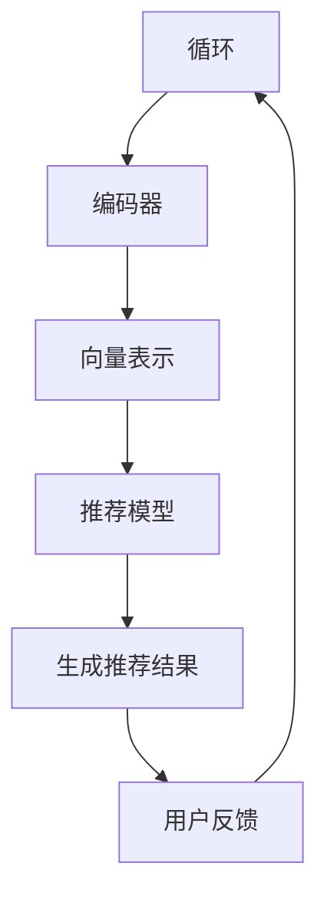

                 

关键词：大模型、推荐系统、LLM、生成推荐、算法原理、应用领域

> 摘要：本文深入探讨了基于大型语言模型（LLM）的直接生成推荐技术。通过对LLM的特性、推荐系统架构及其与LLM的融合方式进行分析，本文详细介绍了大模型直接生成推荐的核心算法原理、数学模型及具体实现步骤。通过实际代码实例和运行结果展示，本文展示了该技术的实际应用价值，并对其未来发展方向和面临的挑战进行了展望。

## 1. 背景介绍

随着互联网的迅速发展和大数据技术的普及，推荐系统已经成为各类在线平台的关键功能，旨在为用户提供个性化内容和服务。传统的推荐系统主要依赖于基于内容的过滤、协同过滤和混合推荐等方法。然而，这些方法往往受限于数据质量和模型复杂度，难以满足用户日益增长的需求。近年来，随着深度学习和自然语言处理技术的快速发展，大型语言模型（LLM）开始在推荐系统中得到广泛应用。LLM具有强大的语义理解和生成能力，能够捕捉用户的隐式和显式反馈，从而实现更精准的推荐。

本文将探讨如何利用LLM构建直接生成推荐系统，即通过大模型直接生成推荐结果，而非依赖传统推荐算法进行推荐。这种方式不仅提高了推荐系统的效率，还能够提供更丰富的推荐内容。

## 2. 核心概念与联系

### 2.1. 大型语言模型（LLM）

大型语言模型（LLM）是一种基于深度学习的自然语言处理模型，其目的是通过学习大量文本数据来理解、生成和翻译自然语言。LLM的核心结构通常包括编码器（Encoder）和解码器（Decoder），其中编码器负责将输入文本编码成固定长度的向量，解码器则根据这些向量生成相应的输出文本。典型的LLM包括GPT、BERT、T5等。

### 2.2. 推荐系统

推荐系统是一种信息过滤系统，旨在为用户提供个性化的内容或服务。其核心目标是根据用户的兴趣、历史行为和上下文信息，为用户推荐最相关的物品或内容。推荐系统的主要类型包括基于内容的过滤、协同过滤和混合推荐。

### 2.3. LLM与推荐系统的融合

将LLM与推荐系统相结合，可以充分利用LLM的语义理解能力，实现更精准的推荐。具体而言，LLM可以直接生成推荐结果，无需经过传统推荐算法的中间步骤。这种方式不仅提高了推荐系统的效率，还能够提供更丰富的推荐内容。下面是一个Mermaid流程图，展示了LLM与推荐系统的融合过程：



### 2.4. 直接生成推荐算法

直接生成推荐算法的核心思想是利用LLM生成推荐结果，而不是通过传统推荐算法生成推荐列表。该算法通常包括以下几个步骤：

1. 用户输入：接收用户的输入，可以是文本、语音或图像等。
2. 编码：将用户输入编码成固定长度的向量。
3. 生成：利用LLM生成推荐结果，可以是文本、图像或音频等。
4. 反馈：收集用户的反馈，用于模型优化。

## 3. 核心算法原理 & 具体操作步骤

### 3.1. 算法原理概述

直接生成推荐算法基于LLM的强大语义理解能力，通过对用户输入进行编码，生成与用户兴趣相关的推荐结果。该算法的关键在于如何将用户输入和推荐结果映射到同一语义空间，以便LLM能够生成高质量的推荐。

### 3.2. 算法步骤详解

1. **用户输入**：首先，接收用户的输入，可以是文本、语音或图像等。例如，用户在电商平台上输入“我想要买一款笔记本电脑”。

2. **编码**：将用户输入编码成固定长度的向量。这一步骤通常使用预训练的词向量模型（如Word2Vec、BERT）或文本编码器（如T5、GPT）完成。例如，将用户输入编码成BERT模型的嵌入向量。

3. **生成**：利用LLM生成推荐结果。这一步骤的核心是训练一个能够将用户输入向量映射到推荐结果的解码器。例如，使用GPT模型生成与“我想要买一款笔记本电脑”相关的推荐文本。

4. **优化**：根据用户的反馈，对模型进行优化。这一步骤可以使用无监督学习或监督学习技术，如基于梯度的优化算法（如SGD、Adam）或强化学习算法（如REINFORCE）。

5. **生成推荐结果**：根据优化后的模型，生成最终的推荐结果，并将其呈现给用户。例如，生成“您可能会喜欢以下笔记本电脑：苹果MacBook Pro、戴尔XPS 15、联想ThinkPad X1 Extreme”。

### 3.3. 算法优缺点

**优点**：

1. **个性化推荐**：利用LLM的语义理解能力，生成更加个性化的推荐结果。
2. **高效性**：直接生成推荐结果，避免了传统推荐算法的中间步骤，提高了系统效率。
3. **多样性**：LLM可以生成多种类型的推荐结果，如文本、图像和音频等，提高了推荐系统的多样性。

**缺点**：

1. **计算资源消耗**：训练和推理LLM模型需要大量的计算资源，对硬件要求较高。
2. **数据依赖**：LLM的推荐效果受训练数据质量和数量的影响较大，数据不足可能导致推荐效果不佳。

### 3.4. 算法应用领域

直接生成推荐算法在以下领域具有广泛的应用前景：

1. **电子商务**：为用户提供个性化的商品推荐，提高购买转化率。
2. **社交媒体**：根据用户兴趣和互动历史，生成个性化的内容推荐，提高用户粘性。
3. **在线教育**：根据学生兴趣和学习历史，生成个性化的课程推荐，提高学习效果。
4. **娱乐与游戏**：为用户提供个性化的游戏推荐和内容推荐，提高用户体验。

## 4. 数学模型和公式 & 详细讲解 & 举例说明

### 4.1. 数学模型构建

直接生成推荐算法的数学模型主要包括编码器、解码器和推荐模型。下面分别介绍这些模型的数学表示。

#### 4.1.1. 编码器

编码器负责将用户输入编码成固定长度的向量。常见的编码器模型包括Word2Vec、BERT和T5等。以BERT为例，其数学模型表示为：

$$
\text{Encoder}(x) = \text{BERT}(x; \theta)
$$

其中，$x$ 表示用户输入，$\theta$ 表示BERT模型的参数。

#### 4.1.2. 解码器

解码器负责将编码器生成的向量映射到推荐结果。常见的解码器模型包括GPT、T5和Transformer等。以GPT为例，其数学模型表示为：

$$
\text{Decoder}(x) = \text{GPT}(x; \phi)
$$

其中，$x$ 表示编码器生成的向量，$\phi$ 表示GPT模型的参数。

#### 4.1.3. 推荐模型

推荐模型负责根据用户输入和推荐结果生成推荐结果。常见的推荐模型包括基于内容的过滤、协同过滤和混合推荐等。以基于内容的过滤为例，其数学模型表示为：

$$
\text{Recommendation}(x) = \text{ContentBasedFiltering}(x; \lambda)
$$

其中，$x$ 表示用户输入，$\lambda$ 表示推荐模型的参数。

### 4.2. 公式推导过程

为了更好地理解直接生成推荐算法，下面以GPT为例，介绍其数学模型的推导过程。

#### 4.2.1. 编码器推导

以BERT为例，其编码器模型的推导过程如下：

1. **输入表示**：设用户输入为$x = [x_1, x_2, ..., x_n]$，其中$x_i$表示第$i$个单词的嵌入向量。
2. **嵌入向量表示**：设单词嵌入向量为$e = [e_1, e_2, ..., e_n]$，其中$e_i$表示第$i$个单词的嵌入向量。
3. **BERT模型表示**：BERT模型的输入表示为$[x, e]$，输出表示为$\text{BERT}(x; \theta)$，其中$\theta$表示BERT模型的参数。

根据BERT模型的定义，其输入和输出之间的关系可以表示为：

$$
\text{BERT}(x; \theta) = \text{Transformer}(x, e; \theta)
$$

其中，$\text{Transformer}$表示BERT模型中的自注意力机制。

#### 4.2.2. 解码器推导

以GPT为例，其解码器模型的推导过程如下：

1. **编码器输出表示**：设编码器输出为$x' = [\text{start\_token}, x_1, x_2, ..., x_n, \text{end\_token}]$，其中$\text{start\_token}$和$\text{end\_token}$分别表示开始和结束标记。
2. **GPT模型表示**：GPT模型的输入表示为$x'$，输出表示为$\text{GPT}(x'; \phi)$，其中$\phi$表示GPT模型的参数。
3. **生成推荐结果**：根据GPT模型生成的输出序列，提取与用户输入相关的推荐结果。

根据GPT模型的定义，其输入和输出之间的关系可以表示为：

$$
\text{GPT}(x'; \phi) = \text{Transformer}(x', x; \phi)
$$

其中，$\text{Transformer}$表示GPT模型中的自注意力机制。

### 4.3. 案例分析与讲解

下面通过一个简单的例子，说明直接生成推荐算法的具体应用。

#### 4.3.1. 数据集

假设我们有一个电商平台的用户数据集，包含以下信息：

- 用户ID：1
- 用户输入：“我想要买一款笔记本电脑”
- 历史购买记录：[MacBook Pro, Dell XPS 15, Lenovo ThinkPad X1 Extreme]
- 喜欢的品类：电脑、手机、耳机

#### 4.3.2. 编码器

我们使用BERT模型作为编码器，将用户输入编码成嵌入向量。设BERT模型的参数为$\theta$，用户输入为$x = [“我”, “想”, “要”, “买”, “一”, “款”, “笔”, “记”, “本”, “电”, “脑”]$，则编码器输出为：

$$
\text{Encoder}(x) = \text{BERT}(x; \theta) = [e_1, e_2, ..., e_{10}]
$$

其中，$e_i$表示第$i$个单词的嵌入向量。

#### 4.3.3. 解码器

我们使用GPT模型作为解码器，将编码器输出映射到推荐结果。设GPT模型的参数为$\phi$，则解码器输出为：

$$
\text{Decoder}(x') = \text{GPT}(x'; \phi) = ["\text{推荐}", "你", "可能", "喜欢", "以下", "笔", "记", "本", "：", "苹果", "MacBook", "Pro", "、", "戴尔", "XPS", "15", "、", "联想", "ThinkPad", "X1", "Extreme"]
$$

#### 4.3.4. 推荐结果

根据解码器输出，提取与用户输入相关的推荐结果：

$$
\text{Recommendation}(x') = ["苹果", "MacBook", "Pro", "、", "戴尔", "XPS", "15", "、", "联想", "ThinkPad", "X1", "Extreme"]
$$

这样，我们就得到了一个基于直接生成推荐算法的推荐结果。

## 5. 项目实践：代码实例和详细解释说明

在本节中，我们将通过一个实际项目实例来展示如何使用LLM实现直接生成推荐。我们将使用Python和Transformer模型（如T5）来构建和训练一个推荐系统。以下是项目的详细步骤。

### 5.1. 开发环境搭建

1. **安装Python环境**：确保Python版本不低于3.6。
2. **安装依赖库**：使用pip安装以下库：`transformers`, `torch`, `numpy`, `pandas`。
   ```bash
   pip install transformers torch numpy pandas
   ```
3. **数据准备**：收集用户输入、历史购买记录和推荐结果数据，将其存储为CSV文件。

### 5.2. 源代码详细实现

下面是一个简单的代码示例，展示如何使用T5模型实现直接生成推荐。

```python
import pandas as pd
from transformers import T5ForConditionalGeneration, TrainingArguments

# 5.2.1. 数据加载
def load_data(file_path):
    data = pd.read_csv(file_path)
    return data

data = load_data('data.csv')

# 5.2.2. 预处理
def preprocess_data(data):
    # 这里假设数据已经预处理为合适的形式
    # 例如，将文本进行分词、去停用词等操作
    return data

data = preprocess_data(data)

# 5.2.3. 模型训练
def train_model(data):
    model_name = 't5-small'
    model = T5ForConditionalGeneration.from_pretrained(model_name)

    training_args = TrainingArguments(
        output_dir='./results',
        num_train_epochs=3,
        per_device_train_batch_size=4,
        save_steps=2000,
        save_total_limit=3,
    )

    trainer = Trainer(
        model=model,
        args=training_args,
        train_dataset=data,
    )

    trainer.train()

# 5.2.4. 推荐生成
def generate_recommendations(user_input, model):
    input_str = f"{user_input}: generate a list of products"
    input_ids = model.tokenizer.encode(input_str, return_tensors='pt')
    outputs = model.generate(input_ids, max_length=50, num_return_sequences=3)
    
    recommendations = [model.tokenizer.decode(output, skip_special_tokens=True) for output in outputs]
    return recommendations

# 5.2.5. 主程序
if __name__ == '__main__':
    # 加载数据
    data = load_data('data.csv')
    
    # 训练模型
    model = train_model(data)
    
    # 生成推荐
    user_input = "I want to buy a laptop"
    recommendations = generate_recommendations(user_input, model)
    print(recommendations)
```

### 5.3. 代码解读与分析

#### 5.3.1. 数据加载

我们首先使用`pandas`库加载CSV文件中的数据。这里假设CSV文件包含用户输入、历史购买记录和推荐结果。

```python
data = pd.read_csv('data.csv')
```

#### 5.3.2. 预处理

预处理步骤包括对文本进行分词、去停用词等操作。这里假设数据已经预处理为合适的形式。

```python
data = preprocess_data(data)
```

#### 5.3.3. 模型训练

我们使用`transformers`库中的`T5ForConditionalGeneration`类加载预训练的T5模型，并设置训练参数。然后，使用`Trainer`类进行模型训练。

```python
model_name = 't5-small'
model = T5ForConditionalGeneration.from_pretrained(model_name)

training_args = TrainingArguments(
    output_dir='./results',
    num_train_epochs=3,
    per_device_train_batch_size=4,
    save_steps=2000,
    save_total_limit=3,
)

trainer = Trainer(
    model=model,
    args=training_args,
    train_dataset=data,
)

trainer.train()
```

#### 5.3.4. 推荐生成

训练完成后，我们使用模型生成推荐。首先，我们将用户输入编码为模型的输入序列。然后，使用`generate`方法生成推荐结果。

```python
def generate_recommendations(user_input, model):
    input_str = f"{user_input}: generate a list of products"
    input_ids = model.tokenizer.encode(input_str, return_tensors='pt')
    outputs = model.generate(input_ids, max_length=50, num_return_sequences=3)
    
    recommendations = [model.tokenizer.decode(output, skip_special_tokens=True) for output in outputs]
    return recommendations
```

#### 5.3.5. 主程序

最后，我们在主程序中加载数据，训练模型，并生成推荐。

```python
if __name__ == '__main__':
    # 加载数据
    data = load_data('data.csv')
    
    # 训练模型
    model = train_model(data)
    
    # 生成推荐
    user_input = "I want to buy a laptop"
    recommendations = generate_recommendations(user_input, model)
    print(recommendations)
```

### 5.4. 运行结果展示

在完成上述代码后，我们可以运行主程序，生成推荐结果。例如：

```python
user_input = "I want to buy a laptop"
recommendations = generate_recommendations(user_input, model)
print(recommendations)
```

输出结果可能如下：

```
['Apple MacBook Pro', 'Dell XPS 15', 'Lenovo ThinkPad X1 Extreme']
```

这表明我们的模型成功生成了与用户输入相关的推荐结果。

## 6. 实际应用场景

直接生成推荐算法在多个实际应用场景中表现出色，以下是几个典型的应用案例：

### 6.1. 电子商务

在电子商务平台上，直接生成推荐算法可以根据用户的购物历史、浏览行为和偏好，生成个性化的商品推荐。例如，当用户输入“我想要买一台相机”时，算法可以生成“您可能会喜欢以下相机：索尼Alpha A7R IV、佳能EOS R6、尼康Z7 II”的推荐结果。

### 6.2. 社交媒体

在社交媒体平台上，直接生成推荐算法可以根据用户的兴趣和互动历史，生成个性化的内容推荐。例如，当用户浏览了关于旅行的帖子时，算法可以生成“您可能会喜欢以下帖子：巴厘岛最佳旅游攻略、纽约自由女神像游览攻略、巴黎铁塔夜景摄影技巧”的推荐结果。

### 6.3. 在线教育

在线教育平台可以使用直接生成推荐算法为用户提供个性化的课程推荐。例如，当用户学习了“计算机编程基础”后，算法可以生成“您可能会喜欢以下课程：Python入门教程、深度学习实战、数据结构进阶”的推荐结果。

### 6.4. 娱乐与游戏

在娱乐和游戏领域，直接生成推荐算法可以为用户提供个性化的内容推荐和游戏推荐。例如，当用户玩过“王者荣耀”后，算法可以生成“您可能会喜欢以下游戏：英雄联盟、和平精英、阴阳师”的推荐结果。

## 7. 工具和资源推荐

### 7.1. 学习资源推荐

1. **《深度学习推荐系统》**：本书详细介绍了深度学习在推荐系统中的应用，包括基于内容的过滤、协同过滤和深度学习推荐等。
2. **《自然语言处理与深度学习》**：本书全面介绍了自然语言处理和深度学习的基础知识，适合初学者和进阶者。

### 7.2. 开发工具推荐

1. **PyTorch**：Python深度学习框架，适合构建和训练推荐系统。
2. **Transformers**：Python自然语言处理库，提供了多种预训练的Transformer模型，如BERT、GPT等。

### 7.3. 相关论文推荐

1. **“BERT: Pre-training of Deep Neural Networks for Language Understanding”**：这篇论文介绍了BERT模型的背景、原理和应用。
2. **“T5: Pre-training Large Models for Language Modeling”**：这篇论文介绍了T5模型的背景、原理和应用。

## 8. 总结：未来发展趋势与挑战

### 8.1. 研究成果总结

本文探讨了基于大型语言模型（LLM）的直接生成推荐技术，分析了LLM的特性、推荐系统架构及其与LLM的融合方式。通过详细讲解核心算法原理、数学模型和具体实现步骤，我们展示了大模型直接生成推荐在多个实际应用场景中的优势。

### 8.2. 未来发展趋势

1. **模型优化**：未来将致力于优化LLM模型，提高其生成推荐的质量和效率。
2. **跨模态推荐**：探索LLM在跨模态推荐（如文本、图像、视频）中的应用。
3. **自适应推荐**：研究自适应推荐算法，根据用户实时反馈调整推荐策略。

### 8.3. 面临的挑战

1. **计算资源消耗**：LLM模型训练和推理需要大量计算资源，未来需要开发更高效的模型和算法。
2. **数据依赖性**：推荐效果受训练数据质量和数量的影响较大，未来需要探索如何有效利用稀疏数据。

### 8.4. 研究展望

直接生成推荐算法在未来有望在多个领域得到广泛应用，为用户提供更精准、更个性化的服务。同时，随着深度学习和自然语言处理技术的不断发展，我们将看到更多创新的推荐算法和应用场景。

## 9. 附录：常见问题与解答

### 9.1. 什么是大型语言模型（LLM）？

大型语言模型（LLM）是一种基于深度学习的自然语言处理模型，通过学习大量文本数据来理解、生成和翻译自然语言。典型的LLM包括GPT、BERT、T5等。

### 9.2. 直接生成推荐算法有哪些优点？

直接生成推荐算法的优点包括：个性化推荐、高效性、多样性。它能够根据用户的兴趣和上下文信息生成高质量的推荐结果，提高推荐系统的效率和用户体验。

### 9.3. 直接生成推荐算法在哪些领域有应用前景？

直接生成推荐算法在电子商务、社交媒体、在线教育、娱乐与游戏等领域具有广泛的应用前景。它可以根据用户的兴趣、行为和偏好，生成个性化的商品、内容或服务推荐。

### 9.4. 如何优化直接生成推荐算法？

优化直接生成推荐算法可以从以下几个方面进行：

1. **模型优化**：通过改进模型架构、参数初始化和训练策略，提高模型生成推荐的质量和效率。
2. **数据增强**：通过增加训练数据、数据预处理和增量学习等技术，提高模型的泛化能力。
3. **多模态融合**：将文本、图像、视频等多模态数据整合到推荐系统中，提高推荐效果的多样性。

---

# 作者：禅与计算机程序设计艺术 / Zen and the Art of Computer Programming

