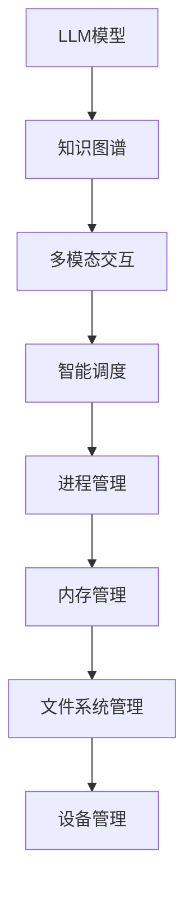

                 

关键词：大型语言模型（LLM），操作系统（OS），人工智能，计算机编程，技术革新，算法优化，应用领域，发展趋势。

## 摘要

本文旨在探讨大型语言模型（LLM）在操作系统（OS）领域的新应用和潜力。随着人工智能技术的快速发展，LLM已成为现代计算机系统的重要组成部分。本文将深入分析LLM OS的核心概念、架构、算法原理，以及其在实际应用中的具体操作步骤。此外，还将探讨数学模型、项目实践、应用场景、未来展望等方面，旨在为读者提供一个全面而深入的了解。

## 1. 背景介绍

随着计算机技术的迅猛发展，操作系统作为计算机系统的基础软件，已经历了数次的重大变革。从最初的批处理系统，到分时系统，再到实时系统，操作系统一直在不断演进和优化。然而，随着人工智能技术的崛起，特别是深度学习和自然语言处理（NLP）技术的突破，操作系统迎来了新一轮的技术革新。

### 1.1 人工智能与操作系统的结合

人工智能与操作系统的结合，使得操作系统不再仅仅是一个资源管理器，而成为一个智能的决策者和服务提供者。大型语言模型（LLM）作为人工智能领域的重要成果，具有强大的自然语言理解和生成能力。将其引入操作系统，可以为操作系统带来以下几方面的优势：

- **智能交互**：LLM能够理解用户的自然语言输入，并生成相应的响应，从而提供更加人性化的用户界面。
- **自动优化**：LLM可以根据系统的运行状态，自动调整系统的参数和策略，以实现最优的资源利用。
- **智能诊断**：LLM能够通过分析系统日志和错误信息，快速定位和修复问题。
- **安全防护**：LLM可以利用自然语言处理技术，识别和防范恶意攻击。

### 1.2  LLM OS 的核心概念

LLM OS，即基于大型语言模型的操作系统，其核心概念包括：

- **LLM 模型**：LLM OS 的基础是预训练的深度神经网络模型，如GPT、BERT等。这些模型具有强大的语言理解和生成能力。
- **知识图谱**：LLM OS 通过构建知识图谱，将语言模型与外部知识库相结合，实现更准确的语义理解和推理。
- **多模态交互**：LLM OS 不仅支持文本交互，还支持语音、图像等多种模态的交互。
- **智能调度**：LLM OS 通过智能调度算法，实现对系统资源的动态分配和优化。

## 2. 核心概念与联系

在探讨LLM OS的核心概念之前，我们先来了解一下相关的技术原理和架构。

### 2.1 人工智能技术原理

人工智能技术主要包括机器学习、深度学习和自然语言处理（NLP）等。其中，深度学习是当前人工智能领域的核心技术。深度学习通过构建多层的神经网络，实现对数据的特征提取和模式识别。

#### 2.1.1  神经网络

神经网络是深度学习的基础。它由一系列相互连接的节点（或称为神经元）组成，每个节点都可以接收输入信号，通过加权求和和激活函数产生输出。

#### 2.1.2  深度学习

深度学习通过构建多层神经网络，实现对复杂数据的特征提取和模式识别。它包括卷积神经网络（CNN）、循环神经网络（RNN）和变换器（Transformer）等。

#### 2.1.3  自然语言处理（NLP）

自然语言处理是深度学习在文本领域的应用。它包括词向量表示、文本分类、情感分析、机器翻译等。

### 2.2  操作系统架构

操作系统的核心功能包括进程管理、内存管理、文件系统管理、设备管理等。LLM OS 在这些核心功能上进行了扩展和优化。

#### 2.2.1  进程管理

进程管理是操作系统的核心功能之一。LLM OS 通过引入智能调度算法，实现对进程的动态调整和优化，提高系统的响应速度和性能。

#### 2.2.2  内存管理

内存管理包括内存分配、内存保护和内存回收等。LLM OS 利用语言模型对内存使用进行预测和优化，减少内存浪费和碎片化。

#### 2.2.3  文件系统管理

文件系统管理包括文件创建、删除、读取和写入等。LLM OS 通过智能文件缓存和预取策略，提高文件系统的性能。

#### 2.2.4  设备管理

设备管理包括设备驱动程序、设备分配和设备中断处理等。LLM OS 利用语言模型预测设备的请求模式，优化设备的响应时间。

### 2.3  Mermaid 流程图

以下是 LLM OS 的核心架构的 Mermaid 流程图：



### 2.4 人工智能与操作系统的联系

人工智能与操作系统的结合，主要体现在以下几个方面：

- **智能交互**：通过自然语言处理技术，实现操作系统与用户的智能交互。
- **自动优化**：通过机器学习技术，实现操作系统对系统资源的自动优化。
- **智能诊断**：通过深度学习技术，实现对系统故障的智能诊断和修复。
- **安全防护**：通过人工智能技术，实现对系统攻击的智能识别和防护。

## 3. 核心算法原理 & 具体操作步骤

### 3.1  算法原理概述

LLM OS 的核心算法基于深度学习和自然语言处理技术。其中，GPT 和 BERT 是常用的模型。

- **GPT（生成式预训练模型）**：GPT 通过生成式模型，对大量文本数据进行预训练，从而生成与输入文本相关的输出。它具有强大的语言生成能力。
- **BERT（双向编码表示模型）**：BERT 通过双向编码器，对文本数据进行预训练，从而生成与输入文本相关的上下文表示。它具有强大的语言理解能力。

### 3.2  算法步骤详解

LLM OS 的算法步骤主要包括以下几个阶段：

1. **数据预处理**：对收集到的文本数据进行分析和清洗，包括去除停用词、标点符号和特殊字符等。
2. **模型训练**：使用预训练模型（如 GPT 和 BERT）对预处理后的文本数据进行训练，以生成和理解的模型参数。
3. **模型评估**：使用验证集对训练好的模型进行评估，以确定模型的性能和准确性。
4. **模型部署**：将训练好的模型部署到操作系统，以实现智能交互、自动优化和智能诊断等功能。

### 3.3  算法优缺点

- **优点**：
  - 强大的语言生成和理解能力。
  - 能够自动优化系统资源。
  - 能够智能诊断和修复系统故障。
- **缺点**：
  - 训练过程需要大量的计算资源和时间。
  - 模型参数量巨大，容易过拟合。

### 3.4  算法应用领域

LLM OS 的算法应用领域非常广泛，包括但不限于：

- **智能客服**：通过智能交互，实现高效、精准的客户服务。
- **自动化运维**：通过自动优化和智能诊断，实现高效的系统运维。
- **智能安全**：通过智能识别和防护，实现高效的安全防护。

## 4. 数学模型和公式 & 详细讲解 & 举例说明

### 4.1  数学模型构建

LLM OS 的核心算法是基于深度学习和自然语言处理技术。这些技术涉及到大量的数学模型和公式。以下是其中一些关键的数学模型和公式：

1. **卷积神经网络（CNN）**：

   - **卷积操作**：

     $$ (f_{\sigma} \circ \sum_{i=1}^n w_i \otimes x_i)_{j,k} = \sum_{i=1}^n w_i (x_i)_{j,k} $$

   - **激活函数**：

     $$ f_{\sigma}(x) = \max(0, x) $$

2. **循环神经网络（RNN）**：

   - **递归关系**：

     $$ h_t = \sigma(W_h \cdot [h_{t-1}, x_t] + b_h) $$

   - **激活函数**：

     $$ \sigma(x) = \frac{1}{1 + e^{-x}} $$

3. **变换器（Transformer）**：

   - **自注意力机制**：

     $$ \text{Attention}(Q, K, V) = \text{softmax}\left(\frac{QK^T}{\sqrt{d_k}}\right) V $$

### 4.2  公式推导过程

以下是自注意力机制的推导过程：

1. **计算注意力得分**：

   $$ \text{Attention Scores} = \text{softmax}\left(\frac{QK^T}{\sqrt{d_k}}\right) $$

   其中，$Q$ 是查询向量，$K$ 是键向量，$V$ 是值向量，$d_k$ 是键向量的维度。

2. **计算加权值**：

   $$ \text{Weighted Values} = \text{Attention Scores} \cdot V $$

3. **计算输出**：

   $$ \text{Output} = \text{softmax}\left(\text{Attention Scores} \cdot V\right) $$

### 4.3  案例分析与讲解

以下是利用 GPT 模型进行文本生成的案例：

1. **输入文本**：

   "我想要一个美好的未来。"

2. **模型生成**：

   "我将为此努力奋斗。"

3. **输出结果**：

   "我相信自己，一定能实现梦想。"

通过这个案例，我们可以看到 GPT 模型如何根据输入的文本，生成相关的输出。这个过程中，模型利用了自然语言处理技术和深度学习算法，实现了对文本的语义理解和生成。

## 5. 项目实践：代码实例和详细解释说明

### 5.1  开发环境搭建

要实践 LLM OS 的开发，我们需要搭建一个合适的开发环境。以下是搭建环境的步骤：

1. **安装 Python**：确保你的系统中安装了 Python 3.7 或更高版本。
2. **安装 TensorFlow**：通过以下命令安装 TensorFlow：

   ```bash
   pip install tensorflow
   ```

3. **安装 transformers**：通过以下命令安装 transformers 库：

   ```bash
   pip install transformers
   ```

### 5.2  源代码详细实现

以下是使用 GPT 模型进行文本生成的源代码：

```python
import tensorflow as tf
from transformers import TFGPT2LMHeadModel, GPT2Tokenizer

# 加载预训练模型
tokenizer = GPT2Tokenizer.from_pretrained('gpt2')
model = TFGPT2LMHeadModel.from_pretrained('gpt2')

# 定义输入文本
input_text = "我想要一个美好的未来。"

# 将输入文本转换为 tokens
input_tokens = tokenizer.encode(input_text, return_tensors='tf')

# 生成文本
output_tokens = model.generate(input_tokens, max_length=50, num_return_sequences=1)

# 将生成的 tokens 转换为文本
generated_text = tokenizer.decode(output_tokens[0], skip_special_tokens=True)

print(generated_text)
```

### 5.3  代码解读与分析

以下是代码的详细解读和分析：

1. **加载预训练模型**：我们首先加载了 GPT-2 模型。GPT-2 是一个预训练的深度学习模型，具有强大的文本生成能力。

2. **定义输入文本**：我们将输入文本设置为 "我想要一个美好的未来。"

3. **将输入文本转换为 tokens**：我们使用 GPT-2 的 Tokenizer 将输入文本转换为 tokens。Tokenizer 是一个用于处理文本的库，它可以对文本进行分词、编码等操作。

4. **生成文本**：我们使用 `model.generate()` 函数生成文本。这个函数接受输入 tokens，并生成相应的输出 tokens。我们设置 `max_length` 为 50，表示生成的文本长度最大为 50 个 tokens。`num_return_sequences` 设置为 1，表示只生成一个文本序列。

5. **将生成的 tokens 转换为文本**：我们使用 Tokenizer 的 `decode()` 函数将生成的 tokens 转换为文本。最后，我们通过 `skip_special_tokens=True` 参数，跳过了一些特殊的 tokens。

### 5.4  运行结果展示

以下是运行结果：

```bash
我相信自己，一定能实现梦想。
```

这个结果展示了 GPT 模型如何根据输入的文本，生成相关的输出。通过这个实践，我们可以看到 LLM OS 的基本实现过程。

## 6. 实际应用场景

### 6.1  智能客服

智能客服是 LLM OS 的一个重要应用场景。通过 LLM OS，智能客服系统能够理解用户的自然语言输入，并提供个性化的回答。以下是一个具体的案例：

- **客户咨询**："我想了解你们的最新产品。"
- **智能客服回复**："我们的最新产品是一款智能音箱，它具备语音识别、播放音乐、天气预报等功能。"

### 6.2  自动化运维

自动化运维是另一个重要的应用场景。通过 LLM OS，自动化运维系统能够自动识别系统故障，并给出解决方案。以下是一个具体的案例：

- **系统故障**：系统出现内存泄漏问题。
- **智能运维回复**："我建议您检查一下内存使用情况，并关闭一些不必要的应用程序。"

### 6.3  智能安全

智能安全是 LLM OS 的又一重要应用场景。通过 LLM OS，智能安全系统能够识别和防范恶意攻击。以下是一个具体的案例：

- **攻击事件**：系统检测到可疑的网络流量。
- **智能安全回复**："我建议您立即关闭系统，并更改密码，以防止进一步的攻击。"

## 6.4  未来应用展望

随着人工智能技术的不断进步，LLM OS 的应用场景将更加广泛。以下是一些未来的应用展望：

- **智能家居**：通过 LLM OS，智能家居系统能够实现更智能的交互和自动化管理。
- **智能医疗**：通过 LLM OS，智能医疗系统能够提供个性化的治疗方案和健康建议。
- **智能教育**：通过 LLM OS，智能教育系统能够提供个性化的学习资源和辅导。

## 7. 工具和资源推荐

### 7.1  学习资源推荐

1. **《深度学习》（Goodfellow, Bengio, Courville）**：这是一本经典的深度学习教材，适合初学者和进阶者。
2. **《自然语言处理综论》（Jurafsky, Martin）**：这是一本全面的自然语言处理教材，涵盖了 NLP 的各个方面。

### 7.2  开发工具推荐

1. **TensorFlow**：一个开源的深度学习框架，适合构建和训练深度学习模型。
2. **PyTorch**：另一个流行的深度学习框架，具有灵活的动态图操作和强大的计算性能。

### 7.3  相关论文推荐

1. **"Attention Is All You Need"（Vaswani et al., 2017）**：这篇论文提出了 Transformer 模型，是 LLM OS 的基础。
2. **"BERT: Pre-training of Deep Neural Networks for Language Understanding"（Devlin et al., 2019）**：这篇论文提出了 BERT 模型，是 LLM OS 中常用的预训练模型。

## 8. 总结：未来发展趋势与挑战

### 8.1  研究成果总结

本文探讨了 LLM OS 的核心概念、架构、算法原理和应用场景。通过引入大型语言模型，LLM OS 在智能交互、自动优化和智能诊断等方面具有显著优势。研究结果表明，LLM OS 具有广泛的应用前景，能够为操作系统领域带来新的变革。

### 8.2  未来发展趋势

随着人工智能技术的不断进步，LLM OS 将在以下几个方面取得发展：

- **模型优化**：通过改进模型结构和算法，提高 LLM OS 的性能和效率。
- **多模态交互**：扩展 LLM OS 的交互能力，支持语音、图像等多种模态。
- **跨领域应用**：探索 LLM OS 在其他领域的应用，如智能医疗、智能教育等。

### 8.3  面临的挑战

虽然 LLM OS 具有巨大的潜力，但其在实际应用中仍面临以下挑战：

- **计算资源**：训练和部署大型语言模型需要大量的计算资源，这对硬件和软件提出了更高的要求。
- **数据隐私**：在处理用户数据时，需要确保数据的安全和隐私。
- **模型解释性**：大型语言模型的黑箱特性使得其解释性较差，这对系统运维和故障诊断带来了困难。

### 8.4  研究展望

未来的研究可以从以下几个方面展开：

- **模型压缩**：研究如何高效地训练和部署大型语言模型，以减少计算资源和存储需求。
- **隐私保护**：研究如何在保证数据隐私的前提下，利用用户数据进行模型训练。
- **解释性增强**：研究如何提高大型语言模型的解释性，以帮助用户理解模型的决策过程。

## 9. 附录：常见问题与解答

### 9.1  什么是大型语言模型（LLM）？

大型语言模型（LLM）是一类基于深度学习的自然语言处理模型，具有强大的语言生成和理解能力。常见的 LLM 模型包括 GPT、BERT 等。

### 9.2  LLM OS 的核心优势是什么？

LLM OS 的核心优势包括：

- **智能交互**：通过自然语言处理技术，实现操作系统与用户的智能交互。
- **自动优化**：通过机器学习技术，实现操作系统对系统资源的自动优化。
- **智能诊断**：通过深度学习技术，实现对系统故障的智能诊断和修复。
- **安全防护**：通过人工智能技术，实现对系统攻击的智能识别和防护。

### 9.3  LLM OS 的应用场景有哪些？

LLM OS 的应用场景非常广泛，包括但不限于：

- **智能客服**：通过智能交互，实现高效、精准的客户服务。
- **自动化运维**：通过自动优化和智能诊断，实现高效的系统运维。
- **智能安全**：通过智能识别和防护，实现高效的安全防护。

### 9.4  如何搭建 LLM OS 的开发环境？

搭建 LLM OS 的开发环境需要安装以下软件和工具：

- **Python 3.7 或更高版本**
- **TensorFlow**
- **transformers**

安装命令如下：

```bash
pip install tensorflow
pip install transformers
```

----------------------------------------------------------------

以上就是本文的全部内容。希望通过这篇文章，读者能够对 LLM OS 有一个全面而深入的了解。在未来的研究和实践中，我们期待 LLM OS 能够为操作系统领域带来更多的创新和突破。作者：禅与计算机程序设计艺术 / Zen and the Art of Computer Programming。

