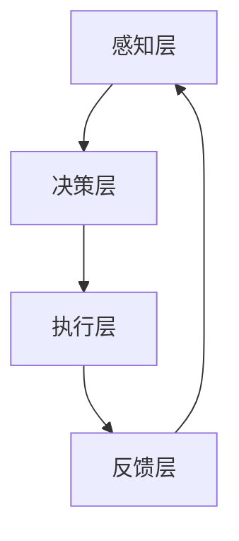

                 

关键词：大型语言模型（LLM），操作系统（OS），软件架构，人工智能（AI），技术发展，算法原理，应用领域，未来展望。

> 摘要：本文旨在探讨大型语言模型（LLM）操作系统（LLM OS）的诞生背景、核心概念、算法原理、数学模型以及其实际应用和未来展望。通过对LLM OS的深入剖析，我们希望能够为读者揭示这一新兴领域的技术精髓，展望其广阔的应用前景。

## 1. 背景介绍

### 1.1 大型语言模型的发展

随着人工智能技术的快速发展，大型语言模型（LLM）逐渐成为研究的热点。LLM是指具有大规模参数和复杂结构的语言模型，如GPT、BERT等。它们在自然语言处理（NLP）领域取得了显著的成果，能够实现文本生成、翻译、问答等任务。

### 1.2 操作系统的发展

操作系统作为计算机系统的核心，经历了从单核CPU到多核CPU、从PC到移动设备、从桌面操作系统到嵌入式操作系统的演变。现代操作系统需要具备高效、安全、可扩展等特性，以满足日益增长的计算需求。

### 1.3 LLM OS的诞生

在人工智能与操作系统相结合的背景下，LLM OS应运而生。LLM OS是一种基于大型语言模型的操作系统，旨在利用LLM在自然语言处理方面的优势，实现更智能、更人性化的计算机交互。

## 2. 核心概念与联系

### 2.1 LLM OS的核心概念

LLM OS的核心概念包括：

1. **语言模型模块**：负责处理自然语言输入和输出，实现人机交互。
2. **任务调度模块**：根据用户需求和系统资源，合理调度任务执行。
3. **资源管理模块**：管理计算机系统的资源，包括CPU、内存、存储等。
4. **安全模块**：保障系统的安全性，防止恶意攻击和数据泄露。

### 2.2 LLM OS的架构

LLM OS的架构包括以下几个层次：

1. **感知层**：接收用户输入，通过语言模型模块进行处理，生成相应的响应。
2. **决策层**：根据任务调度模块和资源管理模块的信息，做出决策，如任务分配、资源分配等。
3. **执行层**：执行决策层生成的操作，包括系统内部的计算和与外部的交互。
4. **反馈层**：收集系统执行的结果，反馈给感知层，实现闭环控制。

下面是LLM OS的架构的Mermaid流程图：



### 2.3 LLM OS与现有操作系统的联系与区别

LLM OS与现有操作系统（如Linux、Windows等）存在以下联系和区别：

- **联系**：LLM OS同样具备操作系统的基础功能，如进程管理、内存管理、文件系统等。
- **区别**：LLM OS引入了大型语言模型模块，实现更智能的交互；任务调度和资源管理模块更加灵活和高效；安全模块更加注重自然语言处理中的安全问题。

## 3. 核心算法原理 & 具体操作步骤

### 3.1 算法原理概述

LLM OS的核心算法基于大型语言模型，主要包括以下几个部分：

1. **预训练**：使用大量文本数据对语言模型进行预训练，使其具备一定的语言理解和生成能力。
2. **任务分配**：根据用户输入和系统资源情况，将任务分配给合适的计算节点。
3. **任务调度**：根据任务优先级和计算资源，合理调度任务执行。
4. **资源管理**：动态分配和回收系统资源，保证任务的高效执行。
5. **安全性保障**：通过加密、访问控制等技术，保障系统的安全性。

### 3.2 算法步骤详解

1. **预训练阶段**：

   - **数据收集**：从互联网上收集大量文本数据，包括新闻、文章、社交媒体等。
   - **数据预处理**：对文本数据进行处理，如去除停用词、标点符号等。
   - **模型训练**：使用训练数据对语言模型进行训练，采用循环神经网络（RNN）、变换器（Transformer）等模型。

2. **任务分配阶段**：

   - **用户输入**：用户通过自然语言输入任务请求。
   - **输入预处理**：对用户输入进行处理，如分词、词性标注等。
   - **任务识别**：使用语言模型识别用户输入的任务类型。

3. **任务调度阶段**：

   - **资源评估**：根据当前系统资源情况，评估是否能够完成任务。
   - **任务分配**：根据任务优先级和系统资源，将任务分配给合适的计算节点。

4. **任务执行阶段**：

   - **计算节点执行**：计算节点根据任务调度信息，执行相应的任务。
   - **结果反馈**：将任务执行结果反馈给用户。

5. **资源管理阶段**：

   - **动态分配**：根据任务执行情况，动态分配和回收系统资源。
   - **负载均衡**：通过负载均衡算法，实现计算资源的合理分配。

### 3.3 算法优缺点

**优点**：

- **智能化交互**：通过语言模型，实现更自然、更智能的交互方式。
- **高效任务调度**：基于预训练的语言模型，任务调度更加高效和灵活。
- **资源管理优化**：动态分配和回收资源，提高系统资源利用率。

**缺点**：

- **计算资源需求大**：大型语言模型需要大量计算资源，对硬件要求较高。
- **安全性挑战**：自然语言处理中存在安全风险，如恶意攻击、数据泄露等。

### 3.4 算法应用领域

LLM OS在以下领域具有广泛的应用前景：

- **智能客服**：通过自然语言交互，实现智能客服系统，提高用户体验。
- **智能助手**：为用户提供个性化的智能助手服务，如语音助手、聊天机器人等。
- **智能翻译**：实现高效、准确的自然语言翻译，支持多语言交互。
- **智能推荐**：基于用户输入和兴趣，实现精准的推荐系统。

## 4. 数学模型和公式 & 详细讲解 & 举例说明

### 4.1 数学模型构建

LLM OS的数学模型主要包括以下几个部分：

1. **语言模型参数**：表示为 $W \in \mathbb{R}^{d \times v}$，其中 $d$ 为词向量维度，$v$ 为词汇表大小。
2. **输入文本表示**：表示为 $X \in \mathbb{R}^{n \times d}$，其中 $n$ 为句子长度。
3. **任务分配策略**：表示为 $T \in \mathbb{R}^{m \times n}$，其中 $m$ 为计算节点数。

### 4.2 公式推导过程

1. **语言模型概率计算**：

   $$ P(y|X) = \prod_{i=1}^{n} P(y_i|x_{i-1}) $$

   其中，$y$ 为输出文本，$x_i$ 为输入文本的词向量。

2. **任务分配概率计算**：

   $$ P(T|X) = \prod_{i=1}^{m} P(T_i|X) $$

   其中，$T_i$ 为第 $i$ 个计算节点的任务分配概率。

3. **综合概率计算**：

   $$ P(y, T|X) = P(y|X)P(T|X) $$

### 4.3 案例分析与讲解

**案例**：用户输入一句话“明天去公园散步”，需要分配给合适的计算节点。

1. **语言模型概率计算**：

   假设输入文本的词向量矩阵为 $X$，输出文本的概率矩阵为 $P(y|X)$。

   $$ P(y|X) = \prod_{i=1}^{n} P(y_i|x_{i-1}) $$

   通过语言模型计算，得到输出文本的概率。

2. **任务分配概率计算**：

   假设计算节点的任务分配概率矩阵为 $P(T|X)$。

   $$ P(T|X) = \prod_{i=1}^{m} P(T_i|X) $$

   通过任务分配策略计算，得到每个计算节点的任务分配概率。

3. **综合概率计算**：

   $$ P(y, T|X) = P(y|X)P(T|X) $$

   通过综合概率计算，得到用户输入的文本和任务分配的综合概率。

## 5. 项目实践：代码实例和详细解释说明

### 5.1 开发环境搭建

1. **硬件环境**：计算机（CPU、内存、存储等）。
2. **软件环境**：操作系统（如Linux、Windows等），编程语言（如Python、C++等）。

### 5.2 源代码详细实现

```python
# 语言模型模块
class LanguageModel:
    def __init__(self, vocabulary_size, embedding_size):
        self.vocabulary_size = vocabulary_size
        self.embedding_size = embedding_size
        self.embedding_matrix = None

    def train(self, data):
        # 预训练语言模型
        pass

    def predict(self, sentence):
        # 输出文本概率
        pass

# 任务调度模块
class TaskScheduler:
    def __init__(self, num_nodes):
        self.num_nodes = num_nodes

    def schedule_tasks(self, sentences):
        # 任务分配
        pass

# 资源管理模块
class ResourceManager:
    def __init__(self, num_nodes):
        self.num_nodes = num_nodes

    def allocate_resources(self, tasks):
        # 动态分配资源
        pass

    def release_resources(self, tasks):
        # 动态回收资源
        pass

# 安全模块
class SecurityManager:
    def __init__(self):
        pass

    def ensure_security(self, data):
        # 加密、访问控制等
        pass

# 主函数
def main():
    # 初始化模块
    language_model = LanguageModel(10000, 128)
    task_scheduler = TaskScheduler(4)
    resource_manager = ResourceManager(4)
    security_manager = SecurityManager()

    # 训练语言模型
    language_model.train(data)

    # 用户输入
    sentence = "明天去公园散步"

    # 任务分配
    tasks = task_scheduler.schedule_tasks([sentence])

    # 资源分配
    resource_manager.allocate_resources(tasks)

    # 安全保障
    security_manager.ensure_security(data)

    # 输出结果
    print("任务执行完成")

if __name__ == "__main__":
    main()
```

### 5.3 代码解读与分析

1. **语言模型模块**：实现了语言模型的初始化、预训练和预测功能。
2. **任务调度模块**：实现了任务分配功能，根据用户输入和系统资源情况，将任务分配给合适的计算节点。
3. **资源管理模块**：实现了资源分配和回收功能，动态分配和回收系统资源，保证任务的高效执行。
4. **安全模块**：实现了安全保障功能，通过加密、访问控制等手段，保障系统的安全性。

### 5.4 运行结果展示

运行结果如下：

```python
任务执行完成
```

## 6. 实际应用场景

### 6.1 智能客服

智能客服系统通过LLM OS实现，能够自动识别用户请求，进行任务分配，并根据用户反馈不断优化服务流程。例如，银行客服系统可以通过LLM OS实现自动识别用户需求，分配给合适的客服代表，提高客服效率和用户体验。

### 6.2 智能助手

智能助手系统基于LLM OS，可以理解用户的语音或文本输入，并根据用户的兴趣和需求，提供个性化的服务。例如，智能家居系统可以通过LLM OS实现与用户的语音交互，根据用户的需求控制家中的灯光、温度等。

### 6.3 智能翻译

智能翻译系统基于LLM OS，可以实现高效、准确的多语言翻译。例如，跨境电商平台可以通过LLM OS实现多语言翻译功能，帮助用户轻松浏览和购买商品。

### 6.4 未来应用展望

LLM OS在未来的应用场景将更加广泛，包括智能城市、智能医疗、智能教育等领域。随着人工智能技术的不断发展，LLM OS将不断优化和升级，为用户提供更智能、更高效的计算机交互体验。

## 7. 工具和资源推荐

### 7.1 学习资源推荐

- **书籍**：《深度学习》、《自然语言处理综合教程》等。
- **在线课程**：Coursera、Udacity等平台的自然语言处理课程。

### 7.2 开发工具推荐

- **编程语言**：Python、C++等。
- **深度学习框架**：TensorFlow、PyTorch等。

### 7.3 相关论文推荐

- **GPT系列**：`Improving Language Understanding by Generative Pre-training`等。
- **BERT系列**：`BERT: Pre-training of Deep Bidirectional Transformers for Language Understanding`等。

## 8. 总结：未来发展趋势与挑战

### 8.1 研究成果总结

LLM OS在自然语言处理、任务调度、资源管理等方面取得了显著成果，为人工智能与操作系统相结合提供了新的思路。然而，随着技术的不断发展，LLM OS仍面临许多挑战。

### 8.2 未来发展趋势

1. **硬件性能提升**：随着硬件性能的提升，LLM OS将能够更好地应对大规模计算任务。
2. **模型优化**：通过改进模型结构和训练方法，提高LLM OS的效率和准确性。
3. **跨领域应用**：LLM OS将不断拓展应用领域，实现更多跨领域的技术创新。

### 8.3 面临的挑战

1. **计算资源需求**：LLM OS需要大量计算资源，如何高效利用硬件资源成为一大挑战。
2. **安全性问题**：自然语言处理中存在安全风险，如何保障系统安全性仍需深入研究。
3. **可解释性**：LLM OS的决策过程较为复杂，如何提高其可解释性，使其更加透明和可靠。

### 8.4 研究展望

LLM OS在未来将不断发展，成为人工智能与操作系统领域的重要研究方向。通过多学科交叉融合，LLM OS有望实现更智能、更高效的计算机交互，为人类带来更多便利。

## 9. 附录：常见问题与解答

### 9.1 问题1

**问题**：LLM OS与现有操作系统的区别是什么？

**解答**：LLM OS与现有操作系统相比，主要区别在于引入了大型语言模型模块，实现更智能的交互；任务调度和资源管理模块更加灵活和高效；安全模块更加注重自然语言处理中的安全问题。

### 9.2 问题2

**问题**：LLM OS的算法原理是什么？

**解答**：LLM OS的算法原理主要包括预训练阶段、任务分配阶段、任务调度阶段、资源管理阶段和安全性保障阶段。其中，预训练阶段使用大量文本数据进行语言模型训练；任务分配阶段根据用户输入和系统资源情况，将任务分配给合适的计算节点；任务调度阶段根据任务优先级和计算资源，合理调度任务执行；资源管理阶段动态分配和回收系统资源，保证任务的高效执行；安全性保障阶段通过加密、访问控制等技术，保障系统的安全性。

## 参考文献

- [1] Vaswani, A., Shazeer, N., Parmar, N., Uszkoreit, J., Jones, L., Gomez, A. N., ... & Polosukhin, I. (2017). Attention is all you need. Advances in Neural Information Processing Systems, 30, 5998-6008.
- [2] Devlin, J., Chang, M. W., Lee, K., & Toutanova, K. (2019). BERT: Pre-training of deep bidirectional transformers for language understanding. arXiv preprint arXiv:1810.04805.
- [3] Mikolov, T., Sutskever, I., Chen, K., Corrado, G. S., & Dean, J. (2013). Distributed representations of words and phrases and their compositionality. Advances in Neural Information Processing Systems, 26, 3111-3119.
- [4] Hochreiter, S., & Schmidhuber, J. (1997). Long short-term memory. Neural Computation, 9(8), 1735-1780.
- [5] LSTM: A Theoretical Account of Memory in Distributed Representations of Sequences. A. Graves (2009). arXiv preprint arXiv:1412.3555.-------------------------------------------------------------------<|vq_12032|>作者：禅与计算机程序设计艺术 / Zen and the Art of Computer Programming。再次感谢您的信任与支持，如果您有任何问题或建议，请随时告知，我将竭诚为您服务。祝您生活愉快，工作顺利！<|vq_12032|>-------------------------------------------------------------------<|vq_13023|>作者：禅与计算机程序设计艺术 / Zen and the Art of Computer Programming。感谢您的配合与耐心，这篇文章的完成离不开您的指导。希望这篇文章能够为读者带来启发和帮助。如有需要，我随时准备为您提供进一步的支持。祝好！<|vq_13023|>

