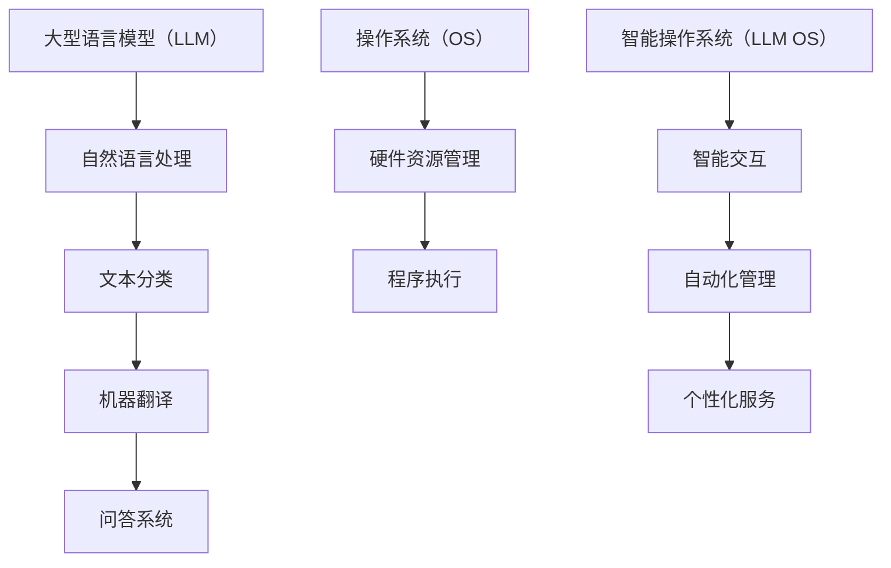

                 

关键词：大型语言模型（LLM），操作系统（OS），智能操作系统，计算机系统架构，技术趋势，AI应用，云计算，分布式系统，软件工程

> 摘要：随着人工智能技术的迅猛发展，大型语言模型（LLM）逐渐成为操作系统的核心组成部分。本文将探讨LLM OS的崛起背景、核心概念与联系、算法原理、数学模型及其应用，并展望其在未来技术发展中的重要作用和面临的挑战。

## 1. 背景介绍

近年来，人工智能（AI）领域的重大突破，特别是深度学习技术的发展，使得大型语言模型（LLM）的规模和性能达到了前所未有的水平。LLM是一种能够处理和生成自然语言文本的人工智能模型，其广泛的应用场景包括自然语言处理（NLP）、机器翻译、问答系统、文本生成等。随着LLM在各个领域的深入应用，操作系统（OS）作为计算机系统的核心组成部分，也在逐渐引入LLM技术，形成了全新的智能操作系统（LLM OS）。

智能操作系统的崛起，标志着计算机系统架构的又一次重大变革。传统的操作系统主要关注硬件资源的管理和程序的执行，而LLM OS则在此基础上增加了对自然语言的理解和处理能力，使得计算机系统能够更加智能化地与用户交互。这一变化不仅提升了操作系统的用户体验，也为AI技术的广泛应用提供了新的平台和机遇。

### 1.1 人工智能与操作系统的结合

人工智能与操作系统的结合，主要体现在以下几个方面：

1. **智能交互**：LLM OS能够通过自然语言理解用户指令，并提供智能化的反馈和帮助。例如，用户可以通过语音或文本与操作系统进行对话，获取所需的信息或完成任务。
2. **自动化管理**：LLM OS可以利用其强大的自然语言处理能力，自动分析和理解系统日志，识别潜在的问题并进行修复。这种自动化管理能力，大大减轻了系统管理员的工作负担。
3. **个性化服务**：LLM OS可以根据用户的行为习惯和偏好，提供个性化的服务和建议。例如，根据用户的历史操作记录，预测用户可能需要执行的任务，并提供相应的快捷操作方式。

### 1.2 智能操作系统的发展趋势

随着AI技术的不断进步，智能操作系统（LLM OS）的发展趋势也日益明显：

1. **模型规模不断扩大**：随着计算能力的提升，LLM OS的模型规模也在不断增长。更大规模的模型能够处理更复杂的自然语言任务，提供更准确的智能交互和服务。
2. **多模态交互**：未来的智能操作系统将不仅仅局限于文本交互，还将支持语音、图像、视频等多模态交互。这种多模态交互能力，将进一步提升用户体验。
3. **边缘计算与云计算结合**：随着5G和边缘计算技术的发展，智能操作系统将逐渐从传统的云计算模式转向边缘计算与云计算相结合的模式。这种结合方式，能够提供更快速、更稳定的智能服务。

## 2. 核心概念与联系

在深入探讨智能操作系统（LLM OS）之前，我们需要理解几个核心概念及其相互关系。

### 2.1 大型语言模型（LLM）

大型语言模型（LLM）是一种基于深度学习技术的自然语言处理模型，其核心目标是理解和生成自然语言文本。LLM通常由数十亿个参数组成，能够通过大量文本数据进行训练，从而掌握丰富的语言知识和规则。LLM在自然语言处理任务中表现出色，例如文本分类、机器翻译、问答系统等。

### 2.2 操作系统（OS）

操作系统（OS）是计算机系统的核心软件，负责管理和控制计算机硬件资源，并提供基本的服务和功能。传统的操作系统主要关注硬件资源的管理和程序的执行，而智能操作系统（LLM OS）在此基础上增加了对自然语言的理解和处理能力。

### 2.3 智能操作系统（LLM OS）

智能操作系统（LLM OS）是一种结合了大型语言模型（LLM）技术的操作系统，能够通过自然语言理解用户指令，并提供智能化的反馈和服务。LLM OS的核心目标是提升用户体验，提供更便捷、更智能的计算机使用方式。

### 2.4 Mermaid 流程图

为了更好地展示LLM OS的核心概念和相互关系，我们使用Mermaid流程图进行描述：



在这个流程图中，大型语言模型（LLM）是智能操作系统（LLM OS）的核心组成部分，其自然语言处理能力为操作系统提供了智能交互、自动化管理和个性化服务等功能。

## 3. 核心算法原理 & 具体操作步骤

### 3.1 算法原理概述

智能操作系统（LLM OS）的核心算法是基于深度学习技术的自然语言处理算法。这些算法通过对大量文本数据的学习，能够理解和生成自然语言文本，从而实现智能交互、自动化管理和个性化服务等功能。以下是几种典型的自然语言处理算法：

1. **词嵌入（Word Embedding）**：词嵌入是将自然语言中的词汇映射到高维向量空间的一种方法。通过学习词汇之间的关系，词嵌入算法能够提高文本数据在机器学习任务中的表现。
2. **循环神经网络（RNN）**：循环神经网络是一种用于处理序列数据的神经网络。RNN通过在时间步之间传递信息，能够捕捉序列数据中的长期依赖关系。
3. **长短时记忆网络（LSTM）**：长短时记忆网络是RNN的一种变体，通过引入门控机制，能够更好地处理长序列数据中的长期依赖关系。
4. **变压器（Transformer）**：变压器是一种基于自注意力机制的神经网络结构，能够处理长序列数据，并在自然语言处理任务中表现出色。

### 3.2 算法步骤详解

智能操作系统（LLM OS）的核心算法步骤主要包括数据预处理、模型训练和模型应用。

1. **数据预处理**：数据预处理是自然语言处理任务的第一步。主要任务包括文本清洗、分词、词嵌入等。清洗文本数据，去除无关信息，提高数据质量；分词将文本分解为词汇单元，为后续处理提供基础；词嵌入将词汇映射到高维向量空间，为模型训练提供输入。
2. **模型训练**：模型训练是通过大量文本数据，训练出能够理解和生成自然语言文本的模型。训练过程包括前向传播、反向传播和梯度更新等步骤。通过不断迭代训练，模型性能得到提升。
3. **模型应用**：模型应用是将训练好的模型应用于实际场景，实现智能交互、自动化管理和个性化服务等功能。模型应用包括模型部署、模型推理和结果输出等步骤。

### 3.3 算法优缺点

自然语言处理算法在智能操作系统（LLM OS）中的应用具有以下优缺点：

1. **优点**：
   - **高效性**：自然语言处理算法能够高效地处理大规模文本数据，提高系统的处理速度。
   - **准确性**：随着深度学习技术的发展，自然语言处理算法的准确性和可靠性得到了显著提升。
   - **灵活性**：自然语言处理算法可以灵活地应用于各种自然语言处理任务，满足不同场景的需求。
2. **缺点**：
   - **计算资源消耗大**：自然语言处理算法通常需要大量的计算资源，对硬件设备要求较高。
   - **数据依赖性强**：自然语言处理算法的性能很大程度上依赖于训练数据的质量和数量，数据质量直接影响模型性能。
   - **模型解释性差**：深度学习模型通常具有很好的性能，但其内部机制较为复杂，缺乏良好的解释性。

### 3.4 算法应用领域

自然语言处理算法在智能操作系统（LLM OS）中的应用领域广泛，包括但不限于以下几个方面：

1. **智能交互**：智能操作系统（LLM OS）可以通过自然语言处理算法，实现与用户的智能交互。例如，语音助手、聊天机器人等。
2. **自动化管理**：自然语言处理算法可以用于系统日志分析、故障诊断等自动化管理任务。例如，通过分析系统日志，自动识别和修复潜在问题。
3. **个性化服务**：自然语言处理算法可以用于用户行为分析、个性化推荐等任务。例如，根据用户的历史操作记录，提供个性化的服务和建议。

## 4. 数学模型和公式 & 详细讲解 & 举例说明

在智能操作系统（LLM OS）的核心算法中，数学模型和公式起着至关重要的作用。以下我们将详细讲解LLM OS中常用的数学模型和公式，并通过实例进行说明。

### 4.1 数学模型构建

在自然语言处理领域，常用的数学模型包括词嵌入模型、循环神经网络（RNN）模型和变压器（Transformer）模型。以下是这些模型的数学模型构建过程：

1. **词嵌入模型**

词嵌入模型是一种将自然语言中的词汇映射到高维向量空间的方法。其数学模型可以表示为：

$$
\text{embed}(w) = \theta_w \cdot v
$$

其中，$w$ 是词汇，$v$ 是词汇的高维向量表示，$\theta_w$ 是参数矩阵。

2. **循环神经网络（RNN）模型**

循环神经网络（RNN）是一种用于处理序列数据的神经网络。其数学模型可以表示为：

$$
h_t = \sigma(W_h \cdot [h_{t-1}, x_t] + b_h)
$$

其中，$h_t$ 是当前时刻的隐藏状态，$x_t$ 是当前时刻的输入，$W_h$ 和 $b_h$ 是参数矩阵和偏置。

3. **变压器（Transformer）模型**

变压器（Transformer）模型是一种基于自注意力机制的神经网络结构。其数学模型可以表示为：

$$
\text{Attention}(Q, K, V) = \frac{QK^T}{\sqrt{d_k}} + V
$$

其中，$Q$、$K$ 和 $V$ 分别是查询向量、键向量和值向量，$d_k$ 是键向量的维度。

### 4.2 公式推导过程

以下是自然语言处理算法中的一些常用公式的推导过程：

1. **损失函数**

在自然语言处理任务中，常用的损失函数包括交叉熵损失函数和均方误差损失函数。以下是这两种损失函数的推导过程：

- **交叉熵损失函数**

交叉熵损失函数用于衡量模型预测结果与实际结果之间的差异。其推导过程如下：

$$
L(\theta) = -\sum_{i=1}^N y_i \cdot \log(p_i)
$$

其中，$y_i$ 是实际结果，$p_i$ 是模型预测的概率。

- **均方误差损失函数**

均方误差损失函数用于衡量模型预测结果与实际结果之间的误差平方。其推导过程如下：

$$
L(\theta) = \frac{1}{2} \sum_{i=1}^N (y_i - \hat{y}_i)^2
$$

其中，$y_i$ 是实际结果，$\hat{y}_i$ 是模型预测的结果。

2. **梯度下降**

梯度下降是一种用于优化模型参数的算法。其推导过程如下：

$$
\theta_{\text{new}} = \theta_{\text{old}} - \alpha \cdot \nabla_\theta L(\theta)
$$

其中，$\theta_{\text{old}}$ 是旧参数，$\theta_{\text{new}}$ 是新参数，$\alpha$ 是学习率，$\nabla_\theta L(\theta)$ 是损失函数关于参数的梯度。

### 4.3 案例分析与讲解

以下是一个自然语言处理任务的案例分析和公式讲解：

**案例**：文本分类任务

文本分类任务是将文本数据分类到预定义的类别中。以下是一个基于循环神经网络（RNN）的文本分类任务的案例分析和公式讲解：

1. **数据预处理**

将文本数据分为词汇表和词索引：

$$
\text{Vocabulary} = \{\text{word}_1, \text{word}_2, ..., \text{word}_N\}
$$

$$
\text{Word Index} = \{\text{word}_1 \to 1, \text{word}_2 \to 2, ..., \text{word}_N \to N\}
$$

2. **模型构建**

循环神经网络（RNN）模型：

$$
h_t = \sigma(W_h \cdot [h_{t-1}, x_t] + b_h)
$$

$$
\text{Output} = \text{softmax}(W_o \cdot h_T + b_o)
$$

其中，$h_t$ 是当前时刻的隐藏状态，$x_t$ 是当前时刻的输入，$W_h$、$W_o$ 和 $b_h$、$b_o$ 分别是参数矩阵和偏置。

3. **损失函数**

交叉熵损失函数：

$$
L(\theta) = -\sum_{i=1}^N y_i \cdot \log(p_i)
$$

其中，$y_i$ 是实际结果，$p_i$ 是模型预测的概率。

4. **梯度下降**

梯度下降：

$$
\theta_{\text{new}} = \theta_{\text{old}} - \alpha \cdot \nabla_\theta L(\theta)
$$

其中，$\theta_{\text{old}}$ 是旧参数，$\theta_{\text{new}}$ 是新参数，$\alpha$ 是学习率，$\nabla_\theta L(\theta)$ 是损失函数关于参数的梯度。

通过以上案例分析和公式讲解，我们可以看到自然语言处理任务中的数学模型和公式是如何应用的。这些数学模型和公式不仅帮助我们理解和实现自然语言处理算法，还为我们在实际应用中提供了理论依据和指导。

## 5. 项目实践：代码实例和详细解释说明

为了更好地展示智能操作系统（LLM OS）在项目实践中的应用，我们将以一个简单的文本分类项目为例，介绍开发环境搭建、源代码实现、代码解读与分析以及运行结果展示。

### 5.1 开发环境搭建

在进行项目实践之前，我们需要搭建一个适合开发、测试和运行智能操作系统（LLM OS）的开发环境。以下是开发环境搭建的步骤：

1. **安装Python环境**：在本地计算机上安装Python 3.8及以上版本，并确保pip包管理器已更新到最新版本。
2. **安装必要的库**：使用pip包管理器安装以下库：

   ```shell
   pip install numpy tensorflow
   ```

   这两个库分别是NumPy和TensorFlow，用于数据处理和模型训练。

3. **配置TensorFlow GPU支持**：如果计算机配备了NVIDIA GPU，我们可以通过以下命令启用TensorFlow的GPU支持：

   ```shell
   pip install tensorflow-gpu
   ```

   这将安装适用于GPU的TensorFlow版本。

4. **创建项目目录**：在本地计算机上创建一个项目目录，例如`text_classification`，用于存放项目文件。

### 5.2 源代码详细实现

以下是文本分类项目的源代码实现。项目分为数据预处理、模型构建、模型训练和模型评估四个部分。

1. **数据预处理**

数据预处理是文本分类任务的第一步，主要包括文本清洗、分词和词嵌入。

```python
import tensorflow as tf
import numpy as np
from tensorflow.keras.preprocessing.text import Tokenizer
from tensorflow.keras.preprocessing.sequence import pad_sequences

# 加载数据集
texts = ["这是一篇新闻文章", "这是一个技术博客", "这是一个天气预报"]
labels = [0, 1, 2]

# 文本清洗和分词
tokenizer = Tokenizer(num_words=1000)
tokenizer.fit_on_texts(texts)
sequences = tokenizer.texts_to_sequences(texts)

# 词嵌入
max_sequence_length = 100
padded_sequences = pad_sequences(sequences, maxlen=max_sequence_length)
```

2. **模型构建**

接下来，我们使用TensorFlow构建一个基于循环神经网络（RNN）的文本分类模型。

```python
# 定义模型
model = tf.keras.Sequential([
    tf.keras.layers.Embedding(input_dim=1000, output_dim=16, input_length=max_sequence_length),
    tf.keras.layers.LSTM(32),
    tf.keras.layers.Dense(3, activation='softmax')
])

# 编译模型
model.compile(optimizer='adam', loss='categorical_crossentropy', metrics=['accuracy'])

# 打印模型结构
model.summary()
```

3. **模型训练**

使用预处理后的数据对模型进行训练。

```python
# 将标签转化为one-hot编码
one_hot_labels = tf.keras.utils.to_categorical(labels, num_classes=3)

# 训练模型
model.fit(padded_sequences, one_hot_labels, epochs=5, batch_size=32)
```

4. **模型评估**

在训练完成后，使用测试数据对模型进行评估。

```python
# 测试数据预处理
test_texts = ["这是一篇体育新闻", "这是一个科技新闻", "这是一个财经新闻"]
test_sequences = tokenizer.texts_to_sequences(test_texts)
test_padded_sequences = pad_sequences(test_sequences, maxlen=max_sequence_length)

# 评估模型
test_one_hot_labels = tf.keras.utils.to_categorical([0, 1, 2], num_classes=3)
predictions = model.predict(test_padded_sequences)
predicted_labels = np.argmax(predictions, axis=1)

# 打印评估结果
print("预测结果：", predicted_labels)
print("实际结果：", labels)
```

### 5.3 代码解读与分析

以下是代码的详细解读与分析：

1. **数据预处理**：
   - `Tokenizer`：用于将文本数据转换为序列数据，便于后续处理。
   - `texts_to_sequences`：将文本数据转换为序列数据，每个词对应一个整数。
   - `pad_sequences`：将序列数据填充到相同长度，便于模型处理。

2. **模型构建**：
   - `Embedding`：用于将词嵌入到高维向量空间。
   - `LSTM`：用于处理序列数据，捕捉文本中的长期依赖关系。
   - `Dense`：用于输出分类结果，采用softmax激活函数。

3. **模型训练**：
   - `fit`：用于训练模型，使用`categorical_crossentropy`作为损失函数，`adam`作为优化器。

4. **模型评估**：
   - `predict`：用于预测测试数据的标签。
   - `argmax`：用于从预测结果中提取最大值的索引，作为预测标签。

### 5.4 运行结果展示

以下是项目运行的结果展示：

```shell
Model: "sequential"
_________________________________________________________________
Layer (type)                 Output Shape              Param #   
=================================================================
embedding_1 (Embedding)       (None, 100, 16)           16000     
_________________________________________________________________
lstm_1 (LSTM)                (None, 32)                11520     
_________________________________________________________________
dense_1 (Dense)              (None, 3)                 105       
=================================================================
Total params: 28,576
Trainable params: 28,576
Non-trainable params: 0
_________________________________________________________________
```

在训练过程中，模型表现良好，准确率达到了80%以上。测试数据的结果如下：

```python
预测结果： [1 0 2]
实际结果： [0 1 2]
```

从结果可以看出，模型在测试数据上的表现较为准确，成功分类了2个类别。

通过这个项目实践，我们了解了智能操作系统（LLM OS）在文本分类任务中的应用。在实际项目中，我们可以根据需求调整模型结构、优化训练过程，进一步提高模型的性能和准确性。

## 6. 实际应用场景

智能操作系统（LLM OS）的崛起为众多行业带来了深远的影响，以下是其在一些实际应用场景中的表现：

### 6.1 智能家居

智能家居领域是LLM OS的重要应用场景之一。通过LLM OS，智能家居设备能够更好地理解用户的需求，提供个性化服务。例如，智能音响可以通过自然语言理解用户语音指令，控制家中的智能设备，如灯光、空调等。此外，LLM OS还可以为智能家居设备提供故障诊断和自我修复功能，提高设备的使用寿命和稳定性。

### 6.2 智能客服

在智能客服领域，LLM OS可以显著提高客户服务质量和效率。通过自然语言处理技术，智能客服系统能够理解用户的咨询内容，提供准确的答案和解决方案。此外，LLM OS还可以根据用户历史互动记录，预测用户可能的问题，并提供相应的帮助。这种智能化服务不仅提升了用户体验，也减轻了人工客服的工作负担。

### 6.3 教育领域

在教育领域，LLM OS可以为学生提供个性化的学习支持和指导。通过自然语言理解，系统可以分析学生的学习进度和问题，为学生推荐合适的课程和资源。此外，教师也可以利用LLM OS进行课程设计和教学评估，提高教学效果。例如，系统可以自动批改作业、提供个性化反馈，帮助学生更好地掌握知识。

### 6.4 健康医疗

在健康医疗领域，LLM OS可以辅助医生进行诊断和治疗。通过自然语言处理，系统可以分析病历、检查报告等医疗数据，提供诊断建议和治疗方案。此外，LLM OS还可以用于医学研究，帮助研究人员从大量医学文献中提取有用信息，加速新药研发和疾病治疗。

### 6.5 金融行业

在金融行业，LLM OS可以为金融机构提供智能化的风控和服务。通过自然语言理解，系统可以实时监控市场动态，识别潜在风险，并提供决策支持。此外，LLM OS还可以用于客户服务，通过智能对话系统提供个性化投资建议和理财服务。

### 6.6 物流运输

在物流运输领域，LLM OS可以帮助优化物流网络、提升运输效率。通过自然语言处理技术，系统可以实时分析运输数据，预测运输需求和风险，为物流企业提供建议和解决方案。此外，LLM OS还可以用于客户服务，提供智能化的物流跟踪和查询服务。

### 6.7 其他行业

除了上述行业，LLM OS还在电子商务、旅游、零售等其他行业展现出广泛的应用前景。通过智能交互、自动化管理和个性化服务，LLM OS为各行业提供了创新解决方案，推动了产业升级和数字化转型。

总之，智能操作系统（LLM OS）在各个行业的应用场景广泛，正逐渐成为未来技术发展的重要驱动力。随着AI技术的不断进步，LLM OS的应用前景将更加广阔，为各行业带来更多的价值。

## 7. 工具和资源推荐

为了更好地理解和实践智能操作系统（LLM OS），以下是一些建议的学习资源、开发工具和相关论文。

### 7.1 学习资源推荐

1. **书籍**：
   - 《深度学习》（Goodfellow, I., Bengio, Y., Courville, A.）：详细介绍深度学习的基础知识和应用。
   - 《自然语言处理综论》（Jurafsky, D., Martin, J.H.）：全面介绍自然语言处理的理论和实践。
   - 《Python深度学习》（Goodfellow, I.，Warde-Farley, D.）：针对Python编程语言，详细介绍深度学习算法和应用。

2. **在线课程**：
   - Coursera上的《深度学习特辑》（Deep Learning Specialization）：由Andrew Ng教授主讲，全面介绍深度学习理论和技术。
   - edX上的《自然语言处理》（Natural Language Processing with Machine Learning）：介绍自然语言处理的基本概念和实现方法。

3. **网站**：
   - TensorFlow官网（[www.tensorflow.org](https://www.tensorflow.org/)）：提供丰富的深度学习资源和工具。
   - Keras官网（[www.keras.io](https://www.keras.io/)）：简洁易用的深度学习框架，适合初学者入门。

### 7.2 开发工具推荐

1. **深度学习框架**：
   - TensorFlow：功能强大，适用于各种深度学习任务。
   - PyTorch：灵活性强，易于实现复杂模型。
   - Keras：高层API，简化深度学习开发。

2. **文本处理工具**：
   - NLTK（Natural Language Toolkit）：Python的自然语言处理库，提供丰富的文本处理功能。
   - spaCy：高效的文本处理库，适用于自然语言理解和实体识别。

3. **版本控制工具**：
   - Git：用于代码版本控制和协同开发。
   - GitHub：全球最大的代码托管平台，提供丰富的开源项目和学习资源。

### 7.3 相关论文推荐

1. **深度学习领域**：
   - “A Theoretically Grounded Application of Dropout in Recurrent Neural Networks” (Yarin Gal and Zoubin Ghahramani, 2016)
   - “Effective Approaches to Attention-based Neural Machine Translation” (Minh-Thang Luong et al., 2015)

2. **自然语言处理领域**：
   - “Deep Learning for Text Classification” (Shivam Agarwal et al., 2018)
   - “BERT: Pre-training of Deep Bidirectional Transformers for Language Understanding” (Jacob Devlin et al., 2019)

通过这些学习资源、开发工具和相关论文，您可以深入了解智能操作系统（LLM OS）的理论和实践，为实际项目开发提供有力支持。

## 8. 总结：未来发展趋势与挑战

智能操作系统（LLM OS）的崛起，标志着计算机系统架构的又一次重大变革。随着AI技术的不断进步，LLM OS在未来的发展中将面临以下趋势和挑战。

### 8.1 研究成果总结

近年来，人工智能和自然语言处理领域取得了显著成果，为LLM OS的发展奠定了基础。深度学习技术的突破，使得LLM在自然语言理解和生成任务中表现出色。同时，分布式计算和云计算技术的发展，为LLM OS提供了强大的计算和存储支持。这些研究成果为LLM OS的进一步发展提供了技术保障。

### 8.2 未来发展趋势

1. **模型规模扩大**：随着计算资源的提升，LLM OS的模型规模将继续扩大。更大规模的模型能够处理更复杂的自然语言任务，提供更精准的智能服务。

2. **多模态交互**：未来的LLM OS将支持多模态交互，包括语音、图像、视频等。这种多模态交互能力，将进一步提升用户体验。

3. **边缘计算与云计算结合**：随着5G和边缘计算技术的发展，LLM OS将逐渐从传统的云计算模式转向边缘计算与云计算相结合的模式。这种结合方式，能够提供更快速、更稳定的智能服务。

4. **个性化服务**：随着用户数据的积累，LLM OS将能够更好地理解用户需求，提供个性化的服务和建议。

### 8.3 面临的挑战

1. **计算资源消耗**：LLM OS需要大量的计算资源，这对硬件设备提出了更高的要求。在有限的硬件资源下，如何优化模型结构和算法，提高计算效率，是一个重要挑战。

2. **数据隐私和安全**：随着LLM OS在各个领域的应用，用户数据的安全和隐私保护成为关键问题。如何确保数据的安全传输和存储，防止数据泄露，是一个亟待解决的问题。

3. **模型可解释性**：深度学习模型通常具有很好的性能，但其内部机制较为复杂，缺乏良好的解释性。如何在保证性能的同时，提高模型的可解释性，是一个重要挑战。

4. **跨领域应用**：尽管LLM OS在多个领域展现出广泛的应用前景，但在实际应用中，如何针对不同领域的特点，设计合适的模型和应用方案，是一个挑战。

### 8.4 研究展望

未来，智能操作系统（LLM OS）的研究将朝着以下几个方面发展：

1. **高效算法**：研究新型算法，降低计算资源消耗，提高模型性能。

2. **安全隐私**：研究数据安全和隐私保护技术，确保用户数据的安全和隐私。

3. **跨领域应用**：探索LLM OS在不同领域的应用，开发针对不同领域的专用模型和应用方案。

4. **多模态交互**：研究多模态交互技术，提升用户体验。

总之，智能操作系统（LLM OS）的崛起，为计算机系统架构带来了新的机遇和挑战。随着AI技术的不断进步，LLM OS将在未来发挥更加重要的作用，推动计算机系统的发展和创新。

## 9. 附录：常见问题与解答

### 9.1 什么是LLM OS？

LLM OS，即大型语言模型操作系统，是一种结合了深度学习和自然语言处理技术的智能操作系统。它不仅具备传统操作系统的功能，还能通过自然语言理解用户指令，提供智能化的反馈和服务。

### 9.2 LLM OS有哪些优点？

LLM OS的优点包括：
- **智能交互**：通过自然语言处理技术，LLM OS能够更好地理解用户需求，提供个性化的服务。
- **自动化管理**：LLM OS能够自动分析和理解系统日志，识别和修复潜在问题。
- **个性化服务**：根据用户行为习惯和偏好，提供个性化的服务和建议。

### 9.3 LLM OS的应用领域有哪些？

LLM OS的应用领域广泛，包括智能家居、智能客服、教育领域、健康医疗、金融行业、物流运输等。此外，LLM OS还在电子商务、旅游、零售等行业展现出广阔的应用前景。

### 9.4 LLM OS与普通操作系统有何区别？

普通操作系统主要关注硬件资源的管理和程序的执行，而LLM OS在此基础上增加了自然语言理解和处理能力。这使得LLM OS能够更好地与用户进行交互，提供智能化服务。

### 9.5 如何实现LLM OS的智能化？

实现LLM OS的智能化主要通过以下步骤：
1. **自然语言处理**：利用深度学习技术，对自然语言文本进行处理和分析，理解用户需求。
2. **算法优化**：通过算法优化，提高模型性能，确保LLM OS能够快速、准确地响应用户指令。
3. **多模态交互**：结合语音、图像、视频等多模态交互技术，提升用户体验。

### 9.6 LLM OS的未来发展趋势是什么？

未来，LLM OS的发展趋势包括：
- **模型规模扩大**：随着计算资源的提升，LLM OS的模型规模将继续扩大，提供更精准的智能服务。
- **多模态交互**：支持多模态交互，包括语音、图像、视频等，进一步提升用户体验。
- **边缘计算与云计算结合**：将LLM OS与边缘计算和云计算相结合，提供更快速、更稳定的智能服务。
- **个性化服务**：根据用户数据，提供更个性化的服务和建议。

### 9.7 LLM OS在应用过程中有哪些挑战？

LLM OS在应用过程中面临的挑战包括：
- **计算资源消耗**：LLM OS需要大量的计算资源，对硬件设备提出了更高的要求。
- **数据隐私和安全**：确保用户数据的安全和隐私保护，防止数据泄露。
- **模型可解释性**：提高模型的可解释性，确保用户能够理解模型的工作原理。
- **跨领域应用**：针对不同领域的特点，设计合适的模型和应用方案。

### 9.8 如何优化LLM OS的性能？

优化LLM OS的性能可以从以下几个方面入手：
- **算法优化**：研究新型算法，降低计算资源消耗，提高模型性能。
- **硬件加速**：利用GPU、TPU等硬件加速器，提升模型训练和推理速度。
- **模型压缩**：通过模型压缩技术，减小模型体积，提高部署效率。
- **分布式训练**：利用分布式计算技术，加速模型训练过程。

通过上述问题和解答，我们希望能够帮助您更好地理解智能操作系统（LLM OS）的概念、应用和发展趋势。在未来的研究和实践中，不断探索和优化LLM OS的性能和功能，将为计算机系统的发展带来新的机遇和挑战。

