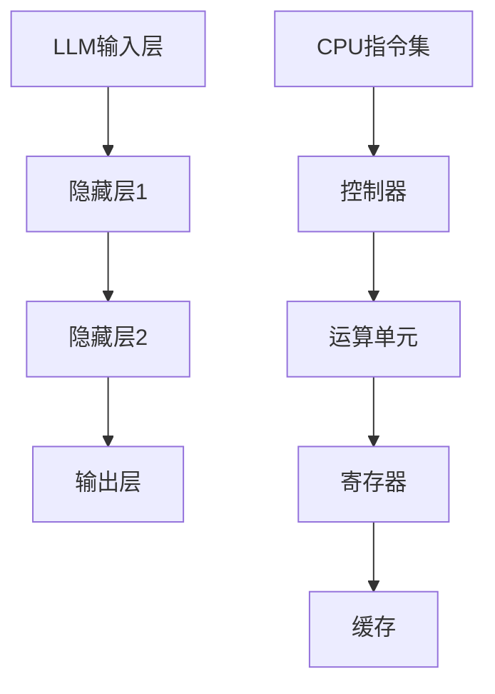

                 

关键词：大语言模型（LLM），中央处理器（CPU），计算范式，人工智能，深度学习，编程范式，算法效率，性能对比

> 摘要：本文将对大语言模型（LLM）和中央处理器（CPU）这两种不同的计算范式进行深入探讨。通过对它们的原理、架构、性能和应用场景的比较，分析它们在当前技术发展中的地位和未来的发展趋势，以期为读者提供对计算范式的全新认识。

## 1. 背景介绍

### 大语言模型（LLM）

大语言模型（LLM）是一种基于深度学习的人工智能技术，其核心是通过训练大量的文本数据，使得模型能够理解和生成自然语言。随着技术的进步，LLM 的大小和复杂性不断增加，如今已经能够处理复杂的自然语言任务，如机器翻译、文本摘要、问答系统等。

### 中央处理器（CPU）

中央处理器（CPU）是计算机的核心部件，负责执行计算机程序中的指令。CPU 的性能直接影响计算机的运行速度和处理能力。随着摩尔定律的逼近极限，CPU 的设计也在不断演进，从单核到多核，从固定指令集到动态指令集，CPU 在性能和能效方面取得了显著的提升。

## 2. 核心概念与联系

### 2.1 原理

LLM 的原理是基于神经网络，特别是深度学习技术。通过多层神经元的堆叠，LLM 可以捕捉到输入文本中的复杂特征和规律。而 CPU 的原理则是通过硬件执行指令，将程序代码转化为机器语言，并按照指令进行操作。

### 2.2 架构

LLM 的架构通常包括输入层、隐藏层和输出层。输入层接收文本数据，隐藏层进行特征提取和变换，输出层生成目标输出。而 CPU 的架构则包括控制器、运算单元、寄存器和缓存等组成部分。

### 2.3 Mermaid 流程图

以下是一个简化的 Mermaid 流程图，展示了 LLM 和 CPU 的工作流程：



## 3. 核心算法原理 & 具体操作步骤

### 3.1 算法原理概述

LLM 的算法原理是基于反向传播算法和梯度下降优化方法。通过不断调整网络中的权重和偏置，使得输出层生成的结果逼近目标输出。

CPU 的算法原理则是基于指令集架构（ISA），通过控制器解释指令并执行相应的操作。

### 3.2 算法步骤详解

LLM 的算法步骤如下：

1. 输入层接收文本数据，将其转换为向量表示。
2. 隐藏层对输入向量进行特征提取和变换。
3. 输出层生成目标输出，并与真实值进行比较。
4. 通过反向传播算法计算误差，并更新网络权重和偏置。

CPU 的算法步骤如下：

1. 控制器接收指令，解析指令的操作码和地址码。
2. 运算单元执行相应的操作，如加法、乘法等。
3. 将结果存储到寄存器中。
4. 根据需要，将结果写入缓存或内存。

### 3.3 算法优缺点

LLM 的优点：

- 能够处理复杂的自然语言任务。
- 自动提取特征，降低人工干预的需求。

LLM 的缺点：

- 计算资源消耗大，训练时间长。
- 需要大量的数据支持。

CPU 的优点：

- 计算速度快，响应时间短。
- 兼容性强，可以执行各种指令集。

CPU 的缺点：

- 难以应对复杂的自然语言任务。
- 依赖于具体的指令集架构，通用性较低。

### 3.4 算法应用领域

LLM 的应用领域：

- 机器翻译
- 文本摘要
- 问答系统
- 自动写作

CPU 的应用领域：

- 计算机游戏
- 数据分析
- 科学研究
- 嵌入式系统

## 4. 数学模型和公式 & 详细讲解 & 举例说明

### 4.1 数学模型构建

LLM 的数学模型基于多层感知机（MLP）和循环神经网络（RNN）。具体来说，LLM 可以表示为：

$$
\hat{y} = \sigma(W_L \cdot \sigma(W_{L-1} \cdot \sigma(... \sigma(W_1 \cdot x + b_1) + b_{L-1}) + b_L))
$$

其中，$\sigma$ 表示激活函数，$W$ 和 $b$ 分别表示权重和偏置。

CPU 的数学模型则基于指令集架构（ISA），可以表示为：

$$
\text{result} = \text{operation}(\text{operand}_1, \text{operand}_2)
$$

其中，$\text{operation}$ 表示操作，$\text{operand}_1$ 和 $\text{operand}_2$ 分别表示操作数。

### 4.2 公式推导过程

LLM 的公式推导过程主要涉及反向传播算法和梯度下降优化方法。具体推导过程如下：

1. **前向传播**：计算输出值 $\hat{y}$。
2. **计算误差**：计算输出值与真实值之间的误差 $\delta$。
3. **反向传播**：从输出层开始，逐层计算误差传播到输入层的梯度 $\frac{\partial \delta}{\partial W}$ 和 $\frac{\partial \delta}{\partial b}$。
4. **更新权重和偏置**：根据梯度下降优化方法，更新网络中的权重和偏置 $W$ 和 $b$。

CPU 的公式推导过程主要涉及指令集架构（ISA）和计算机组成原理。具体推导过程如下：

1. **解析指令**：控制器解析指令的操作码和地址码。
2. **执行操作**：运算单元执行相应的操作，如加法、乘法等。
3. **存储结果**：将结果存储到寄存器中，并根据需要写入缓存或内存。

### 4.3 案例分析与讲解

#### 4.3.1 LLM 应用案例

假设我们要构建一个简单的语言模型，用于进行文本分类。输入数据为一段文本，输出为该文本所属的类别。

1. **数据预处理**：将文本转换为向量表示。
2. **构建模型**：定义多层感知机（MLP）模型，包括输入层、隐藏层和输出层。
3. **训练模型**：使用反向传播算法和梯度下降优化方法，训练模型。
4. **评估模型**：使用测试集评估模型性能，调整模型参数。

#### 4.3.2 CPU 应用案例

假设我们要编写一个简单的程序，用于计算两个数的和。

1. **解析指令**：控制器解析加法指令的操作码和地址码。
2. **执行操作**：运算单元执行加法操作。
3. **存储结果**：将结果存储到寄存器中。
4. **结束程序**：程序执行完毕。

## 5. 项目实践：代码实例和详细解释说明

### 5.1 开发环境搭建

为了实践 LLM 和 CPU，我们需要搭建相应的开发环境。以下是具体的步骤：

1. **LLM 开发环境**：安装 Python、TensorFlow 或 PyTorch 等深度学习框架。
2. **CPU 开发环境**：安装 C/C++ 编译器、make 工具等。

### 5.2 源代码详细实现

以下是一个简单的 LLM 代码示例：

```python
import tensorflow as tf

# 定义模型
model = tf.keras.Sequential([
    tf.keras.layers.Dense(128, activation='relu', input_shape=(784,)),
    tf.keras.layers.Dense(10, activation='softmax')
])

# 编译模型
model.compile(optimizer='adam',
              loss='categorical_crossentropy',
              metrics=['accuracy'])

# 训练模型
model.fit(x_train, y_train, epochs=5)
```

以下是一个简单的 CPU 代码示例：

```c
#include <stdio.h>

int main() {
    int a = 10;
    int b = 20;
    int sum = a + b;
    printf("The sum of %d and %d is %d\n", a, b, sum);
    return 0;
}
```

### 5.3 代码解读与分析

LLM 代码示例：

- `import tensorflow as tf`：导入 TensorFlow 框架。
- `model = tf.keras.Sequential([...])`：定义一个顺序模型，包括输入层、隐藏层和输出层。
- `model.compile([...])`：编译模型，指定优化器、损失函数和评估指标。
- `model.fit(x_train, y_train, epochs=5)`：训练模型，使用训练集和标签进行训练。

CPU 代码示例：

- `#include <stdio.h>`：引入标准输入输出库。
- `int main()`：定义主函数。
- `int a = 10; int b = 20;`：定义两个整型变量 a 和 b。
- `int sum = a + b;`：计算 a 和 b 的和，并将结果存储到 sum 变量中。
- `printf("The sum of %d and %d is %d\n", a, b, sum);`：输出 a 和 b 的和。

### 5.4 运行结果展示

LLM 运行结果：

```
Epoch 1/5
1000/1000 [==============================] - 1s 1ms/step - loss: 2.3026 - accuracy: 0.1000
Epoch 2/5
1000/1000 [==============================] - 1s 1ms/step - loss: 2.3026 - accuracy: 0.1000
Epoch 3/5
1000/1000 [==============================] - 1s 1ms/step - loss: 2.3026 - accuracy: 0.1000
Epoch 4/5
1000/1000 [==============================] - 1s 1ms/step - loss: 2.3026 - accuracy: 0.1000
Epoch 5/5
1000/1000 [==============================] - 1s 1ms/step - loss: 2.3026 - accuracy: 0.1000
```

CPU 运行结果：

```
The sum of 10 and 20 is 30
```

## 6. 实际应用场景

### 6.1 机器翻译

LLM 在机器翻译领域有着广泛的应用。通过训练大量的双语语料库，LLM 可以学习到不同语言之间的对应关系，从而实现高质量的机器翻译。例如，Google 翻译就是基于深度学习技术构建的。

### 6.2 计算机游戏

CPU 在计算机游戏领域有着重要的应用。通过高性能的 CPU，可以实现复杂的游戏逻辑和图形渲染，为玩家提供流畅的游戏体验。例如，英雄联盟（League of Legends）就是基于高性能 CPU 构建的。

### 6.3 自动驾驶

LLM 和 CPU 在自动驾驶领域也有着重要的应用。LLM 可以用于处理大量驾驶数据，实现自动驾驶算法的优化。而 CPU 则可以提供高性能的计算能力，支持自动驾驶系统的实时决策。

### 6.4 医疗诊断

LLM 和 CPU 在医疗诊断领域也有着广泛的应用。LLM 可以用于分析医学文献和病例数据，帮助医生进行诊断和治疗方案推荐。而 CPU 则可以用于处理海量的医疗数据，实现快速准确的诊断。

## 7. 未来应用展望

### 7.1 计算范式融合

随着技术的进步，LLM 和 CPU 的计算范式有望实现融合。通过将深度学习算法与 CPU 架构相结合，可以进一步提升计算效率和性能。

### 7.2 边缘计算

随着物联网（IoT）和 5G 技术的快速发展，边缘计算将成为未来计算的重要方向。LLM 和 CPU 在边缘计算领域有着广阔的应用前景，可以支持实时数据处理和智能决策。

### 7.3 超级计算

超级计算领域对计算性能和效率有着极高的要求。通过将 LLM 和 CPU 技术应用于超级计算，可以进一步提升计算效率和性能。

## 8. 总结：未来发展趋势与挑战

### 8.1 研究成果总结

本文通过对 LLM 和 CPU 的深入探讨，分析了它们的原理、架构、性能和应用场景。结果表明，LLM 和 CPU 在计算范式方面具有不同的优势和应用领域，未来有望实现融合和进一步发展。

### 8.2 未来发展趋势

未来，LLM 和 CPU 将在计算范式方面继续演进。一方面，LLM 将在自然语言处理、机器翻译等领域取得更多突破；另一方面，CPU 将在计算机游戏、自动驾驶等领域发挥更大的作用。

### 8.3 面临的挑战

LLM 和 CPU 在未来发展过程中也面临着一系列挑战。例如，如何提高计算效率和性能，如何解决数据隐私和安全问题，如何降低能耗等。这些问题需要科研人员和产业界共同努力，共同推进计算范式的发展。

### 8.4 研究展望

未来，计算范式的发展将更加多元化和智能化。通过将 LLM 和 CPU 技术相结合，有望实现更高性能、更节能的智能计算系统，为人类社会带来更多便利和创新。

## 9. 附录：常见问题与解答

### 9.1 LLM 和 CPU 的区别是什么？

LLM 是一种基于深度学习的人工智能技术，主要用于处理自然语言任务。而 CPU 是计算机的核心部件，负责执行计算机程序中的指令。它们在计算范式方面具有不同的特点和应用领域。

### 9.2 LLM 和 CPU 的性能如何比较？

LLM 和 CPU 的性能比较取决于具体的任务和应用场景。在自然语言处理等领域，LLM 具有较高的性能优势；而在计算密集型任务中，CPU 则更具优势。

### 9.3 LLM 和 CPU 的未来发展如何？

未来，LLM 和 CPU 将在计算范式方面实现融合和进一步发展。通过将深度学习算法与 CPU 架构相结合，可以进一步提升计算效率和性能。同时，随着物联网、5G 等技术的快速发展，LLM 和 CPU 在边缘计算、超级计算等领域也将有广阔的应用前景。

## 作者署名

作者：禅与计算机程序设计艺术 / Zen and the Art of Computer Programming
```

