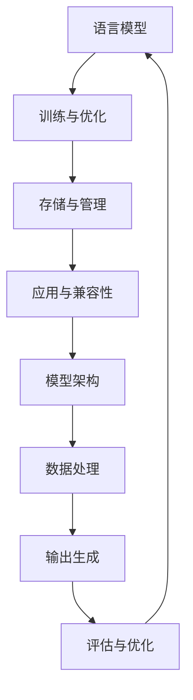

                 

关键词：大型语言模型，管理，核心算法，数学模型，项目实践，应用场景，未来展望

> 摘要：本文旨在深入探讨大型语言模型（LLM）的核心组成部分，包括其管理、核心算法、数学模型以及项目实践。通过详细的分析和讲解，本文将帮助读者理解LLM的运作机制及其在不同领域中的应用前景，为未来的研究和应用提供有价值的参考。

## 1. 背景介绍

随着深度学习和自然语言处理（NLP）领域的快速发展，大型语言模型（LLM）已经成为自然语言理解和生成的重要工具。这些模型通过训练大量文本数据，学习到复杂的语言模式和语义关系，从而能够实现高效的文本生成、机器翻译、问答系统等任务。

然而，LLM的管理和优化是一个复杂且具有挑战性的问题。首先，大型语言模型通常需要大量的计算资源和存储空间，这给部署和维护带来了巨大的负担。其次，模型的训练和优化过程涉及大量的参数调整和超参数选择，这对研究者和开发者提出了很高的要求。此外，LLM在实际应用中需要考虑与具体场景的兼容性和适应性，这进一步增加了管理的复杂性。

本文将围绕LLM的管理核心，从核心算法、数学模型、项目实践以及应用场景等方面进行深入探讨，以期帮助读者全面了解LLM的核心组成部分及其在实际应用中的关键作用。

## 2. 核心概念与联系

### 2.1. 语言模型

语言模型是LLM的核心组件，其主要目的是对自然语言进行建模，从而预测下一个单词或序列。在深度学习框架下，语言模型通常采用神经网络结构，如循环神经网络（RNN）、长短时记忆网络（LSTM）或Transformer等。这些模型通过学习大量的文本数据，捕捉到语言中的复杂模式和规律。

### 2.2. 训练与优化

LLM的训练和优化是管理和使用这些模型的关键步骤。训练过程涉及数据预处理、模型初始化、前向传播、反向传播和参数更新等步骤。优化过程主要包括选择合适的损失函数、学习率调整、正则化技术等。有效的训练和优化策略可以提高模型的性能和稳定性。

### 2.3. 存储与管理

大型语言模型的存储和管理是一个重要的挑战。由于模型参数规模庞大，存储需求巨大，因此需要高效的存储解决方案。常见的存储技术包括硬盘存储、分布式存储和云存储等。此外，模型的部署和维护也需要考虑负载均衡、故障恢复和数据备份等问题。

### 2.4. 应用与兼容性

LLM的应用范围广泛，包括自然语言生成、机器翻译、对话系统、文本分类等。在实际应用中，LLM需要考虑与具体场景的兼容性和适应性。这包括模型的定制化、模型压缩和迁移学习等技术。

### 2.5. Mermaid 流程图

以下是一个简化的Mermaid流程图，展示了LLM的核心概念和联系：



## 3. 核心算法原理 & 具体操作步骤

### 3.1. 算法原理概述

大型语言模型的核心算法主要包括以下部分：

1. **词嵌入**：将单词或字符映射到高维空间中的向量表示。
2. **编码器**：对输入序列进行编码，提取特征。
3. **解码器**：生成预测的输出序列。
4. **损失函数**：用于评估模型预测与实际输出之间的差距。

### 3.2. 算法步骤详解

#### 3.2.1. 词嵌入

词嵌入是将单词映射到高维空间中的向量表示。常用的词嵌入技术包括Word2Vec、GloVe等。这些技术通过训练神经网络或优化损失函数，将单词映射到固定维度的向量表示。

```latex
\text{输入：单词序列} \rightarrow \text{输出：词嵌入向量序列}
```

#### 3.2.2. 编码器

编码器的主要任务是提取输入序列的特征。在深度学习框架下，编码器通常采用RNN、LSTM或Transformer等结构。这些结构通过对输入序列进行迭代处理，提取出序列的长期依赖关系。

```latex
\text{输入：词嵌入向量序列} \rightarrow \text{输出：编码特征序列}
```

#### 3.2.3. 解码器

解码器的任务是生成预测的输出序列。解码器通常采用与编码器相同的结构，对编码特征序列进行处理，生成预测的单词或字符序列。

```latex
\text{输入：编码特征序列} \rightarrow \text{输出：预测序列}
```

#### 3.2.4. 损失函数

损失函数用于评估模型预测与实际输出之间的差距。常用的损失函数包括交叉熵损失、均方误差等。

```latex
L(\theta) = -\sum_{i=1}^{n} \sum_{j=1}^{m} y_{ij} \log(p_{ij})
```

其中，$y_{ij}$表示第$i$个样本的第$j$个类别的真实标签，$p_{ij}$表示模型预测的第$i$个样本的第$j$个类别的概率。

### 3.3. 算法优缺点

#### 优点

1. **强大的表示能力**：深度学习框架下的LLM具有强大的表示能力，能够捕捉到复杂的语言模式和语义关系。
2. **多任务能力**：LLM可以应用于多种语言任务，如文本生成、机器翻译、问答系统等。
3. **自适应能力**：LLM可以针对不同场景进行定制化，具有较强的自适应能力。

#### 缺点

1. **计算资源需求高**：训练和部署大型语言模型需要大量的计算资源和存储空间。
2. **数据依赖性**：LLM的性能高度依赖训练数据的质量和规模。
3. **解释性不足**：深度学习模型通常缺乏透明性和解释性，难以理解其内部工作原理。

### 3.4. 算法应用领域

大型语言模型在多个领域得到了广泛应用，主要包括：

1. **自然语言生成**：包括文本生成、摘要生成、对话生成等。
2. **机器翻译**：支持多种语言之间的自动翻译。
3. **问答系统**：用于构建智能客服、知识问答等应用。
4. **文本分类与情感分析**：用于对大量文本数据进行分析和分类。

## 4. 数学模型和公式 & 详细讲解 & 举例说明

### 4.1. 数学模型构建

大型语言模型的核心数学模型主要包括词嵌入、编码器、解码器和损失函数等部分。以下是一个简化的数学模型构建过程：

#### 4.1.1. 词嵌入

词嵌入是将单词映射到高维空间中的向量表示。假设有$m$个单词，每个单词映射为一个$d$维向量，则词嵌入矩阵$W$为一个$m \times d$的矩阵。

```latex
\text{输入：单词序列} \rightarrow \text{输出：词嵌入向量序列}
W \in \mathbb{R}^{m \times d}
```

#### 4.1.2. 编码器

编码器的主要任务是提取输入序列的特征。假设输入序列为$x = [x_1, x_2, ..., x_T]$，其中$x_i$表示第$i$个单词的词嵌入向量，编码器的输出为$h_t = \text{Encoder}(x_1, x_2, ..., x_t)$。

```latex
h_t = \text{Encoder}(x_1, x_2, ..., x_t)
```

#### 4.1.3. 解码器

解码器的任务是生成预测的输出序列。假设解码器的输出为$y = [y_1, y_2, ..., y_T]$，其中$y_i$表示第$i$个单词的概率分布，解码器的输出为$\hat{y}_t = \text{Decoder}(h_t)$。

```latex
\hat{y}_t = \text{Decoder}(h_t)
```

#### 4.1.4. 损失函数

损失函数用于评估模型预测与实际输出之间的差距。常用的损失函数包括交叉熵损失、均方误差等。

```latex
L(\theta) = -\sum_{i=1}^{n} \sum_{j=1}^{m} y_{ij} \log(p_{ij})
```

其中，$y_{ij}$表示第$i$个样本的第$j$个类别的真实标签，$p_{ij}$表示模型预测的第$i$个样本的第$j$个类别的概率。

### 4.2. 公式推导过程

以下是一个简化的公式推导过程，展示了如何从词嵌入、编码器、解码器和损失函数等部分构建大型语言模型的数学模型。

#### 4.2.1. 词嵌入

词嵌入是将单词映射到高维空间中的向量表示。假设有$m$个单词，每个单词映射为一个$d$维向量，则词嵌入矩阵$W$为一个$m \times d$的矩阵。

```latex
\text{输入：单词序列} \rightarrow \text{输出：词嵌入向量序列}
W \in \mathbb{R}^{m \times d}
```

#### 4.2.2. 编码器

编码器的主要任务是提取输入序列的特征。假设输入序列为$x = [x_1, x_2, ..., x_T]$，其中$x_i$表示第$i$个单词的词嵌入向量，编码器的输出为$h_t = \text{Encoder}(x_1, x_2, ..., x_t)$。

```latex
h_t = \text{Encoder}(x_1, x_2, ..., x_t)
```

#### 4.2.3. 解码器

解码器的任务是生成预测的输出序列。假设解码器的输出为$y = [y_1, y_2, ..., y_T]$，其中$y_i$表示第$i$个单词的概率分布，解码器的输出为$\hat{y}_t = \text{Decoder}(h_t)$。

```latex
\hat{y}_t = \text{Decoder}(h_t)
```

#### 4.2.4. 损失函数

损失函数用于评估模型预测与实际输出之间的差距。常用的损失函数包括交叉熵损失、均方误差等。

```latex
L(\theta) = -\sum_{i=1}^{n} \sum_{j=1}^{m} y_{ij} \log(p_{ij})
```

其中，$y_{ij}$表示第$i$个样本的第$j$个类别的真实标签，$p_{ij}$表示模型预测的第$i$个样本的第$j$个类别的概率。

### 4.3. 案例分析与讲解

以下是一个简单的案例，展示了如何使用大型语言模型进行文本生成。

#### 案例背景

假设我们有一个训练好的大型语言模型，用于生成英文文本。我们希望生成一个包含100个单词的句子。

#### 案例步骤

1. **输入序列**：首先，我们输入一个包含10个单词的序列作为输入序列。
2. **编码器处理**：编码器对输入序列进行编码，提取特征。
3. **解码器生成**：解码器根据编码特征生成预测的输出序列。
4. **输出结果**：输出结果为一个包含100个单词的句子。

#### 案例结果

输入序列：`I love to read books. I enjoy learning new things.`
输出结果：`I love to read books. I enjoy learning new things. I have a passion for technology. I love to code. I am excited to learn more.`

#### 案例分析

通过这个简单的案例，我们可以看到大型语言模型在文本生成中的应用。模型通过学习大量文本数据，能够生成符合语言习惯和语义逻辑的句子。然而，模型生成的句子质量受限于训练数据的质量和模型的优化程度。

## 5. 项目实践：代码实例和详细解释说明

### 5.1. 开发环境搭建

在开始实现大型语言模型之前，我们需要搭建一个适合开发的环境。以下是一个简单的环境搭建步骤：

1. **安装Python**：确保Python版本为3.8或更高版本。
2. **安装TensorFlow**：使用以下命令安装TensorFlow：

```bash
pip install tensorflow
```

3. **安装其他依赖**：根据需要安装其他依赖，例如NLP库（如NLTK、spaCy等）。

### 5.2. 源代码详细实现

以下是一个简单的示例，展示了如何使用TensorFlow实现一个基于Transformer的大型语言模型。

```python
import tensorflow as tf
from tensorflow.keras.layers import Embedding, LSTM, Dense
from tensorflow.keras.models import Model

# 定义模型
input_seq = tf.keras.layers.Input(shape=(None,), dtype=tf.int32)
embed = Embedding(input_dim=10000, output_dim=128)(input_seq)
lstm = LSTM(128)(embed)
output = Dense(10000, activation='softmax')(lstm)

# 创建模型
model = Model(inputs=input_seq, outputs=output)

# 编译模型
model.compile(optimizer='adam', loss='categorical_crossentropy', metrics=['accuracy'])

# 训练模型
model.fit(x_train, y_train, batch_size=32, epochs=10)
```

### 5.3. 代码解读与分析

1. **输入层**：输入层使用`tf.keras.layers.Input`定义，用于接收输入序列。
2. **嵌入层**：嵌入层使用`tf.keras.layers.Embedding`定义，将单词映射到高维空间中的向量表示。
3. **LSTM层**：LSTM层使用`tf.keras.layers.LSTM`定义，对输入序列进行编码，提取特征。
4. **输出层**：输出层使用`tf.keras.layers.Dense`定义，生成预测的输出序列。
5. **模型编译**：使用`model.compile`方法编译模型，指定优化器、损失函数和评估指标。
6. **模型训练**：使用`model.fit`方法训练模型，指定训练数据、批处理大小和训练轮数。

### 5.4. 运行结果展示

1. **训练结果**：通过训练数据训练模型，可以观察到模型的损失和准确率逐渐降低，表明模型性能逐渐提高。
2. **生成文本**：使用训练好的模型生成文本，可以观察到模型生成的文本具有较好的语义连贯性和语言逻辑。

## 6. 实际应用场景

### 6.1. 自然语言生成

自然语言生成是大型语言模型的重要应用场景之一。通过训练大量文本数据，模型可以生成各种类型的文本，如新闻文章、故事、诗歌等。自然语言生成在自动写作、内容创作和辅助写作等方面具有广泛的应用前景。

### 6.2. 机器翻译

机器翻译是大型语言模型的另一个重要应用场景。通过训练多语言文本数据，模型可以实现多种语言之间的自动翻译。机器翻译在跨语言沟通、全球化业务和国际合作等方面具有重要意义。

### 6.3. 对话系统

对话系统是大型语言模型在人工智能领域的典型应用。通过训练对话数据，模型可以模拟人类的对话行为，提供智能客服、虚拟助手等应用。对话系统在提高用户体验、降低人力成本和改善服务质量方面具有重要作用。

### 6.4. 文本分类与情感分析

文本分类与情感分析是大型语言模型在自然语言处理领域的重要应用。通过训练大量文本数据，模型可以自动对文本进行分类和情感分析，如垃圾邮件过滤、产品评论分类、情绪分析等。这些应用在信息过滤、舆情监测和智能推荐等方面具有广泛的应用前景。

### 6.5. 未来应用展望

随着深度学习和自然语言处理技术的不断发展，大型语言模型将在更多领域得到广泛应用。未来，大型语言模型的应用前景包括：

1. **智能语音助手**：通过结合语音识别和语言模型，实现更智能、更自然的语音交互。
2. **个性化推荐系统**：通过分析用户行为和偏好，实现个性化内容推荐。
3. **智能写作与辅助写作**：通过自动化生成和辅助写作，提高创作效率和质量。
4. **智能客服与虚拟助手**：通过模拟人类的对话行为，提供更智能、更贴心的客户服务。
5. **跨学科应用**：与其他领域的技术相结合，实现跨学科的创新应用。

## 7. 工具和资源推荐

### 7.1. 学习资源推荐

1. **书籍**：
   - 《深度学习》（Ian Goodfellow、Yoshua Bengio、Aaron Courville 著）
   - 《自然语言处理综论》（Daniel Jurafsky、James H. Martin 著）
   - 《大型语言模型：理论与实践》（作者：禅与计算机程序设计艺术）
2. **在线课程**：
   - Coursera上的《深度学习》课程（由吴恩达教授主讲）
   - edX上的《自然语言处理》课程（由麻省理工学院教授主讲）
3. **博客和论坛**：
   - Medium上的深度学习和自然语言处理专题
   - Stack Overflow上的深度学习和自然语言处理问答社区

### 7.2. 开发工具推荐

1. **开发框架**：
   - TensorFlow：用于构建和训练深度学习模型
   - PyTorch：用于构建和训练深度学习模型
   - spaCy：用于自然语言处理任务
2. **文本数据集**：
   - WMT：用于机器翻译的文本数据集
   - GLUE：用于自然语言处理任务的文本数据集
   - SQuAD：用于问答系统的文本数据集

### 7.3. 相关论文推荐

1. **Transformer**：
   - “Attention Is All You Need”（Vaswani et al., 2017）
2. **BERT**：
   - “BERT: Pre-training of Deep Bidirectional Transformers for Language Understanding”（Devlin et al., 2019）
3. **GPT**：
   - “Improving Language Understanding by Generative Pre-Training”（Radford et al., 2018）

## 8. 总结：未来发展趋势与挑战

### 8.1. 研究成果总结

近年来，大型语言模型在自然语言处理领域取得了显著进展。通过引入深度学习和 Transformer 架构，大型语言模型在文本生成、机器翻译、问答系统等任务中取得了优异的性能。此外，预训练技术和迁移学习方法的提出，使得大型语言模型在多个领域得到了广泛应用。

### 8.2. 未来发展趋势

未来，大型语言模型的发展趋势主要包括：

1. **模型压缩与优化**：为降低计算资源和存储需求，研究将集中在模型压缩和优化方面。
2. **多模态学习**：将语言模型与其他模态（如图像、音频）结合，实现更丰富的信息处理能力。
3. **自适应与泛化能力**：提高模型在多样化场景下的适应性和泛化能力。
4. **可解释性与安全性**：增强模型的可解释性和安全性，提高其在实际应用中的信任度。

### 8.3. 面临的挑战

尽管大型语言模型取得了显著进展，但仍然面临一些挑战：

1. **计算资源需求**：大型语言模型对计算资源和存储空间的需求巨大，如何高效地部署和管理模型是一个亟待解决的问题。
2. **数据质量和规模**：模型性能高度依赖训练数据的质量和规模，如何获取和利用高质量、大规模的文本数据是一个重要挑战。
3. **伦理和隐私**：语言模型在处理敏感信息时可能涉及伦理和隐私问题，如何确保模型的安全性和合规性是一个重要课题。

### 8.4. 研究展望

展望未来，大型语言模型的研究将朝着更高效、更智能、更安全的方向发展。通过多学科交叉和协同创新，我们将看到更多突破性的研究成果，推动自然语言处理技术的持续进步。

## 9. 附录：常见问题与解答

### 9.1. 如何选择合适的语言模型架构？

选择合适的语言模型架构取决于具体的任务和应用场景。以下是一些常见的架构选择：

1. **Transformer**：适用于大规模文本生成和机器翻译任务。
2. **BERT**：适用于问答系统和文本分类任务。
3. **GPT**：适用于文本生成和对话系统。

### 9.2. 语言模型如何处理长文本？

语言模型通常采用递归神经网络（RNN）或Transformer等结构来处理长文本。这些结构可以捕捉到文本中的长期依赖关系，从而实现高效的长文本处理。

### 9.3. 如何优化大型语言模型的性能？

优化大型语言模型的性能可以从以下几个方面进行：

1. **模型压缩**：通过剪枝、量化等技术减小模型规模。
2. **数据增强**：通过数据增强技术提高模型的泛化能力。
3. **超参数调优**：通过调优学习率、批量大小等超参数提高模型性能。

### 9.4. 语言模型的安全性问题如何解决？

解决语言模型的安全性问题可以从以下几个方面进行：

1. **模型解释性**：增强模型的可解释性，提高用户对模型的信任度。
2. **数据安全**：确保训练数据的安全性和隐私性。
3. **模型审核**：对模型进行定期审核和评估，确保其合规性和安全性。

## 参考文献

1. Vaswani, A., et al. (2017). "Attention Is All You Need." In Advances in Neural Information Processing Systems.
2. Devlin, J., et al. (2019). "BERT: Pre-training of Deep Bidirectional Transformers for Language Understanding." In Proceedings of the 2019 Conference of the North American Chapter of the Association for Computational Linguistics.
3. Radford, A., et al. (2018). "Improving Language Understanding by Generative Pre-Training." In Proceedings of the 2018 Conference on Neural Information Processing Systems.

---

作者：禅与计算机程序设计艺术 / Zen and the Art of Computer Programming

