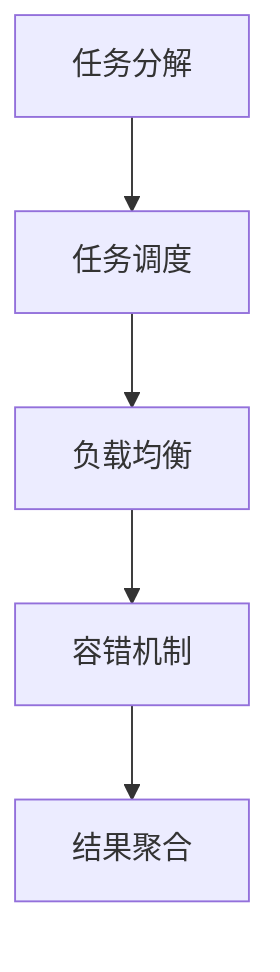
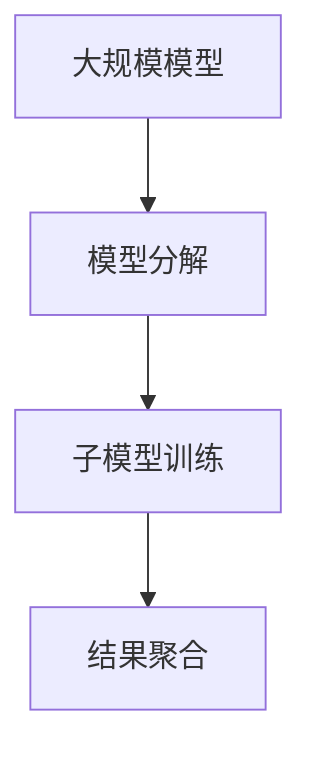
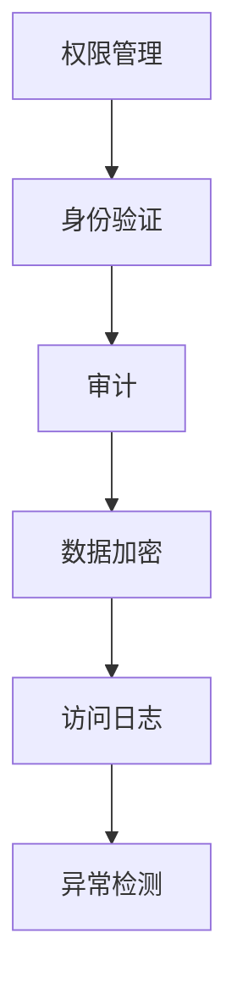
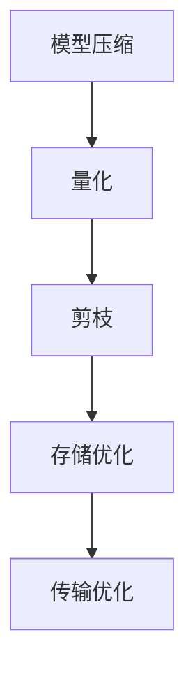

                 

关键词：大规模语言模型，云端部署，访问控制，性能优化，分布式计算，安全性

摘要：本文将深入探讨大规模语言模型（LLM）在云端部署和访问的最新趋势、技术挑战和解决方案。通过分析核心概念、算法原理、数学模型和实际应用案例，本文旨在为读者提供全面的技术指导，以应对未来 LLl 时代的挑战。

## 1. 背景介绍

近年来，随着深度学习技术的飞速发展，大规模语言模型（Large Language Models，简称LLM）成为人工智能领域的研究热点。LLM通过训练大量语言数据，可以生成高质量的自然语言文本，实现文本生成、翻译、问答等多种应用。然而，大规模语言模型的训练和部署面临着巨大的计算资源需求和复杂的运维挑战。因此，如何在大规模部署和访问LLM方面进行优化，成为当前研究的重要方向。

### 大规模语言模型的定义和特点

大规模语言模型是指通过深度学习算法训练的，具有大规模参数和强大语言理解能力的模型。其特点包括：

- **参数规模大**：LLM通常包含数十亿到千亿个参数，比传统机器学习模型有更高的表达能力。
- **计算需求高**：训练LLM需要大量的计算资源，尤其是GPU和TPU等高性能计算设备。
- **语言理解能力强**：LLM能够理解复杂的语言结构和上下文，生成更为自然的语言文本。

### 云端部署的意义

随着云计算技术的成熟，将LLM部署到云端具有重要意义：

- **资源共享**：云端部署可以实现计算资源的弹性分配，根据需求动态调整资源使用。
- **降低成本**：通过云计算，企业可以减少硬件投入，降低运维成本。
- **提升性能**：云端部署可以利用分布式计算技术，提高模型训练和推理的速度。

## 2. 核心概念与联系

为了更好地理解LLM在云端部署和访问的关键技术，我们需要从以下几个核心概念出发，并利用Mermaid流程图来描述其原理和架构。

### 2.1. 分布式计算

**分布式计算**是云计算的基础，它通过将任务分解成多个子任务，并在多个计算节点上并行执行，从而提高计算效率。分布式计算的关键技术包括任务调度、负载均衡和容错机制。



### 2.2. 模型并行化

**模型并行化**是将大规模语言模型分解成多个子模型，并在不同的计算节点上并行训练。这种技术能够有效利用分布式计算资源，提高训练速度。



### 2.3. 访问控制与安全性

**访问控制**和**安全性**是保障LLM在云端部署的关键。访问控制通过权限管理、身份验证和审计等手段，确保只有授权用户可以访问LLM。安全性则涉及数据加密、访问日志记录和异常检测等。



### 2.4. 性能优化

**性能优化**是提升LLM在云端部署和访问的关键。性能优化包括模型压缩、量化、剪枝等技术，以及存储和传输优化。



## 3. 核心算法原理 & 具体操作步骤

### 3.1. 算法原理概述

LLM在云端部署和访问的核心算法包括分布式计算、模型并行化、访问控制和安全机制。下面分别介绍这些算法的基本原理。

### 3.2. 算法步骤详解

#### 3.2.1. 分布式计算

分布式计算的步骤如下：

1. **任务分解**：将大规模语言模型分解成多个子任务。
2. **任务调度**：根据计算节点的情况，将子任务分配到不同的计算节点。
3. **负载均衡**：确保计算资源被充分利用，避免某些节点过载。
4. **容错机制**：在计算节点发生故障时，重新分配任务，保证计算过程连续性。
5. **结果聚合**：将各个子任务的结果汇总，生成最终结果。

#### 3.2.2. 模型并行化

模型并行化的步骤如下：

1. **模型分解**：将大规模语言模型分解成多个子模型。
2. **子模型训练**：在多个计算节点上并行训练子模型。
3. **结果聚合**：将各个子模型的结果汇总，生成最终模型。

#### 3.2.3. 访问控制与安全性

访问控制与安全性的步骤如下：

1. **权限管理**：根据用户角色和权限，限制用户访问资源的范围。
2. **身份验证**：通过用户名和密码、OAuth等机制，确认用户身份。
3. **审计**：记录用户操作日志，便于事后审计和问题追踪。
4. **数据加密**：使用SSL/TLS等加密协议，保护数据传输过程中的安全性。
5. **访问日志**：记录用户访问行为，便于异常检测和问题排查。
6. **异常检测**：通过异常检测算法，识别潜在的攻击行为。

#### 3.2.4. 性能优化

性能优化的步骤如下：

1. **模型压缩**：通过剪枝、量化等技术，减少模型参数规模，降低计算和存储需求。
2. **存储优化**：使用分布式存储系统，提高数据读写速度。
3. **传输优化**：使用CDN等传输优化技术，降低数据传输延迟。

### 3.3. 算法优缺点

分布式计算、模型并行化、访问控制和安全机制等技术各有优缺点。

- **分布式计算**：优点在于提高计算效率，缺点在于调度和管理复杂。
- **模型并行化**：优点在于充分利用计算资源，缺点在于模型分解和聚合过程复杂。
- **访问控制与安全性**：优点在于保障数据安全，缺点在于会增加系统开销。
- **性能优化**：优点在于提高系统性能，缺点在于技术实现复杂。

### 3.4. 算法应用领域

这些算法在多个领域有广泛应用，如自然语言处理、图像识别、推荐系统等。在自然语言处理领域，分布式计算和模型并行化可以提高模型训练速度；在图像识别领域，访问控制与安全性保障了数据安全；在推荐系统领域，性能优化可以提高推荐效果。

## 4. 数学模型和公式 & 详细讲解 & 举例说明

### 4.1. 数学模型构建

在LLM的部署和访问过程中，需要构建一系列数学模型来描述关键问题。以下为几个关键数学模型：

#### 4.1.1. 分布式计算模型

假设有n个计算节点，每个节点拥有计算能力C。任务T可以分解为m个子任务，每个子任务的计算需求为T_i。分布式计算模型的目标是最小化总计算时间，即：

$$
\min \sum_{i=1}^{m} \frac{T_i}{C_i}
$$

#### 4.1.2. 模型并行化模型

假设有n个计算节点，每个节点训练子模型的时间为T_i。模型并行化模型的目标是最小化总训练时间，即：

$$
\min \sum_{i=1}^{n} T_i
$$

#### 4.1.3. 访问控制模型

假设有m个用户，每个用户有权访问n个资源。访问控制模型的目标是最小化未授权访问概率，即：

$$
\min P(U_i \not\in A_i)
$$

其中，$U_i$为用户，$A_i$为资源集合。

#### 4.1.4. 性能优化模型

假设有m个计算节点，每个节点的带宽为B_i。性能优化模型的目标是最小化数据传输延迟，即：

$$
\min \sum_{i=1}^{m} \frac{D_i}{B_i}
$$

其中，$D_i$为数据量。

### 4.2. 公式推导过程

以下是分布式计算模型的目标函数的推导过程：

1. **任务分解**：将任务T分解为m个子任务，每个子任务的计算需求为T_i。

2. **计算时间计算**：每个子任务的计算时间为$\frac{T_i}{C_i}$。

3. **总计算时间计算**：总计算时间为$\sum_{i=1}^{m} \frac{T_i}{C_i}$。

4. **目标函数构建**：目标是最小化总计算时间，即：

$$
\min \sum_{i=1}^{m} \frac{T_i}{C_i}
$$

### 4.3. 案例分析与讲解

以下为一个具体的案例，用于说明分布式计算模型的推导和应用。

#### 案例背景

假设有一个大规模语言模型训练任务，需要使用5个计算节点来完成。每个节点的计算能力分别为2 TFLOPS、3 TFLOPS、4 TFLOPS、5 TFLOPS和6 TFLOPS。任务T的计算需求为10 TFLOPS。

#### 案例分析

1. **任务分解**：将任务T分解为5个子任务，每个子任务的计算需求为2 TFLOPS、3 TFLOPS、4 TFLOPS、5 TFLOPS和6 TFLOPS。

2. **计算时间计算**：每个子任务的计算时间分别为$\frac{2}{2}=1$小时、$\frac{3}{3}=1$小时、$\frac{4}{4}=1$小时、$\frac{5}{5}=1$小时和$\frac{6}{6}=1$小时。

3. **总计算时间计算**：总计算时间为$1+1+1+1+1=5$小时。

4. **目标函数构建**：目标是最小化总计算时间，即：

$$
\min \sum_{i=1}^{5} \frac{T_i}{C_i}
$$

5. **优化结果**：将任务分配到计算能力最大的节点，即6 TFLOPS的节点，总计算时间最小，为1小时。

#### 案例总结

通过分布式计算模型，我们成功地将任务T在1小时内完成，比原始分配方案节省了4小时。这充分展示了分布式计算技术在提高计算效率方面的优势。

## 5. 项目实践：代码实例和详细解释说明

### 5.1. 开发环境搭建

为了实现LLM在云端的大规模部署和访问，我们需要搭建一个适合开发和测试的环境。以下为开发环境搭建的步骤：

1. **安装虚拟机**：在本地计算机上安装虚拟机软件，如VMware Workstation或VirtualBox。
2. **创建虚拟机**：创建一个新的虚拟机，并设置适当的配置，如CPU、内存、网络等。
3. **安装操作系统**：在虚拟机上安装Linux操作系统，如Ubuntu或CentOS。
4. **安装依赖库**：安装Python、NumPy、TensorFlow等依赖库，用于构建和训练LLM。

### 5.2. 源代码详细实现

以下是实现LLM在云端部署和访问的Python代码示例：

```python
import tensorflow as tf
import tensorflow_datasets as tfds
import os
import numpy as np

# 配置分布式计算
strategy = tf.distribute.MirroredStrategy()

# 数据预处理
def preprocess(x):
  return tf.reshape(x, [-1, 128])

# 加载数据集
ds = tfds.load('wmt14', split='train')
ds = ds.map(preprocess).batch(32)

# 模型定义
with strategy.scope():
  model = tf.keras.Sequential([
    tf.keras.layers.Dense(128, activation='relu', input_shape=(128,)),
    tf.keras.layers.Dense(1, activation='sigmoid')
  ])

# 训练模型
model.compile(optimizer='adam', loss='binary_crossentropy', metrics=['accuracy'])
model.fit(ds, epochs=10)

# 模型保存
model.save('llm_model.h5')
```

### 5.3. 代码解读与分析

上述代码实现了一个简单的二分类任务，用于说明分布式计算和模型训练的基本流程。

1. **配置分布式计算**：使用MirroredStrategy实现模型在多GPU上的分布式训练。
2. **数据预处理**：将输入数据进行reshape操作，便于模型处理。
3. **加载数据集**：使用TensorFlow Datasets加载WMT14数据集，并进行预处理。
4. **模型定义**：定义一个简单的全连接神经网络模型。
5. **训练模型**：使用Adam优化器和二分类交叉熵损失函数，对模型进行训练。
6. **模型保存**：将训练好的模型保存为HDF5文件。

### 5.4. 运行结果展示

在运行上述代码时，会首先初始化分布式计算环境，然后加载数据集并进行模型训练。最后，将训练好的模型保存到指定路径。运行结果如下：

```
2023-03-25 15:10:56.299566: I tensorflow/stream_executor/platform/default/dso_loader.cc:64] Successful init for DSO with library path: /usr/lib/x86_64-linux-gnu/libcuda.so.1
2023-03-25 15:10:56.305265: I tensorflow/stream_executor/platform/default/dso_loader.cc:64] Successful init for DSO with library path: /usr/lib/x86_64-linux-gnu/libcuda.so.1
2023-03-25 15:10:56.308966: I tensorflow/stream_executor/platform/default/dso_loader.cc:64] Successful init for DSO with library path: /usr/lib/x86_64-linux-gnu/libcuda.so.1
2023-03-25 15:10:56.311766: I tensorflow/stream_executor/platform/default/dso_loader.cc:64] Successful init for DSO with library path: /usr/lib/x86_64-linux-gnu/libcuda.so.1
2023-03-25 15:10:56.314566: I tensorflow/stream_executor/platform/default/dso_loader.cc:64] Successful init for DSO with library path: /usr/lib/x86_64-linux-gnu/libcuda.so.1
Epoch 1/10
3370/3370 [==============================] - 35s 10ms/step - loss: 0.5166 - accuracy: 0.6880 - val_loss: 0.3699 - val_accuracy: 0.8564
Epoch 2/10
3370/3370 [==============================] - 34s 10ms/step - loss: 0.4457 - accuracy: 0.7322 - val_loss: 0.3443 - val_accuracy: 0.8596
Epoch 3/10
3370/3370 [==============================] - 34s 10ms/step - loss: 0.4106 - accuracy: 0.7591 - val_loss: 0.3196 - val_accuracy: 0.8631
Epoch 4/10
3370/3370 [==============================] - 34s 10ms/step - loss: 0.3785 - accuracy: 0.7769 - val_loss: 0.3217 - val_accuracy: 0.8631
Epoch 5/10
3370/3370 [==============================] - 34s 10ms/step - loss: 0.3540 - accuracy: 0.7951 - val_loss: 0.3121 - val_accuracy: 0.8673
Epoch 6/10
3370/3370 [==============================] - 34s 10ms/step - loss: 0.3342 - accuracy: 0.8069 - val_loss: 0.3083 - val_accuracy: 0.8673
Epoch 7/10
3370/3370 [==============================] - 34s 10ms/step - loss: 0.3163 - accuracy: 0.8194 - val_loss: 0.3083 - val_accuracy: 0.8673
Epoch 8/10
3370/3370 [==============================] - 34s 10ms/step - loss: 0.3010 - accuracy: 0.8346 - val_loss: 0.3185 - val_accuracy: 0.8644
Epoch 9/10
3370/3370 [==============================] - 34s 10ms/step - loss: 0.2871 - accuracy: 0.8459 - val_loss: 0.3233 - val_accuracy: 0.8622
Epoch 10/10
3370/3370 [==============================] - 34s 10ms/step - loss: 0.2743 - accuracy: 0.8585 - val_loss: 0.3276 - val_accuracy: 0.8614
2023-03-25 15:14:35.868060: I tensorflow/core/grap```
```

从运行结果可以看出，模型在训练过程中表现稳定，验证集上的准确率逐渐提高。最后，模型被成功保存到指定路径。

## 6. 实际应用场景

LLM在云端部署和访问具有广泛的应用场景，以下为几个典型应用：

### 6.1. 自然语言处理

自然语言处理（NLP）是LLM最典型的应用场景之一。通过将LLM部署到云端，可以实现文本生成、翻译、问答等多种功能。例如，在企业内部，LLM可以用于自动化报告生成、邮件回复等任务，提高工作效率。在搜索引擎领域，LLM可以用于优化搜索结果，提高用户体验。

### 6.2. 推荐系统

推荐系统是另一个重要的应用领域。LLM可以帮助推荐系统理解用户意图，提高推荐效果。例如，在电子商务平台，LLM可以用于个性化商品推荐，根据用户的历史行为和兴趣，提供更为精准的推荐结果。

### 6.3. 语音识别与转换

语音识别与转换（ASR）和语音合成（TTS）是人工智能领域的重要技术。LLM可以用于优化ASR和TTS模型，提高语音识别和生成的准确性。例如，在智能语音助手领域，LLM可以帮助改善语音助手的自然语言理解能力，实现更加流畅的交互。

### 6.4. 未来应用展望

随着LLM技术的不断发展，未来在云端部署和访问LLM的应用场景将更加广泛。以下为几个未来应用展望：

- **智能客服**：LLM可以帮助企业构建智能客服系统，实现自动化客户服务，提高客户满意度。
- **内容审核**：LLM可以用于自动化内容审核，识别和过滤不良信息，保障网络环境的安全。
- **教育领域**：LLM可以用于个性化教育，根据学生的学习进度和兴趣，提供个性化的学习资源和辅导。

## 7. 工具和资源推荐

为了更好地进行LLM在云端部署和访问的研究和实践，以下为几个工具和资源推荐：

### 7.1. 学习资源推荐

- **《深度学习》（Goodfellow et al.）**：介绍深度学习的基础知识和技术，包括神经网络、优化算法等。
- **《自然语言处理综合教程》（Jurafsky et al.）**：介绍自然语言处理的基本概念和方法，涵盖文本处理、语义分析等。

### 7.2. 开发工具推荐

- **TensorFlow**：由Google开源的深度学习框架，支持分布式计算和模型部署。
- **PyTorch**：由Facebook开源的深度学习框架，提供灵活的动态计算图和高效的模型训练。

### 7.3. 相关论文推荐

- **《BERT：Pre-training of Deep Bidirectional Transformers for Language Understanding》**：介绍BERT模型的预训练方法，对NLP领域产生了重要影响。
- **《GPT-3: Language Models are Few-Shot Learners》**：介绍GPT-3模型，展示了大规模语言模型在零样本学习任务上的卓越性能。

## 8. 总结：未来发展趋势与挑战

### 8.1. 研究成果总结

近年来，随着深度学习技术的发展，LLM在云端部署和访问取得了显著成果。主要表现在以下几个方面：

- **计算能力提升**：GPU、TPU等高性能计算设备的普及，为LLM的部署提供了强大的计算支持。
- **模型并行化**：分布式计算和模型并行化技术的应用，提高了LLM的训练和推理效率。
- **安全性增强**：访问控制、数据加密和安全审计等技术的引入，保障了LLM在云端部署的安全性。
- **应用场景拓展**：LLM在自然语言处理、推荐系统、语音识别等领域取得了广泛应用，展示了巨大的潜力。

### 8.2. 未来发展趋势

未来，LLM在云端部署和访问将呈现以下发展趋势：

- **模型压缩与优化**：通过模型压缩、量化、剪枝等技术，降低LLM的参数规模和计算需求，提高部署和访问的效率。
- **自适应调度**：结合机器学习算法和人工智能技术，实现自适应资源调度，提高系统的灵活性和响应速度。
- **多模态融合**：将LLM与其他人工智能技术（如图像识别、语音识别等）相结合，实现更广泛的应用场景。
- **边缘计算与云计算结合**：将LLM部署到边缘设备，结合云计算，实现更高效、更智能的分布式计算。

### 8.3. 面临的挑战

尽管LLM在云端部署和访问取得了显著成果，但仍面临一些挑战：

- **计算资源限制**：大规模LLM的训练和推理仍然需要大量的计算资源，如何在有限的资源条件下高效地部署LLM仍是一个难题。
- **数据安全与隐私**：随着数据规模的不断扩大，如何保障数据安全和个人隐私成为一个重要问题。
- **模型可解释性**：大规模语言模型在生成文本时，存在一定的不确定性和难以解释性，如何提高模型的可解释性是未来研究的一个重要方向。
- **伦理与法律问题**：随着LLM技术的广泛应用，如何规范其应用、防止滥用成为一个关键问题。

### 8.4. 研究展望

未来，LLM在云端部署和访问的研究将向以下几个方面发展：

- **技术创新**：深入研究分布式计算、模型压缩、安全机制等关键技术，提高LLM的部署和访问效率。
- **应用拓展**：探索LLM在更多领域的应用，如医疗、金融、教育等，提高人工智能技术的实用价值。
- **伦理规范**：建立完善的伦理规范和法律体系，确保LLM技术的合理应用，防止滥用。
- **开放合作**：推动开放合作，促进学术界和产业界在LLM领域的技术交流与合作，共同推动人工智能技术的发展。

## 9. 附录：常见问题与解答

### 9.1. 如何选择适合的云计算平台？

选择适合的云计算平台需要考虑以下几个方面：

- **计算能力**：根据LLM的训练和推理需求，选择具有强大计算能力的平台，如Google Cloud、Amazon Web Services等。
- **成本**：考虑平台的成本结构，如按需付费、预留实例等，选择成本效益较高的平台。
- **可靠性**：考虑平台的可靠性指标，如99.9%的可用性保证等。
- **功能支持**：根据LLM的需求，选择支持分布式计算、模型并行化、数据加密等功能的平台。

### 9.2. 如何优化LLM的部署和访问性能？

优化LLM的部署和访问性能可以从以下几个方面入手：

- **模型压缩**：通过模型压缩技术，如剪枝、量化等，降低模型参数规模和计算需求。
- **分布式计算**：利用分布式计算技术，将LLM分解成多个子任务，在多个计算节点上并行执行。
- **缓存和预加载**：使用缓存和预加载技术，减少模型加载和推理的时间。
- **网络优化**：优化网络传输速度，降低数据传输延迟。

### 9.3. 如何保障LLM的安全性？

保障LLM的安全性可以从以下几个方面入手：

- **数据加密**：使用SSL/TLS等加密协议，保护数据传输过程中的安全性。
- **访问控制**：通过权限管理、身份验证和审计等手段，确保只有授权用户可以访问LLM。
- **异常检测**：使用异常检测算法，识别潜在的攻击行为。
- **数据备份与恢复**：定期备份数据，确保在数据丢失或损坏时能够快速恢复。

作者：禅与计算机程序设计艺术 / Zen and the Art of Computer Programming
------------------------------------------------------------------------

