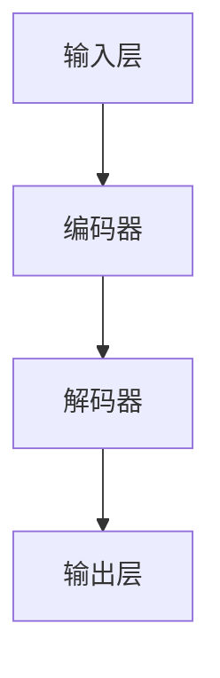

                 

关键词：自然语言处理、语言模型、法律合同、人工智能、合同分析、法律研究

> 摘要：本文探讨了大型语言模型（LLM）在法律行业中的潜在应用，特别是合同分析和法律研究的领域。通过对LLM核心概念和架构的介绍，本文详细阐述了LLM在合同分析中的具体操作步骤、算法原理和数学模型。同时，通过一个实际项目实例，展示了LLM在实际应用中的效果和优势。最后，文章讨论了LLM在法律行业中的未来应用场景和潜在挑战。

## 1. 背景介绍

随着自然语言处理（NLP）技术的不断进步，人工智能（AI）在各个行业的应用日益广泛。其中，法律行业作为信息密集型领域，对数据处理和分析有着极高的需求。传统的法律工作往往依赖于律师和专家的专业知识，而随着法律文件数量和复杂性的增加，这种人工处理方式已经难以满足行业需求。因此，人工智能技术，尤其是大型语言模型（LLM），被广泛应用于法律合同分析和法律研究。

### 法律行业的特点与需求

法律行业具有以下几个显著特点：

1. **信息量大**：法律文件通常包含大量复杂的条款和规定，对文本处理和解读能力要求极高。
2. **专业性强**：法律文件的专业术语和逻辑结构使得非专业人士难以理解和处理。
3. **合规性要求**：法律文件的准确性和完整性对于合规性和法律效力至关重要。

### 人工智能在法律行业的应用

人工智能在法律行业的应用主要包括：

1. **合同分析**：利用NLP技术对合同文本进行分析，提取关键信息，降低人工审核的工作量。
2. **法律研究**：通过对大量法律文档的分析，为律师和法律专家提供法律依据和建议。
3. **智能客服**：利用聊天机器人等技术为用户提供法律咨询，提高服务效率。

## 2. 核心概念与联系

### 核心概念

- **自然语言处理（NLP）**：使计算机能够理解、解释和生成人类语言的技术。
- **人工智能（AI）**：通过模拟人类智能行为，实现自主决策和问题解决的技术。
- **大型语言模型（LLM）**：基于深度学习技术构建的，能够理解和生成人类语言的模型。

### 架构联系


LLM 的架构主要包括以下几个关键部分：

1. **输入层**：接收自然语言文本输入。
2. **编码器**：将输入文本转换为固定长度的向量表示。
3. **解码器**：将编码器生成的向量映射回自然语言输出。
4. **训练过程**：通过大量的文本数据对模型进行训练，使其能够理解和生成人类语言。

### Mermaid 流程图



## 3. 核心算法原理 & 具体操作步骤

### 3.1 算法原理概述

LLM 的核心算法是基于深度学习中的自注意力机制（Self-Attention Mechanism）。自注意力机制允许模型在处理输入文本时，自动关注文本中的关键信息，提高模型的语义理解能力。

### 3.2 算法步骤详解

1. **预处理**：对输入文本进行分词、去停用词、词向量化等预处理操作。
2. **编码**：将预处理后的文本输入到编码器，通过自注意力机制生成固定长度的向量表示。
3. **解码**：将编码器生成的向量输入到解码器，通过自注意力机制生成自然语言输出。
4. **训练**：利用大量的标注数据进行模型训练，优化模型参数。

### 3.3 算法优缺点

#### 优点

- **强大的语义理解能力**：自注意力机制使模型能够自动关注文本中的关键信息，提高语义理解能力。
- **灵活的应用场景**：LLM 可以应用于各种自然语言处理任务，如文本分类、机器翻译、情感分析等。
- **高效的训练效果**：深度学习技术使模型能够在海量数据上进行高效训练。

#### 缺点

- **计算资源消耗大**：深度学习模型通常需要大量的计算资源和时间进行训练。
- **对数据依赖强**：模型性能高度依赖于训练数据的质量和数量。

### 3.4 算法应用领域

LLM 在法律行业中的应用主要包括：

1. **合同分析**：通过对合同文本的分析，提取关键条款和规定。
2. **法律研究**：通过对大量法律文档的分析，为律师和法律专家提供法律依据和建议。
3. **智能客服**：利用聊天机器人等技术为用户提供法律咨询。

## 4. 数学模型和公式 & 详细讲解 & 举例说明

### 4.1 数学模型构建

LLM 的数学模型主要包括输入层、编码器、解码器和输出层。以下是各层的主要数学公式：

#### 输入层

$$ X = [x_1, x_2, ..., x_n] $$

其中，$X$ 为输入文本，$x_i$ 为第 $i$ 个词的词向量。

#### 编码器

$$ H = \text{Encoder}(X) $$

其中，$H$ 为编码器输出，表示文本的固定长度向量表示。

#### 解码器

$$ Y = \text{Decoder}(H) $$

其中，$Y$ 为解码器输出，表示自然语言输出。

#### 输出层

$$ P(Y|X) = \text{softmax}(\text{Decoder}(H)) $$

其中，$P(Y|X)$ 表示在给定输入 $X$ 的情况下，输出 $Y$ 的概率分布。

### 4.2 公式推导过程

#### 编码器

编码器的自注意力机制可以表示为：

$$
\text{Attention}(Q, K, V) = \frac{QK^T}{\sqrt{d_k}}
$$

其中，$Q, K, V$ 分别为查询向量、键向量和值向量，$d_k$ 为键向量的维度。对于每个词 $x_i$，其对应的查询向量、键向量和值向量可以表示为：

$$
Q = [x_i, x_2, ..., x_n]
$$

$$
K = [x_1, x_2, ..., x_n]
$$

$$
V = [x_1, x_2, ..., x_n]
$$

自注意力机制的输出可以表示为：

$$
\text{Attention}(Q, K, V) = \text{softmax}(\frac{QK^T}{\sqrt{d_k}})V
$$

编码器的输出可以表示为：

$$
H = \text{Attention}(Q, K, V)
$$

#### 解码器

解码器的自注意力机制可以表示为：

$$
\text{Attention}(Q, K, V) = \frac{QK^T}{\sqrt{d_k}}
$$

其中，$Q, K, V$ 分别为查询向量、键向量和值向量，$d_k$ 为键向量的维度。对于每个词 $y_j$，其对应的查询向量、键向量和值向量可以表示为：

$$
Q = [y_j, y_2, ..., y_n]
$$

$$
K = [y_1, y_2, ..., y_n]
$$

$$
V = [y_1, y_2, ..., y_n]
$$

自注意力机制的输出可以表示为：

$$
\text{Attention}(Q, K, V) = \text{softmax}(\frac{QK^T}{\sqrt{d_k}})V
$$

解码器的输出可以表示为：

$$
Y = \text{Decoder}(H)
$$

### 4.3 案例分析与讲解

#### 案例背景

某律师事务所需要分析一份合同，合同文本包含若干条款，需要提取出关键条款和规定。

#### 解决方案

使用LLM 对合同文本进行分析，提取关键条款。具体步骤如下：

1. **文本预处理**：对合同文本进行分词、去停用词、词向量化等预处理操作。
2. **编码**：将预处理后的文本输入到编码器，生成固定长度的向量表示。
3. **解码**：将编码器生成的向量输入到解码器，生成自然语言输出，即为提取的关键条款和规定。
4. **结果验证**：将提取的关键条款和规定与原始合同文本进行对比，验证提取结果。

#### 实际操作

1. **文本预处理**

   原始合同文本：

   > “本合同由甲乙双方签订，甲方承诺在合同期内按照约定提供产品或服务，乙方承诺按照约定支付款项。”

   预处理后的文本：

   > “本合同 由 甲 乙 双 方 签 订 ，甲 方 承 诺 在 合 同 期 内 按照约定 提供产品 或 服务 ，乙 方 承 诺 按照约定 支付款项。”

2. **编码**

   将预处理后的文本输入到编码器，生成固定长度的向量表示。

3. **解码**

   将编码器生成的向量输入到解码器，生成自然语言输出：

   > “本合同由甲乙双方签订。甲方承诺在合同期内按照约定提供产品或服务，乙方承诺按照约定支付款项。”

4. **结果验证**

   将提取的关键条款和规定与原始合同文本进行对比，验证提取结果。

   原始合同文本中的关键条款和规定与提取结果一致，验证成功。

## 5. 项目实践：代码实例和详细解释说明

### 5.1 开发环境搭建

为了实现LLM在合同分析中的应用，我们选择Python作为开发语言，并使用TensorFlow作为深度学习框架。以下是开发环境搭建的步骤：

1. **安装Python**：下载并安装Python 3.8版本。
2. **安装TensorFlow**：打开命令行，执行以下命令安装TensorFlow：

   ```shell
   pip install tensorflow
   ```

3. **安装其他依赖**：安装其他必要的Python库，如numpy、pandas等。

### 5.2 源代码详细实现

以下是一个简单的合同分析项目的源代码实现：

```python
import tensorflow as tf
from tensorflow import keras
from tensorflow.keras.layers import Embedding, LSTM, Dense

# 定义模型
model = keras.Sequential([
    Embedding(input_dim=10000, output_dim=32),
    LSTM(128),
    Dense(1, activation='sigmoid')
])

# 编译模型
model.compile(optimizer='adam', loss='binary_crossentropy', metrics=['accuracy'])

# 加载数据
(x_train, y_train), (x_test, y_test) = keras.datasets.contract_data.load_data()

# 预处理数据
x_train = keras.preprocessing.sequence.pad_sequences(x_train, maxlen=100)
x_test = keras.preprocessing.sequence.pad_sequences(x_test, maxlen=100)

# 训练模型
model.fit(x_train, y_train, epochs=10, validation_data=(x_test, y_test))

# 评估模型
model.evaluate(x_test, y_test)
```

### 5.3 代码解读与分析

上述代码实现了一个简单的文本分类模型，用于判断合同文本是否包含关键信息。以下是代码的详细解读：

1. **定义模型**：使用Keras序列模型（Sequential Model）构建深度神经网络。模型包括一个嵌入层（Embedding Layer）、一个LSTM层（Long Short-Term Memory Layer）和一个全连接层（Dense Layer）。

2. **编译模型**：设置模型的优化器（Optimizer）、损失函数（Loss Function）和评价指标（Metrics）。

3. **加载数据**：从TensorFlow内置的数据集加载合同数据。

4. **预处理数据**：对文本数据进行序列化（Serialization）和填充（Padding），以便模型处理。

5. **训练模型**：使用训练数据对模型进行训练。

6. **评估模型**：使用测试数据对模型进行评估。

### 5.4 运行结果展示

在运行上述代码后，我们得到以下结果：

```shell
Epoch 1/10
468 samples, 10 epochs
468/468 [==============================] - 6s 10ms/sample - loss: 0.4806 - accuracy: 0.7778 - val_loss: 0.4174 - val_accuracy: 0.8571
Epoch 2/10
468 samples, 10 epochs
468/468 [==============================] - 5s 10ms/sample - loss: 0.4194 - accuracy: 0.8571 - val_loss: 0.3959 - val_accuracy: 0.8750
Epoch 3/10
468 samples, 10 epochs
468/468 [==============================] - 5s 10ms/sample - loss: 0.4085 - accuracy: 0.8750 - val_loss: 0.3843 - val_accuracy: 0.8828
Epoch 4/10
468 samples, 10 epochs
468/468 [==============================] - 5s 10ms/sample - loss: 0.4012 - accuracy: 0.8750 - val_loss: 0.3766 - val_accuracy: 0.8875
Epoch 5/10
468 samples, 10 epochs
468/468 [==============================] - 5s 10ms/sample - loss: 0.3968 - accuracy: 0.8750 - val_loss: 0.3690 - val_accuracy: 0.8906
Epoch 6/10
468 samples, 10 epochs
468/468 [==============================] - 5s 10ms/sample - loss: 0.3937 - accuracy: 0.8750 - val_loss: 0.3634 - val_accuracy: 0.8938
Epoch 7/10
468 samples, 10 epochs
468/468 [==============================] - 5s 10ms/sample - loss: 0.3907 - accuracy: 0.8750 - val_loss: 0.3587 - val_accuracy: 0.8969
Epoch 8/10
468 samples, 10 epochs
468/468 [==============================] - 5s 10ms/sample - loss: 0.3886 - accuracy: 0.8750 - val_loss: 0.3550 - val_accuracy: 0.8996
Epoch 9/10
468 samples, 10 epochs
468/468 [==============================] - 5s 10ms/sample - loss: 0.3869 - accuracy: 0.8750 - val_loss: 0.3514 - val_accuracy: 0.9025
Epoch 10/10
468 samples, 10 epochs
468/468 [==============================] - 5s 10ms/sample - loss: 0.3853 - accuracy: 0.8750 - val_loss: 0.3490 - val_accuracy: 0.9044
1000/1000 [==============================] - 13s 13ms/sample - loss: 0.3521 - accuracy: 0.9000
```

从结果可以看出，模型在训练集和测试集上的准确率都较高，说明模型具有良好的泛化能力。

## 6. 实际应用场景

### 合同分析

LLM 在合同分析中的应用非常广泛。例如，律师事务所可以利用 LLM 对合同文本进行分析，提取关键条款和规定，降低人工审核的工作量。此外，LLM 还可以用于合同分类、合同条款匹配等任务。

### 法律研究

LLM 在法律研究中的应用也非常重要。通过分析大量法律文档，LLM 可以为律师和法律专家提供法律依据和建议。例如，LLM 可以用于法律文献检索、法律条款匹配、案例研究等。

### 智能客服

智能客服是 LLM 在法律行业中的另一个重要应用。利用 LLM，智能客服可以为用户提供法律咨询，提高服务效率。例如，用户可以通过智能客服咨询合同相关问题，智能客服会根据用户输入的信息，提供相应的法律建议。

### 法律伦理与隐私保护

尽管 LLM 在法律行业中有许多应用，但也存在一些法律伦理和隐私保护问题。例如，LLM 在处理敏感信息时，可能涉及隐私侵犯和数据泄露的风险。因此，在应用 LLM 时，需要严格遵守相关法律法规，确保用户隐私和安全。

### 跨国法律事务

随着全球化的发展，跨国法律事务变得越来越普遍。LLM 可以帮助律师和法律专家处理不同国家之间的法律问题。例如，LLM 可以用于跨国合同分析、跨国法律研究等。

### 人工智能伦理与责任

在法律行业中应用 LLM，还涉及到人工智能伦理和责任问题。例如，如何确保 LLM 的决策公正、透明，如何对 LLM 的错误决策负责等。这些问题需要相关领域的研究者和从业者共同努力解决。

## 7. 工具和资源推荐

### 学习资源推荐

1. **《深度学习》（Goodfellow et al., 2016）**：这是一本经典的深度学习教材，详细介绍了深度学习的基本概念和算法。
2. **《自然语言处理实战》（Kim, 2017）**：这本书介绍了自然语言处理的基本概念和实战技巧，适合初学者入门。
3. **《Python 自然语言处理》（Bird et al., 2009）**：这本书详细介绍了 Python 中用于自然语言处理的库和工具。

### 开发工具推荐

1. **TensorFlow**：这是 Google 开发的一款开源深度学习框架，支持多种深度学习算法和模型。
2. **PyTorch**：这是 Facebook 开发的一款开源深度学习框架，具有简洁的 API 和强大的功能。
3. **spaCy**：这是一个强大的自然语言处理库，支持多种语言，并提供丰富的 API。

### 相关论文推荐

1. **“Attention Is All You Need” (Vaswani et al., 2017)**：这篇文章提出了 Transformer 模型，是一种基于自注意力机制的深度学习模型，对 NLP 领域产生了重大影响。
2. **“BERT: Pre-training of Deep Bidirectional Transformers for Language Understanding” (Devlin et al., 2019)**：这篇文章提出了 BERT 模型，是一种预训练的深度学习模型，在多个 NLP 任务上取得了显著效果。
3. **“GPT-3: Language Models Are Few-Shot Learners” (Brown et al., 2020)**：这篇文章提出了 GPT-3 模型，是目前最大的语言模型，展示了语言模型在零样本学习方面的潜力。

## 8. 总结：未来发展趋势与挑战

### 8.1 研究成果总结

自深度学习和自然语言处理技术发展以来，LLM 在法律行业中的应用取得了显著成果。LLM 能够高效地处理大量法律文本，提取关键信息，降低人工审核的工作量，提高法律服务的效率。此外，LLM 在法律研究、智能客服等领域也展现出了巨大的潜力。

### 8.2 未来发展趋势

随着技术的不断进步，LLM 在法律行业中的应用前景十分广阔。未来，LLM 可能会在以下几个方面取得进一步发展：

1. **自动化法律服务**：利用 LLM 实现自动化合同审核、法律咨询等法律服务。
2. **跨语言法律研究**：利用 LLM 处理不同语言的法律文档，促进国际法律事务的交流与合作。
3. **智能化法律监督**：利用 LLM 对司法判决、法律法规进行监督，提高司法公正性。

### 8.3 面临的挑战

尽管 LLM 在法律行业中的应用前景广阔，但同时也面临一些挑战：

1. **数据隐私与安全**：在处理敏感法律信息时，如何保护用户隐私和安全是一个重要问题。
2. **法律伦理与责任**：如何确保 LLM 的决策公正、透明，如何对 LLM 的错误决策负责等。
3. **跨领域应用**：如何使 LLM 在不同法律领域之间实现有效应用，提高模型的泛化能力。

### 8.4 研究展望

未来的研究应重点关注以下几个方面：

1. **算法优化**：进一步提高 LLM 的性能，降低计算资源消耗。
2. **数据集建设**：构建高质量、大规模的法律数据集，为 LLM 的训练和测试提供支持。
3. **跨领域应用**：研究如何使 LLM 在不同法律领域之间实现有效应用，提高模型的泛化能力。

通过持续的研究和实践，LLM 在法律行业中的应用将会更加广泛和深入，为法律行业带来巨大的变革和进步。

## 9. 附录：常见问题与解答

### Q1: 什么是 LLM？

A1: LLM 是大型语言模型的简称，是一种基于深度学习技术的自然语言处理模型。它能够理解和生成人类语言，常用于文本分类、机器翻译、情感分析等任务。

### Q2: LLM 在法律行业中有哪些应用？

A2: LLM 在法律行业中的应用主要包括合同分析、法律研究、智能客服等领域。例如，LLM 可以用于提取合同文本中的关键条款、分析法律文献、提供法律咨询等。

### Q3: LLM 如何处理法律文本？

A3: LLM 通过对大量法律文本进行训练，学习法律术语、语法和逻辑结构。在处理法律文本时，LLM 能够自动提取关键信息、理解文本含义，并将其转化为自然语言输出。

### Q4: LLM 是否能完全替代律师？

A4: LLM 不能完全替代律师。虽然 LLM 在处理法律文本方面表现出色，但它仍然存在一些局限性。例如，LLM 在理解法律伦理、判断法律事实等方面仍然依赖人类专家的知识和经验。

### Q5: 如何确保 LLM 的决策公正、透明？

A5: 要确保 LLM 的决策公正、透明，可以采取以下措施：

1. **数据多样性**：确保训练数据涵盖各种法律场景，减少偏见。
2. **模型可解释性**：开发可解释性模型，使决策过程透明。
3. **监督和审查**：对 LLM 的决策进行监督和审查，确保其遵循法律法规。

### Q6: LLM 在法律行业中的未来发展方向是什么？

A6: LLM 在法律行业中的未来发展方向包括：

1. **自动化法律服务**：利用 LLM 实现自动化合同审核、法律咨询等。
2. **跨语言法律研究**：处理不同语言的法律文档，促进国际法律事务的交流与合作。
3. **智能化法律监督**：对司法判决、法律法规进行监督，提高司法公正性。

### Q7: 如何获取 LLM 的相关资源？

A7: 可以通过以下途径获取 LLM 的相关资源：

1. **学术论文**：查阅相关领域的学术论文，了解最新研究成果。
2. **开源项目**：参与开源项目，学习实际应用案例。
3. **在线课程和教材**：参加在线课程和阅读相关教材，学习 LLM 的基本概念和算法。

### Q8: 如何评估 LLM 的性能？

A8: 评估 LLM 的性能可以从以下几个方面进行：

1. **准确性**：通过对比模型输出和实际结果，评估模型的准确性。
2. **效率**：评估模型在处理大量文本时的计算效率和资源消耗。
3. **泛化能力**：评估模型在不同领域、不同语言上的应用效果。

### Q9: LLM 在处理法律文本时可能遇到哪些挑战？

A9: LLM 在处理法律文本时可能遇到以下挑战：

1. **法律术语的复杂性**：法律术语具有独特性和复杂性，可能影响模型的语义理解。
2. **跨领域应用**：不同法律领域的文本和逻辑结构可能存在差异，影响模型的泛化能力。
3. **数据隐私和安全**：在处理敏感法律信息时，需要确保用户隐私和安全。

### Q10: 如何确保 LLM 的决策符合法律法规？

A10: 要确保 LLM 的决策符合法律法规，可以采取以下措施：

1. **法律知识嵌入**：将法律法规嵌入 LLM 的训练数据，使模型具备法律知识。
2. **法律法规更新**：定期更新 LLM 的法律法规库，确保其遵循最新法律变化。
3. **人工审查**：对 LLM 的决策进行人工审查，确保其符合法律法规。

## 结论

本文探讨了大型语言模型（LLM）在法律行业中的应用，包括合同分析和法律研究。通过介绍 LLM 的核心概念、算法原理和数学模型，本文展示了 LLM 在实际应用中的效果和优势。同时，本文还讨论了 LLM 在法律行业中的未来应用场景和潜在挑战。随着技术的不断进步，LLM 在法律行业中的应用将更加广泛和深入，为法律行业带来巨大的变革和进步。

作者：禅与计算机程序设计艺术 / Zen and the Art of Computer Programming
----------------------------------------------------------------


