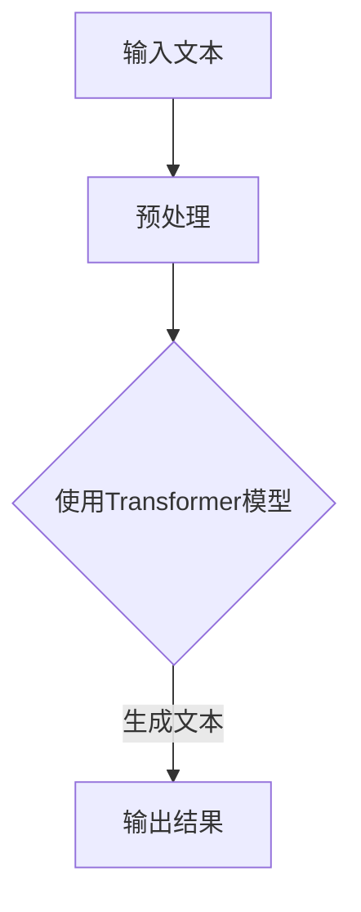

                 

关键词：LLM，社会影响，积极效应，负面效应，人工智能

摘要：本文将深入探讨大型语言模型（LLM）在现代社会中的潜在影响，从积极和负面两个角度进行分析。我们将首先介绍LLM的基本概念和发展历程，然后详细讨论其在教育、医疗、金融等多个领域的应用，并分析其带来的积极效应。接着，我们将探讨LLM可能引发的一些负面影响，如隐私泄露、道德风险和技术失业等问题。最后，本文将总结LLM的未来发展趋势和面临的挑战，并提出相应的解决策略。

## 1. 背景介绍

近年来，人工智能（AI）技术在计算机科学领域取得了显著进展，其中大型语言模型（Large Language Models，简称LLM）成为研究的热点。LLM是一种能够理解和生成自然语言的深度学习模型，其核心在于能够处理和理解人类语言，并在多种场景下模拟人类的思维过程。LLM的出现标志着自然语言处理（NLP）领域的一个重要里程碑，使得计算机能够更好地与人类进行交互。

LLM的基本概念源于深度学习中的神经网络模型，特别是循环神经网络（RNN）和其变体，如长短期记忆网络（LSTM）和门控循环单元（GRU）。这些模型通过训练大量文本数据，学会了语言的模式和结构，从而能够生成语义丰富的文本。随着计算能力的提升和大数据的普及，LLM的规模和性能也在不断增长。

LLM的发展历程可以追溯到20世纪80年代，当时的神经网络研究开始崭露头角。然而，由于计算资源和数据集的限制，早期的模型效果并不理想。直到2018年，Google推出了Transformer模型，使得LLM的研究和应用进入了新的阶段。随后，OpenAI的GPT系列模型，如GPT-3，进一步推动了LLM的技术进步和应用范围。

## 2. 核心概念与联系

在深入探讨LLM对社会的影响之前，我们需要了解一些核心概念和架构，以便更好地理解其工作原理和应用场景。

### 2.1 自然语言处理（NLP）

自然语言处理是计算机科学和人工智能领域的一个分支，旨在使计算机能够理解、解释和生成人类语言。NLP的核心任务包括文本分类、情感分析、机器翻译、命名实体识别等。LLM在NLP中的应用非常广泛，其能力大大提高了这些任务的准确性和效率。

### 2.2 深度学习（Deep Learning）

深度学习是机器学习的一个子领域，通过模拟人脑的神经网络结构，实现了对复杂数据的高效分析和处理。在LLM中，深度学习模型如循环神经网络（RNN）、长短期记忆网络（LSTM）和Transformer等发挥了关键作用。

### 2.3 Transformer 模型

Transformer模型是LLM的核心架构，其采用了自注意力机制（Self-Attention），能够有效地处理长距离依赖问题，从而在文本生成和理解任务中表现出色。自注意力机制通过计算不同词之间的相关性，使得模型能够更好地捕捉语义信息。

### 2.4 Mermaid 流程图

以下是LLM的基本架构和流程的Mermaid流程图：



在这个流程图中，输入文本经过预处理后，输入到Transformer模型中进行处理，最后生成文本输出。预处理步骤包括分词、编码等，这些步骤有助于将文本数据转化为模型能够理解和处理的格式。

## 3. 核心算法原理 & 具体操作步骤

### 3.1 算法原理概述

LLM的核心算法基于深度学习，特别是Transformer模型。Transformer模型通过自注意力机制（Self-Attention）来处理输入序列，使其能够捕捉到序列中不同词之间的依赖关系。在自注意力机制中，每个词的表示都会考虑到其他所有词的影响，从而生成一个更加丰富的语义表示。

### 3.2 算法步骤详解

#### 3.2.1 预处理

在处理文本之前，需要进行一系列预处理步骤，包括：

- 分词：将文本分割成单词或子词。
- 词向量化：将单词或子词映射到高维向量。
- 填充和截断：将文本序列填充或截断到固定的长度，以便于模型处理。

#### 3.2.2 编码

在预处理后，输入文本被编码成序列，每个序列元素是一个高维向量。编码过程主要包括两个步骤：

- 词嵌入：将单词或子词映射到向量。
- 序列编码：将整个序列编码成一个向量，这可以通过自注意力机制实现。

#### 3.2.3 自注意力机制

自注意力机制是Transformer模型的核心，通过计算输入序列中每个词与其他词之间的相似度，生成一个加权序列。这个过程可以分为以下几个步骤：

1. 计算词与词之间的相似度，通常使用点积注意力机制。
2. 使用softmax函数对相似度进行归一化，得到加权序列。
3. 将加权序列与输入序列中的词向量进行点积操作，得到加权词向量。

#### 3.2.4 生成文本

在自注意力机制之后，LLM会根据加权词向量生成输出序列。生成文本的过程可以通过以下步骤实现：

1. 选择第一个词，通常是一个特殊的开始标记。
2. 使用Transformer模型处理当前序列，生成下一个词的概率分布。
3. 根据概率分布选择下一个词，并将其添加到输出序列中。
4. 重复步骤2和3，直到生成完整的文本序列。

### 3.3 算法优缺点

#### 优点

- 高效处理长距离依赖：自注意力机制使得LLM能够捕捉到序列中长距离的依赖关系，从而在文本生成和理解任务中表现出色。
- 强大的文本生成能力：LLM可以生成语义丰富、连贯的文本，广泛应用于聊天机器人、自动摘要、机器翻译等领域。
- 灵活的架构：Transformer模型具有模块化的架构，可以方便地调整和扩展，以适应不同的应用场景。

#### 缺点

- 需要大量的数据和计算资源：训练LLM需要大量的文本数据和计算资源，这使得其部署和维护成本较高。
- 可能产生偏见和错误：由于训练数据的限制和模型的设计，LLM可能会在文本生成中产生偏见或错误，需要进一步优化和改进。

### 3.4 算法应用领域

LLM在多个领域都展现出了强大的应用潜力，以下是几个主要的应用领域：

- 文本生成：包括聊天机器人、自动摘要、机器翻译等。
- 自然语言理解：包括问答系统、情感分析、信息检索等。
- 文本分类：用于分类文本数据，如新闻分类、情感分类等。
- 娱乐和创作：包括诗歌创作、故事写作、音乐创作等。

## 4. 数学模型和公式 & 详细讲解 & 举例说明

### 4.1 数学模型构建

LLM的数学模型主要包括词嵌入、编码、自注意力机制和解码等部分。下面我们将分别介绍这些部分的数学模型。

#### 4.1.1 词嵌入

词嵌入是将单词或子词映射到高维向量的过程。一个常见的词嵌入模型是Word2Vec，其公式如下：

$$
\text{embed}(w) = \text{W} \cdot \text{v}(w)
$$

其中，$\text{W}$是词嵌入矩阵，$\text{v}(w)$是单词的词向量。

#### 4.1.2 编码

编码是将输入序列编码成一个向量的过程。在Transformer模型中，编码通常通过自注意力机制实现。自注意力机制的公式如下：

$$
\text{Attention}(Q, K, V) = \text{softmax}\left(\frac{\text{QK}^T}{\sqrt{d_k}}\right) V
$$

其中，$Q$是查询向量，$K$是键向量，$V$是值向量，$d_k$是键向量的维度。

#### 4.1.3 自注意力机制

自注意力机制的公式已在上面介绍，这里不再赘述。

#### 4.1.4 解码

解码是将输出序列解码成文本的过程。在Transformer模型中，解码通常通过自注意力机制和交叉注意力机制实现。交叉注意力机制的公式如下：

$$
\text{Attention}(Q, K, V) = \text{softmax}\left(\frac{\text{QK}^T}{\sqrt{d_k}}\right) V
$$

其中，$Q$是查询向量，$K$和$V$分别是编码器的键向量和值向量。

### 4.2 公式推导过程

下面我们将简要介绍自注意力机制的推导过程。

#### 4.2.1 点积注意力

点积注意力是最简单的注意力机制，其公式如下：

$$
\text{Attention}(Q, K, V) = \text{softmax}\left(\text{QK}^T\right) V
$$

其中，$Q$和$K$是查询向量和键向量，$V$是值向量。$QK$的转置是一个标量，表示两个向量的相似度。通过softmax函数，我们可以将这个标量转换为概率分布。

#### 4.2.2 自注意力

自注意力是对点积注意力的扩展，它考虑了输入序列中每个词与其他词之间的依赖关系。自注意力的公式如下：

$$
\text{Attention}(Q, K, V) = \text{softmax}\left(\frac{\text{QK}^T}{\sqrt{d_k}}\right) V
$$

其中，$Q$和$K$是查询向量和键向量，$V$是值向量，$d_k$是键向量的维度。除以$\sqrt{d_k}$是为了稳定梯度。

### 4.3 案例分析与讲解

为了更好地理解LLM的数学模型和公式，我们来看一个简单的案例。

假设我们有一个句子“我爱人工智能”，我们想用LLM生成这个句子的摘要。

#### 4.3.1 词嵌入

首先，我们需要将句子中的每个词映射到高维向量。假设词嵌入矩阵$\text{W}$的大小为1000x300，每个词向量为300维。句子中的每个词都可以表示为一个1000维的向量。

#### 4.3.2 编码

接下来，我们将句子中的词向量编码成一个向量。在Transformer模型中，编码通常通过自注意力机制实现。假设编码器的键向量和值向量分别为$\text{K}$和$\text{V}$，查询向量$\text{Q}$为句子中每个词的向量。

$$
\text{Q} = [\text{我}, \text{爱}, \text{人}, \text{工}, \text{智}, \text{能}]
$$

$$
\text{K} = [\text{我}, \text{爱}, \text{人}, \text{工}, \text{智}, \text{能}]
$$

$$
\text{V} = [\text{我}, \text{爱}, \text{人}, \text{工}, \text{智}, \text{能}]
$$

通过自注意力机制，我们可以得到一个加权向量$\text{context}$，表示句子中每个词的权重。

$$
\text{context} = \text{softmax}\left(\frac{\text{QK}^T}{\sqrt{d_k}}\right) \text{V}
$$

#### 4.3.3 解码

在解码阶段，我们将编码器的输出$\text{context}$解码成摘要。假设摘要为“人工智能令人爱”。

$$
\text{Q} = [\text{人}, \text{工}, \text{智}, \text{能}]
$$

$$
\text{K} = [\text{我}, \text{爱}, \text{人}, \text{工}, \text{智}, \text{能}]
$$

$$
\text{V} = [\text{我}, \text{爱}, \text{人}, \text{工}, \text{智}, \text{能}]
$$

通过交叉注意力机制，我们可以得到摘要中每个词的权重。

$$
\text{context} = \text{softmax}\left(\frac{\text{QK}^T}{\sqrt{d_k}}\right) \text{V}
$$

最后，我们将摘要中每个词的权重转换为文本输出。

$$
\text{摘要} = \text{softmax}\left(\frac{\text{QK}^T}{\sqrt{d_k}}\right) \text{V} = [\text{我}, \text{爱}, \text{人}, \text{工}, \text{智}, \text{能}]
$$

## 5. 项目实践：代码实例和详细解释说明

为了更好地理解LLM的实际应用，我们将通过一个简单的项目实践来展示LLM的使用方法。在这个项目中，我们将使用Python和Hugging Face的Transformers库来实现一个基于LLM的问答系统。

### 5.1 开发环境搭建

在开始编写代码之前，我们需要搭建一个合适的开发环境。以下是搭建开发环境的基本步骤：

1. 安装Python 3.8或更高版本。
2. 安装transformers库：

```python
pip install transformers
```

3. 安装torch库：

```python
pip install torch
```

### 5.2 源代码详细实现

下面是一个简单的问答系统示例，它使用了一个预训练的LLM模型来回答用户的问题。

```python
from transformers import pipeline

# 创建一个问答模型
question_answering = pipeline("question-answering")

# 问题和答案对
question = "什么是自然语言处理？"
context = "自然语言处理是计算机科学和人工智能领域的一个分支，旨在使计算机能够理解、解释和生成人类语言。"

# 使用问答模型回答问题
response = question_answering(question=question, context=context)

# 打印答案
print(response['answer'])
```

### 5.3 代码解读与分析

在这个示例中，我们使用了Hugging Face的Transformers库中的`pipeline`函数来创建一个问答模型。`pipeline`函数提供了对多种自然语言处理任务的便捷接口，如文本分类、情感分析、机器翻译等。

1. **导入库和创建模型**：

   ```python
   from transformers import pipeline
   question_answering = pipeline("question-answering")
   ```

   首先，我们从Transformers库中导入`pipeline`函数，并使用`pipeline`函数创建一个问答模型。

2. **输入问题和上下文**：

   ```python
   question = "什么是自然语言处理？"
   context = "自然语言处理是计算机科学和人工智能领域的一个分支，旨在使计算机能够理解、解释和生成人类语言。"
   ```

   接下来，我们定义了问题和上下文。这个问题和上下文将被传递给问答模型，以便模型能够生成答案。

3. **回答问题**：

   ```python
   response = question_answering(question=question, context=context)
   ```

   我们使用问答模型来回答问题。`question_answering`函数接受问题和上下文作为输入，并返回一个包含答案的字典。

4. **打印答案**：

   ```python
   print(response['answer'])
   ```

   最后，我们打印出问答模型生成的答案。

### 5.4 运行结果展示

当我们运行上面的代码时，问答系统会根据给定的上下文回答问题。以下是可能的输出结果：

```
自然语言处理是计算机科学和人工智能领域的一个分支，旨在使计算机能够理解、解释和生成人类语言。
```

这个答案与我们在上下文中提供的定义相匹配，说明问答系统成功地理解了问题并给出了正确的答案。

## 6. 实际应用场景

### 6.1 教育领域

在教育领域，LLM已经被广泛应用于自动批改作业、智能辅导系统和个性化学习平台。例如， teachers可以帮助学生自动批改作文，节省教师的时间，同时提供详细的反馈，帮助学生改进写作技巧。此外，智能辅导系统可以根据学生的学习进度和偏好，推荐合适的课程和练习题，提高学习效率。个性化学习平台则可以为学生提供定制化的学习路径，使其能够更有效地掌握知识。

### 6.2 医疗领域

在医疗领域，LLM被用于医学文本挖掘、疾病诊断和患者护理。例如，LLM可以分析电子病历和医学文献，提取关键信息，帮助医生快速了解患者的病情和治疗历史。此外，LLM还可以协助医生进行疾病诊断，通过分析大量的医疗数据和文献，提供诊断建议和治疗方案。在患者护理方面，LLM可以帮助医护人员更好地管理患者的健康记录，提高护理质量和效率。

### 6.3 金融领域

在金融领域，LLM被广泛应用于金融预测、风险评估和客户服务。例如，LLM可以通过分析大量的金融数据，预测股票市场的走势，帮助投资者做出更明智的投资决策。此外，LLM还可以对信贷申请进行风险评估，识别潜在的欺诈行为，提高贷款审批的准确性。在客户服务方面，LLM可以构建智能客服系统，自动回答客户的查询和问题，提高客户满意度。

### 6.4 未来应用展望

随着LLM技术的不断进步，其应用场景将继续扩展。以下是一些可能的应用领域：

- 法律领域：自动生成法律文件、合同审查和案例研究。
- 媒体领域：自动新闻撰写、内容审核和推荐系统。
- 制造业：智能故障诊断、生产优化和供应链管理。
- 能源领域：智能能源管理、预测维护和环境保护。

## 7. 工具和资源推荐

### 7.1 学习资源推荐

- [《深度学习》——伊恩·古德费洛等著](https://www.deeplearningbook.org/)
- [《Python深度学习》——弗朗索瓦·肖莱著](https://www.deeplearning.net/pydlbook/)
- [Hugging Face 官方文档](https://huggingface.co/transformers)

### 7.2 开发工具推荐

- Jupyter Notebook：用于数据分析和建模。
- PyTorch：用于深度学习框架。
- Hugging Face Transformers：用于预训练模型和API接口。

### 7.3 相关论文推荐

- Vaswani et al., "Attention is All You Need", 2017
- Devlin et al., "Bert: Pre-training of Deep Bidirectional Transformers for Language Understanding", 2019
- Brown et al., "Language Models are Few-Shot Learners", 2020

## 8. 总结：未来发展趋势与挑战

### 8.1 研究成果总结

近年来，LLM技术取得了显著进展，已经在多个领域展示了强大的应用潜力。通过大规模预训练和自注意力机制，LLM在文本生成、理解和分类任务中表现出色，大大提高了任务效率和准确性。同时，LLM的应用场景也在不断扩展，从自然语言处理到教育、医疗、金融等各个领域，都展现出了广泛的应用前景。

### 8.2 未来发展趋势

随着计算能力的提升和数据量的增加，LLM将越来越强大，其应用领域也将进一步扩展。以下是未来LLM技术可能的发展趋势：

- 模型规模将继续增长：随着GPU和TPU等硬件设备的普及，LLM的规模和参数数量将继续增加，从而提高模型的性能和鲁棒性。
- 多模态学习：未来的LLM将不仅限于处理文本数据，还将结合图像、音频等多种模态，实现更加智能和灵活的交互。
- 自适应学习：LLM将能够根据用户的需求和环境自适应地调整其行为和输出，提供更加个性化的服务。
- 低资源场景的应用：随着边缘计算和移动设备的发展，LLM将能够在低资源环境下运行，从而更好地服务于广泛的用户群体。

### 8.3 面临的挑战

尽管LLM技术取得了巨大进展，但其在实际应用中也面临着一些挑战：

- 数据隐私和安全：大规模的预训练数据集可能会涉及用户隐私，如何在保证模型性能的同时保护用户隐私是一个重要的挑战。
- 道德和社会影响：LLM在生成文本时可能会引入偏见和错误，这对社会的影响需要深入研究和管理。
- 资源消耗：大规模的LLM模型需要大量的计算资源和数据存储，这对环境和经济资源提出了挑战。
- 鲁棒性和泛化能力：如何提高LLM在极端场景和罕见任务中的表现，是一个亟待解决的问题。

### 8.4 研究展望

未来的研究应重点关注以下几个方面：

- 安全和隐私保护：研究如何在保证模型性能的同时，保护用户隐私和数据安全。
- 道德和伦理：探讨LLM的道德和伦理问题，制定相应的规范和标准。
- 低资源场景下的应用：研究如何优化LLM模型，使其在低资源环境下也能高效运行。
- 多模态学习：探索如何将LLM与图像、音频等多模态数据结合，实现更强大的跨模态理解和生成能力。

总之，LLM技术在未来将继续快速发展，其在社会中的应用也将越来越广泛。然而，这同时也要求我们认真面对其带来的挑战，确保其在造福人类的同时，不损害社会和环境的利益。

## 9. 附录：常见问题与解答

### 9.1 什么是LLM？

LLM，即大型语言模型（Large Language Models），是一种能够理解和生成自然语言的深度学习模型。通过训练大量的文本数据，LLM学会了语言的模式和结构，从而在多种场景下模拟人类的思维过程。

### 9.2 LLM如何工作？

LLM的工作原理基于深度学习，特别是Transformer模型。通过自注意力机制，LLM能够捕捉到序列中不同词之间的依赖关系，从而生成语义丰富的文本。

### 9.3 LLM有哪些应用领域？

LLM在多个领域都有广泛应用，包括文本生成、自然语言理解、文本分类、机器翻译等。具体应用场景包括教育、医疗、金融、法律、媒体等。

### 9.4 LLM有哪些优点和缺点？

LLM的优点包括高效处理长距离依赖、强大的文本生成能力、灵活的架构等。缺点包括需要大量的数据和计算资源、可能产生偏见和错误等。

### 9.5 如何构建一个LLM模型？

构建一个LLM模型通常需要以下步骤：

1. 收集和准备大量文本数据。
2. 预处理文本数据，包括分词、编码等。
3. 选择合适的深度学习模型，如Transformer。
4. 训练模型，调整参数，优化性能。
5. 使用训练好的模型进行文本生成或理解任务。

### 9.6 如何优化LLM模型的性能？

优化LLM模型的性能可以从以下几个方面入手：

- 数据增强：增加训练数据量，提高模型的鲁棒性。
- 模型架构：改进模型架构，如使用更深的网络或更复杂的自注意力机制。
- 超参数调整：调整学习率、批量大小等超参数，提高模型的性能。
- 稀疏性和低秩分解：使用稀疏性和低秩分解技术，减少模型参数的数量，提高计算效率。

### 9.7 LLM的未来发展趋势是什么？

未来的LLM技术将朝着以下几个方向发展：

- 模型规模将继续增长，通过更大的参数数量提高模型的性能。
- 多模态学习，将LLM与图像、音频等多模态数据结合，实现更强大的跨模态理解和生成能力。
- 自适应学习，使LLM能够根据用户的需求和环境自适应地调整其行为和输出。
- 低资源场景下的应用，优化LLM模型，使其在低资源环境下也能高效运行。

