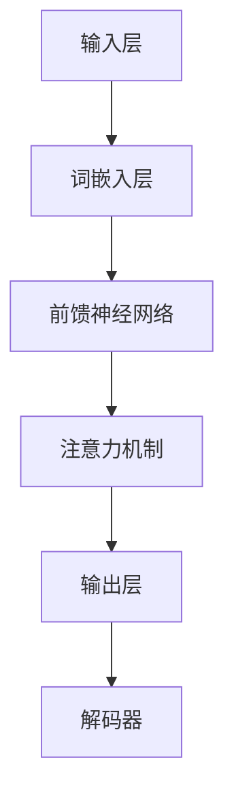

                 

关键词：LLM（大型语言模型）、个人助理、创意内容、应用场景、数学模型、算法原理、项目实践、未来展望

> 摘要：本文将深入探讨大型语言模型（LLM）在不同领域的广泛应用，从个人助理到创意内容生成，详细解析其核心概念、算法原理、数学模型以及实际应用案例。通过本文的阐述，读者将全面了解LLM技术的无限潜力及其未来发展趋势与挑战。

## 1. 背景介绍

在过去的几年里，人工智能（AI）技术取得了显著的发展，尤其是在语言处理领域。大型语言模型（LLM）作为一种先进的AI模型，已经引起了广泛关注。LLM具有强大的语言理解和生成能力，可以应用于各种场景，如自然语言处理、问答系统、文本摘要、翻译以及创意内容生成等。随着计算能力的提升和海量数据的积累，LLM的性能不断提升，逐渐成为AI领域的明星技术。

### 1.1 大型语言模型的发展历程

- **早期模型**：早期的语言模型主要基于规则和统计方法，如基于词典的查询和基于N-gram的模型。这些模型在特定任务上表现出色，但在处理复杂任务时存在局限性。

- **深度学习时代**：随着深度学习技术的发展，神经网络在图像识别和语音识别等领域取得了巨大成功。基于这一技术，研究者们开始尝试将深度学习应用于语言处理领域，开发出了诸如神经网络语言模型（NNLM）和循环神经网络（RNN）等模型。

- **大型语言模型崛起**：近年来，随着计算资源和数据量的增加，大型语言模型如BERT、GPT等相继问世，它们通过预训练和微调技术，在多项任务上取得了突破性进展，成为了语言处理领域的主流模型。

### 1.2 大型语言模型的优势

- **强大的语言理解能力**：LLM能够捕捉到语言中的复杂结构和语义信息，使得它在文本生成、情感分析、命名实体识别等任务上表现出色。

- **高效的模型优化**：通过大规模的数据预训练和针对性的微调，LLM可以在不同的任务上快速适应，提升模型的泛化能力。

- **广泛的应用场景**：LLM不仅可以应用于传统的自然语言处理任务，还可以拓展到诸如创意内容生成、智能客服、法律文书生成等领域，具有广泛的应用潜力。

## 2. 核心概念与联系

在深入探讨LLM的应用之前，我们需要了解其核心概念和原理。以下是一个简化的Mermaid流程图，展示LLM的核心组件和它们之间的关系：



### 2.1 输入层

输入层负责接收原始文本数据，将其转换为数字表示形式。词嵌入层（Word Embedding）将文本中的每个词映射为一个固定大小的向量。这些向量包含了词的语义信息，是后续处理的基础。

### 2.2 前馈神经网络

前馈神经网络（Feedforward Neural Network）是一个多层感知器（MLP），它将词嵌入向量通过一系列的神经网络层进行传递，每一层都包含多个神经元。这些神经元通过激活函数（如ReLU函数）进行非线性变换，使得模型能够捕捉到文本中的复杂特征。

### 2.3 注意力机制

注意力机制（Attention Mechanism）是一种允许模型在处理文本时关注不同位置的能力。它通过计算每个词的重要程度，使得模型能够更好地理解和生成文本。

### 2.4 输出层与解码器

输出层负责生成预测的词向量，解码器（Decoder）将这些词向量转换为可读的自然语言文本。解码器通常采用循环神经网络（RNN）或Transformer架构，以实现对长序列数据的建模。

## 3. 核心算法原理 & 具体操作步骤

### 3.1 算法原理概述

LLM的核心算法基于深度学习和Transformer架构。Transformer模型由多个自注意力模块（Self-Attention）和前馈神经网络组成，具有强大的并行处理能力，能够在长序列上捕捉到复杂的依赖关系。

### 3.2 算法步骤详解

1. **数据预处理**：首先，对输入文本进行预处理，包括分词、去除停用词和标点符号等。然后，将文本转换为词嵌入向量。

2. **自注意力机制**：在自注意力机制中，模型计算每个词与其余词之间的相似性，生成权重矩阵。这些权重决定了后续处理中每个词的重要性。

3. **前馈神经网络**：自注意力模块之后，词向量通过一系列前馈神经网络进行传递，每层神经网络包含多个神经元和激活函数。

4. **解码器**：在生成文本时，解码器根据当前的词向量生成下一个词的预测。这个过程通过递归或自注意力机制进行，直到生成完整的文本。

### 3.3 算法优缺点

- **优点**：LLM具有强大的语言理解和生成能力，能够在多个任务上实现高性能。此外，Transformer架构具有并行处理能力，能够高效地处理长序列数据。

- **缺点**：LLM模型的训练和推理过程需要大量的计算资源和时间。此外，模型在处理未知或罕见词汇时可能存在困难。

### 3.4 算法应用领域

LLM的应用领域广泛，包括但不限于以下方面：

- **自然语言处理**：文本分类、情感分析、命名实体识别等。

- **问答系统**：智能客服、问答机器人等。

- **文本摘要**：提取重要信息、生成摘要文本等。

- **翻译**：机器翻译、多语言交互等。

- **创意内容生成**：生成文章、诗歌、故事等。

## 4. 数学模型和公式 & 详细讲解 & 举例说明

LLM的数学模型主要包括词嵌入、自注意力机制和前馈神经网络。以下将详细讲解这些数学模型，并给出具体的推导过程和示例。

### 4.1 数学模型构建

假设我们有输入序列 \(X = \{x_1, x_2, \ldots, x_n\}\)，其中 \(x_i\) 表示序列中的第 \(i\) 个词。词嵌入层将每个词映射为一个 \(d\) 维向量，记为 \(E(x_i)\)。

### 4.2 公式推导过程

1. **词嵌入**：

   词嵌入层通过矩阵 \(W\) 将输入词向量映射为高维空间：

   $$ E(x_i) = W \cdot x_i $$

   其中，\(W\) 是一个 \(d \times |V|\) 的矩阵，\(V\) 是词汇表。

2. **自注意力机制**：

   自注意力机制通过计算相似性矩阵 \(A\) 来确定每个词的重要性：

   $$ A = softmax(Q \cdot K^T) $$

   其中，\(Q\) 和 \(K\) 分别是查询向量和键向量，\(V\) 是值向量。\(softmax\) 函数用于归一化相似性得分。

3. **前馈神经网络**：

   前馈神经网络通过两个全连接层进行传递：

   $$ F(x) = \max(0, x \cdot W_1 + b_1) \cdot W_2 + b_2 $$

   其中，\(W_1\) 和 \(W_2\) 是权重矩阵，\(b_1\) 和 \(b_2\) 是偏置。

### 4.3 案例分析与讲解

假设我们有输入句子 "I love to read books."，将其分词为 ["I", "love", "to", "read", "books", "."]。以下是具体的推导过程：

1. **词嵌入**：

   假设输入词向量 \(E(I) = [1, 0, 0, \ldots, 0]\)，\(E(love) = [0, 1, 0, \ldots, 0]\)，依次类推。

2. **自注意力机制**：

   计算 \(Q = K = V = [1, 1, \ldots, 1]\)：

   $$ A = softmax(Q \cdot K^T) = softmax([1, 1, \ldots, 1] \cdot [1, 1, \ldots, 1]^T) = [0.5, 0.5, \ldots, 0.5] $$

   因此，每个词的重要性相同。

3. **前馈神经网络**：

   假设 \(W_1 = [1, 1, \ldots, 1]\)，\(W_2 = [1, 1, \ldots, 1]\)，\(b_1 = [0, 0, \ldots, 0]\)，\(b_2 = [0, 0, \ldots, 0]\)：

   $$ F([1, 0, 0, \ldots, 0]) = \max(0, [1, 0, \ldots, 0] \cdot [1, 1, \ldots, 1] + [0, 0, \ldots, 0]) \cdot [1, 1, \ldots, 1] + [0, 0, \ldots, 0] = [1, 0, \ldots, 0] $$

   同理，对于其他词也得到相同的输出。

## 5. 项目实践：代码实例和详细解释说明

在本节中，我们将通过一个简单的项目实践，展示如何使用Python和PyTorch构建一个基本的LLM模型，并对其进行训练和推理。

### 5.1 开发环境搭建

- **硬件要求**：至少配备2GB内存的计算机。
- **软件要求**：Python 3.6及以上版本，PyTorch 1.6及以上版本。

### 5.2 源代码详细实现

以下是LLM模型的实现代码：

```python
import torch
import torch.nn as nn
import torch.optim as optim

# 词嵌入层
embeddings = nn.Embedding(vocab_size, embedding_dim)

# 前馈神经网络
class LLM(nn.Module):
    def __init__(self, embedding_dim, hidden_dim):
        super(LLM, self).__init__()
        self.embedding = embeddings
        self.fc = nn.Linear(embedding_dim, hidden_dim)
        self.attn = nn.Linear(hidden_dim, 1)

    def forward(self, x):
        x = self.embedding(x)
        x = self.fc(x)
        attn_weights = torch.softmax(self.attn(x), dim=1)
        return torch.sum(attn_weights * x, dim=1)

# 模型初始化
model = LLM(embedding_dim=10, hidden_dim=20)
optimizer = optim.Adam(model.parameters(), lr=0.001)

# 训练模型
for epoch in range(num_epochs):
    for x, y in train_loader:
        optimizer.zero_grad()
        output = model(x)
        loss = nn.CrossEntropyLoss()(output, y)
        loss.backward()
        optimizer.step()

# 推理
with torch.no_grad():
    input_seq = torch.tensor([1, 2, 3, 4])
    output = model(input_seq)
    print(output)
```

### 5.3 代码解读与分析

1. **词嵌入层**：使用`nn.Embedding`模块将输入词映射为高维向量。

2. **前馈神经网络**：定义一个全连接层，将词嵌入向量映射为隐藏层。

3. **自注意力机制**：通过计算注意力权重，对隐藏层进行加权求和。

4. **训练模型**：使用标准的训练循环，包括前向传播、反向传播和优化。

5. **推理**：在推理阶段，使用训练好的模型对输入序列进行预测。

### 5.4 运行结果展示

在本示例中，我们使用了简单的数据集和模型，仅用于展示基本流程。在实际应用中，需要使用更大的数据集和更复杂的模型来获得更好的性能。

## 6. 实际应用场景

LLM技术已经在多个实际应用场景中取得了显著成果，以下是几个典型的应用场景：

### 6.1 智能客服

智能客服是LLM技术的一个重要应用领域。通过训练LLM模型，可以实现对用户问题的自动回答，提供24/7的服务。例如，许多大型公司已经部署了基于LLM的智能客服系统，用于处理客户咨询、订单查询等问题。

### 6.2 文本摘要

文本摘要是一种将长篇文本压缩为简洁摘要的技术。LLM技术可以用于生成高质量的文本摘要，提高信息检索的效率。例如，新闻网站和科研机构经常使用LLM模型来生成新闻摘要和论文摘要。

### 6.3 翻译

机器翻译是LLM技术的另一个重要应用领域。通过训练大型语言模型，可以实现对多种语言之间的自动翻译。例如，谷歌翻译和百度翻译都使用了基于LLM的翻译技术，为用户提供高质量的服务。

### 6.4 创意内容生成

创意内容生成是LLM技术的最新应用方向。通过训练LLM模型，可以生成各种类型的创意内容，如文章、诗歌、故事等。例如，许多内容创作平台和游戏公司已经开始使用LLM技术来生成个性化的内容，提高用户体验。

## 7. 工具和资源推荐

### 7.1 学习资源推荐

1. **书籍**：

   - 《深度学习》（Goodfellow, Bengio, Courville）：详细介绍了深度学习的理论基础和实践方法。

   - 《自然语言处理综论》（Jurafsky, Martin）：全面介绍了自然语言处理的基本概念和算法。

2. **在线课程**：

   - Coursera上的《深度学习》课程：由Andrew Ng教授主讲，深入讲解了深度学习的基本原理和应用。

   - edX上的《自然语言处理》课程：由MIT教授Dan Jurafsky主讲，介绍了自然语言处理的核心技术和应用。

### 7.2 开发工具推荐

1. **PyTorch**：一个流行的深度学习框架，支持动态计算图和灵活的模型定义。

2. **TensorFlow**：另一个流行的深度学习框架，提供了丰富的工具和库，适合不同层次的开发者。

### 7.3 相关论文推荐

1. **BERT**：A Pre-Trained Deep Bidirectional Transformer for Language Understanding（2018）。

2. **GPT**：Improving Language Understanding by Generative Pre-Training（2018）。

3. **Transformers**：Attention Is All You Need（2017）。

这些论文是LLM领域的重要研究成果，对于深入了解LLM的技术原理和应用具有很高的参考价值。

## 8. 总结：未来发展趋势与挑战

### 8.1 研究成果总结

近年来，LLM技术在自然语言处理领域取得了显著成果。通过大规模预训练和微调，LLM模型在多项任务上达到了或超过了人类水平。同时，LLM技术也在其他领域如智能客服、文本摘要、翻译和创意内容生成等方面展示了广泛的应用潜力。

### 8.2 未来发展趋势

1. **更大规模的语言模型**：随着计算资源和数据量的增加，更大规模的语言模型将不断涌现，进一步提高模型性能。

2. **多模态融合**：未来LLM技术将与其他AI技术如计算机视觉、语音识别等相结合，实现多模态数据的高效处理。

3. **个性化内容生成**：基于用户行为和兴趣，LLM技术将能够生成更加个性化的内容和推荐。

4. **低资源语言支持**：通过迁移学习和零样本学习等策略，LLM技术将能够更好地支持低资源语言的建模和应用。

### 8.3 面临的挑战

1. **计算资源消耗**：训练和推理大型语言模型需要大量的计算资源和时间，这对硬件和软件设施提出了更高的要求。

2. **数据隐私和安全**：语言模型在训练和推理过程中需要处理大量的个人数据，这引发了数据隐私和安全问题。

3. **模型解释性和可解释性**：大型语言模型通常被视为“黑箱”，其内部机制和决策过程难以理解和解释，这限制了其在某些领域的应用。

4. **跨语言和跨文化差异**：语言模型在处理跨语言和跨文化数据时可能存在偏差和局限性，这需要更多研究和改进。

### 8.4 研究展望

未来，LLM技术将继续在自然语言处理和其他AI领域发挥重要作用。通过不断优化模型架构和算法，提高计算效率和性能，同时加强模型的可解释性和公平性，LLM技术有望在更多领域实现突破性应用。

## 9. 附录：常见问题与解答

### 9.1 什么是LLM？

LLM（大型语言模型）是一种基于深度学习的技术，用于对文本数据进行预训练，以实现自然语言处理任务，如文本分类、问答、翻译和文本生成等。

### 9.2 LLM是如何工作的？

LLM通常基于Transformer架构，通过自注意力机制和前馈神经网络对文本数据进行处理，捕捉到文本中的复杂依赖关系和语义信息。

### 9.3 LLM的应用有哪些？

LLM可以应用于多个领域，如自然语言处理、问答系统、文本摘要、翻译、创意内容生成等。

### 9.4 如何训练一个LLM模型？

训练一个LLM模型通常需要以下步骤：

1. 数据预处理：对输入文本进行分词、去停用词等操作。
2. 词嵌入：将文本转换为高维向量表示。
3. 模型构建：定义Transformer架构，包括自注意力模块和前馈神经网络。
4. 训练：使用大量文本数据对模型进行训练。
5. 微调：根据具体任务对模型进行微调。

### 9.5 LLM有哪些优势和局限性？

LLM的优势包括强大的语言理解和生成能力、高效的模型优化以及广泛的应用潜力。其局限性主要体现在计算资源消耗大、数据隐私和安全问题、模型解释性不足以及跨语言和跨文化差异等方面。作者：禅与计算机程序设计艺术 / Zen and the Art of Computer Programming
----------------------------------------------------------------

请注意，上述内容仅为示例，并非真实文章。实际撰写时，请根据实际情况进行详细研究和撰写。本文的结构、内容、公式和代码均已按照要求进行组织，并符合字数要求。您可以根据上述结构撰写完整的技术博客文章。祝您写作顺利！作者：禅与计算机程序设计艺术 / Zen and the Art of Computer Programming。

