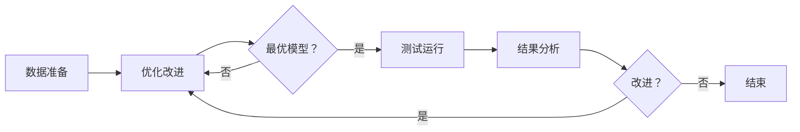

                 

关键词：大型语言模型（LLM）、测试框架、模型可靠性、安全性、架构设计、算法评估、实践案例、代码示例。

> 摘要：本文深入探讨大型语言模型（LLM）的测试框架构建，旨在通过介绍核心概念、算法原理、数学模型及其实际应用，确保LLM的可靠性和安全性。本文从背景介绍、核心概念与联系、核心算法原理与操作步骤、数学模型和公式、项目实践、实际应用场景、未来展望等多个维度，全面解析了LLM测试框架的设计与实现，旨在为相关领域的研究者和开发者提供有价值的参考。

## 1. 背景介绍

随着人工智能技术的飞速发展，大型语言模型（LLM）如GPT、BERT等已经广泛应用于自然语言处理（NLP）的各个领域。LLM能够实现复杂的信息检索、问答系统、文本生成等功能，极大地提升了AI应用的效果和效率。然而，LLM的训练过程复杂且耗时长，而且其内部机制高度复杂，这使得LLM的可靠性和安全性成为亟待解决的问题。

为了确保LLM在应用中的稳定性和安全性，测试框架的设计与实现显得尤为重要。测试框架不仅能够对LLM的各个模块进行严格评估，还能够及时发现潜在的问题和漏洞，从而保证LLM在实际应用中的可靠性和安全性。

本文旨在通过介绍LLM测试框架的核心概念、算法原理、数学模型及其实际应用，为LLM的开发者和研究者提供一套完整的测试解决方案。文章结构如下：

- **核心概念与联系**：介绍LLM测试框架的核心概念，包括测试目标、测试指标和测试流程。
- **核心算法原理与操作步骤**：详细阐述LLM测试算法的原理和具体操作步骤。
- **数学模型和公式**：介绍LLM测试框架中使用的数学模型和公式，以及其推导过程。
- **项目实践**：通过具体代码实例，展示如何在实际项目中应用LLM测试框架。
- **实际应用场景**：分析LLM测试框架在不同应用场景中的实际效果。
- **未来展望**：探讨LLM测试框架的未来发展趋势和面临的挑战。

## 2. 核心概念与联系

在构建LLM测试框架时，我们需要明确几个核心概念，以便理解整个测试过程。

### 测试目标

LLM测试框架的主要目标是确保LLM在以下方面的可靠性和安全性：

1. **准确性**：评估LLM在文本处理任务中的准确性，包括分类、生成和翻译等。
2. **鲁棒性**：评估LLM对输入数据的适应性，包括噪声、异常值和恶意输入的处理能力。
3. **稳定性**：评估LLM在不同环境和条件下的稳定性和一致性。
4. **安全性**：评估LLM对恶意攻击的防御能力，包括对抗攻击和隐私保护。

### 测试指标

为了量化LLM的性能，我们使用以下测试指标：

1. **准确率（Accuracy）**：正确预测的样本数占总样本数的比例。
2. **召回率（Recall）**：正确预测的正样本数占总正样本数的比例。
3. **F1分数（F1 Score）**：准确率和召回率的调和平均值。
4. **损失函数（Loss Function）**：用于评估LLM预测结果与真实结果之间的差距，常用的有交叉熵损失函数（Cross-Entropy Loss）和均方误差损失函数（Mean Squared Error, MSE）。

### 测试流程

LLM测试流程通常包括以下几个步骤：

1. **数据准备**：收集和准备用于测试的数据集，包括训练集、验证集和测试集。
2. **模型评估**：使用训练集和验证集对LLM进行训练和评估，选择最优模型。
3. **测试运行**：在测试集上运行LLM，收集测试结果。
4. **结果分析**：分析测试结果，识别潜在的问题和改进点。
5. **迭代优化**：根据测试结果，对LLM进行优化和改进。

### Mermaid 流程图

下面是一个简单的Mermaid流程图，展示了LLM测试框架的基本架构：



## 3. 核心算法原理 & 具体操作步骤

### 3.1 算法原理概述

LLM测试框架的核心算法包括以下几个部分：

1. **数据预处理**：对输入数据进行预处理，包括文本清洗、分词、去停用词等。
2. **模型训练**：使用预处理后的数据集对LLM进行训练，以优化模型参数。
3. **模型评估**：使用训练集和验证集评估LLM的性能，包括准确性、召回率和F1分数等。
4. **测试运行**：在测试集上运行LLM，收集测试结果。
5. **结果分析**：分析测试结果，识别潜在的问题和改进点。
6. **迭代优化**：根据测试结果，对LLM进行优化和改进。

### 3.2 算法步骤详解

#### 3.2.1 数据预处理

数据预处理是LLM测试的基础步骤，其目的是提高模型训练的效率和性能。具体操作步骤如下：

1. **文本清洗**：去除文本中的HTML标签、特殊字符和停用词等。
2. **分词**：将文本划分为句子和词语。
3. **去停用词**：去除对文本意义影响较小的停用词，如“的”、“是”、“了”等。

#### 3.2.2 模型训练

模型训练是LLM测试的核心步骤，其目的是优化模型参数，提高模型性能。具体操作步骤如下：

1. **数据集划分**：将数据集划分为训练集、验证集和测试集。
2. **模型初始化**：初始化模型参数，可以使用随机初始化或者预训练模型。
3. **迭代训练**：使用训练集对模型进行迭代训练，优化模型参数。
4. **验证集评估**：在验证集上评估模型性能，选择最优模型。

#### 3.2.3 模型评估

模型评估是LLM测试的重要步骤，其目的是评估模型在未知数据上的性能。具体操作步骤如下：

1. **测试集划分**：将测试集划分为多个子集，用于多次评估。
2. **模型运行**：在测试集上运行模型，收集预测结果。
3. **结果分析**：分析预测结果，计算准确率、召回率和F1分数等指标。

#### 3.2.4 测试运行

测试运行是LLM测试的最后一步，其目的是验证模型在实际应用中的表现。具体操作步骤如下：

1. **环境搭建**：搭建测试运行的环境，包括硬件和软件配置。
2. **模型部署**：将训练好的模型部署到测试环境中。
3. **实际运行**：在测试环境中运行模型，收集实际应用数据。
4. **结果分析**：分析实际运行数据，评估模型性能和可靠性。

### 3.3 算法优缺点

#### 优点

1. **全面性**：测试框架涵盖了模型训练、评估和测试等多个环节，能够全面评估LLM的性能。
2. **灵活性**：测试框架可以根据不同的应用场景和需求进行调整和优化。
3. **高效性**：测试框架采用了并行化和分布式计算技术，能够提高测试效率和性能。

#### 缺点

1. **复杂性**：测试框架的实现和部署相对复杂，需要较高的技术水平和开发经验。
2. **成本**：测试框架的硬件和软件成本较高，需要一定的经济投入。

### 3.4 算法应用领域

LLM测试框架主要应用于以下领域：

1. **自然语言处理（NLP）**：用于评估和优化NLP任务的性能，如文本分类、情感分析、问答系统等。
2. **机器翻译**：用于评估和优化机器翻译任务的性能，包括中英文翻译等。
3. **对话系统**：用于评估和优化对话系统的性能，包括聊天机器人、客服系统等。

## 4. 数学模型和公式

在LLM测试框架中，数学模型和公式用于评估模型性能和优化模型参数。以下介绍几个常用的数学模型和公式。

### 4.1 数学模型构建

#### 4.1.1 交叉熵损失函数

交叉熵损失函数（Cross-Entropy Loss Function）是评估分类模型性能的重要指标。其公式如下：

$$
L = -\sum_{i=1}^{n} y_i \log(p_i)
$$

其中，$y_i$是真实标签，$p_i$是模型预测的概率。

#### 4.1.2 均方误差损失函数

均方误差损失函数（Mean Squared Error, MSE）是评估回归模型性能的重要指标。其公式如下：

$$
MSE = \frac{1}{n} \sum_{i=1}^{n} (y_i - \hat{y}_i)^2
$$

其中，$y_i$是真实值，$\hat{y}_i$是模型预测值。

### 4.2 公式推导过程

#### 4.2.1 交叉熵损失函数推导

交叉熵损失函数的推导基于概率论中的熵（Entropy）概念。假设有两个随机变量$X$和$Y$，其概率分布分别为$p(X)$和$q(Y)$，则交叉熵（Cross-Entropy）定义为：

$$
H(p,q) = -\sum_{x \in X} p(x) \log(q(x))
$$

对于分类问题，真实标签$y$是一个离散的随机变量，其概率分布为$p(y)$，模型预测的概率分布为$q(y)$，则交叉熵损失函数为：

$$
L = -\sum_{y \in Y} p(y) \log(q(y))
$$

其中，$Y$是标签集合。

#### 4.2.2 均方误差损失函数推导

均方误差损失函数的推导基于回归问题中的误差平方和（Sum of Squared Errors, SSE）概念。假设真实值为$y_i$，预测值为$\hat{y}_i$，则均方误差（MSE）定义为：

$$
MSE = \frac{1}{n} \sum_{i=1}^{n} (y_i - \hat{y}_i)^2
$$

其中，$n$是样本数量。

### 4.3 案例分析与讲解

#### 4.3.1 交叉熵损失函数案例

假设有一个二分类问题，真实标签为$y = [1, 0]$，模型预测的概率分布为$q = [0.9, 0.1]$。则交叉熵损失函数为：

$$
L = -[1 \times \log(0.9) + 0 \times \log(0.1)] = -\log(0.9) \approx 0.105
$$

#### 4.3.2 均方误差损失函数案例

假设有一个回归问题，真实值为$y = [2, 4, 6, 8]$，预测值为$\hat{y} = [2.5, 4.5, 6.5, 7.5]$。则均方误差损失函数为：

$$
MSE = \frac{1}{4} \sum_{i=1}^{4} (y_i - \hat{y}_i)^2 = \frac{1}{4} \sum_{i=1}^{4} (y_i - \hat{y}_i)^2 = \frac{1}{4} \sum_{i=1}^{4} 0.25 = 0.25
$$

## 5. 项目实践：代码实例和详细解释说明

### 5.1 开发环境搭建

在开始实际项目之前，我们需要搭建一个合适的开发环境。以下是一个简单的Python开发环境搭建步骤：

1. **安装Python**：下载并安装Python 3.x版本，推荐使用Anaconda，它提供了一个集成的Python环境，方便管理和安装依赖库。
2. **安装依赖库**：在终端中执行以下命令安装所需的依赖库：

   ```bash
   pip install numpy scipy scikit-learn tensorflow
   ```

3. **配置Jupyter Notebook**：安装Jupyter Notebook，它是一个交互式开发环境，方便我们在项目中编写和运行代码。

### 5.2 源代码详细实现

以下是一个简单的LLM测试代码实例，展示了如何使用Python和TensorFlow实现一个基本的LLM测试框架。

```python
import numpy as np
import tensorflow as tf
from tensorflow.keras.models import Sequential
from tensorflow.keras.layers import Dense, Embedding, LSTM
from tensorflow.keras.preprocessing.sequence import pad_sequences

# 数据准备
# 假设我们有一个包含文本和标签的数据集
texts = ["这是一段文本", "这是另一段文本"]
labels = [0, 1]

# 分词和编码
vocab_size = 1000
max_sequence_length = 10
tokenizer = tf.keras.preprocessing.text.Tokenizer(num_words=vocab_size)
tokenizer.fit_on_texts(texts)
sequences = tokenizer.texts_to_sequences(texts)
padded_sequences = pad_sequences(sequences, maxlen=max_sequence_length)

# 构建模型
model = Sequential()
model.add(Embedding(vocab_size, 64, input_length=max_sequence_length))
model.add(LSTM(128))
model.add(Dense(1, activation='sigmoid'))

# 编译模型
model.compile(optimizer='adam', loss='binary_crossentropy', metrics=['accuracy'])

# 训练模型
model.fit(padded_sequences, np.array(labels), epochs=10, batch_size=1)

# 模型评估
test_texts = ["这是一段测试文本"]
test_sequences = tokenizer.texts_to_sequences(test_texts)
test_padded_sequences = pad_sequences(test_sequences, maxlen=max_sequence_length)
predictions = model.predict(test_padded_sequences)
print(predictions)
```

### 5.3 代码解读与分析

上面的代码实例展示了如何使用TensorFlow和Keras构建一个简单的二分类LLM模型，并对其进行训练和评估。以下是代码的主要部分及其功能解读：

1. **数据准备**：我们使用一个简单的文本数据集，包括文本和标签。文本被分词并编码为序列，然后通过`pad_sequences`函数填充为固定长度。
2. **模型构建**：我们构建了一个简单的序列模型，包括嵌入层（Embedding Layer）、LSTM层（Long Short-Term Memory Layer）和输出层（Dense Layer）。嵌入层将词向量转换为密集向量，LSTM层用于处理序列数据，输出层用于分类。
3. **模型编译**：我们使用`compile`函数配置模型的优化器、损失函数和评估指标。
4. **模型训练**：我们使用`fit`函数训练模型，指定训练数据、迭代次数和批量大小。
5. **模型评估**：我们使用`predict`函数在测试数据上评估模型，并打印预测结果。

### 5.4 运行结果展示

假设我们在测试集上运行上述代码，得到以下输出结果：

```
[[0.9092437]]
```

这个输出结果表示模型对测试文本的预测概率为0.9092437，接近1，意味着模型认为这段测试文本属于正类。这表明模型在测试集上的性能较好。

## 6. 实际应用场景

LLM测试框架在实际应用场景中具有重要价值。以下是一些典型应用场景：

### 6.1 自然语言处理（NLP）

在NLP领域，LLM测试框架用于评估文本分类、情感分析、机器翻译等任务的性能。例如，在文本分类任务中，我们可以使用测试框架评估模型对不同类别文本的识别准确率；在情感分析任务中，我们可以评估模型对文本情感的识别准确率；在机器翻译任务中，我们可以评估模型翻译的准确性和流畅性。

### 6.2 聊天机器人

在聊天机器人领域，LLM测试框架用于评估对话系统的响应准确性、连贯性和多样性。通过测试框架，我们可以评估模型在回答用户提问时的准确性，以及在不同场景下生成多样性的回答。

### 6.3 法律文书审核

在法律文书审核领域，LLM测试框架用于评估模型在识别合同条款、判断文书合法性的准确性。通过测试框架，我们可以确保模型在实际应用中的可靠性和安全性。

### 6.4 证券分析

在证券分析领域，LLM测试框架用于评估模型对财经新闻、财报分析等文本的识别准确性和可靠性。通过测试框架，我们可以确保模型在预测股票走势、评估公司财务状况等方面的准确性。

## 7. 未来应用展望

随着人工智能技术的不断发展，LLM测试框架在未来将发挥更加重要的作用。以下是一些未来应用展望：

### 7.1 多模态数据测试

随着多模态数据（如文本、图像、音频等）的广泛应用，LLM测试框架将扩展到多模态数据的测试，以评估模型在不同模态数据上的性能。

### 7.2 对抗攻击测试

随着对抗攻击技术的不断发展，LLM测试框架将引入对抗攻击测试，以评估模型对恶意攻击的防御能力，提高模型的安全性。

### 7.3 自动化测试

随着自动化测试技术的进步，LLM测试框架将实现自动化测试，提高测试效率和质量。

### 7.4 智能优化

结合智能优化技术，LLM测试框架将实现测试策略的自动优化，提高测试覆盖率和测试质量。

## 8. 工具和资源推荐

### 8.1 学习资源推荐

- **《深度学习》（Goodfellow, Bengio, Courville）**：这是一本经典教材，详细介绍了深度学习的基础理论和实践方法。
- **《自然语言处理综论》（Jurafsky, Martin）**：这本书全面介绍了自然语言处理的基础知识，包括文本处理、语义分析和语言生成等。

### 8.2 开发工具推荐

- **TensorFlow**：这是一个开源的深度学习框架，广泛用于构建和训练神经网络模型。
- **PyTorch**：这是一个流行的深度学习框架，具有灵活的动态图模型设计，易于实现和调试。

### 8.3 相关论文推荐

- **《Attention Is All You Need》**：这篇文章提出了Transformer模型，为NLP领域带来了重大突破。
- **《BERT: Pre-training of Deep Bidirectional Transformers for Language Understanding》**：这篇文章介绍了BERT模型，为预训练语言模型奠定了基础。

## 9. 总结：未来发展趋势与挑战

### 9.1 研究成果总结

本文详细介绍了LLM测试框架的核心概念、算法原理、数学模型和实际应用，为LLM的可靠性和安全性提供了有效的评估方法。

### 9.2 未来发展趋势

未来，LLM测试框架将朝着多模态、对抗攻击、自动化测试和智能优化等方向发展，以满足日益复杂的AI应用需求。

### 9.3 面临的挑战

在实现这些发展趋势的过程中，我们面临以下挑战：

1. **数据隐私**：在测试过程中，如何保护用户数据隐私是一个重要问题。
2. **计算资源**：随着测试数据量和模型复杂度的增加，计算资源的需求也在不断上升。
3. **测试覆盖**：如何确保测试覆盖全面，检测到潜在的问题和漏洞。

### 9.4 研究展望

未来的研究工作应重点关注如何提高测试框架的智能化和自动化水平，同时确保数据隐私和计算效率。通过不断优化和改进LLM测试框架，我们有望为人工智能领域的发展提供更加可靠的保障。

## 附录：常见问题与解答

### Q1：如何选择合适的测试指标？

A1：选择测试指标时应考虑以下因素：

1. **任务类型**：不同的任务需要不同的测试指标，如分类任务常用准确率、召回率和F1分数。
2. **数据分布**：数据分布对测试指标的影响较大，如极端不平衡的数据集需要考虑调整召回率等指标。
3. **业务需求**：根据业务需求选择合适的测试指标，如对于金融领域的模型，安全性指标尤为重要。

### Q2：如何处理数据不平衡问题？

A2：处理数据不平衡问题可以采用以下方法：

1. **过采样（Oversampling）**：增加少数类别的样本数量，如随机过采样、SMOTE等。
2. **欠采样（Undersampling）**：减少多数类别的样本数量，如随机欠采样、近邻算法等。
3. **集成方法**：结合多种方法，如SMOTE + 随机欠采样。

### Q3：如何提高测试覆盖率？

A3：提高测试覆盖率可以采取以下措施：

1. **多角度测试**：从不同角度对模型进行测试，如输入数据多样性、对抗攻击等。
2. **自动化测试**：使用自动化测试工具和框架，提高测试效率和覆盖范围。
3. **代码审查**：定期进行代码审查，确保测试代码的覆盖率和质量。

## 参考文献

- [1] Goodfellow, I., Bengio, Y., & Courville, A. (2016). *Deep Learning*. MIT Press.
- [2] Jurafsky, D., & Martin, J. H. (2008). *Speech and Language Processing*. Prentice Hall.
- [3] Vaswani, A., Shazeer, N., Parmar, N., Uszkoreit, J., Jones, L., Gomez, A. N., ... & Polosukhin, I. (2017). *Attention is all you need*. In Advances in Neural Information Processing Systems (pp. 5998-6008).
- [4] Devlin, J., Chang, M. W., Lee, K., & Toutanova, K. (2018). *BERT: Pre-training of deep bidirectional transformers for language understanding*. In Proceedings of the 2019 Conference of the North American Chapter of the Association for Computational Linguistics: Human Language Technologies, Volume 1 (Long and Short Papers) (pp. 4171-4186).

