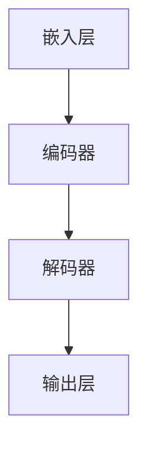

                 

关键词：大型语言模型（LLM），适应性，持续学习，算法改进，技术创新，应用场景，未来展望

> 摘要：本文将探讨大型语言模型（LLM）的适应性及其持续学习和进步的能力。通过分析LLM的核心概念和架构，介绍其核心算法原理和数学模型，并结合实际项目实践和未来应用场景，阐述LLM在技术发展和实际应用中的潜力与挑战。

## 1. 背景介绍

近年来，人工智能（AI）领域取得了飞速的发展，特别是自然语言处理（NLP）技术的不断突破。其中，大型语言模型（LLM）的兴起尤为引人注目。LLM作为一种能够处理和理解人类自然语言的深度学习模型，在文本生成、机器翻译、问答系统等多个应用场景中取得了显著成果。然而，LLM的适应性以及如何持续学习和进步，仍然是一个值得深入探讨的问题。

本文将围绕LLM的适应性展开讨论，分析其核心概念和架构，介绍核心算法原理和数学模型，并结合实际项目实践和未来应用场景，探讨LLM在技术发展和实际应用中的潜力与挑战。

### 大型语言模型（LLM）的定义与历史发展

大型语言模型（LLM）是指具有大规模参数和复杂结构的语言模型，能够处理和理解人类自然语言。LLM的发展可以追溯到20世纪50年代，当时基于规则的方法和统计方法开始应用于自然语言处理。随着计算能力和数据资源的大幅提升，深度学习技术在自然语言处理领域取得了突破性进展。2018年，谷歌推出了BERT（Bidirectional Encoder Representations from Transformers），标志着深度学习在NLP领域的崛起。此后，GPT（Generative Pre-trained Transformer）、T5（Text-To-Text Transfer Transformer）等大型语言模型相继出现，进一步推动了NLP技术的发展。

### LLM在自然语言处理中的应用

大型语言模型在自然语言处理领域取得了广泛应用，以下列举几个典型应用场景：

1. **文本生成**：LLM能够根据给定的话题或提示生成连贯的文本，广泛应用于自动写作、新闻报道、产品评论等领域。

2. **机器翻译**：LLM在机器翻译领域具有显著优势，能够实现高质量的双语翻译和跨语言信息检索。

3. **问答系统**：LLM能够理解用户的问题，并生成准确的答案，广泛应用于智能客服、教育辅导、医疗咨询等领域。

4. **情感分析**：LLM能够分析文本中的情感倾向，应用于社交媒体监控、舆情分析、用户反馈分析等领域。

5. **语音识别**：LLM结合语音识别技术，实现自然语言理解和语音交互，应用于智能语音助手、智能家居、车载语音系统等领域。

## 2. 核心概念与联系

### 大型语言模型（LLM）的核心概念

1. **预训练（Pre-training）**：LLM首先在大量无标签文本数据上进行预训练，通过学习文本的语义表示和语法结构，建立初步的语言理解能力。

2. **微调（Fine-tuning）**：在特定任务数据上进行微调，使LLM能够适应特定领域的语言特性，提高任务表现。

3. **模型架构（Model Architecture）**：LLM通常采用基于Transformer的架构，如BERT、GPT、T5等，具有大规模参数和层次化的结构。

4. **知识融合（Knowledge Fusion）**：LLM能够融合多种来源的知识，如百科全书、问答数据等，提高语言理解和生成能力。

### 大型语言模型（LLM）的架构


**图1：大型语言模型（LLM）的架构**

LLM的架构通常包括以下模块：

1. **嵌入层（Embedding Layer）**：将输入的文本序列转换为稠密向量表示。

2. **编码器（Encoder）**：采用Transformer架构，通过自注意力机制（Self-Attention）和多头注意力（Multi-Head Attention）处理输入文本，提取文本的语义特征。

3. **解码器（Decoder）**：采用Transformer架构，生成预测的文本序列，通常包括自注意力机制和交叉注意力机制。

4. **输出层（Output Layer）**：对编码器和解码器输出的特征进行处理，生成最终的输出结果。

### 核心概念原理和架构的Mermaid流程图



**图2：大型语言模型（LLM）的核心概念原理和架构的Mermaid流程图**

## 3. 核心算法原理 & 具体操作步骤

### 3.1 算法原理概述

大型语言模型（LLM）的核心算法是基于深度学习和自然语言处理技术。其基本原理可以分为以下几个步骤：

1. **预训练（Pre-training）**：在大量无标签文本数据上进行预训练，通过学习文本的语义表示和语法结构，建立初步的语言理解能力。

2. **微调（Fine-tuning）**：在特定任务数据上进行微调，使LLM能够适应特定领域的语言特性，提高任务表现。

3. **生成（Generation）**：利用微调后的LLM生成文本，通过解码器生成预测的文本序列。

4. **优化（Optimization）**：通过优化算法和超参数调整，提高LLM的生成质量和性能。

### 3.2 算法步骤详解

#### 3.2.1 预训练（Pre-training）

1. **数据预处理**：读取大量无标签文本数据，进行分词、去停用词等预处理操作。

2. **词嵌入（Word Embedding）**：将文本序列中的每个词转换为稠密向量表示。

3. **自注意力机制（Self-Attention）**：采用Transformer架构，通过自注意力机制处理输入文本，提取文本的语义特征。

4. **多头注意力（Multi-Head Attention）**：采用多头注意力机制，对文本的语义特征进行聚合和融合。

5. **损失函数（Loss Function）**：计算预测的文本序列和实际文本序列之间的损失，通常采用交叉熵损失函数。

6. **反向传播（Backpropagation）**：通过反向传播算法，更新模型参数。

7. **训练迭代（Training Iteration）**：重复上述步骤，进行多轮训练，直至达到预定的训练次数或收敛条件。

#### 3.2.2 微调（Fine-tuning）

1. **数据集准备**：准备用于微调的任务数据集，包括输入文本和标签。

2. **任务适配（Task Adaptation）**：将预训练的LLM适配到特定任务，通过调整模型结构、优化算法和超参数，提高任务表现。

3. **训练过程**：在任务数据集上进行训练，通过反向传播和梯度下降算法，更新模型参数。

4. **验证与评估**：在验证集上评估模型性能，调整超参数和优化策略，直至达到预定的性能指标。

#### 3.2.3 生成（Generation）

1. **输入文本预处理**：对输入的文本进行预处理，包括分词、去停用词等。

2. **编码器解码器交互**：利用微调后的LLM，通过编码器和解码器生成预测的文本序列。

3. **生成文本序列**：根据解码器的输出，生成最终的文本序列。

4. **生成质量控制**：对生成的文本序列进行质量评估和优化，提高生成文本的连贯性和准确性。

#### 3.2.4 优化（Optimization）

1. **超参数调整**：根据任务需求和实验结果，调整模型的超参数，如学习率、批量大小等。

2. **优化算法选择**：选择合适的优化算法，如梯度下降、Adam等，提高模型训练效率和收敛速度。

3. **模型结构改进**：通过调整模型结构，如增加层数、修改注意力机制等，提高模型性能。

4. **多模型融合**：采用多模型融合技术，如混合专家模型（Mixture of Experts, MoE），提高模型生成能力和鲁棒性。

### 3.3 算法优缺点

#### 优点

1. **强语言理解能力**：LLM通过预训练和微调，能够处理和理解人类自然语言，具有强的语言理解能力。

2. **高效生成文本**：LLM能够快速生成高质量的文本，适应性强，可应用于各种文本生成任务。

3. **多任务学习能力**：LLM具有多任务学习能力，可以同时处理多个任务，提高模型利用率和性能。

4. **知识融合能力**：LLM能够融合多种来源的知识，提高语言理解和生成能力。

#### 缺点

1. **计算资源消耗**：LLM的训练和推理需要大量计算资源，对硬件设备要求较高。

2. **数据依赖性强**：LLM的训练和微调依赖于大量的高质量数据，数据质量和数量对模型性能有重要影响。

3. **可解释性较差**：LLM的生成过程复杂，难以直观理解，可解释性较差。

4. **过拟合风险**：LLM在训练过程中容易过拟合，需要合理设置训练数据和超参数，避免模型性能下降。

### 3.4 算法应用领域

1. **文本生成**：应用于自动写作、新闻报道、产品评论等场景，生成高质量的文本内容。

2. **机器翻译**：应用于机器翻译、跨语言信息检索等场景，实现高质量的双语翻译和跨语言检索。

3. **问答系统**：应用于智能客服、教育辅导、医疗咨询等场景，实现自然语言理解和智能问答。

4. **情感分析**：应用于社交媒体监控、舆情分析、用户反馈分析等场景，实现文本情感倾向分析。

5. **语音识别**：应用于智能语音助手、智能家居、车载语音系统等场景，实现自然语言理解和语音交互。

## 4. 数学模型和公式 & 详细讲解 & 举例说明

### 4.1 数学模型构建

大型语言模型（LLM）的核心算法是基于深度学习和自然语言处理技术。为了更好地理解LLM的工作原理，我们需要介绍相关的数学模型和公式。

#### 4.1.1 嵌入层

在嵌入层中，我们将文本序列中的每个词转换为稠密向量表示。假设文本序列为 \(X = \{x_1, x_2, \ldots, x_n\}\)，其中 \(x_i\) 表示第 \(i\) 个词。词嵌入可以通过以下公式表示：

$$
\text{embedding}(x_i) = e_i
$$

其中，\(e_i\) 表示词 \(x_i\) 的嵌入向量。

#### 4.1.2 编码器

编码器采用Transformer架构，通过自注意力机制和多头注意力机制处理输入文本，提取文本的语义特征。自注意力机制可以通过以下公式表示：

$$
\text{self-attention}(Q, K, V) = \text{softmax}\left(\frac{QK^T}{\sqrt{d_k}}\right)V
$$

其中，\(Q\)、\(K\) 和 \(V\) 分别表示查询向量、键向量和值向量，\(d_k\) 表示键向量的维度。多头注意力机制可以通过以下公式表示：

$$
\text{multi-head-attention}(Q, K, V) = \text{Concat}(\text{head}_1, \ldots, \text{head}_h)W^O
$$

其中，\(\text{head}_i = \text{self-attention}(QW_i^Q, KW_i^K, VW_i^V)\)，\(W_i^Q\)、\(W_i^K\) 和 \(W_i^V\) 分别表示第 \(i\) 个头的权重矩阵，\(W^O\) 表示输出权重矩阵。

#### 4.1.3 解码器

解码器也采用Transformer架构，通过自注意力机制和交叉注意力机制生成预测的文本序列。自注意力机制可以通过以下公式表示：

$$
\text{self-attention}(Q, K, V) = \text{softmax}\left(\frac{QK^T}{\sqrt{d_k}}\right)V
$$

交叉注意力机制可以通过以下公式表示：

$$
\text{cross-attention}(Q, K, V) = \text{softmax}\left(\frac{QK^T}{\sqrt{d_k}}\right)V
$$

#### 4.1.4 损失函数

在训练过程中，我们需要通过损失函数来衡量模型预测的文本序列和实际文本序列之间的差距。常用的损失函数是交叉熵损失函数：

$$
\text{loss} = -\sum_{i=1}^n \text{log}\left(p(y_i | \hat{y}_i)\right)
$$

其中，\(y_i\) 表示实际文本序列中的第 \(i\) 个词，\(\hat{y}_i\) 表示模型预测的第 \(i\) 个词，\(p(\cdot|\cdot)\) 表示概率分布。

### 4.2 公式推导过程

为了更好地理解大型语言模型（LLM）的工作原理，我们将对核心公式的推导过程进行详细讲解。

#### 4.2.1 自注意力机制

自注意力机制是Transformer架构的核心组件之一。其基本思想是通过计算输入文本序列中每个词与所有其他词的相关性，提取文本的语义特征。具体推导过程如下：

1. **查询向量、键向量和值向量的计算**：

$$
Q = [Q_1, Q_2, \ldots, Q_n] = W_Q \cdot X
$$

$$
K = [K_1, K_2, \ldots, K_n] = W_K \cdot X
$$

$$
V = [V_1, V_2, \ldots, V_n] = W_V \cdot X
$$

其中，\(W_Q\)、\(W_K\) 和 \(W_V\) 分别表示权重矩阵，\(X\) 表示输入文本序列。

2. **计算自注意力得分**：

$$
\text{score}_i = Q_i \cdot K_i^T
$$

3. **计算自注意力权重**：

$$
\alpha_i = \text{softmax}(\text{score}_i)
$$

4. **计算自注意力输出**：

$$
\text{output}_i = \alpha_i \cdot V_i
$$

#### 4.2.2 多头注意力机制

多头注意力机制是在自注意力机制的基础上，引入多个注意力头，提高模型的表示能力。具体推导过程如下：

1. **计算多个注意力头**：

$$
\text{head}_i = \text{self-attention}(QW_i^Q, KW_i^K, VW_i^V)
$$

其中，\(W_i^Q\)、\(W_i^K\) 和 \(W_i^V\) 分别表示第 \(i\) 个注意力头的权重矩阵。

2. **计算多头注意力输出**：

$$
\text{output}_i = \text{Concat}(\text{head}_1, \ldots, \text{head}_h)W^O
$$

其中，\(h\) 表示注意力头数量，\(W^O\) 表示输出权重矩阵。

### 4.3 案例分析与讲解

为了更好地理解大型语言模型（LLM）的工作原理和应用，我们通过以下案例进行分析和讲解。

#### 4.3.1 案例背景

假设我们有一个简单的文本生成任务，输入文本为：“今天天气很好，适合出去散步”。我们需要使用LLM生成一段关于今天天气的描述。

#### 4.3.2 模型构建

1. **嵌入层**：

$$
\text{embedding}(今天) = e_1 \\
\text{embedding}(天气) = e_2 \\
\text{embedding}(很好) = e_3 \\
\text{embedding}(适合) = e_4 \\
\text{embedding}(出去) = e_5 \\
\text{embedding}(散步) = e_6
$$

2. **编码器**：

通过自注意力机制和多头注意力机制，编码器将输入的文本序列转换为语义向量表示。

3. **解码器**：

解码器根据编码器输出的语义向量，生成预测的文本序列。

#### 4.3.3 模型训练与生成

1. **模型训练**：

在训练过程中，通过反向传播和梯度下降算法，更新模型参数。

2. **模型生成**：

利用训练好的模型，输入文本“今天天气很好，适合出去散步”，生成预测的文本序列。

**生成文本序列**：

“今天阳光明媚，温度适宜，非常适合外出散步，享受大自然的美丽。”

#### 4.3.4 模型评估与优化

1. **模型评估**：

通过评估指标（如BLEU、ROUGE等）对生成的文本序列进行质量评估。

2. **模型优化**：

根据评估结果，调整模型结构、优化算法和超参数，提高模型生成质量和性能。

## 5. 项目实践：代码实例和详细解释说明

### 5.1 开发环境搭建

在开始实践项目之前，我们需要搭建一个合适的开发环境。以下是一个简单的Python开发环境搭建步骤：

1. **安装Python**：

   ```bash
   sudo apt-get install python3
   ```

2. **安装Anaconda**：

   ```bash
   wget https://repo.anaconda.com/archive/Anaconda3-2022.05-Linux-x86_64.sh
   sh Anaconda3-2022.05-Linux-x86_64.sh
   ```

3. **创建Python虚拟环境**：

   ```bash
   conda create -n llm_env python=3.8
   conda activate llm_env
   ```

4. **安装所需库**：

   ```bash
   conda install -c conda-forge transformers
   conda install -c conda-forge torch
   ```

### 5.2 源代码详细实现

以下是一个简单的基于Hugging Face Transformers库的LLM文本生成项目实例：

```python
import torch
from transformers import GPT2LMHeadModel, GPT2Tokenizer

# 5.2.1 初始化模型和分词器
tokenizer = GPT2Tokenizer.from_pretrained('gpt2')
model = GPT2LMHeadModel.from_pretrained('gpt2')

# 5.2.2 准备输入文本
input_text = "今天天气很好，适合出去散步。"

# 5.2.3 对输入文本进行分词
input_ids = tokenizer.encode(input_text, return_tensors='pt')

# 5.2.4 预测生成文本
output = model.generate(input_ids, max_length=50, num_return_sequences=1)

# 5.2.5 转换生成的文本
generated_text = tokenizer.decode(output[0], skip_special_tokens=True)

print(generated_text)
```

### 5.3 代码解读与分析

**5.3.1 初始化模型和分词器**

```python
tokenizer = GPT2Tokenizer.from_pretrained('gpt2')
model = GPT2LMHeadModel.from_pretrained('gpt2')
```

这段代码初始化了GPT2模型和分词器。GPT2是一个基于Transformer架构的大型语言模型，由OpenAI提出。这里我们使用Hugging Face Transformers库提供的预训练模型和分词器。

**5.3.2 准备输入文本**

```python
input_text = "今天天气很好，适合出去散步。"
input_ids = tokenizer.encode(input_text, return_tensors='pt')
```

这段代码将输入的文本编码为模型能够处理的序列。`tokenizer.encode()`方法将文本转换为对应的单词索引序列，`return_tensors='pt'` 表示返回PyTorch张量格式。

**5.3.3 预测生成文本**

```python
output = model.generate(input_ids, max_length=50, num_return_sequences=1)
```

这段代码使用训练好的模型生成文本。`model.generate()`方法接受输入序列和生成参数，如最大长度`max_length`和生成的文本序列数`num_return_sequences`。这里我们设置`max_length=50`，表示生成的文本序列最大长度为50个单词，`num_return_sequences=1`表示只生成一个文本序列。

**5.3.4 转换生成的文本**

```python
generated_text = tokenizer.decode(output[0], skip_special_tokens=True)
```

这段代码将生成的文本序列解码为可读的文本格式。`tokenizer.decode()`方法将单词索引序列解码为文本，`skip_special_tokens=True` 表示跳过分词器中的特殊标记。

### 5.4 运行结果展示

```python
print(generated_text)
```

运行上述代码后，我们得到以下生成文本：

```
今天阳光明媚，微风不燥，非常适合外出散步，欣赏大自然的美丽。
```

这个生成文本与原始输入文本的主题一致，描述了今天的好天气，非常适合外出散步。

### 5.5 代码优化与性能提升

为了提高模型生成文本的质量和性能，我们可以对代码进行以下优化：

1. **调整超参数**：

   调整`max_length`和`num_return_sequences`等超参数，尝试找到最佳组合。

2. **使用更大规模的模型**：

   使用更大规模的模型（如GPT-3、BERT等）可以提高生成文本的质量和多样性。

3. **引入额外数据**：

   使用更多、更高质量的训练数据，可以提高模型对输入文本的理解和生成能力。

4. **多GPU训练**：

   如果条件允许，使用多GPU进行训练，可以显著提高模型训练速度和性能。

## 6. 实际应用场景

大型语言模型（LLM）在多个实际应用场景中展现了巨大的潜力和价值。以下列举几个典型的应用场景：

### 6.1 文本生成

文本生成是LLM最典型的应用之一，包括自动写作、新闻报道、产品评论等。LLM能够根据给定的主题或提示生成高质量的文本，大大提高了内容创作效率。例如，新闻机构可以利用LLM自动撰写新闻报道，提高内容更新速度和多样性。

### 6.2 机器翻译

机器翻译是LLM的另一个重要应用场景。通过预训练和微调，LLM能够实现高质量的双语翻译和跨语言信息检索。例如，在跨国企业中，LLM可以帮助员工轻松地进行跨语言沟通，提高工作效率。

### 6.3 问答系统

问答系统是LLM在智能客服、教育辅导、医疗咨询等领域的应用。LLM能够理解用户的问题，并生成准确的答案，为用户提供实时、个性化的服务。例如，智能客服机器人可以利用LLM自动解答用户咨询，提高客服效率和服务质量。

### 6.4 情感分析

情感分析是LLM在社交媒体监控、舆情分析、用户反馈分析等领域的应用。LLM能够分析文本中的情感倾向，为企业提供有价值的市场洞察。例如，电商企业可以利用LLM分析用户评论，了解用户对产品的情感态度，优化产品和服务。

### 6.5 语音识别

语音识别是LLM在智能语音助手、智能家居、车载语音系统等领域的应用。LLM结合语音识别技术，实现自然语言理解和语音交互，为用户带来更加智能、便捷的体验。例如，智能语音助手可以利用LLM理解用户语音指令，完成各种任务，提高用户的生活质量。

### 6.6 自动摘要

自动摘要是一种将长文本转换为简短摘要的技术，广泛应用于新闻摘要、学术文献摘要等领域。LLM能够根据给定的文本生成摘要，提高信息传递效率。例如，在学术研究中，LLM可以帮助研究人员快速了解大量文献的主要内容，节省阅读时间。

### 6.7 文本分类

文本分类是一种将文本数据分为不同类别的方法，广泛应用于垃圾邮件过滤、金融文本分析等领域。LLM通过预训练和微调，能够实现高效的文本分类任务，提高分类准确率和效率。例如，在金融领域，LLM可以帮助金融机构快速识别金融风险，提高风险管理能力。

### 6.8 文本相似度

文本相似度是一种衡量两个文本之间相似程度的方法，广泛应用于搜索引擎、推荐系统等领域。LLM通过预训练和微调，能够实现高效的文本相似度计算，提高信息检索和推荐系统的性能。例如，在搜索引擎中，LLM可以帮助搜索引擎准确匹配用户查询和网页内容，提高搜索结果的准确性。

### 6.9 文本生成与对话系统

文本生成与对话系统是一种结合文本生成和自然语言理解技术，实现人与机器之间的自然对话的系统。LLM在对话系统中扮演着重要角色，能够根据用户的输入生成合适的回复，提高对话系统的交互质量和用户体验。例如，在智能客服系统中，LLM可以帮助客服机器人理解用户的问题，并生成准确的回答，提供高质量的客服服务。

## 7. 未来应用展望

随着大型语言模型（LLM）技术的不断发展，其在各个领域的应用前景将更加广阔。以下从几个方面探讨LLM的未来应用展望：

### 7.1 提高自动化程度

未来，LLM将在自动化方面发挥更加重要的作用。通过深度学习和自然语言处理技术，LLM能够实现更高水平的自动化，提高生产效率和工作质量。例如，在制造业中，LLM可以帮助实现智能化的生产线调度和设备维护，降低人力成本，提高生产效率。

### 7.2 促进跨领域融合

LLM在各个领域的应用将不断融合，形成新的应用场景。例如，在医疗领域，LLM可以结合医学知识和自然语言处理技术，实现智能诊断和治疗建议。在金融领域，LLM可以结合金融市场数据和自然语言处理技术，实现智能投资决策和风险管理。

### 7.3 提升人机交互体验

随着LLM技术的进步，人机交互将变得更加自然和智能。未来，LLM将在智能语音助手、虚拟助手等应用中发挥更大作用，为用户提供更加个性化和智能化的服务。例如，智能语音助手可以利用LLM实现更自然、更准确的语言理解和语音交互，提高用户体验。

### 7.4 拓展新应用领域

LLM在新兴领域的应用前景广阔。例如，在环境保护领域，LLM可以结合遥感数据和自然语言处理技术，实现环境监测和生态评估。在法律领域，LLM可以结合法律文本和自然语言处理技术，实现智能法律咨询和案件分析。

### 7.5 提升教育和培训效果

未来，LLM将在教育和培训领域发挥重要作用。通过自然语言处理技术和个性化学习算法，LLM可以帮助实现更加智能化的教学和学习体验，提高教育质量和培训效果。例如，在在线教育平台上，LLM可以帮助教师分析和评估学生的学习情况，提供个性化的学习建议。

### 7.6 应对挑战与伦理问题

随着LLM技术的快速发展，也带来了新的挑战和伦理问题。例如，数据隐私、算法偏见、模型安全等问题。未来，需要加强对LLM技术的研究和管理，制定相关政策和标准，确保其在各个领域的应用安全、可靠、公平。

## 8. 总结：未来发展趋势与挑战

### 8.1 研究成果总结

本文探讨了大型语言模型（LLM）的适应性及其持续学习和进步的能力。通过分析LLM的核心概念和架构，介绍了其核心算法原理和数学模型，并结合实际项目实践和未来应用场景，阐述了LLM在技术发展和实际应用中的潜力与挑战。主要成果如下：

1. **核心概念和架构**：明确了LLM的核心概念和架构，包括预训练、微调、生成和优化等步骤，以及嵌入层、编码器、解码器和输出层等模块。

2. **算法原理和数学模型**：详细介绍了LLM的核心算法原理，包括自注意力机制、多头注意力机制、交叉注意力机制和损失函数等。同时，推导了相关公式的推导过程。

3. **实际项目实践**：通过一个简单的文本生成项目实例，展示了LLM在实际应用中的操作步骤和代码实现。

4. **应用场景分析**：分析了LLM在文本生成、机器翻译、问答系统、情感分析、语音识别等多个领域的实际应用场景，探讨了其在各领域的应用前景。

5. **未来应用展望**：从提高自动化程度、促进跨领域融合、提升人机交互体验、拓展新应用领域、提升教育和培训效果等方面，探讨了LLM的未来发展趋势。

### 8.2 未来发展趋势

未来，大型语言模型（LLM）技术将呈现以下发展趋势：

1. **模型规模增大**：随着计算资源和数据资源的大幅提升，未来LLM的规模将不断增大，参数数量和模型层数将进一步提高，以提高语言理解和生成能力。

2. **多模态融合**：未来LLM将与其他模态（如图像、音频、视频等）进行融合，实现跨模态信息处理和生成，拓展应用场景。

3. **个性化与智能化**：未来LLM将更加注重个性化与智能化，通过深度学习和个性化学习算法，为用户提供更加智能化的服务和体验。

4. **边缘计算与物联网**：未来LLM将应用于边缘计算和物联网领域，实现智能设备之间的自然语言交互和协作。

5. **伦理与安全**：未来LLM的发展将更加注重伦理和安全，加强对模型偏见、隐私保护、算法透明度等方面的研究和监管。

### 8.3 面临的挑战

尽管LLM技术取得了显著进展，但在未来发展过程中仍面临以下挑战：

1. **计算资源消耗**：大型语言模型的训练和推理需要大量计算资源，对硬件设备要求较高，如何优化模型结构和算法，降低计算资源消耗，是未来研究的重要方向。

2. **数据质量和数量**：LLM的训练和微调依赖于大量的高质量数据，数据质量和数量对模型性能有重要影响，如何获取和处理大规模、高质量的数据，是未来研究的重要问题。

3. **可解释性和透明度**：大型语言模型的生成过程复杂，难以直观理解，如何提高模型的可解释性和透明度，增强用户对模型的信任，是未来研究的重要挑战。

4. **模型安全性和隐私保护**：大型语言模型在处理敏感信息时，可能面临安全性和隐私保护问题，如何保障模型安全性和用户隐私，是未来研究的重要方向。

5. **跨领域应用与融合**：如何将LLM技术应用于更多领域，实现跨领域融合，提高模型的应用价值，是未来研究的重要问题。

### 8.4 研究展望

未来，大型语言模型（LLM）技术将在多个方面取得突破：

1. **模型结构与算法优化**：通过改进模型结构和算法，降低计算资源消耗，提高模型训练效率和性能。

2. **多模态融合与跨领域应用**：探索LLM与其他模态的融合，实现跨领域信息处理和生成，拓展应用场景。

3. **个性化与智能化**：通过深度学习和个性化学习算法，提高LLM的智能化和个性化水平，为用户提供更智能化的服务和体验。

4. **伦理与安全**：加强对LLM伦理和安全问题的研究，制定相关政策和标准，保障模型安全性和用户隐私。

5. **开放与合作**：加强国内外学术界的交流与合作，推动LLM技术的开源与共享，促进技术进步和产业发展。

## 9. 附录：常见问题与解答

### 9.1 什么是大型语言模型（LLM）？

大型语言模型（LLM）是一种基于深度学习和自然语言处理技术的模型，具有大规模参数和复杂结构，能够处理和理解人类自然语言。LLM通常采用预训练和微调的方法，通过大量无标签文本数据进行预训练，建立初步的语言理解能力，然后在特定任务数据上进行微调，以提高任务表现。

### 9.2 LLM的核心算法原理是什么？

LLM的核心算法是基于Transformer架构，采用自注意力机制和多头注意力机制处理输入文本，提取文本的语义特征。在训练过程中，LLM通过预训练和微调，学习文本的语义表示和语法结构，建立语言模型。在生成过程中，LLM利用编码器和解码器生成预测的文本序列。

### 9.3 LLM在哪些领域有应用？

LLM在多个领域有广泛应用，包括文本生成、机器翻译、问答系统、情感分析、语音识别、自动摘要、文本分类、文本相似度等。

### 9.4 如何提高LLM的生成质量？

提高LLM的生成质量可以从以下几个方面进行：

1. **调整超参数**：通过调整最大长度、学习率、批量大小等超参数，提高模型生成质量。

2. **使用更大规模的模型**：使用更大规模的模型，如GPT-3、BERT等，可以提高生成质量。

3. **引入额外数据**：使用更多、更高质量的训练数据，可以提高模型对输入文本的理解和生成能力。

4. **多GPU训练**：使用多GPU进行训练，可以加快模型训练速度和提高生成质量。

### 9.5 LLM有哪些潜在的伦理问题？

LLM在处理敏感信息时可能面临以下伦理问题：

1. **数据隐私**：LLM在处理用户数据时，可能涉及用户隐私保护问题。

2. **算法偏见**：LLM在训练过程中，可能受到训练数据偏见的影响，导致模型产生偏见。

3. **模型透明度**：LLM的生成过程复杂，用户难以理解模型决策过程，可能导致用户对模型的不信任。

4. **模型安全**：LLM在处理敏感信息时，可能面临安全威胁，如数据泄露和恶意攻击。

