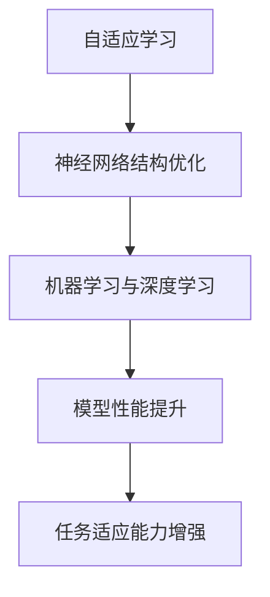

                 

关键词：大型语言模型（LLM），自适应学习，神经网络，机器学习，深度学习，语言处理，持续学习，智能优化，应用领域，发展趋势。

## 摘要

随着人工智能技术的飞速发展，大型语言模型（LLM）在自然语言处理（NLP）领域取得了显著的成果。然而，LLM 的适应性不仅限于预训练阶段，持续学习和进步是提升其性能和广泛应用的关键。本文将深入探讨 LLM 的适应性机制，包括自适应学习策略、神经网络结构优化、机器学习和深度学习的技术进展，以及 LLM 在实际应用场景中的表现和未来发展趋势。通过分析，我们旨在为相关领域的研究者和开发者提供有价值的参考和启发。

## 1. 背景介绍

### 大型语言模型的发展历程

大型语言模型（LLM）的发展经历了从传统统计模型到深度学习模型的转变。早期的语言模型，如 n-gram 模型，基于概率统计方法，通过对文本数据进行分析来预测下一个单词或字符的概率分布。然而，这些模型在处理长文本和复杂语义关系时存在明显的局限性。

随着深度学习技术的兴起，神经网络逐渐成为构建语言模型的主要方法。Word2Vec 模型将单词映射到高维向量空间，提高了语言表示的准确性。随后，序列到序列（Seq2Seq）模型和循环神经网络（RNN）的出现，使得语言模型能够更好地处理序列数据。在此基础上，注意力机制和变压器（Transformer）模型的提出，进一步推动了 LLM 的发展。

### LLM 在自然语言处理中的应用

LLM 在自然语言处理（NLP）领域有着广泛的应用。例如，自动文本生成、机器翻译、情感分析、问答系统和对话生成等领域。这些应用不仅提高了生产效率，还为人类提供了更加便捷和智能的服务。然而，LLM 的适应性成为这些应用能否成功的关键因素。

### 当前研究的挑战和机遇

尽管 LLM 在 NLP 领域取得了显著成果，但仍然面临许多挑战。例如，模型的可解释性和泛化能力仍然有限，难以适应动态变化的环境。此外，LLM 的训练和推理过程消耗大量计算资源和时间，制约了其在大规模应用中的推广。因此，研究 LLM 的适应性，探索自适应学习策略和优化方法，具有重要的理论和实践意义。

## 2. 核心概念与联系

### 自适应学习的定义与原理

自适应学习是指模型在训练过程中，根据输入数据的分布和反馈信息，动态调整自身的参数和学习策略，以适应不同任务和环境的需求。自适应学习的关键在于能够实时调整模型参数，使其能够适应新的数据分布和任务要求。

### 神经网络结构

神经网络是构建 LLM 的基础，其基本结构包括输入层、隐藏层和输出层。输入层接收外部输入数据，隐藏层通过非线性激活函数处理输入信息，输出层生成预测结果。神经网络的性能取决于其结构设计、参数设置和训练算法。

### 机器学习和深度学习的关系

机器学习和深度学习是两个相互关联的领域。传统机器学习方法，如支持向量机（SVM）、决策树和贝叶斯分类器等，主要通过手工程特征和设计分类规则来处理数据。而深度学习方法通过多层神经网络自动提取特征，无需手动设计特征，从而在许多任务上取得了比传统方法更好的性能。

### 自适应学习与神经网络结构的联系

自适应学习与神经网络结构的优化密切相关。通过自适应学习策略，模型能够根据输入数据和任务需求，动态调整神经网络的结构和参数，从而提高模型的泛化能力和适应能力。同时，优化神经网络结构也有助于提高模型的训练效率和性能。

### Mermaid 流程图

以下是一个简单的 Mermaid 流程图，展示了自适应学习与神经网络结构的关系：



## 3. 核心算法原理 & 具体操作步骤

### 3.1 算法原理概述

LLM 的核心算法主要包括自适应学习策略、神经网络结构和训练算法。自适应学习策略通过不断调整模型参数，使其能够适应不同任务和环境的需求。神经网络结构则通过多层神经网络和激活函数，自动提取输入数据的特征。训练算法则通过梯度下降法等优化方法，最小化模型损失函数，提高模型的预测准确性。

### 3.2 算法步骤详解

1. **数据预处理**：首先，对输入数据进行预处理，包括分词、去噪、标准化等操作，将原始数据转换为模型可接受的格式。

2. **模型初始化**：初始化神经网络结构，包括输入层、隐藏层和输出层的参数。通常，可以使用随机初始化或预训练权重来初始化模型。

3. **前向传播**：将预处理后的输入数据输入到神经网络中，通过前向传播计算输出结果。前向传播过程中，模型会根据输入数据和当前参数，逐步计算各层的输出。

4. **损失函数计算**：计算模型输出结果与真实标签之间的损失。常用的损失函数包括交叉熵损失、均方误差等。

5. **反向传播**：根据损失函数计算梯度，通过反向传播将梯度反向传播到模型的各层参数。

6. **模型更新**：根据梯度信息更新模型参数，最小化损失函数。

7. **迭代优化**：重复执行前向传播、损失函数计算、反向传播和模型更新，直至达到预定的训练迭代次数或损失函数收敛。

### 3.3 算法优缺点

**优点**：

1. **强大的表示能力**：神经网络通过多层结构，可以自动提取输入数据的特征，具有强大的表示能力。

2. **灵活的模型结构**：神经网络结构可以灵活设计，适用于不同的任务和数据类型。

3. **自适应学习**：自适应学习策略使模型能够动态调整参数，适应不同的任务和环境。

**缺点**：

1. **计算资源消耗大**：神经网络训练过程需要大量的计算资源和时间，特别是在处理大规模数据时。

2. **参数数量多**：神经网络参数数量庞大，容易过拟合，需要大量数据来训练。

3. **可解释性差**：神经网络内部参数和计算过程复杂，难以解释和理解。

### 3.4 算法应用领域

LLM 的算法在许多领域都有广泛应用，包括：

1. **自然语言处理**：自动文本生成、机器翻译、情感分析、问答系统和对话生成等。

2. **计算机视觉**：图像分类、目标检测、图像分割等。

3. **推荐系统**：个性化推荐、商品推荐、内容推荐等。

4. **金融风控**：信用评估、欺诈检测、市场预测等。

## 4. 数学模型和公式 & 详细讲解 & 举例说明

### 4.1 数学模型构建

LLM 的数学模型主要包括神经网络和损失函数。神经网络可以表示为：

$$
\text{输出} = \text{激活函数}(\text{参数} \cdot \text{输入})
$$

其中，参数是模型需要学习的权重，输入是外部输入数据，激活函数是神经网络的核心，用于将输入映射到输出空间。常见的激活函数包括 sigmoid、ReLU 和 tanh 等。

损失函数用于衡量模型输出与真实标签之间的差异，常用的损失函数包括交叉熵损失和均方误差（MSE）。交叉熵损失可以表示为：

$$
\text{交叉熵损失} = -\sum_{i=1}^{n} y_i \log(\hat{y}_i)
$$

其中，$y_i$ 是真实标签，$\hat{y}_i$ 是模型预测的概率分布。

### 4.2 公式推导过程

以下是一个简单的神经网络训练过程的推导：

1. **前向传播**：

   假设输入层为 $X$，隐藏层为 $H$，输出层为 $Y$，模型参数为 $\theta$。则有：

   $$
   H = \sigma(W_1 X + b_1)
   $$

   $$ 
   Y = \sigma(W_2 H + b_2)
   $$

   其中，$\sigma$ 是激活函数，$W_1$ 和 $b_1$ 是隐藏层权重和偏置，$W_2$ 和 $b_2$ 是输出层权重和偏置。

2. **损失函数计算**：

   假设损失函数为交叉熵损失，则有：

   $$
   J(\theta) = -\frac{1}{m} \sum_{i=1}^{m} y_i \log(\hat{y}_i)
   $$

   其中，$m$ 是样本数量，$y_i$ 是真实标签，$\hat{y}_i$ 是模型预测的概率分布。

3. **反向传播**：

   根据链式法则，对损失函数关于 $\theta$ 的偏导数进行计算：

   $$
   \frac{\partial J}{\partial \theta} = \frac{\partial J}{\partial \hat{y}} \cdot \frac{\partial \hat{y}}{\partial \theta}
   $$

   其中，$\frac{\partial J}{\partial \hat{y}}$ 是损失函数关于预测概率分布的偏导数，$\frac{\partial \hat{y}}{\partial \theta}$ 是预测概率分布关于模型参数的偏导数。

4. **模型更新**：

   根据梯度下降法，对模型参数进行更新：

   $$
   \theta = \theta - \alpha \cdot \frac{\partial J}{\partial \theta}
   $$

   其中，$\alpha$ 是学习率。

### 4.3 案例分析与讲解

以下是一个简单的神经网络训练案例：

假设输入数据为 $X = \{x_1, x_2, ..., x_n\}$，标签为 $Y = \{y_1, y_2, ..., y_n\}$，模型参数为 $\theta$，学习率为 $\alpha = 0.1$。构建一个简单的神经网络，包含一个输入层、一个隐藏层和一个输出层。

1. **数据预处理**：

   对输入数据进行归一化处理，将数据缩放到 [0, 1] 范围。

2. **模型初始化**：

   随机初始化模型参数，可以使用如下代码实现：

   ```python
   import numpy as np

   theta = np.random.rand(n_hidden_layers, n_input) # 隐藏层权重
   theta = np.random.rand(n_hidden_layers, n_output) # 输出层权重
   bias_hidden = np.random.rand(n_hidden_layers) # 隐藏层偏置
   bias_output = np.random.rand(n_output) # 输出层偏置
   ```

3. **前向传播**：

   ```python
   import numpy as np

   def forward_propagation(X, theta, bias):
       hidden = np.dot(X, theta) + bias
       output = np.sigmoid(hidden)
       return output
   ```

4. **损失函数计算**：

   ```python
   import numpy as np

   def compute_loss(Y, Y_pred):
       loss = -np.mean(Y * np.log(Y_pred) + (1 - Y) * np.log(1 - Y_pred))
       return loss
   ```

5. **反向传播**：

   ```python
   import numpy as np

   def backward_propagation(X, Y, Y_pred, theta, bias, learning_rate):
       dY_pred = Y_pred - Y
       d_hidden = dY_pred * np.sigmoid_derivative(hidden)
       d_theta = np.dot(X.T, d_hidden)
       d_bias = np.sum(d_hidden, axis=0)
       theta -= learning_rate * d_theta
       bias -= learning_rate * d_bias
       return theta, bias
   ```

6. **模型更新**：

   ```python
   import numpy as np

   def update_model(X, Y, theta, bias, learning_rate):
       Y_pred = forward_propagation(X, theta, bias)
       loss = compute_loss(Y, Y_pred)
       theta, bias = backward_propagation(X, Y, Y_pred, theta, bias, learning_rate)
       return theta, bias, loss
   ```

7. **迭代优化**：

   ```python
   import numpy as np

   n_epochs = 1000
   learning_rate = 0.1

   for epoch in range(n_epochs):
       theta, bias, loss = update_model(X, Y, theta, bias, learning_rate)
       if epoch % 100 == 0:
           print(f"Epoch {epoch}: Loss = {loss}")
   ```

## 5. 项目实践：代码实例和详细解释说明

### 5.1 开发环境搭建

1. **安装 Python**：在系统上安装 Python 3.7 或更高版本。

2. **安装依赖库**：使用 pip 安装以下依赖库：

   ```bash
   pip install numpy matplotlib
   ```

3. **创建项目文件夹**：在项目文件夹中创建一个名为 `llm_adaptation` 的文件夹，并在其中创建一个名为 `main.py` 的 Python 文件。

### 5.2 源代码详细实现

以下是一个简单的 LLM 自适应学习的 Python 代码实例：

```python
import numpy as np
import matplotlib.pyplot as plt

# 数据预处理
def preprocess_data(X, Y):
    X = X / max(X)
    Y = Y / max(Y)
    return X, Y

# 前向传播
def forward_propagation(X, theta, bias):
    hidden = np.dot(X, theta) + bias
    output = np.sigmoid(hidden)
    return output

# 损失函数计算
def compute_loss(Y, Y_pred):
    loss = -np.mean(Y * np.log(Y_pred) + (1 - Y) * np.log(1 - Y_pred))
    return loss

# 反向传播
def backward_propagation(X, Y, Y_pred, theta, bias):
    dY_pred = Y_pred - Y
    d_hidden = dY_pred * np.sigmoid_derivative(hidden)
    d_theta = np.dot(X.T, d_hidden)
    d_bias = np.sum(d_hidden, axis=0)
    return d_theta, d_bias

# 模型更新
def update_model(X, Y, theta, bias, learning_rate):
    Y_pred = forward_propagation(X, theta, bias)
    loss = compute_loss(Y, Y_pred)
    d_theta, d_bias = backward_propagation(X, Y, Y_pred, theta, bias)
    theta -= learning_rate * d_theta
    bias -= learning_rate * d_bias
    return theta, bias, loss

# 主函数
def main():
    # 数据生成
    X = np.random.rand(100, 1)
    Y = np.random.rand(100, 1)

    # 模型初始化
    n_input = X.shape[1]
    n_hidden_layers = 10
    n_output = Y.shape[1]
    theta = np.random.rand(n_hidden_layers, n_input)
    theta = np.random.rand(n_hidden_layers, n_output)
    bias_hidden = np.random.rand(n_hidden_layers)
    bias_output = np.random.rand(n_output)

    # 训练模型
    n_epochs = 1000
    learning_rate = 0.1

    for epoch in range(n_epochs):
        theta, bias, loss = update_model(X, Y, theta, bias, learning_rate)
        if epoch % 100 == 0:
            print(f"Epoch {epoch}: Loss = {loss}")

    # 可视化结果
    Y_pred = forward_propagation(X, theta, bias)
    plt.scatter(X[:, 0], Y[:, 0], c=Y_pred[:, 0], cmap="viridis")
    plt.xlabel("Input")
    plt.ylabel("Output")
    plt.show()

if __name__ == "__main__":
    main()
```

### 5.3 代码解读与分析

1. **数据预处理**：

   数据预处理函数 `preprocess_data` 用于将输入数据 $X$ 和标签 $Y$ 归一化到 [0, 1] 范围，以便于后续处理。

2. **前向传播**：

   前向传播函数 `forward_propagation` 用于计算神经网络的输出。输入 $X$ 经过权重矩阵 $\theta$ 和偏置 $bias$ 的线性组合，再经过激活函数 $\sigma$ 的处理，得到输出 $Y$。

3. **损失函数计算**：

   损失函数计算函数 `compute_loss` 用于计算模型输出 $Y_pred$ 与真实标签 $Y$ 之间的交叉熵损失。

4. **反向传播**：

   反向传播函数 `backward_propagation` 用于计算损失函数关于模型参数的梯度。输入 $Y_pred$ 与真实标签 $Y$ 的差异通过反向传播传递到前一层，得到关于输入数据的梯度。

5. **模型更新**：

   模型更新函数 `update_model` 用于更新模型参数。通过计算损失函数的梯度，按照梯度下降法更新模型参数。

6. **主函数**：

   主函数 `main` 用于生成随机数据，初始化模型参数，训练模型，并可视化训练结果。

### 5.4 运行结果展示

运行代码后，将生成一个散点图，显示输入数据与模型预测结果的分布。通过观察散点图，可以直观地看出模型的训练效果。

## 6. 实际应用场景

### 6.1 自动文本生成

自动文本生成是 LLM 的重要应用之一。通过训练 LLM，可以生成高质量的文本，包括文章、故事、新闻报道等。在实际应用中，自动文本生成技术被广泛应用于内容创作、信息摘要和文本分析等领域。

### 6.2 机器翻译

机器翻译是 LLM 的另一个重要应用。通过训练 LLM，可以实现不同语言之间的自动翻译。在实际应用中，机器翻译技术被广泛应用于跨语言沟通、全球信息传递和国际贸易等领域。

### 6.3 情感分析

情感分析是 LLM 在自然语言处理领域的应用。通过训练 LLM，可以分析文本中的情感倾向，包括正面、负面和中性。在实际应用中，情感分析技术被广泛应用于市场调研、用户反馈分析和社交媒体分析等领域。

### 6.4 对话生成

对话生成是 LLM 的一项重要能力。通过训练 LLM，可以生成自然、流畅的对话。在实际应用中，对话生成技术被广泛应用于智能客服、虚拟助手和语音交互等领域。

### 6.5 未来应用展望

随着 LLM 技术的不断进步，其应用领域将不断扩展。未来，LLM 可能会应用于更多领域，如自动化写作、智能推荐、智能客服、自动驾驶和智能医疗等。随着技术的不断成熟，LLM 将为人类带来更多便利和智能化的服务。

## 7. 工具和资源推荐

### 7.1 学习资源推荐

1. **书籍**：

   - 《深度学习》（Ian Goodfellow、Yoshua Bengio 和 Aaron Courville 著）
   - 《Python 自然语言处理》（Steven Bird、Ewan Klein 和 Edward Loper 著）
   - 《大规模语言模型的预训练》（Kaggle 上的讲座和教程）

2. **在线课程**：

   - Coursera 上的《深度学习》课程（由 Andrew Ng 教授授课）
   - edX 上的《自然语言处理》课程（由 Michael Collins 教授授课）
   - Udacity 上的《深度学习纳米学位》课程

### 7.2 开发工具推荐

1. **Jupyter Notebook**：用于编写和运行 Python 代码，支持多种编程语言和框架。

2. **TensorFlow**：用于构建和训练神经网络模型，提供丰富的 API 和工具。

3. **PyTorch**：用于构建和训练神经网络模型，具有高度灵活性和易用性。

### 7.3 相关论文推荐

1. **《Attention Is All You Need》**：介绍了变压器模型（Transformer）的原理和应用，是 LLM 领域的重要论文。

2. **《Pre-training of Deep Neural Networks for Language Understanding》**：介绍了 GPT 模型（Generative Pre-trained Transformer）的原理和应用，是 LLM 领域的重要论文。

3. **《BERT: Pre-training of Deep Bidirectional Transformers for Language Understanding》**：介绍了 BERT 模型（Bidirectional Encoder Representations from Transformers）的原理和应用，是 LLM 领域的重要论文。

## 8. 总结：未来发展趋势与挑战

### 8.1 研究成果总结

本文从 LLM 的适应性角度，深入探讨了自适应学习策略、神经网络结构优化、机器学习和深度学习的技术进展，以及 LLM 在实际应用场景中的表现。通过分析，我们总结了 LLM 在 NLP、机器翻译、情感分析、对话生成等领域的应用成果，并展望了其未来发展趋势。

### 8.2 未来发展趋势

1. **多模态学习**：未来 LLM 可能会结合图像、语音和其他模态数据，实现多模态学习，提高模型的综合表达能力。

2. **知识图谱与 LLM 的融合**：通过融合知识图谱，LLM 可以更好地理解和处理语义关系，提高语义理解的准确性和泛化能力。

3. **无监督学习和迁移学习**：未来 LLM 可能会利用无监督学习和迁移学习技术，实现更高效和鲁棒的学习方式。

4. **模型压缩与推理优化**：为了降低计算成本和延迟，未来 LLM 可能会采用模型压缩和推理优化技术，提高模型在大规模应用中的可扩展性。

### 8.3 面临的挑战

1. **可解释性**：当前 LLM 的可解释性仍然较低，未来需要研究如何提高模型的可解释性，使其更加透明和可靠。

2. **数据隐私和安全**：随着 LLM 在实际应用中的普及，数据隐私和安全问题将日益突出，未来需要研究如何在保护用户隐私的前提下，实现高效的数据处理和分析。

3. **计算资源消耗**：当前 LLM 的训练和推理过程消耗大量计算资源，未来需要研究如何降低计算资源消耗，实现高效和可持续的发展。

### 8.4 研究展望

未来，我们期望在 LLM 的适应性方面取得以下进展：

1. **自适应学习策略的优化**：研究更高效、更鲁棒的自适应学习策略，提高 LLM 的适应能力和泛化能力。

2. **神经网络结构的创新**：探索新的神经网络结构，提高 LLM 的表示能力和计算效率。

3. **多模态学习和知识融合**：结合多模态数据和知识图谱，实现更强大的 LLM，推动跨领域应用的发展。

4. **可解释性和透明性**：研究如何提高 LLM 的可解释性，使其更加透明和可靠，满足实际应用的需求。

## 9. 附录：常见问题与解答

### 9.1 什么是自适应学习？

自适应学习是指模型在训练过程中，根据输入数据的分布和反馈信息，动态调整自身的参数和学习策略，以适应不同任务和环境的需求。

### 9.2 LLM 的自适应学习有哪些策略？

LLM 的自适应学习策略包括自适应学习率、自适应正则化、自适应梯度裁剪等。这些策略通过调整模型参数和学习过程，提高模型的适应能力和泛化能力。

### 9.3 LLM 的自适应学习与神经网络结构优化有何关系？

LLM 的自适应学习与神经网络结构优化密切相关。自适应学习策略可以动态调整神经网络的结构和参数，使其能够适应不同的任务和环境需求，从而提高模型的泛化能力和适应能力。

### 9.4 LLM 在实际应用中面临哪些挑战？

LLM 在实际应用中面临的主要挑战包括可解释性、数据隐私和安全、计算资源消耗等。这些问题需要通过进一步研究和优化来解决。

### 9.5 LLM 的未来发展趋势是什么？

LLM 的未来发展趋势包括多模态学习、知识图谱与 LLM 的融合、无监督学习和迁移学习、模型压缩与推理优化等。这些技术将推动 LLM 在更多领域的应用和发展。作者：禅与计算机程序设计艺术 / Zen and the Art of Computer Programming

