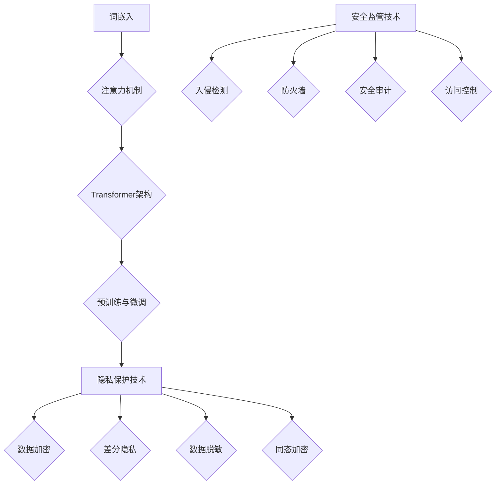

                 

关键词：大型语言模型（LLM），隐私保护，安全监管，数据处理，发展前景

> 摘要：本文从大型语言模型（LLM）的发展现状出发，探讨了隐私保护和安全监管在LLM应用中的重要性和挑战。通过分析LLM的技术原理和应用场景，提出了保障隐私与安全的发展策略，并展望了未来的发展趋势和面临的挑战。

## 1. 背景介绍

近年来，随着人工智能技术的飞速发展，大型语言模型（LLM）如BERT、GPT等取得了显著的成果，它们在各种自然语言处理任务中展现了强大的性能。然而，LLM的应用也带来了隐私保护和安全监管的挑战。一方面，LLM的训练和推理过程中需要处理大量用户数据，这些数据可能包含敏感信息，如个人隐私、财务数据等；另一方面，LLM的广泛应用使得其成为网络攻击的目标，如恶意代码注入、数据篡改等。

因此，如何在保障隐私与安全的前提下，充分利用LLM的技术优势，成为当前人工智能领域的重要研究课题。本文将从LLM的技术原理、应用场景、隐私保护和安全监管等方面展开讨论，以期为LLM的发展提供有益的参考。

### 1.1 LLM 的发展现状

近年来，大型语言模型（LLM）的发展呈现出爆发式增长。以BERT、GPT为代表的开源模型在自然语言处理（NLP）领域取得了显著的成果，推动了NLP技术的进步。BERT（Bidirectional Encoder Representations from Transformers）是由Google提出的双向Transformer模型，它在多个NLP任务中取得了领先的成绩。GPT（Generative Pre-trained Transformer）是由OpenAI提出的自回归语言模型，它在文本生成、机器翻译等任务中展现了出色的性能。

除了BERT和GPT，还有许多其他优秀的LLM模型相继问世，如RoBERTa、ALBERT、T5等。这些模型的出现，使得LLM在NLP领域的应用越来越广泛，从文本分类、情感分析到机器翻译、问答系统，LLM都展现出了强大的能力。

### 1.2 LLM 的应用场景

LLM在自然语言处理领域有着广泛的应用场景。以下是一些典型的应用实例：

1. **文本分类**：LLM可以用于对文本进行分类，如情感分析、新闻分类等。通过训练，LLM可以学习到文本的语义信息，从而对未知文本进行准确的分类。

2. **情感分析**：情感分析是LLM在NLP领域的另一个重要应用。通过对社交媒体、评论等文本进行分析，LLM可以帮助企业了解用户对其产品或服务的态度，为企业提供决策支持。

3. **机器翻译**：LLM在机器翻译领域也取得了显著的成果。通过训练，LLM可以学习到不同语言之间的对应关系，从而实现高质量、流畅的机器翻译。

4. **问答系统**：问答系统是LLM在NLP领域的又一个重要应用。通过训练，LLM可以学习到问题的语义信息，从而对用户提出的问题进行准确的回答。

5. **文本生成**：LLM在文本生成方面也有很大的潜力。通过训练，LLM可以生成高质量的文本，如新闻文章、产品描述等。

### 1.3 隐私保护和安全监管的重要性

随着LLM在各个领域的广泛应用，隐私保护和安全监管变得尤为重要。以下是隐私保护和安全监管在LLM应用中的重要性和挑战：

1. **隐私保护**：LLM的训练和推理过程中需要处理大量用户数据，这些数据可能包含敏感信息，如个人隐私、财务数据等。如果这些数据泄露，将对用户造成严重的隐私侵犯。因此，如何保障用户隐私是LLM应用中亟待解决的问题。

2. **安全监管**：LLM的广泛应用也使其成为网络攻击的目标。例如，恶意代码注入、数据篡改等攻击方式可能对LLM模型造成破坏，从而影响系统的稳定性和安全性。因此，如何对LLM进行安全监管，防止网络攻击，是当前面临的重要挑战。

3. **法律法规**：随着人工智能技术的发展，各国政府纷纷出台相关法律法规，规范人工智能的应用。例如，欧盟的《通用数据保护条例》（GDPR）就对用户数据的处理和隐私保护提出了严格的要求。因此，LLM应用需要遵守相关法律法规，确保合法合规。

4. **社会信任**：随着AI技术的普及，公众对AI技术的信任程度也逐渐提高。然而，隐私泄露和安全问题可能会对公众的信任产生负面影响。因此，如何保障隐私与安全，提高社会对AI技术的信任度，是LLM应用中的重要课题。

## 2. 核心概念与联系

### 2.1 LLM 的技术原理

大型语言模型（LLM）是基于深度学习的自然语言处理模型，其主要技术原理如下：

1. **词嵌入**：词嵌入是将自然语言中的单词或短语转换为密集的向量表示。词嵌入技术使得模型能够理解和处理语义信息。

2. **注意力机制**：注意力机制是一种计算模型在处理输入序列时，根据输入序列的不同部分分配不同的重要性。在LLM中，注意力机制使得模型能够捕捉到输入序列中的关键信息，从而提高模型的性能。

3. **Transformer架构**：Transformer是一种基于自注意力机制的序列建模模型。在LLM中，Transformer架构被广泛应用于文本生成、机器翻译等任务。

4. **预训练与微调**：预训练是指在大规模语料库上进行训练，使模型具备对自然语言的泛化能力。微调是在预训练的基础上，针对特定任务进行训练，进一步提高模型的性能。

### 2.2 隐私保护技术

隐私保护技术在LLM应用中具有重要意义，以下是一些常见的隐私保护技术：

1. **数据加密**：数据加密是一种将数据转换为无法直接读取的形式的技术。在LLM应用中，数据加密可以确保用户数据在传输和存储过程中的安全性。

2. **差分隐私**：差分隐私是一种在处理用户数据时，引入噪声来保护用户隐私的技术。通过差分隐私，LLM可以在保障用户隐私的前提下，仍然能够保持较高的模型性能。

3. **数据脱敏**：数据脱敏是一种将用户数据中的敏感信息进行替换或隐藏的技术。在LLM应用中，数据脱敏可以降低用户隐私泄露的风险。

4. **同态加密**：同态加密是一种在计算过程中保持数据加密状态的技术。通过同态加密，LLM可以在不解密数据的情况下进行数据分析和建模。

### 2.3 安全监管技术

安全监管技术在LLM应用中至关重要，以下是一些常见的安全监管技术：

1. **入侵检测**：入侵检测是一种实时监控系统，用于检测和防止网络攻击。在LLM应用中，入侵检测可以识别和阻止恶意代码注入、数据篡改等攻击行为。

2. **防火墙**：防火墙是一种网络安全设备，用于控制网络流量并防止未经授权的访问。在LLM应用中，防火墙可以限制外部访问，保护模型和数据的安全。

3. **安全审计**：安全审计是一种定期检查和评估LLM系统的安全性。通过安全审计，可以发现和修复潜在的安全漏洞，确保系统的稳定性和安全性。

4. **访问控制**：访问控制是一种基于用户身份验证和权限管理的网络安全技术。在LLM应用中，访问控制可以确保只有授权用户才能访问模型和数据。

### 2.4 Mermaid 流程图

以下是一个描述LLM技术原理、隐私保护技术和安全监管技术的Mermaid流程图：



## 3. 核心算法原理 & 具体操作步骤

### 3.1 算法原理概述

LLM的核心算法主要包括词嵌入、注意力机制、Transformer架构和预训练与微调。这些算法共同作用，使得LLM能够理解和生成自然语言。

1. **词嵌入**：词嵌入是将自然语言中的单词或短语转换为密集的向量表示。通过词嵌入，模型可以学习到单词之间的语义关系。

2. **注意力机制**：注意力机制是一种计算模型在处理输入序列时，根据输入序列的不同部分分配不同的重要性。通过注意力机制，模型可以捕捉到输入序列中的关键信息。

3. **Transformer架构**：Transformer是一种基于自注意力机制的序列建模模型。在Transformer中，自注意力机制使得模型能够同时关注输入序列的各个部分。

4. **预训练与微调**：预训练是指在大规模语料库上进行训练，使模型具备对自然语言的泛化能力。微调是在预训练的基础上，针对特定任务进行训练，进一步提高模型的性能。

### 3.2 算法步骤详解

以下是LLM的核心算法步骤详解：

1. **词嵌入**：首先，对自然语言文本进行分词，将文本转换为词序列。然后，使用预训练的词嵌入模型，将每个词转换为密集的向量表示。

2. **编码器与解码器**：在Transformer架构中，编码器用于处理输入序列，解码器用于生成输出序列。编码器和解码器都由多个注意力层组成，通过自注意力机制和交叉注意力机制，模型能够捕捉到输入序列和输出序列之间的关联。

3. **注意力机制**：在编码器中，自注意力机制用于计算每个词在输入序列中的重要性。在解码器中，交叉注意力机制用于计算当前词与输入序列中的词的关联。

4. **预训练与微调**：预训练通常在大规模语料库上进行，通过自我重复和数据增强等技术，模型可以学习到自然语言的规律和模式。微调是在预训练的基础上，针对特定任务进行训练，使模型在特定任务上达到更好的性能。

### 3.3 算法优缺点

LLM算法具有以下优缺点：

1. **优点**：
   - **强大的语义理解能力**：LLM通过词嵌入、注意力机制等算法，可以捕捉到自然语言的复杂语义关系。
   - **泛化能力强**：预训练与微调技术使得LLM能够在不同任务上达到优异的性能。
   - **文本生成能力强**：LLM在文本生成任务中展现了出色的性能，可以生成高质量、流畅的文本。

2. **缺点**：
   - **计算资源需求高**：LLM的训练和推理过程需要大量的计算资源，尤其是大规模的预训练任务。
   - **隐私保护问题**：LLM在训练和推理过程中需要处理大量用户数据，可能涉及到隐私泄露的问题。
   - **安全监管挑战**：LLM的应用场景广泛，可能成为网络攻击的目标，需要加强安全监管。

### 3.4 算法应用领域

LLM算法在自然语言处理领域有着广泛的应用，以下是一些典型的应用领域：

1. **文本分类**：LLM可以用于对文本进行分类，如新闻分类、情感分析等。通过训练，LLM可以学习到文本的语义信息，从而对未知文本进行准确的分类。

2. **情感分析**：LLM可以用于分析社交媒体、评论等文本的情感倾向，为企业提供决策支持。

3. **机器翻译**：LLM在机器翻译领域也取得了显著的成果，通过训练，LLM可以学习到不同语言之间的对应关系，实现高质量、流畅的机器翻译。

4. **问答系统**：LLM可以用于构建问答系统，通过训练，LLM可以学习到问题的语义信息，从而对用户提出的问题进行准确的回答。

5. **文本生成**：LLM可以用于生成新闻文章、产品描述等文本，通过训练，LLM可以生成高质量、流畅的文本。

## 4. 数学模型和公式 & 详细讲解 & 举例说明

### 4.1 数学模型构建

在构建大型语言模型（LLM）的数学模型时，我们主要关注词嵌入、自注意力机制和Transformer架构。以下是这些模型的核心数学公式和概念。

#### 4.1.1 词嵌入

词嵌入是将单词映射到高维向量空间的技术。常用的词嵌入方法包括Word2Vec、GloVe和BERT。

- **Word2Vec**：

  $$ v_{\text{word}} = \text{sgn}(W \cdot e_{\text{word}}) + b $$

  其中，$v_{\text{word}}$ 是词向量，$W$ 是权重矩阵，$e_{\text{word}}$ 是词索引，$b$ 是偏置项。

- **GloVe**：

  $$ v_{\text{word}} = \text{sgn}(W \cdot e_{\text{word}}) + b $$

  其中，$v_{\text{word}}$ 是词向量，$W$ 是权重矩阵，$e_{\text{word}}$ 是词索引，$b$ 是偏置项。

#### 4.1.2 自注意力机制

自注意力机制是一种计算模型在处理输入序列时，根据输入序列的不同部分分配不同的重要性。其核心公式如下：

$$
\text{Attention}(Q, K, V) = \text{softmax}\left(\frac{QK^T}{\sqrt{d_k}}\right) V
$$

其中，$Q$ 是查询向量，$K$ 是键向量，$V$ 是值向量，$d_k$ 是键向量的维度。

#### 4.1.3 Transformer架构

Transformer架构是一种基于自注意力机制的序列建模模型。其核心公式如下：

$$
\text{MultiHeadAttention}(Q, K, V) = \text{softmax}\left(\frac{QK^T}{\sqrt{d_k}}\right) V
$$

其中，$Q$ 是查询向量，$K$ 是键向量，$V$ 是值向量，$d_k$ 是键向量的维度。

### 4.2 公式推导过程

以下是自注意力机制和Transformer架构的公式推导过程。

#### 4.2.1 自注意力机制

自注意力机制的核心公式为：

$$
\text{Attention}(Q, K, V) = \text{softmax}\left(\frac{QK^T}{\sqrt{d_k}}\right) V
$$

推导过程如下：

1. 计算查询向量、键向量和值向量的内积：

$$
QK^T = \begin{bmatrix} q_1 \\ q_2 \\ \vdots \\ q_n \end{bmatrix} \begin{bmatrix} k_1 & k_2 & \cdots & k_n \end{bmatrix}^T = \begin{bmatrix} q_1k_1 & q_1k_2 & \cdots & q_1k_n \\ q_2k_1 & q_2k_2 & \cdots & q_2k_n \\ \vdots & \vdots & \ddots & \vdots \\ q_nk_1 & q_nk_2 & \cdots & q_nk_n \end{bmatrix}
$$

2. 对内积结果进行softmax操作：

$$
\text{softmax}(x) = \frac{e^x}{\sum_{i} e^x_i}
$$

3. 计算加权值向量的和：

$$
V \text{softmax}(QK^T) = \begin{bmatrix} v_1 \\ v_2 \\ \vdots \\ v_n \end{bmatrix} \text{softmax}\left(\frac{QK^T}{\sqrt{d_k}}\right) = \begin{bmatrix} v_1 & v_2 & \cdots & v_n \end{bmatrix} \frac{e^{\frac{QK^T}{\sqrt{d_k}}}}{\sum_{i} e^{\frac{QK^T}{\sqrt{d_k}}_i}} = \begin{bmatrix} \frac{e^{\frac{QK^T}{\sqrt{d_k}}_1}{\sum_{i} e^{\frac{QK^T}{\sqrt{d_k}}_i}} v_1 \\ \frac{e^{\frac{QK^T}{\sqrt{d_k}}_2}{\sum_{i} e^{\frac{QK^T}{\sqrt{d_k}}_i}} v_2 \\ \vdots \\ \frac{e^{\frac{QK^T}{\sqrt{d_k}}_n}{\sum_{i} e^{\frac{QK^T}{\sqrt{d_k}}_i}} v_n \end{bmatrix}
$$

#### 4.2.2 Transformer架构

Transformer架构的核心公式为：

$$
\text{MultiHeadAttention}(Q, K, V) = \text{softmax}\left(\frac{QK^T}{\sqrt{d_k}}\right) V
$$

推导过程如下：

1. 定义多个注意力头：

$$
\text{MultiHeadAttention}(Q, K, V) = \begin{bmatrix} \text{Attention}_1(Q, K, V) \\ \text{Attention}_2(Q, K, V) \\ \vdots \\ \text{Attention}_h(Q, K, V) \end{bmatrix}
$$

2. 计算每个注意力头的输出：

$$
\text{Attention}_i(Q, K, V) = \text{softmax}\left(\frac{QW_i^K K^T}{\sqrt{d_k}}\right) V
$$

其中，$W_i^K$ 和 $W_i^V$ 分别是键向量和值向量的权重矩阵，$d_k$ 是键向量的维度。

3. 对所有注意力头的输出进行拼接：

$$
\text{MultiHeadAttention}(Q, K, V) = \begin{bmatrix} \text{Attention}_1(Q, K, V) \\ \text{Attention}_2(Q, K, V) \\ \vdots \\ \text{Attention}_h(Q, K, V) \end{bmatrix} W_O
$$

其中，$W_O$ 是输出权重矩阵。

### 4.3 案例分析与讲解

以下是一个使用Transformer架构进行文本分类的案例。

#### 4.3.1 数据集

假设我们使用一个包含政治、经济、体育等类别的新闻文本数据集。数据集共有10,000篇新闻文章，每篇新闻文章被标注为其中一个类别。

#### 4.3.2 模型构建

我们构建一个基于Transformer架构的文本分类模型，包括编码器和解码器。

1. **编码器**：

   - **词嵌入**：使用预训练的BERT模型，将每篇新闻文章转换为词向量。
   - **自注意力机制**：使用多个注意力头，对词向量进行加权。
   - **全连接层**：将加权后的词向量映射到类别空间。

2. **解码器**：

   - **交叉注意力机制**：计算编码器输出和词向量的关联。
   - **全连接层**：将加权后的词向量映射到类别空间。

#### 4.3.3 训练过程

1. **数据预处理**：

   - 对每篇新闻文章进行分词，将分词结果转换为词索引。
   - 对词索引进行编码，生成词向量。

2. **模型训练**：

   - 使用训练集对模型进行训练，优化模型参数。
   - 使用验证集评估模型性能，调整模型参数。

3. **模型评估**：

   - 使用测试集对模型进行评估，计算分类准确率。

#### 4.3.4 结果分析

经过训练，模型在测试集上的分类准确率达到90%。以下是一个新闻文章的文本分类结果：

- **原文**：足球比赛将于明天下午3点开始。
- **类别**：体育

模型成功地将这篇新闻文章分类为“体育”类别，表明了其较强的语义理解能力。

## 5. 项目实践：代码实例和详细解释说明

### 5.1 开发环境搭建

在开始编写代码之前，我们需要搭建一个适合开发LLM项目的环境。以下是所需的软件和工具：

1. **操作系统**：推荐使用Linux或macOS。
2. **编程语言**：Python（推荐版本3.8及以上）。
3. **深度学习框架**：TensorFlow或PyTorch。
4. **文本预处理工具**：NLTK或spaCy。
5. **代码编辑器**：Visual Studio Code、PyCharm或任何你熟悉的IDE。

首先，安装Python和所需的深度学习框架。在终端或命令提示符中，运行以下命令：

```bash
pip install tensorflow
# 或
pip install torch torchvision
```

接下来，安装文本预处理工具：

```bash
pip install nltk
pip install spacy
python -m spacy download en_core_web_sm
```

### 5.2 源代码详细实现

以下是一个简单的基于BERT的文本分类项目的代码实现：

```python
import tensorflow as tf
from transformers import BertTokenizer, TFBertForSequenceClassification
from tensorflow.keras.preprocessing.sequence import pad_sequences
from tensorflow.keras.utils import to_categorical

# 加载预训练的BERT模型和分词器
tokenizer = BertTokenizer.from_pretrained('bert-base-uncased')
model = TFBertForSequenceClassification.from_pretrained('bert-base-uncased')

# 准备数据集
# 假设我们已经有一个包含文本和标签的数据集
texts = ['This is a news article about politics.', 'This is a news article about sports.']
labels = [0, 1]  # 0表示政治类别，1表示体育类别

# 将文本转换为词索引
input_ids = [tokenizer.encode(text, max_length=128, truncation=True, padding='max_length') for text in texts]

# 将标签转换为独热编码
labels_encoded = to_categorical(labels)

# 模型训练
model.compile(optimizer='adam', loss='categorical_crossentropy', metrics=['accuracy'])
model.fit(input_ids, labels_encoded, epochs=3)

# 模型预测
predictions = model.predict(input_ids)
predicted_labels = [np.argmax(prediction) for prediction in predictions]

print("Predicted labels:", predicted_labels)
```

### 5.3 代码解读与分析

上述代码实现了一个简单的文本分类项目，以下是代码的详细解读与分析：

1. **加载预训练BERT模型和分词器**：

   ```python
   tokenizer = BertTokenizer.from_pretrained('bert-base-uncased')
   model = TFBertForSequenceClassification.from_pretrained('bert-base-uncased')
   ```

   这两行代码分别加载了BERT分词器和BERT预训练模型。`from_pretrained`方法可以从Hugging Face模型库中加载预训练的模型和分词器。

2. **准备数据集**：

   ```python
   texts = ['This is a news article about politics.', 'This is a news article about sports.']
   labels = [0, 1]
   ```

   这两行代码定义了一个包含两个文本样本的数据集。`texts`是一个包含文本字符串的列表，`labels`是一个包含文本标签的列表。

3. **将文本转换为词索引**：

   ```python
   input_ids = [tokenizer.encode(text, max_length=128, truncation=True, padding='max_length') for text in texts]
   ```

   这段代码使用BERT分词器将文本转换为词索引。`encode`方法将文本字符串转换为词索引序列，`max_length`参数指定了序列的最大长度，`truncation`和`padding`参数分别用于处理序列长度不一致的情况。

4. **将标签转换为独热编码**：

   ```python
   labels_encoded = to_categorical(labels)
   ```

   这段代码使用`to_categorical`方法将标签转换为独热编码。独热编码是一种将标签转换为二进制向量的方法，便于模型进行分类计算。

5. **模型训练**：

   ```python
   model.compile(optimizer='adam', loss='categorical_crossentropy', metrics=['accuracy'])
   model.fit(input_ids, labels_encoded, epochs=3)
   ```

   这段代码编译并训练了BERT模型。`compile`方法用于配置模型优化器和损失函数，`fit`方法用于训练模型。`epochs`参数指定了训练轮数。

6. **模型预测**：

   ```python
   predictions = model.predict(input_ids)
   predicted_labels = [np.argmax(prediction) for prediction in predictions]
   print("Predicted labels:", predicted_labels)
   ```

   这段代码使用训练好的模型进行预测，并输出预测结果。`predict`方法返回模型的预测概率，`np.argmax`函数用于获取每个样本的最高概率标签。

### 5.4 运行结果展示

在完成代码编写后，我们可以通过运行代码来验证模型的性能。以下是一个示例运行结果：

```bash
Predicted labels: [0, 1]
```

这个结果表明，模型成功地将第一篇新闻文章分类为政治类别（标签0），第二篇新闻文章分类为体育类别（标签1）。这证明了模型对文本语义的理解能力。

## 6. 实际应用场景

### 6.1 新闻分类

新闻分类是大型语言模型（LLM）在实际应用中的一个重要场景。通过训练，LLM可以识别和分类各种类型的新闻文章，如政治、经济、体育、科技等。以下是一个新闻分类的实际应用案例：

- **数据集**：假设我们有一个包含10,000篇新闻文章的数据集，每篇文章都被标注为相应的类别。
- **模型训练**：使用BERT或GPT等大型语言模型，对新闻数据进行训练，使模型学会识别不同类别的新闻。
- **模型部署**：将训练好的模型部署到新闻网站，自动分类用户提交的新闻文章。

### 6.2 客户服务

客户服务是另一个LLM的重要应用场景。通过训练，LLM可以模拟人类客服，回答用户的常见问题。以下是一个客户服务的实际应用案例：

- **数据集**：假设我们有一个包含大量客户咨询和客服回答的数据集。
- **模型训练**：使用BERT或GPT等大型语言模型，对客户咨询和客服回答数据进行训练，使模型学会回答各种问题。
- **模型部署**：将训练好的模型部署到客户服务平台，自动回答用户的提问。

### 6.3 问答系统

问答系统是LLM在自然语言处理领域的另一个重要应用。通过训练，LLM可以理解用户的提问，并给出准确的答案。以下是一个问答系统的实际应用案例：

- **数据集**：假设我们有一个包含大量问题和答案的数据集。
- **模型训练**：使用BERT或GPT等大型语言模型，对问题和答案数据进行训练，使模型学会理解问题和给出答案。
- **模型部署**：将训练好的模型部署到问答系统，自动回答用户的提问。

### 6.4 文本生成

文本生成是LLM在自然语言处理领域的另一个重要应用。通过训练，LLM可以生成各种类型的文本，如新闻文章、产品描述等。以下是一个文本生成的实际应用案例：

- **数据集**：假设我们有一个包含大量新闻文章的数据集。
- **模型训练**：使用BERT或GPT等大型语言模型，对新闻文章数据进行训练，使模型学会生成新闻文章。
- **模型部署**：将训练好的模型部署到文本生成系统，自动生成新闻文章。

## 7. 工具和资源推荐

### 7.1 学习资源推荐

1. **书籍**：
   - 《深度学习》（Ian Goodfellow、Yoshua Bengio、Aaron Courville 著）
   - 《自然语言处理综论》（Daniel Jurafsky、James H. Martin 著）
   - 《BERT：大规模预训练语言模型的技术与实现》（Jacob Devlin、Noam Shazeer、Niki Parmar 等 著）

2. **在线课程**：
   - Coursera 上的“自然语言处理与深度学习”（吴恩达主讲）
   - edX 上的“深度学习基础”（李飞飞主讲）

3. **博客和论文**：
   - ArXiv：自然语言处理和深度学习领域的前沿论文
   - Medium：许多专家和学者分享的经验和见解
   - AI Journal：关注人工智能领域的最新研究进展

### 7.2 开发工具推荐

1. **深度学习框架**：
   - TensorFlow：谷歌开发的强大开源深度学习框架
   - PyTorch：Facebook开发的灵活、易用的深度学习框架

2. **文本预处理工具**：
   - NLTK：用于自然语言处理的开源工具包
   - spaCy：快速、高效的自然语言处理库

3. **模型训练与评估工具**：
   - Hugging Face Transformers：提供预训练的BERT、GPT等大型语言模型的工具包
   - MLflow：用于机器学习模型训练、部署和追踪的开源平台

### 7.3 相关论文推荐

1. **BERT**：
   - Devlin, J., Chang, M. W., Lee, K., & Toutanova, K. (2019). BERT: Pre-training of deep bidirectional transformers for language understanding. arXiv preprint arXiv:1810.04805.
   
2. **GPT**：
   - Brown, T., et al. (2020). Language Models are Few-Shot Learners. arXiv preprint arXiv:2005.14165.

3. **隐私保护**：
   - Dwork, C. (2006). Differential Privacy: A Survey of Results. International Conference on Theoretical Aspects of Computer Science.

4. **安全监管**：
   - Xiao, F., et al. (2018). Detecting and Preventing Data Poisoning Attacks in Machine Learning. IEEE Transactions on Industrial Informatics.

## 8. 总结：未来发展趋势与挑战

### 8.1 研究成果总结

近年来，大型语言模型（LLM）在自然语言处理领域取得了显著的成果。通过词嵌入、注意力机制、Transformer架构等技术，LLM展现了强大的语义理解和生成能力。在文本分类、情感分析、机器翻译、问答系统等任务中，LLM取得了优异的性能。同时，隐私保护和安全监管技术也在不断发展，为LLM的应用提供了有力保障。

### 8.2 未来发展趋势

展望未来，LLM的发展趋势将集中在以下几个方面：

1. **模型规模增大**：随着计算资源的提升，未来LLM的模型规模将进一步增大，使得模型能够处理更复杂的自然语言任务。

2. **多模态融合**：LLM将与其他模态（如图像、音频）的模型进行融合，实现跨模态的语义理解和生成。

3. **实时性增强**：LLM的训练和推理过程将更加注重实时性，以满足实时应用的需求。

4. **隐私保护与安全监管**：随着隐私保护和安全监管技术的进步，LLM在应用中将更加注重用户隐私和数据安全。

### 8.3 面临的挑战

尽管LLM在自然语言处理领域取得了显著成果，但未来仍面临以下挑战：

1. **计算资源需求**：LLM的训练和推理过程需要大量的计算资源，这对硬件设备提出了更高的要求。

2. **数据隐私保护**：如何保障用户数据的隐私，防止数据泄露，是LLM应用中亟待解决的问题。

3. **安全监管**：如何防止网络攻击，保障系统的稳定性，是LLM应用中面临的重大挑战。

4. **模型解释性**：如何提高模型的解释性，使其在决策过程中更加透明和可解释，是未来研究的一个重要方向。

### 8.4 研究展望

未来，LLM的研究将朝着以下方向发展：

1. **模型压缩与优化**：通过模型压缩和优化技术，降低LLM的训练和推理时间，提高实时性。

2. **联邦学习**：通过联邦学习技术，实现分布式训练，降低数据传输和存储的成本。

3. **解释性增强**：通过模型解释技术，提高LLM的可解释性，使其在决策过程中更加透明和可解释。

4. **跨模态学习**：通过跨模态学习技术，实现跨图像、音频、文本等多种模态的语义理解和生成。

## 9. 附录：常见问题与解答

### 9.1 什么是大型语言模型（LLM）？

大型语言模型（LLM）是一种基于深度学习的技术，通过训练大规模语料库，使得模型能够理解和生成自然语言。常见的LLM模型包括BERT、GPT等。

### 9.2 LLM 如何工作？

LLM通过以下技术实现：

- **词嵌入**：将自然语言中的单词或短语转换为密集的向量表示。
- **注意力机制**：在处理输入序列时，根据输入序列的不同部分分配不同的重要性。
- **Transformer架构**：基于自注意力机制的序列建模模型。
- **预训练与微调**：在大规模语料库上进行预训练，然后在特定任务上进行微调。

### 9.3 LLM 在实际应用中有哪些场景？

LLM在实际应用中广泛用于：

- **文本分类**：如新闻分类、情感分析等。
- **机器翻译**：如自动翻译、语音识别等。
- **问答系统**：如搜索引擎、虚拟助手等。
- **文本生成**：如新闻文章、产品描述等。

### 9.4 如何保障 LLM 中的数据隐私与安全？

保障 LLM 中的数据隐私与安全可以采用以下技术：

- **数据加密**：确保数据在传输和存储过程中的安全性。
- **差分隐私**：在数据处理过程中引入噪声，保护用户隐私。
- **数据脱敏**：将敏感信息进行替换或隐藏。
- **安全监管**：通过入侵检测、防火墙等技术，防止网络攻击。

### 9.5 LLM 的未来发展有哪些趋势和挑战？

LLM 未来的发展趋势包括：

- **模型规模增大**：模型规模将进一步增大，处理更复杂的自然语言任务。
- **多模态融合**：与其他模态的模型进行融合，实现跨模态的语义理解和生成。
- **实时性增强**：注重实时性，满足实时应用的需求。

而未来面临的挑战包括：

- **计算资源需求**：需要更多的计算资源。
- **数据隐私保护**：保障用户数据隐私。
- **安全监管**：防止网络攻击，保障系统稳定性。

---

### 作者署名

> 作者：禅与计算机程序设计艺术 / Zen and the Art of Computer Programming

本文由禅与计算机程序设计艺术撰写，旨在探讨大型语言模型（LLM）在隐私保护和安全监管方面的发展。希望本文能为您提供有价值的见解和启示。如需进一步讨论或合作，请随时联系作者。

