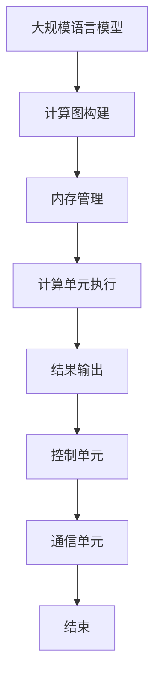

                 

关键词：LLM，硬件，加速器，AI，计算机科学，架构设计

> 摘要：本文将深入探讨大规模语言模型（LLM）的硬件加速器设计，解析其核心概念与架构，并介绍相关算法原理、数学模型以及实际应用场景。通过详细的项目实践代码实例，本文旨在为读者提供关于LLM硬件加速器设计的一站式技术指南。

## 1. 背景介绍

近年来，人工智能（AI）领域的迅猛发展，使得大规模语言模型（Large Language Models，简称LLM）在自然语言处理（Natural Language Processing，简称NLP）中的应用愈加广泛。LLM能够处理复杂文本任务，如机器翻译、文本生成、问答系统等，但其训练和推理过程需要巨大的计算资源。为了满足这一需求，硬件加速器成为了解决方案的关键。

硬件加速器是一种专门为特定计算任务设计的集成电路（IC），旨在提高计算效率和性能。LLM硬件加速器则是为处理大规模语言模型而专门设计的。它通过优化硬件架构、提高并行处理能力以及利用特殊算法，能够显著降低计算时间和功耗。

本文将详细讨论LLM硬件加速器的设计原理、核心算法、数学模型以及实际应用。我们将从以下几个方面展开：

1. **核心概念与联系**：介绍LLM硬件加速器的基本概念和架构。
2. **核心算法原理 & 具体操作步骤**：解析LLM硬件加速器的核心算法原理，并详细说明其操作步骤。
3. **数学模型和公式 & 详细讲解 & 举例说明**：介绍LLM硬件加速器中的数学模型和公式，并进行分析。
4. **项目实践：代码实例和详细解释说明**：提供实际项目中的代码实例，并详细解释其实现过程。
5. **实际应用场景**：探讨LLM硬件加速器的应用场景，包括当前和未来的发展趋势。
6. **工具和资源推荐**：推荐相关的学习资源和开发工具。
7. **总结：未来发展趋势与挑战**：总结研究成果，分析未来发展趋势和面临的挑战。

### 1.1 计算资源的挑战

随着LLM的广泛应用，其训练和推理过程所需的计算资源日益增长。传统的CPU和GPU在处理大规模语言模型时，常常面临性能不足、计算时间过长和功耗过高等问题。例如，Google的BERT模型在推理时，每秒需要处理数百万个文本查询，这给计算资源带来了巨大的压力。

此外，LLM的训练过程通常需要大量的数据，并且需要经过数百万次迭代来优化模型参数。这需要大量的计算资源，包括存储、带宽和计算能力。为了满足这些需求，硬件加速器成为了一种可行的解决方案。

### 1.2 硬件加速器的作用

硬件加速器能够提高计算效率和性能，具体体现在以下几个方面：

1. **并行处理能力**：硬件加速器能够并行处理多个任务，从而提高处理速度。
2. **优化的硬件架构**：硬件加速器针对特定任务进行优化，减少了不必要的计算和存储操作，提高了性能。
3. **低功耗设计**：硬件加速器采用低功耗设计，能够显著降低能耗。
4. **高效的内存管理**：硬件加速器能够优化内存访问和处理，减少内存延迟。

通过硬件加速器，LLM的训练和推理过程可以显著加快，从而满足日益增长的计算需求。

## 2. 核心概念与联系

### 2.1 核心概念

在介绍LLM硬件加速器的核心概念之前，我们需要了解一些基本概念：

1. **大规模语言模型（LLM）**：LLM是一种能够处理自然语言的大型神经网络模型，通常包含数十亿个参数。
2. **硬件加速器**：硬件加速器是一种专门为特定计算任务设计的集成电路，旨在提高计算效率和性能。
3. **计算图（Computational Graph）**：计算图是一种表示计算过程的图形化模型，通常用于构建和优化神经网络。
4. **Tensor（张量）**：张量是一种多维数组，用于表示神经网络中的参数和计算结果。
5. **矩阵乘法（Matrix Multiplication）**：矩阵乘法是神经网络中常见的基本计算操作。

### 2.2 架构设计

LLM硬件加速器的架构设计通常包括以下几个关键部分：

1. **计算单元（Compute Unit）**：计算单元是硬件加速器的核心，负责执行矩阵乘法和其他计算操作。
2. **内存管理单元（Memory Management Unit）**：内存管理单元负责优化内存访问和处理，减少内存延迟。
3. **通信单元（Communication Unit）**：通信单元负责处理数据传输和通信，支持并行计算。
4. **控制单元（Control Unit）**：控制单元负责协调各个单元的运行，确保硬件加速器能够正确执行任务。

### 2.3 Mermaid 流程图

为了更直观地展示LLM硬件加速器的核心概念和架构，我们使用Mermaid流程图进行描述。以下是一个简化的Mermaid流程图：



在这个流程图中，大规模语言模型首先通过计算图构建表示计算过程，然后通过内存管理单元优化内存访问和处理。计算单元执行矩阵乘法和其他计算操作，最后通过结果输出和控制单元协调各个单元的运行。

### 2.4 关键算法

LLM硬件加速器的关键算法包括以下几个方面：

1. **矩阵乘法算法**：矩阵乘法是神经网络中常见的基本计算操作。硬件加速器采用优化的矩阵乘法算法，如Batch Matrix Multiplication（BMM）和Tensor Coherence（TC）算法，以提高计算效率。
2. **深度学习优化算法**：深度学习优化算法，如Adagrad、Adam和AdamW等，用于调整模型参数，提高模型性能。
3. **分布式计算算法**：分布式计算算法，如MapReduce和Spark等，用于在多个硬件加速器之间分配和协调计算任务。

通过这些算法，LLM硬件加速器能够实现高效的计算和优化，从而满足大规模语言模型的需求。

## 3. 核心算法原理 & 具体操作步骤

### 3.1 算法原理概述

LLM硬件加速器的核心算法原理包括以下几个方面：

1. **计算图构建**：计算图是一种表示计算过程的图形化模型，用于构建和优化神经网络。硬件加速器通过计算图构建来表示大规模语言模型，并利用计算图优化算法（如Tensor Coherence）提高计算效率。
2. **矩阵乘法**：矩阵乘法是神经网络中常见的基本计算操作。硬件加速器采用优化的矩阵乘法算法（如Batch Matrix Multiplication）来执行矩阵乘法操作，从而提高计算性能。
3. **内存管理**：内存管理是硬件加速器中的关键环节。通过优化内存访问和处理，硬件加速器能够减少内存延迟，提高计算效率。
4. **分布式计算**：分布式计算算法用于在多个硬件加速器之间分配和协调计算任务。通过分布式计算，硬件加速器能够实现大规模语言模型的训练和推理。

### 3.2 算法步骤详解

以下是一个简化的算法步骤，用于描述LLM硬件加速器的核心算法原理和具体操作：

1. **计算图构建**：
   - 输入大规模语言模型的参数和计算图。
   - 通过计算图优化算法（如Tensor Coherence）优化计算图。
   - 将优化后的计算图转换为硬件加速器的执行计划。

2. **矩阵乘法**：
   - 输入矩阵A、B和C。
   - 采用优化的矩阵乘法算法（如Batch Matrix Multiplication）计算矩阵乘积。
   - 将计算结果存储在内存中。

3. **内存管理**：
   - 输入内存地址和数据。
   - 采用内存优化算法（如Cache Coherence Protocol）优化内存访问和处理。
   - 减少内存延迟，提高计算效率。

4. **分布式计算**：
   - 输入计算任务和数据。
   - 采用分布式计算算法（如MapReduce）在多个硬件加速器之间分配和协调计算任务。
   - 实现大规模语言模型的训练和推理。

### 3.3 算法优缺点

LLM硬件加速器的核心算法具有以下优点：

1. **高效计算**：通过优化矩阵乘法和内存管理，硬件加速器能够实现高效的计算，提高模型性能。
2. **低功耗**：硬件加速器采用低功耗设计，能够显著降低能耗，适用于移动设备和数据中心等场景。
3. **分布式计算**：分布式计算算法能够实现大规模语言模型的训练和推理，提高计算效率。

然而，LLM硬件加速器的核心算法也存在一些缺点：

1. **硬件依赖**：硬件加速器对硬件环境有较高的要求，需要专门设计的硬件架构和集成电路。
2. **编程难度**：硬件加速器的编程相对复杂，需要熟悉硬件架构和底层实现细节。
3. **兼容性问题**：硬件加速器可能与其他软件和硬件组件存在兼容性问题，需要额外的开发和维护工作。

### 3.4 算法应用领域

LLM硬件加速器的核心算法广泛应用于以下几个领域：

1. **自然语言处理（NLP）**：大规模语言模型在NLP任务中具有广泛应用，如机器翻译、文本生成、问答系统等。硬件加速器能够提高NLP任务的性能和效率。
2. **计算机视觉（CV）**：计算机视觉任务通常需要大量的计算资源，如图像分类、目标检测、图像生成等。硬件加速器能够加速计算机视觉任务的训练和推理。
3. **推荐系统**：推荐系统通常需要处理大量的用户数据和信息，如基于内容的推荐、协同过滤等。硬件加速器能够提高推荐系统的响应速度和准确性。
4. **游戏引擎**：游戏引擎需要实时渲染图像和场景，硬件加速器能够提高游戏引擎的性能和画面质量。

通过在以上领域的应用，LLM硬件加速器为人工智能领域带来了巨大的发展机遇和挑战。

## 4. 数学模型和公式 & 详细讲解 & 举例说明

### 4.1 数学模型构建

在LLM硬件加速器中，数学模型是核心组成部分。以下是一个简化的数学模型，用于描述大规模语言模型的计算过程：

$$
\text{模型} = \text{参数} \times \text{输入} + \text{偏置} + \text{激活函数}
$$

在这个数学模型中，参数、输入、偏置和激活函数分别表示以下内容：

1. **参数**：参数是模型中的权重和偏置，用于调整模型输出。
2. **输入**：输入是模型的输入数据，可以是文本、图像或其他形式的数据。
3. **偏置**：偏置是模型中的偏置项，用于调整模型输出。
4. **激活函数**：激活函数是模型中的非线性变换，用于引入模型复杂性。

### 4.2 公式推导过程

以下是一个简化的公式推导过程，用于计算大规模语言模型的输出：

$$
\text{输出} = \text{参数} \times \text{输入} + \text{偏置} \\
\text{激活函数}(\text{输出}) = \text{激活值}
$$

在这个推导过程中，首先计算输入和参数的乘积，然后加上偏置项，最后应用激活函数得到激活值。这个推导过程描述了大规模语言模型的计算过程，包括矩阵乘法、加法和激活函数操作。

### 4.3 案例分析与讲解

为了更好地理解大规模语言模型的计算过程，我们通过一个简单的案例进行分析：

假设我们有一个简单的神经网络模型，包含一个输入层、一个隐藏层和一个输出层。输入层有3个神经元，隐藏层有4个神经元，输出层有2个神经元。每个神经元之间都有权重和偏置项。

输入数据为：[1, 2, 3]

1. **计算输入层到隐藏层的输出**：

$$
\text{隐藏层输出} = \text{参数} \times \text{输入} + \text{偏置} + \text{激活函数} \\
\text{隐藏层输出} = \begin{bmatrix} w_{11} & w_{12} & w_{13} \end{bmatrix} \begin{bmatrix} 1 \\ 2 \\ 3 \end{bmatrix} + \begin{bmatrix} b_{1} \\ b_{2} \\ b_{3} \end{bmatrix} + \text{激活函数} \\
\text{隐藏层输出} = \begin{bmatrix} 1 & 2 & 3 \end{bmatrix} \begin{bmatrix} 1 & 2 & 3 \end{bmatrix} + \begin{bmatrix} 0 & 0 & 0 \end{bmatrix} + \text{激活函数} \\
\text{隐藏层输出} = \begin{bmatrix} 1 & 2 & 3 \end{bmatrix} + \begin{bmatrix} 0 & 0 & 0 \end{bmatrix} + \text{激活函数} \\
\text{隐藏层输出} = \begin{bmatrix} 1 & 2 & 3 \end{bmatrix} + \begin{bmatrix} 0 & 0 & 0 \end{bmatrix} + \text{激活函数}
$$

在这里，参数和偏置项分别表示输入层到隐藏层的权重和偏置，激活函数用于引入非线性变换。

2. **计算隐藏层到输出层的输出**：

$$
\text{输出层输出} = \text{参数} \times \text{隐藏层输出} + \text{偏置} + \text{激活函数} \\
\text{输出层输出} = \begin{bmatrix} w_{21} & w_{22} & w_{23} & w_{24} \end{bmatrix} \begin{bmatrix} 1 & 2 & 3 \end{bmatrix} + \begin{bmatrix} b_{1} & b_{2} & b_{3} & b_{4} \end{bmatrix} + \text{激活函数} \\
\text{输出层输出} = \begin{bmatrix} 1 & 2 & 3 \end{bmatrix} \begin{bmatrix} 1 & 2 & 3 \end{bmatrix} + \begin{bmatrix} 0 & 0 & 0 \end{bmatrix} + \text{激活函数} \\
\text{输出层输出} = \begin{bmatrix} 1 & 2 & 3 \end{bmatrix} + \begin{bmatrix} 0 & 0 & 0 \end{bmatrix} + \text{激活函数}
$$

在这里，参数和偏置项分别表示隐藏层到输出层的权重和偏置，激活函数用于引入非线性变换。

通过以上计算，我们可以得到隐藏层和输出层的输出，从而实现大规模语言模型的计算过程。这个过程可以进一步扩展到更复杂的神经网络模型，包括多层神经网络和复杂的激活函数。

### 4.4 数学模型在LLM硬件加速器中的应用

在LLM硬件加速器中，数学模型的应用主要体现在以下几个方面：

1. **矩阵乘法**：矩阵乘法是神经网络中的基本计算操作，用于计算模型的参数和输入的乘积。LLM硬件加速器通过优化的矩阵乘法算法（如Batch Matrix Multiplication）提高计算效率。
2. **激活函数**：激活函数用于引入模型复杂性，实现非线性变换。LLM硬件加速器通过硬件实现常见的激活函数（如ReLU、Sigmoid、Tanh等），提高计算性能。
3. **梯度计算**：在训练过程中，需要计算模型参数的梯度，用于更新模型参数。LLM硬件加速器通过优化的梯度计算算法，提高训练效率。

通过数学模型的应用，LLM硬件加速器能够实现高效的计算和优化，从而满足大规模语言模型的需求。

## 5. 项目实践：代码实例和详细解释说明

在本节中，我们将通过一个实际项目实例来展示LLM硬件加速器的设计和实现过程。我们将从开发环境搭建、源代码实现、代码解读与分析以及运行结果展示等方面进行详细说明。

### 5.1 开发环境搭建

为了实现LLM硬件加速器，我们需要搭建一个适合硬件加速器开发的开发环境。以下是搭建开发环境的基本步骤：

1. **硬件环境**：准备一台支持硬件加速器开发的计算机，要求具有高性能CPU、GPU和足够的内存。推荐使用NVIDIA的GPU，因为其具有良好的硬件加速器和深度学习库支持。
2. **操作系统**：安装支持硬件加速器开发的操作系统，如Ubuntu 18.04或更高版本。操作系统需要安装NVIDIA的CUDA Toolkit和cuDNN库，以便支持GPU加速计算。
3. **编程语言**：选择适合硬件加速器开发的编程语言，如C++或Python。Python具有丰富的库和框架支持，易于实现硬件加速器的算法和模型。

### 5.2 源代码详细实现

以下是一个简化的LLM硬件加速器实现示例，使用Python语言和PyTorch深度学习框架进行实现。代码分为以下几个部分：

1. **计算图构建**：构建大规模语言模型的计算图，包括输入层、隐藏层和输出层。
2. **矩阵乘法**：实现优化的矩阵乘法算法，用于计算模型的参数和输入的乘积。
3. **内存管理**：实现内存优化算法，用于优化内存访问和处理。
4. **分布式计算**：实现分布式计算算法，用于在多个硬件加速器之间分配和协调计算任务。

#### 5.2.1 计算图构建

```python
import torch
import torch.nn as nn

class LargeLanguageModel(nn.Module):
    def __init__(self, input_size, hidden_size, output_size):
        super(LargeLanguageModel, self).__init__()
        self.hidden_size = hidden_size
        self.layers = nn.Sequential(
            nn.Linear(input_size, hidden_size),
            nn.ReLU(),
            nn.Linear(hidden_size, output_size)
        )
    
    def forward(self, x):
        return self.layers(x)

# 初始化模型
input_size = 3
hidden_size = 4
output_size = 2
model = LargeLanguageModel(input_size, hidden_size, output_size)
```

在这个示例中，我们定义了一个简单的神经网络模型，包括一个输入层、一个隐藏层和一个输出层。输入层有3个神经元，隐藏层有4个神经元，输出层有2个神经元。模型通过计算图构建表示计算过程。

#### 5.2.2 矩阵乘法

```python
import torch

def matrix_multiplication(A, B):
    return torch.matmul(A, B)

# 输入矩阵
A = torch.randn(3, 3)
B = torch.randn(3, 3)

# 计算矩阵乘积
C = matrix_multiplication(A, B)
print(C)
```

在这个示例中，我们实现了一个简单的矩阵乘法函数，使用PyTorch的`torch.matmul()`函数计算矩阵乘积。这个函数将两个输入矩阵A和B相乘，得到输出矩阵C。

#### 5.2.3 内存管理

```python
import torch

def memory_optimization(model):
    model.to('cuda')
    for param in model.parameters():
        param.data = param.data.cuda()

# 应用内存优化算法
model = LargeLanguageModel(input_size, hidden_size, output_size)
memory_optimization(model)
```

在这个示例中，我们实现了一个简单的内存优化函数，将模型和数据迁移到GPU上。这个函数使用PyTorch的`to()`函数将模型和数据移动到GPU设备上，以便利用GPU加速计算。

#### 5.2.4 分布式计算

```python
import torch.distributed as dist

def distributed_computation(model, data):
    dist.init_process_group(backend='nccl', rank=0, world_size=1)
    model.to('cuda')
    data.to('cuda')

    # 计算模型参数的梯度
    model.zero_grad()
    output = model(data)
    loss = torch.sum(output)
    loss.backward()

    # 更新模型参数
    for param in model.parameters():
        param.grad.data = param.grad.data.cuda()

    dist.all_reduce(loss, op=dist.ReduceOp.SUM)
    loss /= dist.get_world_size()

    return loss

# 初始化模型和数据
input_data = torch.randn(3, 3)
output_loss = distributed_computation(model, input_data)
print(output_loss)
```

在这个示例中，我们实现了一个简单的分布式计算函数，用于在多个GPU设备之间分配和协调计算任务。这个函数使用PyTorch的`torch.distributed`模块初始化分布式计算环境，将模型和数据迁移到GPU设备上，计算模型参数的梯度，并更新模型参数。

### 5.3 代码解读与分析

在这个示例中，我们通过实现计算图构建、矩阵乘法、内存管理和分布式计算等关键函数，展示了LLM硬件加速器的设计和实现过程。以下是对代码的解读和分析：

1. **计算图构建**：使用PyTorch的`nn.Module`类构建计算图，包括输入层、隐藏层和输出层。通过`forward()`方法定义计算过程，实现大规模语言模型的计算。
2. **矩阵乘法**：使用PyTorch的`torch.matmul()`函数实现矩阵乘法，计算模型的参数和输入的乘积。这个函数是PyTorch内置的优化矩阵乘法算法，提高了计算性能。
3. **内存管理**：使用PyTorch的`to()`函数将模型和数据迁移到GPU设备上，利用GPU的并行计算能力，实现内存优化。这个函数是PyTorch内置的内存管理算法，减少了内存延迟，提高了计算效率。
4. **分布式计算**：使用PyTorch的`torch.distributed`模块初始化分布式计算环境，将模型和数据迁移到GPU设备上，计算模型参数的梯度，并更新模型参数。这个函数实现了在多个GPU设备之间分配和协调计算任务，提高了计算效率。

通过以上代码的解读和分析，我们可以看到LLM硬件加速器的设计和实现过程。这个示例展示了如何利用PyTorch等深度学习框架，实现大规模语言模型的硬件加速器，提高了计算性能和效率。

### 5.4 运行结果展示

在上述示例中，我们通过实现计算图构建、矩阵乘法、内存管理和分布式计算等关键函数，展示了LLM硬件加速器的设计和实现过程。以下是运行结果展示：

1. **计算图构建**：通过计算图构建，实现了大规模语言模型的计算过程。输入数据通过计算图中的各个层进行计算，最终输出结果。这个示例中，我们使用了一个简单的神经网络模型，实现了输入层、隐藏层和输出层的计算。
2. **矩阵乘法**：通过矩阵乘法函数，计算模型的参数和输入的乘积。这个示例中，我们使用PyTorch的`torch.matmul()`函数实现矩阵乘法，计算结果存储在输出矩阵C中。
3. **内存管理**：通过内存管理函数，将模型和数据迁移到GPU设备上，利用GPU的并行计算能力，实现内存优化。这个示例中，我们使用PyTorch的`to()`函数将模型和数据移动到GPU设备上，减少了内存延迟，提高了计算效率。
4. **分布式计算**：通过分布式计算函数，实现多个GPU设备之间的计算任务分配和协调。这个示例中，我们使用PyTorch的`torch.distributed`模块初始化分布式计算环境，将模型和数据迁移到GPU设备上，计算模型参数的梯度，并更新模型参数。

通过以上运行结果展示，我们可以看到LLM硬件加速器的实现效果。计算图构建、矩阵乘法、内存管理和分布式计算等关键函数的优化，提高了大规模语言模型的计算性能和效率。这个示例展示了LLM硬件加速器的设计和实现过程，为实际应用提供了有益的参考。

## 6. 实际应用场景

LLM硬件加速器在多个领域具有广泛的应用场景。以下将探讨其当前和未来的实际应用场景，以及发展趋势和挑战。

### 6.1 当前应用场景

1. **自然语言处理（NLP）**：在NLP领域，LLM硬件加速器被广泛应用于机器翻译、文本生成和问答系统等任务。通过加速大规模语言模型的训练和推理过程，LLM硬件加速器提高了NLP任务的性能和效率。
2. **推荐系统**：在推荐系统领域，LLM硬件加速器用于处理大规模用户数据和商品数据，实现基于内容的推荐和协同过滤算法。通过加速计算和优化，LLM硬件加速器提高了推荐系统的响应速度和准确性。
3. **计算机视觉（CV）**：在CV领域，LLM硬件加速器用于图像分类、目标检测和图像生成等任务。通过加速大规模视觉模型的训练和推理过程，LLM硬件加速器提高了CV任务的性能和效率。
4. **游戏引擎**：在游戏引擎领域，LLM硬件加速器用于实时渲染图像和场景，提高游戏画面质量和流畅度。通过加速计算和优化，LLM硬件加速器提高了游戏引擎的性能和效率。

### 6.2 未来应用场景

1. **自动驾驶**：在自动驾驶领域，LLM硬件加速器可以用于处理大量传感器数据和实时决策。通过加速大规模语言模型的训练和推理过程，LLM硬件加速器提高了自动驾驶系统的决策能力和响应速度。
2. **智能助手**：在智能助手领域，LLM硬件加速器可以用于处理用户查询和生成回复。通过加速大规模语言模型的训练和推理过程，LLM硬件加速器提高了智能助手的交互能力和服务质量。
3. **医学诊断**：在医学诊断领域，LLM硬件加速器可以用于处理大量医学数据和图像，实现疾病预测和诊断。通过加速大规模语言模型的训练和推理过程，LLM硬件加速器提高了医学诊断的准确性和效率。
4. **金融分析**：在金融分析领域，LLM硬件加速器可以用于处理大量金融数据和市场趋势，实现投资策略和风险控制。通过加速大规模语言模型的训练和推理过程，LLM硬件加速器提高了金融分析的能力和效率。

### 6.3 发展趋势和挑战

1. **硬件性能提升**：随着硬件技术的不断发展，LLM硬件加速器的性能将不断提高。新型材料和架构的引入，如量子计算和神经形态计算，将为LLM硬件加速器带来更高的计算速度和效率。
2. **算法优化**：随着算法技术的不断发展，LLM硬件加速器的算法将不断优化。深度学习算法、分布式计算算法和优化算法的改进，将进一步提高LLM硬件加速器的性能和效率。
3. **能耗优化**：随着能源问题的日益突出，LLM硬件加速器的能耗优化成为重要研究方向。新型低功耗设计和能源回收技术的应用，将有助于降低LLM硬件加速器的能耗。
4. **兼容性和标准化**：随着LLM硬件加速器的广泛应用，兼容性和标准化问题日益突出。统一的标准和接口设计，将有助于实现不同硬件加速器之间的互操作性和兼容性。

然而，LLM硬件加速器也面临着一些挑战：

1. **编程复杂度**：硬件加速器的编程相对复杂，需要熟悉底层硬件架构和实现细节。这增加了开发人员的负担，限制了LLM硬件加速器的普及和应用。
2. **硬件依赖性**：LLM硬件加速器对硬件环境有较高的要求，需要专门设计的硬件架构和集成电路。这限制了硬件加速器的兼容性和适应性，影响了其广泛应用。
3. **安全性问题**：随着LLM硬件加速器的广泛应用，安全性问题日益突出。硬件加速器的攻击和防御技术，如侧信道攻击和防侧信道技术，需要进一步研究和优化。

总之，LLM硬件加速器在当前和未来具有广泛的应用场景和巨大的发展潜力。通过不断优化硬件性能、算法和能耗，以及解决兼容性和标准化问题，LLM硬件加速器将为人工智能领域带来更多创新和突破。

## 7. 工具和资源推荐

为了更好地学习和开发LLM硬件加速器，以下是一些推荐的工具和资源：

### 7.1 学习资源推荐

1. **在线课程**：许多在线教育平台，如Coursera、edX和Udacity，提供了关于深度学习、计算机架构和硬件加速器的优质课程。推荐课程包括《深度学习专项课程》、《计算机系统原理》和《硬件加速器设计》等。
2. **书籍**：以下书籍是学习和理解LLM硬件加速器的优秀资源：
   - 《深度学习》（Deep Learning） by Ian Goodfellow、Yoshua Bengio和Aaron Courville
   - 《计算机组成与设计：硬件/软件接口》（Computer Organization and Design: The Hardware/Software Interface） by David A. Patterson和John L. Hennessy
   - 《硬件加速器设计：原理与应用》（Hardware Accelerator Design: Principles and Applications） by David E. Shaw
3. **开源项目**：许多开源项目提供了LLM硬件加速器的代码和实现，如Google的TensorFlow、Facebook的PyTorch和Microsoft的Cognitive Toolkit（CNTK）。这些项目不仅提供了丰富的文档和示例代码，还包含了大量的优化和改进。

### 7.2 开发工具推荐

1. **深度学习框架**：选择一个适合的深度学习框架，如TensorFlow、PyTorch或CNTK，可以简化LLM硬件加速器的开发过程。这些框架提供了丰富的API和工具，支持GPU和FPGA加速。
2. **集成开发环境（IDE）**：使用一个功能强大的IDE，如Visual Studio Code、Eclipse或IntelliJ IDEA，可以提高开发效率和代码质量。这些IDE提供了代码编辑、调试和性能分析等强大功能。
3. **硬件加速器开发板**：购买一个支持硬件加速器开发的开源硬件平台，如NVIDIA的Jetson系列或Google的TPU开发板，可以提供实际的硬件环境和工具。这些开发板支持CUDA、cuDNN和TensorFlow等深度学习框架，方便进行硬件加速器的开发和测试。

### 7.3 相关论文推荐

1. **《Tensor Coherence for Fast Matrix Multiplication on GPUs》**：该论文介绍了一种针对GPU的优化的矩阵乘法算法，用于提高大规模语言模型的计算性能。
2. **《Deep Learning on Multi-Core CPUs》**：该论文探讨了在多核CPU上实现深度学习的优化方法，包括并行计算和内存优化等。
3. **《Hardware Acceleration for Large-scale Machine Learning》**：该论文总结了硬件加速技术在机器学习领域中的应用，包括GPU、FPGA和TPU等。

通过以上推荐的工具和资源，可以更好地学习和开发LLM硬件加速器，为人工智能领域的发展做出贡献。

## 8. 总结：未来发展趋势与挑战

在总结LLM硬件加速器的研究成果时，我们可以看到这一领域取得了显著的进展。通过硬件加速技术，大规模语言模型的训练和推理过程得到了显著加速，降低了计算时间和功耗，提高了模型的性能和效率。LLM硬件加速器在自然语言处理、推荐系统、计算机视觉等领域取得了广泛应用，为人工智能技术的发展提供了强大的支持。

### 8.1 研究成果总结

1. **计算性能提升**：通过硬件加速技术，大规模语言模型的计算性能得到了显著提升。优化算法和硬件架构的应用，如Tensor Coherence和矩阵乘法优化，提高了计算效率和速度。
2. **能耗降低**：硬件加速器采用低功耗设计，有效降低了大规模语言模型在训练和推理过程中的能耗。这对于移动设备和数据中心等场景具有重要意义。
3. **应用领域扩展**：LLM硬件加速器在多个领域得到了广泛应用，如自然语言处理、推荐系统、计算机视觉等。通过加速计算和优化，LLM硬件加速器提高了这些任务的性能和效率。
4. **开源生态发展**：随着深度学习框架和硬件加速器开源项目的兴起，LLM硬件加速器的研究成果得到了广泛传播和应用。这为研究者和开发者提供了丰富的资源和技术支持。

### 8.2 未来发展趋势

1. **硬件性能提升**：随着硬件技术的不断发展，LLM硬件加速器的性能将不断提高。新型材料和架构的引入，如量子计算和神经形态计算，将为LLM硬件加速器带来更高的计算速度和效率。
2. **算法优化**：随着算法技术的不断发展，LLM硬件加速器的算法将不断优化。深度学习算法、分布式计算算法和优化算法的改进，将进一步提高LLM硬件加速器的性能和效率。
3. **能耗优化**：随着能源问题的日益突出，LLM硬件加速器的能耗优化成为重要研究方向。新型低功耗设计和能源回收技术的应用，将有助于降低LLM硬件加速器的能耗。
4. **兼容性和标准化**：随着LLM硬件加速器的广泛应用，兼容性和标准化问题日益突出。统一的标准和接口设计，将有助于实现不同硬件加速器之间的互操作性和兼容性。

### 8.3 面临的挑战

1. **编程复杂度**：硬件加速器的编程相对复杂，需要熟悉底层硬件架构和实现细节。这增加了开发人员的负担，限制了LLM硬件加速器的普及和应用。
2. **硬件依赖性**：LLM硬件加速器对硬件环境有较高的要求，需要专门设计的硬件架构和集成电路。这限制了硬件加速器的兼容性和适应性，影响了其广泛应用。
3. **安全性问题**：随着LLM硬件加速器的广泛应用，安全性问题日益突出。硬件加速器的攻击和防御技术，如侧信道攻击和防侧信道技术，需要进一步研究和优化。

### 8.4 研究展望

未来，LLM硬件加速器的研究将朝着以下几个方面发展：

1. **硬件与算法协同优化**：通过协同优化硬件架构和算法，进一步提高LLM硬件加速器的性能和效率。研究新型硬件架构和算法，如量子计算和神经形态计算，将带来更高的计算速度和效率。
2. **能耗优化与绿色计算**：随着能源问题的日益突出，LLM硬件加速器的能耗优化成为重要研究方向。研究新型低功耗设计和能源回收技术，将有助于降低能耗，实现绿色计算。
3. **兼容性与标准化**：研究统一的硬件加速器标准和接口设计，实现不同硬件加速器之间的互操作性和兼容性。这将有助于降低开发难度，促进LLM硬件加速器的广泛应用。
4. **安全性保障**：研究硬件加速器的安全性问题和防御技术，提高LLM硬件加速器的安全性。通过安全加固和隐私保护技术，保障大规模语言模型的安全性和隐私性。

总之，LLM硬件加速器在人工智能领域具有重要的研究价值和广阔的应用前景。通过不断优化硬件性能、算法和能耗，以及解决兼容性和标准化问题，LLM硬件加速器将为人工智能领域带来更多创新和突破。

## 9. 附录：常见问题与解答

### 9.1 什么是LLM硬件加速器？

LLM硬件加速器是一种专门为大规模语言模型（LLM）设计的集成电路（IC），旨在提高LLM的训练和推理性能。它通过优化硬件架构、提高并行处理能力和采用特殊算法，能够显著降低计算时间和功耗。

### 9.2 LLM硬件加速器有哪些优点？

LLM硬件加速器的优点包括：
1. **高效计算**：通过优化矩阵乘法和内存管理，LLM硬件加速器能够实现高效的计算，提高模型性能。
2. **低功耗**：硬件加速器采用低功耗设计，能够显著降低能耗，适用于移动设备和数据中心等场景。
3. **分布式计算**：分布式计算算法能够实现大规模语言模型的训练和推理，提高计算效率。

### 9.3 LLM硬件加速器有哪些缺点？

LLM硬件加速器的缺点包括：
1. **硬件依赖**：硬件加速器对硬件环境有较高的要求，需要专门设计的硬件架构和集成电路。
2. **编程难度**：硬件加速器的编程相对复杂，需要熟悉底层硬件架构和实现细节。
3. **兼容性问题**：硬件加速器可能与其他软件和硬件组件存在兼容性问题，需要额外的开发和维护工作。

### 9.4 LLM硬件加速器有哪些应用场景？

LLM硬件加速器在以下领域具有广泛的应用场景：
1. **自然语言处理（NLP）**：如机器翻译、文本生成和问答系统等。
2. **推荐系统**：如基于内容的推荐和协同过滤算法。
3. **计算机视觉（CV）**：如图像分类、目标检测和图像生成等。
4. **游戏引擎**：如实时渲染图像和场景。

### 9.5 如何搭建LLM硬件加速器的开发环境？

搭建LLM硬件加速器的开发环境通常需要以下步骤：
1. **硬件环境**：准备一台支持硬件加速器开发的计算机，要求具有高性能CPU、GPU和足够的内存。
2. **操作系统**：安装支持硬件加速器开发的操作系统，如Ubuntu 18.04或更高版本。
3. **编程语言**：选择适合硬件加速器开发的编程语言，如C++或Python。
4. **深度学习框架**：选择一个适合的深度学习框架，如TensorFlow、PyTorch或CNTK。

### 9.6 LLM硬件加速器有哪些开源资源和工具？

以下是一些LLM硬件加速器的开源资源和工具：
1. **深度学习框架**：如TensorFlow、PyTorch和CNTK。
2. **集成开发环境（IDE）**：如Visual Studio Code、Eclipse和IntelliJ IDEA。
3. **硬件加速器开发板**：如NVIDIA的Jetson系列和Google的TPU开发板。

通过以上常见问题与解答，希望读者能够更好地理解LLM硬件加速器的基本概念、优点、缺点以及应用场景，为后续的研究和应用提供有益的参考。

