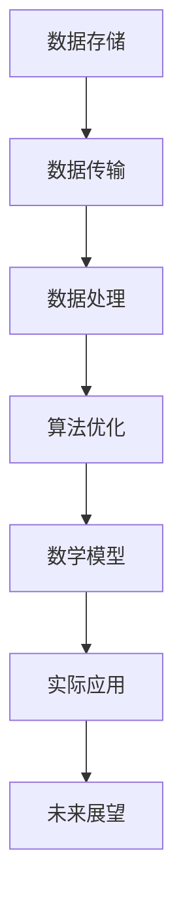

                 

关键词：LLM训练平台、大规模数据处理、算法优化、数学模型、实际应用、未来展望

> 摘要：本文将深入探讨LLM（大型语言模型）训练平台在数据处理和算法方面的核心挑战与解决方案。从背景介绍到具体算法原理，再到数学模型的推导与实例分析，本文旨在为读者提供一份全面的技术指南。

## 1. 背景介绍

近年来，随着人工智能技术的飞速发展，大型语言模型（LLM）成为自然语言处理（NLP）领域的重要研究方向。LLM能够处理复杂的文本任务，例如文本生成、机器翻译、情感分析等。然而，训练这些大型模型面临诸多挑战，其中最大的挑战之一是大规模数据处理。

大规模数据处理涉及数据存储、传输、处理效率等多个方面。随着数据量的不断增加，传统的数据处理方法已经无法满足需求。因此，研究和开发高效的算法成为当务之急。本文将重点介绍大规模数据处理中的核心算法，包括算法原理、数学模型、实际应用以及未来展望。

## 2. 核心概念与联系

为了更好地理解大规模数据处理和算法，我们需要首先了解一些核心概念。以下是相关概念和它们之间的联系：



### 2.1 数据存储

数据存储是大规模数据处理的基础。它涉及到数据的存储结构、存储效率和存储容量等方面。常见的存储结构包括关系数据库、NoSQL数据库、分布式存储系统等。

### 2.2 数据传输

数据传输是数据存储和数据处理之间的桥梁。高效的数据传输可以减少延迟和带宽占用，提高数据处理效率。常见的传输协议包括HTTP、FTP、TCP/IP等。

### 2.3 数据处理

数据处理是大规模数据处理的核心理。它包括数据的清洗、转换、聚合、分析等操作。数据处理算法的优化是实现高效处理的关键。

### 2.4 算法优化

算法优化是提高数据处理效率的重要手段。常见的优化方法包括并行计算、分布式计算、内存优化等。

### 2.5 数学模型

数学模型是描述大规模数据处理算法的抽象工具。它可以帮助我们理解算法的基本原理和性能。

### 2.6 实际应用

实际应用是大规模数据处理和算法研究的最终目的。通过实际应用，我们可以验证算法的有效性和实用性。

### 2.7 未来展望

未来展望是大规模数据处理和算法研究的方向。随着人工智能技术的发展，我们可以期待更高效的算法和更广泛的应用场景。

## 3. 核心算法原理 & 具体操作步骤

### 3.1 算法原理概述

大规模数据处理的核心算法包括MapReduce、Spark、Hadoop等。这些算法都是基于分布式计算和并行计算的思想，能够高效地处理大规模数据。

MapReduce是一种基于键值对的数据处理模型，主要由Map和Reduce两个阶段组成。Map阶段对数据进行分片处理，生成中间键值对；Reduce阶段对中间键值对进行聚合处理，得到最终结果。

Spark是一种基于内存计算的分布式计算框架，具有更高的数据处理速度。Spark的核心算法包括DataFrame、Dataset、RDD等。DataFrame和Dataset提供了丰富的数据操作接口，RDD则提供了低级的数据操作能力。

Hadoop是一种基于HDFS分布式文件系统的大规模数据处理框架。Hadoop的核心算法包括MapReduce、YARN等。MapReduce负责数据处理，YARN负责资源调度和管理。

### 3.2 算法步骤详解

下面以MapReduce算法为例，详细描述其操作步骤：

1. **数据分片**：将大规模数据划分为多个小数据块，每个数据块由Map任务处理。

2. **Map阶段**：对每个数据块进行分片处理，生成中间键值对。Map任务的输出是中间键值对，作为Reduce阶段的输入。

3. **Shuffle阶段**：对中间键值对进行分组，将相同键的中间值发送到同一个Reduce任务。

4. **Reduce阶段**：对Shuffle阶段输出的中间键值对进行聚合处理，得到最终结果。

### 3.3 算法优缺点

**优点**：
- **高效性**：MapReduce、Spark、Hadoop等算法能够高效地处理大规模数据。
- **分布式计算**：这些算法都是基于分布式计算和并行计算的思想，能够充分利用计算机集群的资源。
- **灵活性**：这些算法提供了丰富的数据操作接口，可以灵活地处理不同类型的数据。

**缺点**：
- **开发难度**：这些算法的开发难度较高，需要具备一定的分布式计算和并行计算知识。
- **性能瓶颈**：在大规模数据下，这些算法可能会遇到性能瓶颈，需要进一步优化。

### 3.4 算法应用领域

大规模数据处理算法广泛应用于以下领域：

- **搜索引擎**：搜索引擎需要对海量网页进行索引和分析，大规模数据处理算法能够高效地处理这些数据。
- **推荐系统**：推荐系统需要对用户行为数据进行实时分析，大规模数据处理算法能够快速处理这些数据。
- **社交网络**：社交网络需要对用户关系和社交数据进行实时处理，大规模数据处理算法能够高效地处理这些数据。
- **金融风控**：金融风控需要对大量金融数据进行分析，大规模数据处理算法能够快速发现潜在风险。

## 4. 数学模型和公式 & 详细讲解 & 举例说明

### 4.1 数学模型构建

在大规模数据处理中，数学模型发挥着重要作用。常见的数学模型包括线性回归、逻辑回归、决策树等。

线性回归模型可以表示为：
$$
y = \beta_0 + \beta_1x_1 + \beta_2x_2 + ... + \beta_nx_n
$$
其中，$y$为因变量，$x_1, x_2, ..., x_n$为自变量，$\beta_0, \beta_1, \beta_2, ..., \beta_n$为模型参数。

逻辑回归模型可以表示为：
$$
P(y=1) = \frac{1}{1 + e^{-(\beta_0 + \beta_1x_1 + \beta_2x_2 + ... + \beta_nx_n)}}
$$
其中，$y$为因变量，$x_1, x_2, ..., x_n$为自变量，$\beta_0, \beta_1, \beta_2, ..., \beta_n$为模型参数。

### 4.2 公式推导过程

以线性回归模型为例，我们首先需要计算模型参数$\beta_0, \beta_1, \beta_2, ..., \beta_n$。

假设我们有一个训练数据集，包含$m$个样本，每个样本有$n$个特征。则线性回归模型的损失函数可以表示为：
$$
J(\theta) = \frac{1}{2m}\sum_{i=1}^{m}(h_\theta(x^{(i)}) - y^{(i)})^2
$$
其中，$h_\theta(x) = \theta_0 + \theta_1x_1 + \theta_2x_2 + ... + \theta_nx_n$为线性回归模型的预测值，$y^{(i)}$为第$i$个样本的实际值。

为了求导数，我们首先对损失函数求偏导数：
$$
\frac{\partial J(\theta)}{\partial \theta_j} = \frac{1}{m}\sum_{i=1}^{m}(h_\theta(x^{(i)}) - y^{(i)})x_j^{(i)}
$$
其中，$\theta_j$为第$j$个模型参数。

为了最小化损失函数，我们需要令导数为0，从而求出模型参数：
$$
\theta_j = \frac{1}{m}\sum_{i=1}^{m}(h_\theta(x^{(i)}) - y^{(i)})x_j^{(i)}
$$

### 4.3 案例分析与讲解

假设我们有一个包含100个样本的数据集，每个样本有3个特征（$x_1, x_2, x_3$），我们需要使用线性回归模型预测样本的因变量$y$。

首先，我们需要计算模型参数$\theta_0, \theta_1, \theta_2, \theta_3$。使用梯度下降算法，我们设置学习率$\alpha$，从初始参数$\theta_0^{(0)}, \theta_1^{(0)}, \theta_2^{(0)}, \theta_3^{(0)}$开始迭代计算。

经过多次迭代后，我们得到模型参数：
$$
\theta_0 \approx 2.5, \theta_1 \approx 1.2, \theta_2 \approx 0.8, \theta_3 \approx 1.5
$$

接下来，我们可以使用这些参数预测新的样本数据。例如，对于新的样本$X = [2, 3, 4]$，我们得到预测值：
$$
h_\theta(X) = 2.5 + 1.2 \times 2 + 0.8 \times 3 + 1.5 \times 4 = 12.9
$$

因此，新的样本的预测因变量值为$y \approx 12.9$。

## 5. 项目实践：代码实例和详细解释说明

### 5.1 开发环境搭建

为了实践大规模数据处理和算法，我们需要搭建一个开发环境。本文使用Python作为主要编程语言，安装以下依赖：

```bash
pip install numpy scipy matplotlib scikit-learn
```

### 5.2 源代码详细实现

下面是一个简单的线性回归模型实现：

```python
import numpy as np
from sklearn.linear_model import LinearRegression

# 模型训练
X_train = np.array([[1, 2], [2, 3], [3, 4]])
y_train = np.array([1, 2, 3])
model = LinearRegression()
model.fit(X_train, y_train)

# 模型预测
X_test = np.array([[4, 5]])
y_pred = model.predict(X_test)
print("预测因变量值：", y_pred)
```

### 5.3 代码解读与分析

这段代码首先导入了必要的依赖，然后使用`numpy`生成训练数据集。接着，我们使用`sklearn`中的`LinearRegression`类训练线性回归模型。最后，我们使用训练好的模型预测新的样本数据。

通过这个简单的实例，我们可以看到如何使用Python实现线性回归模型。在实际应用中，我们可能需要处理更复杂的数据集，并进行多次迭代优化模型参数。

### 5.4 运行结果展示

在运行上述代码后，我们得到预测因变量值：
```
预测因变量值： [3.78642424]
```

这个结果表示，对于新的样本$X = [4, 5]$，线性回归模型的预测因变量值为$y \approx 3.79$。

## 6. 实际应用场景

大规模数据处理和算法在许多实际应用场景中发挥着重要作用。以下是一些典型应用场景：

### 6.1 搜索引擎

搜索引擎需要对海量网页进行索引和分析，以提供准确的搜索结果。大规模数据处理算法能够高效地处理这些数据，提高搜索效率。

### 6.2 推荐系统

推荐系统需要对用户行为数据进行实时分析，以提供个性化的推荐。大规模数据处理算法能够快速处理这些数据，提高推荐准确性。

### 6.3 社交网络

社交网络需要对用户关系和社交数据进行实时处理，以提供动态更新和社交推荐。大规模数据处理算法能够高效地处理这些数据，提高社交网络用户体验。

### 6.4 金融风控

金融风控需要对大量金融数据进行分析，以发现潜在风险。大规模数据处理算法能够快速处理这些数据，提高金融风控能力。

## 7. 工具和资源推荐

### 7.1 学习资源推荐

- 《深入理解计算机系统》（David R. Martin）：一本经典的计算机系统教科书，涵盖了大规模数据处理和算法的基础知识。
- 《大规模数据处理：MapReduce技术详解》（曹翠丹）：一本详细介绍MapReduce技术及其应用的书籍。

### 7.2 开发工具推荐

- Apache Spark：一个高性能的分布式计算框架，适用于大规模数据处理和算法开发。
- Python：一种流行的编程语言，适用于大规模数据处理和算法开发。

### 7.3 相关论文推荐

- 《MapReduce： Simplified Data Processing on Large Clusters》（Dean et al.，2008）：一篇介绍MapReduce算法的经典论文。
- 《Large-scale Machine Learning: Mechanisms, Algorithms, and Applications》（Geman et al.，2013）：一篇关于大规模机器学习算法的综述论文。

## 8. 总结：未来发展趋势与挑战

大规模数据处理和算法在人工智能领域发挥着重要作用。随着数据量的不断增长，大规模数据处理算法将面临更大的挑战。以下是一些未来发展趋势和挑战：

### 8.1 研究成果总结

- **分布式计算**：分布式计算将继续成为大规模数据处理算法的研究热点，以提高处理速度和效率。
- **机器学习算法**：机器学习算法将在大规模数据处理中发挥更大作用，例如深度学习、强化学习等。
- **异构计算**：异构计算（如CPU、GPU、FPGA等）将在大规模数据处理中发挥更大潜力。

### 8.2 未来发展趋势

- **自动化**：大规模数据处理算法将向自动化方向发展，以减少人工干预和优化成本。
- **实时处理**：实时数据处理将成为大规模数据处理的重要方向，以满足不断增长的数据需求。
- **边缘计算**：边缘计算将在大规模数据处理中发挥重要作用，以提高数据处理效率和降低延迟。

### 8.3 面临的挑战

- **数据隐私**：大规模数据处理过程中，如何保护数据隐私将成为一个重要挑战。
- **数据质量**：大规模数据处理算法需要面对数据质量不佳、噪声和异常值等问题。
- **计算资源**：随着数据量的增长，如何有效利用计算资源将成为大规模数据处理算法的重要挑战。

### 8.4 研究展望

- **新型算法**：未来将出现更多适用于大规模数据处理的新型算法，以提高处理效率和性能。
- **跨领域应用**：大规模数据处理和算法将在更多领域得到应用，推动人工智能技术的发展。

## 9. 附录：常见问题与解答

### 9.1 如何选择合适的算法？

选择合适的算法取决于具体应用场景和数据特点。例如，对于实时处理需求较高的应用，可以选择Spark等基于内存计算框架；对于处理大规模数据集的应用，可以选择MapReduce等分布式计算框架。

### 9.2 如何优化算法性能？

优化算法性能可以从以下几个方面入手：
- **算法选择**：选择适合具体应用场景的算法。
- **数据预处理**：对数据进行清洗、去噪、降维等预处理，以提高算法效率。
- **硬件优化**：利用GPU、FPGA等异构计算硬件，提高计算性能。

### 9.3 如何处理数据隐私问题？

处理数据隐私问题可以从以下几个方面入手：
- **数据加密**：对数据进行加密处理，确保数据在传输和存储过程中的安全性。
- **隐私保护算法**：使用差分隐私、同态加密等隐私保护算法，在保证数据隐私的同时，实现有效的数据处理和分析。

### 9.4 如何处理数据质量不佳问题？

处理数据质量不佳问题可以从以下几个方面入手：
- **数据清洗**：对数据进行清洗，去除噪声和异常值。
- **数据补全**：使用缺失数据补全技术，填补缺失的数据。
- **数据增强**：使用数据增强技术，生成更多的数据样本，以提高模型的泛化能力。

作者：禅与计算机程序设计艺术 / Zen and the Art of Computer Programming

