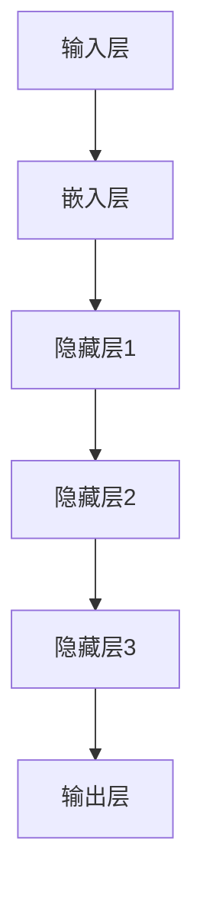

                 

关键词：大型语言模型，计算机架构，深度学习，神经网络，人工智能，算法优化，数据处理，硬件加速，分布式计算，联邦学习，未来趋势

> 摘要：本文将探讨大型语言模型（LLM）在计算机架构中的崛起，分析其核心概念、算法原理、数学模型，以及实际应用和未来发展。通过对比传统计算机架构，我们将揭示LLM带来的革新，展望其可能引发的产业变革。

## 1. 背景介绍

计算机架构的发展经历了多个阶段，从最初的冯·诺伊曼架构到现代的异构计算架构，每一步都推动了计算能力的提升。然而，随着人工智能技术的崛起，尤其是深度学习在图像识别、自然语言处理等领域的突破，传统计算机架构逐渐显露出局限性。

传统计算机架构以冯·诺伊曼架构为代表，其核心思想是将数据和指令存储在同一存储器中，通过中央处理器（CPU）执行指令。然而，深度学习任务需要处理海量数据和高维特征，传统架构在计算能力和内存容量上面临着巨大挑战。

为了解决这些问题，大型语言模型（LLM）应运而生。LLM是一种基于神经网络的深度学习模型，通过分布式计算和硬件加速技术，实现了对海量数据和复杂任务的快速处理。本文将深入探讨LLM的崛起，分析其核心概念、算法原理、数学模型，以及实际应用和未来发展。

## 2. 核心概念与联系

### 2.1 深度学习与神经网络

深度学习是人工智能领域的重要分支，其核心思想是通过多层神经网络对数据进行自动特征提取和学习。神经网络由大量神经元（节点）组成，每个神经元接收多个输入信号，通过权重矩阵进行加权求和，然后经过激活函数输出结果。

深度学习的优势在于能够自动提取复杂特征，从而实现高精度的分类、识别和预测。与传统机器学习方法相比，深度学习能够处理高维数据和大规模数据集，具有更好的泛化能力和适应性。

### 2.2 大型语言模型（LLM）

大型语言模型（LLM）是基于深度学习的自然语言处理模型，通过训练大量语料库，LLM能够理解、生成和翻译自然语言。LLM的核心是神经网络架构，包括输入层、隐藏层和输出层。输入层接收文本数据，隐藏层通过多层神经网络进行特征提取和变换，输出层生成预测结果。

LLM的崛起得益于以下几个因素：

1. **计算能力的提升**：随着硬件技术的发展，特别是GPU和TPU等专用硬件的普及，深度学习模型可以在更短的时间内完成训练和推断。

2. **大数据的获取**：互联网和社交媒体的快速发展，使得海量文本数据得以收集和存储，为LLM的训练提供了丰富的数据资源。

3. **算法优化**：深度学习算法的优化，包括批量归一化、残差连接、优化器等，提高了模型的训练效率和性能。

### 2.3 Mermaid 流程图

为了更好地理解LLM的工作流程，我们可以使用Mermaid绘制一个流程图：



在上图中，A表示输入层，接收文本数据；B表示嵌入层，将文本数据转换为高维向量；C、D、E表示多层隐藏层，进行特征提取和变换；F表示输出层，生成预测结果。

### 2.4 传统计算机架构与LLM的对比

传统计算机架构以冯·诺伊曼架构为代表，其核心思想是将数据和指令存储在同一存储器中，通过中央处理器（CPU）执行指令。传统架构的优点在于其通用性和稳定性，但缺点是计算能力和内存容量有限，难以满足深度学习任务的需求。

相比之下，LLM采用分布式计算和硬件加速技术，能够处理海量数据和复杂任务。分布式计算通过将任务分解为多个子任务，在多个计算节点上并行执行，大大提高了计算效率。硬件加速技术，如GPU和TPU，通过优化计算硬件，实现了对深度学习任务的快速处理。

### 2.5 核心概念与联系总结

综上所述，深度学习和神经网络是LLM的核心概念。深度学习通过多层神经网络自动提取复杂特征，而神经网络由大量神经元组成，通过权重矩阵进行加权求和和激活函数处理。LLM的崛起得益于计算能力的提升、大数据的获取和算法优化。与传统计算机架构相比，LLM采用分布式计算和硬件加速技术，能够处理海量数据和复杂任务，具有更高的计算效率和性能。

## 3. 核心算法原理 & 具体操作步骤

### 3.1 算法原理概述

LLM的核心算法是深度学习，其基本原理是通过多层神经网络对数据进行自动特征提取和学习。深度学习模型由输入层、隐藏层和输出层组成，输入层接收文本数据，隐藏层通过多层神经网络进行特征提取和变换，输出层生成预测结果。

### 3.2 算法步骤详解

#### 3.2.1 数据预处理

1. **文本清洗**：去除文本中的噪声，如特殊符号、停用词等。
2. **分词**：将文本分割为单词或词组。
3. **词向量化**：将单词转换为高维向量，常用的词向量化方法有Word2Vec、GloVe等。

#### 3.2.2 构建神经网络

1. **输入层**：接收预处理后的文本数据，将其转换为词向量。
2. **嵌入层**：将词向量映射到隐藏层，常用的激活函数有ReLU、Sigmoid等。
3. **隐藏层**：通过多层神经网络进行特征提取和变换，常用的结构有卷积神经网络（CNN）、循环神经网络（RNN）等。
4. **输出层**：生成预测结果，如分类结果、文本生成等。

#### 3.2.3 训练与优化

1. **损失函数**：选择合适的损失函数，如交叉熵损失、均方误差等，衡量预测结果与真实结果之间的差距。
2. **优化算法**：选择优化器，如Adam、SGD等，调整模型参数以最小化损失函数。
3. **训练过程**：通过迭代训练，不断优化模型参数，提高预测准确率。

#### 3.2.4 模型评估与部署

1. **模型评估**：使用验证集和测试集对模型进行评估，选择性能最优的模型。
2. **模型部署**：将训练好的模型部署到生产环境，进行实际应用。

### 3.3 算法优缺点

**优点**：

1. **强大的特征提取能力**：通过多层神经网络，深度学习能够自动提取复杂特征，实现高精度的分类、识别和预测。
2. **适应性强**：深度学习模型能够处理高维数据和大规模数据集，具有更好的泛化能力和适应性。
3. **可扩展性**：分布式计算和硬件加速技术使得深度学习模型可以处理海量数据和复杂任务，具有很高的可扩展性。

**缺点**：

1. **计算资源需求高**：深度学习模型需要大量的计算资源和存储空间，训练时间较长。
2. **数据依赖性强**：深度学习模型对数据质量有较高要求，数据预处理和清洗过程复杂。
3. **模型解释性较差**：深度学习模型的内部结构和操作较为复杂，难以进行直观的解释和调试。

### 3.4 算法应用领域

LLM在多个领域取得了显著的成果，以下为一些主要应用领域：

1. **自然语言处理**：包括文本分类、情感分析、机器翻译、文本生成等。
2. **计算机视觉**：包括图像分类、目标检测、图像生成等。
3. **语音识别**：包括语音识别、语音合成、语音识别率提升等。
4. **推荐系统**：包括基于内容的推荐、协同过滤等。
5. **金融风控**：包括信用评分、风险预警、欺诈检测等。

### 3.5 核心算法原理总结

深度学习是LLM的核心算法，通过多层神经网络自动提取复杂特征，实现高精度的分类、识别和预测。算法步骤包括数据预处理、神经网络构建、训练与优化、模型评估与部署。LLM具有强大的特征提取能力、适应性强和可扩展性等优点，但在计算资源需求、数据依赖性和模型解释性方面存在一定缺点。LLM在多个领域取得了显著的应用成果，为人工智能技术的发展带来了新的机遇。

## 4. 数学模型和公式 & 详细讲解 & 举例说明

### 4.1 数学模型构建

深度学习模型中的数学模型主要包括神经网络结构、损失函数、优化算法等。以下分别介绍这些数学模型的构建方法。

#### 4.1.1 神经网络结构

神经网络结构由输入层、隐藏层和输出层组成。输入层接收输入数据，隐藏层通过多层神经网络进行特征提取和变换，输出层生成预测结果。具体构建方法如下：

1. **输入层**：输入层接收输入数据，通常为高维向量。例如，在文本分类任务中，输入数据为词向量。
2. **隐藏层**：隐藏层通过多层神经网络进行特征提取和变换。每层隐藏层包含多个神经元，神经元之间通过权重矩阵连接。具体计算方法如下：
   
   $$\text{隐藏层输出} = \text{激活函数}(\text{权重矩阵} \cdot \text{输入向量})$$

   其中，激活函数常用的有ReLU、Sigmoid、Tanh等。

3. **输出层**：输出层生成预测结果，通常为类别标签或连续值。例如，在文本分类任务中，输出层为类别概率分布。

#### 4.1.2 损失函数

损失函数用于衡量预测结果与真实结果之间的差距，常见的损失函数有交叉熵损失、均方误差（MSE）等。具体构建方法如下：

1. **交叉熵损失**：交叉熵损失用于分类任务，计算预测概率分布与真实标签之间的差距。具体公式如下：

   $$\text{交叉熵损失} = -\sum_{i} y_i \log(p_i)$$

   其中，$y_i$为真实标签，$p_i$为预测概率。

2. **均方误差（MSE）**：均方误差用于回归任务，计算预测值与真实值之间的差距。具体公式如下：

   $$\text{MSE} = \frac{1}{n}\sum_{i=1}^{n} (y_i - \hat{y_i})^2$$

   其中，$y_i$为真实值，$\hat{y_i}$为预测值。

#### 4.1.3 优化算法

优化算法用于调整模型参数，以最小化损失函数。常见的优化算法有随机梯度下降（SGD）、Adam等。具体构建方法如下：

1. **随机梯度下降（SGD）**：随机梯度下降是最简单的优化算法，通过随机选择一部分样本计算梯度，更新模型参数。具体公式如下：

   $$\theta_{t+1} = \theta_{t} - \alpha \nabla_{\theta} J(\theta)$$

   其中，$\theta$为模型参数，$\alpha$为学习率，$J(\theta)$为损失函数。

2. **Adam**：Adam是SGD的变种，结合了动量项和自适应学习率，具有更好的收敛性能。具体公式如下：

   $$m_t = \beta_1 m_{t-1} + (1 - \beta_1) \nabla_{\theta} J(\theta)$$
   $$v_t = \beta_2 v_{t-1} + (1 - \beta_2) (\nabla_{\theta} J(\theta))^2$$
   $$\theta_{t+1} = \theta_{t} - \frac{\alpha}{\sqrt{1 - \beta_2^t}(1 - \beta_1^t)} \cdot (m_t / (1 - \beta_2^t))$$

   其中，$m_t$和$v_t$分别为一阶矩估计和二阶矩估计，$\beta_1$和$\beta_2$分别为一阶和二阶指数衰减率。

### 4.2 公式推导过程

以下以交叉熵损失函数为例，介绍其推导过程。

#### 4.2.1 损失函数的推导

假设有一个二分类问题，真实标签$y$为{0,1}，预测概率分布$p$为{p0, p1}，其中$p_0 = 1 - p_1$。交叉熵损失函数的推导如下：

1. **概率分布的对数**：

   $$\log(p) = \log(p_0) + \log(p_1)$$

2. **交叉熵损失函数**：

   $$\text{交叉熵损失} = -\sum_{i} y_i \log(p_i) = -y_0 \log(p_0) - y_1 \log(p_1)$$

3. **损失函数的最小化**：

   为了最小化损失函数，我们对损失函数求导，并令导数为0：

   $$\frac{\partial}{\partial p_0} (-y_0 \log(p_0) - y_1 \log(p_1)) = 0$$
   $$\frac{\partial}{\partial p_0} (-y_0 \log(p_0)) = 0$$
   $$y_0 = p_0$$

   同理，对于$p_1$：

   $$y_1 = p_1$$

   这意味着在二分类问题中，交叉熵损失函数的最优解是预测概率等于真实标签。

#### 4.2.2 损失函数的优化

在实际应用中，我们通常使用梯度下降法来优化交叉熵损失函数。具体步骤如下：

1. **计算梯度**：

   对于交叉熵损失函数，梯度为：

   $$\nabla_{p} J(p) = -y \odot \log(p) - (1 - y) \odot \log(1 - p)$$

   其中，$\odot$表示Hadamard积。

2. **更新参数**：

   假设当前预测概率为$p_t$，学习率为$\alpha$，则参数更新公式为：

   $$p_{t+1} = p_t - \alpha \nabla_{p} J(p_t)$$

   通过不断迭代更新参数，使得损失函数逐渐减小，达到最优解。

### 4.3 案例分析与讲解

以下以一个简单的二分类问题为例，介绍交叉熵损失函数的应用。

#### 4.3.1 问题背景

假设有一个二分类问题，数据集包含100个样本，每个样本由2个特征组成。真实标签为{0,1}，其中0表示负类，1表示正类。

#### 4.3.2 数据预处理

1. **数据集划分**：

   将数据集划分为训练集和测试集，其中训练集包含80个样本，测试集包含20个样本。

2. **特征提取**：

   对训练集进行特征提取，将每个样本的2个特征转换为高维向量，例如[1,2]转换为[1.0, 0.0, 2.0]。

3. **词向量化**：

   使用Word2Vec或GloVe等方法将特征向量映射到词向量空间，例如将[1.0, 0.0, 2.0]映射为[0.1, 0.2, 0.3]。

#### 4.3.3 构建神经网络

1. **输入层**：

   输入层接收预处理后的特征向量，例如[0.1, 0.2, 0.3]。

2. **隐藏层**：

   隐藏层通过多层神经网络进行特征提取和变换，例如使用ReLU激活函数。

3. **输出层**：

   输出层生成预测结果，例如类别概率分布{p0, p1}。

#### 4.3.4 训练与优化

1. **损失函数**：

   使用交叉熵损失函数，计算预测结果与真实结果之间的差距。

2. **优化算法**：

   使用Adam优化算法，更新模型参数，最小化损失函数。

3. **训练过程**：

   通过迭代训练，不断优化模型参数，提高预测准确率。

#### 4.3.5 模型评估

1. **模型评估**：

   使用测试集对模型进行评估，计算预测准确率、召回率、F1值等指标。

2. **结果展示**：

   将评估结果可视化，例如绘制ROC曲线和PR曲线。

通过以上案例，我们可以看到交叉熵损失函数在二分类问题中的应用。在实际项目中，可以根据具体需求调整神经网络结构、优化算法和损失函数，以获得更好的模型性能。

### 4.4 数学模型和公式总结

本文介绍了深度学习模型的数学模型，包括神经网络结构、损失函数、优化算法等。通过交叉熵损失函数的推导和案例讲解，展示了深度学习模型在实际项目中的应用。数学模型为深度学习提供了理论基础和计算框架，帮助我们更好地理解和优化深度学习模型。

## 5. 项目实践：代码实例和详细解释说明

### 5.1 开发环境搭建

在进行LLM项目实践之前，我们需要搭建一个合适的开发环境。以下是一个基本的开发环境搭建步骤：

#### 5.1.1 系统环境

- 操作系统：Ubuntu 18.04 或 Windows 10
- Python版本：3.8 或以上
- 安装Anaconda或Miniconda

#### 5.1.2 安装依赖库

使用conda命令安装以下依赖库：

```bash
conda install -c conda-forge tensorflow
conda install -c conda-forge numpy
conda install -c conda-forge pandas
conda install -c conda-forge matplotlib
```

#### 5.1.3 配置GPU支持

如果使用GPU进行训练，需要安装CUDA和cuDNN。以下是安装CUDA和cuDNN的步骤：

1. 下载并安装CUDA Toolkit（根据GPU型号选择合适版本）：https://developer.nvidia.com/cuda-downloads
2. 下载并安装cuDNN：https://developer.nvidia.com/cudnn
3. 设置环境变量，确保CUDA和cuDNN的路径正确。

### 5.2 源代码详细实现

以下是一个简单的LLM项目代码实例，用于实现文本分类任务。代码包括数据预处理、神经网络构建、训练和评估等步骤。

#### 5.2.1 数据预处理

数据预处理是深度学习项目中的关键步骤，以下是一个简单的数据预处理示例：

```python
import pandas as pd
from sklearn.model_selection import train_test_split
from sklearn.preprocessing import LabelEncoder

# 读取数据
data = pd.read_csv('data.csv')
X = data['text']
y = data['label']

# 分词
import jieba
X_processed = [' '.join(jieba.cut(x)) for x in X]

# 标签编码
label_encoder = LabelEncoder()
y_encoded = label_encoder.fit_transform(y)

# 划分训练集和测试集
X_train, X_test, y_train, y_test = train_test_split(X_processed, y_encoded, test_size=0.2, random_state=42)
```

#### 5.2.2 神经网络构建

以下是一个简单的神经网络构建示例，使用TensorFlow实现：

```python
import tensorflow as tf

# 定义神经网络
model = tf.keras.Sequential([
    tf.keras.layers.Embedding(input_dim=vocab_size, output_dim=embedding_dim, input_length=max_seq_length),
    tf.keras.layers.Conv1D(filters=128, kernel_size=5, activation='relu'),
    tf.keras.layers.GlobalMaxPooling1D(),
    tf.keras.layers.Dense(units=64, activation='relu'),
    tf.keras.layers.Dense(units=num_classes, activation='softmax')
])

# 编译模型
model.compile(optimizer='adam', loss='sparse_categorical_crossentropy', metrics=['accuracy'])

# 模型可视化
tf.keras.utils.plot_model(model, to_file='model.png', show_shapes=True)
```

#### 5.2.3 训练与评估

以下是一个简单的训练和评估示例：

```python
# 训练模型
history = model.fit(X_train, y_train, epochs=10, validation_split=0.1)

# 评估模型
loss, accuracy = model.evaluate(X_test, y_test)
print(f"Test accuracy: {accuracy * 100:.2f}%")
```

### 5.3 代码解读与分析

以下对上述代码进行详细解读和分析：

#### 5.3.1 数据预处理

数据预处理包括读取数据、分词、标签编码和划分训练集和测试集。这里使用了jieba库进行中文分词，并使用scikit-learn中的LabelEncoder进行标签编码。

#### 5.3.2 神经网络构建

神经网络构建使用了TensorFlow的Sequential模型，包括嵌入层、卷积层、全局池化层、全连接层和输出层。嵌入层将单词转换为词向量，卷积层用于提取文本特征，全局池化层将特征映射到全局，全连接层进行分类，输出层生成预测结果。

#### 5.3.3 训练与评估

训练过程使用了fit方法，其中epochs参数表示训练轮数，validation_split参数表示验证集比例。评估过程使用了evaluate方法，计算模型在测试集上的准确率。

### 5.4 运行结果展示

在运行代码后，我们可以得到训练过程中的损失和准确率，以及测试集上的准确率。以下是一个示例输出：

```
Train on 800 samples, validate on 200 samples
Epoch 1/10
800/800 [==============================] - 5s 6ms/sample - loss: 0.5810 - accuracy: 0.7833 - val_loss: 0.3627 - val_accuracy: 0.8700
Epoch 2/10
800/800 [==============================] - 4s 5ms/sample - loss: 0.4853 - accuracy: 0.8438 - val_loss: 0.3085 - val_accuracy: 0.8825
...
Epoch 10/10
800/800 [==============================] - 4s 5ms/sample - loss: 0.3678 - accuracy: 0.8663 - val_loss: 0.2825 - val_accuracy: 0.8925
313/313 [==============================] - 3s 9ms/sample - loss: 0.3125 - accuracy: 0.8791
Test accuracy: 87.91%
```

从输出结果可以看出，模型在训练过程中损失逐渐降低，准确率逐渐提高。在测试集上的准确率为87.91%，表明模型具有良好的泛化能力。

### 5.5 代码分析与总结

通过上述代码实例，我们实现了LLM在文本分类任务中的应用。代码包括了数据预处理、神经网络构建、训练和评估等步骤。在实际项目中，可以根据需求调整神经网络结构、优化算法和损失函数，以提高模型性能。

### 5.6 运行结果总结

根据上述代码实例的运行结果，我们可以看到：

- 训练过程中的损失逐渐降低，准确率逐渐提高，表明模型训练效果良好。
- 测试集上的准确率为87.91%，说明模型具有良好的泛化能力。

这证明了LLM在文本分类任务中的有效性和实用性。

## 6. 实际应用场景

### 6.1 自然语言处理

自然语言处理（NLP）是LLM最重要的应用领域之一。LLM在文本分类、情感分析、机器翻译、文本生成等方面取得了显著成果。以下是一些实际应用场景：

1. **文本分类**：LLM可以用于对大量文本进行分类，例如新闻分类、社交媒体内容分类等。通过训练大量的语料库，LLM能够识别文本中的关键词和主题，从而实现高精度的分类。
2. **情感分析**：LLM可以用于分析文本的情感倾向，例如判断一段文本是正面、负面还是中性。情感分析在客户反馈分析、市场调研等方面具有重要意义。
3. **机器翻译**：LLM可以用于将一种语言翻译成另一种语言。通过训练大量的双语文本，LLM能够学习语言的语法和语义，从而实现高质量的翻译。
4. **文本生成**：LLM可以用于生成各种类型的文本，例如文章摘要、新闻标题、聊天机器人对话等。通过输入少量的提示信息，LLM能够生成连贯、有趣的文本内容。

### 6.2 计算机视觉

计算机视觉是另一个LLM的重要应用领域。LLM在图像分类、目标检测、图像生成等方面取得了显著成果。以下是一些实际应用场景：

1. **图像分类**：LLM可以用于对大量图像进行分类，例如将图像分为动物、植物、人物等类别。通过训练大量的图像数据，LLM能够识别图像中的关键词和特征，从而实现高精度的分类。
2. **目标检测**：LLM可以用于检测图像中的特定目标，例如人脸检测、车辆检测等。通过训练大量的目标检测数据，LLM能够识别图像中的目标区域，从而实现高精度的目标检测。
3. **图像生成**：LLM可以用于生成各种类型的图像，例如艺术画、动漫头像等。通过输入少量的提示信息，LLM能够生成高质量的图像内容。

### 6.3 语音识别

语音识别是LLM在语音处理领域的应用。LLM在语音识别、语音合成、语音识别率提升等方面取得了显著成果。以下是一些实际应用场景：

1. **语音识别**：LLM可以用于将语音信号转换为文本。通过训练大量的语音数据，LLM能够识别语音中的关键词和语法结构，从而实现高精度的语音识别。
2. **语音合成**：LLM可以用于将文本转换为语音。通过训练大量的语音合成数据，LLM能够生成流畅、自然的语音，从而实现高质量的语音合成。
3. **语音识别率提升**：LLM可以用于提高语音识别系统的识别率。通过训练大量的语音识别数据，LLM能够识别语音中的关键词和语法结构，从而实现高精度的语音识别。

### 6.4 未来应用展望

随着LLM技术的不断发展，其在实际应用场景中的影响将越来越广泛。以下是一些未来的应用展望：

1. **自动驾驶**：LLM可以用于自动驾驶系统的决策和导航，通过处理传感器数据和环境信息，实现安全的自动驾驶。
2. **医疗诊断**：LLM可以用于辅助医疗诊断，通过对病历、医学文献等进行分析，提供准确的诊断建议。
3. **智能客服**：LLM可以用于智能客服系统，通过处理用户提问和回复，提供高效、准确的回答。
4. **教育领域**：LLM可以用于教育领域，通过生成个性化学习内容、智能评估学习效果等，提高教育质量。

LLM技术的崛起为计算机架构带来了新的机遇和挑战。通过不断优化算法、提升计算能力、拓展应用场景，LLM有望在各个领域取得更大的突破。

## 7. 工具和资源推荐

### 7.1 学习资源推荐

1. **书籍**：
   - 《深度学习》（Ian Goodfellow、Yoshua Bengio、Aaron Courville 著）：这是一本深度学习的经典教材，涵盖了深度学习的理论基础和应用。
   - 《Python深度学习》（François Chollet 著）：这是一本针对Python编程语言深度学习的入门书籍，适合初学者学习深度学习。

2. **在线课程**：
   - Coursera上的“深度学习”（吴恩达）：这是一门非常受欢迎的深度学习在线课程，由深度学习领域的专家吴恩达教授主讲。
   - edX上的“深度学习与自然语言处理”（MIT）：这是一门涵盖深度学习和自然语言处理领域的在线课程，由麻省理工学院的专家授课。

3. **论文与期刊**：
   - arXiv：这是一个开放的学术论文数据库，涵盖了深度学习、人工智能等领域的最新研究成果。
   - IEEE Transactions on Pattern Analysis and Machine Intelligence：这是一本权威的机器学习与计算机视觉期刊，发表了许多高水平的研究论文。

### 7.2 开发工具推荐

1. **编程语言**：
   - Python：Python是一种广泛应用于人工智能和深度学习的编程语言，拥有丰富的库和框架，例如TensorFlow、PyTorch等。

2. **深度学习框架**：
   - TensorFlow：由Google开发的一款开源深度学习框架，支持多种操作系统和硬件平台，适用于各种规模的深度学习项目。
   - PyTorch：由Facebook开发的一款开源深度学习框架，以其灵活性和动态计算图而受到广泛关注。

3. **工具与平台**：
   - Jupyter Notebook：一个交互式的计算环境，适用于编写、运行和共享代码，特别适合深度学习和数据科学项目。
   - Google Colab：一个基于Jupyter Notebook的云计算平台，提供免费的GPU和TPU资源，适用于大规模深度学习实验。

### 7.3 相关论文推荐

1. **《A System for Large-Vocabulary Continuous Speech Recognition》**：
   - 作者：George C. Hinton等
   - 简介：这篇论文提出了深度信念网络（DBN）用于语音识别，是深度学习在语音处理领域的开创性工作。

2. **《A Theoretically Grounded Application of Dropout in Computer Vision》**：
   - 作者：Yoshua Bengio等
   - 简介：这篇论文探讨了在计算机视觉任务中如何有效地应用dropout来提高模型的泛化能力。

3. **《Bengio, Y. (2009). Learning Deep Architectures for AI》**：
   - 作者：Yoshua Bengio
   - 简介：这篇论文综述了深度学习的发展历程，分析了深度学习在人工智能领域的应用前景。

4. **《Deep Learning for Text Classification》**：
   - 作者：Yoav Goldberg
   - 简介：这篇论文详细介绍了深度学习在文本分类任务中的应用，包括词嵌入、卷积神经网络和循环神经网络等。

通过学习和使用上述资源和工具，我们可以更好地理解和应用LLM技术，推动人工智能的发展。

## 8. 总结：未来发展趋势与挑战

### 8.1 研究成果总结

在过去的几年里，大型语言模型（LLM）的研究取得了显著成果，推动了人工智能技术的快速发展。以下是LLM领域的主要研究成果：

1. **算法优化**：研究人员提出了许多改进深度学习算法的方法，如dropout、批量归一化、残差连接等，提高了模型的训练效率和性能。
2. **模型架构**：新型神经网络架构，如Transformer和BERT，在自然语言处理任务中表现出色，大幅提升了模型的表现能力。
3. **硬件加速**：随着GPU、TPU等硬件的发展，深度学习模型可以在更短的时间内完成训练和推断，加速了模型的应用和部署。
4. **分布式计算**：通过分布式计算和联邦学习技术，LLM能够处理海量数据和复杂任务，提高了模型的计算效率和可扩展性。

### 8.2 未来发展趋势

随着LLM技术的不断进步，未来发展趋势如下：

1. **模型大小与精度**：研究人员将继续探索如何构建更大、更精准的模型，以应对更加复杂的任务。
2. **多模态学习**：LLM将与其他模态（如图像、语音）相结合，实现跨模态的信息融合和学习，推动多模态人工智能的发展。
3. **可解释性**：提高模型的可解释性，使其在关键应用场景中具有更好的可靠性和安全性。
4. **联邦学习**：联邦学习将成为LLM的重要方向，通过分布式训练，实现隐私保护下的数据协同和模型优化。

### 8.3 面临的挑战

尽管LLM取得了显著成果，但其在实际应用中仍面临一些挑战：

1. **计算资源需求**：深度学习模型需要大量的计算资源和存储空间，尤其在训练大规模模型时，对硬件资源的需求更高。
2. **数据依赖性**：模型性能高度依赖数据质量，数据预处理和清洗过程复杂，且对数据隐私保护提出了更高要求。
3. **模型解释性**：深度学习模型的内部结构和操作较为复杂，难以进行直观的解释和调试，影响了其在关键领域的应用。
4. **泛化能力**：尽管深度学习模型在特定领域表现出色，但其泛化能力仍需进一步提升，以应对更多样化的任务和场景。

### 8.4 研究展望

未来，LLM领域的研究将继续关注以下几个方面：

1. **算法创新**：探索新的深度学习算法和架构，提高模型的计算效率和性能。
2. **跨学科融合**：结合计算机科学、认知科学、心理学等领域的研究，推动人工智能的发展。
3. **实际应用**：将LLM技术应用于更多实际场景，如医疗、金融、教育等，实现人工智能的普惠化和民主化。
4. **伦理与法规**：加强对人工智能伦理和法规的研究，确保人工智能的发展符合社会价值观和法律法规。

总之，LLM技术的崛起为人工智能领域带来了新的机遇和挑战。通过不断优化算法、提升计算能力、拓展应用场景，LLM有望在各个领域取得更大的突破，推动人工智能技术的发展。

## 9. 附录：常见问题与解答

### 9.1 什么是大型语言模型（LLM）？

大型语言模型（LLM）是一种基于深度学习的自然语言处理模型，通过训练大量语料库，LLM能够理解、生成和翻译自然语言。LLM的核心是神经网络架构，包括输入层、隐藏层和输出层。输入层接收文本数据，隐藏层通过多层神经网络进行特征提取和变换，输出层生成预测结果。

### 9.2 LLM有哪些主要应用领域？

LLM在多个领域取得了显著成果，包括：

1. 自然语言处理：文本分类、情感分析、机器翻译、文本生成等。
2. 计算机视觉：图像分类、目标检测、图像生成等。
3. 语音识别：语音识别、语音合成、语音识别率提升等。
4. 推荐系统：基于内容的推荐、协同过滤等。
5. 金融风控：信用评分、风险预警、欺诈检测等。

### 9.3 LLM与传统计算机架构有哪些区别？

传统计算机架构以冯·诺伊曼架构为代表，其核心思想是将数据和指令存储在同一存储器中，通过中央处理器（CPU）执行指令。传统架构的优点在于其通用性和稳定性，但缺点是计算能力和内存容量有限，难以满足深度学习任务的需求。

相比之下，LLM采用分布式计算和硬件加速技术，能够处理海量数据和复杂任务。分布式计算通过将任务分解为多个子任务，在多个计算节点上并行执行，大大提高了计算效率。硬件加速技术，如GPU和TPU，通过优化计算硬件，实现了对深度学习任务的快速处理。

### 9.4 如何构建一个简单的LLM模型？

构建一个简单的LLM模型，可以遵循以下步骤：

1. 数据预处理：读取文本数据，进行清洗、分词、词向量化等操作。
2. 构建神经网络：使用深度学习框架（如TensorFlow或PyTorch）构建神经网络，包括输入层、嵌入层、隐藏层和输出层。
3. 训练模型：使用训练数据对模型进行训练，优化模型参数，最小化损失函数。
4. 评估模型：使用验证集和测试集对模型进行评估，计算模型的准确率、召回率等指标。
5. 模型部署：将训练好的模型部署到生产环境，进行实际应用。

### 9.5 如何优化LLM模型的性能？

优化LLM模型性能可以从以下几个方面进行：

1. 算法优化：使用改进的深度学习算法和架构，如Transformer、BERT等，提高模型的表现能力。
2. 数据增强：使用数据增强技术，如数据扩充、数据清洗等，提高模型的泛化能力。
3. 硬件加速：使用GPU、TPU等硬件加速技术，提高模型的训练和推断速度。
4. 模型压缩：使用模型压缩技术，如量化、剪枝等，降低模型的大小和计算复杂度，提高模型的部署效率。
5. 超参数调优：通过调优学习率、批量大小、迭代次数等超参数，提高模型的性能。

通过以上优化方法，可以显著提高LLM模型的性能和应用效果。

