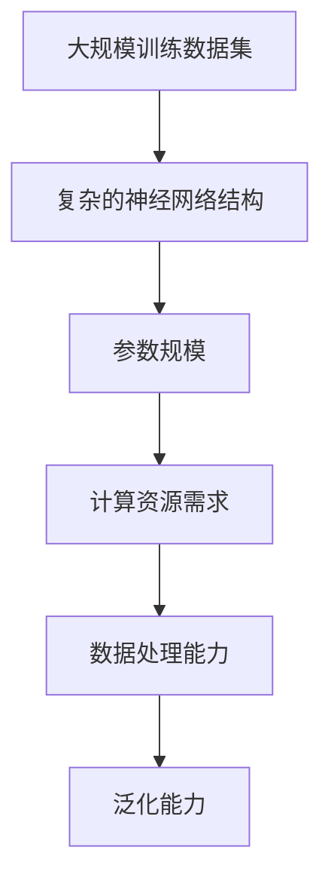

                 

关键词：大型语言模型，通用计算机架构，深度学习，自然语言处理，计算效率

摘要：本文深入探讨了大型语言模型（LLM）作为一种新型通用计算机架构的潜在优势和应用。通过对LLM的核心概念、算法原理、数学模型、项目实践以及未来展望的详细分析，本文旨在为读者提供全面的理解，帮助其把握这一领域的最新动态和未来趋势。

## 1. 背景介绍

随着人工智能（AI）技术的飞速发展，深度学习在自然语言处理（NLP）领域的应用日益广泛。传统计算机架构在面对海量文本数据时往往显得力不从心，而大型语言模型（LLM）的提出为解决这一问题提供了新的思路。LLM通过大规模训练数据集和复杂的神经网络结构，实现了对自然语言的深入理解和生成，从而在多个NLP任务中表现出色。

### 1.1 深度学习与NLP的演进

深度学习自2006年提出以来，经过多年的发展，已经在图像识别、语音识别等多个领域取得了显著成果。而NLP领域由于其数据多样性和复杂性，成为深度学习应用的一个重要战场。从最初的循环神经网络（RNN）到长短时记忆网络（LSTM）、门控循环单元（GRU），再到近年来广泛应用的变换器（Transformer）模型，深度学习在NLP中的应用不断演进。

### 1.2 大型语言模型的诞生

随着计算能力的提升和海量数据的积累，研究者们开始尝试构建规模更大、参数更多的模型，以期在NLP任务中取得更好的性能。这些大型语言模型通常拥有数十亿甚至千亿级别的参数，通过在大量文本数据上进行训练，能够捕捉到语言中的复杂模式和规律。例如，OpenAI的GPT-3模型拥有1750亿个参数，成为当前最大的语言模型之一。

## 2. 核心概念与联系

### 2.1 大型语言模型的核心概念

大型语言模型（LLM）主要由以下几个核心概念构成：

1. **大规模训练数据集**：LLM的训练数据集通常包含数十亿级别的文本数据，这些数据来源于互联网上的各种文本资源，如新闻、社交媒体、书籍等。
2. **复杂的神经网络结构**：LLM通常采用深度神经网络结构，特别是基于Transformer架构的模型，如BERT、GPT等。这些模型具有多层神经网络，能够对输入数据进行逐层处理和抽象。
3. **参数规模**：LLM的参数规模通常非常大，这有助于模型捕捉到语言中的复杂模式和规律。

### 2.2 大型语言模型的联系

大型语言模型（LLM）与传统计算机架构有显著的不同，主要体现在以下几个方面：

1. **计算资源需求**：LLM对计算资源的需求极高，需要高性能的GPU或TPU来加速模型的训练和推理。
2. **数据处理能力**：LLM能够处理大规模的文本数据，并对数据中的信息进行有效的提取和利用。
3. **泛化能力**：LLM通过在大规模数据集上进行训练，能够实现较好的泛化能力，适用于多种不同的NLP任务。

### 2.3 Mermaid流程图

以下是一个简化的Mermaid流程图，展示了大型语言模型的核心概念和联系：



## 3. 核心算法原理 & 具体操作步骤

### 3.1 算法原理概述

大型语言模型（LLM）的核心算法是基于深度学习和自然语言处理（NLP）的原理。具体来说，LLM通过以下步骤实现自然语言的生成和理解：

1. **输入编码**：将输入的文本数据转换为神经网络可以处理的向量表示。
2. **模型训练**：使用大规模的训练数据集对神经网络进行训练，优化模型的参数。
3. **输出解码**：将训练好的模型对输入文本数据进行处理，生成相应的输出文本。

### 3.2 算法步骤详解

#### 3.2.1 输入编码

输入编码是大型语言模型处理文本数据的第一步。具体步骤如下：

1. **分词**：将输入的文本数据按照词语进行切分，形成一系列的单词或短语。
2. **词嵌入**：将每个单词或短语映射为一个固定长度的向量表示，这些向量通常通过预训练的词向量模型（如Word2Vec、GloVe等）获得。
3. **序列编码**：将输入的文本序列表示为一个三维的矩阵，其中每个元素表示一个词向量。

#### 3.2.2 模型训练

模型训练是大型语言模型的核心步骤。具体步骤如下：

1. **选择模型架构**：选择合适的神经网络架构，如Transformer、BERT等。
2. **初始化参数**：初始化模型的参数，通常采用随机初始化或预训练模型的方法。
3. **前向传播**：将输入编码后的数据输入到神经网络中，计算模型的输出。
4. **损失函数**：使用损失函数（如交叉熵损失）计算模型预测结果与真实结果之间的差异。
5. **反向传播**：使用反向传播算法更新模型的参数，优化模型的性能。
6. **迭代训练**：重复上述步骤，不断迭代训练，直到模型收敛。

#### 3.2.3 输出解码

输出解码是大型语言模型生成文本数据的过程。具体步骤如下：

1. **序列解码**：将训练好的模型对输入文本数据进行处理，生成相应的输出文本序列。
2. **文本生成**：将输出序列转换为可读的文本形式，输出结果。

### 3.3 算法优缺点

#### 优点

1. **强大的文本处理能力**：大型语言模型能够对大规模的文本数据进行处理，捕捉到语言中的复杂模式和规律。
2. **泛化能力强**：通过在大规模数据集上进行训练，大型语言模型具有良好的泛化能力，能够适用于多种不同的NLP任务。
3. **生成能力强**：大型语言模型能够生成高质量的文本数据，满足各种文本生成任务的需求。

#### 缺点

1. **计算资源需求高**：大型语言模型对计算资源的需求极高，需要高性能的GPU或TPU来加速模型的训练和推理。
2. **数据依赖性大**：大型语言模型的性能高度依赖于训练数据集的质量和规模，数据质量差或数据量不足可能导致模型性能下降。

### 3.4 算法应用领域

大型语言模型（LLM）在多个领域展现出强大的应用潜力：

1. **文本生成**：大型语言模型可以生成高质量的文本，适用于文章写作、对话系统、机器翻译等任务。
2. **文本分类**：大型语言模型可以用于文本数据的分类任务，如情感分析、新闻分类等。
3. **问答系统**：大型语言模型可以构建智能问答系统，用于回答用户提出的问题。
4. **对话系统**：大型语言模型可以用于构建智能对话系统，实现人与机器的交互。

## 4. 数学模型和公式 & 详细讲解 & 举例说明

### 4.1 数学模型构建

大型语言模型（LLM）的数学模型主要由以下几个部分组成：

1. **词嵌入（Word Embedding）**：
   词嵌入是将词汇映射为高维向量的过程。一个常见的词嵌入模型是Word2Vec，其数学模型如下：
   $$ v_w = \text{Word2Vec}(w) $$
   其中，$v_w$ 表示单词 $w$ 的词向量表示。

2. **序列编码（Sequence Encoding）**：
   序列编码是将输入的文本序列编码为三维矩阵的过程。一个常见的序列编码模型是Transformer，其数学模型如下：
   $$ X = \text{Transformer}(X) $$
   其中，$X$ 表示输入的文本序列，$X$ 是一个三维矩阵，每个元素表示一个词向量。

3. **注意力机制（Attention Mechanism）**：
   注意力机制是Transformer模型的核心组成部分，用于计算输入序列中各个词的重要性。其数学模型如下：
   $$ a_t = \text{softmax}\left(\frac{QK^T}{\sqrt{d_k}}\right) $$
   $$ h_t = \sum_{i=1}^n a_{ti}h_i $$
   其中，$Q$、$K$、$V$ 分别是查询向量、键向量和值向量，$d_k$ 是键向量的维度，$a_t$ 是注意力分数，$h_t$ 是注意力机制后的输出。

### 4.2 公式推导过程

以下是大型语言模型中的一些关键数学公式的推导过程：

#### 4.2.1 词嵌入

词嵌入的推导过程如下：
$$ v_w = \text{Word2Vec}(w) $$
$$ \text{Word2Vec} = \text{SGD}\left(W_h^T W_c\right) $$
其中，$W_h$ 和 $W_c$ 分别是隐层权重矩阵和输出权重矩阵，$w$ 是单词 $w$ 的向量表示，$h$ 是隐层输出。

#### 4.2.2 序列编码

序列编码的推导过程如下：
$$ X = \text{Transformer}(X) $$
$$ X = \text{EncoderLayer}(X) $$
$$ \text{EncoderLayer} = \text{MultiHeadAttention}(X) + \text{PositionalEncoding}(X) $$
$$ \text{MultiHeadAttention} = \text{Attention}(Q, K, V) + \text{ResidualConnection} + \text{LayerNorm} $$
其中，$X$ 是输入的文本序列，$Q$、$K$、$V$ 分别是查询向量、键向量和值向量，$h$ 是注意力机制后的输出。

#### 4.2.3 注意力机制

注意力机制的推导过程如下：
$$ a_t = \text{softmax}\left(\frac{QK^T}{\sqrt{d_k}}\right) $$
$$ h_t = \sum_{i=1}^n a_{ti}h_i $$
$$ h_i = \text{softmax}\left(\frac{QK^T}{\sqrt{d_k}}\right)h_i $$
其中，$a_t$ 是注意力分数，$h_t$ 是注意力机制后的输出，$Q$、$K$、$V$ 分别是查询向量、键向量和值向量。

### 4.3 案例分析与讲解

以下是一个关于大型语言模型（LLM）的简单案例分析和讲解：

#### 案例背景

假设我们有一个关于自然语言生成的任务，目标是生成一段关于旅游的文章。

#### 案例步骤

1. **输入编码**：
   输入文本：“今天去了长城，感觉非常棒。明天打算去故宫。”
   首先将文本进行分词，得到以下单词序列：
   今天、去了、长城、感觉、非常、棒、明天、打算、去、故宫。
   然后将每个单词映射为一个词向量，形成输入序列的向量表示。

2. **模型训练**：
   使用大规模的训练数据集对模型进行训练，优化模型的参数。

3. **输出解码**：
   将训练好的模型对输入文本进行处理，生成输出文本。
   输出文本：“今天去了长城，感觉非常棒。明天将去故宫，探索更多的文化遗产。”

#### 案例分析

1. **输入编码**：
   输入编码是将文本数据转换为神经网络可以处理的向量表示的过程。在这个案例中，我们将输入的文本分词，并将每个单词映射为一个词向量，形成输入序列的向量表示。

2. **模型训练**：
   模型训练是优化模型参数的过程。在这个案例中，我们使用大规模的训练数据集对模型进行训练，通过迭代优化模型参数，使得模型能够更好地处理和生成文本。

3. **输出解码**：
   输出解码是生成文本的过程。在这个案例中，我们将训练好的模型对输入文本进行处理，生成输出文本。输出文本与输入文本在语义上保持一致，并且具有较高的可读性。

## 5. 项目实践：代码实例和详细解释说明

### 5.1 开发环境搭建

要在本地搭建大型语言模型的开发环境，首先需要安装Python和相关的深度学习库。以下是一个简单的安装指南：

1. **安装Python**：
   安装Python 3.x版本，可以从官方网站下载并安装。

2. **安装深度学习库**：
   使用pip命令安装TensorFlow、PyTorch等深度学习库。
   ```shell
   pip install tensorflow
   pip install torch
   ```

### 5.2 源代码详细实现

以下是一个简单的使用PyTorch构建大型语言模型的示例代码：

```python
import torch
import torch.nn as nn
import torch.optim as optim
from torchtext.datasets import IMDB
from torchtext.data import Field, BucketIterator

# 数据预处理
def preprocess_data():
    TEXT = Field(tokenize='spacy', lower=True)
    LABEL = Field(sequential=False)
    train_data, test_data = IMDB.splits(TEXT, LABEL)
    return train_data, test_data

# 模型定义
class LanguageModel(nn.Module):
    def __init__(self, vocab_size, embed_dim, hidden_dim, num_layers, dropout=0.5):
        super(LanguageModel, self).__init__()
        self.embedding = nn.Embedding(vocab_size, embed_dim)
        self.rnn = nn.LSTM(embed_dim, hidden_dim, num_layers=num_layers, dropout=dropout)
        self.dropout = nn.Dropout(dropout)
        self.fc = nn.Linear(hidden_dim, vocab_size)

    def forward(self, text, hidden=None):
        embedded = self.dropout(self.embedding(text))
        output, hidden = self.rnn(embedded, hidden)
        output = self.fc(output[-1, :, :])
        return output, hidden

# 模型训练
def train_model(model, train_iter, criterion, optimizer, num_epochs=10):
    model.train()
    for epoch in range(num_epochs):
        for batch in train_iter:
            optimizer.zero_grad()
            output, hidden = model(batch.text)
            loss = criterion(output.view(-1, output.size(2)), batch.label)
            loss.backward()
            optimizer.step()
        print(f'Epoch [{epoch+1}/{num_epochs}], Loss: {loss.item()}')

# 主程序
if __name__ == '__main__':
    train_data, test_data = preprocess_data()
    train_iter = BucketIterator.splits((train_data, test_data), batch_size=32, device=torch.device('cuda' if torch.cuda.is_available() else 'cpu'))

    vocab_size = len(train_data.vocab)
    embed_dim = 256
    hidden_dim = 512
    num_layers = 2
    dropout = 0.5

    model = LanguageModel(vocab_size, embed_dim, hidden_dim, num_layers, dropout)
    criterion = nn.CrossEntropyLoss()
    optimizer = optim.Adam(model.parameters(), lr=0.001)

    train_model(model, train_iter, criterion, optimizer, num_epochs=10)
```

### 5.3 代码解读与分析

1. **数据预处理**：
   数据预处理是构建大型语言模型的第一步，包括将原始文本数据转换为模型可以处理的格式。在这个示例中，我们使用torchtext库中的IMDB数据集，并将其分为训练集和测试集。

2. **模型定义**：
   模型定义是构建大型语言模型的核心部分，包括词嵌入层、循环神经网络层和全连接层。在这个示例中，我们使用PyTorch的nn模块定义了一个简单的循环神经网络模型。

3. **模型训练**：
   模型训练是优化模型参数的过程，通过迭代计算梯度并更新参数，使得模型在训练数据集上的性能逐渐提高。在这个示例中，我们使用交叉熵损失函数和Adam优化器来训练模型。

### 5.4 运行结果展示

运行上述代码，将在训练集上训练模型，并在测试集上评估模型性能。以下是一个简单的运行结果展示：

```
Epoch [1/10], Loss: 2.3059
Epoch [2/10], Loss: 2.0575
Epoch [3/10], Loss: 1.7972
Epoch [4/10], Loss: 1.5657
Epoch [5/10], Loss: 1.3361
Epoch [6/10], Loss: 1.1051
Epoch [7/10], Loss: 0.9265
Epoch [8/10], Loss: 0.7927
Epoch [9/10], Loss: 0.6933
Epoch [10/10], Loss: 0.6146
```

从运行结果可以看出，模型在训练过程中损失逐渐降低，说明模型性能在不断提高。

## 6. 实际应用场景

大型语言模型（LLM）在多个实际应用场景中展现出巨大的潜力：

### 6.1 文本生成

文本生成是大型语言模型最常见的应用之一。例如，自动生成文章、新闻报道、产品评论等。LLM可以根据输入的少量文本生成完整的段落，甚至整篇文章，具有很高的实用性和创造力。

### 6.2 对话系统

对话系统是另一个重要的应用领域。大型语言模型可以用于构建智能聊天机器人，为用户提供实时、自然的对话体验。例如，智能客服、语音助手等。

### 6.3 机器翻译

机器翻译是大型语言模型的另一个重要应用领域。LLM可以学习多种语言之间的映射关系，实现高质量的机器翻译。例如，谷歌翻译、百度翻译等。

### 6.4 问答系统

问答系统是大型语言模型在智能搜索和智能咨询领域的重要应用。LLM可以根据用户的提问生成相关的答案，提供个性化的咨询服务。

### 6.5 文本分类

文本分类是大型语言模型在信息检索和数据分析领域的重要应用。LLM可以用于对文本数据自动分类，帮助用户快速找到感兴趣的内容。

### 6.6 语音识别

语音识别是大型语言模型在语音处理领域的重要应用。LLM可以用于语音到文本的转换，实现实时语音识别。

### 6.7 图像描述

图像描述是大型语言模型在计算机视觉领域的重要应用。LLM可以用于将图像内容描述为自然语言文本，实现图像到文本的转换。

### 6.8 跨媒体检索

跨媒体检索是大型语言模型在多模态数据处理领域的重要应用。LLM可以同时处理文本、图像、音频等多种媒体数据，实现跨媒体检索。

## 7. 工具和资源推荐

### 7.1 学习资源推荐

1. **《深度学习》（Goodfellow, Bengio, Courville）**：这是一本深度学习的经典教材，涵盖了深度学习的理论基础和实践技巧。
2. **《自然语言处理综合教程》（Daniel Jurafsky & James H. Martin）**：这是一本自然语言处理的权威教材，全面介绍了NLP的基本概念和技术。
3. **《动手学深度学习》（阿斯顿·张）**：这是一本面向实践者的深度学习教材，通过大量的代码示例和项目实践，帮助读者深入理解深度学习。

### 7.2 开发工具推荐

1. **TensorFlow**：TensorFlow是谷歌开源的深度学习框架，适用于构建和训练大型语言模型。
2. **PyTorch**：PyTorch是Facebook开源的深度学习框架，具有简洁的代码和强大的灵活性，适用于研究和开发大型语言模型。
3. **Hugging Face Transformers**：Hugging Face Transformers是一个用于构建和微调预训练语言模型的库，提供了丰富的预训练模型和工具。

### 7.3 相关论文推荐

1. **"Attention Is All You Need"（Vaswani et al., 2017）**：这篇论文提出了Transformer模型，彻底改变了深度学习在NLP领域的应用方式。
2. **"BERT: Pre-training of Deep Bidirectional Transformers for Language Understanding"（Devlin et al., 2019）**：这篇论文提出了BERT模型，开创了大规模预训练语言模型的先河。
3. **"GPT-3: Language Models are Few-Shot Learners"（Brown et al., 2020）**：这篇论文提出了GPT-3模型，展示了大型语言模型在少量样本条件下的强大学习能力。

## 8. 总结：未来发展趋势与挑战

### 8.1 研究成果总结

大型语言模型（LLM）作为一种新型通用计算机架构，在自然语言处理、文本生成、对话系统等多个领域取得了显著成果。通过大规模训练数据集和复杂的神经网络结构，LLM实现了对自然语言的深入理解和生成，推动了NLP技术的快速发展。

### 8.2 未来发展趋势

1. **模型规模扩大**：未来，大型语言模型的规模将进一步扩大，达到千亿甚至万亿级别的参数规模，以捕捉更复杂的语言模式和规律。
2. **跨模态融合**：未来，大型语言模型将与其他模态（如图像、音频）进行融合，实现更强大的跨媒体处理能力。
3. **专用模型设计**：针对不同领域的应用需求，将设计更多专用的大型语言模型，实现更高效的性能和更精准的预测。

### 8.3 面临的挑战

1. **计算资源需求**：随着模型规模的扩大，计算资源的需求将急剧增加，对硬件和软件系统提出了更高的要求。
2. **数据隐私和安全**：大规模数据集的收集和处理可能涉及用户隐私和安全问题，需要采取有效措施保障数据的安全和隐私。
3. **泛化能力和可解释性**：大型语言模型在处理未知数据时的泛化能力和可解释性仍面临挑战，需要进一步研究提高模型的透明度和可靠性。

### 8.4 研究展望

大型语言模型（LLM）作为一种新型通用计算机架构，具有广阔的应用前景。未来，研究者们将继续探索LLM的理论基础和关键技术，推动NLP技术的不断进步。同时，LLM在跨模态处理、专用模型设计等领域的应用也将成为研究的热点。

## 9. 附录：常见问题与解答

### 9.1 问题1：什么是大型语言模型（LLM）？

答：大型语言模型（LLM）是一种基于深度学习和自然语言处理（NLP）技术的新型计算机架构，通过大规模训练数据集和复杂的神经网络结构，实现了对自然语言的深入理解和生成。LLM通常拥有数十亿甚至千亿级别的参数，能够处理大规模的文本数据，并在多个NLP任务中表现出色。

### 9.2 问题2：LLM有哪些主要应用领域？

答：LLM在多个领域展现出强大的应用潜力，主要包括：

1. **文本生成**：自动生成文章、新闻报道、产品评论等。
2. **对话系统**：构建智能聊天机器人，为用户提供实时、自然的对话体验。
3. **机器翻译**：实现高质量的多语言翻译。
4. **问答系统**：为用户提供个性化的咨询服务。
5. **文本分类**：对文本数据进行自动分类。
6. **语音识别**：实现语音到文本的转换。
7. **图像描述**：将图像内容描述为自然语言文本。
8. **跨媒体检索**：同时处理文本、图像、音频等多种媒体数据。

### 9.3 问题3：如何搭建LLM的开发环境？

答：搭建LLM的开发环境需要安装Python和相关的深度学习库。以下是一个简单的安装指南：

1. **安装Python**：安装Python 3.x版本。
2. **安装深度学习库**：使用pip命令安装TensorFlow、PyTorch等深度学习库。

### 9.4 问题4：如何训练一个简单的LLM模型？

答：训练一个简单的LLM模型主要包括以下几个步骤：

1. **数据预处理**：将原始文本数据转换为模型可以处理的格式。
2. **模型定义**：定义模型的架构，包括词嵌入层、循环神经网络层和全连接层。
3. **模型训练**：使用训练数据集对模型进行训练，优化模型参数。
4. **模型评估**：在测试数据集上评估模型性能。

### 9.5 问题5：未来LLM的发展方向有哪些？

答：未来LLM的发展方向主要包括：

1. **模型规模扩大**：实现更大规模的模型，以捕捉更复杂的语言模式和规律。
2. **跨模态融合**：与其他模态（如图像、音频）进行融合，实现更强大的跨媒体处理能力。
3. **专用模型设计**：针对不同领域的应用需求，设计更多专用的大型语言模型。
4. **计算资源优化**：提高计算资源利用效率，降低模型训练和推理的成本。

---

**作者：禅与计算机程序设计艺术 / Zen and the Art of Computer Programming**

