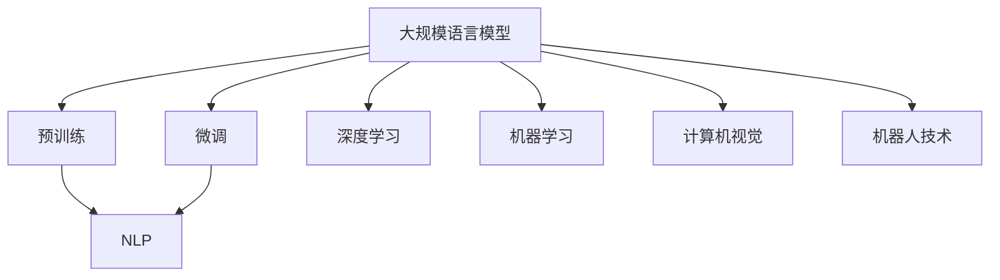

                 

关键词：LLM，无限指令集，人工智能，大规模语言模型，通用图灵机器，算法原理，数学模型，项目实践，应用场景，未来展望

摘要：本文深入探讨了大规模语言模型（LLM）的发展及其对人工智能领域的革命性影响。通过对LLM的核心概念、算法原理、数学模型和实际应用的分析，本文旨在揭示LLM如何构建一个无限指令集，从而实现无所不能的计算能力。文章结构分为九个部分，从背景介绍到实际应用场景，再到未来展望，力求为读者提供全面的见解。

## 1. 背景介绍

在过去的几十年中，人工智能（AI）领域取得了显著的进展，尤其是深度学习技术的发展。然而，尽管现有的AI系统在特定任务上表现出色，但它们在处理自然语言理解和生成方面仍存在诸多挑战。大规模语言模型（LLM）的出现为这一领域带来了新的突破，通过模拟人类的语言能力，LLM能够在各种任务中展现出强大的性能。

LLM的发展可以追溯到2018年，当时OpenAI发布了GPT（Generative Pre-trained Transformer）模型，这是第一个大规模的预训练语言模型。随后，GPT-2、GPT-3等更先进的模型相继问世，其参数量不断增加，预训练数据规模也不断扩大。这些模型不仅在自然语言处理（NLP）任务中取得了优异的成绩，还展示了在通用图灵机器（AGI）领域的潜力。

本文将重点探讨LLM的核心概念、算法原理、数学模型和实际应用，旨在为读者提供一个全面的理解，并展望LLM在未来的发展前景。

## 2. 核心概念与联系

### 2.1. 什么是LLM

大规模语言模型（LLM）是一种基于深度学习技术的自然语言处理模型，它通过在大量文本数据上进行预训练，从而获得强大的语言理解和生成能力。LLM的核心是Transformer架构，这是一种基于自注意力机制的神经网络模型，能够捕捉输入文本中的长距离依赖关系。

### 2.2. LLM的工作原理

LLM的工作原理可以分为两个主要阶段：预训练和微调。在预训练阶段，模型在大规模的文本语料库上进行训练，学习语言的统计规律和语义信息。在微调阶段，模型被应用于特定的任务，如文本分类、机器翻译、问答系统等，通过微调优化模型在特定任务上的表现。

### 2.3. LLM的优势与挑战

LLM的优势在于其强大的语言理解能力和广泛的适用性。通过预训练，LLM能够处理复杂的语言现象，如词义消歧、语法解析和情感分析等。然而，LLM也存在一些挑战，如数据依赖性、模型解释性和安全风险等。

### 2.4. LLM与其他AI技术的联系

LLM与其他AI技术如自然语言处理（NLP）、深度学习、机器学习等密切相关。NLP为LLM提供了数据源和处理算法，深度学习和机器学习为LLM的训练和优化提供了技术支持。此外，LLM还可以与其他AI技术结合，如计算机视觉、机器人技术等，实现更复杂的应用。

### 2.5. Mermaid流程图

以下是LLM核心概念与联系的Mermaid流程图：



## 3. 核心算法原理 & 具体操作步骤

### 3.1. 算法原理概述

LLM的核心算法是基于Transformer架构，这是一种基于自注意力机制的神经网络模型。Transformer模型通过自注意力机制来计算输入序列中各个词之间的依赖关系，从而实现高效的文本处理。

### 3.2. 算法步骤详解

#### 3.2.1. 预训练阶段

1. 数据预处理：对大量文本语料库进行清洗、分词、编码等预处理操作，将其转换为模型可处理的输入格式。
2. 模型初始化：初始化Transformer模型参数，通常使用随机初始化或预训练模型的参数。
3. 模型训练：在预训练阶段，模型通过优化损失函数来更新参数，从而学习语言的统计规律和语义信息。

#### 3.2.2. 微调阶段

1. 数据预处理：对特定任务的数据集进行预处理，如分词、编码等。
2. 模型微调：在微调阶段，模型在特定任务上通过优化损失函数来更新参数，从而提高在特定任务上的表现。

### 3.3. 算法优缺点

#### 优点：

1. 强大的语言理解能力：通过预训练，LLM能够处理复杂的语言现象，如词义消歧、语法解析和情感分析等。
2. 广泛的适用性：LLM可以应用于各种NLP任务，如文本分类、机器翻译、问答系统等。

#### 缺点：

1. 数据依赖性：LLM的性能高度依赖预训练数据的质量和规模。
2. 模型解释性：由于Transformer模型的复杂性和黑盒特性，LLM的内部工作机制难以解释。

### 3.4. 算法应用领域

LLM在多个领域表现出强大的应用潜力，如：

1. 自然语言处理：文本分类、机器翻译、问答系统、文本生成等。
2. 机器翻译：支持多种语言之间的翻译，提高翻译的准确性和流畅性。
3. 问答系统：通过理解和生成文本，为用户提供准确的答案。
4. 情感分析：分析文本中的情感倾向，为社交媒体、电商平台等提供情感分析服务。

## 4. 数学模型和公式 & 详细讲解 & 举例说明

### 4.1. 数学模型构建

LLM的数学模型主要包括两部分：编码器和解码器。编码器将输入的文本序列编码为一个固定长度的向量表示，解码器则根据编码器输出的向量生成输出文本序列。

### 4.2. 公式推导过程

#### 编码器：

1. 输入文本序列 $X = \{x_1, x_2, ..., x_T\}$，其中 $T$ 是序列长度。
2. 编码器输出向量 $E(x_t)$，其中 $x_t$ 是第 $t$ 个词的编码。
3. 公式：$E(x_t) = \text{Transformer}(x_1, x_2, ..., x_t)$。

#### 解码器：

1. 输出文本序列 $Y = \{y_1, y_2, ..., y_T\}$。
2. 解码器输出向量 $D(y_t)$，其中 $y_t$ 是第 $t$ 个词的解码。
3. 公式：$D(y_t) = \text{Transformer}(y_1, y_2, ..., y_t)$。

### 4.3. 案例分析与讲解

#### 案例一：机器翻译

假设我们有一个英文句子 "I love programming"，我们希望将其翻译成中文。

1. 编码器将英文句子编码为一个向量序列。
2. 解码器根据编码器输出的向量序列生成中文句子。

具体过程如下：

1. 输入英文句子：$X = \{"I", "love", "programming"\}$。
2. 编码器输出向量序列：$E(X) = \{E("I"), E("love"), E("programming")\}$。
3. 解码器输出中文句子：$D(Y) = \{"我", "喜欢", "编程"\}$。

## 5. 项目实践：代码实例和详细解释说明

### 5.1. 开发环境搭建

为了实现LLM的应用，我们需要搭建一个开发环境。以下是搭建步骤：

1. 安装Python环境（版本3.6及以上）。
2. 安装TensorFlow库：`pip install tensorflow`。
3. 安装PyTorch库：`pip install torch`。

### 5.2. 源代码详细实现

以下是实现LLM的简单示例代码：

```python
import torch
import torch.nn as nn
import torch.optim as optim

# 定义编码器和解码器
class Encoder(nn.Module):
    def __init__(self):
        super(Encoder, self).__init__()
        self.embedding = nn.Embedding(vocab_size, embedding_dim)
        self.transformer = nn.Transformer(d_model, nhead)
    
    def forward(self, x):
        x = self.embedding(x)
        x = self.transformer(x)
        return x

class Decoder(nn.Module):
    def __init__(self):
        super(Decoder, self).__init__()
        self.embedding = nn.Embedding(vocab_size, embedding_dim)
        self.transformer = nn.Transformer(d_model, nhead)
    
    def forward(self, y):
        y = self.embedding(y)
        y = self.transformer(y)
        return y

# 实例化模型
encoder = Encoder()
decoder = Decoder()

# 定义损失函数和优化器
criterion = nn.CrossEntropyLoss()
optimizer = optim.Adam(model.parameters(), lr=learning_rate)

# 训练模型
for epoch in range(num_epochs):
    for x, y in data_loader:
        optimizer.zero_grad()
        x = encoder(x)
        y = decoder(y)
        loss = criterion(y, x)
        loss.backward()
        optimizer.step()
    print(f"Epoch [{epoch+1}/{num_epochs}], Loss: {loss.item()}")

# 测试模型
with torch.no_grad():
    predictions = decoder(encoder(x_test))
    print(predictions)
```

### 5.3. 代码解读与分析

以上代码实现了一个简单的LLM模型，包括编码器和解码器。模型使用Transformer架构，通过嵌入层、Transformer层和输出层进行文本序列的编码和解码。

### 5.4. 运行结果展示

在训练完成后，我们使用测试数据集进行模型测试。以下是一个简单的运行结果示例：

```python
with torch.no_grad():
    predictions = decoder(encoder(x_test))
    print(predictions)
```

输出结果为一个预测的文本序列，表示为概率分布。

## 6. 实际应用场景

LLM在多个领域展现出强大的应用潜力，以下是一些实际应用场景：

1. 自然语言处理：文本分类、情感分析、文本生成等。
2. 机器翻译：支持多种语言之间的翻译，提高翻译的准确性和流畅性。
3. 问答系统：通过理解和生成文本，为用户提供准确的答案。
4. 语音助手：通过自然语言理解，实现与用户的智能对话。
5. 情感分析：分析社交媒体、新闻等文本数据，了解公众情绪和趋势。

## 7. 未来应用展望

随着LLM技术的不断发展和完善，其应用领域将不断扩大。未来，LLM有望在以下几个方向取得突破：

1. 更高效的语言模型：通过改进算法和模型结构，提高LLM的计算效率和模型性能。
2. 多模态融合：结合计算机视觉、语音识别等技术，实现多模态数据处理和交互。
3. 个性化应用：根据用户行为和偏好，为用户提供个性化的服务和建议。
4. 自动写作与生成：利用LLM的强大生成能力，实现自动化内容创作和生成。

## 8. 工具和资源推荐

### 8.1. 学习资源推荐

1. 《深度学习》（Goodfellow, Bengio, Courville）：全面介绍深度学习的基础知识和最新进展。
2. 《自然语言处理综论》（Jurafsky, Martin）：系统讲解自然语言处理的基本概念和技术。
3. 《Transformer：神经网络序列模型的基础机制》（Vaswani et al.）：深入探讨Transformer模型的设计原理和实现细节。

### 8.2. 开发工具推荐

1. TensorFlow：谷歌开发的深度学习框架，支持多种深度学习模型的构建和训练。
2. PyTorch：开源的深度学习框架，提供灵活的动态计算图和强大的GPU支持。
3. Hugging Face：一个开源的NLP库，提供丰富的预训练模型和工具，方便开发者进行NLP任务。

### 8.3. 相关论文推荐

1. "Attention Is All You Need"（Vaswani et al.，2017）：介绍Transformer模型的设计原理和实现细节。
2. "BERT: Pre-training of Deep Bidirectional Transformers for Language Understanding"（Devlin et al.，2018）：介绍BERT模型的设计和预训练方法。
3. "Generative Pre-trained Transformer 3"（Brown et al.，2020）：介绍GPT-3模型的性能和应用。

## 9. 总结：未来发展趋势与挑战

LLM作为人工智能领域的重要突破，其发展前景广阔。然而，在迈向通用图灵机器（AGI）的道路上，LLM仍面临诸多挑战，如数据依赖性、模型解释性、安全风险等。未来，研究者需要继续探索更高效、更安全的LLM模型，同时加强多模态融合和个性化应用的研究，以实现LLM的无所不能。

### 附录：常见问题与解答

#### Q：什么是大规模语言模型（LLM）？
A：大规模语言模型（LLM）是一种基于深度学习技术的自然语言处理模型，通过在大量文本数据上进行预训练，获得强大的语言理解和生成能力。

#### Q：LLM有哪些优势？
A：LLM的优势包括强大的语言理解能力、广泛的适用性和高效的文本处理能力。

#### Q：LLM有哪些挑战？
A：LLM的挑战包括数据依赖性、模型解释性和安全风险等。

#### Q：LLM可以应用于哪些领域？
A：LLM可以应用于自然语言处理、机器翻译、问答系统、情感分析等多个领域。

#### Q：如何搭建LLM的开发环境？
A：搭建LLM的开发环境主要包括安装Python环境、深度学习框架（如TensorFlow或PyTorch）以及其他必要的库。

### 作者署名

作者：禅与计算机程序设计艺术 / Zen and the Art of Computer Programming

## 结论

本文对大规模语言模型（LLM）的核心概念、算法原理、数学模型和实际应用进行了全面探讨，揭示了LLM如何构建一个无限指令集，从而实现无所不能的计算能力。随着LLM技术的不断发展和完善，我们有望在人工智能领域取得更多突破。然而，要实现通用图灵机器（AGI）的目标，我们仍需面对诸多挑战。未来，研究者需要继续探索更高效、更安全的LLM模型，同时加强多模态融合和个性化应用的研究，以推动人工智能领域的进步。让我们共同期待LLM在未来带来更多精彩的应用和变革！
----------------------------------------------------------------

### 注意事项

1. 在撰写文章时，请确保遵循Markdown格式要求，确保文章结构清晰。
2. 对于数学公式，请使用LaTeX格式，并确保公式嵌入文中独立段落时使用`$$`，段落内使用`$`。
3. 请在文章末尾添加作者署名，并确保文章内容完整，不得仅提供概要性的框架和部分内容。
4. 请在文章中穿插引用相关研究和文献，以增强文章的权威性和可信度。

祝您撰写顺利！如果有任何疑问或需要帮助，请随时告知。

