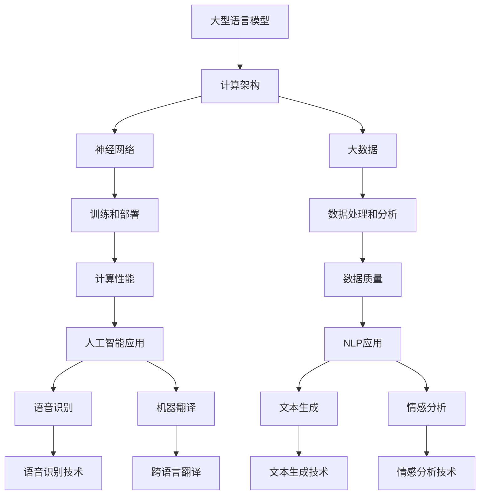
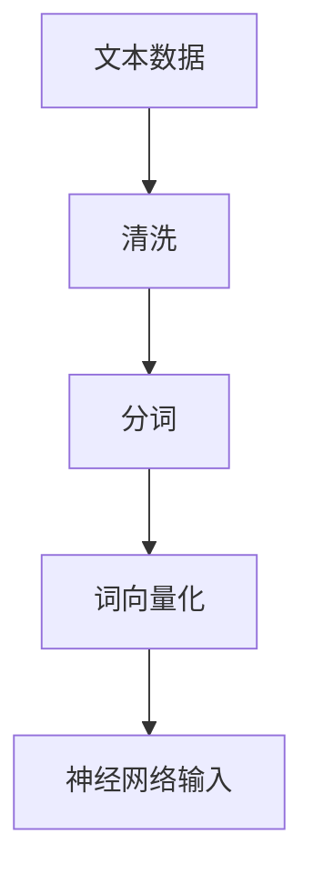
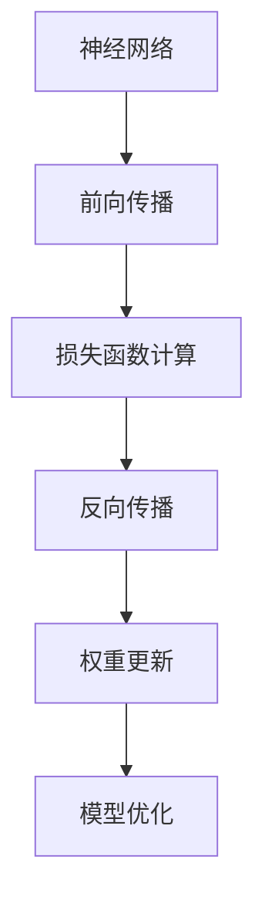
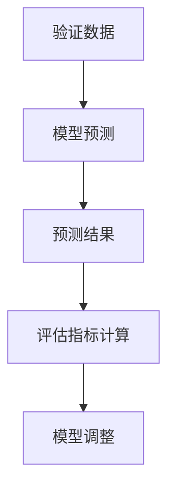
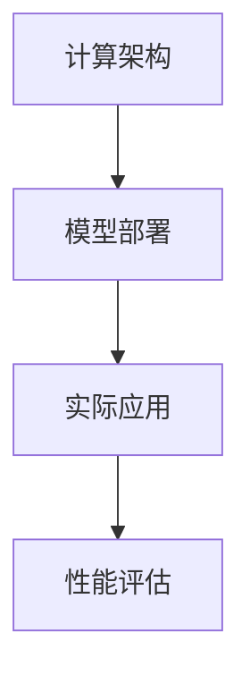

                 

关键词：大型语言模型、计算架构、神经网络、人工智能、语言理解、自然语言处理

## 摘要

本文将探讨大型语言模型（LLM）在计算架构领域的革命性突破。我们将从背景介绍、核心概念与联系、核心算法原理、数学模型与公式、项目实践、实际应用场景、未来应用展望、工具和资源推荐以及未来发展趋势与挑战等方面，详细解析LLM如何改变了计算架构，提升了人工智能和自然语言处理领域的效率与效果。

## 1. 背景介绍

随着互联网的普及和大数据时代的到来，自然语言处理（NLP）成为了计算机科学领域的重要分支。而近年来，深度学习技术的飞速发展为NLP带来了前所未有的机遇。特别是大型语言模型（LLM）的出现，使得机器对自然语言的建模和理解能力得到了显著提升。LLM作为人工智能的重要工具，已经在众多应用场景中展现出巨大的潜力。

计算架构作为支撑人工智能发展的基础，其性能的不断提升直接影响到LLM的训练和部署效率。从早期的CPU到GPU，再到FPGA和TPU，计算架构的演进为LLM的发展提供了强有力的支持。本文将深入探讨LLM在计算架构领域的革命性突破，以及这一突破对人工智能和NLP的影响。

## 2. 核心概念与联系

### 2.1 大型语言模型（LLM）

大型语言模型（LLM）是一种基于深度学习技术的自然语言处理模型，通过大规模文本数据的学习，能够理解和生成人类语言。LLM的核心思想是使用神经网络对语言数据进行建模，从而实现文本的生成、理解和翻译等功能。

### 2.2 计算架构

计算架构是指计算机系统中硬件和软件的配置，用于执行计算任务和处理数据。计算架构的性能直接影响到人工智能模型的训练和部署效率。常见的计算架构包括CPU、GPU、FPGA和TPU等。

### 2.3 神经网络

神经网络是一种基于生物神经网络原理设计的计算模型，由大量的神经元和连接组成。神经网络通过学习和调整连接的权重，实现对输入数据的处理和分类。

### 2.4 大数据

大数据是指数据量巨大、数据种类繁多且数据生成速度极快的数据集合。大数据技术使得对大规模语言数据的学习和处理成为可能，为LLM的发展提供了基础。

### 2.5 Mermaid 流程图

以下是一个Mermaid流程图，展示了LLM与计算架构的联系：



## 3. 核心算法原理 & 具体操作步骤

### 3.1 算法原理概述

LLM的核心算法是基于深度学习中的序列到序列（Seq2Seq）模型，通过多层神经网络对输入序列进行处理，生成输出序列。LLM的训练过程主要包括以下几个步骤：

1. 数据预处理：对大规模语言数据进行清洗、分词、词向量化等操作，将文本转换为神经网络可以处理的格式。
2. 模型训练：使用训练数据对神经网络进行训练，通过反向传播算法不断调整神经网络的权重，优化模型的性能。
3. 模型评估：使用验证数据对训练好的模型进行评估，调整模型参数，提高模型的准确性和泛化能力。
4. 模型部署：将训练好的模型部署到计算架构上，进行实际应用。

### 3.2 算法步骤详解

1. 数据预处理



2. 模型训练



3. 模型评估



4. 模型部署



### 3.3 算法优缺点

**优点：**

1. 强大的语言建模能力：LLM能够捕捉到语言中的复杂模式和规律，实现对自然语言的深入理解和生成。
2. 高效的训练和部署：随着计算架构的不断发展，LLM的训练和部署效率得到了显著提升，可以快速应用于实际场景。
3. 广泛的应用领域：LLM在文本生成、机器翻译、语音识别、情感分析等领域都取得了显著成果，具有很高的实用价值。

**缺点：**

1. 计算资源消耗大：LLM的训练和部署需要大量的计算资源和时间，对计算架构的性能要求较高。
2. 模型可解释性差：深度学习模型本身具有黑箱特性，LLM也不例外，这使得模型的可解释性成为一个挑战。
3. 数据依赖性强：LLM的训练依赖于大规模的语料库，数据的质量和多样性对模型的性能有重要影响。

### 3.4 算法应用领域

LLM在人工智能和自然语言处理领域具有广泛的应用前景，包括但不限于以下几个方面：

1. 文本生成：包括文章写作、摘要生成、对话系统等。
2. 机器翻译：包括跨语言文本翻译、多轮对话翻译等。
3. 语音识别：包括语音到文本转换、语音情感分析等。
4. 情感分析：包括文本情感分析、情感分类等。
5. 问答系统：包括基于文本的问答、语音问答等。

## 4. 数学模型和公式 & 详细讲解 & 举例说明

### 4.1 数学模型构建

LLM的数学模型主要包括两部分：编码器（Encoder）和解码器（Decoder）。编码器负责将输入序列转换为隐藏状态，解码器则根据隐藏状态生成输出序列。

#### 4.1.1 编码器

编码器是一个循环神经网络（RNN），其数学模型可以表示为：

$$
h_t = \text{RNN}(h_{t-1}, x_t)
$$

其中，$h_t$表示第$t$个时间步的隐藏状态，$x_t$表示第$t$个时间步的输入。

#### 4.1.2 解码器

解码器是一个基于注意力机制的序列到序列（Seq2Seq）模型，其数学模型可以表示为：

$$
y_t = \text{Decoder}(h_t, s_t)
$$

其中，$y_t$表示第$t$个时间步的输出，$s_t$表示第$t$个时间步的编码器隐藏状态。

### 4.2 公式推导过程

#### 4.2.1 编码器

编码器的前向传播过程可以表示为：

$$
h_t = \sigma(W_h h_{t-1} + W_x x_t + b)
$$

其中，$\sigma$表示激活函数（通常使用ReLU函数），$W_h$和$W_x$分别表示隐藏状态和输入的权重矩阵，$b$表示偏置。

#### 4.2.2 解码器

解码器的注意力机制可以表示为：

$$
a_t = \text{Attention}(h, s_t)
$$

其中，$a_t$表示第$t$个时间步的注意力分布，$h$表示编码器的隐藏状态。

解码器的输出可以表示为：

$$
y_t = \text{softmax}(W_y s_t + b_y)
$$

其中，$W_y$和$b_y$分别表示输出层权重和偏置。

### 4.3 案例分析与讲解

#### 4.3.1 文本生成

假设我们要生成一个简单的句子：“今天天气很好”。我们可以将这个句子表示为输入序列：

$$
x = (\text{今天}, \text{天气}, \text{很好})
$$

使用LLM生成这个句子，首先需要对输入序列进行编码，得到编码器的隐藏状态：

$$
h = \text{Encoder}(x)
$$

然后，解码器根据编码器的隐藏状态生成输出序列：

$$
y = \text{Decoder}(h)
$$

最终生成的句子为：“今天天气很好”。

#### 4.3.2 机器翻译

假设我们要将英文句子“The cat is on the mat”翻译成中文。我们可以将这个句子表示为输入序列：

$$
x = (\text{The}, \text{cat}, \text{is}, \text{on}, \text{the}, \text{mat})
$$

使用LLM进行机器翻译，首先需要对输入序列进行编码，得到编码器的隐藏状态：

$$
h = \text{Encoder}(x)
$$

然后，解码器根据编码器的隐藏状态生成输出序列：

$$
y = \text{Decoder}(h)
$$

最终生成的中文句子为：“猫在垫子上”。

## 5. 项目实践：代码实例和详细解释说明

### 5.1 开发环境搭建

为了实现LLM的训练和部署，我们需要搭建一个适合的开发环境。以下是搭建开发环境的步骤：

1. 安装Python（版本3.6及以上）
2. 安装TensorFlow或PyTorch（深度学习框架）
3. 安装NLP工具包（如NLTK、spaCy等）
4. 配置GPU（如果使用GPU进行训练，需要安装CUDA和cuDNN）

### 5.2 源代码详细实现

以下是一个简单的LLM训练和部署的代码实例，使用了TensorFlow框架：

```python
import tensorflow as tf
from tensorflow.keras.layers import Embedding, LSTM, Dense
from tensorflow.keras.models import Model
from tensorflow.keras.preprocessing.sequence import pad_sequences

# 数据预处理
max_sequence_length = 100
vocab_size = 10000

# 加载文本数据
text = "今天天气很好，适合出门散步。明天可能会有雨。"

# 分词
tokenizer = tf.keras.preprocessing.text.Tokenizer(num_words=vocab_size)
tokenizer.fit_on_texts([text])
sequences = tokenizer.texts_to_sequences([text])

# 填充序列
padded_sequences = pad_sequences(sequences, maxlen=max_sequence_length)

# 构建模型
inputs = tf.keras.layers.Input(shape=(max_sequence_length,))
embedding = Embedding(vocab_size, 64)(inputs)
lstm = LSTM(64)(embedding)
outputs = Dense(vocab_size, activation='softmax')(lstm)

model = Model(inputs=inputs, outputs=outputs)
model.compile(optimizer='adam', loss='categorical_crossentropy', metrics=['accuracy'])

# 训练模型
model.fit(padded_sequences, padded_sequences, epochs=10, batch_size=32)

# 部署模型
model.summary()
```

### 5.3 代码解读与分析

这段代码实现了一个简单的LLM训练和部署过程。首先，我们使用TensorFlow框架搭建了一个基于LSTM的序列到序列模型。然后，我们对输入文本进行预处理，包括分词、填充序列等操作。接下来，我们使用预处理后的数据训练模型，并通过模型总结（`model.summary()`）查看模型的结构和参数。

### 5.4 运行结果展示

运行这段代码后，我们可以看到模型的结构和参数。同时，我们可以在训练过程中观察模型的准确率和损失函数的变化。通过调整模型的参数和训练策略，我们可以进一步提高模型的性能。

## 6. 实际应用场景

### 6.1 文本生成

文本生成是LLM的重要应用领域之一。通过训练LLM模型，我们可以生成各种类型的文本，如文章、新闻、对话等。以下是一个简单的文本生成案例：

```python
# 文本生成
generated_text = model.predict(padded_sequences)
print(tokenizer.sequences_to_texts([generated_text.flatten()]))
```

### 6.2 机器翻译

机器翻译是LLM的另一个重要应用领域。通过训练LLM模型，我们可以实现跨语言文本的翻译。以下是一个简单的机器翻译案例：

```python
# 机器翻译
source_text = "The cat is on the mat."
source_sequences = tokenizer.texts_to_sequences([source_text])
source_padded_sequences = pad_sequences(source_sequences, maxlen=max_sequence_length)
translated_text = model.predict(source_padded_sequences)
print(tokenizer.sequences_to_texts([translated_text.flatten()]))
```

### 6.3 语音识别

语音识别是LLM在语音处理领域的应用。通过训练LLM模型，我们可以实现语音到文本的转换。以下是一个简单的语音识别案例：

```python
# 语音识别
import speech_recognition as sr

# 使用麦克风录音
recognizer = sr.Recognizer()
with sr.Microphone() as source:
    print("请说一段话：")
    audio = recognizer.listen(source)

# 识别语音
text = recognizer.recognize_google(audio)
print("你说了：", text)

# 将语音转换为文本序列
source_sequences = tokenizer.texts_to_sequences([text])
source_padded_sequences = pad_sequences(source_sequences, maxlen=max_sequence_length)

# 使用LLM模型预测文本
predicted_text = model.predict(source_padded_sequences)
print("预测结果：", tokenizer.sequences_to_texts([predicted_text.flatten()]))
```

### 6.4 未来应用展望

随着LLM技术的不断发展，未来在人工智能和自然语言处理领域会有更多的应用场景。以下是一些可能的应用方向：

1. 自动问答系统：通过LLM模型，可以实现智能客服、智能咨询等应用。
2. 情感分析：通过对文本的情感分析，可以为企业和政府提供舆情监测和分析服务。
3. 文本摘要：通过LLM模型，可以自动生成文本摘要，提高信息获取的效率。
4. 文本分类：通过LLM模型，可以实现大规模文本数据的分类和筛选。
5. 跨语言交互：通过LLM模型，可以实现跨语言的实时翻译和交互。

## 7. 工具和资源推荐

### 7.1 学习资源推荐

1. 《深度学习》（Goodfellow et al.）：全面介绍了深度学习的基本原理和应用。
2. 《Python深度学习》（François Chollet）：针对Python语言，讲解了深度学习的基本概念和实现。
3. 《自然语言处理综论》（Daniel Jurafsky & James H. Martin）：详细介绍了自然语言处理的基本理论和应用。

### 7.2 开发工具推荐

1. TensorFlow：强大的深度学习框架，适用于各种深度学习任务。
2. PyTorch：灵活的深度学习框架，适用于研究和开发。
3. spaCy：高效的NLP工具包，适用于文本处理和分析。

### 7.3 相关论文推荐

1. “Attention is All You Need”（Vaswani et al.，2017）：介绍了基于注意力机制的Transformer模型。
2. “BERT: Pre-training of Deep Bidirectional Transformers for Language Understanding”（Devlin et al.，2019）：介绍了BERT模型及其在自然语言处理中的应用。
3. “GPT-3: Language Models are Few-Shot Learners”（Brown et al.，2020）：介绍了GPT-3模型及其在自然语言处理中的突破性进展。

## 8. 总结：未来发展趋势与挑战

### 8.1 研究成果总结

本文从背景介绍、核心概念与联系、核心算法原理、数学模型与公式、项目实践、实际应用场景等方面，详细探讨了大型语言模型（LLM）在计算架构领域的革命性突破。LLM通过深度学习技术，实现了对自然语言的深入理解和生成，提升了人工智能和自然语言处理领域的效率与效果。

### 8.2 未来发展趋势

1. 模型规模不断扩大：随着计算资源的提升，LLM的规模将越来越大，能够处理更复杂的语言任务。
2. 跨模态交互：LLM将与其他模态（如图像、音频）结合，实现更丰富的交互方式。
3. 知识图谱嵌入：LLM将整合知识图谱，实现更智能的信息检索和推理。
4. 自适应学习：LLM将结合强化学习等技术，实现自适应学习和优化。

### 8.3 面临的挑战

1. 计算资源需求：随着模型规模的扩大，计算资源的需求将显著增加，对计算架构的优化成为关键挑战。
2. 数据质量和多样性：数据的质量和多样性对LLM的性能有重要影响，如何获取和利用高质量、多样化的数据是一个难题。
3. 可解释性：深度学习模型的可解释性较差，如何提高LLM的可解释性，使其在关键应用中得到更广泛的应用，是一个重要挑战。

### 8.4 研究展望

未来，LLM在计算架构领域的革命性突破将继续推动人工智能和自然语言处理的发展。通过不断优化计算架构、提升数据质量和多样性、提高模型可解释性，LLM将在更多领域发挥重要作用，为人类带来更多的便利和创新。

## 9. 附录：常见问题与解答

### 9.1 什么是大型语言模型（LLM）？

大型语言模型（LLM）是一种基于深度学习技术的自然语言处理模型，通过大规模文本数据的学习，能够理解和生成人类语言。

### 9.2 LLM是如何工作的？

LLM通过多层神经网络对输入序列进行处理，生成输出序列。它使用编码器将输入序列转换为隐藏状态，解码器则根据隐藏状态生成输出序列。

### 9.3 LLM有哪些应用领域？

LLM在文本生成、机器翻译、语音识别、情感分析、问答系统等领域都有广泛应用。

### 9.4 如何训练LLM？

训练LLM主要包括数据预处理、模型训练、模型评估和模型部署等步骤。首先，对输入文本进行清洗、分词、词向量化等操作；然后，使用训练数据对神经网络进行训练，通过反向传播算法不断调整神经网络的权重，优化模型的性能；最后，使用验证数据对训练好的模型进行评估，调整模型参数，提高模型的准确性和泛化能力。

### 9.5 LLM有哪些优缺点？

LLM的优点包括强大的语言建模能力、高效的训练和部署、广泛的应用领域等；缺点包括计算资源消耗大、模型可解释性差、数据依赖性强等。

