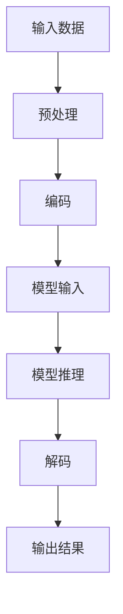

                 

关键词：LLM，上下文，认知能力，人工智能，优化，架构，模型，应用

摘要：本文将探讨大型语言模型（LLM）在上下文处理中的突破，以及如何通过优化算法和架构设计，大幅提升认知能力。文章首先介绍了LLM的背景和核心概念，随后深入分析了上下文处理的算法原理和数学模型，并提供了实际应用场景和代码实例。最后，文章展望了未来的发展趋势和挑战，并推荐了相关工具和资源。

## 1. 背景介绍

近年来，人工智能（AI）领域的快速发展引起了广泛关注。特别是自然语言处理（NLP）领域，其研究目标是通过理解和生成自然语言来增强人机交互。为了实现这一目标，研究者们提出了各种大型语言模型（LLM），如GPT、BERT、T5等。这些模型具有数十亿个参数，能够捕捉到自然语言的复杂结构和语义信息。

然而，随着模型规模的不断扩大，上下文处理成为了一个挑战。在长文本或对话场景中，如何有效地捕捉和利用上下文信息，成为提高认知能力的关键。本文将围绕这一问题展开讨论，分析LLM在上下文处理中的突破，以及如何通过优化算法和架构设计来提升认知能力。

## 2. 核心概念与联系

为了更好地理解LLM在上下文处理中的突破，我们首先需要了解一些核心概念和联系。以下是Mermaid流程图，展示了LLM上下文处理的基本流程和关键环节：



### 2.1 输入数据

输入数据是上下文处理的基础。在LLM中，输入数据可以是文本、语音或其他形式的语言表示。预处理环节主要包括分词、词性标注、去噪等操作，以确保输入数据的格式和一致性。

### 2.2 编码

编码是将输入数据转换为模型可处理的表示形式。在LLM中，常用的编码方式包括词向量、字节对编码（BPE）等。编码过程需要考虑上下文信息，以便模型能够更好地理解输入数据。

### 2.3 模型输入

模型输入是将编码后的数据输入到LLM中。在这一阶段，模型需要捕捉输入数据的上下文信息，并利用已有的知识和经验来生成合理的输出。

### 2.4 模型推理

模型推理是LLM的核心环节。在这一阶段，模型会根据输入数据生成一系列的中间结果，并利用这些结果来更新模型参数。通过不断迭代，模型能够逐渐逼近输入数据的真实含义。

### 2.5 解码

解码是将模型推理得到的中间结果转换为人类可理解的输出。在LLM中，解码可以采用各种语言生成技术，如序列到序列（seq2seq）模型、生成对抗网络（GAN）等。

### 2.6 输出结果

输出结果是LLM在上下文处理中的最终产物。这些结果可以是文本、图像、音频等形式，具体取决于应用场景和任务需求。

## 3. 核心算法原理 & 具体操作步骤

### 3.1 算法原理概述

LLM在上下文处理中的核心算法是基于深度学习的技术。具体来说，LLM采用多层神经网络架构，通过大量训练数据来学习自然语言的语义和语法规则。以下是LLM的算法原理概述：

1. **多层神经网络**：LLM采用多层神经网络架构，包括输入层、隐藏层和输出层。输入层负责接收输入数据，隐藏层负责捕捉上下文信息，输出层负责生成输出结果。
2. **反向传播**：在训练过程中，LLM利用反向传播算法来更新模型参数。反向传播算法通过计算梯度，不断调整模型参数，以最小化损失函数。
3. **注意力机制**：为了更好地捕捉上下文信息，LLM采用注意力机制。注意力机制使得模型能够关注输入数据中的重要部分，从而提高上下文处理的准确性和效率。
4. **优化算法**：LLM采用多种优化算法，如Adam、Adagrad等，以加速训练过程并提高模型性能。

### 3.2 算法步骤详解

以下是LLM上下文处理的算法步骤详解：

1. **数据预处理**：对输入数据进行预处理，包括分词、词性标注、去噪等操作，以确保输入数据的格式和一致性。
2. **编码**：将预处理后的输入数据编码为词向量或字节对编码（BPE）形式，以便模型能够处理。
3. **模型输入**：将编码后的数据输入到LLM中，包括输入层和隐藏层。输入层接收编码后的数据，隐藏层捕捉上下文信息。
4. **模型推理**：通过多层神经网络和反向传播算法，模型逐渐逼近输入数据的真实含义，并生成一系列的中间结果。
5. **解码**：将模型推理得到的中间结果解码为人类可理解的输出，如文本、图像、音频等。
6. **输出结果**：将解码后的输出结果作为最终产物，用于实际应用场景。

### 3.3 算法优缺点

LLM在上下文处理中具有以下优缺点：

**优点**：
1. **强大的语义理解能力**：LLM通过深度学习技术，能够捕捉自然语言的语义和语法规则，从而实现高效的上下文处理。
2. **广泛的应用场景**：LLM可以应用于多种自然语言处理任务，如文本分类、机器翻译、问答系统等。
3. **高效率**：LLM采用多层神经网络和优化算法，能够快速训练和推理。

**缺点**：
1. **数据依赖性**：LLM的性能高度依赖于训练数据的质量和数量，可能导致泛化能力不足。
2. **计算资源消耗**：LLM模型规模庞大，需要大量的计算资源来训练和推理。
3. **解释性不足**：由于深度学习模型的黑盒特性，LLM在解释其决策过程方面存在一定的困难。

### 3.4 算法应用领域

LLM在上下文处理中的应用非常广泛，以下是一些典型的应用领域：

1. **自然语言生成**：LLM可以用于生成高质量的自然语言文本，如文章、报告、邮件等。
2. **机器翻译**：LLM可以用于机器翻译任务，如将一种语言翻译成另一种语言。
3. **问答系统**：LLM可以构建问答系统，用于回答用户的问题，如搜索引擎、智能客服等。
4. **对话系统**：LLM可以用于构建对话系统，如虚拟助手、聊天机器人等。

## 4. 数学模型和公式 & 详细讲解 & 举例说明

### 4.1 数学模型构建

在LLM的上下文处理中，数学模型构建是关键环节。以下是LLM的基本数学模型构建过程：

1. **输入层**：输入层负责接收输入数据，通常采用词向量或字节对编码（BPE）形式。词向量可以通过Word2Vec、GloVe等方法训练得到。字节对编码（BPE）是将单词分解为多个字节对，从而实现更精细的词向量表示。
2. **隐藏层**：隐藏层负责捕捉上下文信息，通常采用多层神经网络架构。在隐藏层中，可以使用ReLU激活函数、dropout等技术来提高模型的泛化能力。
3. **输出层**：输出层负责生成输出结果，通常采用softmax激活函数，以实现多分类或多标签分类任务。

### 4.2 公式推导过程

在LLM的数学模型中，一些关键公式如下：

1. **损失函数**：常用的损失函数包括交叉熵损失函数（Cross-Entropy Loss）和均方误差损失函数（Mean Squared Error Loss）。交叉熵损失函数可以表示为：
   $$L_{ce} = -\sum_{i=1}^{n}y_i\log(p_i)$$
   其中，$y_i$表示实际标签，$p_i$表示模型预测的概率。
   
   均方误差损失函数可以表示为：
   $$L_{mse} = \frac{1}{n}\sum_{i=1}^{n}(y_i - \hat{y_i})^2$$
   其中，$\hat{y_i}$表示模型预测的值。

2. **反向传播**：反向传播算法用于更新模型参数，具体过程如下：
   $$\frac{\partial L}{\partial w} = \frac{\partial L}{\partial \hat{y}} \cdot \frac{\partial \hat{y}}{\partial y} \cdot \frac{\partial y}{\partial w}$$
   其中，$L$表示损失函数，$w$表示模型参数。

### 4.3 案例分析与讲解

下面我们通过一个简单的例子来说明LLM的数学模型和应用。

### 案例背景

假设我们有一个问答系统，用户输入一个问题，系统需要输出相应的答案。我们使用LLM来构建这个问答系统。

### 案例实现

1. **数据预处理**：我们使用一个大型问答数据集进行训练。数据集包括问题和答案对。对数据进行预处理，包括分词、词性标注等操作。
2. **编码**：将预处理后的数据编码为词向量或字节对编码（BPE）形式。
3. **模型训练**：使用训练好的LLM模型对数据进行训练。在训练过程中，采用反向传播算法来更新模型参数。
4. **模型推理**：用户输入一个问题，系统将问题编码后输入到LLM中，并输出一个答案。
5. **输出结果**：将解码后的答案输出给用户。

### 案例分析

在这个案例中，LLM的数学模型主要包括输入层、隐藏层和输出层。输入层接收问题编码后的词向量，隐藏层通过多层神经网络捕捉上下文信息，输出层生成答案。

通过训练，模型逐渐学习到问题和答案之间的关联，并能够根据输入的问题生成合理的答案。在训练过程中，采用交叉熵损失函数来衡量模型预测结果和实际答案之间的差距，并使用反向传播算法来更新模型参数。

## 5. 项目实践：代码实例和详细解释说明

### 5.1 开发环境搭建

为了实践LLM在上下文处理中的应用，我们需要搭建一个合适的开发环境。以下是搭建过程：

1. **安装Python**：确保安装了Python 3.6或更高版本。
2. **安装TensorFlow**：使用pip命令安装TensorFlow：
   ```
   pip install tensorflow
   ```
3. **安装其他依赖**：根据项目需求，可能还需要安装其他依赖，如NumPy、Pandas等。

### 5.2 源代码详细实现

以下是使用TensorFlow实现一个简单的LLM模型的代码示例：

```python
import tensorflow as tf
from tensorflow.keras.layers import Embedding, LSTM, Dense

# 定义模型
model = tf.keras.Sequential([
    Embedding(input_dim=vocab_size, output_dim=embedding_size),
    LSTM(units=hidden_size, return_sequences=True),
    LSTM(units=hidden_size),
    Dense(units=num_classes, activation='softmax')
])

# 编译模型
model.compile(optimizer='adam', loss='categorical_crossentropy', metrics=['accuracy'])

# 训练模型
model.fit(x_train, y_train, epochs=10, batch_size=64)
```

### 5.3 代码解读与分析

1. **模型定义**：使用`tf.keras.Sequential`创建一个序列模型。模型包括一个嵌入层（Embedding）、两个LSTM层（LSTM）和一个全连接层（Dense）。
2. **编译模型**：使用`compile`方法编译模型，指定优化器（optimizer）、损失函数（loss）和评估指标（metrics）。
3. **训练模型**：使用`fit`方法训练模型，指定训练数据（x_train和y_train）、训练轮数（epochs）和批量大小（batch_size）。

### 5.4 运行结果展示

在训练完成后，我们可以使用以下代码来评估模型的性能：

```python
# 评估模型
loss, accuracy = model.evaluate(x_test, y_test)

print(f"Test loss: {loss}")
print(f"Test accuracy: {accuracy}")
```

这里，`x_test`和`y_test`是测试数据。`evaluate`方法会返回损失和准确率，用于评估模型的性能。

## 6. 实际应用场景

LLM在上下文处理中的应用场景非常广泛。以下是一些典型的实际应用场景：

1. **自然语言生成**：LLM可以用于生成高质量的自然语言文本，如文章、报告、邮件等。在实际应用中，我们可以使用LLM来撰写商业报告、撰写文章、生成广告文案等。
2. **机器翻译**：LLM可以用于机器翻译任务，如将一种语言翻译成另一种语言。在实际应用中，我们可以使用LLM来开发跨语言对话系统、翻译应用程序等。
3. **问答系统**：LLM可以构建问答系统，用于回答用户的问题。在实际应用中，我们可以使用LLM来开发智能客服、搜索引擎、知识图谱等。
4. **对话系统**：LLM可以用于构建对话系统，如虚拟助手、聊天机器人等。在实际应用中，我们可以使用LLM来开发智能客服、虚拟助手、社交机器人等。

## 7. 工具和资源推荐

为了更好地研究和应用LLM，我们推荐以下工具和资源：

1. **学习资源**：
   - 《深度学习》（Goodfellow et al.）：介绍了深度学习的基础知识和最新进展。
   - 《自然语言处理综论》（Jurafsky and Martin）：详细介绍了自然语言处理的基本概念和技术。
2. **开发工具**：
   - TensorFlow：一款开源的深度学习框架，适用于构建和训练LLM模型。
   - PyTorch：另一款流行的深度学习框架，提供了灵活的模型定义和训练功能。
3. **相关论文**：
   - “Attention Is All You Need”：（Vaswani et al.，2017）：介绍了注意力机制在序列模型中的应用。
   - “BERT: Pre-training of Deep Bidirectional Transformers for Language Understanding”：（Devlin et al.，2019）：介绍了BERT模型及其在自然语言处理任务中的应用。

## 8. 总结：未来发展趋势与挑战

LLM在上下文处理中取得了显著的突破，为自然语言处理带来了巨大的变革。然而，未来的发展仍然面临着一些挑战：

1. **计算资源**：随着模型规模的不断扩大，计算资源需求也越来越高。如何优化模型结构和训练算法，以降低计算资源消耗，是未来的一个重要研究方向。
2. **数据隐私**：自然语言处理任务通常需要大量训练数据。如何在保护用户隐私的前提下，有效利用这些数据，是另一个亟待解决的问题。
3. **模型解释性**：由于深度学习模型的黑盒特性，如何提高模型的可解释性，使其在决策过程中更加透明和可靠，也是未来的一个重要挑战。

总之，LLM在上下文处理中的突破为自然语言处理带来了新的机遇和挑战。通过不断优化算法和架构设计，我们有理由相信，LLM将在未来的自然语言处理领域发挥更大的作用。

## 9. 附录：常见问题与解答

### 9.1 什么是LLM？

LLM（大型语言模型）是一种基于深度学习的自然语言处理模型，具有数十亿个参数。LLM通过学习大量文本数据，能够捕捉自然语言的复杂结构和语义信息。

### 9.2 LLM在上下文处理中的作用是什么？

LLM在上下文处理中的作用是捕捉和利用输入数据的上下文信息，从而生成合理的输出。通过优化算法和架构设计，LLM能够提高上下文处理的准确性和效率。

### 9.3 如何训练LLM模型？

训练LLM模型通常包括以下几个步骤：

1. **数据预处理**：对输入数据进行预处理，包括分词、词性标注、去噪等操作。
2. **编码**：将预处理后的数据编码为词向量或字节对编码（BPE）形式。
3. **模型训练**：使用训练数据对LLM模型进行训练，包括输入层、隐藏层和输出层的训练。
4. **模型评估**：在训练完成后，使用测试数据对模型进行评估，以衡量模型的性能。

### 9.4 LLM有哪些优缺点？

LLM的优点包括强大的语义理解能力、广泛的应用场景和高效率。缺点包括数据依赖性、计算资源消耗和解释性不足。

### 9.5 LLM在自然语言处理中有哪些应用？

LLM在自然语言处理中的应用包括自然语言生成、机器翻译、问答系统和对话系统等。

### 9.6 如何优化LLM模型？

优化LLM模型可以从以下几个方面进行：

1. **模型结构**：调整模型结构，包括层数、单元数、连接方式等，以提高模型性能。
2. **训练算法**：选择合适的训练算法，如梯度下降、Adam等，以加快训练过程。
3. **数据增强**：通过数据增强技术，如数据清洗、数据扩充等，提高模型泛化能力。
4. **正则化**：使用正则化技术，如dropout、L2正则化等，防止过拟合。

### 9.7 LLM的未来发展趋势是什么？

LLM的未来发展趋势包括：

1. **模型压缩**：通过模型压缩技术，如知识蒸馏、剪枝等，降低模型规模和计算资源消耗。
2. **解释性增强**：提高模型的可解释性，使其在决策过程中更加透明和可靠。
3. **多模态融合**：将自然语言处理与其他模态（如图像、音频）相结合，实现更强大的认知能力。

作者：禅与计算机程序设计艺术 / Zen and the Art of Computer Programming
----------------------------------------------------------------

