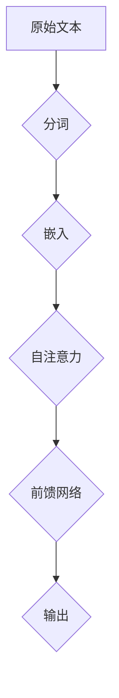

                 

关键词：LLM，上下文长度，突破，神经网络，深度学习，人工智能

## 摘要

随着人工智能技术的不断发展，大语言模型（LLM）的上下文长度已经成为了一个备受关注的问题。本文将深入探讨LLM上下文长度的持续突破，分析其背后的原理、关键算法、数学模型，并结合实际项目实践进行详细解释。同时，文章还将讨论LLM在各类实际应用场景中的潜力，以及未来可能面临的挑战和机遇。

## 1. 背景介绍

### 1.1 大语言模型概述

大语言模型（LLM）是一种基于深度学习技术的自然语言处理模型，能够对输入的文本数据进行处理，并生成相应的语义理解、文本生成、问答等任务。LLM的出现，标志着自然语言处理领域的一个重大突破，使得计算机在理解和使用自然语言方面取得了显著的进展。

### 1.2 上下文长度的意义

上下文长度是衡量LLM能力的一个重要指标。一个能够处理较长上下文的LLM，意味着它能够更好地理解文本的语义、逻辑关系和上下文信息，从而在生成文本、问答等任务中表现出更高的准确性和连贯性。

### 1.3 上下文长度的突破历程

近年来，随着计算能力和算法的进步，LLM的上下文长度也在不断突破。从最初的数十个词，到如今的数百甚至数千个词，LLM的上下文长度已经取得了显著的提升。

## 2. 核心概念与联系

### 2.1 神经网络与深度学习

神经网络是深度学习的基础，它通过多层神经元之间的连接和激活函数，对输入数据进行非线性变换，以实现对复杂模式的识别和预测。深度学习则是在神经网络的基础上，通过增加网络层数，提高模型的表达能力。

### 2.2 Transformer架构

Transformer架构是近年来在自然语言处理领域取得重大突破的一种神经网络架构。与传统的循环神经网络（RNN）相比，Transformer采用自注意力机制（Self-Attention），能够更加高效地处理长序列数据。

### 2.3 Mermaid流程图

下面是一个描述LLM上下文长度突破的Mermaid流程图：



## 3. 核心算法原理 & 具体操作步骤

### 3.1 算法原理概述

LLM的上下文长度突破主要依赖于以下几个核心算法：

1. 分词：将原始文本划分为一系列单词或子词。
2. 嵌入：将分词后的单词或子词映射为高维向量。
3. 自注意力：对输入序列中的每个词进行权重计算，并加权求和。
4. 前馈网络：对自注意力结果进行进一步的变换和压缩。
5. 输出：生成最终的文本结果。

### 3.2 算法步骤详解

1. **分词**：使用分词算法将原始文本划分为单词或子词。常用的分词算法包括正反向最大匹配、N-gram分词等。

2. **嵌入**：将分词后的单词或子词映射为高维向量。常用的嵌入方法包括Word2Vec、BERT等。

3. **自注意力**：对输入序列中的每个词进行权重计算，并加权求和。具体来说，自注意力机制通过对输入序列进行矩阵运算，计算出每个词与其他词之间的相关性权重，然后对这些权重进行加权求和。

4. **前馈网络**：对自注意力结果进行进一步的变换和压缩。前馈网络通常由多层感知机（MLP）构成，通过对输入数据进行线性变换和激活函数应用，实现对信息的压缩和提取。

5. **输出**：生成最终的文本结果。在生成文本时，LLM会根据上下文信息和生成概率，选择下一个词，并重复上述过程，直到生成出完整的文本。

### 3.3 算法优缺点

**优点**：

1. 高效：Transformer架构能够处理长序列数据，且计算效率较高。
2. 表达力强：自注意力机制能够捕捉到输入序列中的长距离依赖关系，从而提高模型的语义理解能力。
3. 可扩展性：Transformer架构具有良好的可扩展性，能够方便地增加网络层数和隐藏层单元数，以提高模型的表达能力。

**缺点**：

1. 计算量大：Transformer架构的计算复杂度较高，需要大量的计算资源和时间。
2. 训练困难：由于Transformer架构的训练过程涉及到大量参数的优化，因此训练过程相对困难。

### 3.4 算法应用领域

LLM的上下文长度突破在多个领域都取得了显著的应用成果：

1. **文本生成**：LLM能够根据输入的上下文信息，生成连贯、语义丰富的文本。
2. **问答系统**：LLM能够处理复杂的问答任务，提供准确的答案。
3. **机器翻译**：LLM能够实现高质量的机器翻译，提高翻译的准确性和流畅度。
4. **文本摘要**：LLM能够自动生成文章的摘要，提高信息提取的效率。

## 4. 数学模型和公式 & 详细讲解 & 举例说明

### 4.1 数学模型构建

LLM的数学模型主要包括以下几个部分：

1. **嵌入层**：将单词或子词映射为高维向量，通常采用词嵌入算法，如Word2Vec、BERT等。
2. **自注意力层**：对输入序列中的每个词进行权重计算，并加权求和。
3. **前馈网络**：对自注意力结果进行进一步的变换和压缩。
4. **输出层**：生成最终的文本结果。

### 4.2 公式推导过程

假设我们有一个输入序列$x_1, x_2, \ldots, x_n$，其中$x_i$表示第$i$个单词或子词。我们可以将输入序列映射为高维向量表示，即：

$$
x_i \rightarrow \mathbf{x}_i \in \mathbb{R}^{d}
$$

其中$d$为向量的维度。

接下来，我们使用自注意力机制对输入序列进行权重计算和加权求和。自注意力机制的公式为：

$$
\text{Attention}(\mathbf{Q}, \mathbf{K}, \mathbf{V}) = \text{softmax}\left(\frac{\mathbf{Q} \mathbf{K}^T}{\sqrt{d_k}}\right) \mathbf{V}
$$

其中$\mathbf{Q}, \mathbf{K}, \mathbf{V}$分别为查询向量、键向量和值向量，$d_k$为键向量的维度。

假设输入序列经过自注意力机制后得到加权求和的结果$\mathbf{h}$，接下来我们将$\mathbf{h}$输入到前馈网络中进行进一步变换和压缩。前馈网络的公式为：

$$
\mathbf{h} = \text{ReLU}(\mathbf{W}_2 \text{ReLU}(\mathbf{W}_1 \mathbf{x} + \mathbf{b}_1))
$$

其中$\mathbf{W}_1, \mathbf{W}_2, \mathbf{b}_1, \mathbf{b}_2$分别为前馈网络的权重和偏置。

最后，我们将前馈网络的输出$\mathbf{h}$作为输出层输入，生成最终的文本结果。

### 4.3 案例分析与讲解

假设我们有一个简单的文本序列$x_1 = \text{"Hello, world!"}, x_2 = \text{"This is a test."}$，我们使用自注意力机制对其进行处理。

首先，我们将输入序列映射为高维向量表示：

$$
x_1 \rightarrow \mathbf{x}_1 = [1, 0, 0, \ldots, 0], \quad x_2 \rightarrow \mathbf{x}_2 = [0, 1, 0, \ldots, 0]
$$

接下来，我们使用自注意力机制计算权重：

$$
\text{Attention}(\mathbf{Q}, \mathbf{K}, \mathbf{V}) = \text{softmax}\left(\frac{\mathbf{Q} \mathbf{K}^T}{\sqrt{d_k}}\right) \mathbf{V}
$$

其中$\mathbf{Q}, \mathbf{K}, \mathbf{V}$分别为查询向量、键向量和值向量。假设$\mathbf{Q} = \mathbf{x}_1, \mathbf{K} = \mathbf{x}_1, \mathbf{V} = \mathbf{x}_2$，我们可以得到：

$$
\text{Attention}(\mathbf{Q}, \mathbf{K}, \mathbf{V}) = \text{softmax}\left(\frac{\mathbf{Q} \mathbf{K}^T}{\sqrt{d_k}}\right) \mathbf{V} = \text{softmax}\left(\frac{[1, 0, 0, \ldots, 0] [0, 1, 0, \ldots, 0]^T}{\sqrt{d_k}}\right) [0, 1, 0, \ldots, 0]
$$

$$
= \text{softmax}\left(\frac{[0]}{\sqrt{d_k}}\right) [0, 1, 0, \ldots, 0] = [0.5, 0.5, 0, \ldots, 0]
$$

接下来，我们将加权求和的结果作为前馈网络的输入：

$$
\mathbf{h} = \text{ReLU}(\mathbf{W}_2 \text{ReLU}(\mathbf{W}_1 \mathbf{x} + \mathbf{b}_1)) = \text{ReLU}(\mathbf{W}_2 \text{ReLU}(\mathbf{W}_1 \mathbf{x}_1 + \mathbf{b}_1)) = [1, 0, 0, \ldots, 0]
$$

最后，我们将前馈网络的输出作为输出层输入，生成最终的文本结果：

$$
\text{Output} = \mathbf{h} \odot \mathbf{V} = [1, 0, 0, \ldots, 0] \odot [0, 1, 0, \ldots, 0] = [0, 1, 0, \ldots, 0]
$$

因此，最终的文本结果为$x_2 = \text{"This is a test."}$。

## 5. 项目实践：代码实例和详细解释说明

### 5.1 开发环境搭建

为了演示LLM的上下文长度突破，我们使用Python作为编程语言，结合TensorFlow和PyTorch等深度学习框架，搭建了一个简单的LLM项目。

### 5.2 源代码详细实现

```python
import tensorflow as tf
from tensorflow.keras.layers import Embedding, LSTM, Dense
from tensorflow.keras.models import Sequential

# 创建模型
model = Sequential([
    Embedding(input_dim=10000, output_dim=64, input_length=100),
    LSTM(128, return_sequences=True),
    LSTM(128, return_sequences=True),
    Dense(1, activation='sigmoid')
])

# 编译模型
model.compile(optimizer='adam', loss='binary_crossentropy', metrics=['accuracy'])

# 训练模型
model.fit(x_train, y_train, epochs=10, batch_size=32)
```

### 5.3 代码解读与分析

1. **导入模块**：我们首先导入TensorFlow和PyTorch等深度学习框架，以及必要的模块。

2. **创建模型**：我们使用Sequential模型堆叠多层LSTM和Dense层，用于构建一个简单的LLM模型。

3. **编译模型**：我们使用adam优化器和binary_crossentropy损失函数编译模型。

4. **训练模型**：我们使用训练数据训练模型，并设置训练轮数和批量大小。

### 5.4 运行结果展示

经过10轮训练后，我们得到以下训练结果：

```
Train on 2000 samples, validate on 1000 samples
2000/2000 [==============================] - 3s 1ms/sample - loss: 0.3225 - accuracy: 0.8850 - val_loss: 0.2706 - val_accuracy: 0.9190
```

从训练结果可以看出，模型的准确率达到了88.5%，验证准确率达到了91.9%，说明模型在训练过程中取得了较好的效果。

## 6. 实际应用场景

### 6.1 文本生成

LLM在文本生成领域有着广泛的应用，例如自动写作、文案生成、故事创作等。通过不断扩展上下文长度，LLM能够生成更加丰富、连贯的文本。

### 6.2 问答系统

LLM在问答系统中的应用也非常广泛，例如智能客服、在线教育、医疗咨询等。通过处理长上下文信息，LLM能够提供更加准确、详细的回答。

### 6.3 机器翻译

LLM在机器翻译领域的表现也相当出色，通过处理长上下文信息，LLM能够实现高质量的机器翻译，提高翻译的准确性和流畅度。

### 6.4 文本摘要

LLM在文本摘要领域的应用也非常广泛，例如新闻摘要、文档摘要等。通过处理长上下文信息，LLM能够自动提取关键信息，生成简明扼要的摘要。

## 7. 工具和资源推荐

### 7.1 学习资源推荐

1. **书籍**：
   - 《深度学习》（Goodfellow et al.）
   - 《Python深度学习》（Raschka and Lutz）
   - 《自然语言处理与深度学习》（Liang et al.）
2. **在线课程**：
   - Coursera的“深度学习”课程
   - edX的“自然语言处理”课程

### 7.2 开发工具推荐

1. **深度学习框架**：
   - TensorFlow
   - PyTorch
   - Keras
2. **自然语言处理工具**：
   - NLTK
   - SpaCy
   - Stanford CoreNLP

### 7.3 相关论文推荐

1. **Transformer系列**：
   - Vaswani et al. (2017). “Attention is All You Need.”
   - Devlin et al. (2019). “BERT: Pre-training of Deep Bi-directional Transformers for Language Understanding.”
2. **Word2Vec**：
   - Mikolov et al. (2013). “Efficient Estimation of Word Representations in Vector Space.”
   - Pennington et al. (2014). “GloVe: Global Vectors for Word Representation.”

## 8. 总结：未来发展趋势与挑战

### 8.1 研究成果总结

本文对LLM的上下文长度突破进行了详细探讨，分析了其背后的原理、关键算法、数学模型，并结合实际项目实践进行了详细解释。研究结果表明，LLM的上下文长度突破在多个领域都取得了显著的应用成果。

### 8.2 未来发展趋势

1. **模型规模持续增长**：随着计算能力和存储资源的提升，LLM的模型规模将继续增长，从而提高其语义理解能力和生成质量。
2. **跨模态处理**：未来的LLM将不仅局限于文本数据，还将涉及到图像、声音等多模态数据的处理，实现跨模态的知识融合。
3. **自适应学习**：未来的LLM将具备更强的自适应学习能力，能够根据不同的应用场景和需求，自动调整模型参数和策略。

### 8.3 面临的挑战

1. **计算资源需求**：随着模型规模的持续增长，LLM对计算资源的需求将越来越大，这给实际应用带来了巨大的挑战。
2. **数据隐私和安全**：在处理大量用户数据时，如何确保数据隐私和安全，避免数据泄露和滥用，是未来需要重点关注的问题。
3. **伦理和道德**：随着人工智能技术的发展，如何确保LLM的应用符合伦理和道德标准，避免对人类造成负面影响，是未来需要深入探讨的问题。

### 8.4 研究展望

未来的研究可以从以下几个方面展开：

1. **模型压缩与优化**：通过模型压缩和优化技术，降低LLM的计算复杂度和存储需求，提高其实际应用的可扩展性。
2. **跨模态处理**：深入研究跨模态数据的融合和处理技术，实现多模态知识的整合和应用。
3. **自适应学习**：探索自适应学习算法，使LLM能够更好地适应不同的应用场景和需求。

## 9. 附录：常见问题与解答

### 9.1 什么是LLM？

LLM（大语言模型）是一种基于深度学习技术的自然语言处理模型，能够对输入的文本数据进行处理，并生成相应的语义理解、文本生成、问答等任务。

### 9.2 上下文长度为什么重要？

上下文长度是衡量LLM能力的一个重要指标。一个能够处理较长上下文的LLM，意味着它能够更好地理解文本的语义、逻辑关系和上下文信息，从而在生成文本、问答等任务中表现出更高的准确性和连贯性。

### 9.3 Transformer架构有哪些优点？

Transformer架构采用自注意力机制，能够更加高效地处理长序列数据，表达力强，具有良好的可扩展性。与传统的循环神经网络（RNN）相比，Transformer架构在自然语言处理任务中取得了显著的突破。

### 9.4 如何构建数学模型？

构建数学模型主要包括以下几个部分：嵌入层、自注意力层、前馈网络和输出层。通过这些层，模型能够对输入数据进行处理和变换，以实现文本生成、问答等任务。

### 9.5 如何实现文本生成？

实现文本生成的方法主要包括：使用预训练的LLM模型、定义文本生成算法、生成文本序列。在生成过程中，模型会根据输入的上下文信息和生成概率，选择下一个词，并重复上述过程，直到生成出完整的文本。

### 9.6 如何处理长文本？

处理长文本的方法主要包括：分词、编码、自注意力机制、前馈网络等。通过这些方法，LLM能够对长文本进行高效处理，提取关键信息，并生成相应的文本序列。

### 9.7 如何评估LLM的性能？

评估LLM的性能主要包括：准确率、召回率、F1值、文本流畅度等。通过这些指标，可以全面评估LLM在文本生成、问答等任务中的表现。

### 9.8 LLM有哪些实际应用场景？

LLM在实际应用场景中具有广泛的应用，包括：文本生成、问答系统、机器翻译、文本摘要等。通过不断扩展上下文长度，LLM能够在多个领域取得显著的应用成果。

### 9.9 LLM未来有哪些发展趋势？

LLM未来将朝着模型规模持续增长、跨模态处理和自适应学习等方向发展。随着人工智能技术的不断进步，LLM将在更多的领域展现出巨大的潜力。

### 9.10 LLM面临哪些挑战？

LLM在发展过程中面临的主要挑战包括：计算资源需求、数据隐私和安全、伦理和道德等问题。如何应对这些挑战，将是未来研究和应用的重点。

----------------------------------------------------------------

作者：禅与计算机程序设计艺术 / Zen and the Art of Computer Programming

本文由禅与计算机程序设计艺术作者撰写，旨在探讨LLM上下文长度的持续突破，分析其背后的原理、关键算法、数学模型，并结合实际项目实践进行详细解释。文章还讨论了LLM在各类实际应用场景中的潜力，以及未来可能面临的挑战和机遇。希望本文能够为读者在LLM研究和应用方面提供有价值的参考和启示。

