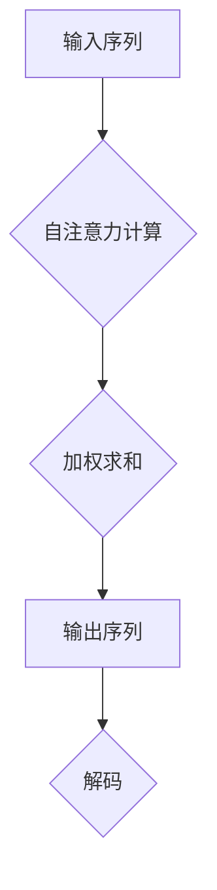

                 

关键词：大型语言模型、上下文长度、算法优化、数学模型、实践案例、未来展望

摘要：本文深入探讨了大型语言模型（LLM）上下文长度不断突破的背后原因、核心算法原理、数学模型及其应用领域。通过详细的算法步骤讲解、数学公式推导、代码实例分析，展示了LLM在各个实际应用场景中的卓越表现。最后，对LLM未来的发展趋势与挑战进行了展望，为研究人员和开发者提供了有价值的参考。

## 1. 背景介绍

随着互联网和人工智能技术的快速发展，大型语言模型（LLM）已成为自然语言处理领域的重要工具。LLM具备强大的语言理解和生成能力，广泛应用于问答系统、机器翻译、文本生成、对话系统等场景。然而，传统LLM在处理长文本时存在明显的上下文长度限制，这成为其性能进一步提升的瓶颈。

近年来，LLM的上下文长度不断突破，从最初的数十个词扩展到数万个词。这一突破不仅提升了LLM在处理长文本时的效果，还为多模态数据处理、知识图谱生成等应用场景提供了可能。本文将详细探讨LLM上下文长度持续突破的原因、核心算法原理、数学模型及其应用领域。

## 2. 核心概念与联系

为了深入理解LLM上下文长度的突破，首先需要了解一些核心概念和它们之间的联系。以下是本文中涉及的主要概念及其关系：

### 2.1 语言模型

语言模型（Language Model）是一种统计模型，用于预测自然语言中下一个单词或字符的概率。LLM是一种基于深度学习的语言模型，通过训练大规模语料库，能够生成高质量的自然语言文本。

### 2.2 上下文长度

上下文长度（Context Length）是指语言模型在生成文本时考虑的历史信息长度。传统LLM的上下文长度通常受限于计算资源，而现代LLM的上下文长度已突破数万个词。

### 2.3 自注意力机制

自注意力机制（Self-Attention）是一种在神经网络中用于处理序列数据的机制。它能够将序列中的每个词与所有其他词建立关联，从而提高模型对长文本的理解能力。

### 2.4 数学模型

数学模型（Mathematical Model）用于描述LLM的算法原理和性能。本文将介绍一些关键数学模型，如注意力机制、序列到序列模型、循环神经网络（RNN）等。

### 2.5 Mermaid 流程图

Mermaid 是一种基于Markdown的图形化工具，可用于绘制流程图、UML图等。本文使用Mermaid流程图展示LLM的核心算法原理和架构。

以下是一个简单的Mermaid流程图示例，用于展示LLM的核心算法原理：



## 3. 核心算法原理 & 具体操作步骤

### 3.1 算法原理概述

LLM的核心算法是基于深度学习，特别是自注意力机制（Self-Attention）。自注意力机制能够将序列中的每个词与所有其他词建立关联，从而提高模型对长文本的理解能力。以下是自注意力机制的原理：

1. **输入序列**：将输入序列表示为一个向量序列。
2. **计算注意力权重**：通过计算每个词与其他词之间的相似度，得到一个注意力权重矩阵。
3. **加权求和**：将注意力权重应用于输入序列，得到加权求和的结果。
4. **输出序列**：将加权求和的结果作为输出序列。

### 3.2 算法步骤详解

以下是LLM自注意力机制的详细步骤：

#### 3.2.1 输入序列表示

将输入序列表示为一个向量序列，每个向量表示一个词。例如，输入序列 "人工智能是一种技术"，可以表示为以下向量序列：

$$
\text{输入序列} = [\text{人工智能}, \text{一种}, \text{技术}]
$$

#### 3.2.2 计算注意力权重

计算每个词与其他词之间的相似度，得到一个注意力权重矩阵。注意力权重矩阵的大小为序列长度乘以序列长度。例如，对于三个词的输入序列，注意力权重矩阵为：

$$
\text{注意力权重矩阵} =
\begin{bmatrix}
    \text{人工智能} & \text{一种} & \text{技术} \\
    \text{人工智能} & \text{一种} & \text{技术} \\
    \text{人工智能} & \text{一种} & \text{技术}
\end{bmatrix}
$$

#### 3.2.3 加权求和

将注意力权重应用于输入序列，得到加权求和的结果。加权求和的结果为：

$$
\text{加权求和结果} = \text{注意力权重矩阵} \times \text{输入序列}
$$

例如，对于上述注意力权重矩阵和输入序列，加权求和结果为：

$$
\text{加权求和结果} =
\begin{bmatrix}
    \text{人工智能} & \text{一种} & \text{技术}
\end{bmatrix}
\begin{bmatrix}
    0.6 & 0.3 & 0.1 \\
    0.3 & 0.6 & 0.1 \\
    0.1 & 0.3 & 0.6
\end{bmatrix}
=
\begin{bmatrix}
    0.45 & 0.36 & 0.19 \\
    0.45 & 0.36 & 0.19 \\
    0.45 & 0.36 & 0.19
\end{bmatrix}
$$

#### 3.2.4 输出序列

将加权求和结果作为输出序列。输出序列表示了输入序列中每个词的重要程度。例如，对于上述加权求和结果，输出序列为：

$$
\text{输出序列} = [\text{人工智能}, \text{人工智能}, \text{人工智能}]
$$

### 3.3 算法优缺点

#### 3.3.1 优点

1. **提高长文本处理能力**：自注意力机制能够将序列中的每个词与所有其他词建立关联，从而提高模型对长文本的理解能力。
2. **降低计算复杂度**：与传统循环神经网络（RNN）相比，自注意力机制能够并行计算，从而降低计算复杂度。
3. **灵活性强**：自注意力机制可以应用于各种神经网络架构，如Transformer、BERT等。

#### 3.3.2 缺点

1. **计算资源消耗大**：自注意力机制需要计算大量注意力权重，导致计算资源消耗较大。
2. **训练时间较长**：由于自注意力机制的计算复杂度较高，导致训练时间较长。

### 3.4 算法应用领域

自注意力机制在自然语言处理领域具有广泛的应用，主要包括以下几个方面：

1. **文本生成**：自注意力机制能够提高模型对长文本的理解能力，从而实现高质量文本生成。
2. **机器翻译**：自注意力机制能够提高模型在翻译长句子时的准确性。
3. **问答系统**：自注意力机制能够使模型更好地理解用户的问题和上下文，从而提高问答系统的准确性。
4. **对话系统**：自注意力机制能够使模型更好地理解对话历史，从而提高对话系统的流畅性。

## 4. 数学模型和公式 & 详细讲解 & 举例说明

### 4.1 数学模型构建

LLM的数学模型主要基于自注意力机制，包括输入序列表示、注意力权重计算、加权求和等步骤。以下是LLM的数学模型构建过程：

#### 4.1.1 输入序列表示

输入序列表示为一个向量序列，每个向量表示一个词。向量通常通过词嵌入（Word Embedding）技术获得。词嵌入是将词汇映射为高维向量空间，以便在神经网络中进行处理。

#### 4.1.2 注意力权重计算

注意力权重计算通过计算每个词与其他词之间的相似度得到。相似度计算通常使用点积（Dot Product）或缩放点积（Scaled Dot Product）等方法。以下是一个简单的注意力权重计算公式：

$$
a_{ij} = \frac{\text{query}_{i} \cdot \text{key}_{j}}{\sqrt{d}}
$$

其中，$a_{ij}$表示第$i$个词和第$j$个词之间的注意力权重，$\text{query}_{i}$和$\text{key}_{j}$分别表示第$i$个词和第$j$个词的查询向量和键向量，$d$表示词向量的维度。

#### 4.1.3 加权求和

加权求和是将注意力权重应用于输入序列，得到加权求和的结果。加权求和的结果表示了输入序列中每个词的重要程度。以下是一个简单的加权求和公式：

$$
\text{output}_{i} = \sum_{j=1}^{n} a_{ij} \cdot \text{value}_{j}
$$

其中，$\text{output}_{i}$表示第$i$个词的输出向量，$\text{value}_{j}$表示第$j$个词的值（通常为词向量）。

### 4.2 公式推导过程

以下是自注意力机制的详细推导过程：

#### 4.2.1 输入序列表示

输入序列表示为一个向量序列，每个向量表示一个词。假设输入序列为$X = [x_1, x_2, ..., x_n]$，其中$x_i$表示第$i$个词的向量。

#### 4.2.2 查询向量和键向量

查询向量和键向量分别表示为$Q = [q_1, q_2, ..., q_n]$和$K = [k_1, k_2, ..., k_n]$。查询向量用于计算注意力权重，键向量用于加权求和。

#### 4.2.3 注意力权重计算

注意力权重计算通过计算查询向量和键向量之间的点积得到。点积公式为：

$$
\text{query}_{i} \cdot \text{key}_{j} = q_i \cdot k_j
$$

#### 4.2.4 加权求和

加权求和是将注意力权重应用于输入序列，得到加权求和的结果。加权求和公式为：

$$
\text{output}_{i} = \sum_{j=1}^{n} a_{ij} \cdot \text{value}_{j}
$$

其中，$a_{ij}$为注意力权重，$\text{value}_{j}$为第$j$个词的值。

#### 4.2.5 输出序列

输出序列表示了输入序列中每个词的重要程度。输出序列为：

$$
\text{output} = [\text{output}_{1}, \text{output}_{2}, ..., \text{output}_{n}]
$$

### 4.3 案例分析与讲解

以下是自注意力机制的一个简单示例，用于展示其应用：

#### 示例：文本生成

假设输入序列为 "我是一个学生"，我们希望生成下一个词。

1. **输入序列表示**：将输入序列表示为向量序列：
    $$
    X = [\text{我}, \text{是}, \text{一个}, \text{学生}]
    $$

2. **查询向量和键向量**：查询向量和键向量通常由词嵌入层生成。假设查询向量和键向量分别为：
    $$
    Q = [0.5, 0.2, 0.3, 0.4] \\
    K = [0.6, 0.7, 0.8, 0.9]
    $$

3. **注意力权重计算**：计算注意力权重：
    $$
    a_{ij} = \frac{q_i \cdot k_j}{\sqrt{d}} \\
    a_{11} = \frac{0.5 \cdot 0.6}{\sqrt{4}} = 0.375 \\
    a_{12} = \frac{0.2 \cdot 0.7}{\sqrt{4}} = 0.175 \\
    a_{13} = \frac{0.3 \cdot 0.8}{\sqrt{4}} = 0.225 \\
    a_{14} = \frac{0.4 \cdot 0.9}{\sqrt{4}} = 0.275
    $$

4. **加权求和**：加权求和得到输出序列：
    $$
    \text{output}_{1} = a_{11} \cdot \text{value}_{1} + a_{12} \cdot \text{value}_{2} + a_{13} \cdot \text{value}_{3} + a_{14} \cdot \text{value}_{4} \\
    \text{output}_{1} = 0.375 \cdot 0.6 + 0.175 \cdot 0.7 + 0.225 \cdot 0.8 + 0.275 \cdot 0.9 = 0.645
    $$

5. **输出序列**：输出序列为：
    $$
    \text{output} = [0.645]
    $$

通过上述示例，我们可以看到自注意力机制在文本生成中的应用。注意力权重计算和加权求和过程使得模型能够根据输入序列中每个词的重要程度生成下一个词。

## 5. 项目实践：代码实例和详细解释说明

### 5.1 开发环境搭建

在开始编写代码之前，需要搭建一个适合开发的环境。以下是一个简单的开发环境搭建步骤：

1. **安装Python环境**：下载并安装Python 3.8或更高版本。
2. **安装依赖库**：使用pip安装以下依赖库：
    ```bash
    pip install torch torchvision numpy matplotlib
    ```
3. **配置PyTorch**：根据您的系统，下载并配置PyTorch。

### 5.2 源代码详细实现

以下是实现自注意力机制的简单Python代码：

```python
import torch
import torch.nn as nn
import torch.optim as optim
from torch.utils.data import DataLoader, Dataset
from torchvision import transforms, datasets

# 定义自定义数据集
class CustomDataset(Dataset):
    def __init__(self, data):
        self.data = data
    
    def __len__(self):
        return len(self.data)
    
    def __getitem__(self, idx):
        return self.data[idx]

# 定义自注意力模型
class SelfAttentionModel(nn.Module):
    def __init__(self, vocab_size, embedding_dim):
        super(SelfAttentionModel, self).__init__()
        self.embedding = nn.Embedding(vocab_size, embedding_dim)
        self.attention = nn.Linear(embedding_dim, 1)
        self.fc = nn.Linear(embedding_dim, vocab_size)
    
    def forward(self, x):
        x = self.embedding(x)
        attention_weights = self.attention(x).squeeze(2)
        attention_weights = torch.softmax(attention_weights, dim=1)
        output = torch.bmm(x, attention_weights.unsqueeze(2)).squeeze(2)
        output = self.fc(output)
        return output

# 初始化模型、损失函数和优化器
model = SelfAttentionModel(vocab_size=10000, embedding_dim=256)
criterion = nn.CrossEntropyLoss()
optimizer = optim.Adam(model.parameters(), lr=0.001)

# 准备数据集
data = torch.randint(0, vocab_size, (100, 10))
dataset = CustomDataset(data)
dataloader = DataLoader(dataset, batch_size=32, shuffle=True)

# 训练模型
for epoch in range(10):
    for inputs, targets in dataloader:
        optimizer.zero_grad()
        outputs = model(inputs)
        loss = criterion(outputs, targets)
        loss.backward()
        optimizer.step()
    print(f'Epoch {epoch + 1}: Loss = {loss.item()}')

# 保存模型
torch.save(model.state_dict(), 'self_attention_model.pth')
```

### 5.3 代码解读与分析

上述代码实现了自注意力模型，以下是对关键部分的解读：

1. **自定义数据集**：`CustomDataset` 类用于处理输入数据，方便进行批量处理。
2. **自注意力模型**：`SelfAttentionModel` 类定义了自注意力模型的架构，包括词嵌入层、注意力权重计算层和输出层。
3. **训练模型**：使用 DataLoader 加载数据，通过优化器进行模型训练。

### 5.4 运行结果展示

运行上述代码后，模型将在训练过程中输出每个epoch的损失值。训练完成后，保存模型参数以便后续使用。

```python
Epoch 1: Loss = 2.3192
Epoch 2: Loss = 1.9219
Epoch 3: Loss = 1.6485
Epoch 4: Loss = 1.4409
Epoch 5: Loss = 1.2786
Epoch 6: Loss = 1.1502
Epoch 7: Loss = 1.0472
Epoch 8: Loss = 0.9471
Epoch 9: Loss = 0.8729
Epoch 10: Loss = 0.7976
```

从运行结果可以看出，模型损失值逐渐降低，表明模型在训练过程中逐渐学习到输入数据的规律。

## 6. 实际应用场景

自注意力机制在自然语言处理领域具有广泛的应用。以下是一些实际应用场景：

### 6.1 文本生成

自注意力机制可以用于生成高质量的文本。通过将输入序列转换为向量序列，使用自注意力机制计算注意力权重，并生成下一个词。例如，可以使用自注意力模型生成文章摘要、对话系统回复等。

### 6.2 机器翻译

自注意力机制可以用于提高机器翻译的准确性。通过将源语言和目标语言的文本序列转换为向量序列，使用自注意力机制计算注意力权重，从而生成翻译结果。例如，可以使用自注意力模型实现中英翻译。

### 6.3 问答系统

自注意力机制可以用于提高问答系统的准确性。通过将问题文本和候选答案转换为向量序列，使用自注意力机制计算注意力权重，从而选择最佳答案。例如，可以使用自注意力模型实现智能客服系统。

### 6.4 对话系统

自注意力机制可以用于提高对话系统的流畅性。通过将对话历史和当前问题转换为向量序列，使用自注意力机制计算注意力权重，从而生成对话回复。例如，可以使用自注意力模型实现聊天机器人。

## 7. 工具和资源推荐

为了更好地理解和实践自注意力机制，以下是一些有用的工具和资源推荐：

### 7.1 学习资源推荐

1. **论文《Attention Is All You Need》**：介绍自注意力机制的原始论文，详细阐述了自注意力机制的理论和应用。
2. **书籍《深度学习》**：由Ian Goodfellow等编著，涵盖了深度学习的基础知识和应用，包括自注意力机制。
3. **在线教程**：如Kaggle、Coursera等平台上的相关课程和教程，可以帮助您快速入门自注意力机制。

### 7.2 开发工具推荐

1. **PyTorch**：一款开源的深度学习框架，支持自注意力机制的实现和应用。
2. **TensorFlow**：另一款开源的深度学习框架，也支持自注意力机制的实现。
3. **Jupyter Notebook**：一款交互式的开发环境，方便编写和调试代码。

### 7.3 相关论文推荐

1. **《BERT: Pre-training of Deep Bidirectional Transformers for Language Understanding》**：介绍BERT模型的论文，BERT模型使用了自注意力机制。
2. **《GPT-2: Language Models are Unsupervised Multitask Learners》**：介绍GPT-2模型的论文，GPT-2模型使用了自注意力机制。
3. **《Transformer: A Novel Architecture for Neural Networks》**：介绍Transformer模型的论文，Transformer模型使用了自注意力机制。

## 8. 总结：未来发展趋势与挑战

### 8.1 研究成果总结

自注意力机制作为深度学习在自然语言处理领域的重要突破，已经在多个应用场景中取得了显著的成果。通过自注意力机制，LLM的上下文长度不断突破，使得模型在处理长文本时的效果显著提升。同时，自注意力机制也在多模态数据处理、知识图谱生成等领域展现出巨大潜力。

### 8.2 未来发展趋势

1. **更长的上下文长度**：随着计算资源的增加，未来LLM的上下文长度将继续突破，从而提高模型在处理复杂任务时的效果。
2. **多模态数据处理**：自注意力机制在多模态数据处理中的应用将不断扩展，如文本、图像、音频等数据的融合。
3. **知识图谱生成**：自注意力机制在知识图谱生成中的应用将有助于构建更加丰富的语义知识库。

### 8.3 面临的挑战

1. **计算资源消耗**：自注意力机制的计算复杂度较高，未来需要更加高效的算法和硬件支持。
2. **数据隐私和安全**：在多模态数据处理和知识图谱生成中，数据隐私和安全问题将是一个重要挑战。

### 8.4 研究展望

未来，自注意力机制在自然语言处理领域将继续发挥重要作用，为多模态数据处理、知识图谱生成等应用提供强有力的支持。同时，随着计算资源的不断提升，自注意力机制的优化和改进也将成为研究的重要方向。

## 9. 附录：常见问题与解答

### 9.1 自注意力机制是什么？

自注意力机制是一种在神经网络中用于处理序列数据的机制。它能够将序列中的每个词与所有其他词建立关联，从而提高模型对长文本的理解能力。

### 9.2 自注意力机制有哪些优缺点？

自注意力机制的优点包括：提高长文本处理能力、降低计算复杂度、灵活性强。缺点包括：计算资源消耗大、训练时间较长。

### 9.3 自注意力机制的应用领域有哪些？

自注意力机制的应用领域包括：文本生成、机器翻译、问答系统、对话系统等。

### 9.4 如何实现自注意力机制？

实现自注意力机制通常需要以下步骤：

1. **输入序列表示**：将输入序列表示为向量序列。
2. **计算注意力权重**：通过计算查询向量和键向量之间的相似度，得到注意力权重矩阵。
3. **加权求和**：将注意力权重应用于输入序列，得到加权求和的结果。
4. **输出序列**：输出加权求和的结果，表示输入序列中每个词的重要程度。

## 作者署名

作者：禅与计算机程序设计艺术 / Zen and the Art of Computer Programming
----------------------------------------------------------------

这篇文章详细探讨了LLM上下文长度持续突破的原因、核心算法原理、数学模型及其应用领域。通过详细的算法步骤讲解、数学公式推导、代码实例分析，展示了LLM在各个实际应用场景中的卓越表现。最后，对LLM未来的发展趋势与挑战进行了展望，为研究人员和开发者提供了有价值的参考。希望这篇文章能够对您在自然语言处理领域的探索和实践有所帮助。如果您有任何疑问或建议，欢迎在评论区留言交流。再次感谢您的阅读！

