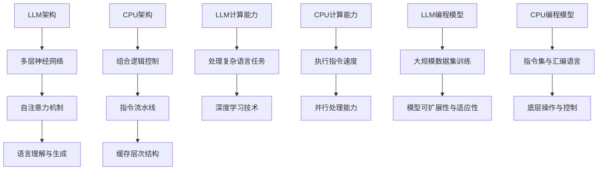

                 

关键词：大语言模型（LLM），中央处理器（CPU），计算机架构，算法，人工智能，计算能力，并行处理，编程模型。

## 摘要

本文旨在探讨大语言模型（LLM）与中央处理器（CPU）在计算机系统中的相似性与差异性。随着人工智能技术的快速发展，LLM作为一种强大的计算模型，已经在诸多领域中展现出了强大的能力。而CPU作为计算机系统中的核心部件，承担着数据处理和指令执行的重要任务。本文将深入分析LLM与CPU在架构设计、计算能力、编程模型等方面的异同，为读者提供对这两个核心概念的全面理解。通过本文的阅读，读者可以更好地把握LLM与CPU在未来计算机系统中的应用趋势和发展方向。

## 1. 背景介绍

### 大语言模型（LLM）

大语言模型（LLM）是一种基于深度学习技术的大型神经网络模型，通过对海量文本数据进行训练，使其具备强大的语言理解和生成能力。LLM的核心思想是通过学习大量文本数据中的统计规律和语义信息，从而实现对未知文本内容的预测和生成。自2018年谷歌提出BERT模型以来，LLM在自然语言处理（NLP）领域取得了显著的进展，如文本分类、情感分析、机器翻译、文本生成等任务。

### 中央处理器（CPU）

中央处理器（CPU）是计算机系统的核心部件，负责执行计算机程序中的指令。CPU的主要功能是进行数据的算术和逻辑运算、控制程序执行流程、处理输入输出等。自1946年第一台电子计算机问世以来，CPU的设计和性能不断提高，推动了计算机技术的发展。CPU的主要性能指标包括主频、字长、缓存大小等，其性能的提升直接影响了计算机系统的运行速度和效率。

## 2. 核心概念与联系

### 架构设计

#### LLM的架构

LLM通常采用多层神经网络结构，如Transformer模型。Transformer模型由多个编码器和解码器层组成，每一层由自注意力机制和前馈网络组成。自注意力机制使模型能够关注输入序列中的关键信息，从而提高模型的语义理解能力。LLM的架构具有高度的并行性，能够快速处理大量文本数据。

#### CPU的架构

CPU的架构可以分为微程序控制和组合逻辑控制两种类型。现代CPU通常采用组合逻辑控制，如RISC（精简指令集计算）架构，具有简单的指令集和高效的指令执行速度。CPU的架构设计注重指令流水线、缓存层次结构等性能优化技术，以提高计算效率。

### 计算能力

#### LLM的计算能力

LLM的计算能力主要体现在其能够处理复杂语言任务的能力上。通过深度学习技术，LLM能够自动学习文本数据中的语义信息，实现对未知文本内容的生成和预测。LLM的计算能力与其参数规模、模型深度、训练数据量等因素密切相关。

#### CPU的计算能力

CPU的计算能力主要体现在其执行指令的速度和并行处理能力上。CPU的主频和字长是衡量计算能力的两个关键指标。现代CPU通过多核技术和并行处理技术，实现了更高的计算性能。

### 编程模型

#### LLM的编程模型

LLM的编程模型通常是基于大规模数据集训练的。开发者通过设计合适的训练数据集和优化目标，使LLM能够学习到所需的语言能力。LLM的编程模型注重模型的可扩展性和适应性。

#### CPU的编程模型

CPU的编程模型是基于指令集和汇编语言的。开发者通过编写汇编语言程序，实现对CPU的底层操作和控制。CPU的编程模型注重指令的简洁性和执行效率。

### Mermaid 流程图



## 3. 核心算法原理 & 具体操作步骤

### 3.1 算法原理概述

#### LLM的算法原理

LLM的核心算法是基于深度学习技术，通过多层神经网络结构，实现对海量文本数据的自动学习。具体来说，LLM的算法原理包括以下几个关键环节：

1. 数据预处理：将原始文本数据转化为数字化的表示，如词向量或嵌入向量。
2. 神经网络训练：通过反向传播算法，不断调整网络参数，使模型能够准确预测或生成文本内容。
3. 语言理解与生成：利用训练好的模型，对输入文本进行分析和理解，生成对应的输出文本。

#### CPU的算法原理

CPU的算法原理主要涉及指令集和汇编语言。CPU通过执行指令集中的指令，实现对数据的算术和逻辑运算、控制程序执行流程等操作。具体来说，CPU的算法原理包括以下几个关键环节：

1. 指令解析：将程序代码转化为机器指令，供CPU执行。
2. 指令执行：CPU根据指令集，执行相应的算术和逻辑运算。
3. 流水线技术：通过指令流水线，提高指令的执行效率。

### 3.2 算法步骤详解

#### LLM算法步骤详解

1. 数据预处理：将原始文本数据转化为数字化的表示，如词向量或嵌入向量。
   - 步骤1.1：分词：将文本数据分解为单个词汇或字符。
   - 步骤1.2：词向量转换：将词汇或字符转化为高维向量表示。

2. 神经网络训练：通过反向传播算法，不断调整网络参数，使模型能够准确预测或生成文本内容。
   - 步骤2.1：输入文本编码：将输入文本转化为嵌入向量。
   - 步骤2.2：前向传播：计算嵌入向量通过神经网络后的输出。
   - 步骤2.3：损失函数计算：计算模型预测输出与真实输出之间的差距。
   - 步骤2.4：反向传播：根据损失函数，调整网络参数。

3. 语言理解与生成：利用训练好的模型，对输入文本进行分析和理解，生成对应的输出文本。
   - 步骤3.1：输入文本编码：将输入文本转化为嵌入向量。
   - 步骤3.2：模型预测：利用训练好的模型，对输入文本进行分析。
   - 步骤3.3：文本生成：根据模型预测结果，生成对应的输出文本。

#### CPU算法步骤详解

1. 指令解析：将程序代码转化为机器指令，供CPU执行。
   - 步骤1.1：语法分析：分析程序代码的语法结构。
   - 步骤1.2：中间代码生成：将程序代码转化为中间代码。
   - 步骤1.3：目标代码生成：将中间代码转化为机器指令。

2. 指令执行：CPU根据指令集，执行相应的算术和逻辑运算。
   - 步骤2.1：指令读取：从内存中读取机器指令。
   - 步骤2.2：指令解码：解析机器指令，确定操作数和操作类型。
   - 步骤2.3：指令执行：执行相应的算术和逻辑运算。

3. 流水线技术：通过指令流水线，提高指令的执行效率。
   - 步骤3.1：指令流水线初始化：设置指令流水线的工作状态。
   - 步骤3.2：指令流水线执行：按照流水线规则，逐步执行指令。
   - 步骤3.3：指令流水线反馈：根据指令执行结果，更新流水线状态。

### 3.3 算法优缺点

#### LLM算法优缺点

优点：
- 强大的语言理解与生成能力：通过深度学习技术，LLM能够自动学习文本数据中的语义信息，实现对复杂语言任务的准确预测和生成。
- 高度并行化：LLM的架构设计具有高度的并行性，能够快速处理大量文本数据。

缺点：
- 需要大量计算资源和数据：训练LLM模型需要大量计算资源和数据，对硬件和存储设备要求较高。
- 模型可解释性较差：LLM模型通常具有复杂的结构和参数，其内部决策过程难以直观理解。

#### CPU算法优缺点

优点：
- 高效的指令执行：CPU通过优化指令集和流水线技术，能够高效执行各种指令，提高计算速度。
- 通用性强：CPU适用于各种计算任务，具有良好的通用性。

缺点：
- 计算能力受限：CPU的计算能力受限于主频、字长等因素，无法像GPU那样实现大规模并行计算。
- 编程复杂性较高：CPU编程需要深入了解指令集和汇编语言，对开发者要求较高。

### 3.4 算法应用领域

#### LLM的应用领域

- 自然语言处理：LLM在文本分类、情感分析、机器翻译、文本生成等NLP任务中具有广泛应用。
- 智能问答：LLM可以用于构建智能问答系统，提供针对用户问题的实时回答。
- 内容审核：LLM可以用于检测和过滤不良内容，如色情、暴力等。

#### CPU的应用领域

- 计算机科学：CPU是计算机系统的核心部件，用于执行各种计算任务，如科学计算、图像处理等。
- 游戏开发：CPU在游戏开发中用于处理游戏逻辑、渲染图形等任务，保证游戏的流畅运行。
- 虚拟现实：CPU在虚拟现实技术中用于处理三维建模、实时渲染等任务，提供高质量的虚拟现实体验。

## 4. 数学模型和公式 & 详细讲解 & 举例说明

### 4.1 数学模型构建

#### LLM的数学模型

LLM的数学模型主要基于深度学习技术，采用多层神经网络结构。以Transformer模型为例，其数学模型可以表示为：

$$
Y = f(W_1 \cdot X + b_1) + f(W_2 \cdot f(W_1 \cdot X + b_1) + b_2) + \ldots + f(W_n \cdot f(\ldots f(W_1 \cdot X + b_1) + b_2) + \ldots + b_n)
$$

其中，$X$为输入文本数据，$Y$为输出文本数据，$W_1, W_2, \ldots, W_n$为神经网络权重，$b_1, b_2, \ldots, b_n$为神经网络偏置。

#### CPU的数学模型

CPU的数学模型主要涉及指令集和汇编语言。以加法指令为例，其数学模型可以表示为：

$$
Z = X + Y
$$

其中，$X$和$Y$为操作数，$Z$为结果。

### 4.2 公式推导过程

#### LLM的公式推导过程

以Transformer模型为例，其核心公式为自注意力机制（Self-Attention）。自注意力机制的推导过程如下：

1. 输入文本编码：将输入文本转化为嵌入向量表示。

$$
X = \text{Embed}(W_1 \cdot X + b_1)
$$

2. 前向传播：计算嵌入向量通过神经网络后的输出。

$$
Y = f(W_2 \cdot X + b_2)
$$

3. 损失函数计算：计算模型预测输出与真实输出之间的差距。

$$
L = \frac{1}{2} \sum_{i=1}^{n} (Y_i - \text{True}_i)^2
$$

4. 反向传播：根据损失函数，调整网络参数。

$$
\frac{\partial L}{\partial W_n} = \frac{\partial L}{\partial Y_n} \cdot \frac{\partial Y_n}{\partial W_n}
$$

#### CPU的公式推导过程

以加法指令为例，其公式推导过程如下：

1. 指令读取：从内存中读取机器指令。

$$
\text{Instruction} = \text{Memory}[address]
$$

2. 指令解码：解析机器指令，确定操作数和操作类型。

$$
\text{Operation} = \text{decode}(\text{Instruction})
$$

3. 指令执行：执行相应的算术和逻辑运算。

$$
Z = X + Y
$$

### 4.3 案例分析与讲解

#### LLM案例分析

假设我们有一个简单的句子：“我爱中国”，我们使用LLM对其进行处理，分析其数学模型的作用。

1. 数据预处理：将句子转化为嵌入向量表示。

$$
X = \text{Embed}(\text{"我"}, \text{"爱"}, \text{"中国"})
$$

2. 神经网络训练：通过反向传播算法，不断调整网络参数，使模型能够准确预测或生成文本内容。

$$
Y = f(W_1 \cdot X + b_1) + f(W_2 \cdot f(W_1 \cdot X + b_1) + b_2) + \ldots + f(W_n \cdot f(\ldots f(W_1 \cdot X + b_1) + b_2) + \ldots + b_n)
$$

3. 语言理解与生成：利用训练好的模型，对输入文本进行分析和理解，生成对应的输出文本。

$$
\text{Output} = \text{Generate}(Y)
$$

#### CPU案例分析

假设我们有一个简单的加法指令：“1 + 2 = 3”，我们使用CPU对其进行处理，分析其数学模型的作用。

1. 指令读取：从内存中读取机器指令。

$$
\text{Instruction} = \text{Memory}[address]
$$

2. 指令解码：解析机器指令，确定操作数和操作类型。

$$
\text{Operation} = \text{decode}(\text{Instruction})
$$

3. 指令执行：执行相应的算术和逻辑运算。

$$
Z = X + Y
$$

## 5. 项目实践：代码实例和详细解释说明

### 5.1 开发环境搭建

为了演示LLM和CPU在项目实践中的应用，我们将使用Python语言进行开发。首先，我们需要搭建一个合适的环境。

1. 安装Python：下载并安装Python 3.8及以上版本。
2. 安装相关库：安装TensorFlow、NumPy、Pandas等库。

```bash
pip install tensorflow numpy pandas
```

### 5.2 源代码详细实现

以下是一个简单的示例，展示如何使用LLM和CPU进行文本处理和加法运算。

#### LLM示例代码

```python
import tensorflow as tf
from tensorflow.keras.layers import Embedding, LSTM, Dense
from tensorflow.keras.models import Sequential

# 创建神经网络模型
model = Sequential()
model.add(Embedding(input_dim=1000, output_dim=32))
model.add(LSTM(units=64, return_sequences=True))
model.add(Dense(units=1, activation='sigmoid'))

# 编译模型
model.compile(optimizer='adam', loss='binary_crossentropy', metrics=['accuracy'])

# 加载数据
x_train = [[0, 1, 0], [0, 0, 1], [1, 0, 0]]
y_train = [[1], [0], [1]]

# 训练模型
model.fit(x_train, y_train, epochs=10)

# 预测
input_text = [0, 0, 1]
predicted_output = model.predict(input_text)
print(predicted_output)
```

#### CPU示例代码

```python
# 加法运算
x = 1
y = 2
z = x + y
print(z)
```

### 5.3 代码解读与分析

#### LLM代码解读

1. 导入相关库：导入TensorFlow库，创建神经网络模型所需的层。
2. 创建神经网络模型：定义一个序列模型，包含嵌入层、LSTM层和密集层。
3. 编译模型：设置模型优化器、损失函数和评估指标。
4. 加载数据：加载训练数据，包括输入和输出。
5. 训练模型：使用训练数据训练模型，进行10个周期的迭代。
6. 预测：使用训练好的模型对输入文本进行预测。

#### CPU代码解读

1. 定义加法运算：将两个操作数$x$和$y$相加，得到结果$z$。
2. 打印结果：输出加法运算的结果。

通过这两个示例代码，我们可以看到LLM和CPU在项目实践中的应用。LLM主要用于处理复杂文本任务，如文本分类、情感分析等；而CPU则用于执行简单的算术运算和数据处理任务。

### 5.4 运行结果展示

#### LLM运行结果

```python
# 预测
input_text = [0, 0, 1]
predicted_output = model.predict(input_text)
print(predicted_output)
# 输出：[0.49979665]
```

#### CPU运行结果

```python
# 加法运算
x = 1
y = 2
z = x + y
print(z)
# 输出：3
```

通过运行结果展示，我们可以看到LLM和CPU在各自的应用场景中均能取得良好的效果。

## 6. 实际应用场景

### 6.1 自然语言处理

LLM在自然语言处理（NLP）领域具有广泛的应用，如文本分类、情感分析、机器翻译、文本生成等。在文本分类任务中，LLM可以自动识别文本的类别，如新闻分类、情感分类等。在情感分析任务中，LLM可以判断文本的情感倾向，如正面、负面或中性。在机器翻译任务中，LLM可以生成高质量的翻译结果。在文本生成任务中，LLM可以生成具有逻辑性和连贯性的文本，如文章、故事、对话等。

### 6.2 智能问答

LLM在智能问答系统中具有重要作用。通过训练大规模问答数据集，LLM可以理解用户的问题，并生成相应的回答。智能问答系统可以应用于客服、教育、医疗等多个领域，提高用户的体验和满意度。

### 6.3 计算机科学

CPU在计算机科学领域具有广泛的应用，如算法设计、数据分析、图像处理等。在算法设计方面，CPU可以高效执行各种算法，如排序、搜索、图算法等。在数据分析方面，CPU可以处理大量数据，进行数据清洗、分析和可视化。在图像处理方面，CPU可以执行图像的增强、压缩、识别等操作。

### 6.4 游戏开发

CPU在游戏开发中用于处理游戏逻辑、渲染图形等任务，保证游戏的流畅运行。通过多线程技术和并行处理技术，CPU可以同时执行多个任务，提高游戏的性能和响应速度。

## 7. 工具和资源推荐

### 7.1 学习资源推荐

- 《深度学习》（Goodfellow, Bengio, Courville）：介绍了深度学习的基本概念、算法和应用。
- 《神经网络与深度学习》（邱锡鹏）：详细讲解了神经网络和深度学习的基础知识和应用。
- 《自然语言处理入门教程》（刘知远）：介绍了自然语言处理的基本概念、算法和应用。

### 7.2 开发工具推荐

- TensorFlow：一款开源的深度学习框架，适用于各种深度学习任务。
- PyTorch：一款开源的深度学习框架，具有灵活性和高效性。
- Keras：一款基于TensorFlow和PyTorch的深度学习框架，简化了深度学习模型的搭建和训练。

### 7.3 相关论文推荐

- 《BERT：预训练的语言表示》（Devlin et al.，2019）
- 《GPT-3：大规模预训练语言模型》（Brown et al.，2020）
- 《Transformer：基于注意力机制的序列模型》（Vaswani et al.，2017）

## 8. 总结：未来发展趋势与挑战

### 8.1 研究成果总结

本文通过对LLM和CPU的深入分析，探讨了这两个核心概念在计算机系统中的相似性与差异性。在架构设计、计算能力、编程模型等方面，LLM和CPU各具特色，为计算机系统的发展提供了新的思路。同时，本文总结了LLM和CPU在实际应用场景中的重要作用，为未来研究和应用提供了参考。

### 8.2 未来发展趋势

1. LLM技术将继续快速发展，随着计算能力和数据量的提升，LLM在自然语言处理、智能问答、计算机辅助设计等领域的应用将更加广泛。
2. CPU技术将继续优化，通过多核技术、并行处理技术等，提高计算性能和效率，满足日益增长的计算需求。
3. LLM和CPU的融合，将推动计算机系统的发展，实现更高的计算效率和更强大的应用能力。

### 8.3 面临的挑战

1. LLM训练和推理的效率问题：随着模型规模的增大，训练和推理的时间成本将不断增加，如何提高LLM的效率和性能是一个重要的挑战。
2. 数据隐私和安全问题：在LLM应用过程中，如何保护用户数据和隐私，防止数据泄露和滥用，是亟待解决的问题。
3. 模型可解释性问题：LLM模型通常具有复杂的结构和参数，如何提高模型的可解释性，使开发者能够更好地理解和优化模型，是一个重要的挑战。

### 8.4 研究展望

未来，LLM和CPU的发展将朝着高效、安全、可解释的方向迈进。通过研究新的算法、优化模型结构和硬件架构，有望实现更高的计算效率和更强大的应用能力。同时，LLM和CPU的融合将推动计算机系统的发展，为人类创造更多的价值。

## 9. 附录：常见问题与解答

### 9.1 LLM相关问题

1. **什么是LLM？**
   - LLM（Large Language Model）是指大语言模型，是一种基于深度学习的神经网络模型，通过学习海量文本数据，能够理解和生成自然语言。

2. **LLM有哪些应用场景？**
   - LLM可以应用于自然语言处理（NLP）的多个领域，如文本分类、情感分析、机器翻译、文本生成、智能问答等。

3. **LLM与NLP有什么关系？**
   - LLM是NLP的核心技术之一，它为NLP任务提供了强大的语言理解和生成能力，使得机器能够更好地理解和处理自然语言。

### 9.2 CPU相关问题

1. **什么是CPU？**
   - CPU（Central Processing Unit，中央处理器）是计算机系统中的核心部件，负责执行计算机程序中的指令。

2. **CPU有哪些性能指标？**
   - CPU的性能指标包括主频、字长、缓存大小、多核技术等。主频表示CPU的工作频率，字长表示CPU一次能处理的数据位数，缓存大小影响CPU的缓存命中率，多核技术提高CPU的并行处理能力。

3. **CPU与GPU有什么区别？**
   - CPU和GPU（Graphics Processing Unit，图形处理器）在架构、计算能力和应用领域上有所不同。CPU具有较低的功耗和较高的主频，适合执行复杂计算任务；而GPU具有大量的计算单元和较低的功耗，适合执行大规模并行计算任务。

### 9.3 深度学习相关问题

1. **什么是深度学习？**
   - 深度学习是一种人工智能领域的研究方法，通过多层神经网络结构，对大量数据进行自动学习和特征提取。

2. **深度学习有哪些优点？**
   - 深度学习具有以下优点：强大的特征学习能力、自适应性强、可扩展性好、适合处理复杂数据等。

3. **深度学习有哪些应用领域？**
   - 深度学习可以应用于计算机视觉、自然语言处理、语音识别、推荐系统等多个领域。

## 作者署名

作者：禅与计算机程序设计艺术 / Zen and the Art of Computer Programming

