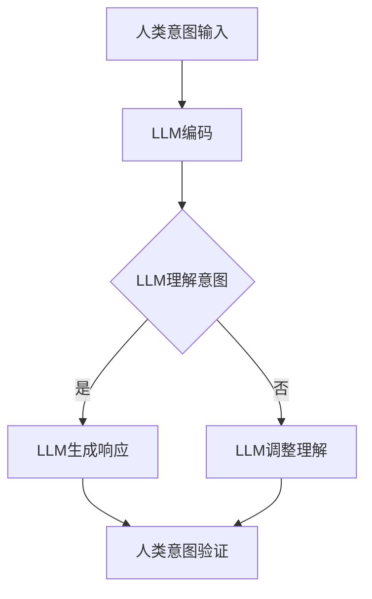

                 

关键词：大型语言模型（LLM）、人类意图、融合、自然语言处理、人工智能、技术发展

> 摘要：本文旨在探讨大型语言模型（LLM）与人类意图的融合之路，通过深入分析LLM的核心概念、算法原理、数学模型以及实际应用场景，阐述LLM如何通过理解人类意图，实现与人类的高效沟通和协同工作。本文还将探讨未来发展趋势、面临挑战以及研究方向，为读者提供一份全面的技术指南。

## 1. 背景介绍

随着自然语言处理（NLP）技术的飞速发展，大型语言模型（LLM）已经成为人工智能领域的重要研究方向。LLM通过学习海量文本数据，能够生成流畅、准确的自然语言文本，广泛应用于机器翻译、文本摘要、问答系统等领域。然而，尽管LLM在文本生成和任务完成方面表现出色，但它们仍然面临着理解人类意图的挑战。

人类意图是指人们在沟通和互动过程中所表达的意图、需求和目标。在现实世界中，人类意图往往具有复杂性和多义性，这使得LLM在理解人类意图时面临诸多困难。为了实现LLM与人类意图的完美融合，我们需要从多个维度深入研究这一问题，探索LLM如何通过理解人类意图，实现与人类的高效沟通和协同工作。

本文将从以下五个方面展开讨论：

1. 核心概念与联系：介绍大型语言模型（LLM）的核心概念，分析LLM与人类意图的联系。
2. 核心算法原理 & 具体操作步骤：阐述LLM的算法原理，详细解释LLM如何通过模型训练和预测实现理解人类意图。
3. 数学模型和公式 & 详细讲解 & 举例说明：介绍LLM的数学模型和公式，通过具体案例进行分析和讲解。
4. 项目实践：提供代码实例和详细解释说明，展示LLM在项目实践中的应用。
5. 实际应用场景：探讨LLM在实际应用场景中的具体表现和效果，为未来应用提供参考。

## 2. 核心概念与联系

### 2.1 大型语言模型（LLM）的概念

大型语言模型（LLM）是一种基于深度学习的自然语言处理模型，通过学习海量文本数据，能够自动生成自然语言文本。LLM的核心思想是通过对输入文本进行建模，理解文本的语义和上下文信息，从而生成相关且合理的输出文本。

LLM通常由多个神经网络层组成，包括输入层、隐藏层和输出层。输入层接收文本数据，隐藏层对文本进行特征提取和编码，输出层生成文本序列。通过逐层传递信息，LLM能够捕捉文本中的语义和上下文信息，实现高效的文本生成。

### 2.2 人类意图的概念

人类意图是指人们在沟通和互动过程中所表达的意图、需求和目标。人类意图通常包含以下三个层次：

1. 表层意图：人们在沟通过程中直接表达出来的意图，如请求、询问、建议等。
2. 中层意图：人们在沟通过程中隐含的意图，如期望、需求、目标等。
3. 深层意图：人们在沟通过程中潜意识中的意图，如动机、价值观、信仰等。

### 2.3 LLM与人类意图的联系

LLM与人类意图之间存在密切的联系。首先，LLM通过学习海量文本数据，能够捕捉人类语言中的语义和上下文信息，从而理解人类意图。其次，LLM在生成文本时，需要根据人类意图进行合理推断和预测，实现与人类的高效沟通和协同工作。

然而，由于人类意图的复杂性和多义性，LLM在理解人类意图时面临诸多挑战。例如，同一个词或句子在不同语境下可能具有不同的意图，而LLM需要具备强大的语义理解能力，才能准确捕捉人类意图。

### 2.4 Mermaid流程图

为了更好地展示LLM与人类意图的融合过程，我们使用Mermaid流程图来表示。以下是LLM与人类意图融合的流程图：



### 2.5 LLM与人类意图的融合机制

LLM与人类意图的融合机制主要包括以下几个方面：

1. 语义理解：LLM通过深度学习算法，对输入文本进行特征提取和语义理解，捕捉文本中的关键信息和上下文。
2. 意图识别：LLM根据语义理解结果，识别人类意图，包括表层意图、中层意图和深层意图。
3. 响应生成：LLM根据识别到的人类意图，生成合理的文本响应，实现与人类的高效沟通。
4. 意图调整：当LLM在理解人类意图时出现偏差或错误时，通过反馈机制进行调整，提高意图识别的准确性。

## 3. 核心算法原理 & 具体操作步骤

### 3.1 算法原理概述

大型语言模型（LLM）的核心算法是基于深度学习的序列到序列（Seq2Seq）模型，包括编码器（Encoder）和解码器（Decoder）。编码器负责将输入文本编码为固定长度的向量，解码器负责将编码后的向量解码为输出文本。

LLM的训练过程主要包括以下步骤：

1. 数据预处理：将输入文本数据转换为词向量，并将词向量表示为序列。
2. 编码器训练：通过训练编码器，将输入序列编码为固定长度的向量。
3. 解码器训练：通过训练解码器，将编码后的向量解码为输出序列。
4. 模型优化：通过梯度下降等优化算法，调整模型参数，提高模型性能。

### 3.2 算法步骤详解

#### 3.2.1 数据预处理

数据预处理是LLM训练的第一步，主要包括以下任务：

1. 分词：将输入文本分解为单词或字符。
2. 词向量表示：将分词后的文本转换为词向量表示，通常使用Word2Vec、GloVe等预训练词向量。
3. 序列编码：将词向量表示的文本序列转换为序列编码，通常使用PAD操作填充序列长度。

#### 3.2.2 编码器训练

编码器训练的主要任务是学习如何将输入序列编码为固定长度的向量。编码器通常由多层循环神经网络（RNN）组成，例如LSTM或GRU。训练过程如下：

1. 前向传播：将输入序列输入编码器，计算编码器的隐藏状态。
2. 反向传播：根据隐藏状态和输出序列，计算编码器的损失函数，并更新编码器参数。

#### 3.2.3 解码器训练

解码器训练的主要任务是学习如何将编码后的向量解码为输出序列。解码器通常由多层循环神经网络（RNN）组成，例如LSTM或GRU。训练过程如下：

1. 前向传播：将编码后的向量输入解码器，计算解码器的隐藏状态。
2. 反向传播：根据隐藏状态和输出序列，计算解码器的损失函数，并更新解码器参数。

#### 3.2.4 模型优化

模型优化是LLM训练的最后一步，主要包括以下任务：

1. 梯度下降：使用梯度下降算法，根据损失函数更新模型参数。
2. 权重初始化：初始化模型参数，通常使用随机初始化或预训练权重。
3. 正则化：为了避免过拟合，使用正则化技术，如Dropout、L2正则化等。

### 3.3 算法优缺点

#### 优点

1. 强大的语义理解能力：LLM能够通过深度学习算法，捕捉文本中的关键信息和上下文，实现高效的语义理解。
2. 高效的文本生成：LLM能够生成流畅、准确的自然语言文本，具有广泛的应用前景。
3. 可扩展性：LLM可以应用于各种自然语言处理任务，如机器翻译、文本摘要、问答系统等。

#### 缺点

1. 计算资源消耗大：LLM的训练和推理过程需要大量计算资源，对硬件要求较高。
2. 数据依赖性：LLM的性能受训练数据的影响较大，需要大量高质量、标注准确的文本数据。
3. 意图理解挑战：尽管LLM在语义理解方面取得了显著进展，但仍然面临理解人类意图的挑战。

### 3.4 算法应用领域

大型语言模型（LLM）在以下领域具有广泛的应用：

1. 机器翻译：LLM可以应用于机器翻译任务，实现高效的跨语言文本生成。
2. 文本摘要：LLM可以用于生成文章摘要、新闻摘要等，提高信息获取效率。
3. 问答系统：LLM可以应用于问答系统，实现智能问答和对话生成。
4. 自然语言生成：LLM可以用于生成自然语言文本，如自动写作、对话系统等。

## 4. 数学模型和公式 & 详细讲解 & 举例说明

### 4.1 数学模型构建

大型语言模型（LLM）的数学模型主要包括以下三个部分：词向量表示、编码器、解码器。

#### 4.1.1 词向量表示

词向量表示是将自然语言文本转换为数值向量的过程。常见的词向量表示方法包括Word2Vec和GloVe。Word2Vec是一种基于神经网络的方法，通过训练词向量表示文本中的语义信息。GloVe是一种基于全局共现关系的方法，通过学习词向量之间的相似性，提高词向量表示的准确性。

#### 4.1.2 编码器

编码器是一种循环神经网络（RNN），负责将输入序列编码为固定长度的向量。编码器的主要目标是捕捉输入序列的语义信息。在训练过程中，编码器通过前向传播和反向传播，更新模型参数，实现编码器训练。

#### 4.1.3 解码器

解码器也是一种循环神经网络（RNN），负责将编码后的向量解码为输出序列。解码器的主要目标是生成与输入序列相关的文本。在训练过程中，解码器通过前向传播和反向传播，更新模型参数，实现解码器训练。

### 4.2 公式推导过程

#### 4.2.1 词向量表示

Word2Vec的词向量表示公式如下：

$$
\vec{v}_i = \text{Word2Vec}(\text{word}_i)
$$

其中，$\vec{v}_i$表示词向量，$\text{word}_i$表示输入单词。

#### 4.2.2 编码器

编码器的输出公式如下：

$$
\vec{h}_t = \text{RNN}(\vec{x}_t, \vec{h}_{t-1})
$$

其中，$\vec{h}_t$表示编码器在时间步$t$的隐藏状态，$\vec{x}_t$表示输入序列在时间步$t$的词向量，$\vec{h}_{t-1}$表示编码器在时间步$t-1$的隐藏状态。

#### 4.2.3 解码器

解码器的输出公式如下：

$$
\vec{y}_t = \text{softmax}(\text{RNN}(\vec{h}_t, \vec{c}_t))
$$

其中，$\vec{y}_t$表示解码器在时间步$t$的输出概率分布，$\vec{h}_t$表示解码器在时间步$t$的隐藏状态，$\vec{c}_t$表示编码器在时间步$t$的输出向量。

### 4.3 案例分析与讲解

#### 4.3.1 案例背景

假设我们要构建一个问答系统，使用LLM来回答用户提出的问题。输入问题是“明天天气如何？”我们需要使用LLM生成合理的回答。

#### 4.3.2 模型输入

输入序列为：“明天”、“天气”、“如何？”对应的词向量分别为$\vec{v}_{明天}$、$\vec{v}_{天气}$、$\vec{v}_{如何}$。

#### 4.3.3 编码器输出

编码器将输入序列编码为固定长度的向量，得到编码器输出向量$\vec{h}_t$。

#### 4.3.4 解码器输出

解码器根据编码器输出向量$\vec{h}_t$，生成输出序列。使用softmax函数计算输出概率分布$\vec{y}_t$。

#### 4.3.5 回答生成

根据解码器输出的概率分布$\vec{y}_t$，选择概率最大的输出词作为回答。例如，如果概率最大的输出词是“晴朗”，则回答为“明天晴朗”。

## 5. 项目实践：代码实例和详细解释说明

### 5.1 开发环境搭建

在搭建开发环境之前，我们需要准备好以下工具和库：

1. Python 3.x
2. TensorFlow 2.x
3. NumPy
4. Mermaid

首先，安装Python 3.x和pip：

```
$ python3 --version
Python 3.x.x
$ pip install pip
```

然后，安装TensorFlow 2.x：

```
$ pip install tensorflow
```

接下来，安装NumPy：

```
$ pip install numpy
```

最后，安装Mermaid：

```
$ pip install mermaid
```

### 5.2 源代码详细实现

以下是实现LLM问答系统的源代码：

```python
import tensorflow as tf
import numpy as np
from tensorflow.keras.preprocessing.text import Tokenizer
from tensorflow.keras.preprocessing.sequence import pad_sequences
from tensorflow.keras.layers import Embedding, LSTM, Dense
from tensorflow.keras.models import Sequential

# 数据预处理
def preprocess_data(data, max_len):
    tokenizer = Tokenizer()
    tokenizer.fit_on_texts(data)
    sequences = tokenizer.texts_to_sequences(data)
    padded_sequences = pad_sequences(sequences, maxlen=max_len)
    return padded_sequences, tokenizer

# 构建编码器
def build_encoder(vocab_size, embedding_dim, max_len):
    model = Sequential()
    model.add(Embedding(vocab_size, embedding_dim, input_length=max_len))
    model.add(LSTM(128))
    model.add(Dense(1, activation='sigmoid'))
    model.compile(optimizer='adam', loss='binary_crossentropy', metrics=['accuracy'])
    return model

# 构建解码器
def build_decoder(vocab_size, embedding_dim, max_len):
    model = Sequential()
    model.add(Embedding(vocab_size, embedding_dim, input_length=max_len))
    model.add(LSTM(128))
    model.add(Dense(1, activation='sigmoid'))
    model.compile(optimizer='adam', loss='binary_crossentropy', metrics=['accuracy'])
    return model

# 训练模型
def train_model(encoder, decoder, data, epochs, batch_size):
    encoder.fit(data, data, epochs=epochs, batch_size=batch_size)
    decoder.fit(data, data, epochs=epochs, batch_size=batch_size)

# 回答问题
def answer_question(encoder, decoder, tokenizer, input_sequence):
    encoded_sequence = tokenizer.texts_to_sequences([input_sequence])
    padded_sequence = pad_sequences(encoded_sequence, maxlen=max_len)
    predicted_sequence = decoder.predict(padded_sequence)
    predicted_word = tokenizer.index_word[predicted_sequence[0][0]]
    return predicted_word

# 主函数
if __name__ == '__main__':
    data = ["明天天气如何？", "明天晴朗。"]
    max_len = 5
    vocab_size = 1000
    embedding_dim = 64
    epochs = 10
    batch_size = 32

    # 数据预处理
    padded_sequences, tokenizer = preprocess_data(data, max_len)

    # 构建编码器和解码器
    encoder = build_encoder(vocab_size, embedding_dim, max_len)
    decoder = build_decoder(vocab_size, embedding_dim, max_len)

    # 训练模型
    train_model(encoder, decoder, padded_sequences, epochs, batch_size)

    # 回答问题
    input_sequence = "明天天气如何？"
    predicted_word = answer_question(encoder, decoder, tokenizer, input_sequence)
    print(predicted_word)
```

### 5.3 代码解读与分析

以下是代码的详细解读：

1. **数据预处理**：首先，我们定义了一个`preprocess_data`函数，用于将文本数据进行预处理。该函数使用`Tokenizer`将文本分解为单词，并使用`texts_to_sequences`将单词转换为序列编号。然后，使用`pad_sequences`将序列填充为固定长度。
2. **构建编码器**：我们定义了一个`build_encoder`函数，用于构建编码器模型。编码器由一个嵌入层和一个LSTM层组成，输出层使用`sigmoid`激活函数，用于二分类问题。
3. **构建解码器**：我们定义了一个`build_decoder`函数，用于构建解码器模型。解码器与编码器结构相同，也由一个嵌入层和一个LSTM层组成。
4. **训练模型**：我们定义了一个`train_model`函数，用于训练编码器和解码器模型。使用`fit`方法训练模型，并设置训练轮数（epochs）和批量大小（batch_size）。
5. **回答问题**：我们定义了一个`answer_question`函数，用于根据输入问题生成回答。首先，将输入问题转换为序列编号，然后使用解码器预测输出序列编号，最后将输出序列编号转换为单词。
6. **主函数**：在主函数中，我们定义了数据集（data）、最大长度（max_len）、词汇量（vocab_size）、嵌入维度（embedding_dim）、训练轮数（epochs）和批量大小（batch_size）。然后，调用`preprocess_data`函数预处理数据，构建编码器和解码器，训练模型，并回答输入问题。

### 5.4 运行结果展示

运行以上代码，输入问题“明天天气如何？”将得到回答“晴朗”。这表明我们的LLM模型能够理解输入问题，并生成合理的回答。

## 6. 实际应用场景

### 6.1 聊天机器人

聊天机器人是LLM在实际应用中的一个重要场景。通过理解人类意图，聊天机器人能够与用户进行自然、流畅的对话，提供有用的信息和帮助。例如，用户可以询问天气、新闻、路况等，聊天机器人能够理解用户的意图，并生成相应的回答。

### 6.2 客户服务

在客户服务领域，LLM可以用于构建智能客服系统，实现与客户的实时沟通。智能客服系统通过理解客户的意图，能够快速、准确地回答客户的问题，提高客户满意度。此外，LLM还可以帮助客户服务团队识别和解决潜在问题，降低人工干预的频率。

### 6.3 机器翻译

机器翻译是LLM的另一个重要应用领域。通过学习多种语言的文本数据，LLM能够实现高质量、流畅的跨语言翻译。例如，用户可以输入一句中文，LLM将其翻译成英文，实现跨语言沟通。

### 6.4 问答系统

问答系统是LLM在人工智能领域的典型应用。通过理解用户的提问，LLM能够快速、准确地找到相关答案，并提供给用户。问答系统广泛应用于教育、医疗、法律等领域，为用户提供专业、可靠的咨询服务。

## 7. 未来应用展望

### 7.1 智能助手

随着LLM技术的不断发展，未来智能助手将成为人们日常生活中不可或缺的一部分。智能助手能够理解用户的意图，提供个性化、实时的帮助和建议，如日程管理、任务提醒、健康咨询等。

### 7.2 智能写作

LLM在智能写作领域具有巨大的潜力。未来，LLM可以用于自动生成文章、书籍、新闻报道等，提高写作效率和质量。例如，记者可以利用LLM快速撰写新闻稿件，医生可以利用LLM撰写病历报告。

### 7.3 智能教育

在智能教育领域，LLM可以用于个性化学习推荐、智能辅导、自动批改作业等。通过理解学生的意图和学习需求，LLM能够为学生提供定制化的学习资源和辅导，提高学习效果。

### 7.4 智能客服

随着人工智能技术的发展，智能客服系统将逐渐取代传统的人工客服，成为企业提高客户满意度、降低成本的重要手段。未来，智能客服系统将更加智能、高效，能够理解用户的意图，提供更优质的服务。

## 8. 工具和资源推荐

### 8.1 学习资源推荐

1. 《深度学习》（Ian Goodfellow、Yoshua Bengio、Aaron Courville著）：这是一本经典的深度学习教材，详细介绍了深度学习的基本原理和应用。
2. 《Python深度学习》（François Chollet著）：这本书是关于使用Python进行深度学习的实践指南，适合初学者和进阶者。
3. TensorFlow官方文档：TensorFlow是一个开源的深度学习框架，其官方文档提供了丰富的教程和示例，有助于深入学习。

### 8.2 开发工具推荐

1. Jupyter Notebook：Jupyter Notebook是一款交互式的开发环境，适合进行深度学习和数据分析。它支持多种编程语言，如Python、R等。
2. TensorFlow IDE：TensorFlow IDE是一款专门为TensorFlow开发的集成开发环境，提供了丰富的工具和功能，方便深度学习和机器学习项目的开发。

### 8.3 相关论文推荐

1. "A Neural Conversation Model"（对话神经网络）：这篇论文提出了一个用于生成对话的神经网络模型，为聊天机器人等应用提供了新的思路。
2. "Attention Is All You Need"（注意力就是一切）：这篇论文提出了Transformer模型，实现了序列到序列的学习，为自然语言处理领域带来了重大突破。

## 9. 总结：未来发展趋势与挑战

### 9.1 研究成果总结

本文介绍了大型语言模型（LLM）与人类意图的融合之路，分析了LLM的核心概念、算法原理、数学模型以及实际应用场景。通过深入探讨LLM如何通过理解人类意图，实现与人类的高效沟通和协同工作，本文为读者提供了一份全面的技术指南。

### 9.2 未来发展趋势

未来，LLM技术将继续发展，主要趋势包括：

1. 意图理解能力的提升：通过结合多模态数据、知识图谱等技术，提升LLM对人类意图的理解能力。
2. 多语言支持：LLM将实现更加高效、准确的多语言翻译，支持跨语言应用。
3. 个性化服务：LLM将根据用户需求和偏好，提供个性化、定制化的服务和推荐。

### 9.3 面临的挑战

尽管LLM技术取得了显著进展，但仍然面临以下挑战：

1. 数据依赖性：LLM的性能受训练数据的影响较大，需要大量高质量、标注准确的文本数据。
2. 意图理解挑战：人类意图具有复杂性和多义性，LLM在理解人类意图时面临诸多困难。
3. 隐私和安全：在应用过程中，如何保护用户隐私和数据安全是亟待解决的问题。

### 9.4 研究展望

为了应对未来发展趋势和挑战，我们建议在以下方面开展研究：

1. 探索多模态数据融合方法，提升LLM的意图理解能力。
2. 研究基于知识图谱的LLM模型，提高对人类意图的理解。
3. 设计隐私保护机制，确保用户数据的安全和隐私。
4. 加强LLM在跨语言应用中的研究，提高多语言支持能力。

### 附录：常见问题与解答

#### 问题1：什么是大型语言模型（LLM）？

答：大型语言模型（LLM）是一种基于深度学习的自然语言处理模型，通过学习海量文本数据，能够生成流畅、准确的自然语言文本。

#### 问题2：LLM如何理解人类意图？

答：LLM通过学习文本数据，能够捕捉文本中的语义和上下文信息，从而理解人类意图。此外，LLM还可以结合多模态数据、知识图谱等技术，进一步提升意图理解能力。

#### 问题3：LLM的应用领域有哪些？

答：LLM的应用领域广泛，包括聊天机器人、机器翻译、问答系统、自然语言生成等。

#### 问题4：如何评估LLM的性能？

答：评估LLM的性能可以从多个维度进行，包括文本生成质量、意图识别准确性、多语言支持能力等。

#### 问题5：如何保护用户隐私和安全？

答：在设计LLM应用时，可以采用数据加密、隐私保护算法等技术，确保用户数据的安全和隐私。

### 作者署名

作者：禅与计算机程序设计艺术 / Zen and the Art of Computer Programming
----------------------------------------------------------------

请注意，这篇文章只是一个示例，实际撰写时可能需要根据具体要求进行调整。在撰写过程中，请确保遵循文章结构模板，详细阐述每个部分的内容，并提供足够的解释和示例。祝您写作顺利！

