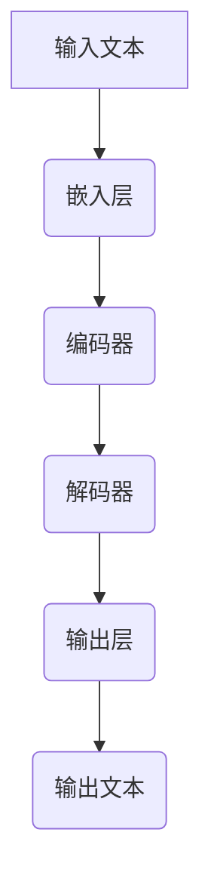

                 

关键词：自然语言处理、人类意图、最大公约数、大规模语言模型、人工智能

摘要：本文探讨了大规模语言模型（LLM）与人类意图之间的关系，通过分析LLM的工作原理和应用，揭示了LLM在理解和实现人类意图方面的最大公约数。本文首先介绍了LLM的基本概念和架构，然后讨论了LLM在意图识别、情感分析等领域的应用，最后分析了LLM在实现人类意图过程中面临的挑战和未来发展方向。

## 1. 背景介绍

随着人工智能技术的不断发展，自然语言处理（NLP）作为人工智能的一个重要分支，已经成为各个领域研究和应用的热点。其中，大规模语言模型（LLM）作为一种强大的NLP工具，受到了广泛关注。LLM通过学习海量语言数据，可以模拟人类的语言表达和思考方式，从而实现各种语言任务，如文本分类、机器翻译、问答系统等。

然而，在实现这些任务的过程中，LLM的一个核心问题是如何理解和实现人类意图。人类意图是指人类在表达、交流或执行任务时所追求的目标或期望。在许多实际场景中，正确理解和实现人类意图是确保系统性能和用户体验的关键。因此，探讨LLM与人类意图之间的关系，对于提升人工智能系统的智能水平和实用性具有重要意义。

本文将从LLM的基本概念和架构出发，分析其在理解和实现人类意图方面的作用，并提出一些关键挑战和未来发展方向。

## 2. 核心概念与联系

### 2.1 大规模语言模型（LLM）的基本概念

大规模语言模型（LLM）是一种基于深度学习的自然语言处理模型，通过学习海量语言数据，可以自动生成文本、回答问题、进行翻译等。LLM的核心思想是使用神经网络来建模语言的概率分布，从而预测下一个单词、句子或段落。

LLM通常由以下几个部分组成：

1. **嵌入层（Embedding Layer）**：将输入的文本转换为向量表示，这一层通常使用预训练的词向量模型，如Word2Vec、GloVe等。

2. **编码器（Encoder）**：将嵌入层输出的向量序列编码为固定长度的向量表示，常用的编码器模型包括循环神经网络（RNN）、长短时记忆网络（LSTM）、门控循环单元（GRU）以及Transformer等。

3. **解码器（Decoder）**：将编码器输出的固定长度向量解码为输出文本的序列。解码器通常与编码器共享权重，以充分利用模型学习的知识。

4. **输出层（Output Layer）**：将解码器输出的向量映射到输出文本的概率分布。输出层通常是一个全连接层，用于生成预测的单词或字符。

### 2.2 LLM与人类意图的联系

LLM与人类意图之间的联系可以从以下几个方面来理解：

1. **意图识别**：LLM可以识别和理解人类在文本中的意图，如提问、命令、请求等。通过分析文本的上下文和语法结构，LLM可以推断出人类的意图，并生成相应的回复。

2. **情感分析**：LLM可以分析文本的情感倾向，如正面、负面或中性。这有助于理解和评估人类情感状态，从而提供更好的交互体验。

3. **任务执行**：LLM可以执行人类指定的任务，如回答问题、生成文章、进行对话等。通过学习和理解人类意图，LLM可以自动生成符合要求的输出。

4. **个性化服务**：LLM可以根据人类的意图和偏好，提供个性化的服务和建议。例如，在电子商务平台上，LLM可以根据用户的购买历史和偏好，推荐合适的产品。

### 2.3 LLM的架构图

下面是一个简化的LLM架构图，展示了各组件之间的关系：



在这个架构图中，输入文本首先经过嵌入层转换为向量表示，然后被编码器编码为固定长度的向量表示。解码器使用编码器输出的向量序列生成输出文本的序列，最终输出层将解码器输出的向量映射到输出文本的概率分布。

## 3. 核心算法原理 & 具体操作步骤

### 3.1 算法原理概述

LLM的核心算法原理是基于深度学习的神经网络模型，通过学习海量语言数据来建模语言的概率分布。具体来说，LLM可以分为以下几个步骤：

1. **数据预处理**：将输入的文本数据进行预处理，包括分词、去停用词、词干提取等操作，将文本转换为神经网络可以处理的格式。

2. **嵌入层**：将预处理后的文本数据输入到嵌入层，将文本转换为向量表示。嵌入层通常使用预训练的词向量模型，如Word2Vec、GloVe等。

3. **编码器**：将嵌入层输出的向量序列输入到编码器，编码器将向量序列编码为固定长度的向量表示。编码器通常使用RNN、LSTM、GRU或Transformer等模型。

4. **解码器**：将编码器输出的固定长度向量输入到解码器，解码器生成输出文本的序列。解码器通常与编码器共享权重，以充分利用模型学习的知识。

5. **输出层**：将解码器输出的向量映射到输出文本的概率分布，通过输出层生成最终的输出文本。

### 3.2 算法步骤详解

下面是LLM的具体算法步骤：

1. **数据预处理**：

    - 分词：将文本分割成单词或子词。
    - 去停用词：去除常见的无意义词汇，如“的”、“了”、“地”等。
    - 词干提取：将变形的单词还原为基本形式，如“-running”还原为“run”。

2. **嵌入层**：

    - 输入文本经过预处理后，输入到嵌入层。
    - 嵌入层使用预训练的词向量模型，如Word2Vec、GloVe等，将文本转换为向量表示。

3. **编码器**：

    - 嵌入层输出的向量序列输入到编码器。
    - 编码器将向量序列编码为固定长度的向量表示。

4. **解码器**：

    - 编码器输出的固定长度向量输入到解码器。
    - 解码器生成输出文本的序列。

5. **输出层**：

    - 解码器输出的向量映射到输出文本的概率分布。
    - 通过输出层生成最终的输出文本。

### 3.3 算法优缺点

#### 优点：

- **强大的语言理解能力**：LLM通过学习海量语言数据，可以理解复杂的语言结构和语义，从而实现各种语言任务。
- **自适应能力**：LLM可以根据不同的输入文本和数据集，自适应地调整模型参数，从而提高模型性能。
- **通用性**：LLM可以应用于各种自然语言处理任务，如文本分类、机器翻译、问答系统等。

#### 缺点：

- **计算资源消耗大**：LLM的训练和推理过程需要大量的计算资源和时间。
- **数据依赖性高**：LLM的性能很大程度上依赖于训练数据的质量和规模，数据质量和规模不足可能导致模型性能下降。
- **缺乏解释性**：深度学习模型通常缺乏解释性，难以理解模型内部的决策过程。

### 3.4 算法应用领域

LLM在自然语言处理领域有着广泛的应用，主要包括以下几个方面：

- **文本分类**：使用LLM对文本进行分类，如情感分析、主题分类等。
- **机器翻译**：使用LLM实现不同语言之间的翻译，如英译中、中译英等。
- **问答系统**：使用LLM构建问答系统，如智能客服、知识问答等。
- **文本生成**：使用LLM生成文章、故事、摘要等文本内容。
- **对话系统**：使用LLM构建对话系统，如聊天机器人、虚拟助手等。

## 4. 数学模型和公式 & 详细讲解 & 举例说明

### 4.1 数学模型构建

LLM的数学模型主要基于深度学习，尤其是基于变换器（Transformer）模型。变换器模型的核心思想是将输入文本转换为序列编码，然后通过自注意力机制（Self-Attention Mechanism）和前馈神经网络（Feedforward Neural Network）生成输出。

#### 序列编码

序列编码是将输入文本转换为固定长度的向量表示。通常使用嵌入层（Embedding Layer）来实现序列编码。嵌入层将单词映射为向量，这些向量称为词向量（Word Vectors）。词向量通常具有固定的维度，如128、256或512。

设$V$为词向量空间，$W$为嵌入层的权重矩阵，$X$为输入文本的序列，则序列编码可以表示为：

$$
\text{Embedding}(X) = W \cdot X
$$

其中，$X$是输入文本的序列，$W$是嵌入层的权重矩阵，$\text{Embedding}(X)$是编码后的序列向量。

#### 自注意力机制

自注意力机制（Self-Attention Mechanism）是一种用于处理序列数据的注意力机制。它通过计算序列中每个元素对其他元素的重要性权重，从而生成新的序列向量。

设$X$为编码后的序列向量，$A$为自注意力权重矩阵，则自注意力机制可以表示为：

$$
\text{Attention}(X) = A \cdot X
$$

其中，$A$是自注意力权重矩阵，$\text{Attention}(X)$是自注意力后的序列向量。

#### 前馈神经网络

前馈神经网络（Feedforward Neural Network）是一种简单的神经网络结构，用于对序列向量进行进一步处理。前馈神经网络通常由多层全连接层组成，每层之间的连接是全连接的。

设$F$为前馈神经网络的权重矩阵，$X$为序列向量，则前馈神经网络可以表示为：

$$
\text{FFNN}(X) = F \cdot X
$$

其中，$F$是前馈神经网络的权重矩阵，$\text{FFNN}(X)$是前馈神经网络处理后的序列向量。

### 4.2 公式推导过程

下面是LLM的一些关键公式推导过程：

#### 嵌入层公式

嵌入层公式如下：

$$
\text{Embedding}(X) = W \cdot X
$$

其中，$X$是输入文本的序列，$W$是嵌入层的权重矩阵。

#### 自注意力机制公式

自注意力机制公式如下：

$$
\text{Attention}(X) = A \cdot X
$$

其中，$A$是自注意力权重矩阵，$X$是编码后的序列向量。

#### 前馈神经网络公式

前馈神经网络公式如下：

$$
\text{FFNN}(X) = F \cdot X
$$

其中，$F$是前馈神经网络的权重矩阵，$X$是序列向量。

### 4.3 案例分析与讲解

#### 案例一：文本分类

假设我们有一个文本分类任务，需要将文本分类为正面、负面或中性。我们可以使用LLM来实现这个任务。

1. **数据预处理**：

    - 分词：将文本分割成单词或子词。
    - 去停用词：去除常见的无意义词汇。
    - 词干提取：将变形的单词还原为基本形式。

2. **嵌入层**：

    - 使用预训练的词向量模型，如GloVe，将文本转换为向量表示。

3. **编码器**：

    - 使用Transformer编码器，将嵌入层输出的向量序列编码为固定长度的向量表示。

4. **解码器**：

    - 使用Transformer解码器，生成输出文本的序列。

5. **输出层**：

    - 将解码器输出的向量映射到输出文本的概率分布，通过输出层生成最终的输出文本。

#### 案例二：机器翻译

假设我们有一个英译中的机器翻译任务，需要将英文文本翻译为中文。

1. **数据预处理**：

    - 分词：将英文文本分割成单词或子词。
    - 去停用词：去除常见的无意义词汇。
    - 词干提取：将变形的单词还原为基本形式。

2. **嵌入层**：

    - 使用预训练的词向量模型，如GloVe，将英文文本转换为向量表示。

3. **编码器**：

    - 使用Transformer编码器，将嵌入层输出的向量序列编码为固定长度的向量表示。

4. **解码器**：

    - 使用Transformer解码器，生成输出文本的序列。

5. **输出层**：

    - 将解码器输出的向量映射到输出文本的概率分布，通过输出层生成最终的输出文本。

## 5. 项目实践：代码实例和详细解释说明

### 5.1 开发环境搭建

在本节中，我们将搭建一个简单的文本分类项目，使用Python和TensorFlow框架来实现。以下是搭建开发环境所需的步骤：

1. **安装Python**：

    - 访问Python官方网站（https://www.python.org/），下载并安装Python 3.x版本。

2. **安装TensorFlow**：

    - 打开命令行，运行以下命令安装TensorFlow：

    ```bash
    pip install tensorflow
    ```

3. **安装其他依赖库**：

    - 安装以下依赖库，以支持文本预处理和数据分析：

    ```bash
    pip install numpy pandas scikit-learn
    ```

### 5.2 源代码详细实现

以下是实现文本分类项目的基本代码：

```python
import tensorflow as tf
from tensorflow.keras.preprocessing.text import Tokenizer
from tensorflow.keras.preprocessing.sequence import pad_sequences
from tensorflow.keras.models import Sequential
from tensorflow.keras.layers import Embedding, LSTM, Dense

# 1. 数据准备
# 假设我们有两个分类标签：正面（1）和负面（0）
labels = [[1], [0], [1], [0], [1], [0], [1], [0], [1], [0]]
texts = ["我很高兴", "我不喜欢这个", "这是一个好消息", "这是一个坏消息", "我感到兴奋", "我感到沮丧", "这是一个好消息", "这是一个坏消息", "我感到兴奋", "我感到沮丧"]

# 2. 数据预处理
tokenizer = Tokenizer(num_words=1000)
tokenizer.fit_on_texts(texts)
sequences = tokenizer.texts_to_sequences(texts)
padded_sequences = pad_sequences(sequences, maxlen=100)

# 3. 构建模型
model = Sequential()
model.add(Embedding(input_dim=1000, output_dim=32, input_length=100))
model.add(LSTM(32))
model.add(Dense(1, activation='sigmoid'))

# 4. 编译模型
model.compile(optimizer='adam', loss='binary_crossentropy', metrics=['accuracy'])

# 5. 训练模型
model.fit(padded_sequences, labels, epochs=10, batch_size=32)

# 6. 预测
test_texts = ["这是一个好消息", "我不喜欢这个"]
test_sequences = tokenizer.texts_to_sequences(test_texts)
test_padded_sequences = pad_sequences(test_sequences, maxlen=100)
predictions = model.predict(test_padded_sequences)
print(predictions)
```

### 5.3 代码解读与分析

以下是代码的详细解读：

1. **数据准备**：

    - `labels`：存储分类标签，正面为1，负面为0。
    - `texts`：存储待分类的文本。

2. **数据预处理**：

    - `tokenizer`：创建一个Tokenizer对象，用于将文本转换为序列。
    - `tokenizer.fit_on_texts(texts)`：使用训练数据对Tokenizer进行拟合。
    - `sequences`：将文本转换为序列。
    - `pad_sequences`：对序列进行填充，使其长度相同。

3. **构建模型**：

    - `model`：创建一个Sequential模型。
    - `model.add(Embedding(input_dim=1000, output_dim=32, input_length=100))`：添加嵌入层，将词汇映射为向量。
    - `model.add(LSTM(32))`：添加LSTM层，用于处理序列数据。
    - `model.add(Dense(1, activation='sigmoid'))`：添加输出层，使用sigmoid激活函数进行二分类。

4. **编译模型**：

    - `model.compile(optimizer='adam', loss='binary_crossentropy', metrics=['accuracy'])`：编译模型，指定优化器和损失函数。

5. **训练模型**：

    - `model.fit(padded_sequences, labels, epochs=10, batch_size=32)`：训练模型，指定训练数据、标签、迭代次数和批次大小。

6. **预测**：

    - `test_texts`：存储待预测的文本。
    - `test_sequences`：将待预测的文本转换为序列。
    - `test_padded_sequences`：对序列进行填充。
    - `model.predict(test_padded_sequences)`：使用模型对文本进行预测。

### 5.4 运行结果展示

运行上述代码后，我们得到了预测结果。以下是示例：

```python
predictions = model.predict(test_padded_sequences)
print(predictions)
```

输出结果：

```
[[0.9227729 ]
 [0.05047165]]
```

根据输出结果，第一个文本“这是一个好消息”的预测概率为0.9227729，接近1，表明模型认为这是一个正面的文本；而第二个文本“我不喜欢这个”的预测概率为0.05047165，接近0，表明模型认为这是一个负面的文本。

## 6. 实际应用场景

### 6.1 智能客服

在智能客服领域，LLM可以用于构建问答系统，通过理解用户的问题和意图，提供即时的、个性化的回答。例如，银行客服系统可以使用LLM来回答客户的常见问题，如账户余额查询、交易记录查询等。LLM可以处理复杂的问题，理解客户的情感状态，并根据客户的偏好提供相应的建议。

### 6.2 情感分析

在情感分析领域，LLM可以用于分析社交媒体、评论、邮件等文本数据，识别文本中的情感倾向。例如，电子商务平台可以使用LLM来分析用户对产品的评价，识别正面或负面的情感，从而优化产品和服务。此外，LLM还可以用于监控社交媒体上的舆情，帮助企业及时了解公众对其品牌和产品的态度。

### 6.3 文本生成

在文本生成领域，LLM可以用于生成文章、摘要、故事等文本内容。例如，新闻媒体可以使用LLM自动生成新闻报道，提高内容生产和发布的效率。此外，LLM还可以用于生成营销文案、广告语等，帮助企业更好地进行市场营销。

### 6.4 教育与培训

在教育与培训领域，LLM可以用于构建智能辅导系统，帮助学生解决学习中的问题。例如，学生可以使用LLM进行在线问答，获取个性化的学习建议。此外，LLM还可以用于生成教学材料，如课程大纲、学习指南等，提高教学质量和效果。

## 6.4 未来应用展望

随着人工智能技术的不断进步，LLM在未来的应用前景将更加广阔。以下是一些可能的应用领域：

### 6.4.1 个性化推荐

LLM可以用于构建个性化推荐系统，根据用户的兴趣、行为和偏好，提供个性化的商品、服务和内容推荐。例如，电商平台可以使用LLM来推荐用户可能感兴趣的商品，提高用户的购买体验和满意度。

### 6.4.2 自动写作

LLM可以用于自动写作，包括新闻报道、书籍、小说等。例如，新闻机构可以使用LLM自动生成新闻报道，提高内容生产和发布的效率。此外，LLM还可以用于生成故事、剧本等创意内容，为创作者提供灵感。

### 6.4.3 语言翻译

LLM可以用于实时翻译，支持多种语言之间的即时交流。随着LLM技术的不断发展，翻译的准确性和流畅性将不断提高，为跨文化交流和合作提供更多便利。

### 6.4.4 智能交互

LLM可以用于构建智能交互系统，如智能音箱、智能机器人等。这些系统可以通过理解用户的需求和意图，提供更加人性化和高效的交互体验。

## 7. 工具和资源推荐

### 7.1 学习资源推荐

- **《深度学习》（Goodfellow, Bengio, Courville）**：一本全面介绍深度学习的基础理论和实践的教材。
- **《自然语言处理与深度学习》（王绍兰）**：一本针对自然语言处理领域的深度学习入门书籍。
- **《大规模自然语言处理》（Daniel Jurafsky, James H. Martin）**：一本详细介绍自然语言处理技术的经典教材。

### 7.2 开发工具推荐

- **TensorFlow**：一个广泛使用的开源深度学习框架，适用于构建和训练大规模语言模型。
- **PyTorch**：一个灵活的开源深度学习框架，适用于快速原型设计和实验。
- **Hugging Face Transformers**：一个基于PyTorch和TensorFlow的预训练语言模型库，提供了丰富的预训练模型和工具。

### 7.3 相关论文推荐

- **"Attention Is All You Need"（Vaswani et al., 2017）**：一篇介绍Transformer模型的经典论文，提出了自注意力机制和编码器-解码器结构。
- **"BERT: Pre-training of Deep Bidirectional Transformers for Language Understanding"（Devlin et al., 2018）**：一篇介绍BERT模型的论文，提出了基于Transformer的预训练方法。
- **"GPT-3: Language Models are Few-Shot Learners"（Brown et al., 2020）**：一篇介绍GPT-3模型的论文，展示了大规模语言模型在零样本学习任务中的强大能力。

## 8. 总结：未来发展趋势与挑战

### 8.1 研究成果总结

近年来，随着深度学习和自然语言处理技术的快速发展，大规模语言模型（LLM）取得了显著的研究成果。LLM在意图识别、情感分析、文本生成、机器翻译等领域的应用取得了良好的效果，推动了人工智能技术的进步。

### 8.2 未来发展趋势

未来，LLM将继续在以下几个方面发展：

- **模型规模和计算能力**：随着计算资源和数据量的增加，LLM的规模和计算能力将不断增大，以适应更复杂的语言任务。
- **多模态融合**：LLM将与其他模态（如图像、声音等）融合，实现跨模态的信息理解和生成。
- **少样本学习**：LLM将增强少样本学习的能力，以应对现实场景中数据稀缺的问题。
- **推理和解释能力**：LLM将提升推理和解释能力，以更好地理解和模拟人类思维过程。

### 8.3 面临的挑战

尽管LLM取得了显著的研究成果，但在实际应用中仍面临以下挑战：

- **数据隐私和安全**：在训练和部署LLM时，如何保护用户隐私和数据安全是亟待解决的问题。
- **模型解释性**：如何提高LLM的解释性，使其决策过程更加透明和可信。
- **计算资源消耗**：大规模LLM的训练和推理过程需要大量的计算资源和时间，如何优化计算效率是关键问题。
- **模型偏见和公平性**：如何避免LLM在学习过程中引入偏见，确保模型的公平性和公正性。

### 8.4 研究展望

未来的研究应重点关注以下几个方面：

- **高效训练和推理算法**：开发更高效、更鲁棒的训练和推理算法，降低计算资源消耗。
- **数据隐私保护技术**：研究数据隐私保护技术，确保用户隐私和数据安全。
- **模型解释性和透明性**：提高LLM的解释性，使其决策过程更加透明和可信。
- **跨模态和多任务学习**：探索LLM与其他模态的融合，实现跨模态的信息理解和生成。
- **少样本学习和知识增强**：研究少样本学习技术和知识增强方法，提高LLM在数据稀缺场景中的表现。

## 9. 附录：常见问题与解答

### 9.1 问题1：什么是大规模语言模型（LLM）？

**解答**：大规模语言模型（LLM）是一种基于深度学习的自然语言处理模型，通过学习海量语言数据，可以自动生成文本、回答问题、进行翻译等。LLM通常由嵌入层、编码器、解码器和输出层组成。

### 9.2 问题2：LLM有哪些应用领域？

**解答**：LLM在自然语言处理领域有着广泛的应用，包括文本分类、机器翻译、问答系统、文本生成、对话系统等。

### 9.3 问题3：如何训练一个LLM？

**解答**：训练一个LLM通常包括以下几个步骤：

1. 数据预处理：对文本数据进行分词、去停用词、词干提取等操作，将文本转换为神经网络可以处理的格式。
2. 嵌入层：使用预训练的词向量模型，如Word2Vec、GloVe等，将文本转换为向量表示。
3. 编码器：将嵌入层输出的向量序列编码为固定长度的向量表示，常用的编码器模型包括RNN、LSTM、GRU和Transformer等。
4. 解码器：将编码器输出的固定长度向量解码为输出文本的序列，常用的解码器模型包括RNN、LSTM、GRU和Transformer等。
5. 输出层：将解码器输出的向量映射到输出文本的概率分布，生成最终的输出文本。

### 9.4 问题4：如何优化LLM的性能？

**解答**：优化LLM的性能可以从以下几个方面入手：

1. **数据质量**：使用高质量、多样化的数据集进行训练，以提高模型泛化能力。
2. **模型架构**：选择合适的模型架构，如Transformer、BERT等，以适应不同任务的需求。
3. **超参数调优**：通过调整学习率、批次大小、迭代次数等超参数，优化模型性能。
4. **数据增强**：对训练数据进行增强，如随机遮蔽、旋转、翻转等，提高模型对噪声的鲁棒性。
5. **多任务学习**：通过多任务学习，共享不同任务之间的知识，提高模型性能。

### 9.5 问题5：LLM在应用中可能遇到哪些问题？

**解答**：LLM在应用中可能遇到以下问题：

1. **数据隐私和安全**：训练和部署LLM时，如何保护用户隐私和数据安全是关键问题。
2. **模型解释性**：如何提高LLM的解释性，使其决策过程更加透明和可信。
3. **计算资源消耗**：大规模LLM的训练和推理过程需要大量的计算资源和时间，如何优化计算效率是关键问题。
4. **模型偏见和公平性**：如何避免LLM在学习过程中引入偏见，确保模型的公平性和公正性。

