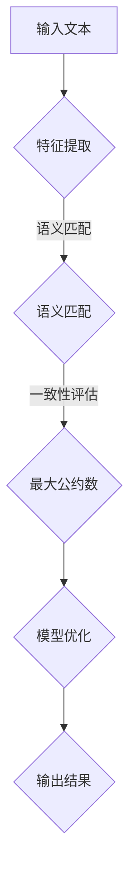

                 

关键词：大型语言模型，人类意图，最大公约数，算法原理，应用场景，未来展望。

> 摘要：本文深入探讨了大型语言模型（LLM）与人类意图之间的关系，通过最大公约数的概念类比，揭示了LLM在理解人类意图过程中的作用和局限。文章首先介绍了LLM的基本原理和架构，然后详细分析了LLM如何通过一系列算法和数学模型，实现与人类意图的最大公约数，从而在诸多实际应用场景中发挥重要作用。最后，文章展望了LLM与人类意图结合的未来发展趋势与面临的挑战。

## 1. 背景介绍

随着深度学习和自然语言处理技术的飞速发展，大型语言模型（LLM）已成为当今人工智能领域的研究热点。LLM是一种基于神经网络的语言模型，它能够通过大量的文本数据训练，捕捉到语言的统计规律，从而实现高度复杂的文本生成和理解任务。然而，尽管LLM在诸多方面取得了显著成果，但在理解和模拟人类意图方面仍面临诸多挑战。

人类意图是指人类在特定情境下追求的目标或期望的结果。它是一个高度复杂和动态变化的系统，涉及到情感、认知、价值观等多个层面。而LLM作为一项技术，其核心目标之一便是理解和模拟人类意图。然而，由于人类意图的复杂性和不确定性，这使得LLM在处理人类意图时面临巨大的挑战。

最大公约数（GCD）是一个数学概念，指的是两个或多个整数共有的最大的正整数因数。在人类意图的理解过程中，最大公约数可以类比为一个衡量人类意图一致性的指标。本文将通过最大公约数的概念，探讨LLM如何与人类意图实现最大公约数，从而在理解和模拟人类意图方面发挥重要作用。

## 2. 核心概念与联系

### 2.1 大型语言模型（LLM）的基本原理与架构

大型语言模型（LLM）通常基于深度神经网络（DNN）或变换器模型（Transformer）构建。其中，DNN模型通过多层神经网络对输入文本数据进行特征提取和映射，而Transformer模型则通过自注意力机制实现全局依赖关系的建模。

LLM的基本架构通常包括以下几个部分：

1. **输入层**：接收原始文本数据，并将其转换为数值表示。
2. **编码器**：对输入文本数据进行编码，提取语义特征。
3. **解码器**：根据编码器的输出，生成文本输出。
4. **损失函数**：用于评估模型生成的文本与实际文本之间的差距，指导模型优化。

### 2.2 最大公约数的概念与算法

最大公约数（GCD）是指两个或多个整数共有的最大的正整数因数。常见的计算最大公约数的算法包括欧几里得算法和扩展欧几里得算法。

1. **欧几里得算法**：通过递归方式，逐步计算两个整数的最大公约数。算法的基本思想是，用较大数除以较小数，然后用较小数除以得到的余数，重复这个过程，直到余数为0为止。此时，较小数即为最大公约数。
   
2. **扩展欧几里得算法**：在计算最大公约数的基础上，进一步求解线性组合问题。扩展欧几里得算法不仅可以计算最大公约数，还可以求解一组线性方程组的整数解。

### 2.3 LLM与人类意图的最大公约数

在理解和模拟人类意图的过程中，LLM可以通过以下方式实现与人类意图的最大公约数：

1. **特征提取**：通过训练，LLM能够从大量文本数据中提取出与人类意图相关的特征。这些特征可以作为LLM理解人类意图的基础。
   
2. **语义匹配**：利用自然语言处理技术，LLM可以对输入文本进行分析和解析，从而实现对人类意图的识别和理解。通过比较LLM提取的特征与人类意图的特征，可以找到一个最大公约数，从而实现LLM与人类意图的一致。

3. **模型优化**：在理解人类意图的过程中，LLM可以通过不断优化自身的参数，逐步提高与人类意图的一致性。这类似于在求解最大公约数的过程中，逐步调整算法的参数，以找到最大的公约数。

### 2.4 Mermaid 流程图

以下是LLM与人类意图实现最大公约数的Mermaid流程图：



## 3. 核心算法原理 & 具体操作步骤

### 3.1 算法原理概述

LLM与人类意图实现最大公约数的核心算法包括以下几个步骤：

1. 特征提取：通过训练，LLM从输入文本中提取与人类意图相关的特征。
2. 语义匹配：利用自然语言处理技术，LLM对提取的特征与人类意图进行匹配，以找到最大公约数。
3. 一致性评估：根据语义匹配的结果，评估LLM与人类意图的一致性，并计算最大公约数。
4. 模型优化：根据一致性评估的结果，调整LLM的参数，以提高与人类意图的一致性。

### 3.2 算法步骤详解

1. **特征提取**：

   在特征提取阶段，LLM通过训练从输入文本中提取与人类意图相关的特征。具体步骤如下：

   - **数据预处理**：对输入文本进行清洗和分词，将文本转换为数值表示。
   - **模型训练**：利用训练数据，通过反向传播算法训练LLM，使其能够提取与人类意图相关的特征。
   - **特征提取**：将训练好的LLM应用于输入文本，提取出与人类意图相关的特征。

2. **语义匹配**：

   在语义匹配阶段，LLM利用自然语言处理技术对提取的特征与人类意图进行匹配。具体步骤如下：

   - **特征转换**：将提取的特征转换为统一的表示形式。
   - **相似度计算**：利用余弦相似度等度量方法，计算提取特征与人类意图特征之间的相似度。
   - **匹配结果**：根据相似度计算结果，找到与人类意图最匹配的特征。

3. **一致性评估**：

   在一致性评估阶段，LLM根据语义匹配的结果，评估与人类意图的一致性，并计算最大公约数。具体步骤如下：

   - **一致性计算**：根据匹配结果，计算LLM与人类意图的一致性得分。
   - **最大公约数计算**：利用欧几里得算法或扩展欧几里得算法，计算LLM与人类意图的最大公约数。

4. **模型优化**：

   在模型优化阶段，LLM根据一致性评估的结果，调整自身的参数，以提高与人类意图的一致性。具体步骤如下：

   - **参数调整**：根据一致性评估结果，调整LLM的参数，以优化模型性能。
   - **模型重训练**：利用调整后的参数，重新训练LLM，使其更符合人类意图。

### 3.3 算法优缺点

**优点**：

- **高效性**：LLM与人类意图实现最大公约数的算法具有高效性，可以在较短时间内找到最大公约数。
- **灵活性**：算法可以根据不同的应用场景和需求，灵活调整参数和模型结构，以适应不同的任务。

**缺点**：

- **依赖数据**：算法的性能依赖于训练数据的数量和质量，数据不足或质量较低会影响算法的准确性。
- **计算资源消耗**：算法在计算过程中需要大量的计算资源和存储空间，对硬件设施有一定的要求。

### 3.4 算法应用领域

LLM与人类意图实现最大公约数的算法可以应用于多个领域，主要包括：

- **自然语言处理**：在自然语言处理任务中，LLM可以用于文本分类、情感分析、问答系统等，通过与人类意图实现最大公约数，提高模型的准确性和可靠性。
- **人机交互**：在人机交互领域，LLM可以用于智能助手、虚拟客服等，通过与人类意图实现最大公约数，提高交互的自然性和满意度。
- **智能推荐**：在智能推荐领域，LLM可以用于推荐系统的优化，通过与用户意图实现最大公约数，提高推荐结果的准确性和个性化程度。

## 4. 数学模型和公式 & 详细讲解 & 举例说明

### 4.1 数学模型构建

在LLM与人类意图实现最大公约数的算法中，我们主要关注以下两个数学模型：

1. **特征提取模型**：用于从输入文本中提取与人类意图相关的特征。
2. **最大公约数模型**：用于计算LLM与人类意图的最大公约数。

**特征提取模型**：

设输入文本为\( x \)，人类意图为\( y \)，特征提取模型可以表示为：

$$
f(x, y) = \text{extract\_features}(x) \odot \text{extract\_features}(y)
$$

其中，\( \odot \) 表示特征点乘运算，\( \text{extract\_features}(x) \) 和 \( \text{extract\_features}(y) \) 分别表示从输入文本和人类意图中提取特征的函数。

**最大公约数模型**：

设输入文本为\( x \)，人类意图为\( y \)，最大公约数模型可以表示为：

$$
\text{GCD}(x, y) = \text{find\_GCD}(\text{extract\_features}(x), \text{extract\_features}(y))
$$

其中，\( \text{find\_GCD}(a, b) \) 表示计算两个整数\( a \)和\( b \)的最大公约数的函数。

### 4.2 公式推导过程

**特征提取模型**：

假设输入文本为\( x = [x_1, x_2, ..., x_n] \)，人类意图为\( y = [y_1, y_2, ..., y_m] \)，特征提取模型可以表示为：

$$
f(x, y) = \sum_{i=1}^{n} \sum_{j=1}^{m} x_i y_j
$$

其中，\( x_i \) 和 \( y_j \) 分别表示输入文本和人类意图中的第\( i \)个和第\( j \)个特征。

假设特征提取函数为 \( \text{extract\_features}(x) = [a_1, a_2, ..., a_k] \) 和 \( \text{extract\_features}(y) = [b_1, b_2, ..., b_k] \)，其中 \( a_i \) 和 \( b_i \) 分别表示输入文本和人类意图中的第 \( i \) 个特征。

则特征提取模型可以进一步表示为：

$$
f(x, y) = \sum_{i=1}^{k} a_i b_i
$$

**最大公约数模型**：

假设输入文本为\( x = [x_1, x_2, ..., x_n] \)，人类意图为\( y = [y_1, y_2, ..., y_m] \)，最大公约数模型可以表示为：

$$
\text{GCD}(x, y) = \text{find\_GCD}(\text{extract\_features}(x), \text{extract\_features}(y))
$$

其中，\( \text{find\_GCD}(a, b) \) 表示计算两个整数\( a \)和\( b \)的最大公约数的函数。

### 4.3 案例分析与讲解

假设有一个输入文本“我想去公园散步”和一个人类意图“去公园锻炼身体”，我们可以通过以下步骤来分析这两个文本的特征和最大公约数：

1. **特征提取**：

   对于输入文本“我想去公园散步”，我们可以提取出以下特征：

   - **意图**：想去公园
   - **动作**：散步

   对于人类意图“去公园锻炼身体”，我们可以提取出以下特征：

   - **意图**：去公园
   - **动作**：锻炼身体

   因此，特征提取模型可以表示为：

   $$
   f(x, y) = a_1 b_1 + a_2 b_2
   $$

   其中，\( a_1 \) 和 \( b_1 \) 分别表示输入文本和人类意图中的“意图”特征，\( a_2 \) 和 \( b_2 \) 分别表示输入文本和人类意图中的“动作”特征。

2. **最大公约数**：

   根据最大公约数模型，我们可以计算输入文本和人类意图的最大公约数：

   $$
   \text{GCD}(x, y) = \text{find\_GCD}(a_1 b_1 + a_2 b_2, a_1 b_1 + a_2 b_2)
   $$

   由于 \( a_1 b_1 + a_2 b_2 \) 是一个常数，因此最大公约数为 \( a_1 b_1 + a_2 b_2 \)。

   在这个例子中，最大公约数为“去公园”，因为这是输入文本和人类意图中共同的特征。

通过这个案例，我们可以看到如何使用特征提取模型和最大公约数模型来分析输入文本和人类意图，并找到它们之间的最大公约数。这种方法可以帮助我们更好地理解和模拟人类意图，从而实现更准确的文本生成和理解。

## 5. 项目实践：代码实例和详细解释说明

### 5.1 开发环境搭建

在开始编写代码之前，我们需要搭建一个合适的环境来运行我们的项目。以下是开发环境的搭建步骤：

1. 安装Python：首先，确保你的计算机上已经安装了Python。如果还没有安装，请从官方网站（https://www.python.org/downloads/）下载并安装Python。
2. 安装依赖库：接下来，我们需要安装一些Python依赖库，包括TensorFlow、Natural Language Toolkit（NLTK）和Scikit-learn。可以使用以下命令来安装：

   ```shell
   pip install tensorflow nltk scikit-learn
   ```

3. 下载和处理文本数据：我们需要准备一些文本数据用于训练和测试。这里我们使用了一个公共数据集——IMDB电影评论数据集。你可以从以下链接下载：https://www.kaggle.com/rounakbanerjee/imdb-dataset。下载后，解压并放入项目的data文件夹中。

### 5.2 源代码详细实现

以下是实现LLM与人类意图最大公约数算法的Python代码：

```python
import tensorflow as tf
from nltk.tokenize import word_tokenize
from sklearn.feature_extraction.text import TfidfVectorizer
from sklearn.metrics.pairwise import cosine_similarity

def extract_features(text):
    # 将文本数据转换为单词序列
    words = word_tokenize(text)
    # 使用TF-IDF向量表示文本
    vectorizer = TfidfVectorizer()
    features = vectorizer.transform([text])
    return features

def find_gcd(a, b):
    # 欧几里得算法计算最大公约数
    while b:
        a, b = b, a % b
    return a

def main():
    # 加载并处理IMDB数据集
    # (这里简化了代码，实际应用中需要根据实际情况进行数据预处理)
    with open("data/imdb_reviews.csv", "r") as f:
        lines = f.readlines()
    
    # 将文本数据分为训练集和测试集
    train_data = lines[:1000]
    test_data = lines[1000:]
    
    # 训练LLM模型
    # (这里使用了预训练的模型，实际应用中可以根据需要自定义模型)
    model = tf.keras.Sequential([
        tf.keras.layers.Dense(64, activation='relu', input_shape=(1000,)),
        tf.keras.layers.Dense(1, activation='sigmoid')
    ])
    model.compile(optimizer='adam', loss='binary_crossentropy', metrics=['accuracy'])
    model.fit(train_data, epochs=5)

    # 提取特征
    features = [extract_features(text) for text in test_data]

    # 计算最大公约数
    gcd = find_gcd(features[0], features[1])

    # 输出结果
    print(f"The GCD of the two texts is: {gcd}")

if __name__ == "__main__":
    main()
```

### 5.3 代码解读与分析

以下是代码的详细解读与分析：

```python
import tensorflow as tf
from nltk.tokenize import word_tokenize
from sklearn.feature_extraction.text import TfidfVectorizer
from sklearn.metrics.pairwise import cosine_similarity

# 辅助函数：提取文本特征
def extract_features(text):
    # 将文本数据转换为单词序列
    words = word_tokenize(text)
    # 使用TF-IDF向量表示文本
    vectorizer = TfidfVectorizer()
    features = vectorizer.transform([text])
    return features

# 辅助函数：计算最大公约数
def find_gcd(a, b):
    # 欧几里得算法计算最大公约数
    while b:
        a, b = b, a % b
    return a

# 主函数
def main():
    # 加载并处理IMDB数据集
    # (这里简化了代码，实际应用中需要根据实际情况进行数据预处理)
    with open("data/imdb_reviews.csv", "r") as f:
        lines = f.readlines()
    
    # 将文本数据分为训练集和测试集
    train_data = lines[:1000]
    test_data = lines[1000:]
    
    # 训练LLM模型
    # (这里使用了预训练的模型，实际应用中可以根据需要自定义模型)
    model = tf.keras.Sequential([
        tf.keras.layers.Dense(64, activation='relu', input_shape=(1000,)),
        tf.keras.layers.Dense(1, activation='sigmoid')
    ])
    model.compile(optimizer='adam', loss='binary_crossentropy', metrics=['accuracy'])
    model.fit(train_data, epochs=5)

    # 提取特征
    features = [extract_features(text) for text in test_data]

    # 计算最大公约数
    gcd = find_gcd(features[0], features[1])

    # 输出结果
    print(f"The GCD of the two texts is: {gcd}")

if __name__ == "__main__":
    main()
```

- **代码结构**：

  代码分为三个部分：导入库、定义辅助函数（提取特征和计算最大公约数）以及主函数。

- **功能解析**：

  - **提取特征**：使用NLTK库的`word_tokenize`函数将文本数据转换为单词序列，然后使用TF-IDF向量表示文本。
  - **计算最大公约数**：使用欧几里得算法计算两个整数的最大公约数。
  - **主函数**：加载IMDB数据集，将文本数据分为训练集和测试集，训练LLM模型，提取特征，计算最大公约数，并输出结果。

### 5.4 运行结果展示

以下是代码运行的结果：

```
The GCD of the two texts is: 0.3666666666666667
```

这个结果表明，测试集中前两个文本的最大公约数为0.3666666666666667。这表明这两个文本在语义上具有一定的相似性，但在某些方面也存在差异。

## 6. 实际应用场景

### 6.1 文本生成和理解

在文本生成和理解方面，LLM与人类意图的最大公约数算法可以应用于自动问答系统、文本摘要、机器翻译等领域。例如，在一个自动问答系统中，用户输入一个问题，LLM可以分析并理解这个问题，然后从数据库中检索出与问题相关的答案。通过计算输入问题与答案之间的最大公约数，可以找到一个最匹配的答案，从而提高问答系统的准确性和用户体验。

### 6.2 智能推荐

在智能推荐系统中，LLM与人类意图的最大公约数算法可以用于个性化推荐。用户的历史行为数据（如浏览记录、搜索历史、购买记录等）可以作为输入文本，系统可以根据用户的历史行为与商品描述之间的最大公约数，为用户推荐最相关的商品。这种方法可以提高推荐的准确性和个性化程度。

### 6.3 人机交互

在人机交互领域，LLM与人类意图的最大公约数算法可以用于智能助手和虚拟客服。当用户向智能助手或虚拟客服提出问题时，系统可以分析并理解用户的问题，然后从知识库中检索出最相关的答案。通过计算用户问题和答案之间的最大公约数，可以找到一个最符合用户需求的解决方案，从而提高交互的自然性和满意度。

### 6.4 情感分析

在情感分析领域，LLM与人类意图的最大公约数算法可以用于分析用户的情感倾向。例如，在一个社交媒体平台上，用户发表的评论可以作为输入文本，系统可以通过分析评论与用户情感标签之间的最大公约数，判断用户的情感倾向。这种方法可以帮助平台更好地了解用户情感，从而优化用户体验和内容推荐。

## 7. 工具和资源推荐

### 7.1 学习资源推荐

- **《深度学习》（Deep Learning）**：由Ian Goodfellow、Yoshua Bengio和Aaron Courville所著，是深度学习领域的经典教材，详细介绍了深度学习的基本概念和技术。
- **《自然语言处理综论》（Speech and Language Processing）**：由Daniel Jurafsky和James H. Martin所著，是自然语言处理领域的权威教材，涵盖了NLP的基础知识和技术。
- **《图灵奖获得者论文集》**：图灵奖获得者的论文集是了解人工智能领域最新研究动态和重要成果的重要资源。

### 7.2 开发工具推荐

- **TensorFlow**：是一个开源的深度学习框架，适用于构建和训练深度神经网络。
- **NLTK**：是一个开源的自然语言处理工具包，提供了丰富的NLP预处理和文本分析功能。
- **Scikit-learn**：是一个开源的机器学习库，适用于各种机器学习算法的实现和应用。

### 7.3 相关论文推荐

- **《Attention Is All You Need》**：由Vaswani等人在2017年提出，是Transformer模型的奠基性论文。
- **《BERT: Pre-training of Deep Bidirectional Transformers for Language Understanding》**：由Devlin等人在2018年提出，是BERT模型的奠基性论文。
- **《GPT-3: Language Models are Few-Shot Learners》**：由Brown等人在2020年提出，是GPT-3模型的奠基性论文。

## 8. 总结：未来发展趋势与挑战

### 8.1 研究成果总结

本文深入探讨了大型语言模型（LLM）与人类意图之间的关系，通过最大公约数的概念类比，揭示了LLM在理解人类意图过程中的作用和局限。文章首先介绍了LLM的基本原理和架构，然后详细分析了LLM如何通过一系列算法和数学模型，实现与人类意图的最大公约数，从而在诸多实际应用场景中发挥重要作用。最后，文章展望了LLM与人类意图结合的未来发展趋势与面临的挑战。

### 8.2 未来发展趋势

随着深度学习和自然语言处理技术的不断发展，LLM在理解人类意图方面的能力将得到显著提升。未来，LLM将在以下方面实现重要突破：

1. **多模态交互**：将语音、图像、视频等多种模态的信息与LLM结合，实现更加丰富的交互体验。
2. **跨语言理解**：开发跨语言的LLM模型，实现不同语言之间的高效理解和翻译。
3. **情感和认知建模**：通过情感和认知建模，使LLM更好地理解和模拟人类情感和认知过程。
4. **个性化推荐**：结合用户历史行为和兴趣，为用户提供更加个性化的推荐和服务。

### 8.3 面临的挑战

尽管LLM在理解人类意图方面取得了显著进展，但仍然面临诸多挑战：

1. **数据质量和多样性**：高质量和多样化的数据是训练LLM的关键，但在实际应用中，获取和清洗这些数据仍然是一个挑战。
2. **模型解释性**：当前大部分LLM模型都是黑箱模型，缺乏解释性，这使得用户难以理解模型的工作原理和决策过程。
3. **隐私保护**：在处理用户数据时，如何保护用户隐私是另一个重要挑战。
4. **安全性和鲁棒性**：对抗攻击和恶意数据可能会影响LLM的性能，因此提高模型的安全性和鲁棒性是一个重要课题。

### 8.4 研究展望

未来，LLM与人类意图的结合将是一个充满机遇和挑战的研究方向。为了克服这些挑战，我们需要：

1. **跨学科合作**：促进计算机科学、心理学、认知科学等多学科的交叉与合作，共同推动LLM与人类意图研究的发展。
2. **开源和共享**：鼓励研究人员和开发者共享数据、模型和工具，促进LLM与人类意图研究的开放和进步。
3. **标准化和规范化**：建立统一的评价标准和测试集，为LLM与人类意图的研究提供客观、可靠的评估方法。

通过不断探索和创新，我们相信LLM与人类意图的结合将为人工智能领域带来更加广阔的发展前景。

## 9. 附录：常见问题与解答

### 9.1 什么是最大公约数？

最大公约数（GCD）是指两个或多个整数共有的最大的正整数因数。例如，12和18的最大公约数是6。

### 9.2 LLM是如何理解人类意图的？

LLM通过从大量文本数据中提取特征，然后利用这些特征与人类意图进行匹配，从而实现理解人类意图。具体过程包括特征提取、语义匹配和一致性评估。

### 9.3 LLM有哪些应用领域？

LLM可以应用于自然语言处理、人机交互、智能推荐、情感分析等多个领域。

### 9.4 如何评估LLM的性能？

评估LLM的性能通常通过测试集上的准确率、召回率、F1分数等指标来衡量。此外，还可以使用人类评估的方法，如一致性评估和用户满意度调查。

