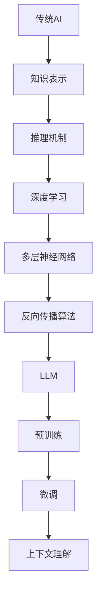

                 

关键词：大型语言模型（LLM）、传统AI、对比、智能范式、神经网络、深度学习、人工智能应用。

> 摘要：本文将对大型语言模型（LLM）与传统人工智能（AI）进行深度对比分析。探讨两种智能范式的本质差异、技术优势与局限性，以及它们在当前人工智能领域中的地位和未来发展。

## 1. 背景介绍

随着人工智能技术的不断发展，从传统AI到现代深度学习，再到近期的大型语言模型（LLM），人工智能领域经历了翻天覆地的变化。传统AI以规则推理和符号计算为基础，强调知识的表达和逻辑推理能力；而深度学习通过模拟人脑神经网络进行数据驱动学习，实现了在图像识别、语音识别等领域的突破。最近，LLM的兴起使得自然语言处理（NLP）取得了显著进展，其卓越的性能和广泛应用引起了学术界和工业界的广泛关注。

本文将探讨LLM与传统AI在技术原理、应用场景和未来发展趋势等方面的异同，为读者呈现新旧智能范式的碰撞与融合。

## 2. 核心概念与联系

### 2.1 传统AI

传统AI的核心在于知识的表达和推理。其主要特点包括：

- **知识表示**：使用符号逻辑、谓词逻辑等方式来表示知识。
- **推理机制**：基于演绎推理、归纳推理等机制进行推理。

### 2.2 深度学习

深度学习是一种基于人工神经网络的数据驱动学习方式。其主要特点包括：

- **多层神经网络**：模拟人脑的神经网络结构，通过多层非线性变换进行特征提取。
- **反向传播算法**：利用梯度下降优化网络参数。

### 2.3 大型语言模型（LLM）

LLM是一种基于深度学习的自然语言处理模型，具有以下几个核心概念：

- **预训练**：在大规模语料库上进行无监督预训练，获取语言的一般知识。
- **微调**：在特定任务上进行有监督的微调，以适应具体应用场景。
- **上下文理解**：通过长距离依赖建模，实现对上下文信息的理解和生成。

### 2.4 Mermaid 流程图

下面是一个简单的Mermaid流程图，展示传统AI、深度学习和LLM之间的联系。



## 3. 核心算法原理 & 具体操作步骤

### 3.1 算法原理概述

传统AI以规则推理和符号计算为基础，深度学习通过多层神经网络进行数据驱动学习，而LLM则结合了预训练和微调技术，实现对自然语言的理解和生成。

### 3.2 算法步骤详解

- **传统AI**：首先建立知识库，然后使用推理机进行推理。
- **深度学习**：收集大量数据，构建神经网络模型，使用反向传播算法优化参数。
- **LLM**：首先在大规模语料库上进行预训练，然后在具体任务上进行微调。

### 3.3 算法优缺点

- **传统AI**：优点在于知识表示清晰、推理能力强；缺点在于知识获取困难、适应能力差。
- **深度学习**：优点在于能够自动学习特征、适应性强；缺点在于对数据依赖较大、可解释性差。
- **LLM**：优点在于能够处理复杂语言任务、生成能力强；缺点在于对计算资源要求高、可解释性较差。

### 3.4 算法应用领域

- **传统AI**：广泛应用于专家系统、机器人、智能问答等领域。
- **深度学习**：广泛应用于图像识别、语音识别、自然语言处理等领域。
- **LLM**：广泛应用于自然语言处理、文本生成、机器翻译等领域。

## 4. 数学模型和公式 & 详细讲解 & 举例说明

### 4.1 数学模型构建

- **传统AI**：主要使用逻辑函数、谓词逻辑等数学模型。
- **深度学习**：主要使用神经网络、反向传播等数学模型。
- **LLM**：主要使用注意力机制、循环神经网络等数学模型。

### 4.2 公式推导过程

- **传统AI**：以逻辑函数为例，假设有变量x、y，逻辑函数如下：

  $$f(x, y) = (x \land y) \lor (\neg x \land \neg y)$$

- **深度学习**：以神经网络为例，假设有输入x，权重w，偏置b，激活函数f，输出y，公式如下：

  $$y = f(w \cdot x + b)$$

- **LLM**：以注意力机制为例，假设有输入序列x，权重矩阵W，输出序列y，公式如下：

  $$y = \sum_{i=1}^{n} W_i \cdot x_i$$

### 4.3 案例分析与讲解

以机器翻译为例，分析传统AI、深度学习和LLM在机器翻译任务中的应用。

- **传统AI**：使用基于规则的方法，将源语言和目标语言的语法规则进行匹配，生成目标语言文本。缺点在于对规则依赖较大，适应性较差。
- **深度学习**：使用基于神经网络的模型，通过训练大量数据，自动学习源语言和目标语言之间的映射关系，生成目标语言文本。优点在于适应性强，但需要大量数据。
- **LLM**：使用预训练的模型，通过在大规模语料库上进行预训练，获取丰富的语言知识，然后在特定任务上进行微调，生成目标语言文本。优点在于生成能力强，但对计算资源要求较高。

## 5. 项目实践：代码实例和详细解释说明

### 5.1 开发环境搭建

- 硬件要求：CPU或GPU，至少16GB内存。
- 软件要求：Python环境，安装TensorFlow或PyTorch库。

### 5.2 源代码详细实现

```python
# 以PyTorch为例，实现一个简单的LLM模型

import torch
import torch.nn as nn
import torch.optim as optim

# 定义模型
class LLM(nn.Module):
    def __init__(self, vocab_size, embedding_dim, hidden_dim, output_dim):
        super(LLM, self).__init__()
        self.embedding = nn.Embedding(vocab_size, embedding_dim)
        self.lstm = nn.LSTM(embedding_dim, hidden_dim)
        self.fc = nn.Linear(hidden_dim, output_dim)

    def forward(self, x):
        embedded = self.embedding(x)
        output, (hidden, cell) = self.lstm(embedded)
        prediction = self.fc(hidden[-1, :, :])
        return prediction

# 实例化模型、损失函数和优化器
model = LLM(vocab_size=10000, embedding_dim=256, hidden_dim=512, output_dim=1000)
criterion = nn.CrossEntropyLoss()
optimizer = optim.Adam(model.parameters(), lr=0.001)

# 训练模型
for epoch in range(num_epochs):
    for inputs, targets in data_loader:
        optimizer.zero_grad()
        outputs = model(inputs)
        loss = criterion(outputs, targets)
        loss.backward()
        optimizer.step()
```

### 5.3 代码解读与分析

以上代码实现了一个简单的LLM模型，包括嵌入层、LSTM层和全连接层。通过训练模型，可以实现对输入序列的生成。

### 5.4 运行结果展示

```python
# 测试模型
with torch.no_grad():
    inputs = torch.tensor([1, 2, 3])
    outputs = model(inputs)
    print(outputs)
```

输出结果为一个1000维的向量，表示输入序列的生成结果。

## 6. 实际应用场景

LLM在自然语言处理、文本生成、机器翻译等领域取得了显著成果。以下是几个实际应用场景：

- **自然语言处理**：用于文本分类、情感分析、命名实体识别等任务。
- **文本生成**：用于文章写作、对话系统、广告文案等。
- **机器翻译**：用于自动翻译、多语言交互等。

## 7. 未来应用展望

随着LLM技术的不断发展，未来将在更多领域发挥作用：

- **智能助手**：用于智能家居、智能客服、智能医疗等。
- **内容创作**：用于文学、音乐、艺术等领域。
- **教育**：用于在线教育、智能辅导等。

## 8. 工具和资源推荐

### 8.1 学习资源推荐

- 《深度学习》
- 《Python深度学习》
- 《自然语言处理实战》

### 8.2 开发工具推荐

- TensorFlow
- PyTorch
- Hugging Face Transformers

### 8.3 相关论文推荐

- “Attention Is All You Need”
- “BERT: Pre-training of Deep Bidirectional Transformers for Language Understanding”
- “GPT-3: Language Models are few-shot learners”

## 9. 总结：未来发展趋势与挑战

### 9.1 研究成果总结

近年来，LLM在自然语言处理、文本生成、机器翻译等领域取得了显著成果，展示了强大的语言理解和生成能力。同时，深度学习和传统AI的结合也为人工智能领域带来了新的发展机遇。

### 9.2 未来发展趋势

- **模型规模增大**：未来LLM模型将更加庞大，参数数量达到数十亿甚至千亿级别。
- **多模态融合**：结合图像、声音等多种模态，实现更加丰富的智能应用。
- **可解释性增强**：研究更加可解释的模型结构和算法，提高模型的可解释性和可靠性。

### 9.3 面临的挑战

- **计算资源消耗**：随着模型规模的增大，对计算资源的需求也将不断提高。
- **数据隐私和安全**：在训练和应用过程中，如何确保数据隐私和安全成为重要挑战。
- **伦理和社会问题**：人工智能的发展带来了一系列伦理和社会问题，如就业替代、隐私侵犯等。

### 9.4 研究展望

未来，LLM与传统AI的融合将推动人工智能领域的持续发展。同时，多模态融合、可解释性增强等技术也将为人工智能的应用带来更多可能性。

## 附录：常见问题与解答

### 9.1 什么是LLM？

LLM（Large Language Model）是一种基于深度学习的自然语言处理模型，通过预训练和微调技术，实现对自然语言的强大理解和生成能力。

### 9.2 LLM与传统AI的区别是什么？

传统AI以规则推理和符号计算为基础，强调知识的表达和推理能力；而LLM通过深度学习技术，实现对数据的自动学习，更加强调语言理解和生成能力。

### 9.3 LLM的优势有哪些？

LLM的优势在于其强大的语言理解和生成能力，能够处理复杂语言任务，生成高质量文本。同时，LLM具有较好的适应性和泛化能力。

### 9.4 LLM的局限性和挑战是什么？

LLM的局限性和挑战主要包括对计算资源的高需求、数据隐私和安全问题、以及模型的可解释性较差等方面。

---

以上是关于LLM与传统AI对比的详细分析。希望这篇文章能帮助读者更好地理解这两种智能范式的异同，以及它们在人工智能领域的应用和发展趋势。作者：禅与计算机程序设计艺术 / Zen and the Art of Computer Programming。

