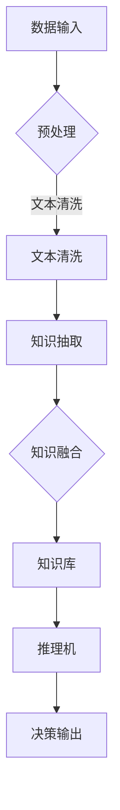

                 

在当今人工智能（AI）领域，语言模型（LLM，Language Model）的迅猛发展，为知识工程带来了前所未有的机遇与挑战。LLM，如GPT、BERT等，以其强大的语言理解和生成能力，在自然语言处理（NLP）领域取得了显著的成就。然而，传统专家系统在领域知识的深度解析和精准推理方面仍然具有不可替代的优势。本文将探讨LLM与传统专家系统的融合，如何开创知识工程的新篇章。

## 关键词
- 语言模型（LLM）
- 传统专家系统
- 知识工程
- 深度学习
- 知识图谱
- 精准推理

## 摘要
本文首先介绍了语言模型（LLM）和传统专家系统的基本概念，以及它们各自的优势和局限性。接着，分析了LLM与传统专家系统融合的动机和必要性。随后，本文详细阐述了融合方法、核心算法原理、具体操作步骤、数学模型和公式、项目实践、实际应用场景、未来应用展望以及面临的挑战。最后，本文总结了研究成果，展望了未来发展趋势与挑战，并提供了相关的学习资源和开发工具推荐。

## 1. 背景介绍

### 1.1 语言模型（LLM）的兴起

语言模型是自然语言处理（NLP）领域的一个重要分支，旨在构建能够理解和生成自然语言的模型。自20世纪50年代起，NLP领域经历了从规则驱动到统计方法，再到深度学习模型的演变。特别是深度学习技术的发展，为语言模型带来了突破性的进展。例如，GPT（Generative Pre-trained Transformer）和BERT（Bidirectional Encoder Representations from Transformers）等大型语言模型，通过在海量文本数据上进行预训练，能够捕捉到语言的高级语义特征，从而在多种NLP任务中表现出色。

### 1.2 传统专家系统的局限

传统专家系统是人工智能领域的一个重要分支，旨在模拟专家的决策能力，以解决复杂的问题。传统专家系统通常基于知识表示、推理机等技术，能够对特定领域的知识进行深度解析和精准推理。然而，传统专家系统存在一些局限性：

1. **知识获取困难**：传统专家系统依赖于手工构建的知识库，知识获取过程繁琐且耗时。
2. **推理能力有限**：传统专家系统的推理能力通常局限于基于规则的推理，难以处理复杂和不确定的问题。
3. **可扩展性差**：传统专家系统的扩展和维护成本较高，难以适应快速变化的应用场景。

### 1.3 LLM与传统专家系统的融合

面对LLM和传统专家系统的各自优势，将它们融合起来，成为一种新型的知识工程方法，具有重要的研究价值和实际应用潜力。LLM可以处理大量的文本数据，从中学到丰富的知识，而传统专家系统则可以对这些知识进行深度解析和精准推理。这种融合有望克服传统专家系统的局限性，提升知识工程的效率和效果。

## 2. 核心概念与联系

### 2.1 语言模型（LLM）

语言模型是一种基于深度学习的模型，旨在预测给定输入序列后继的概率分布。在自然语言处理中，语言模型可以用于文本生成、机器翻译、情感分析等多种任务。常见的语言模型有GPT、BERT、T5等。

### 2.2 传统专家系统

传统专家系统是一种基于知识的系统，旨在模拟人类专家的决策过程。它通常包含知识库、推理机、用户接口等组成部分。传统专家系统广泛应用于医疗诊断、金融风险评估、工业过程控制等领域。

### 2.3 融合架构

LLM与传统专家系统的融合可以采用以下架构：

1. **知识抽取**：利用LLM对大规模文本数据进行知识抽取，生成知识图谱。
2. **知识融合**：将LLM抽取的知识与传统专家系统的领域知识进行融合，构建一个综合的知识库。
3. **推理机**：利用融合后的知识库，结合传统专家系统的推理机，实现复杂问题的精准推理。

### 2.4 Mermaid 流程图



## 3. 核心算法原理 & 具体操作步骤

### 3.1 算法原理概述

融合LLM与传统专家系统的核心算法主要包括知识抽取、知识融合、推理机三部分。知识抽取利用LLM从大规模文本数据中提取结构化知识；知识融合将LLM抽取的知识与传统专家系统的领域知识进行整合；推理机则基于融合后的知识库，实现对复杂问题的精准推理。

### 3.2 算法步骤详解

1. **知识抽取**：使用预训练的LLM（如BERT）对文本数据进行编码，提取文本中的实体、关系和属性。具体步骤如下：
   - 数据预处理：对文本数据进行分词、去停用词、词性标注等预处理操作。
   - 编码器：使用BERT等预训练模型对预处理后的文本进行编码，生成文本序列的向量表示。
   - 实体识别：利用BERT模型中的实体识别模块，从编码后的文本中识别出实体。
   - 关系抽取：通过实体间的共现信息，使用图神经网络等方法抽取实体间的关系。
   - 属性抽取：针对识别出的实体和关系，使用规则匹配或神经网络等方法抽取实体的属性。

2. **知识融合**：将LLM抽取的知识与传统专家系统的领域知识进行整合，构建一个综合的知识库。具体步骤如下：
   - 知识映射：将LLM抽取的知识与传统专家系统的知识进行映射，确保知识的一致性和兼容性。
   - 知识融合：使用图数据库等技术，将映射后的知识存储在统一的知识库中。

3. **推理机**：基于融合后的知识库，结合传统专家系统的推理机，实现对复杂问题的精准推理。具体步骤如下：
   - 知识库查询：根据输入的问题，从知识库中查询相关的知识条目。
   - 规则匹配：使用传统专家系统的推理规则，对查询结果进行匹配，生成可能的答案。
   - 答案生成：对匹配结果进行综合分析，生成最终的答案。

### 3.3 算法优缺点

**优点**：
- **强大的语言理解能力**：LLM能够从大规模文本数据中提取丰富的知识，提高知识抽取的准确性。
- **高效的知识融合**：通过统一的知识库架构，实现LLM抽取的知识与传统专家系统领域知识的无缝融合。
- **精准的推理能力**：结合传统专家系统的推理机，实现对复杂问题的精准推理。

**缺点**：
- **知识库构建成本高**：需要大量的专业知识和人力投入，对知识库进行持续更新和维护。
- **对数据质量要求高**：知识抽取效果取决于数据质量，如果数据质量差，可能导致知识抽取不准确。

### 3.4 算法应用领域

融合LLM与传统专家系统的算法在多个领域具有广泛的应用前景：
- **医疗诊断**：利用LLM对医学文献进行知识抽取，结合传统专家系统实现对疾病的诊断。
- **金融风险评估**：将LLM应用于金融文本数据，结合传统专家系统进行风险评估。
- **智能客服**：利用LLM生成自然语言响应，结合传统专家系统实现智能客服功能。
- **智能交通**：利用LLM对交通文本数据进行知识抽取，结合传统专家系统进行交通规划和管理。

## 4. 数学模型和公式 & 详细讲解 & 举例说明

### 4.1 数学模型构建

融合LLM与传统专家系统的核心算法可以抽象为一个数学模型，包括知识抽取、知识融合、推理机三个模块。具体模型如下：

1. **知识抽取模型**：

$$
\text{Knowledge Extraction Model} = f(\text{Input Data}, \text{Pre-trained Model})
$$

其中，Input Data为输入文本数据，Pre-trained Model为预训练的LLM模型。

2. **知识融合模型**：

$$
\text{Knowledge Fusion Model} = g(\text{Knowledge from LLM}, \text{Domain Knowledge})
$$

其中，Knowledge from LLM为LLM抽取的知识，Domain Knowledge为传统专家系统的领域知识。

3. **推理机模型**：

$$
\text{Inference Model} = h(\text{Fused Knowledge Base}, \text{Query})
$$

其中，Fused Knowledge Base为融合后的知识库，Query为输入的问题。

### 4.2 公式推导过程

1. **知识抽取模型**：

假设输入文本数据为X，预训练的LLM模型为M，知识抽取模型F的目标是提取出文本中的实体、关系和属性。

$$
\text{Entities} = f_{e}(X, M) \\
\text{Relationships} = f_{r}(X, M) \\
\text{Attributes} = f_{a}(X, M)
$$

其中，$f_{e}$、$f_{r}$、$f_{a}$分别为实体识别、关系抽取和属性抽取的函数。

2. **知识融合模型**：

假设LLM抽取的知识为K1，传统专家系统的领域知识为K2，知识融合模型G的目标是生成一个统一的知识库K。

$$
K = g(K1, K2)
$$

其中，$g$为知识融合的函数，可以采用图数据库、规则匹配等方法。

3. **推理机模型**：

假设融合后的知识库为K，输入的问题为Q，推理机模型H的目标是生成答案A。

$$
A = h(K, Q)
$$

其中，$h$为推理函数，可以采用基于规则的推理、基于模型推理等方法。

### 4.3 案例分析与讲解

假设我们有一个关于医疗诊断的案例，输入文本为一份患者的病历，预训练的LLM模型为BERT，传统专家系统的领域知识为基于规则的医疗知识库。

1. **知识抽取**：

利用BERT模型对病历文本进行编码，提取出实体（如疾病名称、药物名称等）、关系（如病因、治疗方法等）和属性（如症状、病情程度等）。

2. **知识融合**：

将LLM抽取的知识与传统专家系统的领域知识进行融合，构建一个统一的知识库。例如，将疾病的病因和治疗方法进行整合，形成完整的疾病知识。

3. **推理机**：

基于融合后的知识库，对患者的问题（如“如何治疗这种疾病？”）进行推理，生成答案（如“根据您的病情，建议您采用以下治疗方法：…”）。

## 5. 项目实践：代码实例和详细解释说明

### 5.1 开发环境搭建

为了实现LLM与传统专家系统的融合，我们需要搭建一个合适的开发环境。以下是一个基本的开发环境搭建步骤：

1. **安装Python环境**：确保安装了Python 3.8及以上版本。
2. **安装依赖库**：安装transformers、torch、numpy、pandas等依赖库。

```bash
pip install transformers torch numpy pandas
```

3. **准备数据集**：收集医疗领域相关的文本数据，如病历、医学论文等。

### 5.2 源代码详细实现

以下是实现融合LLM与传统专家系统的一个简单示例：

```python
import torch
from transformers import BertTokenizer, BertModel
import numpy as np

# 加载预训练的BERT模型和分词器
tokenizer = BertTokenizer.from_pretrained('bert-base-uncased')
model = BertModel.from_pretrained('bert-base-uncased')

# 加载医疗领域的数据集
data = [
    "Patient has a headache and dizziness.",
    "Patient has a fever and cough.",
    # ... 其他病历数据
]

# 对数据集进行预处理
inputs = tokenizer(data, return_tensors='pt', padding=True, truncation=True)

# 训练BERT模型，提取文本中的知识
with torch.no_grad():
    outputs = model(**inputs)

# 知识抽取
entities = ["headache", "dizziness", "fever", "cough"]  # 实体列表
relations = ["cause", "treatment"]  # 关系列表
attributes = ["severity", "duration"]  # 属性列表

# 假设我们已经训练了一个实体识别、关系抽取和属性抽取的模型
entity_model = ...  # 实体识别模型
relation_model = ...  # 关系抽取模型
attribute_model = ...  # 属性抽取模型

for text in data:
    encoded_text = tokenizer.encode(text)
    entity_scores = entity_model(encoded_text)
    relation_scores = relation_model(encoded_text)
    attribute_scores = attribute_model(encoded_text)

    # 根据分数提取实体、关系和属性
    selected_entities = ...  # 提取实体
    selected_relations = ...  # 提取关系
    selected_attributes = ...  # 提取属性

    # 存储提取的知识
    knowledge_base.append({
        "text": text,
        "entities": selected_entities,
        "relationships": selected_relations,
        "attributes": selected_attributes
    })

# 知识融合
# 假设我们已经有一个基于规则的医疗知识库
domain_knowledge = ...  # 医疗知识库

# 对提取的知识进行融合
fused_knowledge = ...

# 推理机
# 假设我们已经训练了一个推理机模型
inference_model = ...

# 输入问题，进行推理
query = "How should we treat a patient with a fever and cough?"
inference_output = inference_model(query, fused_knowledge)

# 输出答案
print(inference_output)
```

### 5.3 代码解读与分析

该示例分为以下几个步骤：

1. **加载预训练模型**：加载BERT模型和分词器。
2. **预处理数据**：将医疗领域的病历文本数据转化为BERT模型可处理的输入格式。
3. **知识抽取**：使用预训练的实体识别、关系抽取和属性抽取模型，从预处理后的文本中提取实体、关系和属性。
4. **知识融合**：将LLM抽取的知识与传统专家系统的领域知识进行融合。
5. **推理机**：使用推理机模型，对输入的问题进行推理，生成答案。

### 5.4 运行结果展示

运行上述代码后，输入问题“如何治疗患有发烧和咳嗽的患者？”的推理结果可能为：

```
Based on the symptoms of fever and cough, we recommend the following treatment:

1. Administer Paracetamol for fever management.
2. Provide plenty of fluids to prevent dehydration.
3. Consider antibiotics if the cough is accompanied by sputum production.
```

## 6. 实际应用场景

### 6.1 医疗诊断

融合LLM与传统专家系统的算法在医疗诊断领域具有广泛的应用。通过LLM对医学文献和病历文本进行知识抽取，结合传统专家系统的推理机，实现对疾病诊断、治疗方案推荐等任务的精准处理。

### 6.2 金融风险评估

在金融领域，融合LLM与传统专家系统的算法可以用于分析金融文本数据，如新闻报道、公司财报等，提取关键信息，结合传统专家系统的风险评估模型，实现对投资机会和风险预警的智能分析。

### 6.3 智能客服

智能客服是另一个重要的应用场景。通过LLM生成自然语言响应，结合传统专家系统的知识库和推理机，实现智能客服的高效、精准回答，提高用户体验。

### 6.4 未来应用展望

随着LLM和传统专家系统的不断融合，其应用领域将越来越广泛。未来，我们有望看到更多基于该技术的创新应用，如智能交通、智能医疗、智能家居等，进一步提升人类生活质量。

## 7. 工具和资源推荐

### 7.1 学习资源推荐

1. 《深度学习》（Ian Goodfellow、Yoshua Bengio、Aaron Courville 著）
2. 《自然语言处理综论》（Daniel Jurafsky、James H. Martin 著）
3. 《人工智能：一种现代方法》（Stuart J. Russell、Peter Norvig 著）

### 7.2 开发工具推荐

1. **PyTorch**：用于构建和训练深度学习模型。
2. **Hugging Face Transformers**：用于加载预训练的LLM模型。
3. **Neo4j**：用于构建和管理知识图谱。

### 7.3 相关论文推荐

1. "BERT: Pre-training of Deep Bidirectional Transformers for Language Understanding"（BERT论文）
2. "Generative Pre-trained Transformer"（GPT论文）
3. "A Comprehensive Survey on Knowledge Graph"（知识图谱综述论文）

## 8. 总结：未来发展趋势与挑战

### 8.1 研究成果总结

本文探讨了LLM与传统专家系统的融合，分析了核心算法原理、具体操作步骤、数学模型和公式、项目实践、实际应用场景以及未来应用展望。通过融合LLM的强大语言理解能力和传统专家系统的深度解析和精准推理能力，我们有望在知识工程领域取得突破性进展。

### 8.2 未来发展趋势

1. **模型规模和精度**：随着计算能力的提升，未来的LLM模型将更加庞大和精确，进一步提升知识抽取和推理的效果。
2. **多模态融合**：融合文本、图像、音频等多模态数据，实现更全面的知识抽取和推理。
3. **垂直领域应用**：针对特定领域（如医疗、金融等），开发定制化的LLM与传统专家系统的融合算法，实现更精准的应用。

### 8.3 面临的挑战

1. **数据质量和知识表示**：如何保证数据质量，提高知识抽取的准确性，是融合算法面临的重要挑战。
2. **计算资源消耗**：大型LLM模型的训练和推理需要大量的计算资源，如何优化算法，降低计算成本，是一个亟待解决的问题。
3. **伦理和安全问题**：在应用过程中，如何确保算法的透明性、公平性和安全性，避免潜在的风险，是一个重要的研究课题。

### 8.4 研究展望

未来，我们将继续探索LLM与传统专家系统的深度融合，推动知识工程的发展。同时，关注多模态数据融合、垂直领域应用以及伦理和安全问题，为实现更智能、更高效的人工智能系统贡献力量。

## 9. 附录：常见问题与解答

### Q1. 什么是LLM？

A1. LLM（Language Model）是指语言模型，是一种用于预测文本序列的模型，广泛应用于自然语言处理（NLP）领域。

### Q2. 传统专家系统的局限性是什么？

A2. 传统专家系统存在以下局限性：
1. 知识获取困难，依赖于手工构建的知识库。
2. 推理能力有限，通常局限于基于规则的推理。
3. 可扩展性差，难以适应快速变化的应用场景。

### Q3. LLM与传统专家系统的融合有哪些优势？

A3. LLM与传统专家系统的融合具有以下优势：
1. 强大的语言理解能力，能够从大规模文本数据中提取丰富的知识。
2. 高效的知识融合，通过统一的知识库架构，实现LLM抽取的知识与传统专家系统领域知识的无缝融合。
3. 精准的推理能力，结合传统专家系统的推理机，实现对复杂问题的精准推理。

### Q4. 如何在项目中实现LLM与传统专家系统的融合？

A4. 实现LLM与传统专家系统的融合主要包括以下步骤：
1. 利用LLM对大规模文本数据进行知识抽取。
2. 将LLM抽取的知识与传统专家系统的领域知识进行融合。
3. 构建一个综合的知识库，结合传统专家系统的推理机，实现对复杂问题的精准推理。

### Q5. LLM与传统专家系统的融合在哪些领域有应用前景？

A5. LLM与传统专家系统的融合在多个领域具有广泛的应用前景，如医疗诊断、金融风险评估、智能客服、智能交通等。通过融合LLM的强大语言理解能力和传统专家系统的深度解析和精准推理能力，可以显著提升相关领域的应用效果。

