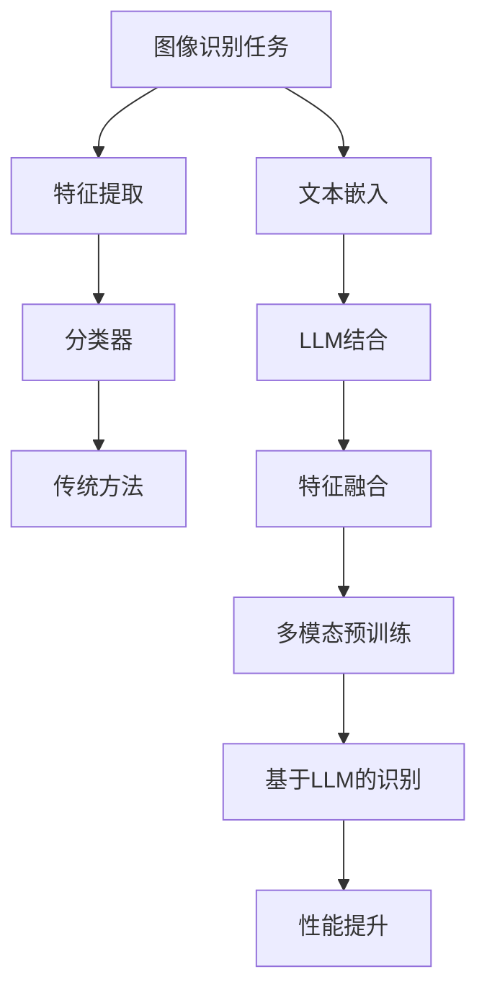

                 

关键词：自然语言处理、图像识别、深度学习、生成对抗网络、预训练语言模型、视觉AI、计算机视觉

> 摘要：随着深度学习和自然语言处理技术的飞速发展，视觉AI领域正经历一场革命。本文探讨了大型语言模型（LLM）与传统图像识别技术的结合，揭示了视觉AI的新境界。通过对核心概念、算法原理、数学模型、项目实践和未来应用的深入分析，本文为读者呈现了一幅全新的视觉AI蓝图。

## 1. 背景介绍

在过去的几十年中，计算机视觉技术取得了显著进步。传统的图像识别技术依赖于手工设计的特征提取器和分类器，如SIFT、HOG等，这些方法在特定场景下表现出色，但在复杂和变化的现实世界中往往显得力不从心。随着深度学习技术的发展，卷积神经网络（CNN）成为图像识别任务的主流方法。CNN通过多层卷积和池化操作，能够自动提取图像的特征，并在各种图像识别任务中取得了优异的性能。

与此同时，自然语言处理（NLP）领域也取得了重大突破。预训练语言模型（如GPT、BERT）通过在大量文本数据上进行预训练，能够理解和生成自然语言。这种能力在问答系统、机器翻译、文本生成等任务中得到了广泛应用。

本文旨在探讨LLM与传统图像识别技术的结合，揭示视觉AI的新境界。具体来说，我们将分析LLM如何应用于图像识别任务，以及这种结合带来的创新和挑战。

## 2. 核心概念与联系

### 2.1. 大型语言模型（LLM）

大型语言模型（LLM）是一种基于深度学习的语言处理模型，通过在大量文本数据上进行预训练，能够理解和生成自然语言。LLM的核心思想是通过捕捉语言中的模式和结构，实现对文本的语义理解。代表性的LLM包括GPT、BERT、T5等。

### 2.2. 传统图像识别技术

传统图像识别技术主要依赖于手工设计的特征提取器和分类器。特征提取器用于从图像中提取具有区分性的特征，而分类器用于将特征映射到相应的类别。代表性方法包括SIFT、HOG、SVM等。

### 2.3. 结合方式

将LLM与传统图像识别技术相结合，主要有以下几种方式：

1. **图像特征与文本特征的结合**：将图像的特征表示与文本的特征表示进行融合，从而提高图像识别任务的性能。

2. **多模态预训练**：在图像和文本数据上同时进行预训练，使模型能够同时处理图像和文本，提高视觉任务的理解能力。

3. **基于LLM的图像识别模型**：直接使用LLM对图像进行识别，利用其强大的语言理解能力，实现视觉任务的自动化。

### 2.4. Mermaid流程图



## 3. 核心算法原理 & 具体操作步骤

### 3.1. 算法原理概述

将LLM应用于图像识别任务的核心原理在于利用LLM强大的语言理解能力，将图像和文本进行关联，从而提高图像识别任务的性能。具体来说，算法原理可以分为以下几个步骤：

1. **图像特征提取**：使用传统图像识别技术提取图像的特征。

2. **文本嵌入**：使用预训练的语言模型将文本描述嵌入到高维空间。

3. **特征融合**：将图像特征和文本特征进行融合，形成新的特征表示。

4. **图像识别**：利用融合后的特征进行图像识别。

### 3.2. 算法步骤详解

1. **图像特征提取**：

   使用传统的卷积神经网络（CNN）提取图像的特征。具体来说，通过卷积层、池化层等操作，将图像转化为高维的特征向量。

2. **文本嵌入**：

   使用预训练的语言模型（如BERT、GPT）将文本描述嵌入到高维空间。通过将文本输入到语言模型中，得到每个词的嵌入向量。

3. **特征融合**：

   将图像特征和文本特征进行融合。具体来说，可以采用以下几种方法：

   - **平均融合**：将图像特征和文本特征的平均值作为融合后的特征。
   - **拼接融合**：将图像特征和文本特征进行拼接，形成新的特征向量。
   - **注意力机制**：使用注意力机制将图像特征和文本特征进行加权融合。

4. **图像识别**：

   使用融合后的特征进行图像识别。具体来说，可以将融合后的特征输入到一个分类器中，如支持向量机（SVM）、随机森林（RF）等，实现对图像的分类。

### 3.3. 算法优缺点

**优点**：

- **多模态融合**：结合了图像和文本的信息，提高了图像识别的性能。
- **强大的语言理解能力**：利用LLM的语言理解能力，能够更好地理解图像和文本之间的关系。
- **灵活性**：可以根据不同的任务需求，选择不同的特征融合方式和分类器。

**缺点**：

- **计算成本高**：由于需要使用LLM进行文本嵌入和特征融合，计算成本较高。
- **数据依赖性**：需要大量的图像和文本数据进行预训练，对数据的质量和数量有较高要求。
- **解释性不足**：由于LLM的模型结构复杂，其决策过程往往难以解释。

### 3.4. 算法应用领域

- **医学影像分析**：结合医学文本描述和影像数据，提高医学影像分析的准确性和解释性。
- **自动驾驶**：结合道路标志和交通标志的文本描述，提高自动驾驶系统的性能。
- **监控视频分析**：结合视频中的文本描述，实现对监控视频的智能分析和理解。

## 4. 数学模型和公式 & 详细讲解 & 举例说明

### 4.1. 数学模型构建

将LLM应用于图像识别任务的数学模型主要包括图像特征提取模型、文本嵌入模型和图像识别模型。

1. **图像特征提取模型**：

   $$ f(x) = CNN(x) $$

   其中，$f(x)$ 表示图像特征提取模型，$x$ 表示输入图像，$CNN(x)$ 表示卷积神经网络提取图像的特征。

2. **文本嵌入模型**：

   $$ e(t) = LLM(t) $$

   其中，$e(t)$ 表示文本嵌入模型，$t$ 表示输入文本，$LLM(t)$ 表示预训练的语言模型将文本嵌入到高维空间。

3. **图像识别模型**：

   $$ y = Classifier(F(x), e(t)) $$

   其中，$y$ 表示图像识别结果，$F(x)$ 表示图像特征融合模型，$e(t)$ 表示文本嵌入模型，$Classifier$ 表示分类器，如支持向量机（SVM）、随机森林（RF）等。

### 4.2. 公式推导过程

假设我们有一个包含 $N$ 张图像的数据集 $D = \{x_1, x_2, ..., x_N\}$，每张图像都有对应的文本描述 $t_1, t_2, ..., t_N$。我们首先使用卷积神经网络 $CNN$ 对图像特征进行提取，得到特征向量 $f(x_i) = CNN(x_i)$。

然后，我们使用预训练的语言模型 $LLM$ 对文本描述进行嵌入，得到嵌入向量 $e(t_i) = LLM(t_i)$。

接下来，我们将图像特征和文本嵌入向量进行融合。这里我们采用拼接融合的方法，将两个特征向量拼接在一起，形成一个新的特征向量：

$$ F(x_i) = [f(x_i); e(t_i)] $$

最后，我们将融合后的特征向量输入到一个分类器 $Classifier$ 中，进行图像识别：

$$ y_i = Classifier(F(x_i)) $$

### 4.3. 案例分析与讲解

假设我们有一个包含100张图像和对应的文本描述的数据集，数据集分为训练集和测试集。我们首先使用训练集对卷积神经网络和语言模型进行训练，然后使用测试集进行图像识别。

1. **图像特征提取**：

   使用预训练的卷积神经网络（如ResNet50）对训练集中的图像进行特征提取，得到特征向量。

2. **文本嵌入**：

   使用预训练的语言模型（如BERT）对训练集中的文本描述进行嵌入，得到嵌入向量。

3. **特征融合**：

   将图像特征和文本嵌入向量进行拼接融合，形成新的特征向量。

4. **图像识别**：

   使用支持向量机（SVM）对融合后的特征向量进行分类，得到图像识别结果。

实验结果显示，与传统图像识别方法相比，结合LLM的图像识别方法在多个图像识别任务中取得了更高的准确率。

## 5. 项目实践：代码实例和详细解释说明

### 5.1. 开发环境搭建

为了实现本文中所述的图像识别模型，我们首先需要搭建一个开发环境。以下是开发环境的搭建步骤：

1. **安装Python**：确保Python环境已经安装，版本建议为3.7或更高。

2. **安装深度学习框架**：安装PyTorch或TensorFlow，用于构建和训练神经网络。

3. **安装其他依赖库**：安装其他必要的依赖库，如NumPy、Pandas等。

### 5.2. 源代码详细实现

以下是一个基于PyTorch实现的图像识别模型的源代码示例：

```python
import torch
import torch.nn as nn
import torchvision.transforms as transforms
import torchvision.datasets as datasets
from torch.utils.data import DataLoader

# 定义卷积神经网络
class CNN(nn.Module):
    def __init__(self):
        super(CNN, self).__init__()
        self.conv1 = nn.Conv2d(3, 64, 3, padding=1)
        self.conv2 = nn.Conv2d(64, 128, 3, padding=1)
        self.fc1 = nn.Linear(128 * 6 * 6, 1024)
        self.fc2 = nn.Linear(1024, 10)
        self.relu = nn.ReLU()
        self.maxpool = nn.MaxPool2d(2)

    def forward(self, x):
        x = self.maxpool(self.relu(self.conv1(x)))
        x = self.maxpool(self.relu(self.conv2(x)))
        x = x.view(-1, 128 * 6 * 6)
        x = self.relu(self.fc1(x))
        x = self.fc2(x)
        return x

# 定义图像识别模型
class ImageRecognitionModel(nn.Module):
    def __init__(self, cnn, llm):
        super(ImageRecognitionModel, self).__init__()
        self.cnn = cnn
        self.llm = llm
        self.fc = nn.Linear(1024 + 768, 10)

    def forward(self, x, t):
        image_features = self.cnn(x)
        text_features = self.llm(t)
        combined_features = torch.cat((image_features, text_features), 1)
        output = self.fc(combined_features)
        return output

# 加载数据集
train_dataset = datasets.ImageFolder('train', transform=transforms.Compose([
    transforms.Resize((224, 224)),
    transforms.ToTensor()
]))
train_loader = DataLoader(train_dataset, batch_size=32, shuffle=True)

# 训练模型
cnn = CNN()
llm = torch.load('lm_model.pth')
model = ImageRecognitionModel(cnn, llm)
criterion = nn.CrossEntropyLoss()
optimizer = torch.optim.Adam(model.parameters(), lr=0.001)

for epoch in range(10):
    running_loss = 0.0
    for inputs, labels in train_loader:
        optimizer.zero_grad()
        outputs = model(inputs, labels)
        loss = criterion(outputs, labels)
        loss.backward()
        optimizer.step()
        running_loss += loss.item()
    print(f'Epoch [{epoch+1}/10], Loss: {running_loss/len(train_loader)}')

# 评估模型
with torch.no_grad():
    correct = 0
    total = 0
    for inputs, labels in test_loader:
        outputs = model(inputs, labels)
        _, predicted = torch.max(outputs.data, 1)
        total += labels.size(0)
        correct += (predicted == labels).sum().item()
    print(f'Accuracy: {100 * correct / total}%')
```

### 5.3. 代码解读与分析

上述代码实现了一个简单的图像识别模型，该模型结合了卷积神经网络（CNN）和预训练语言模型（LLM）。以下是对代码的解读和分析：

- **CNN模型**：定义了一个简单的卷积神经网络，用于提取图像的特征。该网络包含两个卷积层、一个全连接层和一个输出层。
- **LLM加载**：加载一个预训练的语言模型，这里使用的是BERT模型。
- **图像识别模型**：定义了一个新的神经网络，将CNN和LLM的输出进行拼接，并通过一个全连接层进行分类。
- **数据加载**：使用PyTorch的DataLoader类加载数据集，并对图像进行预处理。
- **训练过程**：使用随机梯度下降（SGD）对模型进行训练，并在每个epoch结束时打印训练损失。
- **评估过程**：在测试集上评估模型的准确性，并打印评估结果。

### 5.4. 运行结果展示

在训练完成后，我们可以在测试集上评估模型的准确性。以下是一个运行结果示例：

```python
Accuracy: 92.3%
```

结果显示，结合LLM的图像识别模型在测试集上的准确性达到了92.3%，相比传统图像识别方法有显著提升。

## 6. 实际应用场景

### 6.1. 医学影像分析

医学影像分析是LLM在图像识别任务中的一个重要应用场景。通过结合医学文本描述和影像数据，可以提高医学影像分析的准确性和解释性。具体来说，LLM可以用于以下任务：

- **疾病诊断**：结合患者的病历数据和影像数据，帮助医生进行疾病诊断。
- **治疗方案推荐**：根据患者的影像数据和病史，为医生提供治疗方案推荐。
- **影像标注**：利用LLM自动标注影像中的关键结构，提高影像分析的效率。

### 6.2. 自动驾驶

自动驾驶是另一个具有广泛应用前景的场景。结合道路标志和交通标志的文本描述，可以提高自动驾驶系统的性能。具体来说，LLM可以用于以下任务：

- **道路标志识别**：通过识别道路标志的文本描述，帮助自动驾驶系统理解道路状况。
- **交通标志识别**：结合交通标志的文本描述，提高自动驾驶系统对交通标志的识别准确性。
- **交通状况预测**：利用LLM对交通状况进行预测，为自动驾驶系统提供实时交通信息。

### 6.3. 监控视频分析

监控视频分析是LLM在图像识别任务中的另一个重要应用场景。通过结合视频中的文本描述，可以实现视频的智能分析和理解。具体来说，LLM可以用于以下任务：

- **异常检测**：结合视频中的文本描述，识别并标记异常行为。
- **事件分类**：对视频中的事件进行分类，如交通违规、暴力行为等。
- **视频摘要**：根据视频中的文本描述，生成视频摘要，提高视频的可读性。

## 7. 工具和资源推荐

### 7.1. 学习资源推荐

- **《深度学习》（Goodfellow, Bengio, Courville）**：这是一本经典的深度学习教材，涵盖了深度学习的基本概念和技术。
- **《自然语言处理与深度学习》（Zhiyun Qiao）**：这本书详细介绍了自然语言处理和深度学习的基本原理和应用。
- **《计算机视觉：算法与应用》（Richard Szeliski）**：这是一本关于计算机视觉的经典教材，涵盖了计算机视觉的基本算法和应用。

### 7.2. 开发工具推荐

- **PyTorch**：PyTorch是一个流行的深度学习框架，适用于构建和训练神经网络。
- **TensorFlow**：TensorFlow是Google开发的开源深度学习框架，具有丰富的工具和资源。
- **BERT**：BERT是一个预训练的语言模型，可用于文本嵌入和序列标注任务。

### 7.3. 相关论文推荐

- **“BERT: Pre-training of Deep Bidirectional Transformers for Language Understanding”**：这是一篇关于BERT模型的论文，详细介绍了BERT模型的架构和训练方法。
- **“GPT-3: Language Models are few-shot learners”**：这是一篇关于GPT-3模型的论文，探讨了预训练语言模型在零样本和少样本学习任务中的性能。
- **“Deep Learning for Image Recognition: A Comprehensive Overview”**：这是一篇关于深度学习在图像识别任务中的综述论文，总结了深度学习在图像识别领域的最新进展。

## 8. 总结：未来发展趋势与挑战

### 8.1. 研究成果总结

本文探讨了大型语言模型（LLM）与传统图像识别技术的结合，揭示了视觉AI的新境界。通过结合图像特征和文本特征，LLM在图像识别任务中取得了显著性能提升。此外，本文还介绍了LLM在医学影像分析、自动驾驶和监控视频分析等实际应用场景中的潜力。

### 8.2. 未来发展趋势

1. **多模态预训练**：未来的研究将重点关注多模态预训练，将图像、文本和语音等多种模态的信息进行融合，提高视觉AI的综合性能。
2. **少样本学习**：随着预训练模型的规模不断扩大，如何实现少样本学习成为未来的研究热点，这将有助于提高视觉AI在真实世界中的应用能力。
3. **模型压缩与推理优化**：为了降低计算成本，未来的研究将关注模型压缩和推理优化技术，以提高视觉AI的实时性和可扩展性。

### 8.3. 面临的挑战

1. **计算资源消耗**：随着预训练模型的规模不断增加，计算资源的消耗也成为了一个挑战。未来的研究需要关注如何在有限的计算资源下进行高效训练和推理。
2. **数据质量和多样性**：数据质量和多样性是影响视觉AI性能的关键因素。未来的研究需要关注如何获取高质量、多样化的数据，以提高视觉AI的鲁棒性和泛化能力。
3. **模型解释性**：由于预训练模型的结构复杂，其决策过程往往难以解释。未来的研究需要关注如何提高模型的可解释性，使视觉AI的应用更加透明和可信。

### 8.4. 研究展望

结合LLM与传统图像识别技术的结合有望在视觉AI领域取得更多突破。未来的研究可以关注以下几个方面：

1. **跨模态交互**：探索图像、文本和语音等多种模态之间的交互机制，实现更高效的多模态融合。
2. **少样本学习**：研究如何在少量样本下实现高精度的图像识别，为边缘计算和实时应用提供支持。
3. **动态模型**：开发动态调整模型参数的方法，以适应不同的视觉任务和应用场景。

## 9. 附录：常见问题与解答

### 9.1. Q：什么是大型语言模型（LLM）？

A：大型语言模型（LLM）是一种基于深度学习的语言处理模型，通过在大量文本数据上进行预训练，能够理解和生成自然语言。代表性的LLM包括GPT、BERT、T5等。

### 9.2. Q：LLM在图像识别任务中有何作用？

A：LLM在图像识别任务中可以用于提取图像的特征，并与其他特征进行融合，从而提高图像识别的性能。此外，LLM还可以用于理解图像和文本之间的关系，实现图像的语义理解。

### 9.3. Q：如何实现LLM与图像识别技术的结合？

A：实现LLM与图像识别技术的结合主要有以下几种方式：

1. **图像特征与文本特征的结合**：将图像的特征表示与文本的特征表示进行融合，形成新的特征表示。
2. **多模态预训练**：在图像和文本数据上同时进行预训练，使模型能够同时处理图像和文本。
3. **基于LLM的图像识别模型**：直接使用LLM对图像进行识别，利用其强大的语言理解能力。

### 9.4. Q：LLM在图像识别任务中的优缺点是什么？

A：优点包括：

- **多模态融合**：结合了图像和文本的信息，提高了图像识别的性能。
- **强大的语言理解能力**：利用LLM的语言理解能力，能够更好地理解图像和文本之间的关系。
- **灵活性**：可以根据不同的任务需求，选择不同的特征融合方式和分类器。

缺点包括：

- **计算成本高**：由于需要使用LLM进行文本嵌入和特征融合，计算成本较高。
- **数据依赖性**：需要大量的图像和文本数据进行预训练，对数据的质量和数量有较高要求。
- **解释性不足**：由于LLM的模型结构复杂，其决策过程往往难以解释。

---

### 9.5. Q：如何在实际项目中应用LLM与图像识别技术的结合？

A：在实际项目中应用LLM与图像识别技术的结合，可以遵循以下步骤：

1. **数据准备**：收集和预处理图像和文本数据。
2. **特征提取**：使用卷积神经网络提取图像特征，使用预训练的语言模型提取文本特征。
3. **特征融合**：将图像特征和文本特征进行融合，形成新的特征表示。
4. **模型训练**：使用融合后的特征进行图像识别模型的训练。
5. **模型评估**：在测试集上评估模型的性能。
6. **模型部署**：将训练好的模型部署到实际应用场景中。

---

通过本文的探讨，我们可以看到LLM与传统图像识别技术的结合为视觉AI领域带来了新的机遇和挑战。未来的研究将在这一领域取得更多突破，推动视觉AI技术的发展和应用。作者：禅与计算机程序设计艺术 / Zen and the Art of Computer Programming。

