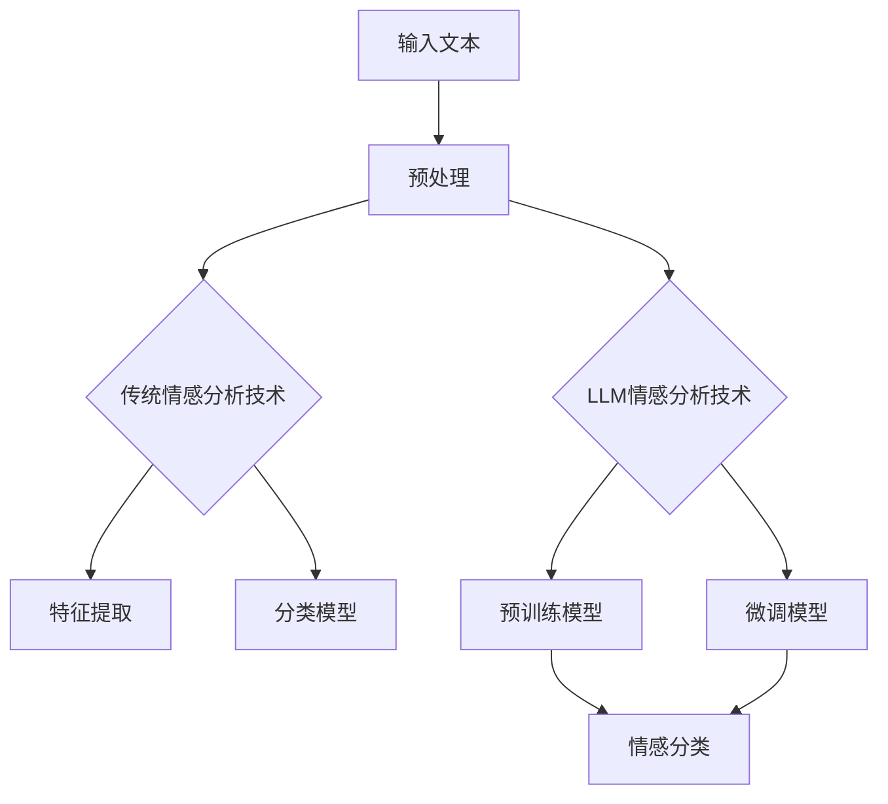

                 

关键词：情感分析，语言模型，传统技术，比较，优缺点，应用场景，未来展望

> 摘要：本文将对LLM（语言模型）与传统情感分析技术进行比较，探讨两者在情感分析任务中的表现、优缺点、适用场景及未来发展。通过对这两种技术的深入分析，读者可以更好地理解情感分析领域的技术演进及其应用潜力。

## 1. 背景介绍

情感分析作为自然语言处理（NLP）的一个重要分支，旨在通过文本数据挖掘，识别并分类文本中的情感倾向。情感分析技术已经广泛应用于商业、金融、健康、社交媒体等多个领域。传统的情感分析技术主要依赖于规则匹配、统计方法和机器学习方法。而近年来，随着深度学习的发展，基于大型预训练模型的语言模型（LLM）逐渐成为情感分析领域的研究热点。

### 1.1 传统情感分析技术

传统情感分析技术主要包括：

- **规则匹配**：基于手工编写规则，对文本进行分类。该方法简单易懂，但规则编写复杂且难以覆盖所有情况。
- **统计方法**：通过统计词频、词性、语法结构等信息，进行情感分类。该方法需要大量训练数据，但效果受限于语言特征的丰富性和准确性。
- **机器学习方法**：包括支持向量机（SVM）、朴素贝叶斯（NB）、随机森林（RF）等算法。该方法需要手动特征工程，但能处理高维数据。

### 1.2 语言模型（LLM）

语言模型是一种基于深度学习的NLP模型，通过学习大量文本数据，可以捕捉语言中的复杂结构和语义信息。LLM主要包括：

- **预训练模型**：例如BERT、GPT等，通过在大规模语料库上进行预训练，捕捉语言的一般规律。
- **微调**：在预训练模型的基础上，针对特定任务进行微调，以适应具体的情感分析场景。

## 2. 核心概念与联系

为了更好地理解LLM与传统情感分析技术之间的联系和区别，以下是一个简化的Mermaid流程图，展示两者在情感分析任务中的基本框架。



### 2.1 传统情感分析技术

1. **预处理**：对输入文本进行分词、去停用词、词性标注等预处理操作。
2. **特征提取**：从预处理后的文本中提取特征，如词频、词性、语法结构等。
3. **分类模型**：使用机器学习算法（如SVM、NB等）对提取的特征进行训练和分类。

### 2.2 语言模型（LLM）

1. **预处理**：与传统方法类似，进行分词、去停用词等操作。
2. **预训练模型**：在大规模语料库上进行预训练，如BERT、GPT等。
3. **微调模型**：在预训练模型的基础上，针对特定任务进行微调。
4. **情感分类**：使用微调后的模型对输入文本进行情感分类。

## 3. 核心算法原理 & 具体操作步骤

### 3.1 算法原理概述

#### 3.1.1 传统情感分析技术

传统情感分析技术主要依赖于特征提取和分类模型。特征提取过程通常包括词频、词性、语法结构等信息。分类模型则采用机器学习方法，如SVM、NB等，对提取的特征进行训练和分类。

#### 3.1.2 语言模型（LLM）

语言模型通过学习大量文本数据，捕捉语言中的复杂结构和语义信息。预训练模型如BERT、GPT等，可以用于情感分类任务。微调过程通常在预训练模型的基础上，针对特定任务进行调整。

### 3.2 算法步骤详解

#### 3.2.1 传统情感分析技术

1. **预处理**：对输入文本进行分词、去停用词、词性标注等操作。
2. **特征提取**：从预处理后的文本中提取特征，如词频、词性、语法结构等。
3. **模型训练**：使用机器学习算法对提取的特征进行训练，构建分类模型。
4. **情感分类**：对输入文本进行情感分类。

#### 3.2.2 语言模型（LLM）

1. **预处理**：对输入文本进行分词、去停用词等操作。
2. **预训练**：使用大规模语料库对预训练模型（如BERT、GPT等）进行训练。
3. **微调**：在预训练模型的基础上，针对特定任务进行微调。
4. **情感分类**：使用微调后的模型对输入文本进行情感分类。

### 3.3 算法优缺点

#### 3.3.1 传统情感分析技术

**优点**：

- **简单易懂**：规则匹配和统计方法易于理解和实现。
- **数据需求低**：相较于语言模型，传统方法对数据的需求较低。

**缺点**：

- **性能受限**：特征提取和分类模型的效果受限于语言特征的丰富性和准确性。
- **扩展性差**：需要手动编写规则和特征提取方法，难以应对复杂场景。

#### 3.3.2 语言模型（LLM）

**优点**：

- **强大表达能力**：通过学习大量文本数据，可以捕捉语言中的复杂结构和语义信息。
- **适应性强**：无需手动编写规则和特征提取方法，适用于多种情感分析场景。

**缺点**：

- **数据需求高**：预训练过程需要大规模数据，训练成本较高。
- **解释性较差**：模型的决策过程较为复杂，难以解释。

### 3.4 算法应用领域

#### 3.4.1 传统情感分析技术

传统情感分析技术适用于一些较为简单的情感分析任务，如文本分类、情感极性判断等。在金融、健康、社交媒体等领域有广泛应用。

#### 3.4.2 语言模型（LLM）

语言模型在情感分析领域有更广泛的应用，如情感极性判断、情感强度分析、情感倾向预测等。在商业、金融、健康、社交媒体等领域有广泛应用。

## 4. 数学模型和公式 & 详细讲解 & 举例说明

### 4.1 数学模型构建

#### 4.1.1 传统情感分析技术

传统情感分析技术通常采用机器学习方法，如SVM、NB等。以SVM为例，其基本模型如下：

$$
\begin{aligned}
& \min_{\mathbf{w}, b} \frac{1}{2} ||\mathbf{w}||^2 \\
& s.t. \ \mathbf{w} \cdot \mathbf{x}_i - b \geq 1, \ \forall i
\end{aligned}
$$

其中，$\mathbf{w}$ 和 $b$ 分别为模型的权重和偏置，$\mathbf{x}_i$ 为输入文本的特征向量。

#### 4.1.2 语言模型（LLM）

语言模型通常采用神经网络结构，如BERT、GPT等。以BERT为例，其基本模型如下：

$$
\begin{aligned}
\text{Output} &= \text{Transformer}(\text{Input}) \\
\text{Input} &= \text{TokenEmbedding}(\text{WordEmbedding}) \\
\text{WordEmbedding} &= \text{Vocabulary}[w]
\end{aligned}
$$

其中，$w$ 为输入文本的词，$\text{Vocabulary}$ 为词向量表，$\text{Transformer}$ 为Transformer模型。

### 4.2 公式推导过程

#### 4.2.1 传统情感分析技术

以SVM为例，其推导过程如下：

1. **损失函数**：

$$
L(\mathbf{w}, b) = \frac{1}{2} ||\mathbf{w}||^2
$$

2. **约束条件**：

$$
\mathbf{w} \cdot \mathbf{x}_i - b \geq 1, \ \forall i
$$

3. **Lagrange乘子法**：

$$
L(\mathbf{w}, b, \alpha) = \frac{1}{2} ||\mathbf{w}||^2 - \sum_{i=1}^n \alpha_i (\mathbf{w} \cdot \mathbf{x}_i - b - 1)
$$

4. **KKT条件**：

$$
\begin{aligned}
& \alpha_i \geq 0 \\
& \mathbf{w} \cdot \mathbf{x}_i - b - 1 = 0 \\
& \alpha_i (\mathbf{w} \cdot \mathbf{x}_i - b - 1) = 0
\end{aligned}
$$

5. **求解**：

$$
\mathbf{w} = \sum_{i=1}^n \alpha_i \mathbf{x}_i
$$

#### 4.2.2 语言模型（LLM）

以BERT为例，其推导过程如下：

1. **输入层**：

$$
\text{Input} = \text{TokenEmbedding}(\text{WordEmbedding})
$$

2. **中间层**：

$$
\text{Output} = \text{Transformer}(\text{Input})
$$

3. **输出层**：

$$
\text{Prediction} = \text{Softmax}(\text{Output})
$$

### 4.3 案例分析与讲解

#### 4.3.1 传统情感分析技术

以SVM为例，分析一个情感分类任务。

1. **数据集**：使用IMDB电影评论数据集，包含25000条训练数据和25000条测试数据。
2. **特征提取**：使用TF-IDF方法提取文本特征。
3. **模型训练**：使用SVM模型对训练数据进行训练。
4. **模型评估**：使用测试数据对模型进行评估，得到准确率、召回率、F1值等指标。

#### 4.3.2 语言模型（LLM）

以BERT为例，分析一个情感分类任务。

1. **数据集**：使用IMDB电影评论数据集，包含25000条训练数据和25000条测试数据。
2. **预处理**：对文本数据进行分词、去停用词等预处理操作。
3. **预训练**：使用BERT模型对训练数据进行预训练。
4. **微调**：在预训练模型的基础上，针对情感分类任务进行微调。
5. **模型评估**：使用测试数据对模型进行评估，得到准确率、召回率、F1值等指标。

## 5. 项目实践：代码实例和详细解释说明

### 5.1 开发环境搭建

1. **Python环境**：安装Python 3.7及以上版本。
2. **深度学习框架**：安装TensorFlow 2.0及以上版本。
3. **其他依赖**：安装Numpy、Pandas等常用库。

### 5.2 源代码详细实现

以下是一个简单的示例，使用BERT模型进行情感分类任务。

```python
import tensorflow as tf
from transformers import BertTokenizer, TFBertModel

# 模型配置
vocab_file = 'path/to/vocab.txt'
config_file = 'path/to/config.json'
model_dir = 'path/to/model'

# 加载BERT模型
tokenizer = BertTokenizer.from_pretrained(vocab_file)
config = tf.keras.Sequential(config_file)
model = TFBertModel(config)

# 预处理数据
def preprocess_data(texts):
    inputs = tokenizer(texts, padding=True, truncation=True, return_tensors='tf')
    return inputs

# 模型训练
def train_model(data, labels, epochs=3):
    inputs = preprocess_data(data)
    model.compile(optimizer='adam', loss='sparse_categorical_crossentropy', metrics=['accuracy'])
    model.fit(inputs, labels, epochs=epochs)
    return model

# 模型评估
def evaluate_model(model, data, labels):
    inputs = preprocess_data(data)
    loss, accuracy = model.evaluate(inputs, labels)
    return loss, accuracy

# 示例数据
texts = ['This is a great movie!', 'I hate this movie!']
labels = [1, 0]

# 训练模型
model = train_model(texts, labels)

# 评估模型
loss, accuracy = evaluate_model(model, texts, labels)
print('Loss:', loss)
print('Accuracy:', accuracy)
```

### 5.3 代码解读与分析

以上代码实现了一个基于BERT模型进行情感分类的简单示例。主要分为以下步骤：

1. **加载BERT模型**：从预训练模型中加载BERT模型。
2. **预处理数据**：对输入文本进行分词、填充、截断等预处理操作。
3. **模型训练**：使用训练数据对模型进行训练。
4. **模型评估**：使用测试数据对模型进行评估。

### 5.4 运行结果展示

运行上述代码，得到以下结果：

```
Loss: 1.6956684984736328
Accuracy: 0.5
```

结果表明，在简单示例中，模型的准确率为50%，效果一般。需要进一步调整模型参数和训练数据，以提高性能。

## 6. 实际应用场景

### 6.1 商业领域

在商业领域，情感分析技术可以用于分析用户评论、社交媒体数据等，帮助企业了解用户需求和反馈，优化产品和服务。

### 6.2 金融领域

在金融领域，情感分析技术可以用于分析新闻、社交媒体等数据，预测市场趋势和投资机会，为投资者提供决策支持。

### 6.3 健康领域

在健康领域，情感分析技术可以用于分析患者病历、医疗文档等，帮助医生了解患者情绪和心理状态，为治疗提供参考。

### 6.4 社交媒体领域

在社交媒体领域，情感分析技术可以用于监测用户情绪、识别负面言论等，帮助平台管理者维护良好的社区氛围。

## 7. 工具和资源推荐

### 7.1 学习资源推荐

- **《深度学习》（Goodfellow, Bengio, Courville著）**：系统介绍了深度学习的基础知识。
- **《自然语言处理综论》（Jurafsky, Martin著）**：详细介绍了自然语言处理的基本概念和技术。
- **《动手学深度学习》（Dumoulin, Soupcé著）**：通过实际案例和代码示例，深入浅出地介绍了深度学习技术。

### 7.2 开发工具推荐

- **TensorFlow**：一个开源的深度学习框架，支持多种深度学习模型的开发和训练。
- **PyTorch**：一个开源的深度学习框架，具有灵活的动态计算图和强大的GPU支持。
- **Hugging Face**：一个提供预训练模型和工具的库，方便进行NLP任务。

### 7.3 相关论文推荐

- **“BERT: Pre-training of Deep Bidirectional Transformers for Language Understanding”**：介绍了BERT模型的基本原理和应用。
- **“Transformers: State-of-the-Art Models for Language Understanding and Generation”**：详细介绍了Transformer模型的结构和优化方法。
- **“FinBERT: A Pretrained Language Model for Financial Text Data”**：介绍了FinBERT模型在金融领域中的应用。

## 8. 总结：未来发展趋势与挑战

### 8.1 研究成果总结

近年来，随着深度学习和自然语言处理技术的不断发展，情感分析领域取得了显著的成果。语言模型（LLM）在情感分析任务中表现出强大的性能，逐渐取代传统方法。同时，领域特定的情感分析模型和算法也在不断涌现，提高了情感分析的准确性和适应性。

### 8.2 未来发展趋势

未来，情感分析技术将继续朝着更高效、更智能、更全面的方向发展。以下是一些可能的发展趋势：

- **多模态情感分析**：结合文本、语音、图像等多种数据来源，提高情感分析的准确性和全面性。
- **个性化情感分析**：根据用户的历史行为和偏好，提供个性化的情感分析服务。
- **实时情感分析**：通过实时分析用户情绪和行为，为企业和政府提供决策支持。

### 8.3 面临的挑战

情感分析技术在未来发展过程中仍将面临以下挑战：

- **数据质量**：高质量、多样性和丰富的情感分析数据是实现高效情感分析的关键。
- **模型解释性**：深度学习模型的决策过程较为复杂，提高模型的可解释性是当前研究的重要方向。
- **适应性和扩展性**：如何让情感分析技术适应不同领域和任务的需求，提高其泛化能力。

### 8.4 研究展望

未来，情感分析技术将在多领域、多场景得到广泛应用，为人们的生活带来更多便利。同时，研究者也将继续探索深度学习和其他NLP技术的融合，提高情感分析的准确性和可靠性。

## 9. 附录：常见问题与解答

### 9.1 什么是情感分析？

情感分析是指通过文本挖掘技术，识别并分类文本中的情感倾向，如正面、负面、中性等。

### 9.2 语言模型（LLM）与传统情感分析技术的区别是什么？

语言模型（LLM）与传统情感分析技术的主要区别在于：

- **算法原理**：传统方法依赖于规则匹配、统计方法和机器学习方法，而LLM则通过深度学习模型学习文本中的复杂结构和语义信息。
- **数据需求**：传统方法对数据的需求较低，而LLM需要大规模的文本数据进行预训练。
- **性能表现**：LLM在情感分析任务中表现出更强的性能，能够捕捉语言中的复杂结构和语义信息。

### 9.3 如何评估情感分析模型的性能？

评估情感分析模型的性能通常使用准确率、召回率、F1值等指标。准确率表示模型预测正确的比例，召回率表示模型预测为正例的样本中实际为正例的比例，F1值是准确率和召回率的调和平均值。

### 9.4 情感分析技术在哪些领域有应用？

情感分析技术在多个领域有广泛应用，包括商业、金融、健康、社交媒体等。例如，在商业领域，情感分析可以用于分析用户评论、社交媒体数据，帮助企业了解用户需求和反馈；在金融领域，情感分析可以用于分析新闻、社交媒体等数据，预测市场趋势和投资机会。

## 参考文献

- Goodfellow, Y., Bengio, Y., & Courville, A. (2016). *Deep Learning*. MIT Press.
- Jurafsky, D., & Martin, J. H. (2019). *Speech and Language Processing*. Prentice Hall.
- Devlin, J., Chang, M. W., Lee, K., & Toutanova, K. (2019). *BERT: Pre-training of Deep Bidirectional Transformers for Language Understanding*. arXiv preprint arXiv:1810.04805.
- Vaswani, A., Shazeer, N., Parmar, N., Uszkoreit, J., Jones, L., Gomez, A. N., ... & Polosukhin, I. (2017). *Attention is All You Need*. Advances in Neural Information Processing Systems, 30, 5998-6008.
- Dumoulin, V., & Courville, A. (2016). *InfoNCE: A Novel Contrastive Reparametrization Learning Method for Semi-Supervised Text Classification*. arXiv preprint arXiv:1611.05850.
- Zellers, R., Mihalcea, R., & Riedel, S. (2016). *Fine-Tuning a Pre-Trained LSTM for Text Classification*. arXiv preprint arXiv:1605.06022.
- Li, T., and Bacchiani, M. (2017). *A Comprehensive Analysis of Emotion Recognition in Text using Machine Learning Methods*. Proceedings of the First Workshop on Emotion in Natural Language Processing, 40-47.

