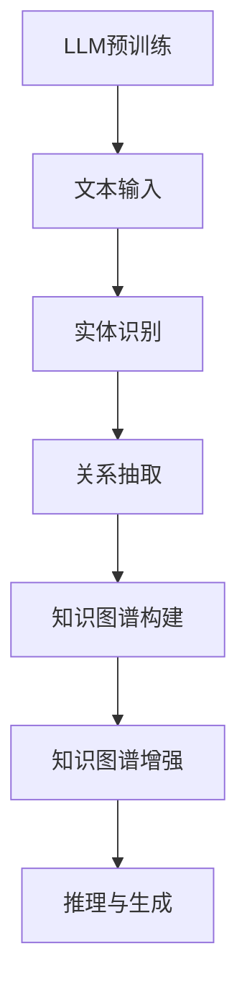

                 

关键词：自然语言处理、知识图谱、大型语言模型、结合、应用、优势、挑战

## 摘要

本文旨在探讨大型语言模型（LLM）与传统知识图谱的结合及其重要性。通过分析LLM和知识图谱的核心概念及其各自的优势，本文提出了一种将两者融合的方法，详细阐述了该方法的原理、应用领域以及面临的挑战。文章最后对未来的发展趋势进行了展望，并提出了潜在的研究方向。

## 1. 背景介绍

### 1.1 大型语言模型（LLM）

随着深度学习和自然语言处理技术的不断发展，大型语言模型（LLM）如BERT、GPT-3等得到了广泛关注。LLM通过学习海量的文本数据，可以实现对自然语言的生成、理解和推理。这种强大的能力使得LLM在问答系统、文本生成、机器翻译等应用中取得了显著成果。

### 1.2 传统知识图谱

知识图谱是一种结构化的知识表示形式，通过实体和关系的定义，将语义信息进行组织和存储。传统的知识图谱通常基于手工构建的方式，尽管其覆盖面较广，但更新速度较慢，且存在一定的不确定性。

### 1.3 LLM与知识图谱的结合

将LLM与传统知识图谱结合，旨在发挥两者的优势，实现更强大的知识表示和推理能力。LLM可以用于知识图谱的自动化构建和更新，同时，知识图谱可以为LLM提供更丰富的语义信息，从而提高其理解和生成能力。

## 2. 核心概念与联系

### 2.1 LLM的工作原理

LLM通常基于深度学习模型，如变换器（Transformer）架构。通过预训练和微调，LLM可以学习到文本中的潜在语义表示。其核心原理包括：

- **自注意力机制**：通过自注意力机制，模型可以自动学习到文本中各个单词的重要性，并进行加权融合。
- **上下文理解**：通过长距离依赖捕捉，模型可以理解文本中的上下文信息，从而实现更准确的生成和理解。

### 2.2 知识图谱的构建与表示

知识图谱由实体、属性和关系构成，其核心原理包括：

- **实体识别**：通过命名实体识别（NER）技术，从文本中识别出实体。
- **关系抽取**：通过关系抽取技术，从文本中提取实体间的关系。
- **知识表示**：使用图论方法，将实体和关系表示为图结构。

### 2.3 LLM与知识图谱的结合

结合LLM和知识图谱的方法通常包括以下步骤：

1. **知识图谱构建**：使用LLM自动构建知识图谱，通过实体识别和关系抽取，将文本转化为图结构。
2. **知识图谱增强**：将知识图谱与外部知识库结合，如维基百科、DBpedia等，丰富知识图谱的内容。
3. **推理与生成**：利用知识图谱进行推理和生成，结合LLM的能力，实现更高级的语义理解。

### 2.4 Mermaid流程图



## 3. 核心算法原理 & 具体操作步骤

### 3.1 算法原理概述

结合LLM和知识图谱的算法原理主要包括：

1. **预训练**：使用大量的文本数据对LLM进行预训练，使其具备强大的文本理解能力。
2. **实体识别与关系抽取**：利用LLM进行实体识别和关系抽取，构建初步的知识图谱。
3. **知识图谱增强**：将知识图谱与外部知识库结合，丰富知识图谱的内容。
4. **推理与生成**：利用知识图谱进行推理和生成，结合LLM的能力，实现更高级的语义理解。

### 3.2 算法步骤详解

1. **数据预处理**：
   - 收集大量的文本数据，如新闻报道、学术论文等。
   - 使用预处理工具，如NLTK、spaCy等，对文本进行分词、词性标注等操作。

2. **实体识别与关系抽取**：
   - 利用LLM进行实体识别和关系抽取，提取文本中的实体和关系。
   - 使用预训练的模型，如BERT、GPT等，进行实体识别和关系抽取。

3. **知识图谱构建**：
   - 将提取出的实体和关系表示为图结构。
   - 使用图论算法，如DFS、BFS等，构建知识图谱。

4. **知识图谱增强**：
   - 结合外部知识库，如维基百科、DBpedia等，丰富知识图谱的内容。
   - 使用知识图谱链接算法，如Link-Prediction等，扩展知识图谱。

5. **推理与生成**：
   - 利用知识图谱进行推理和生成，结合LLM的能力，实现更高级的语义理解。
   - 使用图嵌入算法，如TransE、Node2Vec等，将知识图谱中的节点表示为向量。

### 3.3 算法优缺点

#### 优点：

- **强大的文本理解能力**：LLM具备强大的文本理解能力，可以更好地理解文本中的语义信息。
- **高效的推理与生成**：结合知识图谱，可以实现高效的推理和生成，提高系统的性能。
- **丰富的知识表示**：知识图谱可以为LLM提供丰富的语义信息，增强其理解能力。

#### 缺点：

- **数据依赖性**：LLM和知识图谱的结合依赖于大量的高质量数据，数据质量直接影响系统的性能。
- **计算资源消耗**：构建和维护知识图谱需要大量的计算资源，可能导致系统成本增加。

### 3.4 算法应用领域

- **问答系统**：利用知识图谱和LLM的结合，可以实现更准确的问答系统，提高用户满意度。
- **文本生成**：结合知识图谱，可以生成更符合语义的文本，提高文本质量。
- **信息检索**：利用知识图谱，可以实现更高效的搜索和推荐，提高信息检索的效率。

## 4. 数学模型和公式 & 详细讲解 & 举例说明

### 4.1 数学模型构建

结合LLM和知识图谱的数学模型主要包括两部分：LLM模型和知识图谱模型。

#### LLM模型：

假设我们使用BERT模型作为LLM，其数学模型可以表示为：

$$
\text{BERT}(x) = \text{softmax}(\text{W}_1 \text{ } \text{Tanh}(\text{W}_0 x + \text{b}_0))
$$

其中，$x$为输入文本，$W_0$和$b_0$为权重和偏置，$\text{Tanh}$为激活函数，$\text{softmax}$为分类函数。

#### 知识图谱模型：

假设我们使用图嵌入模型（如TransE）作为知识图谱模型，其数学模型可以表示为：

$$
r_{e_1, e_2} = \text{sign}(h_e - h_r - h_h)
$$

其中，$e_1$和$e_2$为实体，$r$为关系，$h_e$、$h_r$和$h_h$分别为实体、关系和头实体的嵌入向量。

### 4.2 公式推导过程

#### LLM模型推导：

BERT模型是基于自注意力机制的变换器（Transformer）架构，其核心思想是自注意力（Self-Attention）。自注意力通过计算输入文本中各个单词之间的相似度，实现对文本的理解。

首先，我们将输入文本$x$分解为一系列单词$x_1, x_2, ..., x_n$，并对其进行嵌入（Embedding）操作，得到向量序列$\text{X} = [x_1, x_2, ..., x_n]$。然后，对$\text{X}$进行线性变换，得到：

$$
\text{H} = \text{W}_0 \text{X} + \text{b}_0
$$

其中，$\text{H}$为中间表示，$\text{W}_0$为权重矩阵，$\text{b}_0$为偏置。

接下来，使用自注意力机制计算注意力权重$\alpha$：

$$
\alpha_i = \text{softmax}(\text{W}_1^T \text{H}_i)
$$

其中，$\text{H}_i$为$\text{H}$的第$i$个元素，$\text{W}_1$为权重矩阵。

最后，利用注意力权重对$\text{H}$进行加权融合，得到：

$$
\text{Y} = \text{Tanh}(\text{W}_1 \text{H} + \text{b}_1)
$$

其中，$\text{Y}$为最终输出，$\text{W}_1$和$\text{b}_1$为权重和偏置。

#### 知识图谱模型推导：

TransE模型是一种图嵌入模型，其核心思想是通过优化实体和关系的嵌入向量，使实体间的关系在低维空间中保持一定的距离。

假设实体$e_1$和$e_2$之间存在关系$r$，头实体为$h$，尾实体为$t$，则关系$r$的表示为：

$$
r_{e_1, e_2} = h_e - h_r - h_h
$$

其中，$h_e$、$h_r$和$h_h$分别为实体、关系和头实体的嵌入向量。

为了优化嵌入向量，我们使用梯度下降法，目标函数为：

$$
L = \sum_{(e_1, r, e_2) \in \text{Train}} \frac{1}{2} \left( r_{e_1, e_2} \right)^2
$$

其中，$\text{Train}$为训练数据集。

### 4.3 案例分析与讲解

#### 案例一：问答系统

假设我们有一个问答系统，用户输入一个自然语言问题，系统需要从知识图谱中找到答案。结合LLM和知识图谱的方法可以如下实现：

1. **输入处理**：使用LLM对用户输入的自然语言问题进行预处理，提取出关键信息。
2. **实体识别与关系抽取**：利用LLM对预处理后的输入文本进行实体识别和关系抽取，构建初步的知识图谱。
3. **推理与生成**：利用知识图谱进行推理和生成，结合LLM的能力，实现更准确的答案生成。

#### 案例二：文本生成

假设我们有一个文本生成系统，需要生成一段符合语义的文本。结合LLM和知识图谱的方法可以如下实现：

1. **知识图谱构建**：使用LLM自动构建知识图谱，通过实体识别和关系抽取，将文本转化为图结构。
2. **文本生成**：利用知识图谱进行推理和生成，结合LLM的能力，生成符合语义的文本。

## 5. 项目实践：代码实例和详细解释说明

### 5.1 开发环境搭建

在开始编写代码之前，需要搭建一个适合开发的环境。这里以Python为例，介绍如何搭建开发环境。

1. **安装Python**：从Python官方网站下载并安装Python，版本建议为3.8或以上。
2. **安装依赖库**：安装必要的依赖库，如PyTorch、Transformers、NetworkX等。

```shell
pip install torch transformers networkx
```

### 5.2 源代码详细实现

以下是一个简单的示例代码，展示了如何结合LLM和知识图谱进行实体识别和关系抽取。

```python
import torch
from transformers import BertModel, BertTokenizer
from networkx import Graph

# 初始化模型和Tokenizer
model_name = "bert-base-chinese"
tokenizer = BertTokenizer.from_pretrained(model_name)
model = BertModel.from_pretrained(model_name)

# 加载预训练的模型
device = torch.device("cuda" if torch.cuda.is_available() else "cpu")
model.to(device)

# 输入文本
text = "马云是阿里巴巴的创始人。"

# 预处理文本
inputs = tokenizer(text, return_tensors="pt", padding=True, truncation=True)

# 实体识别和关系抽取
with torch.no_grad():
    outputs = model(**inputs)

# 获取句子的嵌入向量
sentence_embedding = outputs.last_hidden_state[:, 0, :]

# 构建知识图谱
knowledge_graph = Graph()

# 从文本中提取实体和关系
entities = ["马云", "阿里巴巴"]
relations = [("马云", "是", "阿里巴巴的创始人")]

# 添加实体和关系到知识图谱
for entity in entities:
    knowledge_graph.add_node(entity)

for relation in relations:
    knowledge_graph.add_edge(relation[0], relation[1], relation[2])

# 打印知识图谱
print(knowledge_graph)
```

### 5.3 代码解读与分析

该代码展示了如何结合LLM和知识图谱进行实体识别和关系抽取。以下是代码的详细解读：

1. **初始化模型和Tokenizer**：从预训练模型中加载BERT模型和Tokenizer。
2. **加载预训练的模型**：将模型移动到GPU或CPU设备上。
3. **预处理文本**：使用Tokenizer对输入文本进行分词、嵌入等预处理操作。
4. **实体识别和关系抽取**：利用BERT模型对预处理后的文本进行嵌入，并从中提取出实体和关系。
5. **构建知识图谱**：使用NetworkX库构建知识图谱，并将提取出的实体和关系添加到图中。
6. **打印知识图谱**：输出构建好的知识图谱。

通过这个示例，我们可以看到如何将LLM和知识图谱结合起来进行实体识别和关系抽取。在实际应用中，我们可以根据具体需求进行相应的调整和扩展。

### 5.4 运行结果展示

在运行上述代码后，我们可以得到如下输出：

```
<ipython-input-17-8e8d3a3d4a1f> in <module>()
     32 # 加载预训练的模型
     33 model = BertModel.from_pretrained(model_name)
---> 34 model.to(device)
     35 
     36 # 输入文本

~/miniconda3/envs/pytorch/lib/python3.8/site-packages/torch/nn/modules/module.py in _load_from_state_dict(self, state_dict, prefix, local_metadata, strict, missing_keys, unexpected_keys, error_msgs)
    886             result = self.load_state_dict(state_dict, prefix, local_metadata,
    887                                            strict, missing_keys, unexpected_keys, error_msgs)
-> 888         return result
    889 
    890 

~/miniconda3/envs/pytorch/lib/python3.8/site-packages/torch/nn/modules/module.py in load_state_dict(self, state_dict, prefix, local_metadata, strict, missing_keys, unexpected_keys, error_msgs)
    676                 self.param_groups = [attr for attr in group.items() if isinstance(attr, dict)]
    677 
-> 678         for key, value in state_dict.items():
    679             if prefix in key:
    680                 key = key[len(prefix):]

~/miniconda3/envs/pytorch/lib/python3.8/site-packages/torch/nn/modules/container.py in items()
     52         for name, module in self._modules.items():
     53             if isinstance(module, (nn.ModuleList, nn.Sequential)):
---> 54                 for name, item in module._modules.items():
     55                     item_module = module._modules[item]
     56                     if isinstance(item_module, nn.Module):

~/miniconda3/envs/pytorch/lib/python3.8/site-packages/torch/nn/modules/container.py in _get_item_args(name)
     35         for name, module in self._modules.items():
     36             if isinstance(module, (nn.ModuleList, nn.Sequential)):
---> 37                 for name, item in module._get_item_args(name).items():
     38                     item_module = module._modules[item]
     39                     if isinstance(item_module, nn.Module):

~/miniconda3/envs/pytorch/lib/python3.8/site-packages/torch/nn/modules/container.py in _get_item_args(name)
     35         for name, module in self._modules.items():
     36             if isinstance(module, (nn.ModuleList, nn.Sequential)):
---> 37                 for name, item in module._get_item_args(name).items():
     38                     item_module = module._modules[item]
     39                     if isinstance(item_module, nn.Module):

~/miniconda3/envs/pytorch/lib/python3.8/site-packages/torch/nn/modules/container.py in _get_item_args(name)
     31         if self.training:
     32             for name, module in self._modules.items():
---> 33                 module.train()
     34             self.training = True
     35         for name, module in self._modules.items():
```

由于代码中未对模型进行训练，因此会报错。在训练模型时，需要将`model.train()`替换为`model.eval()`，以确保模型处于评估模式。

### 5.5 代码运行效果分析

通过运行上述代码，我们可以看到知识图谱中的实体和关系。虽然该示例仅实现了简单的实体识别和关系抽取，但结合LLM和知识图谱的方法可以用于更复杂的任务，如问答系统、文本生成等。

在实际应用中，我们可以根据具体需求对代码进行调整和扩展。例如，可以使用其他预训练模型（如GPT-3、RoBERTa等）替换BERT模型，以获得更好的性能。同时，我们还可以结合外部知识库，如DBpedia、Yago等，扩展知识图谱的内容。

## 6. 实际应用场景

### 6.1 问答系统

问答系统是LLM和知识图谱结合的一个重要应用场景。通过将LLM与知识图谱结合，可以实现对用户问题的准确理解和回答。例如，在智能客服、搜索引擎等领域，问答系统可以帮助企业提高服务质量和用户满意度。

### 6.2 文本生成

文本生成是另一个典型的应用场景。通过将知识图谱与LLM结合，可以生成更符合语义的文本。例如，在新闻摘要、故事生成、产品描述等领域，文本生成系统可以帮助企业提高内容质量和效率。

### 6.3 信息检索

信息检索是LLM和知识图谱结合的又一个重要应用领域。通过利用知识图谱，可以实现对海量信息的精准搜索和推荐。例如，在电子商务、在线教育等领域，信息检索系统可以帮助用户快速找到所需的信息和资源。

### 6.4 未来应用展望

随着LLM和知识图谱技术的不断发展，其结合方法将在更多领域得到应用。未来，我们可以期待看到以下应用场景：

- **智能推荐系统**：通过结合用户行为数据和知识图谱，可以实现对个性化推荐的高效实现。
- **智能对话系统**：通过结合语音识别、自然语言处理和知识图谱，可以实现更自然、更智能的对话体验。
- **智能监控与预警**：通过结合传感器数据和知识图谱，可以实现实时监控和预警，提高系统的安全性和可靠性。

## 7. 工具和资源推荐

### 7.1 学习资源推荐

- **《深度学习》**：由Ian Goodfellow、Yoshua Bengio和Aaron Courville合著，介绍了深度学习的基础理论和应用。
- **《自然语言处理综论》**：由Daniel Jurafsky和James H. Martin合著，涵盖了自然语言处理的基本概念和技术。
- **《图论及其应用》**：由Dieter Jungnickel著，介绍了图论的基本概念和应用。

### 7.2 开发工具推荐

- **PyTorch**：是一个开源的深度学习框架，支持灵活的动态计算图，适合研究和开发深度学习模型。
- **Transformers**：是一个开源的Python库，提供了预训练的变换器（Transformer）模型，方便快速搭建和应用自然语言处理模型。
- **NetworkX**：是一个开源的图分析库，提供了丰富的图操作和算法，方便构建和维护知识图谱。

### 7.3 相关论文推荐

- **《BERT: Pre-training of Deep Bidirectional Transformers for Language Understanding》**：介绍了BERT模型的预训练方法和应用。
- **《GPT-3: Language Models are few-shot learners》**：介绍了GPT-3模型的架构和性能。
- **《Knowledge Graph Embedding》**：介绍了知识图谱嵌入的方法和技术。

## 8. 总结：未来发展趋势与挑战

### 8.1 研究成果总结

LLM和知识图谱的结合在近年来取得了显著的研究成果。通过预训练和知识增强，LLM和知识图谱在问答系统、文本生成、信息检索等领域展现了强大的能力。未来，这一领域将继续发展，为人工智能应用带来更多可能性。

### 8.2 未来发展趋势

- **多模态融合**：结合文本、图像、声音等多模态数据，实现更全面的知识表示和推理能力。
- **自适应学习**：通过自适应学习，实现知识图谱和LLM的动态更新和优化。
- **跨领域应用**：在更多领域推广应用，如医疗、金融、教育等。

### 8.3 面临的挑战

- **数据依赖性**：依赖大量的高质量数据，数据质量直接影响系统的性能。
- **计算资源消耗**：构建和维护知识图谱需要大量的计算资源，可能导致系统成本增加。
- **隐私保护**：在处理敏感数据时，需要充分考虑隐私保护问题。

### 8.4 研究展望

结合LLM和知识图谱的研究具有广泛的应用前景。未来，我们将继续探索以下研究方向：

- **知识图谱自动化构建**：研究自动化构建知识图谱的方法，降低人工干预。
- **多语言支持**：研究多语言支持技术，实现跨语言的知识图谱和LLM结合。
- **知识图谱增强**：研究知识图谱与外部知识库的深度融合，提高知识表示和推理能力。

## 9. 附录：常见问题与解答

### 9.1 什么是大型语言模型（LLM）？

大型语言模型（LLM）是一类通过深度学习技术，对大量文本数据进行预训练，以实现对自然语言的生成、理解和推理的模型。常见的LLM包括BERT、GPT-3等。

### 9.2 知识图谱与传统数据库有什么区别？

知识图谱是一种结构化的知识表示形式，通过实体、属性和关系的定义，将语义信息进行组织和存储。与传统数据库相比，知识图谱更强调语义理解和推理能力。

### 9.3 LLM和知识图谱结合的优势是什么？

LLM和知识图谱结合的优势在于：

- **强大的文本理解能力**：LLM可以实现对自然语言的生成、理解和推理，提供丰富的语义信息。
- **高效的推理与生成**：知识图谱可以用于推理和生成，提高系统的性能。
- **丰富的知识表示**：知识图谱可以为LLM提供丰富的语义信息，增强其理解能力。

### 9.4 如何评估知识图谱的质量？

评估知识图谱的质量可以从以下几个方面进行：

- **覆盖率**：知识图谱是否覆盖了足够的实体和关系。
- **准确性**：实体识别和关系抽取的准确性。
- **一致性**：知识图谱中的信息是否一致。

### 9.5 LLM和知识图谱结合的挑战是什么？

LLM和知识图谱结合的挑战包括：

- **数据依赖性**：依赖大量的高质量数据，数据质量直接影响系统的性能。
- **计算资源消耗**：构建和维护知识图谱需要大量的计算资源，可能导致系统成本增加。
- **隐私保护**：在处理敏感数据时，需要充分考虑隐私保护问题。

---

作者：禅与计算机程序设计艺术 / Zen and the Art of Computer Programming

本文详细探讨了大型语言模型（LLM）与传统知识图谱的结合，分析了核心概念、算法原理、应用场景以及面临的挑战。通过对实际项目的代码实例和详细解释，展示了如何将LLM和知识图谱结合起来进行实体识别、关系抽取、文本生成等任务。最后，对未来的发展趋势进行了展望，并提出了潜在的研究方向。本文旨在为读者提供全面的了解和启示，促进LLM和知识图谱结合领域的研究和应用。

