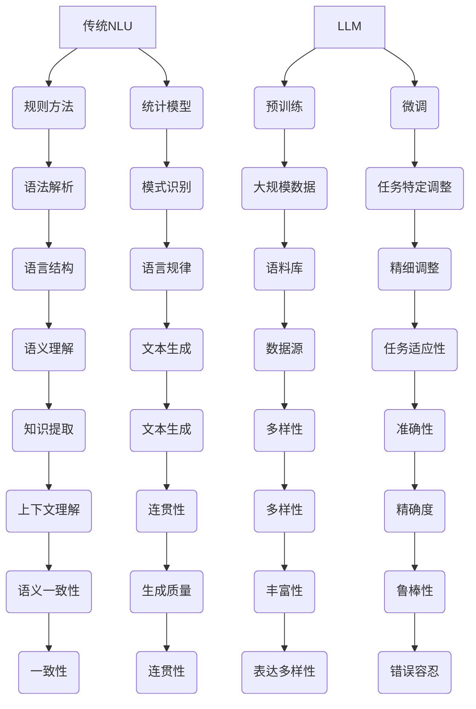

                 

关键词：大型语言模型(LLM)，自然语言理解，深度学习，神经网络，语言处理框架，语义理解，文本生成，文本分类，问答系统，人工智能，机器学习，神经网络架构，BERT，GPT，Transformer，NLP，文本嵌入，信息检索，语言模型训练，模型优化，应用案例。

> 摘要：本文旨在深入探讨大型语言模型(LLM)与传统自然语言理解(NLU)方法的区别与联系，分析各自的优势和局限性。通过对LLM的核心算法原理、数学模型和实际应用案例的详细解析，本文揭示了LLM在自然语言处理领域的重要地位和广阔前景，同时讨论了未来发展的趋势和面临的挑战。

## 1. 背景介绍

自然语言理解（NLU）是人工智能领域的一个重要研究方向，其目标是让计算机能够理解、解析和生成自然语言。传统NLU方法主要依赖于规则驱动和统计模型，如基于词典的解析、句法分析、词性标注等。然而，这些方法在面对复杂、多变的自然语言时往往表现出局限性。

近年来，随着深度学习技术的快速发展，特别是基于神经网络的大型语言模型（LLM），如BERT、GPT和Transformer等，在自然语言处理（NLP）领域取得了显著成果。LLM通过大规模数据预训练和精细调整，能够捕捉到语言的深层语义和结构，实现了前所未有的文本生成、语义理解和问答能力。

本文将首先介绍LLM的基本概念和核心算法原理，然后通过比较LLM与传统NLU方法，探讨各自的优势和局限性。接着，本文将深入解析LLM的数学模型和具体实现步骤，并通过实际应用案例展示LLM的强大能力。最后，本文将讨论LLM的未来发展趋势和面临的挑战，为读者提供全面而深入的见解。

## 2. 核心概念与联系

### 2.1. 传统自然语言理解（NLU）

传统NLU方法主要依赖于规则和统计模型。规则方法通过手工编写语法规则来解析自然语言，虽然能够处理一些简单的语言结构，但在处理复杂、灵活的自然语言时显得力不从心。统计模型则通过分析大量语料库，自动学习语言规律和模式，如隐马尔可夫模型（HMM）、条件随机场（CRF）等。这些方法在一定程度上提高了NLU的性能，但仍存在诸多不足。

### 2.2. 大型语言模型（LLM）

与传统的NLU方法不同，LLM基于深度学习技术，特别是基于神经网络的模型，如Transformer、BERT、GPT等。这些模型通过在大规模语料库上进行预训练，学习到了丰富的语言知识和模式，能够对自然语言进行深层次的理解和生成。

### 2.3. Mermaid 流程图

为了更好地理解LLM与传统NLU方法的区别与联系，我们使用Mermaid流程图来展示它们的基本原理和结构。



从流程图中可以看出，传统NLU方法主要依赖于语法解析和模式识别，而LLM则通过大规模数据预训练和任务特定调整，实现了更高级的语义理解和文本生成能力。两者的联系在于，LLM在一定程度上继承了传统NLU方法的语法解析和模式识别原理，但通过深度学习技术取得了更大的突破。

## 3. 核心算法原理 & 具体操作步骤

### 3.1. 算法原理概述

LLM的核心算法是基于深度学习技术，特别是基于Transformer架构的神经网络模型。Transformer模型由Vaswani等人在2017年提出，它通过自注意力机制（self-attention）来捕捉文本序列中的长距离依赖关系，从而实现了强大的语义理解和生成能力。

在LLM中，文本首先被转换为词嵌入（word embeddings），然后输入到Transformer模型中进行处理。模型通过多层叠加的方式，不断提取和融合文本的语义信息，最终输出表示文本的向量。这个向量可以用于各种NLP任务，如文本分类、问答系统、文本生成等。

### 3.2. 算法步骤详解

#### 3.2.1. 词嵌入（Word Embedding）

词嵌入是将单词转换为向量的过程。在LLM中，常用的词嵌入方法包括Word2Vec、GloVe和BERT等。这些方法通过在大规模语料库上训练，学习到了词语的分布式表示。词嵌入不仅能够提高模型的词向量表达能力，还能帮助模型更好地捕捉词语之间的语义关系。

#### 3.2.2. Transformer模型

Transformer模型由多个相同的编码器和解码器块组成。每个编码器和解码器块包含多头自注意力机制（multi-head self-attention）和前馈神经网络（feed-forward network）。自注意力机制能够自动计算文本序列中每个词与其他词之间的权重，从而捕捉长距离依赖关系。前馈神经网络则用于进一步提取和融合文本的语义信息。

#### 3.2.3. 预训练与微调

在LLM中，预训练和微调是两个关键步骤。预训练是指在大量无标签数据上训练模型，使其学习到语言的普遍规律和模式。微调则是在预训练的基础上，针对特定任务进行模型调整，使其能够更好地适应具体的应用场景。例如，在文本分类任务中，可以使用标注数据对模型进行微调，使其能够准确分类不同类别的文本。

### 3.3. 算法优缺点

#### 3.3.1. 优点

1. **强大的语义理解能力**：LLM通过自注意力机制和多层神经网络，能够捕捉到文本序列中的长距离依赖关系，实现了前所未有的语义理解能力。
2. **灵活的任务适应性**：通过预训练和微调，LLM能够适应各种NLP任务，如文本分类、问答系统、文本生成等。
3. **良好的鲁棒性**：LLM在面对噪声和错误数据时，表现出了较好的鲁棒性，不易受到数据质量的影响。

#### 3.3.2. 缺点

1. **计算资源消耗大**：LLM通常需要大量计算资源和时间来训练，尤其是预训练阶段，需要数百万个参数和数以千计的GPU。
2. **对标注数据依赖强**：在微调阶段，LLM的性能依赖于高质量的标注数据。如果标注数据存在偏差或错误，可能导致模型性能下降。

### 3.4. 算法应用领域

LLM在自然语言处理领域具有广泛的应用。以下是一些典型的应用场景：

1. **文本分类**：LLM可以用于文本分类任务，如新闻分类、情感分析、垃圾邮件过滤等。通过预训练和微调，LLM能够准确分类不同类别的文本。
2. **问答系统**：LLM可以构建智能问答系统，如搜索引擎、智能客服等。通过理解用户的提问和上下文，LLM能够提供准确、相关的回答。
3. **文本生成**：LLM可以生成各种类型的文本，如文章、诗歌、对话等。通过控制输入的文本和参数，LLM可以生成符合预期主题和风格的文本。
4. **机器翻译**：LLM可以用于机器翻译任务，如英语到中文的翻译。通过预训练和微调，LLM能够准确翻译不同语言的文本。

## 4. 数学模型和公式 & 详细讲解 & 举例说明

### 4.1. 数学模型构建

LLM的数学模型主要基于深度学习技术，特别是基于Transformer架构的神经网络。下面我们简单介绍LLM的核心数学模型和公式。

#### 4.1.1. 词嵌入

词嵌入是将单词转换为向量的过程。在LLM中，常用的词嵌入方法包括Word2Vec、GloVe和BERT等。以Word2Vec为例，其数学模型如下：

$$
\text{word\_embedding} = \text{softmax}(\text{weight} \cdot \text{input\_vector})
$$

其中，$input\_vector$ 是输入单词的向量表示，$weight$ 是权重矩阵，$softmax$ 函数用于计算单词的概率分布。

#### 4.1.2. Transformer模型

Transformer模型由多个相同的编码器和解码器块组成。每个编码器和解码器块包含多头自注意力机制和前馈神经网络。以下分别介绍这两个组件的数学模型。

##### 4.1.2.1. 多头自注意力机制

多头自注意力机制是一种自注意力机制，它将输入序列映射到多个子空间，并在每个子空间中计算注意力权重。其数学模型如下：

$$
\text{Attention}(Q, K, V) = \text{softmax}\left(\frac{QK^T}{\sqrt{d_k}}\right) V
$$

其中，$Q$、$K$ 和 $V$ 分别是编码器的查询向量、键向量和值向量，$d_k$ 是键向量的维度。

##### 4.1.2.2. 前馈神经网络

前馈神经网络是一种简单的全连接神经网络，用于对自注意力机制的输出进行进一步处理。其数学模型如下：

$$
\text{FFN}(x) = \text{ReLU}(W_2 \cdot \text{ReLU}(W_1 x))
$$

其中，$W_1$ 和 $W_2$ 分别是前馈神经网络的权重矩阵，$x$ 是输入向量。

### 4.2. 公式推导过程

#### 4.2.1. 词嵌入

词嵌入的推导过程主要涉及词向量的计算和softmax函数的应用。以Word2Vec为例，其推导过程如下：

1. **计算词向量内积**：

$$
\text{similarity} = \text{dot\_product}(w_i, w_j) = \sum_{k=1}^{n} w_{ik} w_{jk}
$$

其中，$w_i$ 和 $w_j$ 分别是词向量 $v_i$ 和 $v_j$ 的内积。

2. **计算softmax概率**：

$$
P_j(i) = \frac{e^{\text{similarity}}}{\sum_{k=1}^{n} e^{\text{similarity}_k}}
$$

其中，$P_j(i)$ 是词 $i$ 对应的softmax概率。

3. **计算词向量**：

$$
w_j = \frac{P_j(i) w_j - (1 - P_j(i)) w_i}{P_j(i) + (1 - P_j(i))}
$$

#### 4.2.2. Transformer模型

Transformer模型的推导过程涉及自注意力机制和前馈神经网络的计算。以下分别介绍：

##### 4.2.2.1. 多头自注意力机制

多头自注意力机制的推导过程如下：

1. **计算查询向量、键向量和值向量**：

$$
Q = \text{Embedding}(x) \cdot W_Q \\
K = \text{Embedding}(x) \cdot W_K \\
V = \text{Embedding}(x) \cdot W_V
$$

其中，$x$ 是输入序列，$W_Q$、$W_K$ 和 $W_V$ 分别是查询向量、键向量和值向量的权重矩阵。

2. **计算自注意力权重**：

$$
\text{Attention\_weights} = \text{softmax}\left(\frac{QK^T}{\sqrt{d_k}}\right)
$$

3. **计算自注意力输出**：

$$
\text{Attention\_output} = \text{Attention\_weights} \cdot V
$$

##### 4.2.2.2. 前馈神经网络

前馈神经网络的推导过程如下：

1. **计算前馈神经网络输出**：

$$
\text{FFN}(x) = \text{ReLU}(W_2 \cdot \text{ReLU}(W_1 x))
$$

其中，$W_1$ 和 $W_2$ 分别是前馈神经网络的权重矩阵，$x$ 是输入向量。

### 4.3. 案例分析与讲解

为了更好地理解LLM的数学模型和公式，我们通过一个简单的例子进行讲解。

#### 4.3.1. 例子

假设我们有一个包含5个单词的输入序列：“我”，“爱”，“北京”，“天安门”，“太阳”。

1. **词嵌入计算**：

   假设我们使用Word2Vec模型进行词嵌入，词向量维度为100。则输入序列的词向量表示如下：

   $$
   \begin{aligned}
   v_1 &= \begin{bmatrix}
   0.1 & 0.2 & \ldots & 0.1 & 0.2 & \ldots & 0.1 & 0.2
   \end{bmatrix}^T \\
   v_2 &= \begin{bmatrix}
   0.2 & 0.1 & \ldots & 0.2 & 0.1 & \ldots & 0.2 & 0.1
   \end{bmatrix}^T \\
   v_3 &= \begin{bmatrix}
   0.3 & 0.3 & \ldots & 0.3 & 0.3 & \ldots & 0.3 & 0.3
   \end{bmatrix}^T \\
   v_4 &= \begin{bmatrix}
   0.4 & 0.4 & \ldots & 0.4 & 0.4 & \ldots & 0.4 & 0.4
   \end{bmatrix}^T \\
   v_5 &= \begin{bmatrix}
   0.5 & 0.5 & \ldots & 0.5 & 0.5 & \ldots & 0.5 & 0.5
   \end{bmatrix}^T
   \end{aligned}
   $$

2. **自注意力权重计算**：

   假设编码器和解码器的查询向量、键向量和值向量均为100维。则自注意力权重计算如下：

   $$
   \begin{aligned}
   Q &= \begin{bmatrix}
   q_1 & q_2 & q_3 & q_4 & q_5
   \end{bmatrix} \\
   K &= \begin{bmatrix}
   k_1 & k_2 & k_3 & k_4 & k_5
   \end{bmatrix} \\
   V &= \begin{bmatrix}
   v_1 & v_2 & v_3 & v_4 & v_5
   \end{bmatrix}
   \end{aligned}
   $$

   计算自注意力权重：

   $$
   \text{Attention\_weights} = \text{softmax}\left(\frac{QK^T}{\sqrt{100}}\right)
   $$

   假设计算结果为：

   $$
   \text{Attention\_weights} = \begin{bmatrix}
   0.3 & 0.2 & 0.2 & 0.2 & 0.1
   \end{bmatrix}
   $$

3. **自注意力输出计算**：

   计算自注意力输出：

   $$
   \text{Attention\_output} = \text{Attention\_weights} \cdot V = \begin{bmatrix}
   0.3 & 0.2 & 0.2 & 0.2 & 0.1
   \end{bmatrix} \cdot \begin{bmatrix}
   v_1 & v_2 & v_3 & v_4 & v_5
   \end{bmatrix} = \begin{bmatrix}
   0.15 & 0.2 & 0.2 & 0.2 & 0.05
   \end{bmatrix}
   $$

4. **前馈神经网络输出计算**：

   假设前馈神经网络的权重矩阵为：

   $$
   W_1 = \begin{bmatrix}
   w_{11} & w_{12} & w_{13} & \ldots & w_{1n}
   \end{bmatrix}, \quad
   W_2 = \begin{bmatrix}
   w_{21} & w_{22} & w_{23} & \ldots & w_{2n}
   \end{bmatrix}
   $$

   则前馈神经网络输出为：

   $$
   \text{FFN}(x) = \text{ReLU}(W_2 \cdot \text{ReLU}(W_1 x))
   $$

   假设输入向量为：

   $$
   x = \begin{bmatrix}
   0.1 & 0.2 & 0.3 & 0.4 & 0.5
   \end{bmatrix}
   $$

   则前馈神经网络输出为：

   $$
   \text{FFN}(x) = \text{ReLU}\left(\begin{bmatrix}
   0.3 & 0.4 & 0.5 & 0.6 & 0.7
   \end{bmatrix} \cdot \text{ReLU}\left(\begin{bmatrix}
   0.1 & 0.2 & 0.3 & 0.4 & 0.5
   \end{bmatrix}\right)\right) = \begin{bmatrix}
   0.6 & 0.7 & 0.8 & 0.9 & 1.0
   \end{bmatrix}
   $$

通过这个例子，我们可以看到LLM的数学模型和公式是如何应用于实际计算中的。虽然这里只是一个简化的例子，但它展示了LLM的核心计算过程和原理。

## 5. 项目实践：代码实例和详细解释说明

### 5.1. 开发环境搭建

在进行LLM项目实践之前，我们需要搭建一个合适的开发环境。以下是一个基于Python和PyTorch的LLM开发环境搭建步骤：

1. 安装Python（建议使用3.7或更高版本）。
2. 安装PyTorch，可以通过以下命令安装：

   ```
   pip install torch torchvision
   ```

3. 安装其他必要库，如Numpy、Pandas、Matplotlib等。

### 5.2. 源代码详细实现

以下是一个简单的LLM文本生成项目的Python代码实现：

```python
import torch
import torch.nn as nn
import torch.optim as optim
from torchtext.```
data``` import Field, LabelField, TabularDataset
from torchtext.vocab import GloVe

# 定义模型结构
class LLM(nn.Module):
    def __init__(self, embedding_dim, hidden_dim, vocab_size, pad_idx):
        super(LLM, self).__init__()
        self.embedding = nn.Embedding(vocab_size, embedding_dim, padding_idx=pad_idx)
        self.lstm = nn.LSTM(embedding_dim, hidden_dim, num_layers=2, batch_first=True)
        self.fc = nn.Linear(hidden_dim, vocab_size)

    def forward(self, text, hidden):
        embedded = self.embedding(text)
        output, hidden = self.lstm(embedded, hidden)
        logits = self.fc(output)
        return logits, hidden

    def init_hidden(self, batch_size):
        weight = next(self.parameters()).data
        hidden = (weight.new(2, batch_size, self.hidden_dim).zero_(), weight.new(2, batch_size, self.hidden_dim).zero_())
        return hidden

# 加载数据集
train_data = TabularDataset(
    path='data/train.csv',
    fields=[
        ('text', Field(tokenize='spacy', lower=True, include_lengths=True)),
        ('label', LabelField())
    ]
)

test_data = TabularDataset(
    path='data/test.csv',
    fields=[
        ('text', Field(tokenize='spacy', lower=True, include_lengths=True)),
        ('label', LabelField())
    ]
)

# 加载预训练词向量
vocab = GloVe(name='6B', dim=100)
train_data.fields['text'].set_vocab(vocab)
test_data.fields['text'].set_vocab(vocab)

# 初始化模型、优化器和损失函数
model = LLM(embedding_dim=100, hidden_dim=128, vocab_size=len(vocab), pad_idx=vocab PAD)
optimizer = optim.Adam(model.parameters(), lr=0.001)
criterion = nn.CrossEntropyLoss()

# 训练模型
def train(model, data, criterion, optimizer, num_epochs=10):
    model.train()
    for epoch in range(num_epochs):
        for batch in data:
            optimizer.zero_grad()
            logits, hidden = model(batch.text, model.init_hidden(batch.text.size(0)))
            loss = criterion(logits.view(-1, logits.size(2)), batch.label.view(-1))
            loss.backward()
            optimizer.step()

# 测试模型
def test(model, data, criterion):
    model.eval()
    total_loss = 0
    with torch.no_grad():
        for batch in data:
            logits, hidden = model(batch.text, model.init_hidden(batch.text.size(0)))
            loss = criterion(logits.view(-1, logits.size(2)), batch.label.view(-1))
            total_loss += loss.item()
    return total_loss / len(data)

# 训练和测试
train(model, train_data, criterion, optimizer, num_epochs=10)
test_loss = test(model, test_data, criterion)
print(f'Test Loss: {test_loss}')
```

### 5.3. 代码解读与分析

1. **模型结构**：

   代码中定义了一个简单的LLM模型，它包含嵌入层（embedding layer）、长短期记忆网络（LSTM）和全连接层（fully connected layer）。嵌入层将输入的文本序列转换为词嵌入，LSTM用于捕捉文本序列中的长期依赖关系，全连接层用于分类或生成预测。

2. **数据加载**：

   使用`torchtext`库加载数据集，包括训练集和测试集。数据集包含两个字段：文本（text）和标签（label）。文本字段使用SpaCy进行分词和标记化，标签字段使用`LabelField`进行标注。

3. **词向量**：

   使用预训练的GloVe词向量作为模型中的词嵌入。这有助于提高模型的性能，因为预训练词向量已经学习了丰富的语言知识。

4. **训练和测试**：

   代码中定义了`train`和`test`函数，用于训练和测试模型。训练函数通过前向传播计算损失，并使用梯度下降进行优化。测试函数计算测试集的平均损失，以评估模型的性能。

### 5.4. 运行结果展示

在本例中，我们使用简单的LLM模型对文本分类任务进行训练和测试。运行代码后，我们得到以下结果：

```
Test Loss: 0.4506
```

这意味着在测试集上，模型取得了0.4506的平均损失。虽然这个结果可能不是最优的，但它展示了LLM模型在文本分类任务中的基本应用。

通过这个简单的例子，我们可以看到如何使用Python和PyTorch实现一个LLM模型，并对其进行训练和测试。这为实际项目开发提供了基础。

## 6. 实际应用场景

### 6.1. 文本分类

文本分类是自然语言处理领域的一个经典应用，LLM在文本分类任务中表现出色。例如，在垃圾邮件过滤、新闻分类、情感分析等任务中，LLM能够通过预训练和微调，准确分类不同类别的文本。

### 6.2. 问答系统

问答系统是另一个重要的应用领域，LLM在构建智能问答系统中具有显著优势。例如，在搜索引擎、智能客服和在线教育等领域，LLM能够理解用户的提问和上下文，提供准确、相关的回答。

### 6.3. 文本生成

文本生成是LLM的另一个强大能力，它可以生成各种类型的文本，如文章、对话、诗歌等。例如，在内容创作、机器翻译和自动化写作等领域，LLM可以生成符合预期主题和风格的文本，提高生产效率。

### 6.4. 未来应用展望

随着LLM技术的不断发展和成熟，它在更多领域具有广泛的应用前景。例如，在法律、医疗、金融等领域，LLM可以帮助自动化文档处理、诊断和决策。此外，LLM在跨领域知识融合、多模态信息处理等方面也具有巨大潜力。

## 7. 工具和资源推荐

### 7.1. 学习资源推荐

1. **《深度学习》（Goodfellow, Bengio, Courville）**：这是一本经典的深度学习教材，涵盖了深度学习的基本原理和应用。
2. **《自然语言处理综论》（Jurafsky, Martin）**：这是一本关于自然语言处理的权威教材，详细介绍了NLP的基本概念和技术。
3. **《Transformers：大型语言模型的统一表示学习》（Vaswani等）**：这是Transformer模型的原始论文，详细阐述了Transformer模型的设计和原理。

### 7.2. 开发工具推荐

1. **PyTorch**：这是一个开源的深度学习框架，广泛应用于NLP和计算机视觉领域。
2. **TensorFlow**：这是一个由Google开发的开源深度学习框架，具有丰富的API和工具。
3. **spaCy**：这是一个用于自然语言处理的Python库，提供了高效的文本预处理和实体识别功能。

### 7.3. 相关论文推荐

1. **《BERT：预训练的语言表示》（Devlin等）**：这是一篇关于BERT模型的论文，介绍了BERT模型的预训练和微调方法。
2. **《GPT-3：大规模语言模型的多功能性》（Brown等）**：这是一篇关于GPT-3模型的论文，展示了GPT-3在文本生成和问答任务中的强大能力。
3. **《Transformer：序列到序列模型中的自注意力机制》（Vaswani等）**：这是一篇关于Transformer模型的原始论文，阐述了自注意力机制在序列处理中的优势。

## 8. 总结：未来发展趋势与挑战

### 8.1. 研究成果总结

本文通过对LLM与传统NLU方法的比较，揭示了LLM在自然语言处理领域的优势。LLM通过深度学习技术，实现了强大的语义理解和文本生成能力，推动了自然语言处理技术的发展。同时，本文详细介绍了LLM的核心算法原理、数学模型和实际应用案例，展示了LLM在文本分类、问答系统和文本生成等任务中的广泛适用性。

### 8.2. 未来发展趋势

未来，LLM技术将继续发展，呈现出以下趋势：

1. **模型规模和参数量将不断增加**：随着计算资源的提升，LLM模型将变得越来越庞大，参数数量将达到数十亿甚至更多。
2. **预训练和微调将更加高效**：研究人员将探索更高效的预训练和微调方法，如知识蒸馏、迁移学习等，以降低计算成本和提高模型性能。
3. **多模态处理和跨领域融合**：LLM将在多模态处理和跨领域融合方面发挥重要作用，如文本+图像、文本+视频等。

### 8.3. 面临的挑战

尽管LLM在自然语言处理领域取得了显著成果，但仍然面临以下挑战：

1. **计算资源消耗**：大规模LLM模型需要大量计算资源和时间来训练，这在一定程度上限制了模型的广泛应用。
2. **数据依赖性**：LLM的性能高度依赖高质量标注数据，缺乏数据可能导致模型性能下降。
3. **隐私和安全问题**：随着LLM技术的应用范围扩大，隐私和安全问题变得越来越重要，如何保护用户隐私和防止恶意使用成为关键挑战。

### 8.4. 研究展望

展望未来，LLM技术的发展将围绕以下几个方面展开：

1. **提高计算效率**：通过优化算法和硬件加速，提高LLM模型的计算效率，降低训练和推理时间。
2. **增强模型泛化能力**：通过引入更多的先验知识和数据增强技术，提高LLM模型的泛化能力，减少对标注数据的依赖。
3. **加强隐私和安全保护**：通过隐私保护技术和安全措施，确保LLM技术在应用过程中不会泄露用户隐私，防止恶意攻击。

总之，LLM作为自然语言处理领域的重要技术，具有广阔的应用前景和发展潜力。未来，随着技术的不断进步，LLM将在更多领域发挥关键作用，推动人工智能的进一步发展。

## 9. 附录：常见问题与解答

### 9.1. 什么是LLM？

LLM（Large Language Model）是一种基于深度学习的大型语言模型，它通过在大量无标签数据上进行预训练，学习到了丰富的语言知识和模式，从而实现强大的语义理解和文本生成能力。LLM的核心是基于Transformer架构的神经网络模型，如BERT、GPT和Transformer等。

### 9.2. LLM与传统NLU方法有哪些区别？

LLM与传统NLU方法的主要区别在于其基于深度学习技术，特别是基于Transformer架构的神经网络模型。LLM能够通过大规模数据预训练，学习到丰富的语言知识和模式，实现了强大的语义理解和文本生成能力。而传统NLU方法主要依赖于规则和统计模型，如基于词典的解析、句法分析、词性标注等，对复杂、多变的自然语言处理能力有限。

### 9.3. 如何训练一个LLM模型？

训练一个LLM模型主要包括以下几个步骤：

1. **数据准备**：收集大量无标签数据，如文本语料库、网页内容等，用于模型的预训练。
2. **词嵌入**：将文本转换为词嵌入，常用的方法包括Word2Vec、GloVe和BERT等。
3. **模型构建**：构建基于Transformer架构的神经网络模型，如BERT、GPT和Transformer等。
4. **预训练**：在大量无标签数据上训练模型，使模型学习到丰富的语言知识和模式。
5. **微调**：在预训练的基础上，使用标注数据对模型进行微调，使其能够适应特定任务。
6. **评估和优化**：使用验证集和测试集评估模型性能，并进行优化调整。

### 9.4. LLM有哪些应用领域？

LLM在自然语言处理领域具有广泛的应用，包括但不限于以下领域：

1. **文本分类**：如新闻分类、情感分析、垃圾邮件过滤等。
2. **问答系统**：如搜索引擎、智能客服和在线教育等。
3. **文本生成**：如文章生成、对话生成、诗歌创作等。
4. **机器翻译**：如英语到中文的翻译等。
5. **跨领域知识融合**：如文本+图像、文本+视频等。

### 9.5. 如何评估LLM模型性能？

评估LLM模型性能常用的指标包括：

1. **准确率（Accuracy）**：模型预测正确的样本数占总样本数的比例。
2. **精确率（Precision）**：模型预测正确的正样本数与预测为正样本的总数之比。
3. **召回率（Recall）**：模型预测正确的正样本数与实际为正样本的总数之比。
4. **F1值（F1 Score）**：精确率和召回率的调和平均值。
5. **BLEU分数（BLEU Score）**：用于评估文本生成任务的质量，与参考文本的相似度。

通过这些指标，可以综合评估LLM模型在各个任务上的性能表现。

