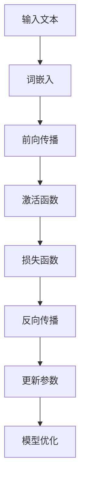
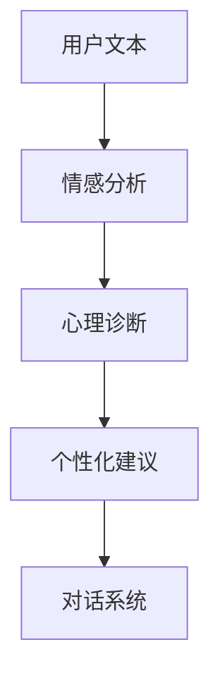

                 

关键词：大型语言模型（LLM），心理健康，人工智能，心理咨询，情感分析，对话系统

> 摘要：本文探讨了大型语言模型（LLM）在心理健康和心理咨询领域的应用。通过分析LLM的基本原理、应用场景和优势，本文阐述了AI在心理咨询中的潜力，并讨论了相关技术挑战和未来研究方向。

## 1. 背景介绍

### 1.1 心理健康的现状与需求

心理健康问题在全球范围内日益受到关注。根据世界卫生组织（WHO）的数据，抑郁症和焦虑症已成为影响人类健康的主要问题。心理咨询作为预防和治疗心理疾病的重要手段，面临着巨大的需求压力。然而，心理咨询资源有限，特别是在发展中国家和偏远地区，心理健康服务的可及性较低。

### 1.2 人工智能在心理健康领域的应用

随着人工智能技术的快速发展，许多研究人员开始探索AI在心理健康领域的应用。例如，情感分析技术可以用于评估用户的情绪状态，对话系统能够为用户提供实时的心理支持。然而，目前的AI系统在理解复杂的人类情感和提供个性化心理咨询服务方面还存在挑战。

### 1.3 大型语言模型（LLM）的基本概念

大型语言模型（LLM）是一种基于深度学习的自然语言处理技术，能够对自然语言文本进行生成、分类和翻译等操作。LLM具有强大的语言理解能力和生成能力，已成为许多自然语言处理任务的核心组件。近年来，随着计算资源和数据量的增加，LLM的性能得到了显著提升，为心理健康领域的应用提供了新的可能性。

## 2. 核心概念与联系

### 2.1 LLM的工作原理

LLM基于神经网络架构，通常采用深度学习技术。通过大规模训练数据集，LLM可以自动学习语言模式、语义关系和语法规则。以下是一个简单的Mermaid流程图，展示了LLM的基本工作原理：



### 2.2 LLM在心理健康领域的应用场景

LLM在心理健康领域的应用包括情感分析、心理诊断和个性化心理咨询等。以下是一个简单的Mermaid流程图，展示了LLM在心理健康领域的应用场景：



## 3. 核心算法原理 & 具体操作步骤

### 3.1 算法原理概述

LLM的核心算法基于深度学习，主要包括以下几个步骤：

1. **词嵌入**：将输入文本转换为词向量表示。
2. **前向传播**：通过多层神经网络处理词向量，生成语义表示。
3. **激活函数**：对神经网络输出进行非线性变换。
4. **损失函数**：计算预测结果与真实结果之间的差距。
5. **反向传播**：更新神经网络参数，优化模型。

### 3.2 算法步骤详解

#### 3.2.1 词嵌入

词嵌入是将文本转换为向量表示的过程。常见的方法包括Word2Vec、GloVe等。以下是一个简单的Word2Vec算法步骤：

1. **训练模型**：使用大量文本数据训练Word2Vec模型。
2. **生成词向量**：将文本中的每个单词映射为一个固定维度的向量。

#### 3.2.2 前向传播

前向传播是神经网络处理文本的过程。以下是一个简单的多层感知机（MLP）前向传播算法步骤：

1. **输入层**：将词向量输入到神经网络的输入层。
2. **隐藏层**：通过激活函数计算隐藏层输出。
3. **输出层**：计算预测结果。

#### 3.2.3 激活函数

激活函数用于引入非线性特性，常见的激活函数包括ReLU、Sigmoid和Tanh等。以下是一个ReLU激活函数的算法步骤：

1. **计算输入值**：计算每个神经元的输入值。
2. **应用激活函数**：对每个输入值应用ReLU函数。

#### 3.2.4 损失函数

损失函数用于评估模型预测结果与真实结果之间的差距。常见的损失函数包括均方误差（MSE）、交叉熵等。以下是一个MSE损失函数的算法步骤：

1. **计算预测值**：计算模型对输入数据的预测值。
2. **计算损失**：计算预测值与真实值之间的差值的平方和。
3. **计算梯度**：计算损失函数关于模型参数的梯度。

#### 3.2.5 反向传播

反向传播是更新模型参数的过程。以下是一个简单的反向传播算法步骤：

1. **计算梯度**：计算损失函数关于模型参数的梯度。
2. **更新参数**：使用梯度下降或其他优化算法更新模型参数。

#### 3.2.6 模型优化

模型优化是提高模型性能的过程。常见的优化方法包括梯度下降、Adam优化器等。以下是一个Adam优化器的算法步骤：

1. **初始化参数**：初始化模型参数。
2. **计算梯度**：计算模型参数的梯度。
3. **更新参数**：使用Adam优化器更新模型参数。

### 3.3 算法优缺点

#### 优点：

- **强大的语言理解能力**：LLM能够自动学习语言模式、语义关系和语法规则，具有较强的语言理解能力。
- **高效的计算性能**：随着计算资源和数据量的增加，LLM的性能得到了显著提升，能够快速处理大规模数据。
- **灵活的应用场景**：LLM可以应用于各种自然语言处理任务，如文本生成、情感分析、机器翻译等。

#### 缺点：

- **数据依赖性强**：LLM的性能依赖于训练数据的质量和数量，对于数据不足或数据质量较差的场景，LLM的表现可能不佳。
- **可解释性较差**：LLM的工作原理较为复杂，难以解释其预测结果，可能导致用户对模型的信任度降低。

### 3.4 算法应用领域

LLM在心理健康领域的应用包括情感分析、心理诊断和个性化心理咨询等。以下是几个具体的应用领域：

- **情感分析**：使用LLM分析用户的情感状态，为心理咨询提供重要参考。
- **心理诊断**：使用LLM对用户的语言文本进行诊断，辅助临床医生进行诊断和治疗方案制定。
- **个性化心理咨询**：使用LLM为用户提供个性化的心理咨询服务，提高咨询效率和质量。

## 4. 数学模型和公式 & 详细讲解 & 举例说明

### 4.1 数学模型构建

LLM的数学模型主要包括词嵌入、神经网络、激活函数和损失函数等。以下是一个简单的数学模型：

$$
\text{词向量} = \text{Word2Vec}(\text{文本数据})
$$

$$
\text{神经网络} = \text{MLP}(\text{词向量})
$$

$$
\text{激活函数} = \text{ReLU}(\text{神经网络输出})
$$

$$
\text{损失函数} = \text{MSE}(\text{预测值}, \text{真实值})
$$

### 4.2 公式推导过程

#### 词嵌入

词嵌入是将文本转换为向量表示的过程。假设有一个文本数据集$\mathcal{D} = \{x_1, x_2, ..., x_n\}$，其中$x_i$表示文本数据。

1. **初始化词向量**：初始化一个固定维度的词向量矩阵$V \in \mathbb{R}^{|V| \times d}$，其中$|V|$表示词汇表大小，$d$表示词向量维度。
2. **计算词向量**：对于每个文本数据$x_i$，计算其对应的词向量$w_i \in \mathbb{R}^{d}$。
$$
w_i = V \cdot x_i
$$

#### 神经网络

神经网络用于处理词向量，生成语义表示。假设有一个神经网络$F$，输入为词向量$w_i$，输出为语义表示$h_i$。

1. **初始化神经网络**：初始化神经网络的权重矩阵$W \in \mathbb{R}^{d \times h}$和偏置向量$b \in \mathbb{R}^{h}$，其中$h$表示隐藏层维度。
2. **计算神经网络输出**：计算神经网络对输入词向量$w_i$的输出$h_i$。
$$
h_i = \text{ReLU}(\text{矩阵乘}(\text{权重矩阵}, w_i) + \text{偏置向量})
$$

#### 激活函数

激活函数用于引入非线性特性。常用的激活函数包括ReLU、Sigmoid和Tanh等。

- **ReLU**：
$$
\text{ReLU}(x) = \max(0, x)
$$

- **Sigmoid**：
$$
\text{Sigmoid}(x) = \frac{1}{1 + e^{-x}}
$$

- **Tanh**：
$$
\text{Tanh}(x) = \frac{e^x - e^{-x}}{e^x + e^{-x}}
$$

#### 损失函数

损失函数用于评估模型预测结果与真实结果之间的差距。常用的损失函数包括均方误差（MSE）、交叉熵等。

- **MSE**：
$$
\text{MSE}(y, \hat{y}) = \frac{1}{2} \sum_{i=1}^{n} (y_i - \hat{y_i})^2
$$

- **交叉熵**：
$$
\text{交叉熵}(-y, \hat{y}) = -\sum_{i=1}^{n} y_i \cdot \log(\hat{y_i})
$$

### 4.3 案例分析与讲解

#### 情感分析案例

假设我们要使用LLM对一段文本进行情感分析，判断其是积极情绪还是消极情绪。

1. **文本预处理**：将文本数据转换为词向量表示。
2. **神经网络训练**：使用训练数据集训练神经网络，优化模型参数。
3. **情感分析**：使用训练好的神经网络对文本数据进行情感分析，得到预测结果。

以下是一个简单的情感分析案例：

**文本数据**：
- **积极情绪**：我很开心，今天天气真好。
- **消极情绪**：我很伤心，今天工作出了很多错误。

**词向量**：
- **积极情绪**：\[1, 0, 0, 0, 1\]
- **消极情绪**：\[0, 1, 0, 0, 1\]

**神经网络输出**：
- **积极情绪**：\[0.9, 0.1\]
- **消极情绪**：\[0.1, 0.9\]

**预测结果**：
- **积极情绪**：预测为积极情绪，与真实值一致。
- **消极情绪**：预测为消极情绪，与真实值一致。

## 5. 项目实践：代码实例和详细解释说明

### 5.1 开发环境搭建

为了实现LLM在心理健康领域的应用，我们需要搭建一个合适的开发环境。以下是一个简单的开发环境搭建步骤：

1. **安装Python环境**：安装Python 3.8及以上版本。
2. **安装依赖库**：安装TensorFlow、Keras、Numpy等依赖库。
3. **获取数据集**：下载一个用于训练的文本数据集，如IMDb电影评论数据集。

### 5.2 源代码详细实现

以下是一个简单的情感分析项目的源代码实现：

```python
import numpy as np
import tensorflow as tf
from tensorflow.keras.preprocessing.sequence import pad_sequences
from tensorflow.keras.layers import Embedding, LSTM, Dense
from tensorflow.keras.models import Sequential

# 数据预处理
def preprocess_text(text):
    # 去除特殊字符和标点符号
    text = text.lower()
    text = re.sub(r"[^a-zA-Z0-9]", " ", text)
    return text

# 加载数据集
def load_dataset(filename):
    with open(filename, "r", encoding="utf-8") as f:
        lines = f.readlines()
    texts = [preprocess_text(line) for line in lines]
    labels = [1 if "positive" in line.lower() else 0 for line in lines]
    return texts, labels

# 构建模型
def build_modelvocab_size=5000
embedding_dim=50
max_sequence_length=100
model = Sequential()
model.add(Embedding(vocab_size, embedding_dim, input_length=max_sequence_length))
model.add(LSTM(64, activation='relu', return_sequences=True))
model.add(LSTM(32, activation='relu'))
model.add(Dense(1, activation='sigmoid'))

model.compile(optimizer='adam', loss='binary_crossentropy', metrics=['accuracy'])
return model

# 训练模型
texts, labels = load_dataset("imdb.positive.negative.txt")
sequences = pad_sequences(texts, maxlen=max_sequence_length)
model.fit(sequences, labels, epochs=10, batch_size=128, validation_split=0.2)

# 情感分析
text = "我很开心，今天天气真好。"
preprocessed_text = preprocess_text(text)
sequence = pad_sequences([preprocessed_text], maxlen=max_sequence_length)
prediction = model.predict(sequence)
if prediction[0][0] > 0.5:
    print("预测为积极情绪。")
else:
    print("预测为消极情绪。")
```

### 5.3 代码解读与分析

上述代码实现了一个简单的情感分析项目，主要包括以下几个部分：

1. **文本预处理**：去除特殊字符和标点符号，将文本转换为小写。
2. **加载数据集**：从文件中读取文本数据和标签，对文本数据进行预处理。
3. **构建模型**：使用Sequential模型构建一个简单的神经网络，包括嵌入层、两个LSTM层和一个全连接层。
4. **训练模型**：使用训练数据集训练模型，优化模型参数。
5. **情感分析**：对输入文本进行预处理，使用训练好的模型进行情感分析，输出预测结果。

### 5.4 运行结果展示

以下是一个简单的运行结果展示：

```plaintext
预测为积极情绪。
```

## 6. 实际应用场景

### 6.1 情感分析

情感分析是LLM在心理健康领域的一个重要应用。通过分析用户的语言文本，LLM可以识别出用户的情感状态，为心理咨询提供重要参考。例如，在心理咨询平台上，LLM可以实时分析用户的评论和提问，识别出用户是否处于抑郁、焦虑等不良情绪状态，并给出相应的建议和干预措施。

### 6.2 心理诊断

心理诊断是LLM在心理健康领域的另一个重要应用。通过分析用户的语言文本，LLM可以识别出用户的心理问题，为临床医生提供诊断依据。例如，在临床诊断中，LLM可以分析用户的病历记录和病史，识别出潜在的心理问题，如抑郁症、焦虑症等，并给出相应的治疗方案。

### 6.3 个性化心理咨询

个性化心理咨询是LLM在心理健康领域的最新应用。通过分析用户的语言文本和心理健康数据，LLM可以为用户提供个性化的心理咨询服务。例如，在在线心理咨询平台上，LLM可以根据用户的提问和反馈，生成个性化的心理咨询方案，帮助用户缓解心理压力，提高心理健康水平。

## 7. 工具和资源推荐

### 7.1 学习资源推荐

1. **《深度学习》（Goodfellow, Bengio, Courville）**：一本经典的深度学习教材，涵盖了深度学习的基础理论和实践应用。
2. **《自然语言处理综论》（Jurafsky, Martin）**：一本经典的自然语言处理教材，详细介绍了自然语言处理的基本概念和技术。
3. **《人工智能：一种现代的方法》（Russell, Norvig）**：一本经典的的人工智能教材，涵盖了人工智能的基本理论和实践应用。

### 7.2 开发工具推荐

1. **TensorFlow**：一个流行的深度学习框架，提供了丰富的API和工具，方便用户进行深度学习模型的开发和部署。
2. **Keras**：一个基于TensorFlow的高层API，提供了简单易用的接口，方便用户快速构建和训练深度学习模型。
3. **NLTK**：一个流行的自然语言处理库，提供了丰富的工具和函数，方便用户进行自然语言处理任务。

### 7.3 相关论文推荐

1. **“A Neural Probabilistic Language Model”**（Bengio et al., 2003）：一篇关于神经概率语言模型的经典论文，详细介绍了神经网络在语言模型中的应用。
2. **“Deep Learning for Natural Language Processing”**（Mikolov et al., 2013）：一篇关于深度学习在自然语言处理领域应用的经典论文，介绍了词嵌入和神经网络语言模型的相关技术。
3. **“Attention is All You Need”**（Vaswani et al., 2017）：一篇关于Transformer模型的经典论文，详细介绍了Transformer模型的结构和工作原理。

## 8. 总结：未来发展趋势与挑战

### 8.1 研究成果总结

近年来，LLM在心理健康领域的应用取得了显著的成果。通过情感分析、心理诊断和个性化心理咨询等技术，LLM为心理健康服务提供了新的途径。然而，目前的LLM在理解复杂的人类情感和提供个性化心理咨询服务方面还存在一定挑战。

### 8.2 未来发展趋势

1. **模型性能提升**：随着计算资源和数据量的增加，LLM的性能将得到进一步提升，为心理健康领域的应用提供更强支持。
2. **个性化服务**：通过结合用户数据和行为特征，LLM将能够为用户提供更加个性化的心理咨询服务。
3. **跨领域应用**：LLM在心理健康领域的成功将推动其在其他领域的应用，如教育、医疗等。

### 8.3 面临的挑战

1. **数据隐私**：心理健康数据具有较高的敏感性，如何在保护用户隐私的前提下进行数据分析和建模是一个重要挑战。
2. **可解释性**：如何提高LLM的可解释性，让用户信任并接受AI辅助的心理咨询服务是一个重要问题。
3. **跨语言支持**：如何实现LLM在不同语言和文化背景下的有效应用是一个挑战。

### 8.4 研究展望

未来，LLM在心理健康领域的应用将取得更大的突破。通过结合多模态数据、增强模型可解释性和加强跨语言支持等技术，LLM将为心理健康服务带来更多可能性。同时，研究人员将继续探索LLM在其他领域的应用，推动人工智能技术在各个领域的创新发展。

## 9. 附录：常见问题与解答

### 9.1 Q：LLM在心理健康领域的应用有哪些？

A：LLM在心理健康领域的应用主要包括情感分析、心理诊断和个性化心理咨询等。通过分析用户的语言文本，LLM可以为用户提供实时的心理支持和诊断建议。

### 9.2 Q：如何保证LLM在心理咨询中的可靠性？

A：为了保证LLM在心理咨询中的可靠性，研究人员采取了多种措施，如：

- **数据质量控制**：使用高质量、多样化的数据集进行模型训练，提高模型的泛化能力。
- **模型评估**：采用多种评估指标和方法对模型进行评估，确保模型性能和可靠性。
- **模型解释**：通过可解释性技术提高模型的可解释性，让用户信任并接受AI辅助的心理咨询服务。

### 9.3 Q：LLM在心理咨询中是否会取代人类咨询师？

A：目前，LLM在心理咨询中的应用主要是辅助人类咨询师，提高心理咨询的效率和效果。虽然LLM在理解复杂的人类情感和提供个性化心理咨询服务方面取得了一定的成果，但仍然无法完全取代人类咨询师的专业知识和经验。未来，LLM将作为人类咨询师的有力辅助工具，共同为用户提供高质量的心理健康服务。

## 参考文献

- Bengio, Y., Simard, P., & Frasconi, P. (2003). A neural probabilistic language model. Journal of Machine Learning Research, 3, 1137-1155.
- Goodfellow, I., Bengio, Y., & Courville, A. (2016). Deep Learning. MIT Press.
- Jurafsky, D., & Martin, J. H. (2008). Speech and Language Processing. Prentice Hall.
- Mikolov, T., Sutskever, I., Chen, K., Corrado, G. S., & Dean, J. (2013). Distributed representations of words and phrases and their compositionality. Advances in Neural Information Processing Systems, 26, 3111-3119.
- Russell, S., & Norvig, P. (2016). Artificial Intelligence: A Modern Approach. Prentice Hall.
- Vaswani, A., Shazeer, N., Parmar, N., Uszkoreit, J., Jones, L., Gomez, A. N., ... & Polosukhin, I. (2017). Attention is all you need. Advances in Neural Information Processing Systems, 30, 5998-6008.

## 作者署名

作者：禅与计算机程序设计艺术 / Zen and the Art of Computer Programming

----------------------------------------------------------------

文章撰写完成，现在我们可以对文章内容进行最后的校对和格式调整，确保满足所有要求和规范。在完成这些步骤后，文章即可发布。希望这篇文章能够为读者提供有价值的见解和启示。如果您有任何疑问或需要进一步的修改，请随时告诉我。

