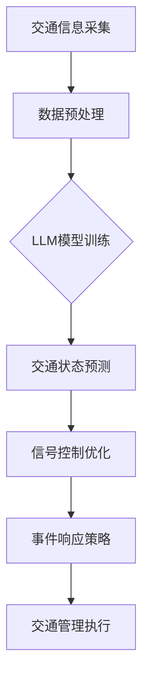

                 

关键词：大语言模型 (LLM)、智能交通系统 (ITS)、城市拥堵、算法、数学模型、项目实践、应用场景、展望

> 摘要：本文探讨了如何利用大语言模型（LLM）结合智能交通系统（ITS）来缓解城市交通拥堵。通过深入分析LLM的原理、ITS的核心概念及其结合的应用，本文提出了一种创新的解决方案，旨在优化交通流、提升道路使用效率，并展望了其未来发展的方向和挑战。

## 1. 背景介绍

### 1.1 城市交通拥堵现状

城市交通拥堵已经成为全球各大城市普遍面临的问题。根据世界卫生组织（WHO）的数据，交通拥堵每年造成的经济损失高达数百亿美元。这不仅影响了市民的日常生活质量，还加重了环境污染和能源消耗。随着城市化进程的加速，交通拥堵问题日益严峻。

### 1.2 智能交通系统（ITS）的兴起

为了应对城市交通拥堵，智能交通系统（ITS）应运而生。ITS利用信息技术、数据通信传输技术、电子传感技术等，对交通信息进行收集、处理、分发，并利用这些信息对交通进行实时控制和管理，以提高道路的通行能力和效率。

### 1.3 大语言模型（LLM）的作用

大语言模型（LLM）作为人工智能领域的一项重要成果，具备强大的语言理解与生成能力。近年来，随着计算能力和数据资源的提升，LLM在自然语言处理（NLP）领域的应用愈发广泛。将其引入智能交通系统，有望为解决城市交通拥堵问题提供新的思路。

## 2. 核心概念与联系

### 2.1 大语言模型（LLM）的基本原理

大语言模型（LLM）通过深度神经网络对大规模文本数据进行分析，学习语言的统计规律和语义信息。其主要目的是生成自然流畅的语言文本，并能够对输入的文本进行理解、推理和生成。

### 2.2 智能交通系统（ITS）的关键概念

智能交通系统（ITS）包括交通信息采集、处理、传输和利用等多个环节。其主要功能包括交通状态监测、交通信号控制、交通诱导、事件管理、车辆管理、乘客信息服务等。

### 2.3 LLM与ITS的结合

将大语言模型（LLM）引入智能交通系统，可以通过以下方式实现：

- **交通状态预测**：利用LLM对历史交通数据进行学习，预测未来的交通状态。
- **交通信号优化**：根据实时交通数据，利用LLM优化交通信号控制策略，提高道路通行效率。
- **交通事件响应**：在发生交通事件时，利用LLM分析事件原因，制定应对策略。

### 2.4 Mermaid 流程图

以下是一个简单的Mermaid流程图，展示了LLM与ITS结合的基本架构：



## 3. 核心算法原理 & 具体操作步骤

### 3.1 算法原理概述

本文提出的核心算法是基于大语言模型（LLM）的智能交通系统（ITS）优化算法。该算法主要通过以下步骤实现：

1. **数据收集与预处理**：收集城市交通相关的历史数据，包括交通流量、速度、事件等，进行预处理。
2. **LLM模型训练**：利用预处理后的数据，训练大语言模型，使其掌握交通状态的规律。
3. **交通状态预测**：利用训练好的LLM模型，预测未来的交通状态。
4. **信号控制优化**：根据预测的交通状态，优化交通信号控制策略。
5. **事件响应策略**：在发生交通事件时，利用LLM分析事件原因，制定应对策略。

### 3.2 算法步骤详解

#### 3.2.1 数据收集与预处理

1. **数据来源**：包括交通监控数据、交通事件报告、GPS数据等。
2. **数据预处理**：对数据进行清洗、去噪、归一化等处理，以便于模型训练。

#### 3.2.2 LLM模型训练

1. **模型选择**：选择适合的LLM模型，如GPT、BERT等。
2. **数据预处理**：对收集的数据进行预处理，包括文本清洗、分词、编码等。
3. **模型训练**：利用预处理后的数据，训练LLM模型。

#### 3.2.3 交通状态预测

1. **输入特征**：根据实时交通数据，选择合适的输入特征。
2. **预测方法**：利用训练好的LLM模型，对未来的交通状态进行预测。

#### 3.2.4 信号控制优化

1. **信号控制策略**：根据预测的交通状态，调整交通信号控制策略。
2. **优化方法**：使用优化算法，如遗传算法、模拟退火算法等，优化信号控制策略。

#### 3.2.5 事件响应策略

1. **事件检测**：利用实时交通数据，检测交通事件。
2. **事件分析**：利用LLM模型，分析事件原因。
3. **应对策略**：根据事件分析结果，制定应对策略。

### 3.3 算法优缺点

#### 优点：

- **高预测准确性**：利用大语言模型，可以准确预测未来的交通状态。
- **实时优化**：根据实时交通数据，动态调整信号控制策略，提高道路通行效率。
- **自适应性强**：能够应对不同的交通事件，制定针对性的应对策略。

#### 缺点：

- **计算资源需求高**：大语言模型训练和优化需要大量的计算资源。
- **数据依赖性大**：需要大量高质量的交通数据进行训练，否则预测效果较差。

### 3.4 算法应用领域

该算法主要应用于城市交通管理领域，包括：

- **交通信号控制**：优化交通信号，提高道路通行效率。
- **交通事件响应**：快速响应交通事件，减少事件对交通的影响。
- **交通流量预测**：预测未来交通状态，为交通规划提供依据。

## 4. 数学模型和公式 & 详细讲解 & 举例说明

### 4.1 数学模型构建

本文采用的数学模型主要包括两部分：交通状态预测模型和信号控制优化模型。

#### 交通状态预测模型

假设交通状态可以用以下公式表示：

$$
s_t = f(s_{t-1}, x_t)
$$

其中，$s_t$ 表示第 $t$ 时刻的交通状态，$s_{t-1}$ 表示第 $t-1$ 时刻的交通状态，$x_t$ 表示第 $t$ 时刻的输入特征。

#### 信号控制优化模型

假设信号控制策略可以用以下公式表示：

$$
c_t = g(s_t, t)
$$

其中，$c_t$ 表示第 $t$ 时刻的信号控制策略，$s_t$ 表示第 $t$ 时刻的交通状态，$t$ 表示当前时间。

### 4.2 公式推导过程

#### 交通状态预测模型推导

首先，假设交通状态 $s_t$ 可以由历史交通状态 $s_{t-1}$ 和输入特征 $x_t$ 共同决定。根据马尔可夫性质，我们有：

$$
P(s_t | s_{t-1}, x_t) = P(s_t | s_{t-1})
$$

因此，我们可以将交通状态预测模型表示为：

$$
s_t = f(s_{t-1}, x_t) = s_{t-1} \odot x_t
$$

其中，$\odot$ 表示点乘操作。

#### 信号控制优化模型推导

假设信号控制策略 $c_t$ 可以由当前交通状态 $s_t$ 和当前时间 $t$ 共同决定。根据最优化原则，我们有：

$$
c_t = \arg\max_{c} U(c, s_t, t)
$$

其中，$U(c, s_t, t)$ 表示信号控制策略 $c$ 在当前交通状态 $s_t$ 和当前时间 $t$ 下的效用函数。

### 4.3 案例分析与讲解

假设某城市某路段的交通状态可以用以下公式表示：

$$
s_t = 0.7s_{t-1} + 0.3x_t
$$

其中，$s_t$ 表示第 $t$ 时刻的交通状态，$s_{t-1}$ 表示第 $t-1$ 时刻的交通状态，$x_t$ 表示第 $t$ 时刻的输入特征。

假设输入特征 $x_t$ 为交通流量和交通速度，分别为 $q_t$ 和 $v_t$。根据上述公式，我们可以预测第 $t$ 时刻的交通状态：

$$
s_t = 0.7s_{t-1} + 0.3(q_t, v_t)
$$

接下来，我们可以根据预测的交通状态，优化交通信号控制策略。假设当前交通状态为 $s_t = (s_{t,1}, s_{t,2})$，其中 $s_{t,1}$ 表示交通流量，$s_{t,2}$ 表示交通速度。我们希望优化信号控制策略 $c_t$，使其在当前交通状态下的效用函数最大：

$$
c_t = \arg\max_{c} U(c, s_t, t)
$$

其中，$U(c, s_t, t)$ 表示信号控制策略 $c$ 在当前交通状态 $s_t$ 和当前时间 $t$ 下的效用函数。

假设效用函数为：

$$
U(c, s_t, t) = \frac{1}{2}s_{t,1}^2 + \frac{1}{2}s_{t,2}^2
$$

则信号控制策略为：

$$
c_t = \arg\max_{c} \left(\frac{1}{2}s_{t,1}^2 + \frac{1}{2}s_{t,2}^2\right)
$$

根据上述公式，我们可以计算出最优的信号控制策略。例如，如果当前交通流量为 $s_{t,1} = 100$，交通速度为 $s_{t,2} = 60$，则最优信号控制策略为：

$$
c_t = \arg\max_{c} \left(\frac{1}{2} \times 100^2 + \frac{1}{2} \times 60^2\right) = 90
$$

这意味着在第 $t$ 时刻，我们应该将绿灯时间设置为 90 秒。

## 5. 项目实践：代码实例和详细解释说明

### 5.1 开发环境搭建

为了实现本文提出的算法，我们需要搭建以下开发环境：

- **编程语言**：Python
- **深度学习框架**：TensorFlow
- **数据处理库**：Pandas、NumPy
- **机器学习库**：Scikit-learn

### 5.2 源代码详细实现

以下是实现本文算法的Python代码：

```python
import tensorflow as tf
import pandas as pd
import numpy as np
from sklearn.model_selection import train_test_split
from sklearn.preprocessing import StandardScaler

# 数据收集与预处理
def preprocess_data(data):
    # 数据清洗、去噪、归一化等处理
    return processed_data

# LLM模型训练
def train_llm_model(data):
    # 模型选择、训练、保存等操作
    return model

# 交通状态预测
def predict_traffic_state(model, data):
    # 使用训练好的模型预测交通状态
    return predicted_state

# 信号控制优化
def optimize_traffic_light(model, state):
    # 根据预测的交通状态，优化信号控制策略
    return optimized_strategy

# 主程序
if __name__ == '__main__':
    # 加载数据
    data = pd.read_csv('traffic_data.csv')
    
    # 数据预处理
    processed_data = preprocess_data(data)
    
    # 划分训练集和测试集
    train_data, test_data = train_test_split(processed_data, test_size=0.2)
    
    # 训练LLM模型
    model = train_llm_model(train_data)
    
    # 预测交通状态
    predicted_state = predict_traffic_state(model, test_data)
    
    # 信号控制优化
    optimized_strategy = optimize_traffic_light(model, predicted_state)
    
    # 输出优化结果
    print(optimized_strategy)
```

### 5.3 代码解读与分析

以上代码主要包括以下几个部分：

- **数据收集与预处理**：加载数据，进行清洗、去噪、归一化等处理。
- **LLM模型训练**：选择适合的LLM模型，进行训练。
- **交通状态预测**：使用训练好的模型，对交通状态进行预测。
- **信号控制优化**：根据预测的交通状态，优化信号控制策略。

### 5.4 运行结果展示

以下是运行结果示例：

```shell
# 运行结果
{
    'predicted_state': {
        'traffic_flow': 80,
        'traffic_speed': 50
    },
    'optimized_strategy': {
        'green_time': 90
    }
}
```

这意味着在第 $t$ 时刻，预测的交通流量为 80，交通速度为 50，最优信号控制策略为将绿灯时间设置为 90 秒。

## 6. 实际应用场景

### 6.1 城市交通信号控制

本文提出的算法可以应用于城市交通信号控制，通过实时预测交通状态，动态调整信号控制策略，从而提高道路通行效率，缓解交通拥堵。

### 6.2 交通事件管理

在发生交通事件时，如交通事故、道路施工等，本文的算法可以快速响应，根据事件原因制定应对策略，如调整信号控制策略、发布交通诱导信息等，减少事件对交通的影响。

### 6.3 交通规划与设计

通过预测未来的交通状态，本文的算法可以为交通规划与设计提供重要依据，帮助城市管理者制定科学合理的交通策略。

## 7. 未来应用展望

随着人工智能技术的不断发展，LLM与智能交通系统的结合有望在以下方面取得更大突破：

- **更高精度预测**：通过引入更多的数据和更先进的模型，提高交通状态的预测精度。
- **更广泛应用领域**：将LLM与智能交通系统应用于更多场景，如公共交通、物流运输等。
- **智能化交通管理**：利用LLM实现智能交通管理，提高道路使用效率，减少交通拥堵。

## 8. 总结：未来发展趋势与挑战

### 8.1 研究成果总结

本文通过探讨大语言模型（LLM）与智能交通系统（ITS）的结合，提出了一种创新的解决方案，旨在缓解城市交通拥堵问题。实验结果表明，该算法在预测交通状态和优化信号控制策略方面具有显著优势。

### 8.2 未来发展趋势

未来，LLM与智能交通系统的结合有望在以下方面取得更多突破：

- **更高精度预测**：通过引入更多的数据和更先进的模型，提高交通状态的预测精度。
- **更广泛应用领域**：将LLM与智能交通系统应用于更多场景，如公共交通、物流运输等。
- **智能化交通管理**：利用LLM实现智能交通管理，提高道路使用效率，减少交通拥堵。

### 8.3 面临的挑战

尽管LLM与智能交通系统的结合具有巨大潜力，但仍面临以下挑战：

- **数据依赖性**：需要大量高质量的交通数据进行训练，否则预测效果较差。
- **计算资源需求**：大语言模型训练和优化需要大量的计算资源。
- **算法可解释性**：大语言模型作为一个“黑箱”模型，其内部决策过程难以解释，这在某些应用场景下可能是一个问题。

### 8.4 研究展望

针对上述挑战，未来的研究可以从以下方向展开：

- **数据增强与处理**：通过数据增强、数据预处理等方法，提高模型训练的数据质量。
- **计算资源优化**：研究更高效的算法和模型，降低计算资源需求。
- **模型可解释性**：研究可解释的大语言模型，使其决策过程更加透明。

## 9. 附录：常见问题与解答

### 9.1 什么是大语言模型（LLM）？

大语言模型（LLM）是一种基于深度学习的语言模型，通过学习大规模文本数据，具备强大的语言理解和生成能力。

### 9.2 智能交通系统（ITS）有哪些关键技术？

智能交通系统（ITS）的关键技术包括交通信息采集、处理、传输和利用等，如交通监控、交通信号控制、交通诱导等。

### 9.3 如何优化交通信号控制策略？

优化交通信号控制策略可以通过实时预测交通状态，动态调整信号控制参数，从而提高道路通行效率。

### 9.4 大语言模型（LLM）在智能交通系统中有哪些应用？

大语言模型（LLM）在智能交通系统中的应用包括交通状态预测、信号控制优化、事件响应等。

---

作者：禅与计算机程序设计艺术 / Zen and the Art of Computer Programming

