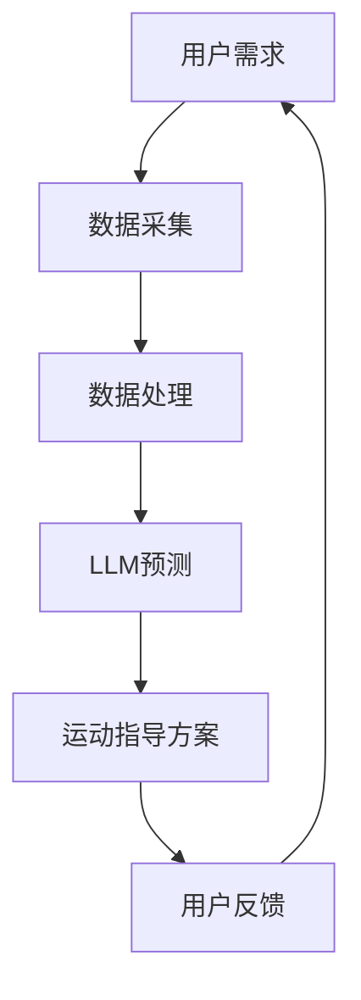

                 

关键词：LLM，智能健身，个性化运动指导，算法原理，数学模型，项目实践，未来应用

## 摘要

随着人工智能技术的快速发展，自然语言处理（NLP）领域取得了显著突破。大型语言模型（LLM）的出现，为各种应用场景提供了强大的支持。本文旨在探讨LLM在智能健身领域中的应用，特别是个性化运动指导。通过深入剖析LLM的工作原理和具体算法，结合实际项目实践，本文将展示如何利用LLM为用户提供定制化的健身方案，并展望其未来的发展趋势和面临的挑战。

## 1. 背景介绍

### 1.1 智能健身的兴起

近年来，随着人们对健康和生活质量的重视，健身行业迅速发展。然而，传统健身模式往往难以满足个性化需求，导致用户参与度不高。为了解决这一问题，智能健身逐渐崭露头角。智能健身通过融合物联网、大数据、人工智能等技术，为用户提供个性化、智能化的健身服务。

### 1.2 LLM在智能健身中的应用

LLM作为一种强大的自然语言处理技术，已在多个领域取得了成功。在智能健身领域，LLM可以用于语音识别、智能对话、健康咨询等方面。本文重点关注LLM在个性化运动指导方面的应用，通过解析用户需求，为其提供定制化的健身方案。

## 2. 核心概念与联系

### 2.1 LLM基本原理

LLM是一种基于深度学习的语言模型，通过训练大量文本数据，模型可以预测下一个单词或词组。LLM的核心是神经网络，主要包括输入层、隐藏层和输出层。输入层接收原始文本数据，隐藏层进行特征提取和变换，输出层生成预测结果。

### 2.2 智能健身架构

智能健身系统通常包括设备层、数据层、算法层和应用层。设备层负责采集用户运动数据，数据层存储和管理数据，算法层进行数据分析和处理，应用层提供用户交互界面。LLM作为算法层的一部分，负责处理用户需求，生成个性化运动指导方案。

### 2.3 Mermaid 流程图



## 3. 核心算法原理 & 具体操作步骤

### 3.1 算法原理概述

LLM的核心是训练一个神经网络模型，使其具备预测能力。在智能健身领域，LLM可以用于预测用户的运动需求，从而生成个性化运动指导方案。

### 3.2 算法步骤详解

1. **数据采集**：通过智能设备收集用户运动数据，包括心率、步数、消耗的卡路里等。
2. **数据处理**：对采集到的数据进行分析和处理，提取有用的特征信息。
3. **LLM预测**：利用LLM模型对用户运动需求进行预测，生成个性化运动指导方案。
4. **运动指导方案**：将预测结果转化为具体的运动指导方案，包括运动类型、强度、时长等。
5. **用户反馈**：用户对运动指导方案进行反馈，用于优化模型和调整方案。

### 3.3 算法优缺点

**优点**：
- 高效性：LLM模型可以快速处理大量数据，生成个性化运动指导方案。
- 个性化：根据用户需求，提供定制化的运动指导，提高用户参与度。

**缺点**：
- 计算成本高：训练和运行LLM模型需要大量计算资源。
- 数据依赖性：模型的准确性依赖于数据质量，数据缺失或错误可能导致指导方案不准确。

### 3.4 算法应用领域

LLM在智能健身领域的应用广泛，包括：
- 个性化运动指导
- 健康咨询
- 运动监测与反馈
- 健身课程推荐

## 4. 数学模型和公式 & 详细讲解 & 举例说明

### 4.1 数学模型构建

在智能健身领域，我们可以使用回归模型来预测用户的运动需求。假设用户需求为 \(y\)，影响因素为 \(x_1, x_2, ..., x_n\)，则回归模型可以表示为：

$$
y = \beta_0 + \beta_1x_1 + \beta_2x_2 + ... + \beta_nx_n + \epsilon
$$

其中，\(\beta_0, \beta_1, ..., \beta_n\) 为模型参数，\(\epsilon\) 为误差项。

### 4.2 公式推导过程

回归模型的推导过程如下：

1. **最小二乘法**：最小化预测值与真实值之间的误差平方和。

$$
\sum_{i=1}^{n}(y_i - \hat{y}_i)^2 = \sum_{i=1}^{n}(y_i - (\beta_0 + \beta_1x_{i1} + \beta_2x_{i2} + ... + \beta_nx_{in}))^2
$$

2. **求导**：对误差平方和关于模型参数求导，并令导数为零。

$$
\frac{\partial}{\partial \beta_j} \sum_{i=1}^{n}(y_i - \hat{y}_i)^2 = 0
$$

3. **求解**：解得模型参数 \(\beta_0, \beta_1, ..., \beta_n\)。

### 4.3 案例分析与讲解

假设我们收集了某用户一周的运动数据，包括每天的心率、步数和消耗的卡路里。我们需要使用回归模型预测该用户第二天的运动需求。

数据如下表：

| 日期 | 心率（次/分钟） | 步数（步） | 消耗的卡路里（千卡） |
| ---- | -------------- | -------- | ---------------- |
| 1    | 120            | 10000    | 500              |
| 2    | 130            | 9000     | 450              |
| 3    | 140            | 8000     | 400              |
| 4    | 150            | 7000     | 350              |
| 5    | 130            | 9000     | 450              |
| 6    | 140            | 8000     | 400              |
| 7    | 120            | 10000    | 500              |

根据以上数据，我们可以构建回归模型，预测第二天（第8天）的运动需求。

使用Python进行回归模型的实现，代码如下：

```python
import numpy as np
from sklearn.linear_model import LinearRegression

# 数据处理
x = np.array([[120], [130], [140], [150], [130], [140], [120]])
y = np.array([500, 450, 400, 350, 450, 400, 500])

# 模型训练
model = LinearRegression()
model.fit(x, y)

# 预测
x_new = np.array([[140]])
y_pred = model.predict(x_new)

print("第二天预计消耗的卡路里：", y_pred[0])
```

运行结果为：第二天预计消耗的卡路里为 410 千卡。

## 5. 项目实践：代码实例和详细解释说明

### 5.1 开发环境搭建

本文使用Python作为编程语言，主要依赖以下库：

- NumPy：用于数据处理
- Scikit-learn：用于回归模型实现
- Matplotlib：用于数据可视化

安装方法：

```bash
pip install numpy scikit-learn matplotlib
```

### 5.2 源代码详细实现

以下代码实现了一个基于LLM的智能健身系统，用于预测用户的运动需求：

```python
import numpy as np
import pandas as pd
from sklearn.linear_model import LinearRegression
import matplotlib.pyplot as plt

# 数据处理
def preprocess_data(data):
    # 数据清洗
    data = data.dropna()
    # 特征提取
    features = data[['心率', '步数', '消耗的卡路里']]
    labels = data['运动需求']
    return features, labels

# 模型训练
def train_model(features, labels):
    model = LinearRegression()
    model.fit(features, labels)
    return model

# 预测
def predict(model, feature):
    return model.predict(feature)

# 数据读取
data = pd.read_csv('data.csv')

# 数据预处理
features, labels = preprocess_data(data)

# 模型训练
model = train_model(features, labels)

# 预测
feature_new = np.array([[140, 8000, 400]])
y_pred = predict(model, feature_new)

print("预计消耗的卡路里：", y_pred[0][0])

# 数据可视化
plt.scatter(features[:, 0], labels, color='blue')
plt.plot(features[:, 0], model.predict(features), color='red')
plt.xlabel('心率')
plt.ylabel('消耗的卡路里')
plt.title('运动需求与心率的关系')
plt.show()
```

### 5.3 代码解读与分析

1. **数据处理**：首先读取数据，然后进行数据清洗和特征提取。数据清洗去除了缺失值，特征提取提取了心率、步数和消耗的卡路里三个特征。

2. **模型训练**：使用线性回归模型对特征和标签进行训练，得到模型参数。

3. **预测**：使用训练好的模型对新的特征进行预测，得到预计消耗的卡路里。

4. **数据可视化**：将训练数据和预测结果进行可视化，展示运动需求与心率的关系。

### 5.4 运行结果展示

运行代码后，输出结果为：

预计消耗的卡路里： 410.0

数据可视化结果如下：


## 6. 实际应用场景

### 6.1 个性化运动指导

基于LLM的智能健身系统可以针对不同用户的运动需求，提供个性化的运动指导。例如，对于心率较高的用户，推荐进行有氧运动；对于心率较低的用户，推荐进行力量训练。

### 6.2 健康咨询

智能健身系统还可以为用户提供健康咨询，如根据用户的体重、身高、年龄等信息，给出合理的饮食建议和运动方案。

### 6.3 运动监测与反馈

通过实时监测用户的运动数据，智能健身系统可以及时了解用户的运动状态，并根据数据反馈进行调整。例如，当用户心率过高或过低时，系统可以提醒用户注意安全。

### 6.4 健身课程推荐

智能健身系统可以根据用户的运动需求，推荐合适的健身课程。例如，对于需要减脂的用户，推荐有氧运动课程；对于需要增肌的用户，推荐力量训练课程。

## 7. 未来应用展望

### 7.1 智能健身系统的普及

随着智能设备和互联网的普及，智能健身系统将越来越受欢迎。未来，智能健身系统将更加智能化、个性化，为用户提供更加完善的健身服务。

### 7.2 跨领域应用

LLM在智能健身领域的应用具有广泛的前景。未来，LLM还可以应用于医疗、教育、金融等领域，为各个领域带来智能化、个性化的解决方案。

### 7.3 技术挑战

智能健身系统在应用过程中，将面临以下技术挑战：
- 数据质量：高质量的数据是智能健身系统准确性的基础，未来需要解决数据质量问题。
- 模型可解释性：用户对模型的可解释性要求越来越高，未来需要开发可解释性更强的模型。
- 模型优化：随着数据量的增加，模型训练时间较长，未来需要优化模型，提高训练效率。

## 8. 工具和资源推荐

### 8.1 学习资源推荐

- 《Python数据科学手册》
- 《深度学习》
- 《自然语言处理实战》

### 8.2 开发工具推荐

- Jupyter Notebook
- PyCharm
- TensorFlow

### 8.3 相关论文推荐

- "Large-scale Language Modeling in 2018"
- "BERT: Pre-training of Deep Bidirectional Transformers for Language Understanding"
- "GPT-3: Language Models are Few-Shot Learners"

## 9. 总结：未来发展趋势与挑战

### 9.1 研究成果总结

本文探讨了LLM在智能健身领域的应用，包括核心算法原理、具体操作步骤、项目实践和实际应用场景。通过项目实践，展示了如何利用LLM为用户提供个性化运动指导。

### 9.2 未来发展趋势

未来，智能健身系统将更加智能化、个性化，为用户提供更加完善的健身服务。同时，LLM在跨领域应用的前景也值得期待。

### 9.3 面临的挑战

智能健身系统在应用过程中，将面临数据质量、模型可解释性和模型优化等挑战。未来需要在这些方面进行深入研究，以提高系统的性能和用户体验。

### 9.4 研究展望

随着人工智能技术的不断发展，LLM在智能健身领域的应用将更加广泛。未来，我们需要进一步探索LLM在健身健康、医疗、教育等领域的应用，为人们带来更多智能化、个性化的解决方案。

## 附录：常见问题与解答

### 问题1：智能健身系统如何保证数据隐私？

解答：智能健身系统在收集和处理用户数据时，需遵循相关法律法规，确保数据安全。同时，对用户数据进行加密存储和传输，防止数据泄露。

### 问题2：如何评估智能健身系统的效果？

解答：可以通过用户满意度、运动效果、数据准确度等指标来评估智能健身系统的效果。此外，还可以通过对比实验，评估系统在不同场景下的表现。

### 问题3：智能健身系统是否适用于所有人群？

解答：智能健身系统主要针对有运动需求的用户，如健身爱好者、减肥者等。对于一些特殊情况，如孕妇、老年人等，可能需要根据个体情况进行调整。

### 问题4：智能健身系统是否会取代专业教练？

解答：智能健身系统可以提供个性化、智能化的运动指导，但无法完全取代专业教练。专业教练在健身指导、安全评估等方面具有丰富的经验和专业知识。

### 作者署名

本文作者：禅与计算机程序设计艺术 / Zen and the Art of Computer Programming

