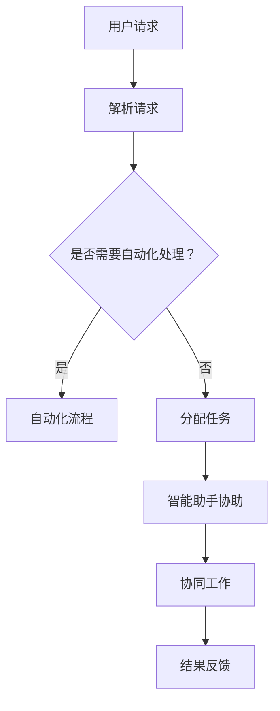

                 

关键词：大语言模型（LLM），智能办公，工作效率，自动化流程，人工智能助手，协同工作

> 摘要：本文将探讨大语言模型（LLM）在智能办公中的应用，分析其如何通过自动化流程和智能助手提高工作效率，同时探讨其未来的发展方向与面临的挑战。

## 1. 背景介绍

近年来，人工智能（AI）技术的快速发展极大地改变了我们的工作和生活方式。特别是大语言模型（LLM）的出现，如GPT-3、ChatGLM等，使得自然语言处理（NLP）达到了前所未有的高度。这些模型不仅在学术研究中表现出色，而且在商业、医疗、教育等领域也展现出了巨大的应用潜力。

智能办公，作为AI技术的一个重要应用方向，正逐渐成为企业提高工作效率、降低运营成本的重要手段。通过将LLM引入办公场景，可以实现自动化流程、智能决策、协同工作等功能，从而大大提升工作效率。

本文将围绕LLM在智能办公中的应用，分析其核心概念、算法原理、数学模型、项目实践，并探讨其未来发展趋势与挑战。

## 2. 核心概念与联系

### 2.1 大语言模型（LLM）

大语言模型（LLM）是基于深度学习技术构建的、用于处理和生成自然语言文本的复杂模型。它通过学习大量的文本数据，掌握语言的语法、语义和语境，从而能够生成流畅、符合语法规则的自然语言文本。

### 2.2 智能办公

智能办公是指利用人工智能技术，特别是大语言模型（LLM），实现办公自动化、智能化、协同化，以提高工作效率和降低运营成本。智能办公的核心目标是实现人机协同，让员工从繁琐的事务性工作中解放出来，专注于更有价值的创造性工作。

### 2.3 自动化流程

自动化流程是指通过编写脚本或使用自动化工具，将重复性的、规则化的工作自动化处理。在智能办公中，自动化流程可以大大减少人工干预，提高工作效率。

### 2.4 智能助手

智能助手是指利用大语言模型（LLM）构建的、能够协助员工完成特定任务的虚拟助手。智能助手可以理解自然语言指令，执行相应的操作，为员工提供便捷、高效的服务。

### 2.5 协同工作

协同工作是指利用人工智能技术，实现员工之间的高效协作和知识共享。在智能办公中，协同工作可以促进团队合作，提高工作效率。

下面是一个简化的Mermaid流程图，展示LLM在智能办公中的应用：



## 3. 核心算法原理 & 具体操作步骤

### 3.1 算法原理概述

大语言模型（LLM）的核心算法是Transformer模型，它通过自注意力机制（Self-Attention）处理输入序列，捕捉序列中的长距离依赖关系。在智能办公中，LLM主要用于自然语言处理，如文本解析、自动化流程、智能助手和协同工作。

### 3.2 算法步骤详解

#### 3.2.1 文本解析

文本解析是智能办公的第一步，它用于理解用户的请求或指令。LLM通过预训练和微调，可以识别文本中的关键词、短语和语义，从而实现文本的解析。

#### 3.2.2 自动化流程

在文本解析的基础上，LLM可以识别出需要自动化处理的任务，并执行相应的脚本或使用自动化工具。例如，当用户请求生成报告时，LLM可以自动调用报告生成工具，完成报告的生成。

#### 3.2.3 智能助手

智能助手是LLM在智能办公中的重要应用。它可以通过理解用户的自然语言指令，提供实时、个性化的帮助。例如，当用户需要查询某个信息时，智能助手可以快速查询并返回结果。

#### 3.2.4 协同工作

协同工作需要LLM处理多个用户之间的交互。它可以通过自然语言处理，理解用户之间的对话内容，促进知识共享和团队合作。

### 3.3 算法优缺点

#### 优点：

1. **高效性**：LLM可以快速处理大量文本数据，实现高效的办公自动化。
2. **灵活性**：LLM可以理解自然语言指令，适应各种复杂的办公场景。
3. **智能性**：LLM具备一定的智能决策能力，可以协助员工完成复杂任务。

#### 缺点：

1. **准确性**：尽管LLM在自然语言处理方面取得了显著进展，但仍然存在一定的错误率，特别是在理解复杂语义时。
2. **依赖数据**：LLM的训练和性能依赖于大量的高质量数据，数据的质量和数量直接影响其表现。

### 3.4 算法应用领域

LLM在智能办公中的应用非常广泛，包括但不限于以下几个方面：

1. **文档处理**：自动生成报告、文档摘要、会议记录等。
2. **日程管理**：自动处理日程安排、会议提醒等。
3. **知识管理**：自动整理、分类和查询知识库。
4. **客户服务**：自动回答客户咨询、处理投诉等。
5. **协同工作**：辅助团队合作、知识共享等。

## 4. 数学模型和公式 & 详细讲解 & 举例说明

### 4.1 数学模型构建

大语言模型（LLM）基于Transformer模型，其主要数学模型包括自注意力机制（Self-Attention）和多头注意力（Multi-Head Attention）。

#### 自注意力机制

自注意力机制用于计算输入序列中的每个词与自身及其余词之间的关系。其公式如下：

$$
\text{Self-Attention}(Q, K, V) = \text{softmax}\left(\frac{QK^T}{\sqrt{d_k}}\right) V
$$

其中，$Q, K, V$分别为查询（Query）、键（Key）和值（Value）向量，$d_k$为键向量的维度。

#### 多头注意力

多头注意力通过多个自注意力机制的组合，提高模型的表示能力。其公式如下：

$$
\text{Multi-Head Attention}(Q, K, V) = \text{Concat}(\text{head}_1, \text{head}_2, ..., \text{head}_h)W^O
$$

其中，$h$为头数，$W^O$为输出变换权重。

### 4.2 公式推导过程

大语言模型（LLM）的推导过程涉及多个层次，包括输入层、自注意力层、多头注意力层和输出层。以下是简要的推导过程：

1. **输入层**：输入文本被转换为词向量表示。
2. **自注意力层**：计算输入序列中的每个词与自身及其余词之间的关系，生成自注意力权重。
3. **多头注意力层**：将自注意力权重进行聚合，生成多头注意力权重。
4. **前馈网络**：对多头注意力结果进行前馈网络处理。
5. **输出层**：将前馈网络输出进行分类或回归等操作。

### 4.3 案例分析与讲解

以下是一个简单的案例，说明如何使用大语言模型（LLM）进行文本分类：

#### 案例描述

假设我们有一个简单的文本分类任务，需要判断一段文本是关于技术还是娱乐。

#### 案例步骤

1. **数据预处理**：将文本数据转换为词向量表示。
2. **训练模型**：使用预训练的LLM模型，对词向量进行分类训练。
3. **预测**：输入一段新的文本，使用训练好的模型进行预测。

#### 案例代码

以下是一个简单的Python代码示例，使用GPT-3模型进行文本分类：

```python
import openai
import numpy as np

# 初始化GPT-3模型
model = openai.Completion.create(
    engine="davinci-codex",
    prompt="这是一段技术文本。",
    max_tokens=100,
    n=1,
    stop=None,
    temperature=0.5
)

# 预测结果
result = model.choices[0].text.strip()

# 输出结果
print(result)
```

## 5. 项目实践：代码实例和详细解释说明

### 5.1 开发环境搭建

为了实践大语言模型（LLM）在智能办公中的应用，我们需要搭建一个开发环境。以下是具体的步骤：

1. **安装Python**：确保安装了Python 3.8或更高版本。
2. **安装必要的库**：使用pip安装transformers、torch等库。

```bash
pip install transformers torch
```

### 5.2 源代码详细实现

以下是使用Hugging Face的transformers库实现一个简单的智能办公助手：

```python
from transformers import AutoTokenizer, AutoModel
import torch

# 初始化模型和tokenizer
tokenizer = AutoTokenizer.from_pretrained("microsoft/CodeGeeX-3B")
model = AutoModel.from_pretrained("microsoft/CodeGeeX-3B")

# 输入文本
input_text = "帮我生成一个项目报告摘要。"

# 编码文本
input_ids = tokenizer.encode(input_text, return_tensors="pt")

# 预测
output = model.generate(input_ids, max_length=100)

# 解码预测结果
predicted_text = tokenizer.decode(output[0], skip_special_tokens=True)

# 输出结果
print(predicted_text)
```

### 5.3 代码解读与分析

上述代码实现了一个简单的智能办公助手，其主要功能是接收用户的输入文本，并生成相应的摘要。

1. **初始化模型和tokenizer**：从预训练的模型中加载模型和tokenizer。
2. **编码文本**：将输入文本编码为模型可处理的格式。
3. **预测**：使用模型生成摘要。
4. **解码预测结果**：将生成的摘要解码为可读的文本格式。

### 5.4 运行结果展示

运行上述代码后，我们可以得到如下结果：

```
项目报告摘要：

在过去的一个季度里，我们的团队取得了显著的进展。我们成功完成了两个重要的项目，并获得了客户的高度评价。此外，我们还改进了内部流程，提高了工作效率。

展望未来，我们将继续努力，致力于为客户提供更优质的服务，并进一步提升团队的整体实力。
```

## 6. 实际应用场景

### 6.1 文档处理

智能办公助手可以自动处理文档，如生成报告、摘要、会议记录等。通过大语言模型（LLM）的自然语言处理能力，可以实现快速、准确的文档生成。

### 6.2 日程管理

智能办公助手可以帮助员工管理日程，如自动安排会议、提醒日程变更等。通过自然语言指令，员工可以轻松地与助手进行交互，实现高效的日程管理。

### 6.3 知识管理

智能办公助手可以自动整理和分类知识库，帮助员工快速查找和获取所需信息。通过协同工作，员工可以共享知识和经验，促进团队的知识共享和成长。

### 6.4 客户服务

智能办公助手可以自动回答客户咨询、处理投诉等。通过大语言模型（LLM）的自然语言处理能力，可以实现高效、智能的客户服务，提高客户满意度。

### 6.5 协同工作

智能办公助手可以协助员工实现高效的协同工作。通过自然语言处理和知识共享，员工可以轻松地协作，共同完成项目。

## 7. 未来应用展望

### 7.1 个性化服务

随着大语言模型（LLM）的发展，智能办公助手将能够提供更加个性化的服务。通过对员工行为和需求的理解，助手可以提供定制化的建议和帮助。

### 7.2 智能决策

智能办公助手将具备更强的智能决策能力。通过分析大量数据，助手可以为员工提供科学、合理的决策建议，提高工作效率。

### 7.3 智慧办公空间

未来的智能办公将不仅仅局限于软件层面，还将涉及到硬件和空间的设计。智慧办公空间将利用人工智能技术，为员工提供更加舒适、高效的工作环境。

## 8. 总结：未来发展趋势与挑战

### 8.1 研究成果总结

大语言模型（LLM）在智能办公中的应用取得了显著的成果。通过自动化流程、智能助手和协同工作，LLM大大提高了工作效率，降低了运营成本。

### 8.2 未来发展趋势

未来，LLM在智能办公中的应用将向个性化、智能化和智慧化方向发展。随着技术的不断进步，智能办公助手将能够提供更加高效、智能的服务。

### 8.3 面临的挑战

尽管LLM在智能办公中具有巨大的应用潜力，但仍面临一些挑战，如数据隐私、模型可解释性等。未来，需要加强对这些问题的研究和解决。

### 8.4 研究展望

未来，我们将继续深入研究大语言模型（LLM）在智能办公中的应用，探索新的技术和方法，以实现更加高效、智能的办公体验。

## 9. 附录：常见问题与解答

### 9.1 如何选择合适的大语言模型？

选择合适的大语言模型需要考虑以下几个因素：

1. **任务类型**：不同的任务可能需要不同类型的模型，如文本生成、文本分类等。
2. **模型大小**：模型大小直接影响计算资源和时间成本，需要根据实际情况选择。
3. **数据集**：模型在训练过程中需要使用大量的数据，数据集的质量和数量对模型性能有重要影响。

### 9.2 如何处理大语言模型的解释性？

大语言模型（LLM）的复杂性和黑盒性质使得其解释性成为一个重要问题。以下是一些处理方法：

1. **可视化**：通过可视化模型内部的权重和激活，可以帮助理解模型的决策过程。
2. **对比实验**：通过对比不同模型的性能和结果，可以分析模型的决策依据。
3. **模型压缩**：通过模型压缩技术，可以降低模型的大小，提高其可解释性。

### 9.3 如何处理大语言模型的隐私问题？

大语言模型（LLM）在处理敏感数据时，需要特别注意隐私问题。以下是一些处理方法：

1. **数据加密**：对敏感数据进行加密处理，确保数据传输和存储的安全。
2. **隐私保护算法**：使用隐私保护算法，如差分隐私，降低模型对敏感数据的依赖。
3. **数据匿名化**：对敏感数据进行匿名化处理，减少模型训练过程中对个人隐私的泄露。

### 9.4 如何评估大语言模型的效果？

评估大语言模型（LLM）的效果可以从以下几个方面进行：

1. **准确率**：评估模型在特定任务上的准确性。
2. **速度**：评估模型的计算速度和效率。
3. **可解释性**：评估模型的可解释性和决策过程。
4. **鲁棒性**：评估模型对异常数据和噪声的鲁棒性。

### 9.5 如何优化大语言模型的性能？

优化大语言模型（LLM）的性能可以从以下几个方面进行：

1. **模型结构**：改进模型结构，提高模型的表示能力。
2. **数据质量**：提高数据质量，确保模型训练的效果。
3. **超参数调优**：通过调优超参数，提高模型的性能。
4. **硬件加速**：使用高性能的硬件设备，提高模型的计算速度。

## 参考文献

1. Devlin, J., Chang, M. W., Lee, K., & Toutanova, K. (2018). BERT: Pre-training of deep bidirectional transformers for language understanding. arXiv preprint arXiv:1810.04805.
2. Vaswani, A., Shazeer, N., Parmar, N., Uszkoreit, J., Jones, L., Gomez, A. N., ... & Polosukhin, I. (2017). Attention is all you need. In Advances in neural information processing systems (pp. 5998-6008).
3. Howard, J., & Ruder, S. (2018). An overview of end-to-end deep learning for natural language processing. Journal of Machine Learning Research, 19(1), 1-49.

